# Agent Harness 如何接入 RL：2026 年开源基础设施的真实架构版图

一个多月前有个朋友问了我一个问题：把 Claude Code 的 `base_url` 换成你的训练 proxy，是不是就能直接 RL 了？我当时吞吞吐吐，因为答案一半是「可以」，一半是「不行」：可以的部分是，2026 年的开源生态里，已经有一整条路线把现成 agent harness 保留自己的执行循环、只在 LLM API 边界接入训练基础设施；不行的部分是，光有 proxy 并不能证明训练用的生成 token、条件上下文、调用归属、奖励归属和策略版本与真实执行过程一致，后者才是这套架构真正的成本所在，也是我在 2026 年 9 月 9 日这个检索口径下逐个翻源码时最深的感触。

先说结论再展开：我核对下来的分布是，**在受支持配置下确认具有 API 边界捕获及训练接入链路的核心项目/组合有 10 个**（Agent Lightning、AReaL、slime 外部 agent 模式、Uni-Agent + verl、rLLM、Dressage + slime、Polar + slime、AgentJet Swarm、PRIME-RL + verifiers v1、NeMo Gym 外部 harness 捕获），**部分匹配或完整闭环证据仍有边界的有 4 个**（Turnstile、OpenRLHF 的 OpenAI server 示例、OpenClaw-RL 已查代理路径、MetaClaw 已查 RL 路径），另外还有 2 个复用已有集成层的组合和 6 个非代理对照。这个数字只代表本文审计清单内的分类，不是全网项目总数；「核心匹配」也不等于每个能力都支持，比如 AgentJet 必须区分 token 匹配与默认文本匹配，PRIME-RL 必须区分训练接口与评测接口，NeMo Gym 当前交付的是一条验证过的调用链而不是完整 subagent 调用树。这些限定会在正文里逐条落实。

本文是官方资料与源码的静态审计，没有跑这些项目的 GPU 训练，也没有复测吞吐、收敛或故障恢复；所有源码引用都锁定在本地复核过的 commit 上，fork 仓库（AReaL、slime、verl）的核对口径我在文末「差异与裁决」里写清楚了。路线如下：

1. 两种所有权模型与三种集成边界，说明为什么这是系统问题而不是「再写一个 agent adapter」。
2. API 边界的调用元组、重分词漂移与两个可靠方向，说明为什么「保存了 token」仍然不够。
3. 十个候选与四个反例的实现版图，逐个给代码链、亮点与边界。
4. 捕捉之后真正的工程问题：分段、奖励分组、policy version、streaming、retry，以及沿一条验收链如何做选型。

照惯例，感谢群里一起抬杠的大哥们，尤其感谢把这些项目先做出来的作者们：他们的取舍让「证明训练轨迹正确」这件事第一次有了可以逐行对照的实现，这篇笔记才有得写。

## 1. 所有权：harness 与训练引擎，谁握着这一局

### 1.1 harness 不是调用模型的那几行代码

先定义本文讨论的对象。这里说的 **agent harness**，指围绕模型运行的那套控制系统：它决定上下文如何构造、工具如何执行、失败如何恢复、历史何时压缩、子 agent 怎么启动、任务何时结束。它可以是 `claude` 命令行、`codex exec`、mini-swe-agent 这样的 Python 包，也可以是 LangChain 里的一串编排代码；关键是，训练时你想优化的对象其实是「模型 + 这套状态转移规则」的组合，而不是模型本身。

这个区分的意义在于，下面两个程序即使使用同一个模型，也大概率不是同一个训练对象：

```text
部署：原生 CLI → 原生 context management → 原生 tool loop → 原生 compaction
训练：自写 ReAct loop → 简化历史拼接 → 重新实现工具 → 固定步数结束
```

部署侧 harness 的上下文策略、工具 schema、压缩时机都构成了模型实际观察到的分布；训练侧换了一套更简单的循环，等于把模型放进一个不同的环境里训练，学到的「如何行动」自然对不上部署时的行为。Agent Lightning v1.0 的论文把这套说法定义为 **harnessed agentic RL**：部署时用到的 harness 直接参与 post-training，训练引擎通过服务边界观察并优化它产出的模型调用，而不是把 harness 的 agent loop 在训练框架里重写一遍（[Luo et al. 2026](https://arxiv.org/html/2608.17528v1)）。

由此可以推导出一个重点结论：

> **模型权重相同，不代表训练过程与部署过程相同；agent 的状态转移规则本身就是训练分布的一部分。**

反过来也要注意：保留同一个 CLI，仍不自动保证训练与部署完全一致。训练 proxy 可能覆盖采样参数、替换模型、转换 API 格式，甚至在请求里补一条默认 system message，这些都会改变下一轮实际使用的 token 前缀。我在 Agent Lightning（`prepare_body` 强制覆盖 temperature）、AgentJet（请求路径会插入 `"You are a helpful assistant, your name is AgentJet."` 的默认 system message）和 NeMo Gym（exact-prefix supply 需要推理后端配合）里都看到了需要在审计时明确列出的这类行为，后面逐个展开。

### 1.2 两种所有权，以及第三种情况

按「谁拥有 agent loop」可以把现有训练架构切成两类。

第一种是 **RL framework 拥有 agent loop**：trainer 自己跑 generate、解析 tool call、调环境、拼上下文、决定下一轮。优势是训练系统直接掌握 token、mask、环境状态和步级奖励；verl 原生 `AgentLoopBase`、OpenRLHF 的多轮执行器、ROLL 的 Agentic Pipeline 都是这类可控执行接口。我把这种对照画在 [Agent Lightning 论文 Figure 2](https://arxiv.org/html/2608.17528v1) 里，它同时给出了两种路线的差别：传统 agentic RL 里模型输入是一条连续扩展的 token 历史，状态是环境状态，agent 是单个 ReAct agent；harnessed agentic RL 里模型看到的是每次调用独立的 prompt，状态是 harness + 环境，agent 可以是多 agent、subagent 加 handoff。

第二种是 **原生 harness 拥有 agent loop**：trainer 只负责注册任务、回收轨迹，harness 在沙箱里跑自己的循环，模型调用全部经过一个训练感知的 gateway/proxy，proxy 在转发的同时记录 token 级数据，下游再由一个把调用序列转换成训练表示的组件来组织训练数据。我在本文里把这个转换组件称为 **trajectory compiler**，它是一个解释性名称：不同项目分别叫 rollout adapter（Agent Lightning）、trajectory manager（slime）、builder/adapter（Polar）、trace graph 与 TrainClient（verifiers）、token_id_capture consumer（NeMo Gym）。

第三种情况是本次核查中最值得纠正的分类误区：**有自定义 rollout function 不等于重写了 agent loop**。slime 的 coding_agent_rl 示例就是典型：它的 `generate()` 创建沙箱、安装 CLI、注入 proxy 端点、等待 CLI 退出、执行 verifier，看起来符合某个 RL framework 的 rollout 契约，但 CLI 内部的 agent loop 完全由 CLI 自己掌握。Uni-Agent 的 runner 管理任务生命周期，也不需要重写原生 agent 状态机。所以评估必须拆成两个问题：外层训练集成代码需要多少？内层 harness 控制流被改动了多少？单一 L0-L4 等级无法同时表达这两件事，这个拆分在第十一章的接入成本表里会真正落地。

Polar 论文的 Figure 2 把这两种路线的差别画得更直白：左边是传统方式，把 harness 拆成 sys prompt、tool-call、multi-agent、context engineering、cron jobs 这些组件，逐个映射到框架的 env API 上，中间还画了一个大大的问号，意思是这些组件和 `env.step()` 之间的对应关系根本没人说得清；右边是 Polar 的方式，harness 作为黑盒原样运行，proxy 在 API 边界 listen、记录、重建轨迹（[Xu et al. 2026](https://arxiv.org/html/2605.24220v1)）。

<div style="text-align: center;">
  
</div>
图注：Polar 论文 Figure 2：用 model API proxy 作为 rollout 边界，左右对比「harness 拆成组件接入框架环境」与「harness 保持黑盒、在 API 边界监听重建」。来源：Polar (arXiv 2605.24220v1)。

### 1.3 三种集成边界其实是所有权谱系

如果把「谁拥有 loop」看成一个连续谱，那么现有项目落在这三个位置：

| 路线 | 集成边界 | 主要代价 |
| --- | --- | --- |
| SDK/tracing 集成 | 模型客户端、callback、decorator、框架 hook | 需要可修改或可插桩的 agent 代码 |
| 自定义 executor/rollout workflow | `run()`、`execute()`、`rollout()` | 需要实现框架契约；是否重写 agent loop 取决于适配方式 |
| RL-native 环境循环 | `reset/step`、工具接口、环境状态 | 成熟 harness 的控制流可能需要迁移或重建 |

OpenPipe ART 的 LangGraph 集成是 SDK 路线的代表：`art.langgraph.init_chat_model` 替换模型客户端，`wrap_rollout` 包装整个 rollout，用户代码负责运行 agent 和评分，ART 负责拿轨迹训练（[官方 FAQ](https://art.openpipe.ai/getting-started/faq/) 原话就是「Your code is responsible for actually running the agent… ART is then able to take those trajectories and scores and use them to iteratively train your agent」）。OpenRLHF 的执行器、ROLL 的 Gym-like 环境管线分别是 executor 与 RL-native 路线的例子。

需要强调的一点是环境/sandbox 标准化与上述三轴正交：OpenEnv 统一环境交互与状态（Gymnasium 风格 `step()/reset()/state()`，[huggingface/OpenEnv@8e6e2770](https://github.com/huggingface/OpenEnv/blob/8e6e277030806ebe19e4537fe5e9d792de8e88dc/README.md)，原 org `meta-pytorch` 已 301 跳转到 huggingface），Harbor 统一任务、agent、sandbox 与评测运行，它们既可以是原生 RL loop 的环境，也可以位于 API-proxy agent 的工具/环境后面；Harbor 的 RL 文档还明确讲了 token 采集的两种策略（从 vLLM server 拦截 token，或在 agent result metadata 里返回 token），并提醒「如果你计划用自定义 harness 训练，务必在 metadata 里带上这些信息」([Harbor docs](https://www.harborframework.com/docs/training-workflows/rl))。所以 Harbor/OpenEnv 与 RL-aware LLM gateway 经常是组合关系，而不是二选一。

## 2. API 边界：从 HTTP 日志到调用元组

### 2.1 只观察 HTTP 调用，回答不了哪些问题

选定「在 API 边界切开」之后，第一件事是把边界的能力边界摸清楚。仅观察 HTTP 模型调用，天然能拿到请求和响应，但不能天然知道这些事情：这是主 agent 的行动还是内部 summarizer 的调用？这是被丢弃的 retry 还是生成完成的正式响应？这是独立 subagent 还是评测 judge？这次生成是否真的被 harness 消费了？训练时该归谁的分？

所以目标架构并不是「无状态 HTTP 日志器」，而是「位于 API 边界的训练数据系统」：它除了转发，还要维护 session、rollout、agent、turn 等身份信息，并在合适的时机把『哪个响应被采用、哪个被丢弃』变成可判定的机制。这一点在不同项目里形态差异巨大：AReaL 用缓存关系识别部分 retry orphan，Dressage 提供 session/instance/turn 身份字段（对外层代理），NeMo Gym 用终端响应归属选择被 verifier 评分的调用链，都是对这个问题的不同回答。

### 2.2 一次模型调用至少要保存什么

对一次模型调用 i，至少需要保存这样一组信息：

$$
\mathcal{C}_i=
\left(
P_i,\;
Y_i,\;
\log p_{\mathrm{rollout}}(Y_i\mid P_i),\;
M_i,\;
V_i,\;
I_i
\right)
$$

其中：$P_i$ 是推理时实际使用的 prompt token；$Y_i$ 是实际采样的 response token；$\log p_{\mathrm{rollout}}(Y_i\mid P_i)$ 是行为策略（rollout 时所用策略/采样口径）下该序列的逐 token logprob；$M_i$ 是哪些位置参与相应训练目标（loss mask）；$V_i$ 是策略/权重版本；$I_i$ 是 rollout、调用及必要的身份信息。

这六个分量不是理想化要求，我在本地源码里逐项对到了真实训练数据结构上：

| 分量 | 代表实现 | 关键字段（本地锁定 commit 核对） |
| --- | --- | --- |
| $P_i$, $Y_i$ | Agent Lightning `model_request` event | prompt token IDs、response token IDs（`server/proxy.py` `_capture_event`，[218f1f7c](https://github.com/microsoft/agent-lightning/blob/218f1f7c0bac0800de4d5a4e5e6f61cf7b5038b4/agentlightning/server/proxy.py#L220)） |
| $P_i$, $Y_i$, logprob | rllm `TraceRecord` | `prompt_token_ids`/`completion_token_ids`/`logprobs`/`finish_reason`/`weight_version`/`routing_matrices`（`models.py`，[3b40c37c](https://github.com/rllm-org/rllm/blob/3b40c37cf6a262cf4d28cc987ebe4f4cf797956c/rllm-model-gateway/src/rllm_model_gateway/models.py#L9)） |
| $M_i$, logprob | slime `Sample` | `tokens`/`loss_mask`/`rollout_log_probs`/`weight_versions`/`rollout_routed_experts`（`slime/utils/types.py`，[87070741](https://github.com/PraMamba/slime/blob/870707414451aad3525fdd7acb84e7bc3da88469/slime/utils/types.py#L94)） |
| $P_i$, $Y_i$, logprob, $M_i$ | verifiers v1 | `TurnTokens`（prompt_ids/completion_ids）+ `SamplingMask`（`types.py`；`response_from_generate` 返回，[b5d0424f](https://github.com/PrimeIntellect-ai/verifiers/blob/b5d0424fe5d553f94298b41d0e8e689b7fa79c58/verifiers/v1/types.py#L187)） |
| $P_i$, $Y_i$, $M_i$, $I_i$ | Polar trace | `prompt_ids`/`response_ids`/`loss_mask`/`response_logprobs` + `metadata`（session_id/task_id/builder/harness，见论文附录 A.4） |
| $P_i$, $Y_i$, $M_i$, $V_i$ | Turnstile `TrainingSequence` | `tokens`/`logprobs`/`segment_info`/`weight_versions`/`routed_experts`/`images`（[39e140bd](https://github.com/amazon-agi-labs/turnstile/blob/39e140bd10576d67f1c48f643d894965c1a95e80/crates/turnstile-core/src/training.rs#L103)） |
| $P_i$, $Y_i$, $M_i$, logprob | AgentJet timeline block | 消息块 `(m, x, a, ℓ, μ)`：文本、token ids、author、逐 token logprobs、loss mask（[arXiv](https://arxiv.org/html/2606.04484v2) Eq.1） |
| $P_i$, $Y_i$, $M_i$ | NeMo Gym capture | 重建后的 `response.output` + `mask_sample` + 冻结快照（`delivery.py`，[4fb721d0](https://github.com/NVIDIA-NeMo/Gym/blob/4fb721d0bcd4ddcc50aeb020da4ccf04628c38d/nemo_gym/token_id_capture/delivery.py#L87)） |

把接口数据流画成一条链（这段抽象在各项目里等价成立）：

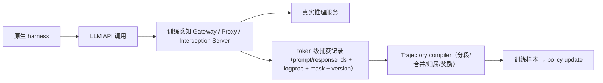

### 2.3 为什么 P̃ ≠ P 时 logπ_θ(Y|P̃) 不是原条件概率

保存了 $Y_i$ 还不够，因为训练时还有一个隐含假设：$Y_i$ 是在 $P_i$ 的条件下采样出来的。假设响应 token 保存正确，但训练时用的是另一个重建 prompt $\widetilde P_i \neq P_i$，比如上一轮响应的 token 边界在重渲染时变了，或者 proxy 把文本替换成了旧的采样 token，那么训练计算的 $\log \pi_\theta(Y_i\mid \widetilde P_i)$ 仍然不是该动作在原始条件下的概率。

把这条链写完整：rollout 时 $Y_i \sim \pi_{\theta_0}(\cdot \mid P_i)$，行为策略给出该序列的概率密度是 $\pi_{\theta_0}(Y_i \mid P_i)$，rollout logprob 记录的就是它；训练时我们在计算 $\log \pi_\theta(Y_i \mid \widetilde P_i)$。即使 $Y_i$ 的每个 token 都在（token 没变），条件分布变了，这个量就同时失去了两个身份：它既不是行为策略在真实条件下给出 $Y_i$ 的概率（on-policy 语义被破坏），也不是当前策略在真实条件下给出它的概率（重要性采样比需要的正是后者），它只是「当前策略在另一个 prompt 下"碰巧"生成同一段 token 的概率」。Agent Lightning 论文把这步说得更细（论文用 $p_i^{\mathrm{tok}}/a_i^{\mathrm{tok}}$ 记第 i 次调用的 prompt 与响应 token）：如果实际下一轮 prompt 里含有一段重渲染版本 $\widehat a_i^{\mathrm{tok}}$，即 $p_{i+1}^{\mathrm{tok}} = p_i^{\mathrm{tok}} \parallel \widehat a_i^{\mathrm{tok}} \parallel \Delta_{i+1}$，而训练时用请求缓冲把它替换回原始采样的 $a_i^{\mathrm{tok}}$，得到缝合 prompt $\widetilde p_{i+1}^{\mathrm{tok}} = p_i^{\mathrm{tok}} \parallel a_i^{\mathrm{tok}} \parallel \Delta_{i+1} \neq p_{i+1}^{\mathrm{tok}}$，那么 $a_{i+1}$ 实际是在 $p_{i+1}$ 条件下采样的，把它当作在 $\widetilde p_{i+1}$ 下生成来训练，就引入了 off-policy 差异（[Eq.12-13](https://arxiv.org/html/2608.17528v1)）。这就是为什么严格前缀分段与 TITO 分别要在「捕获侧」和「生成侧」解决不同问题：前者保证不制造假条件，后者保证下一次真实推理用可追踪的 token 条件。

### 2.4 重分词漂移：encode(decode(Y)) = Y 并不恒等

再往下，保存了 $P_i$ 仍要面对一个更隐蔽的问题：**训练侧的 token 序列未必是你采样时的那一条**。

$$
\operatorname{encode}(\operatorname{decode}(Y)) = Y
$$

并不是任何「生成 → 解析 → 重渲染 → 再分词」链路都能保证的恒等式。vLLM 与 Agent Lightning 团队在 2025 年 10 月的联合博客里专门把这个现象命名为 **retokenization drift**，并给出了三类机制（[vLLM Blog 2025-10-22](https://vllm.ai/blog/agent-lightning)）：

1. **非唯一的 token 切分**。同一个单词可能被采成 `H` + `AVING`，重分词变成 `HAV` + `ING`：文本看起来完全一样，token ID 不同。Agent Lightning 论文的 Figure 3 把这种「按层拆」的状态画得很清楚：第一行是 Call i 实际采样的 `p_i^tok` 接 `h` + `aving`（合起来是 `a_i^tok`），第二行是对下一轮 prompt 做朴素重分词后的 `p_i^tok` 接 `hav` + `ing` + new turn，右侧红色的「`≠ a_i^tok`: cannot merge」就是前缀连续条件失败的直观表达。

<div style="text-align: center;">
  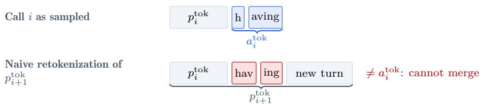
</div>
图注：Agent Lightning v1.0 论文 Figure 3：重分词示例。「having」在 Call i 中采样为 h+aving，在 Call i+1 的 prompt 重分词后变成 hav+ing；文本前缀关系成立而 token 前缀关系断裂。来源：Agent Lightning v1.0 (arXiv 2608.17528v1)。

下面这张 Jupyter 截图是 vLLM 博客里的原图，`tokenizer.decode([39, 83722]) == 'HAVING'` 且 `tokenizer.decode([72239, 1718]) == 'HAVING'`，两边 decode 相等但 ID 序列不同：

<div style="text-align: center;">
  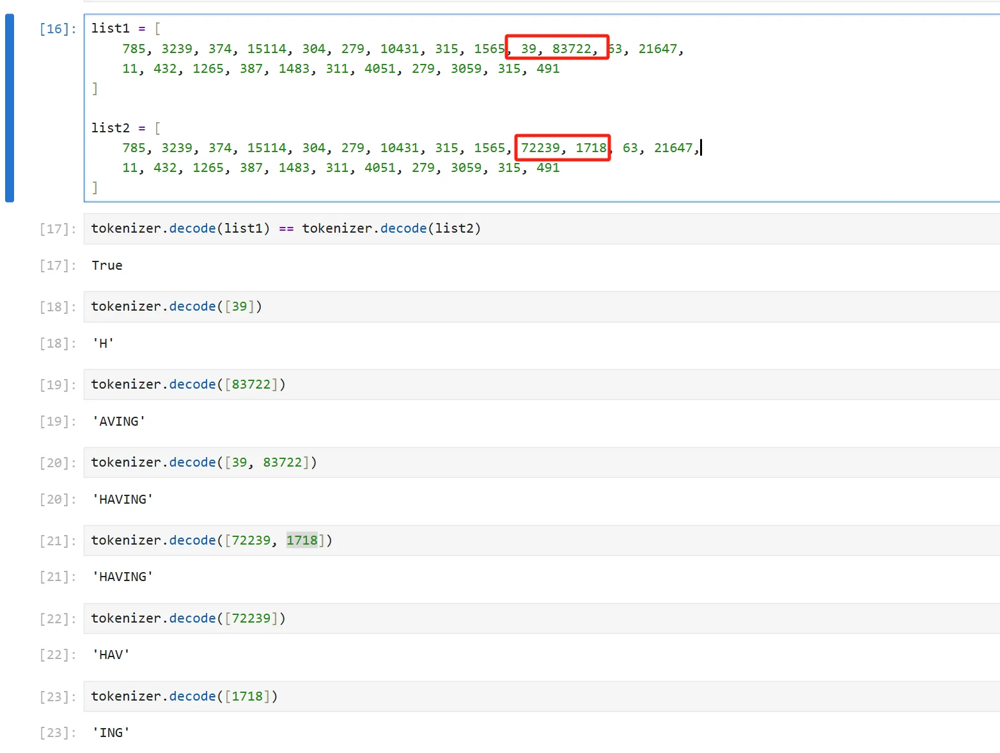
</div>
图注：vLLM 博客原图：单词「HAVING」对应不同的 token 切分，decode 结果相同而 token IDs 不同。来源：vLLM Blog《No More Retokenization Drift》(2025-10-22)。

2. **推理时输出变换**。tool-call JSON 会被解析成对象、再重渲染回文本；解析与重渲染可能改变空格、分隔符、JSON 结构，甚至自动修正 JSON 语法错误，把模型真实的生成错误「修」掉了（`<tool_call>{ "name": ... }</tool_call>` 这条链路是博客里点名的手法）。隐藏 reasoning 也有同类问题：AgentJet 论文 Figure 5 展示的 Qwen3 模板会把上一轮 assistant 消息里被剥离的 thinking 块按模板重排，两轮 timeline 在同一段文本上 token 数组不同（论文称之为「tokenizer chat template: remove old thinking block」）。

3. **chat template 差异/非组合性**。模板渲染完整历史不等于拼接各部分渲染结果：$\operatorname{Template}(A \parallel B) \neq \operatorname{Template}(A) \parallel \operatorname{Template}(B)$，模板可能在消息边界插入分隔符或换行，也可能省略原始生成时出现过的标记；Agent Lightning 论文实测 Qwen 的 chat template 会删掉先前消息里的 `<think>` 标记（[Eq.10-11](https://arxiv.org/html/2608.17528v1)）。同一份 LLaMA 模型在 vLLM 与 HuggingFace 各有 chat template，训练与推理框架不同时差异会被放大。停止符裁剪是另一个近亲：finish_reason 为 `length` 时输出被截断，重渲染时再补结束符，同样会改 token 边界。

这些机制在长程 agent 场景尤其常见。Dressage 专门为 Qwen3.5/Qwen3.6 做了 TITO 增量分词器（`dressage/proxy/tito/`，[3e3142fe](https://github.com/Accio-Lab/Dressage/blob/3e3142fe8ea07e4504c3b20a936a4c201a3de44c/dressage/proxy/tito/__init__.py#L15)），AgentJet 在 context tracker 里默认开启 `fix_retokenization_drift` 的 token 修正（`ensure_retokenization_perfect_match`，[25118bbc](https://github.com/modelscope/AgentJet/blob/25118bbcb314e0da898bbc0043a1bf4ab74eade7/ajet/context_tracker/multiagent_tracking.py#L463)），都是对这一问题的工程化回应。

**长度相等不代表概率对应同一个 token**，这是更危险的一种错配。设某次调用的响应 $Y_i=(y_1,\dots,y_T)$，对应的采样 logprob 序列 $l=(l_1,\dots,l_T)$，其中 $l_t$ 是生成 $y_t$ 那个时刻、在真实前缀条件下给出的对数概率；重分词得到 $Y'_i=(y'_1,\dots,y'_{T'})$，$T' \neq T$。把 $l$ 截断到 $\min(T,T')$ 或补零到 $T'$，只是让两个向量长度相等，位置的对应关系并不存在：$y'_t$ 与 $y_t$ 没有对齐关系，$l_t$ 描述的是「$y_t$ 被采出的概率」，不是「$y'_t$ 被采出的概率」。补零尤其具有迷惑性：0.0 是 $\log 1$ 的真实取值，会把「没有概率信息」装扮成「概率为 1 的 token」。OpenClaw-RL 与 MetaClaw 被排除出严格 token-fidelity 候选，正是因为在已查路径里看到了这类处理，而不是因为它们没有 proxy（见 3.12 节的代码证据）。

漂移的代价不只在数值上：按 vLLM 博客的说法，重分词后的训练相当于对「你以为的数据」做优化，学习曲线不稳定、难以调试（下面是博客原图：红蓝两条线是「存文本、训练时重分词」的两条独立运行，在 160 步和 240 步附近塌陷；黄线直接使用推理引擎返回的 token IDs，稳步上升到 0.6 附近）。

<div style="text-align: center;">
  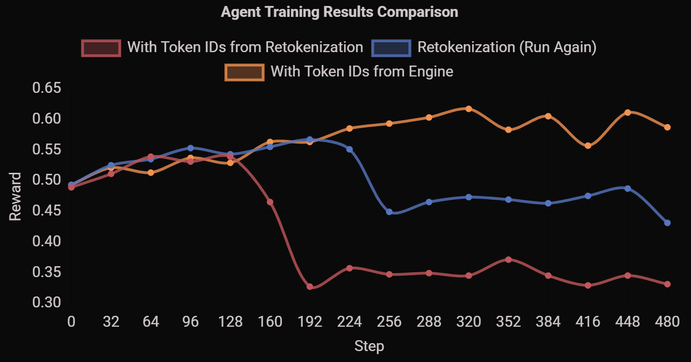
</div>
图注：vLLM 博客原图：red/blue 为「存文本 + 训练时重分词」的两条曲线，yellow 为「直接用推理引擎 token IDs」；改名后 RL 稳定性的差异一眼可见。来源：vLLM Blog《No More Retokenization Drift》(2025-10-22)。

### 2.5 两个可靠方向：保留每次调用，或者保持 token 连续

面对漂移，实现上收敛到两个方向，各有代价，对应不同的正确性主张。

**方向一：保留 exact call snapshots 并在可证明前缀连续时才合并。**每个 call 记下真实的 $P_i$ 与 $Y_i$，只有当下一个 call 的 prompt 以「上一 call 的 prompt + 真实响应 token」为精确 token 前缀时，才把两个 call 拼成一条训练序列；否则保持独立样本。优点是把实际条件原样保留，代价是多个训练行反复包含历史上下文，长轨迹下冗余巨大。Agent Lightning 的 rollout adapter、Polar 的 `per_request`/`prefix_merging` builder 都走这个方向（合并判据见 5.1 节的严格前缀式）。

**方向二：Token-in-token-out（TITO）。**不再依赖「文本传回来再 tokenize」，而是让下一次真实推理直接使用上一次的真实 token 序列作为条件。rLLM 的 cumulative-token 模式是典型：per-session `TokenAccumulator` 在第 2 轮起把 `chat/completions` 请求改写成 `/v1/completions` 且 `prompt=上一轮原始 token 序列 + 新消息的增量 token`（`add_special_tokens=False`，[3b40c37c](https://github.com/rllm-org/rllm/blob/3b40c37cf6a262cf4d28cc987ebe4f4cf797956c/rllm-model-gateway/src/rllm_model_gateway/proxy.py#L265)）；verifiers v1 的 TrainClient 用 `renderers` 客户端在客户端侧 tokenize 增长中的 prompt 前缀、调用原始 token-in 的 generate 端点拿精确 token ids 与 logprobs 并复用于后续轮次。

但 TITO 也有自己的对称风险：**训练时强行复用 token，而部署时按文本重渲染，就形成了另一种分布差异**。rLLM 的 TITO 是可选模式（非 cumulative 路径只是透明转发、每轮从文本重新渲染），verifiers 的 TITO 依赖 harness 容忍 renderer 的 token 输入；所以「TITO 方向」在验收时也要回答：这个 token 条件是否与部署时的实际条件等价？Polar 论文在 2.4 节给了一个折中口径：生成过的 assistant token 直接从推理响应复制，非生成的插值 token 用 canonical prompt tokenization，loss mask 只标记行为策略 token 可训练，「每条可训练 token 都在 rollout 时与行为策略一致，非生成 token 全部被 mask」。

走到这里，驱动问题总算可以摆出来了：**想对现有 coding agent harness 直接做 RL、又不想重写它的执行循环，系统应该在哪里切开？切开之后必须证明哪些不变量，才算得上真正 token-faithful 的训练接入？**前面的两章给出了回答的两半：切开的位置在 LLM API 边界（第一、二章的所有项目都同意这一点），而不变量则至少包含下面这条：训练样本里的生成 token、条件上下文、logprob、调用归属、奖励与策略版本，必须与真实执行过程逐项一致，而且这一致性本身要有代码路径可证明，不是配置文件里的一句承诺。从第三章开始，我们逐个项目看这条不变量被实践到什么程度，以及各项目分别在哪里做出了取舍。

## 3. 架构版图：从 API 到 policy update 的实现

### 3.1 先把地图切四刀

10 个核心候选不适合摊成一张大表，它们按「切在哪一层」天然分成四组：组 A 是训练侧接管的（Agent Lightning、Uni-Agent + verl），集成边界从 trainer 出发；组 B 是独立 gateway（rLLM、AReaL），gateway 自己就是产品；组 C 把原生 harness 与训练框架组合起来（slime 外部 agent 模式、Dressage、Polar + slime），训练底座多是 slime；组 D 是新一代的 capture/服务形态（AgentJet Swarm、PRIME-RL + verifiers v1、NeMo Gym v0.6.0），它们把「轨迹组织」提升成了第一等的系统抽象。Turnstile、OpenRLHF 示例、OpenClaw-RL、MetaClaw 作为反例单独放一节，最后补替代架构。

每个项目我都会给「它是什么 → 集成边界 → 代码链 → 亮点与限制 → 判定」五段，代码链里的文件都锁定在本地复核的 commit 上；fork 仓库（AReaL、slime、verl）的核对口径在文末「差异与裁决」说明。

最后补充一个方向性观察：这张版图有明确的项目级证据表明行业正在从「agent 适配 RL」走向「RL 围绕 harness 适配」：slime 增加外部 coding-agent 模式、verl 相关 gateway 工作迁入 Uni-Agent（2026-03 起以独立仓库形态出现）、verifiers v1 分离 harness/runtime 并引入 interception server、NeMo Gym v0.6.0 新增外部 harness 的训练 token 捕获。它们共同表明「**保留部署侧控制流正在成为独立的系统设计目标**」；但原生 rollout、环境接口与 SDK 集成并没有因此失去价值，相反，它们分别仍然是对「框架驱动的可复现性」与「语义级访问」最直接的回答，这就是后文 3.13 节把它们单独列出的原因。

### 3.2 Agent Lightning：把原生调用轨迹转成 verl 训练数据

Agent Lightning 是微软研究院的项目，v1.0 论文把自己的定位说得很清楚：**轻量框架，约 3500 行代码，验证 harnessed agentic RL 的四个挑战**（重分词与样本合并、advantage 计算、loss normalization、训练后端调度）。它的架构三分：API Gateway（存 rollouts、models、events，转发 LLM 调用）、Rollout Controller（把 rollout 状态与 Kubernetes Job/本地进程调和）、Customized Trainer（基于 verl，注册 rollout、等待完成、回收事件并组装训练样本）。下面是论文 Figure 1 的总览：左侧是带着 harness 的 agents，经过 API Gateway（Rollout API + LLM API Proxy）与 Rollout Controller（Local/K8S Reconciler）、Customized Trainer（Sample Adapter + Monitoring）三个组件，右边接到 Inference Engine 与 Training Engine。

<div style="text-align: center;">
  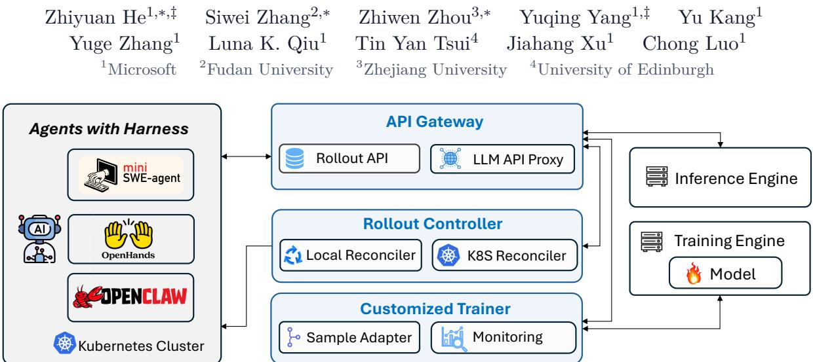
</div>
图注：Agent Lightning v1.0 论文 Figure 1：整体框架。API Gateway 是唯一的真实状态源，rollout 的声明-调和循环把它与 agent 执行解耦。来源：Agent Lightning v1.0 (arXiv 2608.17528v1)。

**代码链**（本地 commit [218f1f7c](https://github.com/microsoft/agent-lightning/blob/218f1f7c0bac0800de4d5a4e5e6f61cf7b5038b4)）：

```text
原生 agent / launcher
  → agentlightning/server/proxy.py
      ProxyRouter.select_server（按 rollout_id 稳定选端点，保前缀缓存复用）
      ProxyRouter.prepare_body（train 模式强制 temperature + return_token_ids + logprobs）
      forward_request（stream=true 直接 400；暂停中返回 429 + Retry-After）
  → model_request event（prompt/response token ids + logprobs + model_version）
  → agentlightning/verl/rollout_adapter.py
      get_train_data_batch（transition 或 trajectory 聚合）
  → verl DataProto（prompt/response ids + response_mask + rollout_id + data_id）
  → agentlightning/verl/rollout_level_advantage.py（按 rollout 算一次 group 基线再广播）
  → agentlightning/verl/per_rollout_loss.py（rollout 级 token-mean loss）
```

两个实现细节值得先说。第一，`prepare_body` 在 train 模式强制覆盖：`model` 改成注册的模型名、`temperature` 改为训练温度、`return_token_ids=True`、`logprobs=True`（受 `include_log_probs` 控制）。也就是说训练 proxy 不是透明转发，它主动改变了采样参数；文档 25-api-gateway-configuration.md 也明说 proxy 会替换 verl 里的 temperature。第二，`_capture_event` 里记了 `model_version: server.version`（schemas.py 注释为「serving model 的 training step」），但我在仓库里没找到把 `version` 更新成非 0 值的代码路径，rollout manager 注册模型时用的是默认 0：**版本字段存在，更新链路不可见**，这是审计时必须要记的一笔。

**轨迹策略**。`rollout_adapter.py` 的 `trace_aggregator_level` 有两种：`transition` 层每个 call 独立成一行（无 mask），`trajectory` 层按严格 token 前缀合并（默认配置走这层，[compat 见 verl/config.yaml](https://github.com/microsoft/agent-lightning/blob/218f1f7c0bac0800de4d5a4e5e6f61cf7b5038b4/agentlightning/verl/config.yaml)）：只有下一个 call 的 prompt 以「已有 context（prompt+response）」为**精确 token 前缀**才合并，夹在中间的 observation token 追加进 response 流但 `mask=0`、logprob 补 0.0，工具观察进入上下文但不参与 policy loss；前缀断裂就 flush 当前组、重开新行，并把 mismatch 记录上抛到 wandb。**不是「文本看起来一样就拼接」**，这正是 2.5 节方向一在代码层的落实。

**捕获与训练端的分离**。API Gateway 故意保持简单：不维护服务端请求缓冲，adapter 端只要观察到「下一行 prompt 是上一行超集且前缀精确相等」就合并。论文把它与 AReaL/Uni-Agent 的「请求缓冲替换」做法对撞了一下（见 2.3 节），结论是缓冲替换能提高合并率，但在「改变真实消费 prompt」的场景下会变成 off-policy stitching；v1.0 选择 best-effort 合并作为独立调用重算与树形训练之间的折中。

**判定**：严格架构匹配，源码证据强。协议覆盖（只有 OpenAI chat 兼容路径）、streaming（明确拒绝）与复杂调用树的奖励语义仍需按具体模式验收。

### 3.3 AReaL：标准客户端代理 + session 缓存与 retry orphan

AReaL 是分布式异步 RL 框架，2.0 后的走读文章（[AReaL Code Walk Through](rlhf/areal/code-walk-through_CN.md)）讲的是训练框架本体；本文只盯它的 proxy workflow。它当前文档把 proxy 方式列为首选，把直接使用 `ArealOpenAI` 的方式标为 legacy（docs/en/reference/agent_workflow.md：「Legacy Pattern…should not be used for new projects」）。

**代码链**（本地 fork commit [ad27064e](https://github.com/PraMamba/AReaL/blob/ad27064ee5d2ba40d40df77a884af222f765285c)，上游为 inclusionAI/AReaL，核对口径见「差异与裁决」第 6 条）：

```text
agent run(...) / subprocess wrapper
  → OpenAIProxyWorkflow
  → areal/experimental/openai/proxy/proxy_rollout_server.py
      start_session / end_session / export_trajectories（含 stale 清理）
      /v1/chat/completions、/v1/responses、/v1/messages（OpenAI Chat/Responses + Anthropic）
  → areal/experimental/openai/cache.py
      InteractionCache（消息最长前缀建 parent 链）
      _find_retry_orphan_ids
  → InteractionWithTokenLogpReward（含 token ids + logprob + reward）
  → RolloutWorkflow.arun_episode / tensor data → AReaL 训练管线
```

**值得肯定的具体处理是 retry orphan。**`_find_retry_orphan_ids` 先把当前 session 的交互按「输入消息的 sha1」分组：组内如果有交互被后续调用收养（有孩子），则无孩子的兄弟就是 orphan（被丢弃的超时重试）；组内全部无孩子时，回退为按 `created_at`（生成时间）保留最晚那个、其余判为 orphan。这个回退在 docstring 里有明确场景：「session ended right after a retry, before any later turn could establish parentage」。所以它是**部分可判定**：能证明「被后续采用」与「整组都没被采用」两种情形，中间情形（同 prompt 的合法并行分支、末尾恰好是孤儿）交给时间戳启发式兜底，不是严格的「已交付/已消费」证明。

**边界**。message-prefix 关系只用于组织单条轨迹的轮次树，代码里虽然用了 parent/child 措辞，但全仓库没有 subagent 概念（grep `subagent` 零命中），「消息前缀连续」不等于「恢复了 subagent 父子关系」。另外底层 `ArealOpenAI` 的 streaming 是模拟的：先完整 `agenerate` 再切成 chunk（client.py 的 `_create_stream` 注释「Since Inference engine doesn't support true streaming, we simulate it…」），所以「代码里存在流式路径」不能被读成「具备真实流式语义」。

**判定**：核心匹配；尤其适合已有 agent 函数/服务与分布式 RL 系统衔接，但要核查 session 标识、并发分支与 retry 归属规则。

### 3.4 slime：既有原生 rollout，也有真正的外部 harness 模式

把 slime 一概归入「用户必须重写 generate loop」已经不准确了。它 v0.3.0 之后在 `examples/coding_agent_rl/` 提供了外部 agent 的完整示例，且经过几轮代码整理（本地 slime 仓库日志中 `add coding_agent_rl: agent-in-sandbox RL minimal demo` 见 2026-05-26 提交 b6764131；v0.3.0 tag 2026-05-31 bf14dc21）。

**代码链**（本地 fork commit [87070741](https://github.com/PraMamba/slime/blob/870707414451aad3525fdd7acb84e7bc3da88469)）：

```text
examples/coding_agent_rl/generate.py（四段编排：起沙箱/装 CLI → 等 CLI 退出 → diff 到干净沙箱评分 → drain 轨迹）
  → slime.agent.harness（包，不是单文件）
      common.py:57 BaseHarness（install_cli / write_config / launch_and_wait 三件套）
      claude_code.py、codex.py（注入 ANTHROPIC_BASE_URL / OPENAI_BASE_URL，API key=session_id）
  → slime/agent/adapters/*（AnthropicAdapter / OpenAIAdapter：Anthropic Messages 与 OpenAI Chat 两种方言 → sglang /generate；OpenAI Responses 未实现）
  → slime/agent/trajectory.py
      TurnRecord / MessageNode / TrajectoryManager / _SampleBuilder
  → slime Sample（tokens + loss_mask + rollout_log_probs + weight_versions）
  → slime rollout / actor 训练后端
```

`BaseHarness` 负责的是生命周期（安装、写配置、启动等待），不是「用 Python 重写 CLI 的规划与工具状态机」；README 里那句「a real coding agent (claude-code CLI) drives Read/Edit/Grep/Bash/Agent tools inside a fresh sandbox」就是这个意思。

**轨迹不是简单线性列表。**`TrajectoryManager` 按 session 维护消息路由树：`TurnRecord` 是一次 sglang `/generate` 快照，`MessageNode` 是树节点，`_SampleBuilder` 把一条 root→leaf 链累积成一个 Sample。共享历史的关键处理在 `_split_chain_into_builders`：每个叶第一次到达时认领该 assistant 响应的训练（`response_trained = True`），其余后到叶把它重放成 `loss_mask=0` 的上下文，「每个 response 恰好被训练一次」；代码注释写得很直白：「Shared by sibling leaf paths; the first to reach it trains on it, the rest re-emit it as loss_mask=0 context」。

**针对重分词漂移的显式策略。**`classify_token_drift` 把历史漂移分三档：CLEAN 是精确前缀延伸；REALIGN 是落在最近 response span 内的短漂移，整段替换成 prompt 内容且 loss_mask/logprobs 归 0；FORK 是其余情况，关旧 builder 开新 builder（分叉点）。`fork_threshold` 默认 1024 token（`SLIME_FORK_MERGE_MAX_RESPONSE_TOKENS` 环境变量接线），更短的 assistant 重写路径还会被 `_try_merge_assistant_rewrite` 降级成 routing-only（`turn=None`），避免死叶再出训练样本。所以**不能宣传成「原始执行中所有生成 token 都必然完整保留」**：短漂移路径按 CLEAN/REALIGN 处理，属于「语义保留但 token 序列可能被替换为 prompt 侧内容」的折中。

**判定**：外部 agent 模式是核心匹配；slime 整个项目属于 Hybrid：原生 rollout 与外部 harness 代理是同一训练框架下的不同接入方式。

### 3.5 Uni-Agent + verl：gateway 与 runner 组合，而不是 verl 核心原生循环

Uni-Agent 是 verl 生态里的「构建、运行、训练 agent」项目，关键抽象是 session gateway：外部 agent 发普通模型请求，gateway 对接 verl 管理的推理服务并维护每个 session 的训练轨迹；任务 runner 负责运行 agent、返回任务结果。README 的定位写得很有辨识度：「request string in, training tokens out」；「The Gateway is not an inference engine」。

**代码链**（本地 commit [bb96eca0](https://github.com/verl-project/uni-agent/blob/bb96ecab183bdf0c3dba6958fd81d3bd96a024cd)）：

```text
Task runner / 原生 harness
  → uni_agent/gateway/gateway.py（OpenAI 与 Anthropic 两个 handler）
  → uni_agent/gateway/session/session.py
      run_generation（token/logprob 对齐校验，不符直接 RuntimeError）
      active_chains（多 active chain）
      _prepare_generation_inputs 中的 rollback 分支
  → uni_agent/framework/framework.py
      GatewayAgentFramework（奖励打分 → TransferQueue 写出）
  → verl 训练消费方（ReplayBuffer / sync trainer，见下）
```

**两个需要明确的限制**。第一，streaming 是「先完整生成、再合成 SSE」：两个 handler 都是 `await session.run_generation(...)` 拿到完整 outcome 之后，再按 `stream=true` 标志用 `openai_stream_response`/anthropic 的 whole-turn synthesis 包装成流（「Synthesize an OpenAI chat.completion.chunk SSE stream from a completed outcome」）。第二，rollback 路径可能丢弃训练 token：当新请求不是精确前缀匹配、且 `enable_last_assistant_rollback` 打开时，`_prepare_generation_inputs` 会把上一个 assistant 的 mask=1 token 从该链中删除、由新生成替换，并累加 `rollback_dropped_trainable_tokens_total` 计数。此外 session 层对 logprob 与 token ids 的对齐有双重校验（`RuntimeError` + assert），`generation_versions` 记录每个 generation 的 `(min_global_steps, max_global_steps)`，finalize 时折叠成轨迹级的 `min/max_global_steps` 写入 trajectory extra_fields，也就是它**记录版本区间**而不是单值。

**训练消费是同步还是异步？**这里的证据两面共存：framework 的类 docstring 说写入 TransferQueue 后「consumed by sync training」，并明确对齐 `verl/trainer/main_ppo_sync.py` 的 AgentLoopWorkerTQ；但 README 与示例又说提供 fully async training recipes（`TRAINER_MODE=separate_async`、ReplayBuffer 异步消费），entry 的 AgentFrameworkRolloutAdapter 是 fire-and-forget。本地 uni-agent 的 verl submodule 未检出，verl 侧无法进一步核验。保守的表述是：**架构上经 TransferQueue 解耦了 rollout 生成与训练消费，是否 fully-async 取决于组合的 trainer 模式**，把「gateway 用了 Ray」直接推出「fully asynchronous RL」是不成立的。

**判定**：核心匹配；受支持 CLI 的内部改动较少，新增 runner 与训练数据消费适配仍有工程成本。

### 3.6 rLLM：独立 gateway 与统一训练后端之间的桥接

rLLM 把自己定位为「any harness, with any backend」的 agent RL 框架。它的结构值得拆成两层看：`rllm-model-gateway` 负责捕获模型调用与精确生成信息，`rllm` trainer 负责组织 Episode/Trajectory、变换数据、计算 advantage、更新策略；两者之间用 workflow 连接（workflow engine 并行跑 agent，model gateway 按 URL 会话路由并抓 token ids+logprobs，transform pipeline 组轨迹算 advantage，training backend 做策略更新，这套描述分散在 README 的 Core features 与 Architecture 段落里，[3b40c37c](https://github.com/rllm-org/rllm/blob/3b40c37cf6a262cf4d28cc987ebe4f4cf797956c/README.md#L124)）。

**代码链**（本地 commit [3b40c37c](https://github.com/rllm-org/rllm/blob/3b40c37cf6a262cf4d28cc987ebe4f4cf797956c)）：

```text
原生 harness / rollout workflow
  → rllm-model-gateway/src/rllm_model_gateway/proxy.py
      ReverseProxy.handle（请求打上 gateway 自维护的 weight_version）
      cumulative-token 模式：TokenAccumulator + renderer bridge → 改写为 /v1/completions（prompt=原始 token 序列）
      非累计路径：透明转发；流式逐 chunk 转发并累积建 trace
  → .../data_process.py
      build_trace_record → TraceRecord（prompt/completion token ids、logprobs、weight_version、routing_matrices）
      strip_vllm_fields（回给客户端前剥掉内部字段）
  → Episode → trajectory groups
  → rllm/trainer/unified_trainer.py
      transform_to_backend_batch / process_backend_batch / compute_advantages / update_policy
```

两个实现细节直接决定了它的正确性画像。第一，`data_process.py` 先读全再剥：`build_trace_record` 从响应里抽出 `prompt_token_ids`/`completion_token_ids`（vLLM 0.11+ 的 `choices[0].token_ids`）与逐 token logprob、`weight_version`（rollout engine 打的戳）、`routing_matrices`（MoE 路由），组成 `TraceRecord`；之后 `strip_vllm_fields` 把 `prompt_token_ids`、`weight_version`、`token_ids`、`routing_matrices` 等内部字段从回给客户端的响应里剥掉。也就是说**同一份响应在 gateway 内被消费了两次**：trace 副本保留完整内部字段，客户端只看到普通 OpenAI 响应。第二，四个训练函数其实是 backend 协议方法（`rllm/trainer/backend_protocol.py` 定义，verl/tinker/fireworks 各有一份实现），`unified_trainer.py` 按阶段调用：sync 链是 4 步顺序执行，fully-async 链里 advantage 提前由 `TrajectoryGroupBuffer.add_episode` 算好（「collect_reward_and_advantage_from_trajectory_groups」），训练循环只做 transform/process/update；async 路径还会记录 staleness（`coordinator.weight_version - v` 的 mean/min/max），权重同步时通过 `GatewayManager.set_weight_version` 把新版本推给 gateway，由 gateway 给后续请求打更新版本的戳。

**版本提醒**。旧 `agent_trainer.py` 包装器的 docstring 与运行时报错都明确写「The legacy `agent_class` + `env_class` and `agent_run_func` (SDK) paths have been removed. New agents should be authored as a Workflow or as an AgentFlow」，verl 侧 `train_agent_ppo.py` 也有一句同款报错。所以不能拿旧 SDK 教程推断现在的接口，评估 rLLM 时它的 workflow/AgentFlow 体系才是入口。

**判定**：核心匹配；适合希望把 agent 执行、gateway 与训练后端进一步解耦的团队。

### 3.7 Dressage：把分段、异步与 native harness 放到同一套系统里

Dressage 是 2026 年 6 月开源的 native harness RL 系统（本地 release v0.1.0，[bd89821](https://github.com/Accio-Lab/Dressage/blob/3e3142fe8ea07e4504c3b20a936a4c201a3de44c/dressage/proxy/server.py) 所在 commit [3e3142fe](https://github.com/Accio-Lab/Dressage/blob/3e3142fe8ea07e4504c3b20a936a4c201a3de44c)），建立在 slime 之上，不是完全独立重写的 trainer。它的重点不仅是多协议代理，还包括 session、trajectory segment、策略版本、partial rollout 与训练样本之间的关系。

**代码链**（本地 commit [3e3142fe](https://github.com/Accio-Lab/Dressage/blob/3e3142fe8ea07e4504c3b20a936a4c201a3de44c)）：

```text
原生 harness / 可选 blackbox sidecar
  → blackbox_server/proxy/rollout_llm_proxy.py（Anthropic/Responses → OpenAI chat 翻译 + 注入身份头）
  → dressage/proxy/server.py
      SessionManager（session/instance/turn 身份；turn 显式/隐式两种模式）
      GenerationController（请求级可抢占生成：pause/resume/synchronize_version）
      TrajectoryStore（TrajectorySegment 按 token build mode 存 lineage/timeline）
      tito/（Qwen3.5/Qwen3.6 增量分词）
  → dressage/rollout/multi_segment.py
      expand_segments_to_samples（多 segment 共享 rollout_id；末段为奖励锚点）
  → dressage/rollout/artifacts/samples.py
      write_sample_from_segment（写 slime Sample + token-version 元数据）
  → dressage/training/reward_post_process.py（按 parent_traj_id 分组、父级归一化、广播）
  → slime training
```

**协议与身份**。Dressage 代理本体只暴露 OpenAI 兼容接口（`/v1/chat/completions`）；Anthropic Messages 与 OpenAI Responses 的翻译发生在 blackbox sidecar 的 LLM proxy 里，它同时在转发时强制注入 `X-Session-Id`/`X-Instance-Id`/`X-Turn-Id`，文档口径是「The agent never knows its calls are being recorded」。而对那些不能发送身份头的 CLI，就是这个外层代理在替它补身份，不用重写内部循环。身份字段缺省时由 SessionManager 自动生成 UUID，turn 还有隐式模式（`__implicit_turn__` 前缀）兜底。

**奖励不是「每段各算一次成功」**。`expand_segments_to_samples` 把一次 session 的分段按 `segment_index` 排序后逐个展开成 Sample，关键是：每个 sample 都带同一个 `rollout_id`（来自 template sample 的 index），非末段先置 `reward=0.0`，末段保留 `reward=None` 作为锚点；真正的奖励回播发生在 `reward_post_process.py`，它按 `parent_traj_id` 分组、以最高 segment_index 为锚点做父级（rollout 级）归一化，把同一个 advantage 广播给每个 segment。**trajectory 分段与 reward 分组必须分离**，这就是它在代码层的实现方式。

**异步与版本**。`GenerationController` 做的是请求级抢占：按 `request_id` abort/续跑、按 version/epoch 守卫，配合 `/v1/rollout/pause|resume`。version/staleness 的权威文档其实是独立的 `docs/staleness.md`（100 行）：batch 级用 `dressage_staleness_keep_versions`，partial rollout 级用 `--max-partial-rollout-preempts`（`version_switches = max(0, version_span - 1)`），配套 `rollout/staleness.py` 的 StalenessGroupFilter 与 proxy 侧三个守卫；训练样本里会写进 token-version 四件套（`dressage_start_token_version`/`dressage_end_token_version`/`full_versions`/`version_spans`），让下游可以按版本段 mask。

**判定**：核心匹配；对长时间运行、会分段或中断的 coding-agent RL 尤其值得深入评估，但 proxy 层只讲 OpenAI 兼容，多协议体验依赖 sidecar 的翻译层。

### 3.8 Polar + slime：独立 rollout service，别把它写成独立 RL trainer

Polar 的仓库在 NVIDIA-NeMo 的 ProRL-Agent-Server（本地 checkout 于 stable 分支，[6a1ead6b](https://github.com/NVIDIA-NeMo/ProRL-Agent-Server/blob/6a1ead6bfac054fce6c1e62d1a77b330d96c58db)），论文 arXiv 2605.24220v1。它也回答「能不能不打开盒子训练 agent」（论文的 central question），答案是把 harness 当黑盒放在隔离 runtime 里，model API proxy 置于 agent 与推理服务之间，gateway 节点异步处理 runtime 预热、harness 执行、轨迹重建、评估与 trainer 回调。下面是论文 Figure 1 的架构总览：Rollout Server（注册会话/负载均衡/健康跟踪）通过 dispatch/callback 与 Gateway Nodes 互动，Gateway 内 INIT/RUN/BUILD/EVAL 四段流水 + API Proxy，上方接着任意 harness，下方 Trainer 异步拿到 trajectories（messages, token_id, logprob, mask, reward），并在推理服务侧做 weight sync。

<div style="text-align: center;">
  
</div>
图注：Polar 论文 Figure 1：架构总览。rollout service 与 trainer 之间只有异步任务接口与轨迹数据，这是「rollout as a service」的完整形态。来源：Polar (arXiv 2605.24220v1)。

**代码链**（本地 stable [6a1ead6b](https://github.com/NVIDIA-NeMo/ProRL-Agent-Server/blob/6a1ead6bfac054fce6c1e62d1a77b330d96c58db)）：

```text
原生 harness in sandbox（claude_code/codex/pi/... 等 preset，注入 ANTHROPIC_BASE_URL/OPENAI_BASE_URL，API key=session_id）
  → src/polar/gateway/（detection + transform：Anthropic/OpenAI Chat/OpenAI Responses/Google 四协议）
      engine.py（统一 logprobs=True）
      server.py（合成 SSE：非流式上游 + 重放）
  → src/polar/trajectory/builder/
      per_request.py（每个 completion 一条 trace）
      prefix_merging.py（严格 token 前缀合并 + EOT 切分 interstitial）
  → src/slime_bridge/adapter.py（trace → slime Sample）
  → slime actor training
```

**prefix_merging 的精确语义值得逐条看**。合并判据是严格的 token 前缀：新请求的 `prompt_ids` 以链 tip 的 prompt 为前缀（`_find_extendable_chain` 最长匹配），且只比较 server 端 tokenize 的 prompt、绝不比较 sampled response ids（builder docstring 明说，避免 BPE 重切带来的误合并）；消息级 key 先做候选过滤并故意忽略 tool-result/空 assistant 消息。合并后构造：`z^{(j)} = p_1 \Vert a_1 \Vert u_1 \Vert a_2 \Vert u_2 \Vert \dots \Vert a_K`，其中 $a_m$ 是真实采样 token，$u_m$ 是 canonical 插值段（由下一个 prompt 的「prompt 前缀之外、到结束符」的部分切出）；loss mask 在 $a_m$ 上置 1、在 $u_m$ 上置 0，$u_m$ 的 logprob 填 0.0 占位。论文据此给出一个不变量：**每条可训练 token 都与 rollout 时的行为策略一致，非生成 token 全部被 mask**。前缀断裂（compaction/subagent/并行分支）自然形成新链，这正是 2.5 节「方向一」最严格的实现。

**slime bridge 的失败语义**。`src/slime_bridge/adapter.py` 的 `_build_sample` 填充 `tokens`（prompt_ids + response_ids）、`response_text`、`response_length`、`loss_mask`、`rollout_log_probs`、`group_id`（同 session 各 trace 共享，供 slime loss reducer 按轨迹聚合）、`reward`、`status`、`session_id` 与 `metadata["polar"]`（含 group_id/policy_version/rollout_step，来自任务 payload 的 scheduler 元数据）；ABORTED/FAILED 样本的 loss_mask 全 0，全部 trace 不可用时产出一个 fully-masked 的占位样本（`remove_sample=True`），保证同组其余样本照常可训。**Polar 负责 rollout 服务，slime 负责已验证的训练接入**；论文 Table 3 也把其他 trainer 的同类 adapter 标记为不在当前交付范围。

**系统边界**。模拟 streaming 在 gateway README 里写得很坦率：「Streaming is synthetic: even when the agent asks for a token stream, the gateway makes one non-streaming backend call and replays the full answer as well-formed SSE」，所以取消语义、首 token 延迟与流式工具执行行为都不能按真实流式对待。另外 Polar 的协议覆盖是 4 种（Anthropic、OpenAI Chat、OpenAI Responses、Google），比只做 OpenAI 兼容的项目更宽，但同样的「合成流」限制。

**判定**：Polar + slime 是核心匹配；Polar 单独应归为 rollout infrastructure，不是 trainer。

### 3.9 AgentJet Swarm：真正解耦 agent 执行，但默认文本匹配必须审计

AgentJet 是 ModelScope/阿里通义实验室的 swarm 训练框架，论文 arXiv 2606.04484v2。它的核心是把「serving 协议本身」变成训练抽象：swarm server 节点（GPU 侧）跑模型与优化器，swarm client 节点（任意设备，CPU 即可)跑任意 agent 循环，两者通过标准的 OpenAI Chat/Responses 兼容 API 加**临时 per-episode 路由凭证**接通。下图是论文 Figure 1：左侧研究助手模块（A3R、AVT）驱动中间的 Swarm Training Network（SS-1/SS-2 两个服务器节点与多个黄色 SC 客户端节点），右侧是多 agent 多模型训练：API key 作为 context identifier、Base URL 作为 model identifier，agent loop 的每次调用都路由到对应的 context tracker。

<div style="text-align: center;">
  
</div>
图注：AgentJet 论文 Figure 1：swarm 训练架构。topology 本身成为系统级设计变量：几个服务器、几个客户端就决定训练范式。来源：AgentJet (arXiv 2606.04484v2)。

**代码链**（本地 commit [25118bbc](https://github.com/modelscope/AgentJet/blob/25118bbcb314e0da898bbc0043a1bf4ab74eade7)）：

```text
SwarmClient.begin_episode → POST /claim_episode
  → 返回 (episode_uuid, base_url, api_key)；api key = sk-ajet- + base64(agent_name, target_tag, episode_uuid, episode_address)
  → ajet/tuner_lib/experimental/oai_model_server.py
      _parse_authorization_header（解码 key）
      /v1/chat/completions、/v1/responses（模拟 streaming；训练模式忽略采样参数；补默认 system message）
  → ajet/context_tracker/multiagent_tracking.py
      step_spawn_timeline / step_track（每步一条 timeline 快照）
      timeline_merging（text 或 token 级匹配；token 漂移修正）
  → 训练后端（sample pool → 策略梯度 → 权重同步回 vLLM/SGLang）
```

**验证过的重点细节**。`begin_episode` 的 key 内容是 `agent_name`、`target_tag`（目标模型标签，训练侧据此判定进入训练模型还是 debug 模型）、`episode_uuid`、`episode_address`（该 episode 挂靠的 ZMQ 交换地址），base_url 只含 master 节点 IP:port，`model` 字段被保留未用。服务器收到请求后解码 key、校验 episode 是否被 claim，然后把请求转给对应 ZMQ worker；这个设计让「同一次训练里多 agent、多模型、多 client」全部由路由凭证表达，客户端 agent 逻辑零修改。流式是模拟的（`mock_as_stream_response`：把非流式结果转成 SSE），训练模式下采样参数在 worker 侧被忽略（`async_llm_bridge.py` 只取 messages/tools，推理参数来自 tracker 的 custom_sampling_params；顺带一提 `preserve_sampling_params` 这个标志目前全仓库没有下游消费者，eval 保留语义处于「信息性」状态），某些路径还会给请求补一条默认 system message。这些都是 train/deploy 对齐审计必须登记的行为。

**最关键的反证：捕获 exact token 不代表后续合并一定 exact**。timeline merging 的匹配级别是配置项：`timeline_compare_level` 有两种，「text」（默认，注释「relaxed compare with text, more easier to match」）与「token」（「strict compare with token, cause less aggressive merging」）。论文 Figure 5 给出了一个具体例子：Qwen3 模板在追加后续轮次后把旧 assistant 消息的 thinking block 剥掉了，两条 timeline 文本一致而 token 数组不同，text 级匹配合并成一条、token 级保留两条。默认的文本匹配容忍 tokenizer drift、换来更激进的合并，代价是严格的训练/推理一致性；因此我把 AgentJet 列为「**受配置约束的核心匹配**」：选它之前必须核查匹配模式、chat template 与最终导出的上下文。

<div style="text-align: center;">
  
</div>
图注：AgentJet 论文 Figure 5：Qwen3 上的文本级 vs token 级 timeline 匹配。文本级合并、token 级分离，trade-off 一目了然。来源：AgentJet (arXiv 2606.04484v2)。

**判定**：架构匹配；严格 token-fidelity 选型必须核查匹配模式、chat template 与实际导出的上下文。

### 3.10 PRIME-RL + verifiers v1：评测兼容性和训练兼容性不能混为一谈

primeintellect 的 verifiers v1 在 2026 年 7 月以预览形式发布（本地仓库 v1 相关提交自 2026-07-01 起，blog 标题带「verifiers v1」），把环境拆成三块：**taskset**（做什么：数据、工具、评分）、**harness**（怎么做：产出 rollout 的程序，ReAct loop 或 Codex/Terminus 2 等 CLI）、**runtime**（在哪里跑：本地子进程/Docker 或 Prime Sandboxes）。它同期支持三个 dialect（OpenAI Chat Completions、OpenAI Responses、Anthropic Messages），并且用一条 `Runtime` 契约把远程沙箱的扩容、容错与生命周期揽进框架。

<div style="text-align: center;">
  
</div>
图注：verifiers v1 博客原图：环境分解为 taskset（what）、harness（how）、runtime（where），三者自由组合。来源：primeintellect.ai《verifiers v1》(2026-07)。

**代码链**（本地 commit [b5d0424f](https://github.com/PrimeIntellect-ai/verifiers/blob/b5d0424fe5d553f94298b41d0e8e689b7fa79c58)）：

```text
原生 harness
  → verifiers/v1/interception/server.py
      InterceptionServer（按 DIALECTS 注册路由；handle_request → turn.commit → record_call）
      EvalClient（盲转发，评测侧）| TrainClient（渲染 token-in 推理，训练侧）
  → verifiers/v1/clients/train.py
      TrainClient.get_response（仅 ChatDialect；response_from_generate）
  → renderers（客户端侧 tokenize 增长前缀 + 原始 token-in generate）
  → trace graph / TrainingSample
  → PRIME-RL orchestrator → trainer policy update
```

**拦截器的两种客户端是本文要强调的边界**。interception server 是 verifiers 管理的 HTTP 服务器，位于 agent runtime 与推理服务器之间：它把每个请求拦下、路由到对应 client、把 turn 记进 trace graph、再以 OpenAI 形状返回（下图；注意这张图里的「多路复用」是它的扩容语义，默认每服务器约 32 个 rollout，按并发弹性扩缩）。

<div style="text-align: center;">
  
</div>
图注：verifiers v1 博客原图：interception server 位于 agent runtime 与推理服务器之间，verifiers 管理的代理。来源：primeintellect.ai《verifiers v1》。

评测侧 `EvalClient` 是盲 HTTP 代理，对任意 dialect 原样转发；训练侧 `TrainClient` 则需要 faithful token-in-token-out：用 `renderers` 客户端在客户端侧 tokenize 增长中的 prompt 前缀、调原始 token-in 的 generate 端点、拿到精确 token_ids 与 logprobs 并复用于后续轮次。而 `TrainClient.get_response` 的实现里有一处硬约束：`if not isinstance(dialect, ChatDialect): raise NotImplementedError`。**interception 的评测侧能接多种 API，不代表训练侧也可以**；看到 Responses 或 Anthropic 的评测支持，不能顺势声称对应原生 harness 已能无改动 RL 训练。

**trace 是唯一事实源，branch 是一等公民**。v1 的 trace 是严格类型的 Pydantic 模型，核心数据结构是消息图：每条消息是唯一节点、指向它的前驱，避免 v0 那种每轮重复保存 prompt-completion 对的平方级膨胀。下面两张图是博客原图：v1 线性图（S1←U1←A1←T1←A2←T2←A3，7 stored / 7 unique，O(n)）与规模对比（N=8：626.4KB vs 169.6KB，约 3.7×；N=128：118.8MB vs 2.6MB，约 46×；N=512：1.8GB vs 10.2MB，约 183×）。

<div style="text-align: center;">
  
</div>
图注：verifiers v1 博客原图：消息图 v1：每个消息是唯一节点，规模与轮数线性。来源：primeintellect.ai《verifiers v1》。

<div style="text-align: center;">
  
</div>
图注：verifiers v1 博客原图：随轮数增长，v0 相对 v1 的存储放大从 3.7× 到 183×。来源：primeintellect.ai《verifiers v1》。

分支是 v1 的关键抽象：rollout 不一定线性，compaction 或 subagent 调用都会产生「没有前缀的节点」，此时每个 root→leaf 路径就是一个 branch、就是一条可独立训练的连续样本，N 个 branch 产出 N 个样本。prime-rl 的算法文档与之配套：先对 episode/group 在 verifier 消息图上评分（`score_episode`/`score_group`），只有 admitted 的 traces 才被 flatten 成 TrainingSample；上下文断裂或 handoff 处新开样本；advantage、reference logprobs 与命名 loss stream（rl/ce/ref_kl 三分量）分别独立计算（[本地 docs/algorithms.md](https://github.com/PrimeIntellect-ai/prime-rl/blob/dad79d1ce85390a2c818416ef100677f53f8c1ec/docs/algorithms.md#L155)）。「先评分、再展开训练表示」正是为了解决 5.3 节要讲的「分段权重大小与奖励基线统计单位」问题。

**判定**：Chat-compatible 训练路径属于核心匹配；协议覆盖与 opaque subagent 的语义归属仍不能泛化。

### 3.11 NeMo Gym：最新版本已经超出「环境库」，但目前仍是单链训练交付

NVIDIA-NeMo/Gym v0.6.0（本地 tag 指向 [3045a7933](https://github.com/NVIDIA-NeMo/Gym/blob/4fb721d0bcd4ddcc50aeb020da4ccf04628c38d/nemo_gym/token_id_capture/consumer.py)，doc 快照标注 GA release，commit 日期 2026-09-08；草稿写的 GitHub release 日期 2026-09-03 属发布页面口径）把外部 harness 的**训练 token 捕获**加进了环境库：外部 agent 的模型调用经「rollout-correlated Gym Model Server」进入 `token_id_capture` 存储，消费端重建调用链、重建成携带生成 token 的输出、决定哪些样本可用。

**代码链**（本地 commit [4fb721d0](https://github.com/NVIDIA-NeMo/Gym/blob/4fb721d0bcd4ddcc50aeb020da4ccf04628c38d)）：

```text
外部 harness
  → rollout-correlated Gym Model Server（每 rollout 一个 capture store）
  → nemo_gym/token_id_capture/consumer.py
      trajectories_from_source（freeze → resolve_terminal → prefix_merging → chain.validate → mask 判定）
  → nemo_gym/token_id_capture/delivery.py
      finalize_rollout_token_capture（重建 response.output；缺失/歧义置 mask_sample）
      retire_rollout_token_capture（下游持久化后按 snapshot_id/version 删除）
  → 重建后的 response.output / mask_sample → NeMo RL 或其他 trainer consumer
```

**finalize/retire 是显式的生命周期**。`finalize_rollout_token_capture` 冻结捕获快照（`source.freeze`），只重建 `result["response"]["output"]`（其他输出与 reward 原样保留），缺失或歧义时走 `_unusable` 把 `mask_sample=True` 写进结果；`retire_rollout_token_capture` 只在**下游持久接收后**才凭 snapshot_id/version 调用 `source.drop` 删除捕获记录，配套 `capture_build_can_retire` 判定。这个「冻结 → 交付 → 确认 → 退休」四步是 6.1 节生命周期链的完整例子，不是生成完立即删缓存。

**mask 判定有多严**。`consumer.py` 里 `trajectories_from_source` 的 `_assemble` 会依次做终端响应归属（`resolve_terminal`：哪个调用链被 verifier 评分）、prefix_merging 构建、链校验与连续性断言，然后逐条判定：已交付且链完好 → 不 mask；归属成功但链坏 → mask；无归属时按**严格单链**标准（存在未解析的 retry/parent、根节点数 ≠ 1、链数 ≠ 1、无 generation token ids）→ mask 整个样本；快照不完整也强制 mask。这是「fail-closed」而不是「悄悄丢掉异常样本」。

**但它是单链交付**。官方教程写得很直白：每个 rollout 交付**一条经过验证的 model-call 链**；title、compaction、retry、subagent 调用可能形成额外链；能归属到 verifier 所评分的终端响应时，选择其祖先链并排除无关调用，无法消除歧义时 mask 整个样本（[external-agent-harnesses.mdx](https://docs.nvidia.com/nemo/gym/tutorials/training-tutorials/external-agent-harnesses)，本地仓库对应文件 `fern/versions/latest/pages/training-tutorials/external-agent-harnesses.mdx`，v0.6.0 快照具有、v0.5.0 没有）。还有一个极具体的限制：**exact-prefix supply 需要推理后端支持 required-prefix 扩展，stock vLLM 没有实现这个扩展**；没有它并不一定无法捕获，但要求渲染后的 prompt 本身自然延续之前采样的 token。

**判定**：受支持单链模式下核心匹配；不应宣传为「所有 subagent 和 compaction 训练信号完整保留」。另外仓库单列了 offline SFT/DPO 路径（`offline-training-w-rollouts.mdx`，自标 experimental），把 rollout 导出成数据做离线训练有价值，但不包含在线策略同步、behavior logprob 与新策略 rollout 闭环，这是另一种用途，不要与在线 RL 混为一谈。

### 3.12 部分匹配与反例：真正决定分类的源码细节

**Turnstile：高质量 gateway，不等于完整 trainer。**amazon-agi-labs 的 Turnstile 是 Rust 实现的训练感知 gateway，`TrainingSequence` 导出 `tokens`/`logprobs`/`segment_info`（输入/输出段标记）/`weight_versions`/`routed_experts`/`images` 与 `processed_images`（[39e140bd](https://github.com/amazon-agi-labs/turnstile/blob/39e140bd10576d67f1c48f643d894965c1a95e80/crates/turnstile-core/src/training.rs#L103)）。但草稿里「分支与合并在 token 层进行」的说法我核对后要纠正：**匹配与合并判定发生在 normalized 消息内容层**（`conversation.rs` 的 `find_longest_prefix` 比较规范化消息前缀，命中后按路径缓存复用 token，`stateful_input_from_match` 对 verbatim 前缀直接重放存储 token、suffix 再拼接），每个 leaf 导出完整序列时共享前缀会重复拷贝（测试里 `[1,2,3,4]` 与 `[1,2,3,5]` 两条序列各自完整）。另外全仓库没有 trainer/optimizer/adapter 代码，README 明说「framework-specific conversion (SLIME, etc.) lives in client-side adapters, not in the proxy」与「Not an RL algorithm or training recipe」。作者公开报告过保留原生 agent 的 RL 实验（OpenHands、GUI 场景），所以它不是纯观测工具；但**本轮核查到的最强公开源码链终点是训练序列导出**，具体 optimizer 集成不能由 gateway 本身代替。它适合「已有 trainer、想采购一个清晰 token contract」的工程方向。

**OpenRLHF：已经有代理式示例，但能力边界很清楚。**当前仓库提供 `examples/python/agent_func_openai_server_executor.py`（本地 commit [3f8ae08c](https://github.com/OpenRLHF/OpenRLHF/blob/3f8ae08c99db23a3532abc3159144f6a0821a6d0/examples/python/agent_func_openai_server_executor.py)）：本地起 vLLM OpenAI 兼容 server，`llm_engine.generate` 采集 token ids、逐 token 抽取 logprob、按 session_id 累积 trace；`execute()` 返回 `_stitch_session()` 拼好的单个训练 dict（observation_tokens、action_ranges、rollout_log_probs、reward）。因此**不能把整个 OpenRLHF 标成「没有 API-boundary 模式」**。但它的实际约束是：需要用户覆写 `run_agent()`（默认单轮，docstring「Override for multi-turn workflows」）；必须用 `extra_body={"session_id": ...}` 关联 session；多轮 prompt 必须严格延续上一轮 token 前缀，否则服务端 `assert` 与 `_stitch_session()` 里的 `assert` 直接抛 AssertionError（没有自动分段或回退）；文件头还写明「Prefix stability is assumed (i.e. no BPE boundary merges)」。它更准确的定位是：**具有 RL token 采集能力的 executor + HTTP server 示例（L3 接入），不是任意成熟 CLI 的通用 gateway**。顺带一提，OpenRLHF 的 importance sampling 校正选项在仓库里真实存在：README 的 `--algo.advantage.is_correction_enable`（注释「vLLM importance sampling correction for off-policy rollouts」）与 `is_correction_type tis|icepop|seq-mask-tis`、阈值 0.5/5.0，实现落在 `openrlhf/models/loss.py` 的 PolicyLoss（`rollout_log_ratio = old_log_probs - rollout_log_probs` 构造 IS 系数）与 `samples_generator.py`（开启时向 vLLM 请求 logprobs）。该项对第 5.4 节的「off-policy correction」讨论是重要证据，但注意草稿引用的 readthedocs 独立文档页在本地仓库不存在对应源文件，README 小节是本地可核验的版本。

**OpenClaw-RL 与 MetaClaw：有 RL 闭环，但已查路径不满足严格 token 保真。**这两个项目是最有价值的反证，因为它们说明「**真的通过代理做了 RL**」与「**严格 token-faithful**」是两件事。OpenClaw-RL 的 `openclaw-rl/openclaw_api_server.py`（本地 commit [f48ac358](https://github.com/Gen-Verse/OpenClaw-RL/blob/f48ac358adf9873b5cb2210f1cb234a52ed8a8a3/openclaw-rl/openclaw_api_server.py)）在 `turn_type=="main"` 时从返回的 assistant message 重建完整文本（`apply_chat_template` 渲染 full text、减去 prompt 前缀得到 response_text），再 tokenize 得到 `response_ids`；随后把返回的 logprob 截断或补 0.0 到重分词后的长度（[L546-558](https://github.com/Gen-Verse/OpenClaw-RL/blob/f48ac358adf9873b5cb2210f1cb234a52ed8a8a3/openclaw-rl/openclaw_api_server.py#L546)）。MetaClaw 的已查路径同构（远程锁定 commit [922caf3a](https://github.com/aiming-lab/MetaClaw/blob/922caf3a1cd093fb316e95183a8acc8aa47b3b21/metaclaw/api_server.py#L1385)），训练端确实调用 `forward_backward_async()` 与 `optim_step_async()`（trainer.py L262-270），所以不能称它「只有技能更新、没有 RL」；准确的问题是**该路径没有保证 token 与采样概率逐项一致**。注意这个判定只针对上述已查文件与路径，不外推为两个仓库所有 recipe 都具有相同缺陷。

### 3.13 替代架构：不是落后方案，而是不同控制权选择

把代理路线对照完，也要给非代理路线一个准确位置。它们不是「另一拨没想清楚的人」，而是**选择了不同的控制权**。

- **verl 原生 AgentLoop**：`AgentLoopBase.run()` 返回 `AgentLoopOutput`，对象里直接就是 `prompt_ids`/`response_ids`（LLM 生成 + tool 响应）/`response_mask`（生成 1、工具 0）/`response_logprobs` 等训练字段（[9ff05e32](https://github.com/PraMamba/verl/blob/9ff05e323020a51ed3c22af9f67bdd2c6a6fa50a/verl/experimental/agent_loop/agent_loop.py#L90)），`as_dict` 直接转成训练张量。适合从零设计 agent 算法、要精确控制每步的场景；接入复杂外部 harness 时，可以把它重写为 AgentLoop，也可以引入 Uni-Agent/Agent Lightning 外部桥接。**verl 作为 trainer 的存在，不决定 harness 必须被重写，具体 rollout manager 才决定**。
- **OpenRLHF 原生 executor**：`AgentInstanceBase.reset/step` 与 `AgentExecutorBase.execute` 并存，前者是框架驱动的多轮循环，后者允许用户实现更完整的执行逻辑；前文的 HTTP server 就是 executor 的一种实现。
- **ROLL**：Gym-like 环境定义（`AgenticPipeline` 的环境交互、rollout workers、trajectory/step 训练），提供 TrajectoryWise 与 StepWise 两种训练粒度（[Alibaba ROLL docs](https://alibaba.github.io/ROLL/docs/User%20Guides/Pipeline/agentic_pipeline_start/)）。它直接掌握环境状态与步级信号，但要完整保留成熟 CLI 的 compaction、隐藏调用与工具状态机，不能只加一个 Gym 环境就自然完成。
- **OpenPipe ART**：官方 FAQ 明确「用户代码负责运行 agent 和评分，ART 负责用轨迹训练」；LangGraph 集成是模型客户端替换与 workflow 包装（`init_chat_model`/`wrap_rollout`/`TrajectoryGroup`/`backend.train`），通常属于 L2–L3。对可修改的 Python agent，SDK 插桩可能比外部 HTTP 代理更容易获得语义级信息；对封闭 CLI、跨语言进程与内部不可见调用，适用范围不同。
- **Offline ingestion**：NeMo Gym 单列的 offline SFT/DPO 路径、Polar 论文 4.2 节的离线数据生成（1638 次尝试、504 条轨迹、30.8% 接受率、约 64 GPU 小时，用于 SWE-Gym SFT 语料）都是把「rollout 当数据生成」的合理用法，但它们不自动包含在线策略同步、behavior logprob 与新策略 rollout 闭环，不要冒充 online RL。

## 4. Proxy 能力矩阵：评价对象是「路径」不是「项目」

前三章逐项目看下来，一个自然的疑问是：能不能直接横向比？可以，但必须限定评价对象。下面两张矩阵评价的是**上文指定的当前路径/组合**，不是整个项目的所有模式；`Yes` 表示有明确实现或文档证据，`Partial` 表示有条件、范围有限或依赖配套 trainer，`No` 表示已查路径明确不支持，`Unclear` 表示证据不足。**`Unclear` 不等于没有实现**，它可能只是我这一轮没有翻到对应的代码路径。另外，「Context compaction support」要求安全处理非连续上下文，但不把「能够分段」自动等同于「压缩行为获得了正确信用分配」；「Subagent support」也不把「看到了请求」自动等同于「恢复了语义父子关系」。

| Capability | Lightning | AReaL | slime 外部模式 | Uni-Agent | rLLM |
| --- | --- | --- | --- | --- | --- |
| Existing harness runs unchanged | Partial | Yes | Yes | Yes | Yes |
| Endpoint/base_url redirect | Yes | Yes | Yes | Yes | Yes |
| OpenAI-compatible API | Yes | Yes | Partial | Yes | Yes |
| Other LLM API compatibility | Unclear | Yes | Yes（Anthropic/OpenAI Chat） | Yes | Unclear |
| Exact generated token IDs | Yes | Yes | Yes | Yes | Yes |
| Rollout logprobs | Yes | Yes | Yes | Yes | Yes |
| Loss masks | Yes | Yes | Yes | Yes | Yes |
| Multi-call trajectory merge | Yes | Yes | Yes | Yes | Yes |
| Tool-observation masking | Yes | Yes | Yes | Yes | Yes |
| Context rewrite detection | Yes | Partial | Yes | Yes | Partial |
| Context compaction support | Partial | Partial | Partial | Partial | Partial |
| Subagent support | Partial | Partial | Partial | Partial | Partial |
| Multi-agent support | Partial | Partial | Partial | Partial | Partial |
| Streaming | **No** | Partial | Unclear | **Partial** | Yes |
| Retry deduplication | Partial | **Partial** | Unclear | Unclear | Partial |
| Async rollout/training integration | Yes | Yes | Partial | Partial | Yes |
| Weight/policy version tracking | Partial（字段存在、更新链路未见） | Yes | Partial | Yes | Yes |
| Off-policy correction | Yes | Yes | Partial | Partial | Partial |
| Sandbox integration | Partial | Partial | Yes | Partial | Yes |
| External verifier/reward | Yes | Yes | Yes | Yes | Yes |
| Distributed scaling mechanisms | Yes | Yes | Yes | Yes | Yes |

第一张表里最需要保留的限定：Agent Lightning 的 streaming 是明确 `No`（代码直接 400），其 version tracking 单元格为 Partial（事件里有 `model_version` 字段，但仓库内未见把它更新为非 0 值的路径）；Uni-Agent 的 streaming 是模拟的（完整生成后合成 SSE），且其「工具观察不计 loss」是结构性成立（工具结果作为下一轮 prompt 部分、不在 response_ids 中，未单独核验 session buffer 内另有置 0 逻辑）；AReaL 的 retry 去重含「末尾时间回退」启发式，版本记录以逐 token `versions`/`turn_ids` 形式存在（`types.py` `to_tensor_dict`）；rLLM 的 streaming 与累计 token 行为依后端/模式不同（TITO 是可选模式）。

| Capability | Dressage | Polar + slime | AgentJet | PRIME + vf v1 | NeMo Gym capture | Turnstile |
| --- | --- | --- | --- | --- | --- | --- |
| Existing harness runs unchanged | Yes | Yes | Yes | Partial | Yes | Yes |
| Endpoint/base_url redirect | Yes | Yes | Yes | Yes | Yes | Yes |
| OpenAI-compatible API | Yes | Yes | Yes | Yes | Yes | Yes |
| Other LLM API compatibility | Yes（经 sidecar） | Yes | Partial | **No：已查 TrainClient** | Yes | Unclear |
| Exact generated token IDs | Yes | Yes | Yes | Yes | Yes | Yes |
| Rollout logprobs | Yes | Yes | Yes | Yes | Yes | Yes |
| Loss masks / equivalent output markers | Yes | Yes | Yes | Yes | Yes | Yes |
| Multi-call trajectory merge | Yes | Yes | **Partial：匹配模式相关** | Yes | Partial | Yes |
| Tool-observation masking | Yes | Yes | Yes | Yes | Yes | Yes |
| Context rewrite detection | Yes | Partial | Partial | Yes | Yes | Yes |
| Context compaction support | Partial | Partial | Partial | Partial | **Partial：单链** | Partial |
| Subagent support | Partial | Partial | Partial | Partial | **Partial：可能排除其他链** | Partial |
| Multi-agent support | Partial | Partial | Yes | Partial | Partial | Partial |
| Streaming | Unclear | **Partial：模拟** | **Partial：模拟** | Partial | Unclear | Partial |
| Retry deduplication | Partial | Unclear | Unclear | Partial | Partial | Unclear |
| Async rollout/training integration | Yes | Yes | Yes | Yes | Partial | Partial |
| Weight/policy version tracking | Yes | Yes | Partial | Yes | Unclear | Yes |
| Off-policy correction | Yes | Partial | Partial | Yes | Partial | No：gateway 不实现优化器 |
| Sandbox integration | Yes | Yes | Partial | Yes | Yes | Partial |
| External verifier/reward | Yes | Yes | Yes | Yes | Yes | Partial |
| Distributed scaling mechanisms | Yes | Yes | Yes | Yes | Partial | Partial |

**不要按 Yes 数量相加排名**。Turnstile 的 No 是层级选择（gateway 不管优化器），不是质量低；NeMo Gym 对歧义样本 mask 是安全性设计，但会减少可训练信号；一个框架宣称 async，也不意味着当前被比较的外部 harness 路径已经覆盖所有异步边界。另外把证据层级补齐：AReaL 与 PRIME-RL 的「Off-policy correction = Yes」分别是 grep 级（`areal/trainer/ppo/actor.py` 出现 importance sampling 相关实现）与文档级（`docs/algorithms.md` 写「carry sampling logprobs for importance ratios」且 ref_kl 用 importance-ratio 校正）证据，未逐行实现核验；AgentJet 的「Multi-agent = Yes」按路由凭证与 per-episode context tracker 判定，不按 agent 分桶。这张表是沿着前面每一节的分析画出来的，不是把仓库 README 的功能列表抄一遍；它要回答的核心问题是：**在你关心的那一列，这条路径是否提供了可证明的证据**。

## 5. 捕获成功之后：训练正确性不变量

第三章的每个项目都在说「我们切在哪里」，第四章解决了「谁支持什么」，但真正决定训练能不能跑对的是第五章：捕获之后的组织问题。这一章把分散在 10 个项目里的取舍收敛到五个统一问题，每个都尽量落到公式或本地源码上。

### 5.1 Compaction 应打断连续序列，而不是伪装成长前缀

先看一个具体的三段例子。假设一个 agent 的调用序列是：

```text
Call 1: [A B C]     → D
Call 2: [A B C D E] → F
Call 3: [S]         → G
```

前两次调用可以合成一个连续训练段（Call 2 的 prompt 以 Call 1 的完整上下文为前缀），但第三段的 G 是在压缩上下文 S 下生成的，不是在 `[A B C D E F S]` 下生成的。把它们硬拼成一条长序列，等于用一个不存在的条件给 G 算 loss。正确处理至少是：

```text
Segment A: 原始上下文中的 D、F
Segment B: 压缩上下文 S 中的 G
```

三个项目给出了三种落实：Agent Lightning 走「严格前缀分段」；NeMo Gym 走「验证调用链、无法归属则 mask 整个样本」；OpenRLHF 的当前 server 示例则在前缀断裂时断言失败（fail 而不是回退）。三种都不是「支持 compaction」这一格能完整表达的同一种行为，而且它们的取舍分别对应失败模式、保守与可用。

Polar 的 Figure 4 把「per-request vs prefix merging」在 compaction 上的差别画得很具体：Agent 1 经历了一次 context compaction（蓝色块 C）并 spawn 了一个 subagent（Agent 2）；per-request 得到 4 条 trace（每次调用独立），prefix merging 得到 3 条链，压缩边界与 subagent 边界自然成为断链处，链内只有 sampled assistant token 是绿色（可训练）、interstitial 是带 hatched 的 masked 段。

<div style="text-align: center;">
  
</div>
图注：Polar 论文 Figure 4：轨迹重建示例。per-request 把每次调用当独立 trace，prefix merging 只在严格前缀连续时合并，compaction 与 subagent 边界天然成为分链处。来源：Polar (arXiv 2605.24220v1)。

但「保存所有分段」不代表已经解决**压缩行为的信用分配**。若 S 来自模型生成的摘要，至少有两个不同的问题：摘要生成调用本身是否应该训练？之后的成功/失败应如何归因给摘要质量？一个 summarizer 可能使用固定辅助模型、不属于待训练策略，也可能就是同一 policy 的一个行动；proxy 无法仅凭「assistant response」判断。实际系统需要 model/agent/turn 的可训练资格信息或用户显式配置。verifiers 的消息图把这个问题表述得很优雅：系统消息 S1 是唯一根，每次压缩从根引出新分支（注意下图：U1 ← A1,T1,…,TN ← UC ← AC 是 branch 1，U1' ← A1',T1',…,TN' 是 branch 2，两条分支从 S1 分岔），每条 root→leaf 路径就是一个可训练的连续样本，压缩行为本身（AC）在样本里是可见的节点，训练与否由用户配置的 reward/mask 决定，而不是由 proxy 猜测。

<div style="text-align: center;">
  
</div>
图注：verifiers v1 博客原图：带 compaction 分支的消息图，系统提示 S1 是唯一根，每次压缩长出新分支。来源：primeintellect.ai《verifiers v1》。

### 5.2 Subagent：三种「支持」必须分开

「这个项目支持 subagent 吗」是个太粗的问题。它可以拆成三层：

| 层级 | 实际含义 | 本轮实例 |
| --- | --- | --- |
| Capture support | 子 agent 的请求也经过 proxy，因此被记录 | 几乎所有代理路线都成立 |
| Structural support | 能区分其 session/agent/parent 与并发分支 | AReaL 的 prefix 同组、verifiers 的消息图分支、AgentJet 的 context tracker |
| Learning support | 能把奖励、advantage 与 loss 正确分配给这些分支 | 少数项目，且各有裁剪 |

许多项目证明了第一层，部分证明第二层，但不能自动宣称第三层。尤其 NeMo Gym 当前「选择终端调用祖先链」的策略，与「训练完整 subagent 树」明显不同：它把能归属的祖先链作为单链交付，无法归属时 mask 整个样本；Polar 的 prefix merging 则会为子代理单独成链，但奖励广播规则仍是任务级的（session 完成度奖励可以广播到每条 trace）；verifiers 依靠分支机制把每个 root→leaf 都变成训练样本，语义归属靠 harness 可见的身份与消息图结构。三层区分不是文字游戏：它决定了「支持 subagent」这句话背后，是记录了更多请求，还是真正把子代理的行为、奖励与梯度对应了起来。

### 5.3 Reward 分组与 loss normalization：20 次调用不是 20 个独立 RL 样本

假设同一道题采样 K 个 episode，每个 episode 得到奖励 R_j。GRPO 的核心是 group-relative baseline：对同一个 prompt 的一组采样，先算组内均值与标准差，再用相对表现做优势：

$$
A_j=\frac{R_j-\overline R}{\operatorname{std}(R)+\epsilon}
$$

这个形式是从朴素版本推出来的。policy gradient 给每个动作的权重是「它相对基线的优势」A_j = R_j − R̄，这已经解决了「只看绝对奖励会整体放大或缩小梯度」的偏向；但只减均值还不够：不同分组奖励的离散度不一致（有的组六七个样本几乎全对、有的组有的 0 有的 1），不除以 std 的话，离散度大的组会贡献更大的梯度尺度。所以 GRPO 再把 A_j 除以组内标准差，ε 只是防止整组奖励全同时除零。在 verl 的代码里这几点都有明确对应：`compute_grpo_outcome_advantage` 先算 `scores = token_level_rewards.sum(-1)`（每个 rollout 的标量奖励），按 `uid` 分组求 `torch.mean` 与 `torch.std`（注意 torch.std 默认无偏估计，用 n−1），然后 `(scores − mean)/(std + epsilon)`，其中 **ε = 1e-6**；`norm_adv_by_std_in_grpo=False` 时退化为 Dr.GRPO 的只减均值（[9ff05e32](https://github.com/PraMamba/verl/blob/9ff05e323020a51ed3c22af9f67bdd2c6a6fa50a/verl/trainer/ppo/core_algos.py#L268)）。单样本的组（只有 1 个 rollout）被特殊处理为 mean=0、std=1，advantage 就是原始奖励。

关键问题在于：**R̄ 与 std 按哪一层统计？**如果一个 episode 被拆成 m_j 个 segment 后，每个 segment 都当独立一行参与训练，「组」的单位就从「episode 组」变成了「segment 池」。设第 j 个 rollout 第 i 行（segment）的响应 token 均值为 ē_{j,i}（每行先对内部 token 取均值，即 row-level 的 token-mean），两种平均方式的差别可以写成：

$$
\mathcal{L}_{\text{rows}} = \frac{\sum_j \sum_i \bar e_{j,i}}{\sum_j m_j} = \frac{\sum_j m_j \cdot E_j}{\sum_j m_j},
\qquad E_j=\frac{1}{m_j}\sum_i \bar e_{j,i}
$$

$$
\mathcal{L}_{\text{rollout}} = \frac{1}{K}\sum_j E'_j,
\qquad E'_j=\frac{\sum_i\sum_t \ell_{j,i,t}}{\sum_i L_{j,i}}
$$

第一个式子里 weight m_j 正比于「这个 rollout 产生了多少行」，而行数由 retokenization、compaction、subagent 这类**与任务难度无关的偶然因素**决定：episode A 只有 2 个 segment、episode B 有 20 个时，B 以 10 倍权重进入损失，哪怕它们的奖励完全相同。第二个式子把每个 rollout 的 token 池集中平均、再对 rollout 等权，权重是 1/K。两者的差别比「权重不同」更深：连「均值」的定义都变了，E_j（行均值的平均）与 E'_j（token 池均值）在行长不等时并不相等。如果 baseline 也按行统计，R̄ 会变成 (Σ_j m_j R_j)/(Σ_j m_j)，也就是**统计单位从「rollout」变成了「行」**。Agent Lightning 论文用 Figure 4 给过一个具体例子：Group 里 Rollout 1 拿 reward 1、Rollout 2 拿 0，若 Rollout 1 被拆成 3 个 sample、Rollout 2 保持 1 个，rollout 级基线是 (1+0)/2=1/2，sample 级基线是 (1+1+1+0)/4=3/4，两种基线算出的 advantage 直接不同（[Fig.4](https://arxiv.org/html/2608.17528v1)）。

<div style="text-align: center;">
  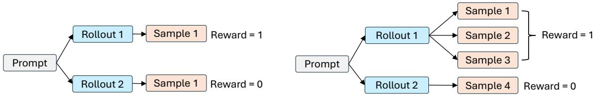
</div>
图注：Agent Lightning v1.0 论文 Figure 4：同一 group 内 rollout 与训练样本的展开关系。左：传统 agentic RL 每 rollout 一个样本；右：harnessed agentic RL 中一个 rollout 展开成多个样本且共享奖励。来源：Agent Lightning v1.0 (arXiv 2608.17528v1)。

**loss normalization 是同一问题的另一半**。三种常见做法的公式（沿用论文 §2.3 的记号，$\ell_{\rho,j,t}$ 是 rollout ρ 第 j 个 sample 第 t 个响应 token 的逐 token loss，$L_{\rho,j}$ 是它的响应长度）：

$$
\mathcal{L}_{\text{token-mean}} = \frac{\sum_{\rho}\sum_j\sum_t \ell_{\rho,j,t}}{\sum_\rho\sum_j L_{\rho,j}}
$$

$$
\mathcal{L}_{\text{seq-mean}} = \frac{1}{\sum_\rho N_\rho}\sum_\rho\sum_j \frac{1}{L_{\rho,j}}\sum_t \ell_{\rho,j,t}
$$

$$
\mathcal{L}_{\text{rollout-mean}} = \frac{1}{R}\sum_\rho \frac{\sum_j\sum_t \ell_{\rho,j,t}}{\sum_j L_{\rho,j}}
$$

token-mean 按总 token 数归一（DAPO 用），seq-mean-token-mean 先每行内平均再对行等权（经典 GRPO 写法），rollout-level token-mean 先把一个 rollout 的所有 token 池化再对 rollout 等权。论文 Figure 5 给了数值例子：Rollout A 两个样本长度 50/100，Rollout B 三个样本各 30，Rollout C 一个样本 40；token-mean 是 6 个样本损失之和除以 280，seq-mean 是 6 个样本均值的算术平均，rollout-mean 是三个 rollout 各自池均值再除以 3。**seq-mean 的缺陷正是「样本数是偶然因素」**：一个 rollout 被拆得越碎，它在 1/ΣN 里占的份额越大；它同时把「长样本」与「短样本」按行均等对待，长样本的逐 token 平均在行内被稀释。Agent Lightning 的实验组把这个问题量化了：三个设置（sample-level advantage + token-mean；rollout-level advantage + token-mean；rollout-level advantage + rollout-level norm）里，最后一个在 step 128 拿到 38.2% 的 validation reward，高于基线的 35.0% 与只修 advantage 的 33.1%，且 policy entropy 增长更慢更稳；最终 checkpoint 在 SWE-bench Verified 上从 41.8% 提升到 56.4%（[Fig.9](https://arxiv.org/html/2608.17528v1)）。作者还从实践中给了一个忠告：token-mean 对长序列敏感，当一批里出现很多长负样本时靠后训练会不稳定，所以最终选择 rollout-level token-mean。

<div style="text-align: center;">
  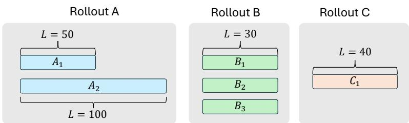
</div>
图注：Agent Lightning v1.0 论文 Figure 5：三种归一化方式对同一批次的权重分配不同（批内有 3 个 rollout、6 个样本、多种长度）。来源：Agent Lightning v1.0 (arXiv 2608.17528v1)。

**代码锚点：Agent Lightning 是怎么落实 rollout-mean 的。**先看 advantage：`rollout_level_advantage.py` 用 rollout_id 把训练行分组，每个 rollout 取代表行（并校验同组行共享同一 uid 与相同奖励），只对代表行调 verl 的 `compute_advantage`，再把得到的**标量 advantage 广播**回该 rollout 的所有行（乘以 response_mask），于是组统计发生在 rollout 层、每一行拿到的是同一份 A_r。再看 loss：`normalize_advantages_by_rollout` 把每一行的 advantage 除以「该 rollout 的总 token 数 × 训练行数」，然后 `compute_policy_loss_per_rollout_mean` 做 masked sum。把这两步合起来看，第 r 个 rollout 对总损失的贡献是：

$$
\frac{A_r\sum_{t\in r}\ell_t}{T_r \cdot n_{\text{rows}}} = \frac{A_r \cdot \overline{\ell}_r}{n_{\text{rows}}}
$$

于是总损失等于 (1/n_rows)Σ_r A_r·ℓ̄_r，恰好是论文 Eq.16 的 (R/n_rows) 倍：**实现与论文公式只差一个随 batch 构成变化的标量**，梯度方向完全一致，但每步的有效学习率会随「平均每个 rollout 拆成多少行」略有波动（[per_rollout_loss.py](https://github.com/microsoft/agent-lightning/blob/218f1f7c0bac0800de4d5a4e5e6f61cf7b5038b4/agentlightning/verl/per_rollout_loss.py#L16)，对应测试 `test_normalize_advantages_by_rollout` 直接断言两个 rollout 各占 1/n_rows 的 mass）。这就是 2.5 节「方向一」在训练侧必须配套的东西：**合并改变的是证据组织，reward 分组与 loss 归一化必须保持 rollout 级，否则合并本身就会改变优化目标**。

这个「动态样本数」不是边角情况：Agent Lightning 的 coding-agent 训练里平均只有 36% 的 rollout 保持单个训练样本，每个 rollout 平均产生 2.41 个样本（Fig.10 左图给出全程波动：早期约 0.4–0.5、后期跌到 0.2–0.3）。

<div style="text-align: center;">
  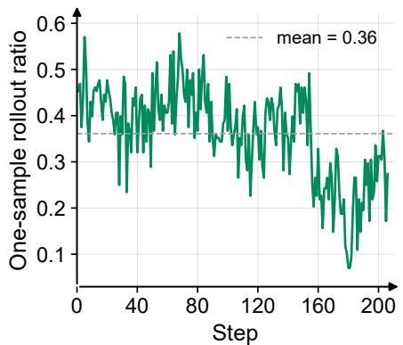
</div>
图注：Agent Lightning v1.0 论文 Figure 10（左）：单个样本的 rollout 占比，均值 0.36。来源：Agent Lightning v1.0 (arXiv 2608.17528v1)。

顺带把论文对其他框架的分类记下（这是论文口径，我在本地只核验了 slime 的轨迹组织、未逐行核验 slime 的 loss reducer）：verl Uni-Agent 与 Polar 按 rollout 级算 advantage，slime 与 AReaL 按 sample 级算；slime 实现的是 rollout 级 token-mean loss。这些差异正好说明：**框架间的「支持多轮」语义并不等价**，选型时要把这格当成一等公民来核对。

**没有一种 normalization 对所有任务都最优**。可选的单位是：按 token、按训练行、按 segment、按 episode，还是按逻辑 rollout？例如 NeMo Gym 的 mask 会减少可训练信号、Dressage 以「父级（rollout）归一化 + advantage 广播」的方式在 segment 与 rollout 之间做折中、PRIME-RL 先评分后展开让 group 统计先于样本展开成立。选哪层归一化应该是一个显式决策，而不是「顺手沿用上一代的写法」。

### 5.4 Policy version、异步与 streaming：不能靠一个字段解决

**`weight_version` 是证据，不是正确性证明。**对持续很久的 agent，一个 episode 里完全可能出现混合版本：Call 1 用 policy v100、Call 2 用 v100、Call 3 用 v101、Call 4 用 v103。系统可以选择的策略包括：冻结整个 episode 的策略、暂停并排空、允许跨版本但逐段记录、或用异步校正。前文提到 rLLM 的 gateway 会在请求上打自己维护的版本戳、`unified_trainer` 在 fully-async 路径统计 staleness 并在权重同步时把新版本推给 gateway；Dressage 则用 `version_switches` 与 `dressage_staleness_keep_versions` 做 batch 级/partial-rollout 级两级控制，并支持「按版本段 mask」；Agent Lightning 的异步文档把流程写成「权重更新前 gateway 暂停新请求、等待 in-flight 完成、更新后恢复」，暂停期间请求收到可重试的 429（带 Retry-After），配套指标 `proxy_inflight_at_pause`/`proxy_drain_seconds`（[35-asynchronous-training.md](https://github.com/microsoft/agent-lightning/blob/218f1f7c0bac0800de4d5a4e5e6f61cf7b5038b4/docs/35-asynchronous-training.md)）。这些机制的范围各不相同：「停止接新 episode」「停止接新模型请求」「等待当前 generation 结束」「等待整个 agent episode 结束」是四种不同的 barrier，不能混为一谈；而「支持 version 字段」也绝不能直接写成「严格 on-policy」。

Agent Lightning 的 collocated async 把「异步」这个字眼的第三种解法画成了完整对比（下图）：sync 需要最少 GPU 但训练步必须等最慢的 rollout（低效等待）；标准 async 把 rollout 与 update 分成两个 GPU 池（高效但 GPU 总量翻倍、还要管两个队列的节奏差异）；collocated async 让 rollout 与 update 时分复用同一池 GPU，API Gateway 在 update 前停止接新请求、等当前请求完成，之后才恢复；用户侧看到的只是暂停间隙的 429 重试，harness 无感知。论文报告约 2× 的端到端速度提升且 GPU 用量反而更少。

<div style="text-align: center;">
  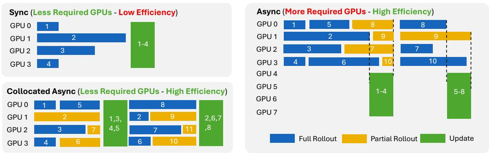
</div>
图注：Agent Lightning v1.0 论文 Figure 6：Sync、Async 与 Collocated Async。蓝色=完整 rollout，橙色=部分 rollout，绿色=更新。来源：Agent Lightning v1.0 (arXiv 2608.17528v1)。

**重要性采样比也依赖 token 与条件正确。**在简化的 policy-gradient 表达里，设一次采样的响应为 $Y_i=(y_1,\dots,y_L)$，$y_t$ 是第 t 个动作 token、$h_t$ 是它的条件历史，off-policy 校正的系数是：

$$
r_t(\theta)
=
\exp\left[
\log \pi_\theta(y_t\mid h_t)
-
\log \pi_{\text{rollout}}(y_t\mid h_t)
\right]
$$

它从 policy ratio 来：要把「在新策略下的期望梯度」改写为「在旧策略分布下的期望」，就要逐 token 乘上 π_θ(y_t|h_t)/π_old(y_t|h_t)，取对数后就是上式。这个比值至少要求三点成立：(i) 两个概率必须对应**相同的动作 token 与相同的条件历史**，如果 y_t 本身是重分词版本、h_t 里的前缀是重新渲染的，那么分母这个「事件」在旧策略下根本没有发生过，比值无从谈起；(ii) logprob 的采样参数口径要明确，vLLM 接口返回的 logprobs 是在给定 temperature/top-p 等采样参数下计算的，与训练 forward 时无采样参数的真实密度不完全一致，这正是 OpenRLHF 提供 `is_correction_enable`、Agent Lightning 在异步文档里推荐 verl rollout correction（`rollout_is: token`、阈值 2 的 TIS）的原因，它们针对的是「同 token、同条件、不同概率口径」的校正；(iii) rollout 策略、当前策略、reference model 的三种概率不能混淆，reference model 只服务于 KL 惩罚项，把它当成行为策略密度会让比值变成另一个东西。所以结论很清晰：**off-policy correction 能补救的是概率口径不一致，不能补救重分词错配或错误上下文拼接**，后两者在 r_t 的分子分母都不成立之前就已经错了。

**Streaming 有三种完全不同的能力**，这不是性能小差异：

| 模式 | 含义 | 本轮实例 |
| --- | --- | --- |
| 拒绝 streaming | 客户端必须关闭流式 | Agent Lightning 已查 proxy（`stream=true` 直接 HTTP 400） |
| 模拟 streaming | 完整生成后再转成 SSE | Polar、Uni-Agent、AgentJet、AReaL 底层客户端的已查路径 |
| 真实流式代理 | 生成中持续转发，同时记录 token/事件 | rLLM 的普通路径（逐 chunk 转发并内部缓冲建 trace）；NeMo Gym/verifiers 按后端能力 |

如果 harness 依赖流式接口：在部分输出到达时提前执行工具、根据首 token 延迟做决策、或取消生成，模拟 streaming 会改变执行路径（取消语义丢失、首 token 延迟变成「整个生成完成后才返回第一个 chunk」、工具执行时机被后移）。这正是「保留部署侧控制流」的代理路线最容易被低估的一格：**部署时开流式、训练时被模拟**，agent 行为表现就可能不同，而这又是训练分布的一部分。

### 5.5 Retry 去重：必须以「实际消费」为目标

仅用 request hash 去重可能误删合法的重复采样（同一 prompt 的多次独立尝试 hash 相同）；全部保留则可能训练从未被 agent 消费的结果。各项目的解决范围不同：AReaL 用「后续调用是否收养」判定一部分被消费的响应，末尾无后续时回退生成时间（见 3.3 节）；Agent Lightning 论文描述 Customized Trainer 对相同 prompt 的 `model_request` 事件只保留最近一次（这是我按论文 §3.2 口径记录，未在本地 adapter 中另行核验）；NeMo Gym 用终端响应归属与完整单链校验处理歧义，无法归属就 mask 整个样本。**这些是不同范围的保障，不能统称「exactly-once RL」**：AReaL 的启发式不覆盖同一 prompt 的合法并行分支，NeMo Gym 的严格单链会牺牲掉可训练信号换取确定性，而「被采用」这个语义在不同 harness 里本来就是不同的。

## 6. Scalability：代理解决了什么，又把复杂度移到了哪里

### 6.1 改善的是部署与调度边界，引入的是新的分布式状态

API 边界切开之后，ROI 最大的收益是资源解耦：CPU/sandbox worker 跑 agent（shell、browser、测试），GPU inference worker 合并多个 agent 的模型请求，GPU trainer worker 执行 policy update，data plane 负责把 token、trajectory、reward 搬来搬去。Polar 的独立 rollout 服务、Uni-Agent 的 gateway actors、AgentJet Swarm 与 rLLM 的异步训练循环都体现了这种解耦，它天然适合长尾 agent 任务：工具等待不必占住训练 GPU，sandbox 数量也不必与 trainer rank 一一对应。Polar 论文 Figure 5b 用一模一样的配置只切换轨迹重建策略，展示了这套边界上的效率差异：prefix_merging 把 trainer 更新从 1185 次压到 218 次、墙钟从 189.5 分钟降到 35.2 分钟（5.39×），rollout GPU 平均利用率从 20.4% 提到 87.7%（这也说明：**同一个 proxy 边界上的不同 downstream 组织策略，本身就是性能变量**）。

<div style="text-align: center;">
  
</div>
图注：Polar 论文 Figure 5(b)：不同轨迹重建策略下的 GPU 利用率。prefix_merging 明显更短更满。来源：Polar (arXiv 2605.24220v1)。

但同时，新的系统必须管理一条真正的生命周期链：capture 的一条记录从产生到删除，中间要经历「交付/消费了吗 → reward 就绪了吗 → 轨迹定稿了吗 → trainer 接受了吗 → 可以安全删除吗」。NeMo Gym 的 freeze/finalize/durable-handoff/retire 就是在显式处理这条链（3.11 节），而不是「生成完立即删缓存」；AgentJet 用 sample pool 与「episode 已经 claimed/aborted」的显式消息管理同类状态；verifiers 把「admission 后才 flatten」写进了算法文档。

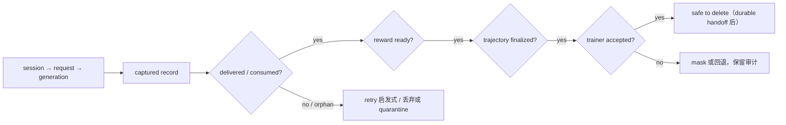

### 6.2 不能只比较 requests/s 或 tokens/s

针对这类系统，更有意义的指标应该是**有效训练信号吞吐**：

$$
\text{有效训练信号吞吐}
=
\frac{\text{最终被接受、且 token/条件/概率逐项对齐的 trainable tokens}}{\text{总墙钟时间}}
$$

分子强调「被接受且对齐」：一次被 mask 的链、一次被 retry 启发式丢弃的记录、一段被补零的 logprob，在 requests/s 与 tokens/s 里都算「吞吐」，但在有效信号里只有真正进入 optimizer 的 token 才算数；分母强调「总墙钟时间」：从任务提交到训练接受，中间包括 sandbox 初始化、推理、轨迹构建、评价、排队与版本同步，这些在纯推理吞吐指标里全部不可见。还要配套观察 capture coverage（被捕获调用占全部模型调用的比例）、dropped-segment fraction、staleness、sandbox 利用率与 trainer idle ratio，以及完成任务的总成本。这个指标组合是本文的工程建议，现有项目已经分别提供 capture-delivery 指标（NeMo Gym）、staleness 统计（rLLM/Dressage）与 idle-ratio 记录（Polar），可作为实施基础；**但我这一轮没有找到足以支持跨候选统一排名的同条件性能证据**，因此不能严肃地给出一个无条件的「最快 proxy RL 框架」。

## 7. 时间线：不是一条简单替代链

| 时间 | 可验证事件 | 架构含义 | 本地核验 |
| --- | --- | --- | --- |
| 2025-08-19 | vLLM 合入 PR #22587：OpenAI API 增加 `return_token_ids` | proxy 要拿精确 token ids 有了官方的 engine 侧出口 | ✓ 本地 verl/vllm 仓库 git log（squash 提交 24f4d1a224） |
| 2025-10-01 | Agent Lightning 最早 proxy commit（`a9d0c923` "Add LLM proxy (#122)"，661 行 `llm_proxy.py`；也是该仓库最早出现 `return_token_ids` 的提交） | proxy 路线不是 2026 年才出现 | ✓ 本地 agent-lightning git log |
| 2025-10-22 | vLLM 博客《No More Retokenization Drift》 | 漂移问题被正式命名，token-ID 返回与 Agent Lightning 的合作公开 | ✓ 参考资料归档 |
| 2026-01-06 | AgentJet 仓库早期提交（tuner v2、改名 ajet） | swarm 路线的雏形期；论文 arXiv 2606.04484v2 于 2026 年 6 月发布 | ✓ 本地 AgentJet git log（2026-02-20 的「公布」日期未核验到） |
| 2026-03-27 | Uni-Agent 仓库首个提交 | gateway/runner 体系以独立仓库形态出现 | ✓ 本地 uni-agent git log（草稿的 verl RFC 2026-03-28 日期未核验到） |
| 2026-05-26 | slime `coding_agent_rl` 示例提交（b6764131） | 原生 rollout 框架开始提供 external-harness 路径 | ✓ 本地 slime git log |
| 2026-05-31 | slime v0.3.0 tag（bf14dc21） | 示例随版本发布 | ✓ 本地 slime git log |
| 2026-06-20 | Dressage release v0.1.0（bd89821） | native harness、TITO、segment 与训练系统组合 | ✓ 本地 Dressage git log |
| 2026-07-01 起 | verifiers 仓库 v1 相关提交成批出现（2026-07-01/02） | harness/runtime/trace/interception 被重新分层（博客发布日期以官方为准） | ✓ 本地 verifiers git log（blog 具体发布日期未核验） |
| 2026-04-28 | Turnstile 仓库初始提交（8d4c2c3）；Amazon 技术说明发布时间以官方为准 | 独立 token-faithful gateway 有公开 RL 使用证据 | ✓ 仓库日期 2026-04-28；Amazon 博客日期未核验 |
| 2026-08-17 | Agent Lightning v1.0 合入 main（8f8b8f95）；2026-08 论文 arXiv 2608.17528v1 | harnessed agentic RL 的挑战被系统化 | ✓ 本地 agent-lightning git log |
| 2026-09 | NeMo Gym v0.6.0（本地 tag 指向 3045a7933，commit 日期 2026-09-08） | 环境/agent 平台加入外部 harness 的训练 token 捕获 | ✓ 本地 Gym git log（GitHub release 页面日期 2026-09-03 为资料口径） |

这张表要纠正一个常见误判：**Agent Lightning v1.0 不是该项目第一次出现 proxy**。仓库历史里最早的 proxy 与 `return_token_ids` 提交在 2025-10-01，随 2025-10-22 vLLM 博客公开；v1.0 是「完全重构」（README 措辞「completely refactored in v1.0」），是把架构与训练管线重新组织并系统化验证，而不是从「完全没有代理」突然转向代理。另外两类材料不能当已完成能力计数：SkyRL 的 TITO proxy 相关 RFC 仍处于 open 状态（[issue #1959](https://github.com/NovaSky-AI/SkyRL/issues/1959)，[RFC] TITO Proxy）；OpenForge-RL 已有公开仓库（MSR-Orchard，HEAD f701e0f6），但本文未对该实现做源码级核验，且它与本 RFC 的承接关系未证实，所以归入「后续观察对象」而不是「已确认实现」。

## 8. 分类与选型：三个正交轴与一条验收链

### 8.1 把分类从「互斥桶」重构为三轴

与其把项目分成 A-H 八个互斥桶，不如用三个正交轴描述：

| 轴 | 关键选项 |
| --- | --- |
| 控制权/集成边界 | 外部 HTTP、SDK/hook、自定义 executor、RL-native loop |
| 训练表示/保真机制 | exact per-call、严格前缀合并、在线 TITO、文本重建 |
| 产品层级 | trainer、gateway/bridge、rollout service、environment/runtime、托管训练 SDK |

这种分类能描述真实混合系统，也不会因为一个项目同时提供多种模式而自相矛盾。例如：Polar + slime = 外部 HTTP + per-call/prefix builder + rollout service 与 trainer 的组合；OpenPipe ART LangGraph = SDK 集成 + 框架内 trajectory 采集 + agent training framework；OpenRLHF API 示例 = executor 内嵌 HTTP server + 稳定前缀 token stitching + framework recipe。三个轴合起来还可以解释那些「看起来矛盾」的判定：AgentJet 在「控制权」轴上几乎零侵入，在「保真机制」轴上默认用文本匹配，在「产品层级」轴上是 trainer+serving 混合体。

### 8.2 面向你的目标，优先看什么

| 选型目标 | 优先考察对象 | 判断依据与边界 |
| --- | --- | --- |
| 已有复杂 coding harness，尽量保留原生控制流 | Dressage、Polar + slime、slime 外部 agent 模式 | 原生 CLI、sandbox 与训练桥接路径明确；仍需验证协议与分段行为 |
| 已有 verl 训练栈，希望减少框架内 agent 重写 | Agent Lightning、Uni-Agent + verl | 已有模型边界捕获与 verl 数据消费路径；streaming 是重要筛选项 |
| 需要通用 agent 服务与成熟分布式 RL 管线结合 | AReaL、rLLM | session、gateway、workflow、训练后端与异步版本管理较完整 |
| 重点是多 agent/异构模型编排 | AgentJet Swarm，并对照 AReaL/rLLM | AgentJet 有多目标设计；必须审计默认文本匹配与实际 loss 归属 |
| 已经采用 PRIME 的训练/评测生态 | PRIME-RL + verifiers v1 | trace graph 与训练数据契约清晰；先确认 harness 能走当前 TrainClient 支持的 API |
| 已经采用 NeMo Gym/NeMo RL | v0.6.0 外部 token capture | 可复用原生 trainer 消费格式；当前单链与非 stock prefix extension 是关键约束 |
| 已有 trainer，只缺一个精确 token gateway | Turnstile、rLLM model gateway | 应按独立构件评估；需要自己验证 trainer adapter 与完整数据生命周期 |
| Python agent 可修改，更重视语义级插桩 | OpenPipe ART 或框架 executor | SDK/hook 可能比 opaque HTTP 更容易获取 agent 语义，不必强求代理 |
| 从零设计 agent 算法，需要完整步级控制 | verl AgentLoop、OpenRLHF executor、ROLL | 原生循环不是劣势，反而便于显式状态、奖励与动作建模 |

这些都是基于架构匹配的候选排序，不是同条件训练 benchmark 的冠军排名；「Most mature」「Highest token fidelity」「Best scalability」目前都不宜各给唯一项目。更可靠的表述是：端到端训练接入证据较完整的是 Lightning、AReaL、rLLM 与 slime 相关组合；token contract 比较清晰、适合重点审计的是 Lightning 的 strict-prefix/per-call 路径、Turnstile 的训练序列导出、PRIME 的 token-input TrainClient；原生长程 harness 系统问题覆盖较具体的是 Dressage、Polar；最新但边界必须特别留意的是 NeMo Gym 外部 capture 与 verifiers v1。

### 8.3 验收链：把「证明成本」落到实处

最后的工程判断是：**当前开源生态已经提供了「不重写成熟 harness，而从模型调用边界接入 RL」的真实可行路线**，研究重点不应再停留在「哪个项目写了 unified proxy」，而应转向下面这条验收链：

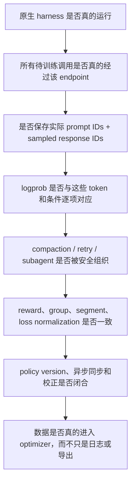

对你的目标，最值得优先深入的是 Dressage、Polar + slime、slime 原生外部 agent 模式、Agent Lightning、AReaL、Uni-Agent 与 rLLM；PRIME-RL/verifiers 与 NeMo Gym 必须纳入「当前版本已发生架构变化」的名单；Turnstile 应按独立 gateway 评价，OpenRLHF 应按模式评价，OpenClaw-RL/MetaClaw 的已查重分词路径不能与严格 token-faithful 方案混为一谈。这张版图最核心的结论是：

> **API proxy 把「重写 agent 的成本」转移成了「证明训练轨迹正确的成本」。真正成熟的基础设施，不是最会宣称 zero-code integration 的项目，而是能把这种证明落实到 token、上下文、调用归属、奖励和策略版本上的项目。**

## 9. 差异与裁决

按「本地锁定源码 > 参考资料/论文原文 > 草稿」的规则，本次成稿与草稿、参考文献的记录如下：

1. **slime harness 路径**：草稿写 `slime/agent/harness.py`，实际是包 `slime/agent/harness/`，`BaseHarness` 在 `common.py:57`；已按源码修正。
2. **Turnstile 合并层级**：草稿称「分支与合并在 token 层进行」，核验结果是否定的：前缀匹配在 normalized 消息内容层（`conversation.rs` `find_longest_prefix`），token 只是匹配后的缓存复用与拼接，每个 leaf 导出完整序列、共享前缀重复拷贝；已按源码改写。
3. **rllm 四函数归属**：`transform_to_backend_batch` 等是 backend 协议方法（verl/tinker/fireworks 各实现一份），`unified_trainer.py` 是调用方；已按源码改写，并补充「async 路径下 advantage 在 buffer 内先行计算」的细节。
4. **rllm README 措辞**：草稿称 README「同时包含原生 harness」，实际 README 描述的是 Workflow Engine/Model Gateway/Transform Pipeline/Training Backend 与 10+ CLI harnesses，没有「原生 harness 分层」字样；已按实际表述改写。
5. **OpenRLHF 文档**：草稿引用的 readthedocs agent_training 页在本地仓库无对应源文件；importance sampling 校正选项在 README（`--algo.advantage.is_correction_enable` 等）与 `openrlhf/models/loss.py` 中核验存在；文中以 README 小节为本地可核验版本。
6. **fork 口径**：AReaL、slime、verl 本地副本是 PraMamba fork（AReaL 的核对路径为 `areal/experimental/openai/*`），所有结论仅代表该 fork commit 状态；上游 inclusionAI/AReaL、THUDM/slime 与 verl-project/verl 的对应文件可能存在差异，未逐文件比对。
7. **verifiers 路径**：代码路径比草稿多一层包前缀（`verifiers/v1/clients/train.py`）；`TrainClient.get_response` 对非 Chat dialect 抛 `NotImplementedError` 已核验（L337/L341-345）。
8. **NeMo Gym 文档路径**：仓库没有顶层 docs/，教程在 `fern/versions/latest/pages/training-tutorials/external-agent-harnesses.mdx`；四条断言（单链交付、额外链、终端响应归属与 mask、exact-prefix supply 需后端扩展且 stock vLLM 不支持）逐条核验成立。
9. **uni-agent 异步定性**：framework 代码称 TQ「consumed by sync training」并显式对齐 verl sync trainer，而 README/entry 又宣称 fully async recipes；verl submodule 未检出，verl 侧无法本地核验；文中按「双面证据、取决于组合 trainer 模式」处理。
10. **AGL model version**：事件里有 `model_version: server.version` 字段，但仓库内没有把该字段更新为非 0 值的代码路径（注册模型用默认 version=0）；表述为「版本字段存在、更新链路不可见」。
11. **AgentJet 细节**：`begin_episode` 的 key 是 base64 编码的 `{agent_name, target_tag, episode_uuid, episode_address}`，base_url 只含 master IP:port，「目标模型」经 target_tag 间接路由；`preserve_sampling_params` 当前无下游消费者；token/text 级匹配在 context_tracker 的 timeline_merging 模块而非 oai_model_server。
12. **AReaL streaming**：底层 `ArealOpenAI` 的流式是模拟的（完整生成后切 chunk），「存在流式代码」不能当「真实流式语义」。
13. **AWS AgentCore RL Toolkit**：草稿「复用 rLLM model gateway」的说法不成立；文档显示 model-gateway 是 toolkit 自己的数据平面组件，rLLM 只是 slime/rllm/verl 三个可插拔训练后端之一；正文按后者表述（本轮未深入其代码）。
14. **OpenEnv**：仓库已从 meta-pytorch 301 跳转到 huggingface/OpenEnv；引用使用新 org 的固定 commit（8e6e2770）。
15. **版本与日期**：草稿若干时间线日期（AgentJet 2026-02-20、verl RFC 2026-03-28、verifiers 博客 2026-07-10、NeMo Gym 发布 2026-09-03、Amazon 博客 2026-07-09）无法全部在本地复核，时间线表逐行标注「本地核验」或「资料口径」。
16. **论文骨架出的数字**：AGL 论文 Figure 9/10 的数值（38.2/35.0/33.1、36%、2.41、41.8→56.4）按论文正文引用；slime「sample 级 advantage + rollout 级 token-mean loss」的归类来自论文口径，本地仅核验了 slime 的轨迹组织（`_split_chain_into_builders` 与 CLEAN/REALIGN/FORK），未逐行核验其 loss reducer。
17. **图片与事实核对**：本文引用的 19 张参考图全部先经 `read_image` 目检后引用；其余未引用图（多为表格/公式位图，且 md 已有等价的 HTML 表格与 LaTeX 公式）未逐一目检。附录 A.1 的框架对比矩阵（表 3）以 Polar 论文口径为参照，未逐项重新审计。

## 参考

论文与博客：

- Agent Lightning v1.0 (arXiv [2608.17528v1](https://arxiv.org/html/2608.17528v1))，本地归档 `references/papers/agent-lightning/`
- AgentJet (arXiv [2606.04484v2](https://arxiv.org/html/2606.04484v2))，本地归档 `references/papers/agentjet/`
- Polar (arXiv [2605.24220v1](https://arxiv.org/html/2605.24220v1))，本地归档 `references/papers/polar/`
- vLLM Blog《No More Retokenization Drift》(2025-10-22)，本地归档 `references/articles/vllm-agent-lightning/`
- primeintellect.ai《verifiers v1》(2026-07)，本地归档 `references/articles/verifiers-v1/`

本地源码（全部以 `git rev-parse HEAD` 复核；链接格式为 `blob/<full-hash>`）：

- microsoft/agent-lightning `218f1f7c`：`agentlightning/server/proxy.py`、`agentlightning/verl/{rollout_adapter,per_rollout_loss,rollout_level_advantage,trainer}.py`、`docs/{25-api-gateway-configuration,35-asynchronous-training}.md`
- PraMamba/AReaL（fork）`ad27064e`：`areal/experimental/openai/{cache.py,proxy/proxy_rollout_server.py,types.py}`、`docs/en/reference/agent_workflow.md`
- PraMamba/slime（fork）`87070741`：`slime/agent/{trajectory.py,harness/common.py,adapters/*}`、`examples/coding_agent_rl/{generate.py,README.md}`、`slime/utils/types.py`
- verl-project/uni-agent `bb96eca0`：`uni_agent/gateway/{gateway.py,session/session.py}`、`uni_agent/framework/framework.py`、`uni_agent/framework/entry.py`、`README.md`
- PraMamba/verl（fork）`9ff05e32`：`verl/experimental/agent_loop/agent_loop.py`、`verl/trainer/ppo/{ray_trainer,core_algos}.py`
- rllm-org/rllm `3b40c37c`：`rllm-model-gateway/src/rllm_model_gateway/{proxy.py,data_process.py,models.py,token_accumulator.py}`、`rllm/trainer/{unified_trainer.py,agent_trainer.py,backend_protocol.py}`、`README.md`
- Accio-Lab/Dressage `3e3142fe`：`dressage/proxy/{server.py,session_manager.py,generation_controller.py,trajectory_store.py,tito/*}`、`dressage/rollout/{multi_segment.py,artifacts/samples.py,staleness.py}`、`dressage/training/reward_post_process.py`、`blackbox_server/proxy/rollout_llm_proxy.py`、`docs/{proxy,training,staleness}.md`
- modelscope/AgentJet `25118bbc`：`ajet/tuner_lib/experimental/{swarm_client.py,oai_model_server.py,swarm_server.py,interchange_utils.py}`、`ajet/context_tracker/{multiagent_tracking.py,async_llm_bridge.py}` 与 `context_tracker/timeline_merging/timeline_merging.py`、`ajet/tuner_lib/as_oai_baseurl_apikey.py`
- PrimeIntellect-ai/verifiers `b5d0424f`：`verifiers/v1/{interception/server.py,clients/train.py,types.py}`、`verifiers/v1/dialects/__init__.py`
- PrimeIntellect-ai/prime-rl `dad79d1c`：`docs/algorithms.md`
- NVIDIA-NeMo/Gym `4fb721d0`：`nemo_gym/token_id_capture/{delivery.py,consumer.py}`、`fern/versions/latest/pages/training-tutorials/{external-agent-harnesses,offline-training-w-rollouts}.mdx`
- amazon-agi-labs/turnstile `39e140bd`：`crates/turnstile-core/src/{training.rs,conversation.rs}`、`README.md`
- OpenRLHF `3f8ae08c`：`examples/python/agent_func_openai_server_executor.py`、`README.md`、`openrlhf/models/loss.py`
- Gen-Verse/OpenClaw-RL `f48ac358`：`openclaw-rl/openclaw_api_server.py`
- NVIDIA-NeMo/ProRL-Agent-Server（stable）`6a1ead6b`：`src/polar/{gateway/*,trajectory/builder/*,agent/presets/*}`、`src/slime_bridge/adapter.py`
- vllm-project/vllm `d8d53f17`：`vllm/entrypoints/openai/chat_completion/{protocol.py,serving.py}`；PR #22587 合入提交 `24f4d1a224`（2025-08-19）；`v0.10.2` tag `01efc7ef`
- aiming-lab/MetaClaw `922caf3a`（远程 clone 核验）：`metaclaw/api_server.py`、`metaclaw/trainer.py`

repo 内交叉引用（均为 published 状态）：

- [AgentLoop 源码浅析](rlhf/verl/multi-turn/code-walk-through/readme-6.md)：RL-native loop 路线的前序知识
- [深入浅出 slime RL 框架](rlhf/slime/code-walk-through/readme.md)：slime 训练侧底座
- [AReaL Code Walk Through](rlhf/areal/code-walk-through_CN.md)：AReaL 训练框架本体
- [RL 系统深思：权重更新机制](rlhf/sys-design/readme-1.md)：policy version 与异步训练语义
- [从 tokenizer 视角分析 Agentic 多轮训练的复杂性](rlhf/verl/multi-turn/fast_tokenization/multiturn_tokenization_and_masking_ZH.md)：重分词漂移的近亲
- [dots3-note Preview](sglang/dots3-note/readme.md)：长程 agent 的 context compaction 与信用分配
- [Kimi K1.5：Long Context RL 的成功实践](rlhf/partial-rollout/readme.md)：partial rollout 与分段训练
- [让速度与精度同在（Miles/slime 训推不一致）](rlhf/slime/mismatch/blog-cn.md)：kernel 级训推不一致与 TIS/MIS（README 中标注【Not finished】，作延伸阅读）

<!-- /learn-write 自动检查报告
双轨检查：PASS。概念框架（第 1、2 章：所有权、调用元组、漂移、两方向）先于代码分析（第 3 章起）建立；代码全部来自本地锁定 commit 的真实系统（agent-lightning/verl/slime/AReaL/uni-agent/rllm/Dressage/AgentJet/verifiers/Gym/turnstile/OpenRLHF/OpenClaw-RL/ProRL-Agent-Server/vllm）；第 3 章每个项目遵循「定位 → 集成边界 → 代码链 → 亮点与限制 → 判定」，概念轨到代码轨的过渡在 2.5 节末驱动问题处自然发生。
叙事检查：PASS。开篇以具体问题（改 base_url 能否直接 RL）进入个人动机，先亮核心对照结论（10 vs 4），路线图为 4 条编号列表；致谢自然；结论与文化引用来回使用设问句；交叉引用只指向 published 文章（AgentLoop、slime 走读、AReaL、权重更新、tokenizer 多轮、dots3-note、partial-rollout、mismatch），无 [Pending Review] 引用。
深度检查：understand-reproduce（跨项目源码验证到文件级）→ 实际深度一致；verl/slime 相关部分按源码级处理，论文部分按「引用 + 结论归因」处理，未混写。
递进推导检查：PASS。每节开头显式承接前节结论（3.2「两个实现细节值得先说」承接 2.3 的替换风险；5.3 从 5.2 的三层区分过渡；5.4 承接 5.3 的动态样本数）；约束映射融入行文（「这正是 2.5 节方向一在代码层的落实」）；无独立映射表；驱动问题在 2.5 节末尾出现；重要设计决策（rollout-level vs sample-level advantage、三种 loss normalization、per-request vs prefix merging）均给出演进与对比；合并/统一设计处说明了什么变什么不变（如 uni-agent gateway 与推理引擎的关系）；同一设计决策的工程挑战合并为一个 ##（第 5 章五个 ### 子节）；「为什么不用 X」按「X 解决什么 → 场景为什么不需要 → 结论」展开（如 3.13 对 ART 的适用范围）；模型/系统介绍先全貌（论文 Figure 或 README 定位）再有 代码链与细节点；无 ASCII 艺术字（正文线性结构使用编号列表、对比表或 mermaid）。
交叉引用建议：第 5.3 节归一化公式可再指向 [verl 参数速览](rlhf/verl/multi-turn/code-walk-through/readme-5.md) 的 loss 配置说明（按需）。
-->
