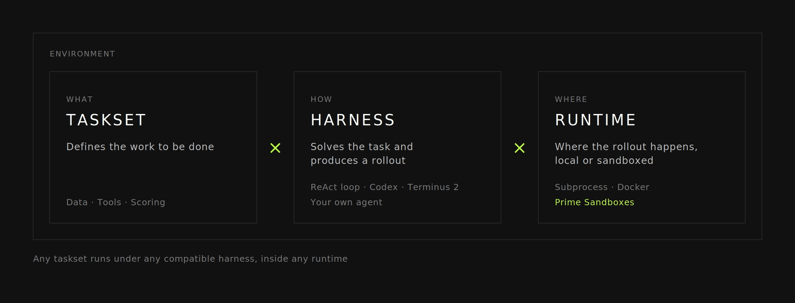
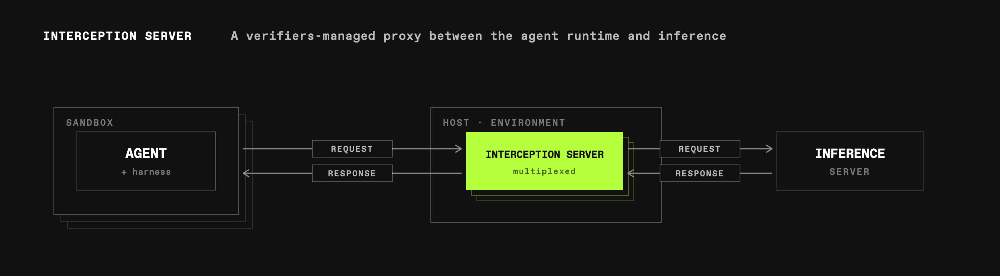
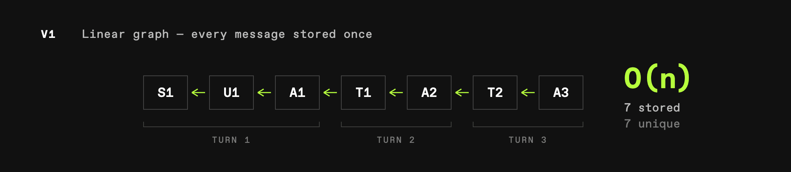
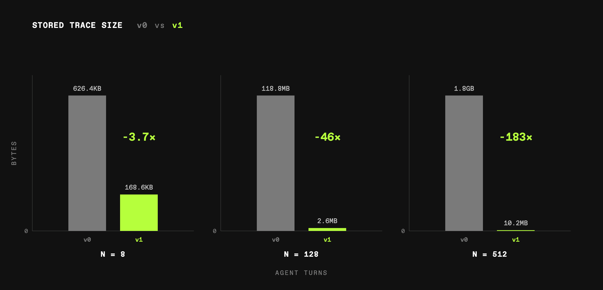
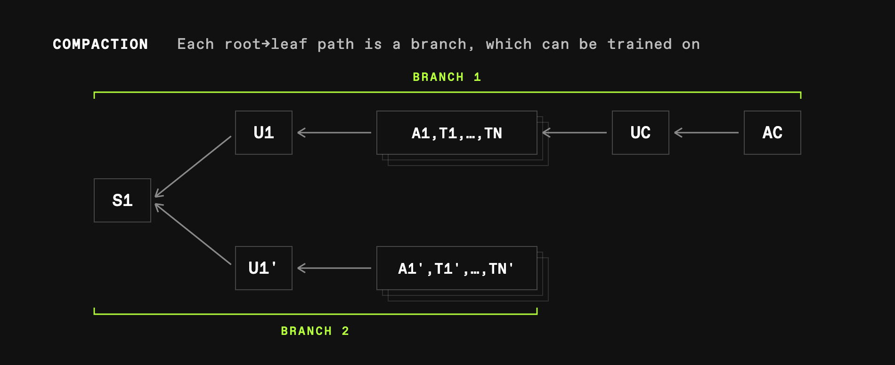
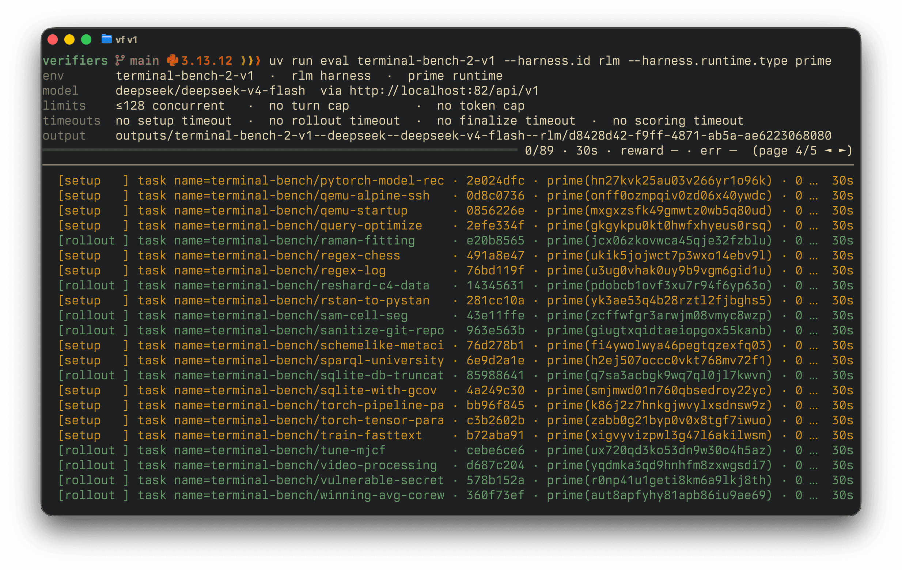
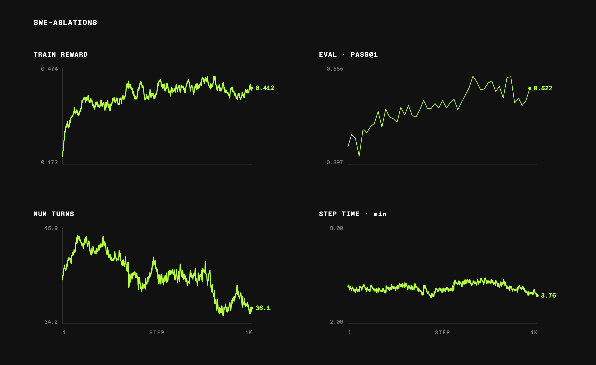

# verifiers v1: Decomposing Tasksets and Harnesses for Agentic RL & Evaluations

# verifiers v1: Decomposing Tasksets and Harnesses for Agentic RL & Evaluations

Today, we are launching verifiers `0.2.0` which previews a rewritten core to enable composable tasksets and harnesses for modern agentic training and evaluations.

Modern evaluations are more than just prompts. They involve running coding agents, which ship with tools and custom logic such as compaction techniques or built-in subagents. Being able to easily run arbitrary tasks is crucial for modern evaluations and training.

The next evolution of verifiers ("v1") is built to enable this. At its core, it breaks apart the environment into a taskset, a harness, and runtimes. A taskset defines the work to be done, i.e. the data, tools, and scoring. A harness is the program that solves the task and produces a rollout: a ReAct loop, CLI-based harnesses such as Codex or Terminus 2, or your own agent. The rollout happens inside a runtime, which can be local (as a subprocess or Docker) or in sandboxes, such as Prime Sandboxes.



v1 brings several new pieces together:

- Composable Taskset × Harness : any taskset can run under any compatible harness
- Swappable Runtime : harnesses, tools, and users run behind a unified `Runtime` contract
- First-class branching : rollouts are not assumed linear — compaction and subagents are native
- Training-ready traces : traces carry training-ready tokens and logprobs via `renderers`

As these changes are wide-reaching, we are releasing a preview version to the community under the new `verifiers.v1` namespace. We launch with full `prime-rl` training support.

We strongly encourage building on top of the new abstraction, which we have been using for all our production training and evaluation needs in the last weeks. The legacy code path is now frozen and will not be actively maintained. We aim to fully deprecate it in the future.

## Architecture

A core challenge for truly swappable tasksets and harnesses is that we have to make minimal assumptions about what happens inside the harness. A harness may just be a single model call, but it may also be a fully-featured coding agent. Such agents may use different model APIs and advanced features like subagents or compaction strategies.

In this section we dive into some technical details that make this architecture ready for large-scale training and evaluations.

### Runtimes

Until now, environment builders had to manage the runtime lifecycle themselves. Writing a sandboxed environment meant setting up the sandbox at the right moment, handling transient infrastructure errors correctly, and cleaning up resources reliably.

With the new `Runtime` abstraction, these concerns move inside the framework, letting environment builders focus on task-specific logic instead of infrastructure and networking. The core runtime API consists of `run` , `read` , and `write` . The framework ensures that each rollout gets an isolated runtime and handles infrastructure errors appropriately.

```python
class Runtime(ABC):
    # lifecycle
    async start() -> None      # provision runtime resource
    async stop() -> None       # free runtime resource
    cleanup() -> None          # sync, idempotent teardown

    # user-facing
    async run(argv, env) -> ProgramResult
    async read(path) -> bytes
    async write(path, data) -> None
```

One can broadly distinguish between

- Local runtimes — such as `subprocess` for the simplest workloads or `docker` for small experiments with containerized tasks. Local runtimes are great for local debugging and development, but are not recommended for production-scale evaluations or training.
- Remote runtimes (sandboxes) — such as `prime` or `modal` offer horizontally scalable runtime resources. They are a necessity for running modern benchmarks and training workloads stably.

### Interception

The core abstraction that makes the v1 design work is the notion of an interception server. The interception server is a verifiers-managed HTTP server.



Once a task is set up in an agent's harness in a runtime, the agent starts making requests to an inference server. verifiers routes these requests through the interception server, which proxies requests to, and responses from, the inference server. Therefore, the interception server sits in the middle of the agent's runtime and inference. There are several key advantages to this:

- We can record an agent trace on the fly
- We can set sampling parameters in harnesses that don't necessarily expose those settings
- We can intercept and rewrite server-side tool responses, e.g. to mitigate reward hacks

For scalability reasons, interception servers are multiplexed, which means one server handles a constant number of rollouts (default: 32). A pool of interception servers is elastically scaled up or down depending on the observed concurrency, ensuring scalability even at huge concurrency.

#### Dialects

Not all agents speak the same language. Today, a harness may support one or multiple of the following dialects:

- OpenAI Chat Completions ( `/v1/chat/completions` )
- OpenAI Responses ( `/v1/responses` )
- Anthropic Messages ( `/v1/messages` )

Since some agents enforce a single dialect (e.g. Claude Code requires Anthropic Messages or Codex requires OpenAI Responses), building a truly harness-agnostic runtime means proper support for all of these request and response types.

In verifiers, a dialect is an adapter which allows us to detect on-the-wire message types and translate them to the canonical `vf.types` dynamically. The core pieces enabling this are the class-level `routes` registry, which we match against to detect which dialect to use, and the `parse_request` and `parse_response` methods, which validate dialect-specific on-the-wire payloads and normalize them into our canonical `vf.Messages` and `vf.Response` types.

```python
class Dialect(ABC, Generic[ReqT, RespT]):
    # --- registration / routing (class-level) ---
    routes: ClassVar[tuple[str, ...]]

    # --- wire → vf ---
    @abstractmethod parse_request(body)  -> tuple[vf.Messages, list[vf.Tool] | None]
    @abstractmethod parse_response(resp) -> vf.Response
```

This allows you to write your task setup + scoring logic as functions of streamlined `vf.types` independently of which agent is tested.

#### Clients

The interception server has to own a client to relay (+transform) incoming requests and responses. We identified two main use cases with distinct needs:

- Evaluation ( `EvalClient` ) — blind HTTP proxy
- Training ( `TrainClient` ) — wraps `renderers` client for faithful token-in RL training

During evaluation, the goal is to exactly relay the agent's requests and responses so that our interception machinery does not interfere with the agent's rollout.

However, when using an environment during training, we want faithful token-in-token-out representations. To this end, we use our `renderers` library: a client-side renderer tokenizes the growing prompt prefix and calls a raw token-in generate endpoint on a vLLM server. It gets back exact `token_ids` and `logprobs` which are recorded and reused for future turns in an agentic rollout.

### Trace

The main artifact of a v1 rollout is a `Trace` . It is the single source of truth for all data accumulated during a rollout and contains everything needed for evaluation and training. It is a strictly typed Pydantic model allowing downstream applications (e.g. `prime-rl` ) to easily consume and work with the data.

#### Message Graph

The core data structure on a trace is its message graph. A message graph represents a directed acyclic graph (DAG) of message nodes. Each message is unique and linked to its predecessor, ensuring that no redundant information is saved. This is a critical optimization compared to naively recording prompts and completions from request and response objects.

- v0 — each turn contains prompt-completion pairs leading to a quadratic blowup in turns.

- v1 — each message is unique in a message graph, ensuring the trace size is linear in turns.



To illustrate just how substantial the gains are for long-horizon training, we construct synthetic v0/v1 traces using `N` turns, each consisting of ~1K tokens, and measure the size to represent linear trajectories at different turn lengths.



When storing heavy training data, such as the experts during router replay or multimodal data, the gap becomes even wider. This is a core infrastructure optimization, enabling us to train agents on hundreds of turns without headaches.

#### Branching

Not all traces are linear. For example, a harness may compact or call subagents. In this case, a message may not have a prefix in the graph. We say that a branch occurs.

A branch is any root-leaf path on the message graph. Each branch represents a linear trajectory during the rollout and, as such, is trainable as one contiguous sample. This means a trace with N branches yields N trainable samples. This makes training across compactions and subagents feasible, and unlocks long-horizon training past a model's context window.

Take compaction: an initial system ( `S1` ) and user message ( `U1` ) define the task. The agent iterates with its tool ( `A1,T1,…,TN` ) until a compaction limit is reached, at which point the harness injects a compaction prompt ( `UC` ), which the agent responds to with its summary ( `AC` ). In the next turn, we send `(S1, U1')` : the harness system prompt and a new user message including the agent's summary.



We can see that the harness-level system prompt `S1` is unique and the root of all compaction branches. Otherwise, each compaction branch consists of unique message nodes and yields an independent training sample.

## API

We briefly outline the API surface for tasksets, which is what most existing environments will migrate to.

### Tasksets

A `Taskset` produces a list of typed `Task` objects. A task defines behavior such as setup and scoring logic and is seeded from `TaskData` . Importantly, it is agnostic to the harness that will be used to solve the tasks.

For example, the following taskset defines simple addition tasks using an exact-match reward. The same taskset can be run with the `null` harness, which has no tools at all, or with a large agent harness such as `kimi-code` for evaluation and training.

```python
import verifiers.v1 as vf


# The data for a given task
class AdditionData(vf.TaskData):
    answer: int


# A runnable task instance
class AdditionTask(vf.Task[AdditionData]):
    # @vf.reward denotes the scoring function for the task.
    # It needs the trace, which contains the whole message graph, including function calls, user messages etc.
    # It returns the reward for the single task based on this function.
    @vf.reward
    async def exact_match(self, trace: vf.Trace) -> float:
        return float(trace.last_reply == str(self.data.answer))


# The taskset defines the tasks and needs a vf.TasksetConfig, which can be empty.
class AdditionTaskset(vf.Taskset[AdditionTask, vf.TasksetConfig]):
    def load(self) -> list[AdditionTask]:
        return [
            AdditionTask(
                AdditionData(idx=i, prompt=f"What is {i} + {i}?", answer=2 * i),
                self.config.task,
            )
            for i in range(100)
        ]


# Export the Taskset for verifiers to find it when loading
__all__ = ["AdditionTaskset"]
```

As before, verifiers allows you to add custom tools, simulate users, log metrics, and design complex rewards. All this logic belongs to the task while the rollout strategy stays with the harness. For examples of v1 tasksets, check out the research-environments.

### Harbor

Harbor has gained a lot of traction as an abstraction for agentic tasks in the community. verifiers v1 ships with a built-in `harbor` taskset which makes adding any Harbor dataset trivial. For example, this is all it takes to port Terminal Bench 2 into verifiers v1:

```python
import verifiers.v1 as vf
from verifiers.v1.tasksets.harbor import HarborConfig, HarborTask, HarborTaskset

# Set the dataset to the same name as registered in the Harbor registry
class TerminalBench2Config(HarborConfig):
    dataset: Literal["terminal-bench/terminal-bench-2"] = "terminal-bench/terminal-bench-2"


# The data will get loaded automatically
class TerminalBench2Taskset(HarborTaskset, vf.Taskset[HarborTask, TerminalBench2Config]):
    pass
    # No need for a reward function, as it will get inherited from the Harbor dataset
```

In our internal testing, verifiers is as performant as Harbor itself at running the same tasks with third-party harnesses, showing that there is no overhead introduced by verifiers.

Harbor is the first fully-supported third-party taskset format, and we have alpha support for other popular environment registries, such as NeMo Gym and OpenEnv.

## Evaluation

Once a taskset exists, you can select which harness to run with. We support many popular harnesses out of the box, including Codex, Kimi Code, Terminus 2, Mini-SWE-Agent, and allow you to author your own harnesses as well.

To run an eval, simply prepare a TOML

```toml
model = "nvidia/NVIDIA-Nemotron-3-Ultra-550B-A55B"

[sampling]
temperature = 1.0
top_p = 0.95

[taskset]
id = "primeintellect/terminal-bench-2"

[harness]
id = "codex"
version = "0.116.0"
```

And then run it using the CLI

```bash
uv run eval @ path/to/config.toml
```



## Training

As before, v1 environments plug right into our training framework `prime-rl` , with even tighter integration than before:

- Configs — are consumed directly from verifiers, allowing environments to be configured in the same way for evals and training
- Traces — are consumed directly with no redundant computation, e.g. branches are read directly from the trace because they are already available, significantly reducing memory overhead on the orchestrator.

We have already ported all our internal environments to the new format and are actively training with them. For example, this training config for a length penalty ablation trains GLM-4.5-Air in a custom harness on ScaleSWE and evaluates SWE-Bench-Verified on 6 H200 nodes in 2 days, showcasing stable agentic training, making GLM-4.5-Air a stronger and more efficient coding agent.



## Towards 1.0.0

v1 is launched as a preview and we encourage new environments to be built on top of `verifiers.v1` . In the future, we intend to remove all legacy code.

We have the following items on our 1.0.0 roadmap:

- Multi-agent environments
- Training with any API dialect (current: Chat, Responses, Messages; soon: Interactions)
- Robust support for all major environment frameworks, including OpenEnv, NeMo Gym, and OpenReward.

After the 1.0.0 release, old environments will still be runnable locally by pinning verifiers to a pre-1.0.0 version.

## Further Reading

- Check out the new public docs page for verifiers v1 including user guides to authoring tasksets, harnesses, CLI usage and more
- Check out our recent AIE workshop overview video covering v1 + prime-rl
- Check out verifiers for the internals, starter examples and updated docs
- Check out prime-rl to start training your v1 environments
- Update prime CLI and sync the skills with `prime lab sync`
