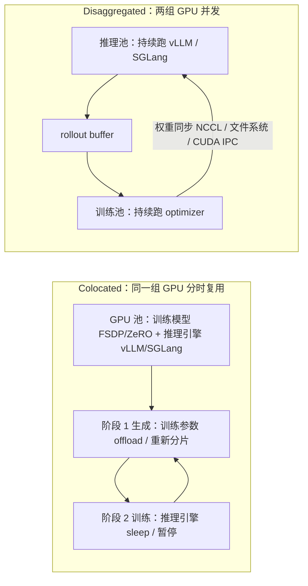
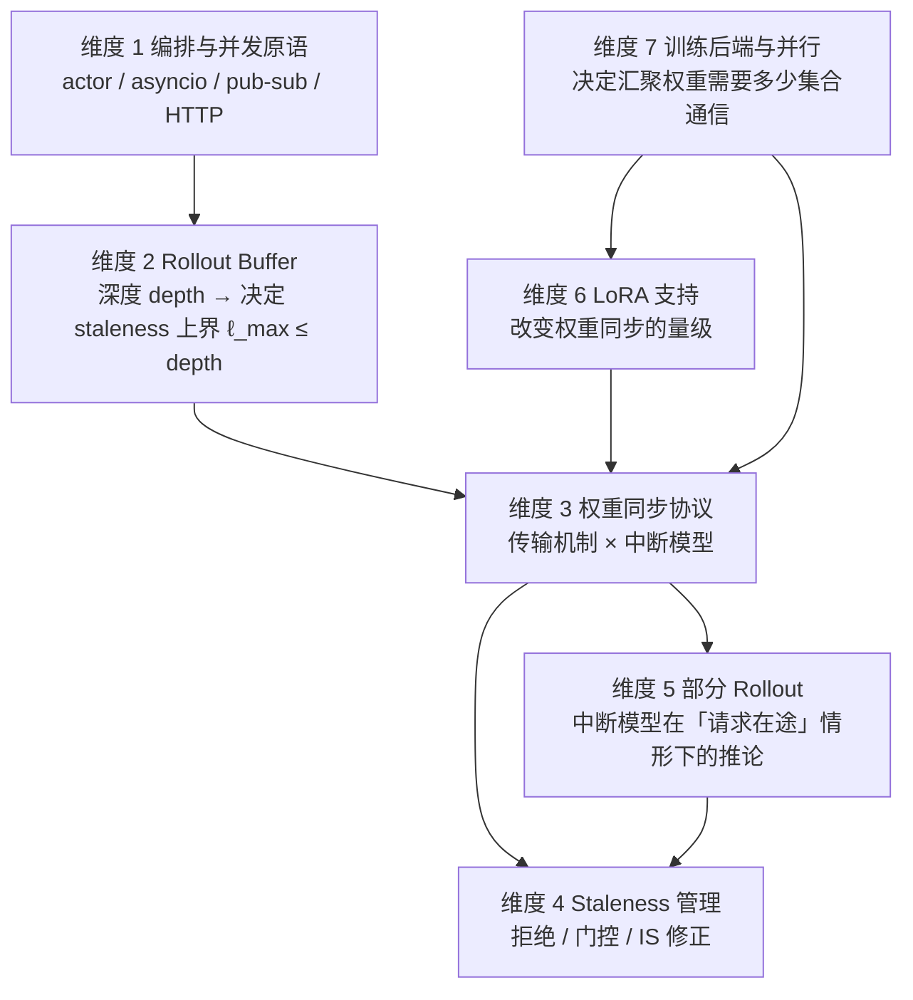

# 让 Token 持续流动：16 个开源 RL 框架的异步训练基础设施横向调研

三个月前的一个晚上，我盯着训练日志发呆。一个 32B 的模型在跑 GRPO，`rollout` 那一段的进度条已经卡了四十分钟没动过，而训练卡那八张 H100 的利用率曲线平得像一条尺子。那一刻我脑子里冒出来的不是「要不要换个框架」，而是一个更朴素的问题：**这四十分钟里，我那八张训练卡到底在等什么，值多少钱？**

后来我把这个问题拿去问了几个一起做 RL infra 的朋友，发现大家的答案惊人地一致，都在等 `rollout`，而且都说不清等的是哪一部分：是等最慢的那条链，是等 KV cache 爆掉之后的重调度，还是等权重广播那几百毫秒。更让我意外的是，当我真的开始一个个读开源框架的源码时，发现它们在过去十八个月里**不约而同**地把生成和训练拆到了两组 GPU 上，用 rollout buffer 连接，用各种协议异步推权重。这不是某篇论文的号召，是一次几乎没有人组织的集体收敛。

于是就有了这篇文章。我把 16 个截至 2026 年 9 月仍在活跃维护的 RL / post-training 框架逐个 clone 下来、固定 commit、读它们的权重同步路径、读它们的 buffer 实现、读它们怎么处理「权重更新到达时正在生成的那条序列」。我想搞清楚的不是「谁最好」，而是：**当生成和训练真的并行跑起来之后，多出来的那张账单上写了些什么，以及这 16 个框架各自选了哪几种货币来付。**

我会按下面四条线走：

1. 先把同步 RL 循环拆开，算清楚瓶颈到底在哪一段（§1–§2），并说明为什么「生成比训练贵 8 倍」这个流传很广的说法在长上下文下并不自动成立；
2. 建立本文的分析工具，沿用同行调研提出的**七个维度**，并把它们之间的因果依赖讲清楚（§3）；
3. 用这七个维度逐个量过去，每个断言都落到具体 commit 的文件行号（§4–§12）；
4. 最后看下一波浪潮会把哪几个维度压垮（§13），以及如果让我来设计一个异步训练器，我会怎么选（§14）。

关于调研口径，我需要把话说在前面，因为这决定了后面每一张表的可信度。

**样本**：截至 2026-09 仍在活跃维护的 16 个开源 RL / post-training 框架。纳入标准有两条：一是仍在维护，判定依据是可复现的 `git log -1 --format=%cs`（注意是 commit date 而不是 author date）以及仓库首页有没有归档声明；二是具备 RL 训练编排能力，也就是同时有 rollout、训练循环和权重回传这三块。

**证据基础**：本文的绝大多数属性断言来自源码，形式是「固定 commit + 文件路径 + 行号」。**需要说明哪里不是**：§7.2 的中断模型与 §11.1 的并行策略表里各有若干行是从上游调研继承的描述，本次没有逐行核实，文章在对应表下都标了核实范围；`rlhf/sys-design` 之外没有其他仓库内引用。AReaL、slime、verl 三个仓库的本地 clone 指向个人 fork，核对以本地 HEAD 为准并在表注里写明了上游组织；`OpenRLHF@3f8ae08`（2026-06-17）与 `vime@fa0b6e9`（2026-06-11）的 clone 落后上游较明显，关于它们的结论都限定在这两个 commit 上。版本号与许可证这类会漂移的信息只在必要处引用并写清出处；GitHub star 数我**一个都不给**，因为本地仓库不携带它，而我不想把文章的说服力建立在会变的社会指标上。

**与既有调研的关系**：本文的七维度框架来自 HuggingFace 团队 2026 年 3 月的 [Keep the Tokens Flowing: Lessons from 16 Open-Source RL Libraries](https://huggingface.co/blog/async-rl-training-landscape)。那是目前对这个问题最好的一份公开梳理，我基本沿用了它的分类，也**刻意没有重新归纳**，但在两件事上做了独立处理：一是把样本更新到 2026-09 并逐个复核源码，二是把它依赖的若干数值前提重新推导了一遍。后者不是小事：我在复算过程中发现，那份调研里关于长上下文吞吐的外推和关于多 agent straggler 的「25 倍」，都站不住。这些错误**来自上游调研，不是翻译或转述引入的**，我在 §15 里逐条记录了修正前后的值与理由。

照理，感谢各位大哥的讨论和支持：那些被我半夜抓来问「你们这个 `pause_generation` 到底是 drain 还是 abort」的朋友们，以及 SGLang RL 社区里一起把权重更新路径从「能跑」推到「能信」的伙伴们。这篇文章里的错都算我的，里面的源码判断如果和你们手上的版本不一致，请务必拍我。

---

## 1. 同步 RL 循环的七个阶段，与它唯一的那道墙

要讲清楚异步为什么必要，得先把同步循环拆成零件。TRL 的 `GRPOTrainer` 是一个很好的标本，因为它把整条链路都塞进了一个同步的 `training_step()` 调用里，每个训练步骤严格按顺序走七个阶段：

1. **Prompt 采样**：从数据集抽取一批 prompt。
2. **生成**：为每个 prompt 生成 \(G\) 个 completion。这是自回归的，一个 token 一个 token 往外吐。
3. **Reward 打分**：用 reward function 或 verifier 评估每条 completion。
4. **Advantage 计算**：GRPO 用组内相对优势，所以这一步依赖整个组都到齐。
5. **前向与反向**：算 clipped policy gradient loss 并反传。
6. **Optimizer step**：更新权重。
7. **权重同步**：把新权重推给推理引擎，让下一次生成用上新 policy。

草稿式的叙述到这一步通常会写「每个阶段都阻塞到完成后才开始下一个」，然后直接跳到「所以要异步」。这个跳跃太快了，因为它没有回答一个更关键的问题：**这七个阶段里，哪几个在原理上可以被重叠，哪几个是被设计硬性串起来的？**

答案是：除了第二阶段和第五阶段，其余阶段的挂钟时间在长上下文下都可以忽略不计。Prompt 采样是 CPU 侧的索引操作；reward 打分对 outcome reward 是一次标量调用；advantage 是组内均值方差；optimizer step 是显存带宽级的操作。真正吃掉时间的是**生成（自回归、串行吐 token）**和**训练（前向加反向的 GEMM 风暴）**。于是问题就收缩成一句话：能不能让这两段同时跑？

在回答之前，得先知道它们各自有多贵，而且这两个「贵」不是同一把尺子能衡量的。

### 1.1 生成有多贵：KV cache 读带宽锁死的decode

先说一个我觉得必须在这个位置就澄清的事情，因为它直接决定后面所有数字的可信度。

网上流传的「32B 模型生成一个 32K token 的 rollout batch 需要数小时」这类说法，其数字来源通常是 vLLM 在单张 H100 上的公开 benchmark。我核对了被引用最多的那一份（[databasemart 的 vLLM H100 benchmark](https://www.databasemart.com/blog/vllm-gpu-benchmark-h100)），它的实际配置是 **input 100 / output 600 token / 300 个并发请求**。这是一个**短输出**测试。它的结论（7B 约 6300 output tok/s，32B 约 1200 output tok/s）说的是「在 600 token 这个长度上，一张 H100 每秒能推出多少 token」。

把这个数外推到 8K 甚至 32K 上下文，是一个**量级错误**，而错误的方向是乐观：decode 吞吐在长上下文下由 KV cache 的读带宽锁死，它是一个随 \(L_{\mathrm{out}}\) 单调下降的量，不是常数。我们来把这条推导写清楚。

**每 token 的 KV cache 字节数**由模型的注意力形状决定：

$$
k_{v} = 2n_{\mathrm{layer}}n_{\mathrm{kv}}d_{\mathrm{head}}\,b_{\mathrm{dtype}}
$$

用两个具体配置代入。7B 级模型（28 层、4 个 KV head、head_dim 128、bf16）：

$$
k_{v}^{(7\mathrm{B})} = 2\times 28\times 4\times 128\times 2 = 57{,}344\ \mathrm{B}\approx 56\ \mathrm{KiB}
$$

32B 级模型（64 层、8 个 KV head、head_dim 128、bf16）：

$$
k_{v}^{(32\mathrm{B})} = 2\times 64\times 8\times 128\times 2 = 262{,}144\ \mathrm{B} = 256\ \mathrm{KiB}
$$

**一步 decode要读多少字节？** 权重要全部读一遍（\(W\) 字节），而且批内 \(b\) 条序列各自累积到 \(L_{\mathrm{out}}\) 长度的 KV 也都要读一遍。所以一步的访存量是 \(W+b\,L_{\mathrm{out}}k_{v}\)，一步的耗时是：

$$
\tau_{\mathrm{step}}(b)=\frac{W+b\,L_{\mathrm{out}}k_{v}}{\mathrm{BW}},
\qquad
r(b)=\frac{1}{\tau_{\mathrm{step}}(b)},
\qquad
\mathrm{thr}(b)=\frac{b}{\tau_{\mathrm{step}}(b)}=\frac{b\,\mathrm{BW}}{W+b\,L_{\mathrm{out}}k_{v}}
$$

这里 \(\mathrm{BW}\) 是 HBM 有效带宽。这个式子有一个非常重要的性质：**\(\mathrm{thr}(b)\) 对 \(b\) 是次线性的**，因为分母里的 KV 项随 \(b\) 线性增长，权重项 \(W\) 却固定。当 \(b\to\infty\) 时权重项被淹没，吞吐趋于上界：

$$
\mathrm{thr}_{\max}=\frac{\mathrm{BW}}{L_{\mathrm{out}}k_{v}}
$$

代入数字（H100 的 HBM 峰值带宽约 3.35 TB/s，实际有效带宽我后面会同时给 3.35 TB/s 与 2.0 TB/s 两档）：

| 配置 | \(L_{\mathrm{out}}\) | \(L_{\mathrm{out}}k_{v}\)（单序列 KV） | \(\mathrm{thr}_{\max}\) @3.35 TB/s | 单序列速率 `r(1)` |
| --- | --- | --- | --- | --- |
| 7B | 600 | 0.034 GB | **97,000 tok/s** | 220 tok/s |
| 7B | 8K | 0.47 GB | **7,100 tok/s** | 214 tok/s |
| 7B | 32K | 1.88 GB | **1,783 tok/s** | 196 tok/s |
| 32B | 600 | 0.16 GB | **21,300 tok/s** | 51 tok/s |
| 32B | 8K | 2.15 GB | **1,560 tok/s** | 49 tok/s |
| 32B | 32K | 8.59 GB | **390 tok/s** | 45 tok/s |

这张表里有两件事值得停下来看一眼。第一，**在 600 token 这个长度上，带宽上界是几万 tok/s 量级**，而实测的 6300 / 1200 tok/s 只占它的 6.5% / 5.6%，这说明短输出下的实测值确实离带宽墙还很远，瓶颈在别处（调度、kernel 效率、权重读取），这时候的吞吐对长度**不敏感**。第二，**到了 32K，上界掉到了 1783 / 390 tok/s**，此时 6300 与 1200 这两个数字分别超出上界 **3.5 倍和 3.1 倍**。换句话说，被广泛引用的那两个吞吐数字，在长上下文下**物理上不可能达到**。

顺手做一个自洽性检查，确认我们确实处在带宽墙而不是算力墙。decode一步的算术强度是 `FLOPs / bytes`。7B 模型在 \(L_{\mathrm{out}}=32\mathrm{K}\)、\(b=30\) 时：

$$
\begin{aligned}
\text{每步计算量} &\approx 2Nb = 2\times 7.6\times 10^{9}\times 30 = 4.56\times 10^{11}\ \mathrm{FLOP}\\
\text{每步访存量} &= W+bLk_{v} = 15.2+30\times 1.88 = 71.6\ \mathrm{GB}\\
\text{算术强度} &\approx \frac{4.56\times 10^{11}}{71.6\times 10^{9}} \approx 6.4\ \mathrm{FLOP/byte}
\end{aligned}
$$

H100 的 bf16 峰值算力约 989 TFLOP/s（不含稀疏），带宽 3.35 TB/s，两者的比值是 \(989\times 10^{12}/3.35\times 10^{12}\approx 295\ \mathrm{FLOP/byte}\)。6.4 远小于 295，所以**decode 是彻底的带宽受限**，上面那套 roofline 就是它的正确模型。

### 1.2 那张「生成瓶颈表」必须重建

被引用最多的那张表长这样（这是上游调研里的原始版本）：给定 \(G=8\)、\(P=64\)，一个训练步要生成 512 条 rollout，然后用 7B / 32B 的短输出吞吐乘以总 token 数算出耗时。

先确认 token 算术是对的：`G × P = 8 × 64 = 512`；512 × 2K = 1,024,000；× 8K = 4,096,000；× 32K = 16,384,000。都没问题。问题出在时间列。

用上面的 roofline 重算。decode的总耗时有一个很干净的形式，它等于「所有 output token 在生成时刻各自需要读的 KV 字节」之和除以聚合带宽。一条长度 `L` 的序列，第 `t` 个 token 需要读 \(t\,k_{v}\) 字节，所以单序列的总 KV 读量是 `L²·kv_per_token/2`。512 条 32K 序列：

$$
\text{总 KV 读量} = 512\times\frac{32768^{2}}{2}\times 262{,}144\ \mathrm{B}\approx 7.2\times 10^{16}\ \mathrm{B}=0.072\ \mathrm{EB}
$$

在 8 张 H100 上（每张 3.35 TB/s，聚合约 26.8 TB/s）：

$$
T_{\mathrm{gen}}\approx\frac{7.2\times 10^{16}}{2.68\times 10^{13}}\approx 2690\ \mathrm{s}\approx 45\ \text{分钟}
$$

如果按 2 TB/s 的有效带宽算，是 **75 分钟**。这个数字比上游表格里的「45 分钟 @ 7B / 3.7 小时 @ 32B」要更朴素也更可靠：**它的量级不取决于模型是 7B 还是 32B，而取决于输出长度**。原因是上界 `BW/(L·kv_per_token)` 里只有 \(k_{v}\) 带模型规模，而长上下文下 `L` 的影响是平方级的。作为对照，同样 512 条 32K 序列在 7B 上只要 **9.8 分钟**（同样 8 张卡、3.35 TB/s），两者差 4.6 倍，正好是 \(k_{v}\) 的比例。

这就带来一个反直觉但很重要的结论：**在长上下文下，「模型有多大」对 decode 吞吐的影响，远小于「输出有多长」**。一个 7B 模型在 32K 输出上的单序列 decode 速率（196 tok/s）甚至和一个 32B 模型在 600 token 上的速率（51 tok/s）不同量级的原因也不在于规模，而是因为后者的权重读取项 \(W\) 在短序列下没有被 KV 项淹没。看表里 7B 那一列：从 600 到 32K，单序列速率只从 220 掉到 196 tok/s，几乎不变；变的是**上界**，从 97,000 掉到 1,783。

#### 容量约束：32B 在单卡上装不下 32K

上面算的是带宽，还有一个独立的约束是**KV cache 的物理容量**。这一条上游表格完全没有考虑，但它比带宽更硬。

32B 的 bf16 权重是 65.6 GB，一张 H100 有 80 GB HBM。留出约 8 GB 的运行时余量（激活、通信 buffer、CUDA context），可用于 KV 的空间不到 7 GB。而一条 32K 序列的 KV 就是 8.59 GB，**TP=1 时连一条都放不下**。把 `tp_size` 与单序列 KV 一起列出来：

| 配置 | 每卡权重占用 | 该 TP 组可用 KV 空间 | 32K 下可常驻序列数 | 512×32K 是否可能 |
| --- | --- | --- | --- | --- |
| 32B, TP=1 | 65.6 GB | 6.4 GB | **0.75** | 否 |
| 32B, TP=2 | 32.8 GB | 78.4 GB | 9.1 | 否 |
| 32B, TP=4 | 16.4 GB | 222.4 GB | 25.9 | 否 |
| 32B, TP=8 | 8.2 GB | 510.4 GB | 59.4 | 否 |
| 7B, TP=1 | 15.2 GB | 56.8 GB | 30.2 | 否 |
| 7B, TP=2 | 7.6 GB | 128.8 GB | 68.6 | 否 |
| 7B, TP=8 | 1.9 GB | 560.8 GB | 298.4 | 否 |

512 条 32K 序列的**常驻** KV 总量是 **4,398 GB**（7B 是 962 GB），这是任何单卡、任何单 TP 组都装不下的。所以「512 条 32K 序列同时在途」这件事本身就需要一个足够大的 GPU 池，而不是靠调大批大小就能在少数几张卡上做到。这也解释了为什么上游表格里「1 × H100 生成 32K rollout batch」这一列的物理前提根本不成立，那一格不是一个慢速配置，是一个**不可实现的配置**。

#### 「÷8」为什么不能这么除

上游表格的最后一句话是「扩展到 8 个推理 GPU 大约可以把这些时间除以 8×」。这是一个**线性加速的乐观假设**，它忽略了至少三件事：TP 组内的通信开销让decode不线性（每层两次 all-reduce，TP 越大单步延迟越高）；KV 容量限制了单卡能常驻多少并发序列，而这是吞吐而非延迟问题；8 个副本各自要接收权重广播，同步带宽是共享的。

在带宽受限这个主导效应下，一个更诚实的表述是：**在 KV 容量允许的前提下，DP 复制近似线性，TP 组内不线性，而总墙钟时间的下界由 `总 KV 读量 / 聚合带宽` 给出**。用这个下界算：

| 生成 512×32K | 8 × H100 @3.35 TB/s | 8 × H100 @2.0 TB/s | 64 × H100 @3.35 TB/s |
| --- | --- | --- | --- |
| 32B | **44.8 min** | 75.1 min | 5.6 min |
| 7B | 9.8 min | 16.4 min | 1.2 min |

所以表格应该长这样，**表头必须写明上下文与并发，而不是给一个与长度无关的峰值吞吐**。这里有三列的物理量很容易被混为一谈，我把它们分开列：**常驻 KV** 是任一时刻真正占显存的部分（∝ `L`），**单序列累计 KV 读量**是生成这一条序列期间读过的 KV 字节总数（∝ `L²`），而**墙钟时间**由 512 条的累计读量除以聚合带宽得到，与单序列那一列不是同一个量。

| 每个 rollout 的输出长度 \(L_{\mathrm{out}}\) | 总 output token（512 条） | 常驻 KV | 单序列累计 KV 读量 | 8×H100 @3.35 TB/s | 8×H100 @2.0 TB/s |
| --- | --- | --- | --- | --- | --- |
| 2K | 1.05 M | 275 GB | 549.8 GB | **0.18 min** | 0.29 min |
| 8K | 4.19 M | 1,100 GB | 8.80 TB | **2.80 min** | 4.69 min |
| 32K | 16.78 M | 4,398 GB | 140.7 TB | **44.8 min** | 75.1 min |

（口径说明：长度按二进制取 `L = 2048 / 8192 / 32768`，因此总 token 是 1.05 M / 4.19 M / 16.78 M 而不是十进制口径下的 1.02 M / 4.10 M / 16.38 M，**本文统一用二进制口径**，32K 即 32,768。墙钟时间的算式是 \(T = N_{\mathrm{seq}}L^{2}k_{v}/2/(N_{\mathrm{gpu}}\mathrm{BW})\)，只计 KV 读，忽略权重读、prefill、调度与 kernel 效率损失，因此它是**下界**；「单序列累计 KV 读量」那一列就是 \(L^{2}k_{v}/2\)，它是每个 token 步各自要读的 KV 之和，不是某一时刻的占用。有效带宽取 3.35 TB/s 与 2.0 TB/s 两档，后者是长上下文下更保守的情景假设。）

### 1.3 那「8 倍」是从哪来的：一次差点被我写错的推导

到这里有一个我必须承认的过程。我最初打算照抄一个流传很广的说法：「生成需要的 GPU 时间大约是训练的 8 倍」。为了让它看起来有推导，我准备写「生成每 token 约 `2N` FLOPs，训练约 `6N` FLOPs，所以是 3 倍」。写到一半发现这个 3 倍对不上 8 倍，于是才老老实实把账算完，结果发现**这个 8 倍根本不是一个默认成立的数**。

先把 FLOPs 的口径说清楚。对一个参数量 \(N\) 的 Transformer，前向传播每 token 约 `2N` FLOPs（每个权重参与一次乘加）；反向传播要算对输入的梯度和对权重的梯度，约 `4N`。所以：

$$
\text{生成：}2N\ \mathrm{FLOPs/token}\ (\text{只有前向}),
\qquad
\text{训练：}6N\ \mathrm{FLOPs/token}\ (\text{前向}+\text{反向})
$$

如果生成和训练处理的是**同一份数据**（\(k=1\)，即这份 rollout 只被训练一遍），那么挂钟时间之比是：

$$
\frac{T_{\mathrm{gen}}}{T_{\mathrm{train}}}
=\frac{2ND/(S\eta_{\mathrm{gen}})}{6ND/(S\eta_{\mathrm{train}})}
=\frac{\eta_{\mathrm{train}}}{3\eta_{\mathrm{gen}}}
$$

其中 \(S\) 是总算力，\(\eta_{\mathrm{gen}}\) 与 \(\eta_{\mathrm{train}}\) 分别是生成与训练各自的 MFU。如果这份 rollout 被训练 \(k\) 遍（temporal reuse，比如 TRL 的 `steps_per_generation`），训练侧的 FLOPs 变成 \(6NkD\)：

$$
\frac{T_{\mathrm{gen}}}{T_{\mathrm{train}}}=\frac{\eta_{\mathrm{train}}}{3k\,\eta_{\mathrm{gen}}}
$$

现在代入实际数字。\(\eta_{\mathrm{gen}}\) 必须用**聚合吞吐**算，不能用单序列速率，因为 MFU 是「这张卡每秒做了多少 FLOP」而不是「某一条序列每秒出了多少 token」。取 §1.1 的例子，7B、\(L_{\mathrm{out}}=32\mathrm{K}\)、批大小 30（也就是该配置的 KV 容量上限）：

$$
\tau_{\mathrm{step}}=\frac{15.2\times 10^{9}+30\times 32768\times 57344}{3.35\times 10^{12}}\approx 21.4\ \mathrm{ms},
\qquad
\mathrm{thr}=\frac{30}{\tau_{\mathrm{step}}}\approx 1404\ \mathrm{tok/s}
$$

$$
\eta_{\mathrm{gen}}=\frac{2N\cdot\mathrm{thr}}{P_{\mathrm{peak}}}=\frac{2\times 7.6\times 10^{9}\times 1404}{989\times 10^{12}}\approx 2.2\%
$$

训练的 MFU 取常见的 40%，代入 \(k=1\)：

$$
\frac{T_{\mathrm{gen}}}{T_{\mathrm{train}}}=\frac{0.40}{3\times 0.022}\approx 6.2
\qquad(k=1,\ \text{长上下文})
$$

**这个比值对批大小极度敏感**，因为长上下文 decode 的 MFU 本质上就是「批大小能开多大」的函数：

| 批大小 \(b\)（7B, 32K） | \(\tau_{\mathrm{step}}\) | 聚合吞吐 | \(\eta_{\mathrm{gen}}\) | \(T_{\mathrm{gen}}/T_{\mathrm{train}}\) @ \(\eta_{\mathrm{train}}=0.40\) |
| --- | --- | --- | --- | --- |
| 1 | 1.87 ms | 196 tok/s | 0.3% | 44 |
| 4 | 3.4 ms | 590 tok/s | 0.9% | 15 |
| 16 | 13.5 ms | 1184 tok/s | 1.8% | 7.3 |
| 30（KV 容量上限） | 21.4 ms | 1404 tok/s | 2.2% | **6.2** |

所以「生成比训练贵 8 倍」既能成立也能不成立，取决于你把批大小开到多大；而批大小又被 KV 容量锁死（§1.1 那张表）。要让这个比值达到 8，需要 \(\eta_{\mathrm{train}}/\eta_{\mathrm{gen}}\approx 24\)，也就是 decode MFU 掉到 2% 以下，**那对应的是「上下文极长 + 批大小被压到个位数」的角落，而不是默认情形。**

所以正确的说法是：**生成与训练的时间比是一个由批大小决定的谱（本文的算例里 6 到 44 倍），不是一个常数。** 上游调研直接写「生成需要比训练多 8 倍的 GPU 时间」，把一个条件性的取值当成了前提。这个修正不影响「要拆开」的结论（只要比值大于 1，异步就有收益），但它影响**拆开之后该怎么配比 GPU**：如果你的负载是 8K 输出、批大小能开到几十，按 8 倍去配推理池会严重过度配置。

### 1.4 Straggler：等的不是「组内最慢」

同步循环还有第二重浪费，它的账比吞吐账更隐蔽。

GRPO 这类无 critic 算法用组内相对优势，每个 prompt 要采 \(G\) 条 completion，整个 batch 有 \(G\times P\) 条（本文统一用 \(N=G\cdot P\) 表示 batch 内的 rollout 总数）。上游叙述里常见的说法是「batch 必须等到组内最慢的那个 completion 完成才能继续」。这句话**低估了等待**：组内最慢只是一个组的下界，一个训练步要等的是**整批** \(N\) 条里最慢的那一条：

$$
T_{\mathrm{batch}}=\max_{i=1,\dots,N}T_i,
\qquad N=G\cdot P
$$

这是一个序统计量，不是组内 max 的 max。当 \(G=8\)、\(P=64\) 时 \(N=512\)，从 512 个样本里取最大，和从 8 个里取最大，是两个不同的分布。这一点在 §13.3 讨论多 agent 时还会再出现一次，那里我会把「分位数怎么随链路数变化」推导完整。

Continuous batching 是常用的缓解手段，但它缓解的是**吞吐**而不是 **makespan**：短序列跑完就释放 slot，腾出来的算力去服务新请求，所以每秒产出的 token 数可以保持很高；但 \(\max_i T_i\) 这个量不会因为调度变聪明而变小，它就是最长那条序列的时长。把这两件事分开，是理解「为什么吞吐看起来没问题、训练步却还是慢」的关键。

还有第三条效应，我觉得是被普遍遗漏的：**固定 KV 预算下的准入阻塞**。设单卡可用于 KV 的空间是 \(\mathrm{KV}_{\mathrm{budget}}\)，每条序列的平均输出长度是 \(L_{\mathrm{out}}\)，那么单卡能常驻的序列数是：

$$
b_{\max}=\frac{\mathrm{KV}_{\mathrm{budget}}}{L_{\mathrm{out}}k_{v}}
$$

当 \(L_{\mathrm{out}}\) 变长，\(b_{\max}\) 下降。回看 §1.1 那张表：32B 在 32K 下 TP=1 只能常驻 0.75 条序列，TP=2 是 9.1 条，TP=8 才 59.4 条。也就是说**长序列不仅让每条序列更慢，还让能同时在跑的序列更少**，这是对吞吐的二次打击，而它不在上游表格的任何一列里。

至于「数百个 GPU 闲置」这类说法，它需要一个显式的利用率模型才能算成钱：

$$
\text{闲置 GPU}\cdot\text{小时}=N_{\mathrm{gpu}}(1-U)T_{\mathrm{step}}
$$

其中 \(U\) 是训练池在 \(T_{\mathrm{step}}\) 内真正在做有效计算的时间占比，它由 buffer 深度、长度分布和权重同步的中断时长共同决定。我在 §7 会把 `U` 的三个扣减项拆开。但在那之前，得先回答一个更基本的问题：**拆开之后，我们换来的到底是什么？**

---

## 2. 拆开之后：四笔账单

§1 的结论是「生成和训练都贵，而且贵的方式不同」，所以把它们串起来跑必然浪费。但异步不是免费的午餐，它把「浪费」换成了另一种形式的成本。我把这些成本归纳成四笔，它们不是并列关系，而是**互相耦合**的：调其中任何一个旋钮都会牵动另外三个。

先给出两种部署拓扑的对照，因为后面每一笔账都建立在这个分野之上。**Colocated 模式把推理和训练放在同一组 GPU 上**：同一张卡（或同一个 TP 组）同时持有训练模型与推理引擎，但同一时刻只有一个角色活跃，生成期间训练参数被 offload 或重新分片成推理友好的布局，训练期间推理引擎被暂停或进入休眠。**Disaggregated 模式把两者放在不同的 GPU 池上**：推理池持续跑 vLLM / SGLang，训练池持续跑 optimizer，两者通过权重同步协议和数据传输机制通信。

<div style="text-align: center;">



</div>

这两张图的差别不是资源占用，而是**能力**：disaggregated 让生成和训练可以真正并发（训练器在 batch \(N\) 上算梯度时，推理池已经在为 batch `N+K` 生成），colocated 做不到，因为推理和训练在同一组 GPU 上轮流执行。一个常见的混淆是把「并发」「异步」「并行」当成同义词，本文的用法是明确的：**本文说「异步训练」时，指的是生成与训练并行运行且有有效重叠**，而这从根本上是 disaggregated 模式的能力。Colocated 可以受益于 sleep/wake 显存管理或快速原地重分片来加速推理，但那不是重叠。

### 2.1 第一笔：staleness

**Staleness 指的是训练时用到的数据，是由一个比当前 policy 更旧的 policy 生成的。** 一旦生成和训练重叠，这件事就必然发生，问题只是程度。

要把它讲精确，得先分清两个经常被混为一谈的概念。设 `ν` 是权重版本号（每完成一次 optimizer step 加一），\(\nu_{\mathrm{gen}}\) 是生成某条样本时的版本，\(\nu_{\mathrm{current}}\) 是当前训练器的版本。则这条样本的版本差是：

$$
\ell=\nu_{\mathrm{current}}-\nu_{\mathrm{gen}}
\qquad(\text{单位：optimizer step})
$$

这里有第一个必须纠正的说法：**double-buffer 的 \(\ell_{\max}\) 是 1，不是 0。** 上游叙述里既写了「恰好重叠一个 batch」，又写了「depth=1 时 staleness 从结构上不可能发生」，这两句是矛盾的。走一遍时序就清楚了：当训练器在做第 \(N\) 步时，第 `N+1` 步的生成已经提交出去了，用的是第 `N−1` 步结束时的权重；等第 \(N\) 步训练完成、权重更新到版本 \(N\)，那份在途数据仍然是版本 `N−1` 生成的。所以 \(\ell=1\)。

**「零 staleness（严格同步）」与「有界 staleness（\(\ell_{\max}=1\)）」根本不是一回事**，前者要求生成必须等到权重推完才开始，后者允许一步滞后。表格里 depth=1 那一格应写 \(\ell_{\max}=1\)。

第二个要定义的是 \(d\)：**它是「在途 batch 数」，不是字节数、不是样本数。**

初稿在这里直接推出了 \(\ell_{\max}\le d\)，并在全文当作因果边使用。**这个推导是错的，复审时被反例推翻。** 队列容量只约束「同时存在几个 batch」，它不约束「某一个 batch 能活多久」。构造一个反例：版本 0 时启动一个慢 batch A，之后每一步消费一个快 batch B 并立刻补一个新的，容量始终只占 2；10 步之后 A 才完成，此时 A 的版本差是 10，而在途 batch 数从未超过 2。**所以 \(d\) 给的不是 staleness 上界，而是一个上界的上界。**

要让它成立，至少需要额外假设**严格 FIFO 消费**（没有任何 batch 能越过更老的 batch 被消费）以及**生成速率不低于消费速率**。这两条在真实系统里都不自动成立：部分 rollout 天然打破 FIFO（被中断的组回到队尾），而长度重尾的负载会让慢 batch 一直挂在队里。

所以本文的用法要收窄成一句**条件命题**：

$$
\text{严格 FIFO 消费} \;\wedge\; \text{无越队重排} \;\Longrightarrow\; \ell_{\max}\le d
$$

这也是为什么本样本里真正可靠的 staleness 控制都落在**显式版本约束**上而不是缓存容量上：AReaL 的容量公式（§8.2）用累计接受量而不是队列长度来控版本差，open-instruct 的 `max_result_age_steps` 逐结果判龄，labs-molt 则在 `async_queue_size > 1` 时强制要求你打开 IS 修正。**「depth bounding」这个名字容易让人以为深度本身就是边界，实际它只是边界的一个充分条件的一部分。**

第三个要提的是**行为分布**。当一条序列跨越了 \(k\) 次权重更新（比如部分 rollout 或者在途请求续跑），它的每个 token 可能是在不同版本下生成的。这时训练器面对的**真实行为分布**不是某个单一的 \(\pi_{\mathrm{old}}\)，而是：

$$
\mu(o\mid x)=\prod_{t}\pi_{\nu(t)}(o_t\mid h_t)
$$

其中 \(\nu(t)\) 是生成第 `t` 个 token 时的版本号。「单一 \(\pi_{\mathrm{old}}\)」只是 \(\nu(t)\) 对所有 `t` 恒定的特例。这个区分看起来只是记号上的洁癖，但它是 §8 里 IS 推导和 §9 里部分 rollout 处理能够对上的唯一方式，上游调研里「训练使用记录的 \(\pi_{\mathrm{old}}\)」（暗示整条序列一个版本）与「每个 token 都标记 `model_version`」这两句话如果不统一到 \(\nu(t)\) 上，就是自相矛盾的。

### 2.2 第二笔：权重同步

第二笔账是**把新权重送到推理服务器**的成本，它有两个正交的维度，我在 §7 展开：**传输机制**（NCCL broadcast / 文件系统 / CUDA IPC / 共享内存）和**中断模型**（生成什么时候必须停下来接收新权重）。

这里先纠正一个流传很广的说法：「colocated 模式下权重同步本质上是免费的」。这句话只在「不需要搬数据」这个意义上有半分道理，但 colocated 的权重同步恰恰需要搬数据：FSDP 的分片布局和 vLLM 的 TP 布局不一样，从前者变成后者要做一次 all-gather 加重排。成本是：

$$
T_{\mathrm{reshard}}\approx\frac{\text{参数字节}}{\mathrm{BW}_{\mathrm{HBM}}}+\text{通信开销}+\text{暂停时间}
$$

7B 模型 bf16 的 15.2 GB 在 HBM 内部搬一遍，按 3 TB/s 算是 5 ms 量级，看起来很小。但真正的代价不是这 5 ms，而是**同一组 GPU 的推理和训练无法重叠**，它在做 reshard 的时候既不在生成也不在训练。所以 colocated 的取舍是「省下网络传输和一半的 GPU 数量，代价是丧失重叠能力」，不是「省下同步」。

### 2.3 第三笔：部分 rollout

第三笔账最微妙：**权重更新到达时，那些正在生成中的序列怎么办？** 长上下文下一个 rollout 可能要几分钟，而权重更新可能每几十秒就来一次，所以「在途」是常态而不是异常。

处理方式有五种，从最少浪费到最多浪费排开：让序列继续跑（在途 token 混版本）、把部分结果存起来等新权重再续、中止并回收前缀重试、排空在途请求后再同步、直接丢弃。它们各自的代价我放在 §9 的表里，这里只想点出一个容易忽略的耦合：**这一笔账的绝对值取决于第二笔账。** 如果权重同步只需要 800 微秒（LoRA 场景），那么「排空」和「不排空」的差别可以忽略；如果需要 280 毫秒（7B 全参走 IB NDR），那么中断模型的选择就直接决定了每一步浪费多少生成。

### 2.4 第四笔：数据通路与 buffer

最后一笔是 rollout 数据本身怎么从推理池流到训练池。这一笔被讨论得最少，但它的量级最容易被想当然。

上游叙述里有一句「对于超长上下文推理，每个 batch 可达数十 GB」。我按张量算了一遍，这个数字需要一个大前提才成立。一个训练 batch 在 buffer 里**至少**需要携带这些字段：

| 字段 | dtype | 单个 token 字节 |
| --- | --- | --- |
| `token_id` | int32 | 4 |
| `logprob`（行为策略） | fp32 | 4 |
| `ref_logprob`（KL 锚点） | fp32 | 4 |
| `advantage` | fp32 | 4 |
| **合计** | | **16 B/token** |

512 条 32K 序列共 16.38 M token：

$$
16.38\times 10^{6}\times 16\ \mathrm{B}\approx 262\ \mathrm{MB}
$$

加上 attention mask、position ids、reward、以及多轮轨迹需要的 turn 边界，大约是 0.4–0.5 GB。**这与「数十 GB」差了两个数量级。**

那什么情况下才会是「数十 GB」？只有当你把 **hidden states** 也存下来（为了省掉训练时的重算）：

$$
\text{7B},\ h=3584,\ \text{bf16}:\quad 16.38\times 10^{6}\times 3584\times 2\ \mathrm{B}\approx 117\ \mathrm{GB}
$$

（如果连 logits 都存，152K 词表 × fp32 就是 PB 级，这个选项在工程上不存在。）

所以这一笔账的正确写法不是「数据很大」，而是**一个权衡**：存 token 级元数据（262 MB，便宜）还是存 hidden states（117 GB，昂贵但省重算）？前者的代价是训练时要重新做一遍前向，后者的代价是 buffer 显存和跨池传输。这个权衡在异步场景下会被放大，因为重算意味着训练池要多花 GPU 时间，而那正是我们想省的东西。至于 buffer 的**深度**这一维，它是 §2.1 里 \(\ell_{\max}\) 的直接来源，我放在 §6 细讲。

---

## 3. 七个维度：本文的分析工具

到这里我们已经有了「为什么要拆」（§1）和「拆开要付什么」（§2）。现在把第二部分的四笔账展开成**七个正交的设计决策点**，这是后面 16 个框架能被横向比较的前提。

七维度是上游调研提出来的，我认为它提得很好，它把「异步 RL」这个含糊的标签拆成了可以逐格填表的工程选择，而且每一维都对应一个真实的代码差异。我**原样保留**它的七个维度与全部既有分类（编排四类型、buffer 四档深度、权重同步的传输 × 中断两视角、staleness 三策略、LoRA 三流派），只在样本变化导致某个类别空掉的地方做「补格」。

七个维度是：

1. **编排与并发原语**：分布式组件之间怎么协调。
2. **Rollout Buffer 设计**：rollout 怎么从推理流向训练，pipeline 有多深。
3. **权重同步协议**：更新后的权重怎么到达推理服务器，生成要不要暂停。
4. **Staleness 管理**：off-policy 数据怎么处理：版本拒绝、depth bounding，还是 IS 修正。
5. **部分 Rollout 处理**：权重更新撞上正在生成的序列时怎么办。
6. **LoRA 训练支持**：能否只训和只推 adapter。
7. **分布式训练后端与并行策略**：训练用什么并行，这决定了能训多大的模型。

但我想强调一件上游调研没有明确说的事：**这七个维度不是并列的清单，它们之间有向。** 这个方向性是本文后面很多判断的依据，所以值得先画出来。

<div style="text-align: center;">



</div>

这张图里有四条我认为最值得记住的因果边。

**第一条：buffer 深度与 staleness 上界相关，但不是等同。** §2.1 给出的是条件命题 \(\text{FIFO} \Rightarrow \ell_{\max}\le d\)，它说明「队列调深会把 staleness 的**允许上限**一起抬高」，而不是「深度就是 staleness」。真正的上界还要看消费是否严格 FIFO、以及有没有部分 rollout 这样的越队路径。

**第二条：中断模型决定了部分 rollout 的处理空间。** 如果权重同步根本不需要暂停生成（比如逐 forward pass 换权重），那么「部分 rollout」这个问题就不存在；如果同步需要排空整个 pipeline，那么部分 rollout 的每一种策略都是在为这个中断买单。**维度 5 是维度 3 的推论，不是一个独立的设计自由度。**

**第三条：LoRA 改变了权重同步的量级，从而改变了中断模型的相对重要性。** 这是本文后面一个反复出现的主题。全参 7B 的 bf16 是 15.2 GB，LoRA adapter 在 attention-only、rank 32 的配置下是 40 MB 量级，**差 375 倍**。当传输量掉到这个量级，「中断多久」这个问题的答案会变，但**不会变成零**，因为 adapter 的代价不在字节数上，而在它会让 KV cache 失效（§10.3）。

**第四条：训练后端决定了汇聚权重需要多少集合通信。** 一个用 Megatron 做 5D 并行的训练器，在把权重推给推理引擎之前必须先做一次跨 TP / PP / EP 的汇聚；一个用 FSDP2 的训练器做的是 full-tensor 的 all-gather。两者汇聚出来的字节数可能一样，但通信模式和同步点数量完全不同。这就是为什么维度 7「贯穿所有其他维度」。

### 3.1 驱动问题

现在读者手上有三样东西了：一个可算的瓶颈模型（§1）、一份四笔账单（§2）、一把有方向的七维度尺子（§3）。

我想在这里提一个我认为贯穿全文的问题。回到 §1 那个夜晚：我那八张训练卡在等生成，等的过程里我损失的是一部分集群利用率；但如果我为了不等它，把生成和训练拆开、让它们并行跑，我就必须接受「训练用的数据是在旧权重下生成的」这件事。换句话说，**我用「数据不再是严格 on-policy」换来了「训练卡不再闲置」。**

这笔交易本身是中性的，真正有意思的是它的**定价方式**。因为这 16 个框架在面对同一个问题时，给出了四种完全不同的答案：有的选择**丢弃**旧数据（把损失记在「生成算力被浪费」这个科目上），有的选择**限制在途深度**（把损失记在「吞吐上限被压低」上），有的选择**用 importance sampling 重新加权**（把损失记在「梯度方差变大」上），还有的选择**接受它但不做任何修正**（把损失记在「训练稳定性」上）。

于是就有了这篇文章的驱动问题：

> **一旦把生成与训练拆到两个 GPU 池上，staleness 就不再是一个可以被「优化掉」的工程细节，而变成必须显式定价的货币，那么这 16 个框架到底在用哪几种货币付账，各自的汇率与代价是什么？**

我在§3 提出它，是因为只有在「buffer 深度 = staleness 上界」和「中断模型 → 部分 rollout」这两条因果边建立之后，读者才能看懂为什么这四种货币不能随便互换。比如「版本拒绝」和「IS 修正」看起来都是处理旧数据，但前者改变的是**数据的版本分布**（它估计的是一个截断后的目标），后者保持数据不变而改变**梯度的方差**。这两个代价不在同一个量纲上，所以「哪个更好」这个问题本身是没有意义的，只有「在你的负载下哪个更便宜」。

接下来的五个维度（§7–§11）会逐个结算这几种货币的汇率。在进入之前，先把样本说清楚。

---

## 4. 调研的 16 个框架

七维度是一把尺子，但「量谁」这件事得先说清楚，否则后面每一张表都不可复现。

### 4.1 纳入标准

**标准一：截至 2026-09 仍在活跃维护。** 判定依据有两个，都是可复现的：`git log -1 --format=%cs`（**commit date，不是 author date**，后者在有 rebase 或 cherry-pick 的仓库里会骗人），以及仓库首页有没有归档声明。我不用 star 数或「最近有没有发版」来判断，因为前者会漂移，后者反映的是维护者的发版节奏而不是代码状态。

**标准二：具备 RL 训练编排能力。** 也就是同时要有 rollout、训练循环和权重回传这三块。这一条决定了本文不收录纯训练后端与预训练平台，它们可以很活跃、很重要，但不解决「生成和训练怎么并行」这个问题。

按这两条筛完，样本是 **16 个框架**：AReaL、ART、MILES、NeMo-RL、open-instruct、PRIME-RL、ROLL、SkyRL、SLIME、Tunix、verl、verifiers-rl、labs-molt、Meshy、OpenRLHF、vime。

### 4.2 本地基线与上游仓库

所有 HEAD 是我在 2026-09-12 复核的结果（`git rev-parse HEAD` 与 `git log -1 --format=%cs`）。

| 框架 | 上游仓库 | 复核 HEAD | 最后提交 |
| --- | --- | --- | --- |
| AReaL | [inclusionAI/AReaL](https://github.com/inclusionAI/AReaL) | `ad27064ee5d2ba40d40df77a884af222f765285c` | 2026-09-09 |
| ART | [OpenPipe/ART](https://github.com/OpenPipe/ART) | `879d3365d5065e4ec69dae6141f5c0c646caf643` | 2026-09-12 |
| MILES | [radixark/miles](https://github.com/radixark/miles) | `3ccc2cb37eac2fc51844ac1b4cd4282e923708c1` | 2026-09-11 |
| NeMo-RL | [NVIDIA-NeMo/RL](https://github.com/NVIDIA-NeMo/RL) | `90a2a212d503455d8590be5c8de3cb989d3425b0` | 2026-09-12 |
| open-instruct | [allenai/open-instruct](https://github.com/allenai/open-instruct) | `172e379eada34137885bd1c36543c4f59cb113e4` | 2026-09-11 |
| PRIME-RL | [PrimeIntellect-ai/prime-rl](https://github.com/PrimeIntellect-ai/prime-rl) | `43b4e2bd1334267208fb708e830b415a24f94acc` | 2026-09-11 |
| ROLL | [alibaba/ROLL](https://github.com/alibaba/ROLL) | `192b1a01ea61c113b2deb543f7b115783038dff8` | 2026-08-27 |
| SkyRL | [NovaSky-AI/SkyRL](https://github.com/NovaSky-AI/SkyRL) | `4f5ccd8e58bbcea4804bd831fd47097c3044ff48` | 2026-09-11 |
| SLIME | [THUDM/slime](https://github.com/THUDM/slime) | `870707414451aad3525fdd7acb84e7bc3da88469` | 2026-09-09 |
| Tunix | [google/tunix](https://github.com/google/tunix) | `508eeba78352fafaf15d1b183414f801d82148ca` | 2026-09-11 |
| verl | [volcengine/verl](https://github.com/volcengine/verl) | `67e1c098629e237e1ca2cdf5483a685a8b5b1e03` | 2026-09-12 |
| verifiers-rl | [PrimeIntellect-ai/verifiers](https://github.com/PrimeIntellect-ai/verifiers) | `a32cc09c58be3bdff3dd5a206afd8d03fb5b9945` | 2026-09-11 |
| labs-molt | [NVIDIA-NeMo/labs-molt](https://github.com/NVIDIA-NeMo/labs-molt) | `07ddf03faa8c202bfb8673e1cb72a99e864ef650` | 2026-09-11 |
| Meshy | [OpenBMB/Meshy](https://github.com/OpenBMB/Meshy) | `de37c96edf7eaa35ffa9ad4a9fb9278646a62dc3` | 2026-09-11 |
| OpenRLHF | [OpenRLHF/OpenRLHF](https://github.com/OpenRLHF/OpenRLHF) | `3f8ae08c99db23a3532abc3159144f6a0821a6d0` | 2026-06-17 |
| vime | [vllm-project/vime](https://github.com/vllm-project/vime) | `fa0b6e909bfb578d72afc58011348ed902daf2e4` | 2026-06-11 |

> 表注：AReaL、SLIME、verl 三个仓库的本地 clone 指向个人 fork，上表统一写各自的上游组织与仓库；核对基于本地 HEAD，上游对应文件可能存在差异，文中引用那些文件的断言都属于同一口径。`verifiers-rl` 的包名是 `verifiers`；`NeMo-RL` 的仓库目录名是 `RL`。**OpenRLHF**（2026-06-17）与 **vime**（2026-06-11）的本地 clone 落后上游较明显，关于这两个框架的结论都限定在上述 commit 上。
>
> 另外，`Meshy` 的仓库里没有 LICENSE 文件（`git ls-files | grep -i licen` 为空），README 挂了 Apache-2.0 badge；`labs-molt` 的 `version.txt` 是 `0.1.8` 而最新 tag 是 `v0.1.7`。这类版本与许可证信息在引用时都要写明出处。

### 4.3 两条容易被误读成「17 个框架」的派生边

这 16 个框架不是 16 个独立方案，里面有两对派生关系。

**第一对：vime 建在 slime 上。** `vime/README.md` 里写着「**Vime** is an LLM post-training framework for RL scaling, built on [slime](https://github.com/THUDM/slime)」，后面又写了一次「Vime is derived from slime. The following upstream resources and in-repo guides still use the slime naming and remain the reference for shared concepts」。所以 vime 的 buffer 设计、data buffer 语义、`--partial-rollout` 这类概念都带着 slime 的血统，**它的创新点在 rollout 后端（把 SGLang 换成 vLLM + vllm-router）而不在异步脚手架**。这一点必须说明，否则会把 slime 的设计算成 vime 的功劳。

**第二对：labs-molt 的包布局继承自 OpenRLHF。** `labs-molt/README.md` 写「Molt is based on OpenRLHF and keeps its Python package layout where practical」，`molt/utils/config.py` 等文件头也保留了 OpenRLHF 的版权声明。所以读到 `molt/trainer/rollout/samples_generator.py` 里那句「slime's `mask_offpolicy_in_partial_rollout`」时不必惊讶，这是一个同时继承了两条血脉的框架。

（顺带一提，这个继承关系也解释了为什么 labs-molt 的 `--train.async_queue_size` 默认值和 OpenRLHF 一样是 1。同一个包布局，同一套默认值的审美。）

---

## 5. 维度 1：编排与并发原语

**系统如何协调它的分布式组件？**

编排框架的选择决定了编程模型、故障语义和可扩展性上限。上游调研把整个格局归结为四种**编排类型**，这个划分我认为是准确的，本文保留它，包括每种类型的定义与权衡；只是本样本里没有纯 HTTP 微服务形态的编排骨架（§5.4 说明理由），所以表中列三类。

| 编排类型 | 含义 | 本样本中的使用方 | 权衡 |
| --- | --- | --- | --- |
| 分布式 Actor 模型 | 组件是 actor：隔离的有状态进程，带 mailbox，由运行时管理调度、资源放置、容错与对象传输；通信通过异步 RPC / futures / object store | **Ray**：AReaL、MILES、NeMo-RL、open-instruct、ROLL、SkyRL、SLIME、verl、labs-molt、OpenRLHF、vime（11 个） | 抽象最丰富，调度与容错开箱即用；代价是不可忽视的运行时依赖与框架特定的调试成本 |
| 原生 Python 并发 | 组件是线程、协程（asyncio）、threading 原语、multiprocessing 子进程与队列；没有外部编排运行时 | verifiers-rl、ART（asyncio + mp 子进程代理）、AReaL（调度器可插拔）、Tunix（JAX 原生，见下） | 依赖最少、易调试、控制力最强；多节点通信要自己搭 IPC |
| Pub/Sub 消息总线 | 组件是解耦的生产者与消费者，通过 append-only stream 或消息队列通信。严格来说不是编排，而是独立运行的池之间的数据传输层 | **Meshy**（TransferQueue：ZMQ 上的 queue column 同时承载数据与控制信号） | 跨池边界干净解耦、无需 RPC；但不管理进程生命周期、调度与故障恢复，必须与其他形态搭配 |

### 5.1 Ray 使用面：11 / 16

数字要先定口径，否则它在不同读法下会变成 10 与 11 两个值。按最松的口径（仓库在非测试、非文档的源码里有 `import ray` 就算使用），**16 个框架里有 11 个依赖 Ray**；其中 10 个把 Ray 当作编排骨干，AReaL 是例外，它的调度器三选一（下一节展开）。

逐个核实的结果是：

| 框架 | 源码中 `import ray` 的文件数（排除 tests / docs） | 骨架性证据 |
| --- | --- | --- |
| AReaL | 4（`areal/` 下） | `areal/infra/scheduler/__init__.py` 导出 `RayScheduler`，`pyproject.toml:122` 把 `ray[default]` 列为依赖 |
| MILES | 31 | Ray actor 承载训练与 rollout |
| NeMo-RL | 93 | Ray actor 承载 policy / generation |
| open-instruct | 17 | `open_instruct/grpo_fast.py` 是 Ray 驱动的主循环 |
| ROLL | 56 | Ray 编排（含 vendored vLLM 的 Ray executor） |
| SkyRL | 72 | Ray placement group 编排训练与推理 |
| SLIME | 42 | `slime/train_async.py` 是 Ray 入口 |
| verl | 102 | Ray 是主编排（HybridFlow 的 controller 就是 Ray actor） |
| labs-molt | 11 | `molt/trainer/rl_trainer.py:952` 起 `@ray.remote class RLTrainer` |
| OpenRLHF | 11 | `openrlhf/trainer/ppo_trainer_async.py:19` 起 `@ray.remote class VLLMLock` |
| vime | 14 | `vime/ray/placement_group.py`，`train_async.py` 入口 |

**这就是 11 个。** 上游调研在它自己的样本上给出的是「16 个库中有 8 个使用 Ray」；**同一个分母下，本文样本里的分子是 11。** 这类聚合数字只能重新数，不能沿用。

至于 Meshy，它不但不用 Ray，还需要**主动把 Ray 从依赖里摘掉**。`meshy/transferqueue/ray_shim.py:17-27` 的自述是：

```python
"""A minimal, *local-execution* mock of the ``ray`` module.

TransferQueue imports ``ray`` at module-load time and decorates its Controller and
storage-unit classes with ``@ray.remote``.  However, on the default ``SimpleStorage``
backend Ray is used **only** for bootstrap / discovery / lifecycle — never on the
data hot path.  Once components exchange their ZMQ endpoints (``ZMQServerInfo``),
all control and data traffic flows over ZMQ.

This shim replaces ``ray`` with local semantics so TransferQueue runs without Ray
installed:
...
"""
```

所以 Meshy 的编排形态是上游四类型之外的**第五类：无调度器的 SPMD 微服务**。它的拓扑不是由一个中央调度器分配的，而是**每个进程从同一份声明式 recipe 本地推导出来的**（`docs/architecture_services.md:11-12`），service 之间走 TQ（ZMQ，`meshy/transferqueue/launcher.py:25-28`），service 内部用 `asyncio`，进程用 `multiprocessing spawn` 起。它自己的中文博客把动机写得很直接（`docs/meshy-blog-zh.md:85`）：「**其不依赖 Ray，也没有中央调度器**；服务之间只通过队列中的数据列约定、控制生成进度的 gate 信号，以及少数用于健康监测的 HTTP 管理端点进行协作。」

Meshy 在形态上确实是「独立运行的池之间的数据传输层」，与该行的定义吻合；但为了不与「分布式 Actor 模型」行产生归类歧义，那一行里显式标注了它不用 Ray、无中央调度器。

### 5.2 「11 个用 Ray」这个数字要不要打折

数字说完了，但有一个我认为比数字更重要的判断需要单独交代：**AReaL 该不该算「Ray 框架」？** 它的调度器是三选一的，`areal/infra/scheduler/` 下同时有 `local.py`、`ray.py`、`slurm.py`，`areal/infra/launcher/` 同样三份，`areal/infra/scheduler/__init__.py` 把三个都导出。Ray 是它的**默认选项之一**，不是它的架构前提。所以更准确的表述是：**11 个框架的源码依赖 Ray，其中 10 个把 Ray 当作编排骨干**（AReaL 是三种调度器可插拔）。这个区分不是抠字眼，它直接决定了「不用 Ray 能不能获得同等能力」这个问题的答案，AReaL 用同一套代码证明了可以。

### 5.3 Ray 与 RL 训练的结构性契合

**11 个框架里 10 个把 Ray 当骨干**，这个收敛不是巧合。Ray 背后的公司 Anyscale 对 LLM 开源 RL 库做过一份分析（[Open-source RL libraries for LLMs](https://www.anyscale.com/blog/open-source-rl-libraries-for-llms)），角度上当然有立场，但它指出的机制我认为是成立的：RL 训练的组件是**本质上异构的**，推理引擎、训练引擎、环境池、reward 模型，它们必须在集群里被编排，而且往往跑在不同硬件上、有不同的扩缩容需求。

具体到代码层面，Ray actor 模型对上这个需求的地方有五处，我按「如果没有 Ray 要自己写多少东西」排开：

1. **Actor 隔离与异构资源**：每个 RL 组件（vLLM 引擎、FSDP 训练器、reward 模型、环境池）成为一个带自己 `num_gpus` / `num_cpus` / `memory` 的 actor，placement group 提供 GPU 亲和性的细粒度控制。没有 Ray 的话，这层等价于自己写一个 torchrun + SSH 的调度层。
2. **调度与独立扩缩容**：当生成需要比训练多得多的 GPU 时间时，你可以只扩推理 actor。这一条在本文的语境里特别重要，§1.3 算出生成与训练的时间比是随负载变化的，能独立扩缩容意味着这个比例可以按负载调，而不是写死在拓扑里。
3. **容错**：RL 训练跑几天到几周，GPU 故障、OOM kill、网络分区都会遇到。Ray 的 actor 重启策略和 object store 复制提供了原生 `asyncio` + `multiprocessing` 要自己搭的基础设施。
4. **Object store 的零拷贝传输**：同节点 actor 之间传大对象可以避免序列化开销。这一条在 buffer 那一维（§6）会再出现，因为 Ray 的队列和 object store 是很多框架的缺省数据通路。
5. **生态成熟度**：Ray 从 2017 年跑到现在，在生产规模上有大量部署。调试成本是真实的（Dashboard、分布式堆栈、placement group 的失败模式），但替代方案是从零写一遍。

同时也要说清代价：**Ray 是一个重依赖**，它带来自己的调度器、object store 和 dashboard。这正是 PRIME-RL 与 AReaL 选择轻量原生 Python 协调的原因，尤其是 AReaL 用「同一套代码三种调度器」把「可插拔」这件事做成了工程事实，这比任何论证都有力。

### 5.4 归类的边界：HTTP 接口不等于 HTTP 编排骨干

编排类型表里有一类容易归错：**「有 HTTP 接口」和「HTTP 是编排骨干」不是一回事。**

labs-molt 有一个 OpenAI / Anthropic 兼容的 HTTP server（`molt/agents/_chat_server.py`，aiohttp 实现，靠 `x-session-id` 做会话路由），agent 通过它调用推理引擎。但这个 server 的位置是 **agent → engine 的接口**，不是编排骨架：labs-molt 的编排骨架是 Ray actor 加 `asyncio.Lock`（`molt/trainer/rl_trainer.py:952` 的 `@ray.remote class RLTrainer`，docstring 就是一句 "Async-only RL controller."），HTTP server 只是把 rollout 入口暴露给外部 agent 的一种方式。把它算进编排类型，会让读者以为 labs-molt 是服务化架构，那是错的。

这个区分有实际含义：**HTTP 微服务的权衡是「最高延迟、没有共享 object store、容错自己负责」，而这些代价只有在 HTTP 承担编排职责（服务发现、生命周期、故障转移）时才成立。** 一个只做数据入口的 HTTP server 不付这些代价。所以这一维度里没有纯 HTTP 微服务形态的编排骨架，表中也就不列这一类。

### 5.5 Tunix 的位置

Tunix 需要一句单独的说明，因为它在架构上与 PyTorch 生态足够不同：它用的是 JAX 原生的 mesh 模型，异步重叠靠 `ThreadPoolExecutor`，跨 mesh 的权重传输靠 `jax.device_put`。**直接把它放进「用哪种编排框架」的对比里是没有意义的**，它活在 XLA/TPU 的世界里，有自己的一套协调原语。

本文的做法是：在维度 1 只把它标注为「JAX 原生」，实际的差异留在维度 2（buffer）与维度 7（后端）里比，因为在那两处它的对比才有内容（`qwix` 的 LoRA、2D mesh 的并行策略）。

### 5.6 维度 1 的小结

把这一维度收敛一下：**编排这一维的真实分化点不在「用不用 Ray」，而在「谁来管理分布式组件的生命周期」。** Ray 用调度器回答，原生 Python 用开发者自己写的线程/协程拓扑回答，Tunix 用 JAX mesh 回答，而 Meshy 选择「不回答」，它让每个进程从声明式 recipe 自行推导拓扑，用消息总线只做数据与 gate 信号的交换。这四种答案的差别不在性能上，而在**故障语义**上：有了中央调度器，节点挂了有统一的重启策略；没有中央调度器，故障处理被推给了进程间的超时与重试约定。上游调研对 Pub/Sub 那一行的权衡判断（「不管理进程生命周期、调度或故障恢复」）在 Meshy 身上完全成立。

---

## 6. 维度 2：Rollout Buffer 设计

**生成的 rollout 怎么从推理流向训练，pipeline 有多深？**

Buffer 是位于生成与训练之间的数据结构。它的深度是本文里最重要的一个旋钮：§2.1 给出 \(\text{FIFO} \Rightarrow \ell_{\max}\le d\)，所以**你把队列调深来提吞吐，同时也把 staleness 的允许上限一起抬高了**（注意这是条件命题，不是「深度等于 staleness」）。

上游调研把 buffer 分成四档深度，我保留这个划分，并把它与 \(d\) 的定义严格对齐：

| 模式 | \(d\)（在途 batch 数） | 本样本中的使用方 | 特征 |
| --- | --- | --- | --- |
| 无 buffer（同步） | 0 | ART | 生成与训练严格交替；\(\ell_{\max}=0\)，闲置时间最大 |
| Double-buffer（提前一步） | 1 | verifiers-rl、SLIME（异步模式）、MILES、**labs-molt**、**OpenRLHF** | 在训练步 \(N\) 开始时提交生成 `N+1`；FIFO 下 \(\ell_{\max}=1\) |
| 有界异步队列 | 2–K | SkyRL、verl（完全异步）、NeMo-RL、ROLL、PRIME-RL、Tunix、open-instruct（`async_steps`）、AReaL（`max_head_offpolicyness`）、**Meshy**（`pacing_window ≥ 2`） | 多个 batch 同时在途；staleness 受队列容量限制 |
| 无界 / 流式 | 无上界 | SLIME（完全异步模式）、**vime**（`--fully-async` 固定 in-flight 池）、**Meshy**（`pacing_window = None`） | 持续生成；staleness 只能靠显式版本控制或 IS 修正来管 |

### 6.1 四个框架的档位与依据

**labs-molt 是 double-buffer，而且它的默认值就是 1。** `molt/cli/train_rl_ray.py:788` 定义 `--train.async_queue_size`（`type=int, default=1`），`molt/trainer/rl_trainer.py:972-980` 用它建两个队列：`rollout_queue`（传数据与指标）和 `rollout_slots`（容量令牌）。背压的形成方式很干净，训练循环里 `global_step = self.rollout_slots.get(block=True)`，拿不到令牌就阻塞，而生成侧每交出一批 rollout 就放回一个令牌。这条数据通路的实现是 **`ray.util.queue.Queue`**，不是 Redis、不是 ZMQ、不是共享内存。

这里有一个我觉得很值得写下来的细节：labs-molt 的 `--train.force_sync_mode`（`molt/cli/train_rl_ray.py:795-803`）把「释放 rollout slot」这个动作推迟到 `train_step` 完成 refit 之后，help 文本写的是「Removes the 1-step-stale rollout that inflates vllm_kl on routing-sensitive MoE checkpoints, at the cost of the generate/train overlap」。**这句话本身就是本文对 `depth = 1 ⇒ ℓ_max = 1` 那个断言的源码级背书**：框架作者明确知道默认路径下存在「1-step-stale rollout」，而且他们把这个 staleness 的去留做成了一个开关，代价写得很清楚，去掉它就没有重叠了。上游调研把 double-buffer 描述成「恰好重叠一个 batch」是对的，但如果说它「staleness 从结构上不可能」，源码不同意。

**OpenRLHF 同样是 double-buffer 默认值。** `openrlhf/cli/train_ppo_ray.py:275` 定义 `--train.async_queue_size`（`default=1`），`openrlhf/trainer/ppo_trainer_async.py:287-289` 用它建 `ray.util.queue.Queue`，另有 `rollout_slots` 做计数信号量（源码注释写得很直白：「Batch consumed => free one token」）。它的编排骨架是 `@ray.remote class VLLMLock`（`ppo_trainer_async.py:19-34`）加两个 Ray actor：`GenerateSamplesActor` 与 `TrainingActor` 由 `@ray.remote class PPOTrainerAsync`（`:37-49`）协调。

我想在这里强调 OpenRLHF 的一个定性判断，因为上游样本里它在维度 1 被归为「分布式 Actor 模型」，容易让人以为它只有同步形态：**它同时具备同步与异步两种形态。** 默认是 Ray 编排的同步流水线，`--train.async_enable`（`train_ppo_ray.py:274`）打开显式异步模式。所以既不要写「OpenRLHF 只是同步 colocoted」，也不要写成「disaggregated 服务化架构」，它是 Ray actor 加队列，不是 HTTP 微服务；另外 `--train.colocate_all` 默认是 `False`，意味着训练器与 vLLM engine 默认可以在不同的 GPU 池上。

**vime 落在「无界 / 流式」档，但它的「无界」是有物理上限的。** 它有两条异步路径：`vime/train_async.py`（把下一次 rollout 的 future 提前发出）与 `examples/fully_async/` 那条 fully-async 路径。后者的 docstring 把机制写得很清楚：

> a background asyncio worker keeps a fixed pool of in-flight trajectories across rollout boundaries, so the next training step doesn't have to wait for the slowest in-flight sample

**「固定 in-flight 池跨 rollout 边界」这句话正是本文「无界/流式」这一档的定义**，它不去等最慢的在途样本，所以 pipeline 不会在 batch 边界排空，\(d\) 也就不再是一个整数而是一个由池大小决定的滑动物。同时 vime 保留了 slime 血统的 data buffer 参数：`--num-rollout` / `--rollout-batch-size` 定步长，`--over-sampling-batch-size` 做动态采样（`vime/utils/arguments.py:333-342`）。

**Meshy 同时占了「有界异步队列」和「无界/流式」两格，因为它的深度是一个显式旋钮。** `meshy/config.py:227` 的 `pacing_window: int | str | None = "auto"`：取 `1` 或 `"auto"` 时是锁步，取 `N ≥ 2` 时是有界 off-policy 重叠（并且包含 depth-1 的 double-buffer 语义），取 `None` 时是流式。数据面是单一 TQ 分区 `data.train`（`meshy/transferqueue/spec.py:63`）作为有界队列。

这里要补一个限定，否则会误读：**`None` 并不是真的无界**。TQ 的物理容量仍然是 `max(4*batch, 2*max_running+batch, 1024)`（`meshy/worker/rollout.py:243-247`），所以它仍然封顶，只是这个顶由 TQ 的容量公式而不是由 pacing 语义决定。上游调研把「无界/流式」这一档写成「staleness 仅受显式版本控制限制」，这个描述在 Meshy 身上不完全准确，Meshy 的流式档同样受物理容量限制。

### 6.2 Meshy 的三种异步档位：一个难得的对照实验

Meshy 有一组我认为比任何抽象论述都有力的素材：`recipe/justrl.py`、`recipe/justrl_async.py`、`recipe/justrl_fully_async.py` 三个 recipe，**同一个模型、同一套超参，唯一的差别是 `pacing_window`**。这就把「异步程度」变成了一个受控变量，让读者可以直接看清「深度从 1 加到 N 再加到流式」时，吞吐和稳定性的边界在哪里。

不过我必须在这里标注成熟度，否则这个对照实验会被高估。`Meshy` 本地的 HEAD 只有 **12 个 commit**，2026-09-07 才开源，tag 是 `v0.1.0`，Docker tag 是 `0.1.0-alpha`，**没有任何 benchmark**。所以这三个 recipe 的价值在于「设计意图的表达」而不是「实测结论」：它们说明作者认为异步程度是可以通过一个参数平滑调节的，但**不构成任何性能证据**。本文所有关于 Meshy 的定量结论都限定为「设计文档声称」。

### 6.3 Double-buffer 为什么是最自然的起点

从同步到异步，double-buffer 是最小的一步升级：它只把一次生成和一次训练步骤重叠起来，\(d=1\)，\(\ell_{\max}=1\)。它的好处是改动量极小，多数框架只要把「生成完再训练」改成「训练时提前提交下一次生成」就够了。

它的上限也很清楚：**重叠只有一倍。** 如果生成耗时是训练的 5 倍（§1.3 说过这在长上下文下完全可能），\(d=1\) 只能把总时间从 \(T_{\mathrm{gen}}+T_{\mathrm{train}}\) 降到 \(\max(T_{\mathrm{gen}},T_{\mathrm{train}})\approx T_{\mathrm{gen}}\)，也就是省掉 \(T_{\mathrm{train}}\) 那一段；再往深里加才有进一步收益，但收益是递减的，\(d=2\) 时总时间降到 \(T_{\mathrm{gen}}\)（如果 \(T_{\mathrm{gen}}\le 2T_{\mathrm{train}}\)），\(d\) 再大就没用了，因为瓶颈已经完全是生成。

这就是为什么上游调研写「更深的队列提高了吞吐量，但需要 staleness 管理」，而本文要把这句话补完后半段：**深队列的收益有上限，而它带来的 \(\ell_{\max}\) 没有。** 当 \(d\) 超过 \(\lceil T_{\mathrm{gen}}/T_{\mathrm{train}}\rceil\) 之后，你只增加了 staleness，不再增加吞吐。把一个具体数字代进去：如果 \(T_{\mathrm{gen}}/T_{\mathrm{train}}=2\)，那么 \(d\) 从 2 加到 8 不会让训练更快，只会让数据的版本差从 2 涨到 8，把 IS 比率推到需要重度裁剪的区间。

### 6.4 Buffer 的深与浅：一张替代方案对比表

把这一维度的取舍集中成一张表，因为它是本文后面所有 staleness 讨论的物理基础。

| | \(d=0\)（同步） | \(d=1\)（double-buffer） | \(d=2..K\)（有界队列） | 流式 |
| --- | --- | --- | --- | --- |
| \(\ell_{\max}\)（FIFO 前提下） | 0 | 1 | K | 由物理容量封顶，通常远大于 K |
| 生成/训练重叠 | 无 | 一步 | `min(K, T_gen/T_train)` 步 | 完全重叠 |
| 吞吐上限 | `1/(T_gen+T_train)` | `1/max(T_gen, T_train)` | 趋近 `1/T_gen` | `1/T_gen` |
| staleness 是否需要显式管理 | 不需要 | 基本不需要 | 必须（需 IS 或门控） | 必须（且修正难度最高） |
| 实现改动量 | 0 | 小 | 中 | 大（需要跨 rollout 边界的 worker） |
| 代表 | ART | SLIME（异步）、labs-molt、OpenRLHF、MILES、verifiers-rl | verl（完全异步）、SkyRL、AReaL、Meshy（N≥2） | vime（fully-async）、SLIME（完全异步）、Meshy（`None`） |

表里最有信息量的一行是「吞吐上限」。它说明**深队列不是万能的**：当 \(T_{\mathrm{gen}}\gg T_{\mathrm{train}}\) 时（长上下文生成），\(d=2\) 就已经贴近上限 `1/T_gen`，此时继续加深队列得到的只有 staleness。反过来，当 \(T_{\mathrm{gen}}\approx T_{\mathrm{train}}\) 时，深队列的价值才明显。

Buffer 控制有多少数据在途中。但数据只是等式的一半，另一半是**在数据变得过时之前把新权重传回去**。这就是下一个维度。

---

## 7. 维度 3：权重同步协议

**梯度更新之后，新的模型权重怎么到达推理服务器？**

这是在架构上最关键的一个维度，也是驱动问题里「货币」的第一种。上游调研给了它两个正交的视角，我认为这个拆法是这一整套框架里最漂亮的一处，本文完全保留：**传输机制**回答「字节怎么过去」，**中断模型**回答「生成什么时候必须停下来」。

在展开之前先把范围说清楚：**这个维度聚焦 disaggregated 模式。** Colocated 模式下推理与训练在同一组 GPU 上分时复用，权重同步退化成显存内的重分片，不存在下面的传输/中断权衡，它的代价是丧失重叠，这在 §2.2 已经算过。

### 7.1 传输机制

先看字节怎么过去。

| 机制 | 本样本中的使用方 | 依据 |
| --- | --- | --- |
| NCCL broadcast（逐参数或分块） | SkyRL、SLIME、MILES、ROLL、NeMo-RL、PRIME-RL、open-instruct、AReaL、**OpenRLHF**、**vime**（非 colocate）、**labs-molt** | 见下文逐个说明 |
| NCCL broadcast + 打包分桶 | **labs-molt**（512 MiB 分桶）、verl（checkpoint-engine 分桶） | 下文 |
| CUDA IPC（零拷贝） | NeMo-RL、MILES、**vime**（colocate 路径）、**OpenRLHF**（`colocate_all and not async_enable`） | 下文 |
| 文件系统 checkpoint + HTTP | PRIME-RL、AReaL、ART、**Meshy** | 下文 |
| JAX cross-mesh reshard | Tunix | `tunix/tunix/rl/reshard.py` |
| HTTP PUT | verifiers-rl | prime-rl CLI 的 vLLM 路径 |

#### 7.1.1 打包分桶：labs-molt 的 512 MiB

上游表格把「NCCL + Bucketing」只给了 verl，这在本样本里是不完整的。labs-molt 有一处非常清晰的实现，`molt/trainer/workers/policy_actor.py:612`：

```python
        # 512 MiB flushes, matching slime's `--update-weight-buffer-size` default
        # (512 * 1024**2). vLLM runs at high gpu_memory_utilization (~0.9-0.95) with
        # little free VRAM, and the receiver allocates a contiguous
        # `torch.empty(sum(sizes))` per flush — the old 1 GiB batch OOMed the engine.
        packed_threshold_bytes = 512 * 1024**2  # 512 MiB (slime default)
```

而 `_flush()`（同文件 `:618-629`）做的是把累积的参数 `torch.cat` 成一个扁平的 `uint8` buffer，然后**一次** broadcast：

```python
        def _flush():
            nonlocal pending_bytes
            if not pending_metas:
                return
            refs = [engine.update_weights_packed.remote(pending_metas) for engine in self.vllm_engines]
            flat = torch.cat([t.view(torch.uint8).view(-1) for t in pending_tensors], dim=0)
            self._model_update_group.broadcast(flat, src=0, stream=torch.cuda.current_stream())
            ray.get(refs)
            del flat
            ...
```

这段代码有三处值得停下来看。第一，**512 MiB 不是拍脑袋选的**，注释里写清了原因：接收端每次 flush 要分配一个连续的 `torch.empty(sum(sizes))`，而 vLLM 跑在 `gpu_memory_utilization` 0.9–0.95 的高占用下，1 GiB 的分桶会把引擎 OOM 掉。这是一个**被接收端显存反向约束的发送端参数**，很有代表性。第二，`# 512 MiB (slime default)` 说明这个默认值是从 slime 的 `--update-weight-buffer-size` 继承来的（我在 `slime/slime/utils/arguments.py:540` 确认了该参数存在），这又是 §4.3 那条派生边的一个注脚。第三，发送侧的进程组是在 `_init_vllm_sync_group`（`:142-186`）里建的，`world_size = vllm_num_engines * engine_world + 1`（`:168`），其中 \(\text{engine\_world}=tp\times pp\times dp\)，用的是 `stateless_init_process_group`（`:182`）。注释里还说明了 receiver 侧的行为：**打包广播会到达每一个 worker，但每个 worker 只加载自己那一片**（TP 分片、expert、PP stage），靠 vLLM 的按名 `load_weights` 来过滤。这意味着**广播的字节数是全量模型，而不是按需分片**，这是一个后面 §11 讨论 EP 时会回来的点。

**这里我要提醒一个常见的编造陷阱。** labs-molt 全仓库对权重同步**没有任何文档化的延迟数字**。`molt/trainer/rl_trainer.py:939` 与 `:949` 的 `_broadcast_lock_wait_s` / `_broadcast_transfer_s` 是运行时埋点（用了 `time.time()` 差值），不是 benchmark 结论。如果你在别处看到「Molt 的权重同步耗时 X 毫秒」，那个数字是编的。

#### 7.1.2 一个源码级的发现：vLLM 的 top-p 掩码会污染 rollout logprob

在核对传输机制的时候我撞到一段代码，它不是传输问题，但它属于同一个「权重与推理状态」的话题，而且我觉得它是本文最有价值的一处源码发现，所以放在这里。

labs-molt 在开启 IS 修正时会**强制 `--rollout.top_p = 1.0`**，`molt/cli/train_rl_ray.py:993` 给出的理由是：

```python
            f"--rollout.top_p {args.rollout.top_p} biases the rollout log-probs the IS correction "
            "consumes; use --rollout.top_p 1.0, or --algo.advantage.is_correction_level off."
```

完整的原因在 `:988-993` 的注释里：**vLLM 计算 `processed_logprobs` 是在 top-p 掩码之后做的**，所以它是在保留的 nucleus 上重新归一化过的；而训练时重算的 logprob 是在完整词表上做的。两者的差是 `-log(kept mass)`，于是**每一个 rollout logprob 都带一个系统性偏移**，IS 比率在每一个 token 上都是有偏的。

这正是 §13.4 要讲的 Keep Sampling Mask 问题，只不过它是以「一行的 assert」的形式出现在一个生产框架里。我把它提前放在这里，是因为它给后面那段数学提供了一个非常具体的锚：**\(Z_t\)（截断支撑集上的概率质量）不是教科书里的抽象符号，它就是一个能让你的 IS 比率整体偏移的乘性因子，而它已经被至少一个框架用 assert 挡在了门外。**（Meshy 的做法更省事：它的 TIS 默认是关的，`use_tis=False`。）

#### 7.1.3 vime 与 OpenRLHF：同一个框架内的两条路径

vime 的传输机制是**按 `--colocate` 二选一**，这一点必须写在格子里，否则「vime 用 NCCL 同步权重」这个说法会误导人：

- **非 colocate** → `UpdateWeightFromDistributed`（`vime/backends/megatron_utils/update_weight/update_weight_from_distributed.py`），走 vLLM 的 `NCCLWeightTransferEngine`（`backend="nccl"`）；
- **colocate** → `UpdateWeightFromTensor`（同目录 `update_weight_from_tensor.py:10,44-84`），走 vLLM 的 `rlhf_ipc` 路线，用 `ipc_handles` 做 CUDA IPC；
- 另有第三条 `update_weights_from_disk`（`:943`）走磁盘。

分块由 `--update-weight-buffer-size` 控制。这里要补一句：`vime/train_async.py:12` 有一行 `assert not args.colocate, "Colocation is not supported for async training."`，所以**在异步路径上 colocate 这条路是关掉的**，也就是说，vime 的异步训练只用 NCCL 或磁盘，CUDA IPC 属于同步/colocate 场景。

OpenRLHF 的情况类似但分支条件不同。它的主路径是 **NCCL broadcast**（`openrlhf/trainer/ray/ppo_actor.py:102-103` 取 `sync_backend`，默认 `"nccl"`；`:433` 附近做 `self._model_update_group.broadcast(...)`），而 **CUDA IPC 只在 `colocate_all and not async_enable` 时启用**（`openrlhf/trainer/ray/vllm_engine.py:123-127` 的 `update_weight_cuda_ipc`）。还有一处分片语义要注意：**ZeRO-1/2 直接 broadcast，ZeRO-3 要先 allgather 到 rank0 再 broadcast**（`ppo_actor.py:418` 附近用 `param.ds_shape if zero_stage == 3`，配合 `GatherReplacedLayerParams` 上下文做汇聚）。这是一个「训练端的 ZeRO 分片方式决定了同步端要不要额外一次集合通信」的干净例子。它的传输延迟同样**没有任何 benchmark**，本文不给毫秒数。

### 7.2 中断模型

现在看第二个视角：**生成什么时候必须停下来接收新权重？**

上游调研把整个格局归结为五个概念层级，按中断粒度从细到粗排列。我一开始想沿用这个划分，但逐个打开仓库之后发现**它漏掉了一个关键事实：暂停语义在现代推理引擎里是一个带参数的 API，不是一个框架级的固定属性**。vLLM 的 `/pause` 端点接受 `mode ∈ {abort, wait, keep}`（`SkyRL/skyrl/backends/skyrl_train/inference_servers/remote_inference_client.py:122-141` 把三者的语义写得很清楚）：

| `mode` | 在途请求 | 是否需要重试 | KV cache |
| --- | --- | --- | --- |
| `abort` | 立即中止，客户端收到 partial token 与 `finish_reason="abort"` | **需要** | 释放 |
| `wait` | 等它们自然完成，新请求被阻塞 | 不需要 | 保留 |
| `keep` | 冻结在 scheduler 里，resume 后在原处继续 | 不需要 | 保留 |

SGLang 的对应参数是 `mode ∈ {abort, in_place}`。**同一个框架在不同的配置路径下可以落在这三层里的任何一层**，所以「某某框架属于哪一层」这个问法本身就是错的。下面这张表按**实际代码路径**给答案，而不是按框架给标签。

| 框架（实际路径） | 暂停参数 | 落在哪一层 | 依据 |
| --- | --- | --- | --- |
| **SkyRL**（fully-async） | `pause_generation()` 固定调 `KEEP`，且 `clear_cache=False` | **keep 冻结** | `remote_inference_client.py:1015-1017`；`:122-141` 说明 KEEP 保留 KV、无需重试 |
| **PRIME-RL** | `mode=keep, clear_cache=false` | **keep 冻结** | `src/prime_rl/orchestrator/clients.py:362-368`、`src/prime_rl/inference/vllm/server.py:66-70` |
| **MILES** | `--pause-generation-mode` 默认 `retract`，可选 `abort/retract/in_place` | **三选一，默认 retract（回队列重算）** | `miles/utils/arguments.py:831-841`；另 `:51-65` 禁止 fully-async 用 abort |
| **NeMo-RL** | `pause_generation_mode` 按后端选 `abort/retract/in_place`；Dynamo 路径用 `mode="wait"` | **按后端变化**（SGLang refit 明确拒绝 `in_place`） | `sglang_weight_synchronizer.py:81-84,153-161`、`models/generation/dynamo/refit.py:222-230` |
| **AReaL**（SGLang 路径） | 两步：先 `abort`（保留 partial output 供客户端续传），再 `in_place` | **abort + 前缀续传** | `areal/engine/sglang_remote.py:356-375` 的 docstring 逐字说明；`:309-321` 的 vLLM 路径 "aborts all requests" |
| **verl** | `abort_replicas()` → 保存未完成请求 → resync → resume | **abort + 保存/恢复** | `verl/checkpoint_engine/base.py:476-484,517-518`；`workers/rollout/sglang_rollout/async_sglang_server.py:728-736` 用 `mode="abort"` |
| **SLIME** | 默认 `_run_server_abort_generate` → `abort_servers_until_idle` + partial 回 buffer；只有显式 `abort_mode="request"` 才逐请求中止 | **server-wide abort + buffer 续跑**（request-abort 是可选路径） | `slime/rollout/sglang_rollout.py:291-294,371-410` |
| **labs-molt** | `pause_generation(mode="keep")`，**但未传 `clear_cache=False`** | **冻结请求 + 清 KV cache**（见 §7.2.2） | `molt/trainer/vllm/vllm_engine.py:239-240` |
| **Meshy** | `POST /pause_generation {"mode":"abort"}` + 客户端自动前缀续传 | **abort + 前缀续传** | `meshy/engine/sglang.py:276-277`、`:186-218` |
| **vime** | `POST {url}/pause?mode=abort` + partial group 回收进 buffer | **abort + 回收重放** | `vime/rollout/vllm_rollout.py:520-572` |
| **OpenRLHF** | 默认 `VLLMLock` 互斥；开 partial 后 vLLM `pause_generation` | **锁互斥 → pause/resume** | `ppo_trainer_async.py:255-265` |
| **open-instruct** | 默认排空；`inflight_updates` 时逐参数广播 | **排空 / 逐参数流式** | 见 §7.2.1 |
| **ROLL** | `async_generation_ratio=0`（默认）时 batch 阻塞；ratio > 0 时允许生成与训练重叠 | **默认阻塞，可配重叠** | `roll/configs/base_config.py:502-505`、`scheduler/generate_scheduler.py:552-557,686-688` |
| **Tunix** | JAX/TPU 路径，生成与训练按 mesh 编排 | **本次未找到暂停 API 的逐行证据** | — |
| **verifiers-rl** | 本体是环境/训练 client，训练循环在外部 prime-rl 的 CLI | **不在本体** | `verifiers/v1/clients/train.py:1` |

#### 7.2.1 open-instruct 的 in-flight 模式

上游调研在「从不中断」这一层给出的主例证是把锁挂在**每一次 transformer forward pass**（一个 token step）上的设计，权重更新最多等一次 forward pass（数毫秒），交换全部参数后立即恢复生成。本样本里最接近的是 **open-instruct 的 in-flight 更新模式**，但语义不同：`inflight_updates` 是逐参数广播，forward pass 在各参数更新之间交错进行，所以正在进行的序列**会看到不同层之间新旧权重的混合**，这不是「每个 forward pass 看到全旧或全新」，而是「一次 forward pass 内部混版本」，一致性反而更弱。

#### 7.2.2 labs-molt：`mode="keep"` 不等于保留 KV

这是我在初稿里写错、复审时改掉的一处，值得完整记录，因为它是一个**「读注释还是读代码」的典型陷阱**。

labs-molt 的 wrapper 只有两行可见逻辑（`molt/trainer/vllm/vllm_engine.py:239-240`）：

```python
    async def pause_generation(self):
        await self.llm.pause_generation(mode="keep")
```

而同文件的 `reset_prefix_cache` docstring 写着「We pause with `mode="keep"`, so requests that straddle the update keep their blocks」。初稿据此断言「在途请求保留 KV 并在新权重上继续跑」。

**但这个推论不成立。** vLLM 的 `pause_generation` 签名是（`vllm/v1/engine/async_llm.py:875-880`）：

```python
    async def pause_generation(
        self,
        *,
        mode: PauseMode = "abort",
        wait_for_inflight_requests: bool | None = None,
        clear_cache: bool = True,
    ) -> None:
```

**`clear_cache` 的默认值是 `True`。** labs-molt 只传了 `mode="keep"`，没有传 `clear_cache=False`（对比 PRIME-RL 明确传了 `clear_cache="false"`）。而 `clear_cache=True` 会走到 `_reset_caches()`，进而 preempt running request、释放 KV blocks、把 `num_computed_tokens` 置零。

所以**当前代码能得到的最强结论是**：labs-molt 的暂停路径会**冻结请求的调度并清理 KV cache**，随后 labs-molt 自己在 prefix caching 开启时再传一次 `reset_running_requests=True` 做兜底重置。至于「在途请求是否真的带着旧 KV 跨过权重更新继续跑」，取决于 labs-molt 所依赖的那个 vLLM 版本里 `mode="keep"` 与 `clear_cache` 的交互语义（vLLM 的 API router docstring 说 keep 时忽略 `clear_cache`，但 engine 实现并未给出这个保证）。**这是一个需要固定 vLLM 版本才能定论的问题，本文把它标记为待定，不写成结论。**

顺带说，这处修正也影响了对 labs-molt 的另一处引用：文章原本用「不排空的软暂停」来论证「prefix-resume 比 abort-and-retry 便宜」，那个论证的依据因此被削弱（见 §14.1 第三条）。

#### 7.2.3 NeMo-RL 的 `in_place` 禁令：一个把「为什么不能保留旧 KV」写进错误消息的例子

这一条值得单独看，因为它是本文里**唯一一处框架用报错把设计理由写清楚**的地方。`RL/nemo_rl/weight_sync/sglang_weight_synchronizer.py:81-84`：

```python
        if self._generation.pause_generation_mode == "in_place":
            raise ValueError(
                "pause_generation_mode='in_place' is unsafe for weight refit because "
                "it preserves KV cache entries created by the previous weights."
            )
```

`pause_generation_mode` 的取值域是 `Literal["abort", "retract", "in_place"]`（`RL/nemo_rl/models/generation/sglang/config.py:57`），`in_place` 被显式禁掉，理由是**KV cache 里的条目是在旧权重下算出来的，留着它们会让 rollout logprob 被污染**。这与 §7.1.2 里 labs-molt 强制 `--rollout.top_p 1.0` 是同一类约束的两个不同侧面：一个是采样分布被改过，一个是 KV 被算旧了，两者都会让 IS 比率失真。这一条在 §10.3 讨论 LoRA adapter 热交换时会再用一次。

#### 7.2.4 一个共同的实现事实：暂停是「调度冻结 + 缓存处置」两件事

把上面几行的证据放在一起看，会得到一个比「五层级分类」更有用的结论：**所有框架的暂停语义都可以拆成两个独立的选择**。

第一件是**在途请求怎么处置**：abort（掐掉，客户端拿到 partial）、wait（等它自然完成）、keep（冻结，resume 后继续）。第二件是**缓存怎么处置**：清掉（`clear_cache=true` 或 `reset_running_requests=true`）还是保留。

这两件事的组合决定了三条完全不同的工程路径：

| 组合 | 在途请求的命运 | 需要什么配套机制 | 本样本中的例子 |
| --- | --- | --- | --- |
| abort + 清缓存 | 被掐掉，收到 partial token | **前缀续传**或**回收重放** | Meshy、vime、AReaL、verl、SLIME |
| wait + 清缓存 | 自然完成，结果有效 | 只需等待，无需重试 | OpenRLHF（默认锁互斥）、open-instruct（默认排空） |
| keep + 保留缓存 | 冻结后原地继续 | 需要保证 KV 在权重更新后仍然有效 | SkyRL（`clear_cache=False`）、PRIME-RL |

**第三行才是真正的难点**，因为「保留缓存」和「权重变了」在语义上是冲突的：那批 KV 是在旧权重下算出来的。不同框架对这件事的处理方式，本质上是在回答「你怎么知道保留的 KV 还有效」：SkyRL 与 PRIME-RL 选择显式传 `clear_cache=false` 并接受这个前提，NeMo-RL 选择直接禁止 `in_place`，labs-molt 则是在 pause 之后额外做一次 prefix cache 重置来兜底。这三种答案没有对错，但它们对应的是**不同的正确性假设**，而这一点在「五层级分类」里是看不到的。

### 7.3 把两个视角合起来：锁等待与传输时长不是一回事

上游叙述里有一处**内部矛盾**值得单独拿出来，因为它会直接误导读者对「中断成本」的量级判断。同一篇文章里既写了：

> 权重更新最多等待一次 forward pass（约数毫秒），交换所有参数。

又写了：

> NCCL broadcast 约 100–500 ms。

这两句不能同时成立。如果整轮参数交换发生在两次 forward pass 之间（也就是「原子交换」模型），那么在途序列的阻塞时长**就是传输时长**，不是「一次 forward pass 的数毫秒」。正确的表述要区分两件事：

$$
\begin{aligned}
T_{\mathrm{lock}} &= \text{新生成请求开始被阻塞到锁释放之间的时间}\\
T_{\mathrm{xfer}} &= \text{参数实际搬完的时间}
\end{aligned}
$$

其中 \(\tau_{\mathrm{step}}\) 是一次 decode step 的时长。**这两个式子是本文自己建立的系统模型，不是任何框架源码里的公式**：它们对应上游叙述在别处描述的两种策略（「原子交换，不中断」与「逐参数流式，不中断」），但上游在给延迟数字的时候把两者混在了一起。

顺便把「100–500 ms」这个区间值也校一遍，因为它是引用值而不是实测值。按 \(T=2N_{\mathrm{params}}/\mathrm{BW}_{\mathrm{eff}}\)：

| 载荷 | 字节 | @28 GB/s（≈100 ms 档） | @140 GB/s（≈500 ms 档） | 对应链路 |
| --- | --- | --- | --- | --- |
| 7B bf16 | 15.2 GB | 543 ms | 109 ms | IB NDR 量级 |
| 32B bf16 | 65.6 GB | 2.3 s | 469 ms | 多轨 IB / NVLink 域内 |
| 235B bf16 | 470 GB | 16.8 s | 3.4 s | 多节点聚合 |

（\(\mathrm{BW}_{\mathrm{eff}}\) 取的是 28 GB/s 与 140 GB/s，对应 100–500 ms 这个区间在 7B 上的两端反推出来的等效带宽。这个表的目的**不是否定引用值，而是让读者知道它成立的条件**：同一个「100–500 ms」在 7B 上对应 28–140 GB/s，在 32B 上同样这个区间就对应 131–650 GB/s，已经超出单条 IB NDR 的能力了。所以引用延迟数字时**必须同时给出模型规模与链路**，否则它没有意义。）

同样地，「bucketing 约 20 ms」这个数字在物理上也值得推敲：20 ms 搬 15.2 GB 意味着 760 GB/s，这只在 NVLink 节点内多路并行下才可能，走网络不可能。所以那个数字要么对应更小的模型，要么对应节点内的某种传输，要么就是被测的系统状态与我们设想的不同。本文的处理是：**保留引用值，但标注它的成立条件**。

### 7.4 为什么传输机制与中断模型是正交的

最后把这一维度的结构性判断收一下。上游调研的洞察是：这两个视角正交，也就是说「用什么传」和「什么时候停」是两个独立的选择。我核实之后认为这个判断成立，并且可以用本样本里的三个例子把它验证一遍：

- **同样的传输机制，不同的中断模型**：vime 与 OpenRLHF 都用 NCCL broadcast，但 vime 走 abort+回收，OpenRLHF 默认走锁互斥、开 partial rollout 后才走 pause/resume。
- **不同的传输机制，同样的中断模型**：Meshy（磁盘 + HTTP）与 vime（NCCL）都走 abort，但一个从文件系统读权重、一个从进程组收权重。
- **同一个框架内部，两个视角的组合随配置变化**：labs-molt 在默认路径是「NCCL 打包 + 排空式软暂停」，开了 `--train.partial_rollout_enable` 之后变成「NCCL 打包 + 不排空的软暂停」，而这两条路径的 IS 修正要求完全不同（见 §8.4）。

这三个例子说明：**「中断模型」才是决定 staleness 与浪费的那个变量，传输机制主要决定成本。** 这正是本文把中断模型单列成一张分层表的原因。

权重同步控制新权重**何时**到达。但异步训练意味着 rollout 始终在**某个** policy 版本下生成，而那个版本可能落后训练器好几个 optimizer step。这批数据怎么处理，就是下一个维度。

---

## 8. 维度 4：Staleness 管理

**系统怎么处理「rollout 可能来自比正在训练的 policy 更旧的版本」这件事？**

这是驱动问题里第二种货币所在的地方，也是本文数学密度最高的一节。上游调研给了三种**正交**策略，我保留这个划分：**逐样本版本拒绝**、**depth bounding**、**IS 加权修正**。但在展开它们之前，IS 那一条需要一条完整的推导链，上游调研直接给出了 \(\pi_\theta(a\mid s)/\pi_{\mathrm{old}}(a\mid s)\) 这个式子就往前走了，既没有定义 `a` 和 `s`，也没有说清粒度，还和它在维度 5 的说法自相矛盾。

### 8.1 策略一：逐样本版本拒绝

**每个样本标记生成它的整数 policy 版本；在训练时，版本落后当前 policy 超过阈值的样本，在进入 loss 之前被硬性丢弃。** 代表实现是 NeMo-RL 的 `max_trajectory_age_steps`（`RL/tests/functional/grpo_async_gym.sh:77` 等配置里可见）、SkyRL 的 `max_staleness_steps`（`SkyRL/skyrl/train/fully_async_trainer.py:137-184`）、open-instruct 的 `max_result_age_steps`（`open-instruct/open_instruct/data_loader.py:994-1003`，函数 `result_is_stale` 就是 `training_step - model_step > max_result_age_steps`）。

这里必须纠正上游调研的一句判断。它写的是「简单且正确，但浪费了生成被丢弃样本所花费的宝贵计算」。**「正确」这个词需要收窄。** 丢弃旧样本会**改变数据的版本分布**：原始目标是所有样本上的期望，而截断之后你估计的是「版本差不超过阈值」这个条件下的期望。这是一个**有偏但可控**的估计（偏差被限制在版本维度的截断上），不是无偏修正。写成「正确」会让读者以为 discard 是一个无损操作，而它实际上是在目标函数上动了一刀。

这个区分有实际后果：如果你的版本分布是重尾的（少数样本非常旧），那么被截掉的正是那部分最偏离 on-policy 的数据，目标函数的偏移量可能不小；反过来如果你的版本分布很窄（比如 \(d=1\)），截断几乎不改变分布，那它确实接近无损。

### 8.2 策略二：Depth Bounding

**用一个有界容量（或显式的 staleness 门控）从架构上限制任何样本能落后多远。** 上游调研给的例证是「从 depth=1（one-step-ahead double buffering，staleness 从结构上不可能发生）到与版本差距相关的显式容量公式」。前半句在 §2.1 已经纠正（FIFO 下 \(d=1\Rightarrow\ell_{\max}=1\)，不是「不可能发生」）；后半句的问题是**那个「显式容量公式」上游调研从头到尾没有写出来**。我把它补上。

AReaL 的容量公式在 `AReaL/areal/infra/staleness_manager.py` 里，`get_capacity()` 的 docstring 逐字给出了它（`:90-97`）：

$$
\begin{aligned}
\text{原子交换（整轮搬完才恢复）}:\quad & T_{\mathrm{blocked}}=\max(\tau_{\mathrm{step}},T_{\mathrm{xfer}})\\
\text{逐层/逐参数流式（边搬边算）}:\quad & T_{\mathrm{blocked}}\approx \frac{T_{\mathrm{xfer}}}{n_{\mathrm{layers}}}+\tau_{\mathrm{step}}
\end{aligned}
$$

对应实现（`:99-113`）：

```python
        with self.lock:
            current_version = self.version_provider.get_version()
            # Calculate concurrency-based capacity
            max_concurrent_rollouts = max(1, self.max_concurrent_rollouts)
            concurrency_capacity = max_concurrent_rollouts - self.rollout_stat.running

            # Calculate staleness-based capacity
            ofp = self.max_staleness
            sample_cnt = self.rollout_stat.accepted + self.rollout_stat.running
            consumer_bs = max(1, self.consumer_batch_size)
            staleness_capacity = (ofp + current_version + 1) * consumer_bs - sample_cnt

            # Return the minimum of both constraints
            capacity = min(concurrency_capacity, staleness_capacity)
            return capacity
```

这条公式的推导值得走一遍，因为它是「用累计接受量而不是队列长度来控 staleness」的一个漂亮例子。设当前版本是 `v`，允许的最大 off-policyness 是 `ofp`，每消费一个 batch 就推进一个版本，`consumer_bs` 是训练侧一次消费的样本数。**到版本 `v` 为止，系统总共最多应该接受多少个样本？** 从版本 0 到版本 `v`，每个版本对应一批 `consumer_bs` 个样本，再加上允许超前/滞后 `ofp` 个版本的余量，得到：

$$
\text{max\_samples}(v) = (\mathrm{ofp}+v+1)\cdot \mathrm{bs}
$$

于是剩余容量是 `max_samples(v) − (已接受 + 在跑)`。为什么这个式子能保证 staleness 有界？直观上，如果某个样本在版本 `v` 时被提交，那么它最晚会在「已接受总量达到 `(ofp + v + 1)·bs`」之前被消费掉，而此时版本最多推进到 `v + ofp + 1`，所以它的版本差不会超过 `ofp` 的量级。**注意它约束的是「总体在途样本数随版本的增长率」，而不是「单个样本的年龄」**，这正是它与版本拒绝的本质区别：它不需要任何逐样本的版本标签。

同一份源码里还有一个我认为很能说明工程细节的函数，`on_version_recovered`（`:115-131`）：

```python
    def on_version_recovered(self, version: int) -> None:
        """Adjust accepted count after checkpoint recovery.

        When a checkpoint is recovered, the version jumps from 0 to the
        recovered value. Without adjusting accepted, the capacity formula
        yields (max_staleness + version + 1) * batch_size instead of the
        intended (max_staleness + 1) * batch_size, causing a burst of
        submissions and unbounded staleness growth.
        """
        with self.lock:
            consumer_bs = max(1, self.consumer_batch_size)
            self.rollout_stat.accepted = version * consumer_bs
```

从 checkpoint 恢复时版本号会从 0 跳到 `v`，如果不把 `accepted` 也一起跳到 \(v\cdot \mathrm{bs}\)，公式就会凭空多放出 \(v\cdot \mathrm{bs}\) 个名额，造成提交风暴。这段 docstring 是「公式里的 `current_version` 项同时承担了计数与时钟两个角色」的一个直接后果，很典型的、只有在真实运行中才会暴露的设计耦合。

SkyRL 的 `max_staleness_steps` 用的是同一族思路，`SkyRL/skyrl/train/fully_async_trainer.py:120-137` 的注释把它讲得很清楚：consumer capacity 是 `(max_staleness_steps + current_global_step) * mini_batch_size`（`:184`），超出预算的生成组会被挡在消费之外。

### 8.3 策略三：IS 加权修正

现在进入需要补齐推导链的那一部分。上游调研只给了一个式子：`π_θ(a∣s) / π_old(a∣s)`。我们从头来。

#### 8.3.1 策略梯度恒等式与它的前提

我们想优化的是当前策略 \(\pi_\theta\) 的目标 `J(θ)`，但手上的数据是由另一个分布 `μ` 采出来的。importance sampling 的恒等式是：

$$
\begin{aligned}
\nabla J(\theta) &= \mathbb{E}_{o\sim\pi_\theta}\big[\hat A(o)\nabla\log\pi_\theta(o)\big]\\
&= \mathbb{E}_{o\sim\mu}\Big[\frac{\pi_\theta(o)}{\mu(o)}\hat A(o)\nabla\log\pi_\theta(o)\Big]
\end{aligned}
$$

这里 `o` 是一条完整的生成序列（response），`Â(o)` 是它的优势估计。**这个恒等式成立的前提是绝对连续性 \(\pi_\theta\ll\mu\)**：凡是 \(\pi_\theta\) 给了正概率的地方，`μ` 也必须给正概率，否则 Radon–Nikodym 导数 `dπ_θ/dμ` 不存在。这条前提在本文后面会出现两次，一次作为「采样截断」问题的数学断点（§13.4），一次作为 OPSM 为什么是「改目标」而不是「修正」的理由。

#### 8.3.2 两个层级：per-token 与 per-sequence

序列 `o = (o_1, ..., o_T)` 在自回归模型下的概率是各步条件概率的乘积，所以比率也分解成乘积。定义：

$$
\rho_t=\frac{\pi_\theta(o_t\mid h_t)}{\mu_t(o_t\mid h_t)},
\qquad
w(o)=\prod_{t=1}^{T}\rho_t
$$

其中 \(h_t\) 是到第 `t−1` 步为止的历史。**这就回答了上游调研没定义的那个 `a` 和 `s`：它实际要写的是 per-token 的 \(\rho_t\)，而不是一个笼统的 \(\pi_\theta(a\mid s)/\pi_{\mathrm{old}}(a\mid s)\)。**

为什么必须分清这两个层级？因为**序列级权重的方差随序列长度指数增长**。在 \(\{\rho_t\}\) 近似独立同分布的简化下：

$$
\mathrm{Var}(w)=\mathbb{E}[w^{2}]-(\mathbb{E}[w])^{2}=\prod_{t}\mathbb{E}[\rho_t^{2}]-1
$$

每一项 `E[ρ_t²]` 只要略微大于 1（也就是当前策略与行为策略有微小分歧），乘积就会随 `T` 指数爆炸。取一个具体的数：假设 \(\mathbb{E}[\rho_t^{2}]=1.01\)，\(T=1000\)，那么 \(\mathrm{Var}(w)\approx 1.01^{1000}\approx 20{,}959\)。**这就是实践中必须用 token 级 TIS 而不是序列级 IS 的根本原因**，而不是「token 级更细所以更好」这种模糊说法。

#### 8.3.3 三种「裁剪」不是一回事

上游调研在同一段里混着提了 TIS、PPO clip 和 CISPO，并统称为「裁剪」。它们的目标函数、被裁剪的对象、梯度是否截断都不同，必须分列：

| 名称 | 公式 | 裁剪对象 | 梯度 | 目标层级 |
| --- | --- | --- | --- | --- |
| **TIS**（Truncated IS） | `min(ρ_t, C)` | 权重本身 | 权重带 stop-grad（`detach`） | token |
| **PPO clip** | `min(ρ_t Â_t, clip(ρ_t, 1−ε_low, 1+ε_high) Â_t)` | 目标函数里的乘积项 | 完整梯度通过被选中的那一支 | token |
| **CISPO** | 权重裁剪 + detach | 权重本身 | 权重 `detach`，梯度只从 `log π_θ` 走 | token |

三者的关键差别在于**梯度有没有被权重污染**。TIS 与 CISPO 都对权重做了 `detach`，所以梯度方向仍然来自当前策略的 score function，权重只调节幅度；PPO clip 不 detach，梯度的方向与幅度都被比率影响。这个差别在实践中体现为：**TIS/CISPO 的梯度是无偏的方向 + 有界的幅度，PPO clip 是有偏但有界的更新。**

**这里必须声明一件事：裁剪之后的目标函数是一个「信任域代理」，不是无偏的 IS 估计量。** 上游调研把裁剪描述成「修正」，这个措辞会让读者以为裁剪之后的梯度仍然无偏。它不是：裁剪引入了偏差，只是把方差压到了可控范围。这也是为什么 CISPO 要把权重 `detach` 掉，如果一个被裁剪的权重还参与梯度，那你是在对一个被你改过的目标求梯度，偏差的来源就不止一处了。

#### 8.3.4 符号冲突：`ρ` 不能同时是比率和上限

上游调研有一处前后不一致：策略梯度那段用 `ρ` 表示**比率**，而 open-instruct 的配置那段用 `ρ` 表示**TIS 的裁剪上限**。同符号不同物，读到后面会乱。本文统一为：

$$
\mathrm{Var}(\hat A_i)=1-\frac{1}{G}
$$

#### 8.3.5 与维度 5 的矛盾：\(\pi_{\mathrm{old}}\) 必须升级成 `μ(o) = Π_t π_{ν(t)}`

这是本节最重要的一处修正。上游调研在维度 5 写「存储的 logprob 仍然有效，因为训练使用记录的 \(\pi_{\mathrm{old}}\)，而非重新计算的」，这句话暗示**整条序列只有一个 \(\pi_{\mathrm{old}}\)**。但它在 §6 又写「每个 token 都标记 `model_version`」。这两句话不能同时为真：如果一条序列在生成过程中跨过了 \(k\) 次权重广播，那么它的不同 token 是在不同版本下采出来的。

正确的写法是引入 token 级的版本函数 \(\nu(t)\)，把行为分布写成：

$$
\mu(o\mid x)=\prod_{t}\pi_{\nu(t)}(o_t\mid h_t)
$$

于是 per-token 比率的正确定义是 `ρ_t = π_θ(o_t|h_t) / π_{ν(t)}(o_t|h_t)`，而**「单一 \(\pi_{\mathrm{old}}\)」只是 \(\nu(t)\) 对所有 `t` 恒定的特例**。这个推广不是形式上的洁癖，它有三个立刻可见的后果：

1. **它解释了为什么 token 级版本标记是必要的**：没有 \(\nu(t)\)，你连行为概率都算不出来，因为 logprob 是对应于 `π_{ν(t)}` 的，而不是对应于某个统一的 \(\pi_{\mathrm{old}}\)。
2. **它把「部分 rollout」和「staleness」统一到了一起**：部分 rollout 产生的混版本序列，与队列深度造成的旧序列，在这个记号下是同一种东西（不同的 \(\nu(t)\) 剖面），只是版本差的分布形状不同。
3. **它给出一条容易违反的实现约束**：既然 \(\rho_t\) 需要 `π_{ν(t)}(o_t|h_t)` 这个数，那么**生成时必须把行为 logprob 一起记录下来**。版本标签本身不足以算权重，这一点我在 §13.5 会展开（上游调研有一处正好说错了这一点）。

#### 8.3.6 IS 修正的代价

把这一策略的账收一下：**IS 修正不丢样本，所以「生成算力没有浪费」，但这句话只对 IS 成立，对下面的 OPSM 不成立。** 它的代价是梯度的方差（以及裁剪引入的偏差）。上游调研把「这保持了吞吐量，没有样本被丢弃」这句话与 OPSM 并列在同一段里，说两者都「没有样本被丢弃」，**OPSM 恰恰丢掉了梯度贡献**，这两句不能并列。

### 8.4 三种策略怎么组合：本样本的实际配置

现在把三种策略落到 16 个框架上。这张表的每一格我都尽量给出可核查的依据。

| 框架 | 版本拒绝 | Depth bounding | IS 修正 | 关键证据 |
| --- | --- | --- | --- | --- |
| AReaL | ❌ | ✅ | ⚠️ 可选 | `max_head_offpolicyness`（`areal/infra/staleness_manager.py:90-113` 的容量公式）；`use_decoupled_loss`（`areal/api/cli_args.py:1847-1858`）提供 decoupled PPO 的权重路径 |
| ART | — | — | — | 同步，设计上 \(\ell_{\max}=0\) |
| MILES | ❌ | ❌ | ✅ | TIS + OPSM（`--lora-rank` 之外另有 `miles/utils/lora.py`） |
| NeMo-RL | ✅ | ❌ | ❌ | `max_trajectory_age_steps` |
| open-instruct | ❌ | ✅ | ⚠️ 可选 | `async_steps`（默认 1）；`max_result_age_steps`（`data_loader.py:994-1003`）；可选 TIS |
| PRIME-RL | ✅ | ✅ | ✅ | `max_off_policy_steps`（`src/prime_rl/orchestrator/dispatcher.py:152,364`）+ IPO trust-region IS |
| ROLL | ❌ | ❌ | ✅ | `pg_variant` ∈ {vanilla, tis, topr, cispo, kimi15, ppo}，**六种**（`docs_roll/docs/User Guides/Configuration/offpolicy_setting.md:12-24`）；另 `async_generation_ratio` 默认 0 时是 batch 阻塞（`roll/configs/base_config.py:502-505`） |
| SkyRL | ❌ | ✅ | ❌ | `max_staleness_steps`（`fully_async_trainer.py:137-184`） |
| SLIME | ❌ | ❌ | ✅ | TIS + OPSM |
| Tunix | ❌ | ✅ | ❌ | 有界队列 + 每步同步 |
| verl | ❌ | ❌ | ✅ | 裁剪的 TIS；可选 OPSM |
| verifiers-rl | ❌ | ✅ | ❌ | \(d=1\) FIFO + 每步同步 |
| **labs-molt** | ❌ | ✅ | ⚠️ **默认关** | `--train.async_queue_size`（默认 1）做深度门控；IS 三件套见下 |
| **Meshy** | ❌ | ✅ | ⚠️ **默认关** | `pacing_window` 做深度门控；`use_tis=False` 默认 |
| **OpenRLHF** | ❌ | ❌ | ⚠️ 有代码，**默认关** | `--algo.advantage.is_correction_enable` 默认 `False`；`type` 默认 `tis` |
| **vime** | ❌ | ❌ | ✅ | `--use-tis`（默认 False，但这是唯一的 staleness 机制，见下） |

> 口径说明：✅ = 有；❌ = 无；⚠️ = 有但默认关闭或需显式开启；— = 不适用（同步）。分母是**被调研的 16 个框架**。

#### 8.4.1 labs-molt：深度门控 + IS 三件套，而且它敢在配置错误时直接报错

labs-molt 的 staleness 设计有一处我觉得写得比大多数框架都负责：**它把「你的配置会让 off-policy token 无修正地进入 loss」这件事变成了一个 fail-fast 的 `ValueError`**。`molt/cli/train_rl_ray.py` 里的逻辑是：

```python
    if args.algo.advantage.is_correction_level == "off":
        # The HTTP router path can't observe a mid-request weight swap, so off_policy_len is always 0
        # (no slime-style masking of stale-weight tokens). Async rollout (crosses broadcasts between
        # requests) and partial rollout (preempts mid-request at every weight sync) both then feed
        # off-policy tokens into the loss uncorrected AND unmasked -> fail fast instead of silently
        # biasing the update. Per-token IS (is_correction_level != off) is the correction that replaces it.
        if args.train.async_queue_size > 1 or args.train.partial_rollout_enable:
            raise ValueError(
                "Off-policy rollout (--train.async_queue_size > 1 or --train.partial_rollout_enable) "
                "produces tokens across weight broadcasts that the router path does NOT mask "
                ...
            )
```

三个配置项（`molt/cli/train_rl_ray.py:460-483`）分别是：

（这里和 §7.1.2 提到的那条 `--rollout.top_p 1.0` 强制约束是同一套逻辑的两端：**IS 关着的时候框架不管你的 top-p 设置，IS 一开就要求 top-p 必须为 1.0**，因为带 nucleus 截断的 rollout logprob 会让 IS 比率整体偏移。两者不矛盾，而是「修正开启」这个状态下的一组连带约束。）

- `--algo.advantage.is_correction_level` ∈ `{off, token, seq, geo}`，**默认 `off`**；help 里写清了 seq 是「product = exp(sum)，unbiased/high-variance」、geo 是「per-sequence geometric mean = exp(mean)，balanced」，**这正好对应 §8.3.2 里那个指数方差的问题**，框架作者显然是知道的，所以给了几何平均作为折中。
- `--algo.advantage.is_correction_mode` ∈ `{mask, clip, trunc}`，默认 `mask`：`mask` 丢掉出界的单元并把梯度置零，`clip` 把权重夹进 `[low, high]`，`trunc` 只夹上尾。
- `--algo.advantage.is_correction_threshold LOW HIGH`，默认 `[0.5, 5.0]`。

实现层面，`molt/models/loss.py:355-410` 把三种模式写得很清楚，而且有一处细节很讲究：**`seq` 与 `geo` 两种 level 只支持 `mask` 模式**（因为它们是「拒绝过滤器」而不是「连续权重」），而 `token` level 支持全部三种。这是一条我在别处没见过的、把「层级」与「界限处理方式」的兼容性写进代码的设计。

#### 8.4.2 Meshy：版本号只进指标，不进 loss

Meshy 的 TIS 是 `use_tis: bool = False`（`meshy/config.py:114`，默认关），界限是 `tis_ratio_min = 0.5` / `tis_ratio_max = 5.0`（`:115-116`），实现为掩码。它确实给每个样本打了 `weight_version`，但**这个版本号只进指标**（`meshy/backend/titan/metrics.py:264-286` 统计 mean / min / max / stale_ratio / staleness_mean / max），不参与 loss 计算。

这里有一处我觉得必须写进文章的诚实标注：**Meshy 自己的文档承认，当 `pacing_window = W > 1` 时，那个版本号只是真实 staleness 的一个下界**，精确认列在 `docs/architecture_services.md:228` 被列为 future work。所以「Meshy 有版本追踪」这个说法要打个折：它有版本**标记**，没有版本**门控**。它唯一的丢弃逻辑是 `filter_zero_std_groups`（`meshy/worker/rollout.py:329-338`），那是过滤组内 reward 全同的样本，与 staleness 无关。

#### 8.4.3 OpenRLHF：TIS 默认开启，反直觉但正确

OpenRLHF 是这一维度里最容易被写错的一个，而且我在初稿里就写错了一次。上游调研在讨论「版本拒绝 / depth bounding / IS 修正」的三种组合时，很容易让人以为只有专门的异步框架才有 IS。OpenRLHF 确实有 IS 修正的代码，`--algo.advantage.is_correction_type` 的默认值也确实是 `tis`（`openrlhf/cli/train_ppo_ray.py:266-270`）：

```python
        "--algo.advantage.is_correction_type",
        ...
        default="tis",
        choices=["tis", "icepop", "seq-mask-tis"],
        help="vLLM IS correction type: tis (token-level clamp), icepop (token-level filter), seq-mask-tis (sequence-level geom mean)",
```

**但「type 的默认值是 tis」不等于「TIS 默认开启」。** 真正的开关是另一个参数（`openrlhf/cli/train_ppo_ray.py:257`）：

```python
    parser.add_argument("--algo.advantage.is_correction_enable", action="store_true", default=False)
```

`is_correction_enable` 是 `store_true`、默认 `False`，而 `train_ppo_ray.py:78`、`trainer/ray/ppo_actor.py:81-87` 与 `models/loss.py:198` 都以**这个 flag**为准来决定要不要把 `processed_logprobs` 传下去、要不要启用修正。所以准确的说法是：**OpenRLHF 的 IS 修正默认关闭，`type` 只是预选好了方法（TIS）；要启用必须显式传 `--algo.advantage.is_correction_enable`。** 它和 labs-molt 一样提供了 token clamp（`tis`）、token filter（`icepop`）、sequence geometric mean（`seq-mask-tis`）三种粒度。

反过来，**它没有任何逐样本版本追踪，也没有 depth gating 的断言**（我在 trainer 里 grep `policy_version` / `staleness` 都是 NOT FOUND）。所以两个框架的差别不在「谁有 IS」，而在**默认姿态**：OpenRLHF 是「有代码、默认关、靠用户自己开」，labs-molt 是「有代码、默认关、但配置错了会直接报错」。

#### 8.4.4 vime：完全没有 staleness 配置项

vime 这一格值得单独说，因为它的「没有」是一个需要被明确写出来的结论。我在 `vime/utils/arguments.py` 里逐个找了 staleness / version / max-age 相关的配置项，**一个都没有**（`staleness` / `max.?age` / `policy.?version` / `age.?steps` 均无命中）。它的 off-policy 处理有三套机制，都在 loss/rollout 层：

- **TIS**：`--use-tis`（`:920`，默认 False）、`--tis-clip` 默认 2.0、`--tis-clip-low` 默认 0、`--custom-tis-function-path`（`:925-936`）；另 `--use-rollout-logprobs` 与 `--get-mismatch-metrics`（`:1695`），且 `--use-tis` 与 `--use-rollout-logprobs` **互斥**（`:1694-1695` 有 assert）。
- **OPSM**：`--use-opsm` / `--opsm-delta`（`:963-972`），实现见 `vime/utils/ppo_utils.py:54-92` 与 `backends/megatron_utils/loss.py:873-901`。
- **partial-rollout mask**：`rollout/vllm_rollout.py:414-416`。

所以准确的说法是：**vime 没有显式的 age/version 上界，靠 TIS、OPSM 与 partial-rollout mask 三套机制处理 off-policy。**

所以 vime 的 stale 程度是**由 partial rollout、权重更新周期和 over-sampling 三个因素间接决定的**，没有任何显式的上界。**请不要给它编一个 `--max-staleness` 之类的参数**，它不存在。

### 8.5 混合方案是本样本的收敛方向

把上表按列数一下：**同时使用两种以上策略的有 4 个**（PRIME-RL 三种全用、AReaL、open-instruct、labs-molt），其中 **PRIME-RL 是唯一明确三种全开的**。上游调研说「生产系统的趋势是走向混合方法，depth bounding 加可选的 IS 修正」，这个判断在本样本里成立，但我想把它的**原因**说清楚，因为仅仅说「趋势」是不够的：

- **Depth bounding 便宜但粗**：它不需要逐样本簿记，代价是吞吐上限被压低（§6.4 那张表里 \(d\) 一栏就是它的价格）。
- **版本拒绝精确但浪费**：它能精确地按年龄剔样本，代价是丢弃生成算力，而且会改变数据的版本分布（§8.1）。
- **IS 修正不浪费但引入方差**：它的代价在梯度上。

三者的成本落在三个不同的科目上（吞吐上限、生成算力、梯度方差），**所以它们的组合是「把成本摊到三个科目上」而不是「互相替代」**。这正是驱动问题里「currency」这个比喻的技术含义：你不可能把所有 staleness 都用一种货币付清，只能选一个组合让总成本最低。

### 8.6 一个被忽略的效应：过滤会让存活样本更旧

上游调研有一段我很欣赏的观察，但它的结论方向不确定，我要把它标注清楚。

它的论点是：非对称的轨迹过滤（GRPO-RoC 式的「过采样 rollout、严格过滤正样本、均匀下采样负样本」，或者 DAPO / CISPO 式的非对称裁剪）会让**存活的样本系统性地比 buffer 里的平均 rollout 更旧**，因为正轨迹（简单 prompt 的正确解答）收敛更快、被优先保留，而更难的 prompt 的多数负轨迹被丢弃；那些「简单 prompt」是在训练早期就被发出的，所以存活的正样本跨越了很广的版本范围。

**这里有两个问题要分开。** 第一，DAPO 的 clip-higher（\(\varepsilon_{\mathrm{low}}<\varepsilon_{\mathrm{high}}\)）与 CISPO 的权重裁剪 + stop-grad **都不是数据层的轨迹过滤**，它们是 **loss 层的比率裁剪区间不对称**。上游调研把这两类东西归到「非对称轨迹过滤」这一个标题下，是把「数据过滤」和「loss 裁剪」混在了一起。正确的做法是分列：

| | 作用层 | 机制 | 对 staleness 的影响 |
| --- | --- | --- | --- |
| GRPO-RoC 式过采样 + 过滤 | **数据层** | 丢弃一部分 rollout，改变进入 loss 的样本集合 | 直接改变存活样本的版本分布 |
| DAPO clip-higher | **loss 层** | \(\varepsilon_{\mathrm{low}}<\varepsilon_{\mathrm{high}}\)，放宽上侧裁剪 | 不改变样本集合，只改变梯度幅度 |
| CISPO | **loss 层** | 权重裁剪 + `detach` | 同上 |

第二，「存活样本更旧」这个结论**方向不确定**，它取决于重试策略和「难度–长度」的相关性。它本质上是一个「到达–重试–过滤」的排队/幸存者偏差命题：如果被过滤掉的样本会被重新排队（那么新鲜样本会持续补充进来），存活集合的年龄分布与「过滤后直接丢弃」（那么存活集合反而偏向早期样本）完全不同。我没有在本样本的 16 个框架里找到能裁决这个方向的实现证据，所以**我把它明确标注为一个待验证的假设**，而不是一个结论。

**但它引出的工程要求是成立的**：如果 batch 内的版本扩散真的很宽，那么 batch 级的准入控制（SkyRL 的 `max_staleness_steps`、PRIME-RL 的 `max_off_policy_steps`）**检测不到 batch 内部的版本扩散**，它们只看 batch 是什么时候被接纳的，不看 batch 里的样本各自是什么时候生成的。在这种情形下逐样本的版本标记不是可选的。这一点本样本里有正面证据：open-instruct 的 `max_result_age_steps` 就是**逐结果**判龄的（`data_loader.py:994-1003` 的 `result_is_stale` 拿 `model_step` 与 `training_step` 比），不是逐 batch。

Staleness 管理处理的是「已经生成完、在 buffer 里等着的旧数据」。但还有一类数据是**权重更新到达时仍在生成中**的。这就是维度 5。

---

## 9. 维度 5：部分 Rollout 处理

**权重更新到达时，那些正在生成中的序列会怎样？**

§8 处理的是「已经进了 buffer 的旧数据」，这一节处理「还在推理引擎里的数据」。这一维度与 §7.2 是同一件事的两面，所以下表按 §7.2 的源码证据重新组织；上游调研那张表里「存储的 logprob 仍然有效，因为训练使用记录的 \(\pi_{\mathrm{old}}\)」这句自相矛盾的说法，按 §8.3.5 的 \(\nu(t)\) 记号重写。

### 9.1 四类处理，以及它们各自的浪费

这一维度和 §7.2 是同一件事的两个视角：§7.2 看的是「暂停怎么发」，这一节看的是「被暂停打断的序列怎么收场」。所以表的分类必须与 §7.2 的证据一致。

| 处理方式 | 本样本中的使用方 | 描述 | 浪费的形式 |
| --- | --- | --- | --- |
| **中止 + 前缀续传** | Meshy、AReaL、SLIME（`abort_mode="request"` 时） | 在途序列被 abort，客户端拿到 partial token，把 `prompt + 已生成 token` 重新提交 | 一次额外 prefill 的算力 |
| **中止 + 回收到 buffer** | vime、SLIME（默认）、verl | 被中断的 partial group 回收进 data buffer 或 checkpoint，等下一轮用新权重重跑 | **整段已生成的 token** |
| **冻结后原地继续** | SkyRL、PRIME-RL | `keep` 模式冻结请求，resume 后从冻结点继续；需要保证保留的 KV 在权重更新后仍然有效 | 不浪费 token，但**承担 KV 正确性假设** |
| **排空 / 锁互斥** | OpenRLHF（默认）、open-instruct（默认）、MILES（默认 `retract`） | 不接受新请求，等在途完成后再同步；`retract` 是把请求退回队列重算 | 同步空泡 ∝ 最长的在途序列 |
| **组取消** | PRIME-RL（过期组） | 过期的 rollout 组被取消其异步任务，结果丢弃 | **整组结果** |
| **不支持部分 rollout** | ROLL（默认配置）、Tunix | 权重同步只在 batch 边界发生 | 同步窗口内的 pipeline 停顿 |

（ART 不在这张表里：它是同步设计，训练只在所有 rollout 收集完毕后才开始，因此不存在「正在进行的序列」这个问题。labs-molt 与 OpenRLHF 的部分 rollout 路径也不在这里给结论，原因见下。）

**这里必须交代一处我在初稿里写错的地方。** 初稿把 labs-molt 放在「隐式继续」这一行，依据是它的 `mode="keep"`。但 §7.2.2 已经证明那个依据不成立：labs-molt 没有传 `clear_cache=False`，所以「在途请求保留 KV 并在新权重上继续跑」这个结论**无法从当前代码得到**。因此这张表不给 labs-molt 一个确定标签，它的位置取决于所依赖的 vLLM 版本里 `keep` 与 `clear_cache` 的交互语义，那是一个需要固定依赖版本才能回答的问题。

### 9.2 labs-molt 的 partial rollout：mask 代码存在但未生效

labs-molt 的 partial rollout 有一个关键细节必须写准，否则读者会以为它用了 slime 的 token masking。

**labs-molt 的代码里确实有一套 slime 式的 off-policy token mask。** `molt/trainer/rollout/samples_generator.py:38-57`：

```python
def _build_action_token_mask(
    num_tokens: int, action_ranges: List[Tuple[int, int]], off_policy_lens: Optional[List[int]] = None
) -> torch.BoolTensor:
    """Mask token positions generated by the policy in a full multi-turn trajectory.

    ``off_policy_lens`` (one per action range, optional): the count of LEADING
    action tokens that were generated under stale pre-broadcast weights during a
    partial rollout. Those positions are left False, so they get zero policy
    gradient AND drop out of the global token-mean denominator — slime's
    mask_offpolicy_in_partial_rollout, but folded into the action mask so the loss
    path is unchanged.
    """
```

docstring 直接点名了 slime 的 `mask_offpolicy_in_partial_rollout`。**但这套 mask 在 HTTP router 路径上是不生效的**，因为那条路径把 `off_policy_len` 硬编码为 0。`molt/trainer/rollout/router.py:292-294`：

```python
        # off_policy_len=0: the HTTP transport can't observe a mid-request weight-swap boundary and
        # doesn't need to — each token keeps its generation-time logprob, so per-token IS
        # (models/loss.py) corrects a mixed-weights request and the tis band drops the diverged tokens.
        return SimpleNamespace(outputs=[gen], prompt_routed_experts=None), 0
```

而 CLI 自己会在开启 partial rollout 时**打印警告说明这件事**（`molt/cli/train_rl_ray.py:980-985`）：

```python
            "[Warning] --train.partial_rollout_enable: slime-style off-policy token MASKING "
            "(off_policy_len) is INACTIVE on the HTTP router path — the transport can't observe a "
            "mid-request weight swap. Per-token IS is correcting those tokens instead."
```

所以准确的表述是：**labs-molt 的 partial rollout 实际生效的 off-policy 处理是 per-token IS 修正，而不是 slime 式的 token masking。** 那套 masking 代码存在，但在 HTTP 主路径上处于未激活状态。这个区分很重要，因为两者的代价不同：mask 是丢梯度（改目标），IS 是加方差（不改目标）。至于被暂停的在途请求能否保留 KV 继续跑，见 §7.2.2，那是一个待定的问题。

还有一条实现约束值得记下来：**`--train.routing_replay` 与 `--train.partial_rollout_enable` 互斥**（`molt/cli/train_rl_ray.py:806` 的 help 逐字写着「incompatible with --train.partial_rollout_enable (preemption drops routing)」）。这是 §13.4 要展开的 Keep Routing 问题的一个直接后果：**如果你靠 preemption 来做部分 rollout，就保不住推理期的 expert routing 路径**，因为被抢占重算的 forward 会重新路由。这是一个「部分 rollout」与「训推一致性」之间的真实冲突，而且它以一行互斥声明的方式出现在了生产代码里。

### 9.3 一个被遗漏的维度：部分 rollout 与 KV cache 的交互

上游调研在讨论部分 rollout 时只关注了「序列怎么办」，没有讨论 **KV cache 怎么办**。本样本里有两条证据说明这是一个独立的成本项。

**第一，NeMo-RL 直接禁止了保留 KV 的暂停模式。** 前面引用过的 `sglang_weight_synchronizer.py:81-84` 里，`pause_generation_mode='in_place'` 被 assert 掉，理由是「它保留了旧权重创建的 KV cache 条目」。也就是说，**如果你想让在途序列续跑（这是部分 rollout 的核心价值），你就必须处理「它的 KV 是在旧权重下算的」这件事**，而 NeMo-RL 的选择是不允许，直接排空。

**第二，labs-molt 必须在权重广播后显式重置 prefix cache**，而且它的 docstring 说明「默认参数不够用」：因为用了 `mode="keep"`，跨更新的请求会保留它们的 blocks，而一次普通的 reset 恰好会漏掉这些，它们会在请求结束时重新进入 prefix cache，带着旧权重算出来的 KV。所以它要额外传 `reset_running_requests=True` 与 `reset_connector=True`，并且**在引擎拒绝时打印警告而不是静默失败**。

这两条合起来说明：**「部分 rollout 让在途序列续跑」这个能力不是免费的，它要求推理引擎支持「在不算错的 KV 上继续算」或者「以某种方式让旧 KV 失效」。** 这是我在维度 5 的补充，上游表格里没有这一栏。

### 9.4 部分 rollout 的成本可以量化：一个 abort 的账

上游调研对 abort-and-retry 的评价是「浪费的计算与中止时的平均 rollout 长度成正比」。这句话**近似正确，严格说是 `E[min(T, τ_abort)]`**，其中 `T` 是序列的自然长度，\(\tau_{\mathrm{abort}}\) 是中止阈值（在中止发生前已经生成了多少个 token）。这个期望的形式有实际含义：如果 \(\tau_{\mathrm{abort}}\) 远小于 `T`，那么浪费就约等于 \(\tau_{\mathrm{abort}}\)（每次都白生成这么多）；如果 \(\tau_{\mathrm{abort}}\) 远大于 `T`，那么大多数序列在中止前就已经完成，浪费趋近于 0。

代一个具体数字：512 条序列，平均每条在 abort 时已生成 8K token，32B 模型，abort 之后靠 prefix-resume 重提（也就是那 8K token 的 KV 不用重算，但要重新做一次 prefill 的调度）：

$$
\text{被浪费（严格说：被重算）的 token 数}=512\times 8\mathrm{K}=4.19\ \mathrm{M}
$$

这里有一个反直觉的点值得指出：**abort + prefix-resume 的浪费不是那 8K token 的 decode 时间，而是一次 8K token 的 prefill 时间。** prefill 是 compute-bound 的（算术强度远高于 decode），所以它的单位 token 成本比 decode 低得多；Meshy 选择「abort + 自动续传」而不是「排空」，很可能就是算了这笔账：**宁可重算一段 prefill，也不愿意让 GPU 空等最长的在途序列。**

而 vime 的「回收到 buffer」策略浪费的更多：它把被中断的 partial group 丢回 buffer 重跑，所以那 8K token 的 decode **完全白做**。它的好处是不需要引擎侧支持「续传」，而且被回收的组可以在下一轮参与动态采样（`--over-sampling-batch-size`）。

这两种选择的对比正好是模型设计里经典的「重算 vs 存储」权衡在 RL 场景下的一个实例，和 §2.4 里「存 token 还是存 hidden states」是同一个形状的问题。

---

## 10. 维度 6：LoRA 训练支持

**库是否支持参数高效训练，以什么模式支持，以及是否利用了「仅 adapter」的权重同步？**

对 GPU 预算有限的团队来说，这可能是七个维度里最有实际意义的一个。但上游调研在这一维度里的三个数字都有问题，一个口径不清、一个名词与倍数都错、一个缺少成立条件。我把它们逐个重算，因为**如果这三个数字错了，「LoRA 让权重同步问题消失」这个结论就会过于乐观**。

### 10.1 「可训练参数减少 99%+」：只在 attention-only 下成立

先看数学。LoRA 在一个 \(d_{\mathrm{in}}\times d_{\mathrm{out}}\) 的权重矩阵上引入两个低秩矩阵 `A ∈ R^{r×d_in}` 与 `B ∈ R^{d_out×r}`，参数量是：

$$
\text{LoRA 参数量}=r\,(d_{\mathrm{in}}+d_{\mathrm{out}})
$$

对一个 `d × d` 的方阵，原来的参数量是 `d²`，所以降幅是：

$$
1-\frac{r(d+d)}{d^{2}}=1-\frac{2r}{d}
$$

**要降到 1% 以下（也就是「减少 99%+」），需要 `2r/d ≤ 0.01`，即：**

$$
d\ge 200r
$$

\(r=32\) 时需要 \(d\ge 6400\)。现在的问题是：**7B / 32B 级模型的隐藏维度够不够大？** 7B 级（Qwen2.5-7B 量级）\(d=3584\)，32B 级（Qwen2.5-32B 量级）\(d=5120\)。两者都远小于 6400。所以**在单个方阵的层面，`2r/d` 就已经不满足 1% 了**（7B：`2×32/3584 = 1.79%`）。

那为什么实际测量出来的数字还是能到 0.2% 量级？**因为分母是「整个模型」，而 LoRA 只挂在少数几个投影上。** 这就是上游调研没写清的那个口径问题：「99%+」到底是占整模型还是占被适配的权重。把两种口径都算出来（r = 32，bf16）：

| 配置（7B 级：7.6B 参数，28 层，\(d=3584\)，\(inter=18944\)） | 可训练参数 | 占整模型 | 是否 ≥99% 降幅 | bf16 体积 |
| --- | --- | --- | --- | --- |
| **attention-only**（q/k/v/o） | 25.69 M | **0.338%** | ✅ | **51.4 MB** |
| **all-linear**（含 MLP gate/up/down） | 86.25 M | 1.135% | ❌（98.87%） | 172.5 MB |
| 32B 级，attention-only（64 层，\(d=5120\)） | 83.89 M | **0.256%** | ✅ | 167.8 MB |
| 32B 级，all-linear（\(inter=27648\)） | 285.21 M | 0.870% | ❌（99.13% 降幅成立） | 570.4 MB |

（计算方式：每层 q/k/v/o 四个投影，每个投影有一对 `r×d` 与 `d×r` 矩阵，所以 attention-only 是 \(4\times 2\times L\times d\times r\)；all-linear 再加上 MLP 的三个投影 \(3\times 2\times L\times r\times(d+inter)\)。**这里的 `2` 不能漏**：`A` 与 `B` 两个矩阵都要计入可训练参数，只算一个会把结果低估一半。配置取的是公开的 Qwen 系列形状，读者可以自己代别的模型重算。）

**结论：「减少 99%+」这个说法只在 attention-only 配置下成立，而且它的成立靠的是「分母是整模型」而不是「`2r/d` 很小」。** 一旦把 `target_modules` 设成 `all-linear`（这是很多框架的默认值，比如 OpenRLHF 的 `--ds.lora.target_modules` 默认就是 `all-linear`），降幅就掉到 99% 以下（7B 是 98.87%，32B 是 99.13%，恰好跨在 99% 这条线上）。这个区分的实际后果在下面 10.3：**adapter 的体积直接从 51.4 MB 变成 172.5 MB。**

### 10.2 「峰值 activation 内存减半」：名词和倍数都错

上游调研写 LoRA「将峰值 activation 内存减半」。这个说法有两个错误，而且第二个比第一个严重。

**错误一：名词错了，它省的不是激活值。** 标准 LoRA 在冻结的基座旁挂一条低秩分支，前向的计算图与张量形状都没变；变化的是反向传播时哪些参数需要梯度。所以**参数相关的状态（梯度、优化器状态）会按被冻结的参数数量下降，而激活值不会以同样的幅度下降**。严格说「激活值完全不变」需要一个固定实现与一份 memory trace 才能断言（低秩分支自身的中间张量、以及不同 autograd 实现对保存策略的选择都会带来小量差异），所以这里给出的是稳妥版本：**激活值的量级不随基座参数量成比例下降**，而 LoRA 真正省掉的是**冻结参数的梯度与优化器状态**。

**错误二：倍数错了，而且是低估。** 按 AdamW 混合精度训练记账，每个参数的静态开销是：

| 项目 | 精度 | 每参数字节 |
| --- | --- | --- |
| 模型参数 | bf16 | 2 |
| fp32 master weights | fp32 | 4 |
| Adam 一阶矩 \(m\) | fp32 | 4 |
| Adam 二阶矩 \(v\) | fp32 | 4 |
| 梯度 | bf16 | 2 |
| **合计** | | **16 B/param** |

全参训练 7B：`7.6e9 × 16 = 121.6 GB`。LoRA 训练：基座参数仍然要存（bf16 2 B/param），但**不需要梯度也不需要优化器状态**；可训练的那部分要连梯度与优化器状态一起算（同样的 16 B/param），不能只算权重：

$$
\text{LoRA 静态开销}=2N+16A=7.6\times 10^{9}\times 2+25.69\times 10^{6}\times 16\approx 15.61\ \mathrm{GB}
$$

**比值是 `121.6 / 15.61 ≈ 7.79`，也就是「接近 8 倍」，不是「减半」。** 32B 的对比类似：全参 `32.8e9 × 16 = 524.8 GB`，LoRA `32.8e9 × 2 + 83.89e6 × 16 ≈ 66.94 GB`，比值 7.84。

把这张账按项目分列，把「什么变了什么没变」说清楚：

| 显存项目 | 全参训练（7B, bf16 + AdamW） | LoRA（attention-only, r=32） | 是否变化 |
| --- | --- | --- | --- |
| 权重 | 2 B/param × 7.6 B = 15.2 GB | 15.2 GB（基座）+ 0.051 GB（adapter 权重） | 几乎不变 |
| 梯度 | 2 B/param × 7.6 B = 15.2 GB | 仅 adapter ≈ 0.051 GB | **降约 296×** |
| 优化器状态（master + m + v） | 12 B/param × 7.6 B = 91.2 GB | 仅 adapter ≈ 0.31 GB | **降约 296×** |
| 激活值 | 由 batch × 序列长度 × 层数决定 | 量级相同（低秩分支带来的额外中间张量是二阶项） | **基本不变** |
| **静态合计** | **121.6 GB** | **15.61 GB** | **降 7.79×** |

（注意「静态合计」不含激活值，因为激活值与 batch 和长度相关，不是每参数字节能表达的。adapter 的 16 B/param 与基座同口径：bf16 权重 2 + bf16 梯度 2 + master 4 + `m` 4 + `v` 4。这里假设基座以 bf16 存放、没有额外的 fp32 副本；labs-molt 的代码注释里提到它在 `optimizer_dtype=float32` 时 LoRA adapter 权重会以 fp32 存放，那会让 adapter 部分翻倍，但相对基座仍可忽略。）

**所以正确的说法是：LoRA 把「模型 + 优化器状态」的内存降了接近一个数量级，而激活值的量级没变。** 这一点在长上下文 RL 里特别重要，因为**长上下文下激活值往往才是峰值占用的主项**，如果你的序列长度是 32K，激活值可能比模型状态还大，那么 LoRA 带来的峰值下降会**远小于 8 倍**。上游调研的「减半」不仅倍数错，而且方向也容易误导：它暗示 LoRA 是个通用的显存优化，而实际上它优化的是「参数相关」的那一半。

### 10.3 「~50 MB、亚毫秒传输」：成立，但要写出条件

上游调研的第三个数字是「adapter 增量在 rank 32 时约为 ~50 MB，亚毫秒级传输」。按 §10.1 的表，7B attention-only r=32 的 bf16 adapter 是 **51.4 MB**，「~50 MB」这个量级是对的（如果算上 all-linear 就是 172.5 MB，那就不是 50 MB 了，所以这个数字同样依赖口径）。「亚毫秒」需要把链路算清楚：

| 链路 | 有效带宽 | 51.4 MB 传输（attention-only） | 172.5 MB 传输（all-linear） | 是否亚毫秒 |
| --- | --- | --- | --- | --- |
| NVLink（节点内） | ~450 GB/s | **0.11 ms** | 0.38 ms | ✅ 都是 |
| InfiniBand NDR | ~50 GB/s | **1.03 ms** | 3.45 ms | ❌ 都不到 |
| 100 GbE | ~12.5 GB/s | **4.11 ms** | 13.8 ms | ❌ |

**「亚毫秒」只在 NVLink 上成立**：attention-only adapter 走 IB NDR 是 1.03 ms，已经过线；all-linear 更是 3.45 ms。初稿给出的「IB NDR 0.53 ms」是用被低估一半的 adapter 体积算出来的，修正之后这个结论要收窄。

#### 10.3.1 但这里有一笔上游调研没算的成本：adapter 热交换会让 KV cache 失效

这是我在这次核查里觉得最重要的一处「便宜」被高估的地方。

上游调研的推论是「传输量如此之小，几乎任何中断模型都能提供等效吞吐量」。**这个推论漏了一件事：adapter 变了，KV cache 就失效了。**

推理引擎的 prefix cache 里存的 KV，是在「基座 + 某个特定 adapter」下算出来的。当你把 adapter 换掉，**基座没动不等于前缀还有效**，那批 KV 是在旧 adapter 的激活下产生的，用它继续算会得到与当前策略不一致的 logprob。本样本里有两条独立证据：

**证据一：NeMo-RL 直接禁止保留 KV 的暂停模式。** `RL/nemo_rl/weight_sync/sglang_weight_synchronizer.py:81-84` 的 assert 理由逐字是「it preserves KV cache entries created by the previous weights」。这条 assert 针对的是权重 refit，而 adapter 热交换是同一类问题的更小规模版本。

**证据二：labs-molt 必须在权重广播后重置 prefix cache，而且它的 docstring 明确说「默认参数不够」**（§7.1.2 引用过）。原因正是「跨更新的请求会保留它们的 blocks，一次普通的 reset 会漏掉它们，它们会在请求结束时带着旧权重的 KV 重新进入 cache」。

所以 LoRA 场景下的中断成本不能只用「传输 51.4 MB 要多久」来算，正确的预算是：

$$
\text{每个同步周期的成本}=\text{传输时长}+\text{KV 失效导致的重新 prefill 时长}
$$

而第二项与「有多少在途/缓存的前缀」成正比，与 adapter 的大小无关。**这就是为什么「adapter 热交换使权重同步问题几乎消失」这个结论过于乐观**：字节数确实小了 375 倍，但 KV 失效这一项一次都没少。

顺便把「每步同步字节 × 步频 vs 中断时长」这个预算写出来，因为它也是上游调研要求的：

| 场景 | 每步同步字节 | @50 GB/s 传输 | 同步步频（每 N 个训练步一次） | 占训练时间比 |
| --- | --- | --- | --- | --- |
| 7B 全参 | 15.2 GB | 280 ms | 每步 | 显著（取决于步长） |
| 7B attention-only adapter | 51.4 MB | 1.03 ms | 每步 | 可忽略 |
| 235B 全参 | 470 GB | 9.4 s | 每步 | 主导级 |

（表里的步频假设是「每个训练步同步一次」。如果实际是每 `K` 步同步一次，把对应的数字除以 `K`。**注意这张表没有包含 KV 失效那一项，那一项的上界是「重建全部在途前缀的 prefill 成本」。**）

### 10.4 LoRA 三流派：名单按新样本重算

上游调研把 LoRA 实现分成三个流派，我认为这个划分成立，本文保留；**流派归属的名单逐个重新核对过**。

**流派一：HuggingFace `peft`。** 本样本中的使用方：**AReaL**、**OpenRLHF**、verifiers-rl（通过 prime-rl）。它是最常见的选择，标准 checkpoint 格式是 `adapter_model.safetensors`，兼容任何 HF Transformers 训练循环。与 ZeRO-3 的交互需要注意；上游调研提到某些框架必须禁用 gradient checkpointing 才能配合 LoRA，本次没有核实到具体的训练入口配置，因此不给断言。

**流派二：Megatron-Bridge。** 本样本中的使用方：verl（Megatron 路径）、**MILES**、SkyRL（Megatron 路径）。3D 并行（TP × PP × DP）下这是必需的选择。它支持多种 LoRA 类型，包括 `lora`、`canonical_lora`（把合并的 QKV 拆成独立的 Q/K/V adapter）、`vlm_lora` 与 `dora`。**`canonical_lora` 这个变体值得单独提一句**：它避免了 QKV 合并，从而提高训练稳定性，这是一个「权重布局影响训练稳定性」的具体例子，而不是抽象的工程偏好。

**流派三：自定义实现。** 本样本中的使用方：NeMo-RL（DTensor 兼容的自定义 LoRA 模块，可选 Triton fused kernel，`RL/nemo_rl/models/policy/workers/dtensor_policy_worker_v2.py:22` 引的是 `nemo_automodel.components._peft.lora.LinearLoRA`）、**PRIME-RL**（自定义 MultiLoRA，不兼容 `peft` checkpoint，独特地支持单次运行多个 adapter 并行做多实验）、Tunix（Google 的 `qwix`，JAX 原生，内置 QLoRA 的 NF4 量化与 TPU 原生梯度路由）。这些库特定的实现与 `peft` checkpoint 不兼容，这是选型时必须知道的一条。

### 10.5 「仅 adapter 同步」这一栏：逐个核对，有几个必须改

这一栏是上游调研错误比较集中的地方，尤其是「13 个库中有 8 个支持仅推送 adapter 增量」这句话，**那个「13」的分母来源不明**（既不是 16 也不是 12），而且按上游自己的表逐行数，支持 LoRA 的是 14 个，其中「仅 Adapter 同步 ✅」的是 10 个。**任何读法都得不出 13/8。**

本文统一口径为「**被调研的 16 个框架中**」，并逐个核对。核查过程中我改动了上游调研的两处结论，其中 **SkyRL 那一处是一个明确的推翻**：

| 框架 | 支持 LoRA | LoRA 后端 | **仅 adapter 同步** | 核查依据 |
| --- | --- | --- | --- | --- |
| AReaL | ✅ | HF `peft`（`areal/api/cli_args.py:1405` 的 `use_lora`） | ✅（磁盘路径 + vLLM adapter 热交换，`areal/engine/vllm_ext/areal_vllm_server.py:46-52` 的 `LoRARequest`） | 源码 |
| ART | ✅（主要设计） | Unsloth / `peft`（默认）；自定义 Megatron LoRA | ✅（`src/art/distributed/adapter_transport.py` 的 `AdapterSnapshotReceiver`，`art_lora_format: "vllm"`） | 源码 |
| MILES | ✅ | Megatron-Bridge | ✅（`miles/miles/backends/sglang_utils/sglang_api_client.py:155` 的 `load_lora_adapter_from_tensors`、`:198` 的 `load_lora_adapter_from_distributed`，支持 `upsert` 原地覆盖） | 源码 |
| NeMo-RL | ⚠️ 部分 | 自定义（DTensor + `nemo_automodel` 的 `LinearLoRA`） | ❌ 无证据 | 只找到 merge 逻辑，未见单独广播 adapter 的路径 |
| open-instruct | ⚠️ 代码存在，未接入 RL 路径 | HF `peft`（仅 SFT / DPO） | ❌ | `model_utils.py:194` 有 `use_peft` 字段，但 RL trainer 里没有初始化 peft 模型 |
| PRIME-RL | ✅ | 自定义 MultiLoRA | ✅（`state_dict_for_adapter`，见 `src/prime_rl/trainer/lora.py` 与 `inference/patches.py:419-427`） | 源码 |
| ROLL | ✅ | HF `peft`（`models/model_providers.py:9,177` 的 `get_peft_model`） / `mcore_adapter` | ✅（Megatron 与 FSDP2 路径） | `third_party/fsdp2/model_update.py:23-40,226-308` 只收集 PEFT state 并在发送时标记 `is_lora=True`；`vllm_strategy.py:386-394` 有 `add_lora`。⚠️ **SGLang 路径明确拒绝 LoRA**（`sglang_strategy.py:330-338`） |
| SkyRL | ✅ | `peft`（FSDP） / Megatron-Bridge（Megatron） | ✅（**adapter 文件落盘 + 引擎加载**） | `SkyRL/.../workers/fsdp/fsdp_worker.py:246-300` 的 `_save_lora_adapters_and_sync`：`collect_lora_params` 收集 LoRA 参数、写 `adapter_model.safetensors` 与 `adapter_config.json`，再调 `load_lora_adapter`；`worker_dispatch.py:728-734` 对 `merge_lora=False` 走 in-place 分支。⚠️ `skyrl/train/utils/utils.py:483-493` 的断言只拒绝 **checkpoint-delta backend**（`weight_sync_backend != "delta"`），不构成「不支持 adapter-only」 |
| SLIME | ❌ | — | ❌ | 全包 grep `\blora\b` 零命中 |
| Tunix | ✅ | `qwix`（JAX 原生） | ✅（`tunix/rl/rl_cluster.py:184,335-339` 的 `is_lora_enabled` + SGLang-JAX static LoRA） | 源码 |
| verl | ✅（最完整） | `peft`（FSDP） / Megatron-Bridge（Megatron） | ✅（`verl/workers/rollout/sglang_rollout/async_sglang_server.py:343-349` 的 `lora_as_adapter`；另有 `disable_adapter()` 路径支持不带 adapter 的前向） | 源码 |
| verifiers-rl | ✅（通过外部 prime-rl） | 取决于外部 prime-rl 的 trainer | ✅（vLLM LoRA serving） | verifiers 本体只有 train client（`verifiers/v1/clients/train.py:1`），训练循环在 prime-rl |
| **labs-molt** | **❌** | — | **❌** | `\blora\b` 在 `molt/` 下**零命中**；checkpoint 硬编码 `is_peft=False`（`molt/trainer/fsdp/checkpoint.py:124`）。⚠️ `requirements.txt:12` 有 `peft` 但**全仓库没有 import 它**，是裸依赖；`state_dict_adapter` 是 AutoModel 的 HF 权重名映射，不是 LoRA |
| **Meshy** | **❌** | — | **❌** | `lora` / `peft` / `qlora` / `qwix` 全仓库零命中。⚠️ 仓库里 91 处 `adapter` 全部是 TQ 的 TensorDict 适配器、HF↔torchtitan 的 state-dict 适配器、metrics adapter 等，与 LoRA adapter 无关 |
| **OpenRLHF** | ✅ | HF `peft`（`train_ppo_ray.py:365-368` 的 `--ds.lora.rank/alpha/target_modules/dropout`，`target_modules` 默认 `all-linear`） | **❌**（checkpoint 只存 adapter，但没有单独广播 adapter 的代码） | 源码 |
| **vime** | **❌** | — | **❌** | `grep -rni "\blora\b" vime/` 零命中。⚠️ 脚本里的 `--q-lora-rank`（如 `scripts/models/deepseek-v3.sh:31`）是 **DeepSeek/Kimi MLA 的 Q 投影低秩维度**，与 LoRA 微调无关，切勿误引 |

把这一栏数一遍，我按两种口径各数了一次，因为「支持 LoRA」这件事本身有强弱之分：

- **口径一（在 RL 训练路径上确实能开 LoRA）：11 个**，AReaL、ART、MILES、NeMo-RL、PRIME-RL、ROLL、SkyRL、Tunix、verl、verifiers-rl、OpenRLHF。其中 NeMo-RL 只**部分**支持（LoRA 只在 DTensor 后端，Megatron 后端仅 SFT）。open-instruct 不算在内：它有 `use_peft` 字段，但 RL trainer 里没有初始化 peft 模型。
- **口径二（在这 11 个之上，还明确实现了「只把 adapter 推给推理服务器」的路径）：9 个**，AReaL、ART、MILES、PRIME-RL、ROLL、SkyRL、Tunix、verl、verifiers-rl。

两个口径都要写明，因为上游那句「13 个库中有 8 个」的问题不只是数字错，**更是没说清在数哪一个集合**，「支持 LoRA」和「能只推 adapter」在本样本里不是同一件事，11 与 9 的差就是 NeMo-RL 与 OpenRLHF：两者都支持 LoRA，但没有把 adapter 单独推给推理引擎的路径。

**这里有一条值得单独点出的结论：labs-molt、Meshy、vime 完全不支持 LoRA，OpenRLHF 支持 `peft` 且 checkpoint 只存 adapter，但没有 adapter-only 的权重同步路径**（我在 `ppo_actor.py` 的 `broadcast_to_vllm` 里只看到全参数广播）。

### 10.6 MoE expert LoRA：本条被推翻的直觉

这是维度 6 与维度 7 的交界处，也是上游调研一处需要**收窄**的断言。

上游调研写「只有 **ART** 明确实现了 MoE expert LoRA 层，**MILES** 通过 Megatron-Bridge 支持」。这次核查发现，Automodel 的 `GroupedExpertsDeepEPLoRA` 曾经是这个断言的第二个反例，但 Automodel 已按 §4.3 排除出样本，所以在本样本内**这个断言重新成立**。不过我还是要把两件事写清楚：

**第一，`verl` 的情况需要说明。** 上游调研写「verl 的 Megatron-Bridge 路径支持包括 `vlm_lora` 在内的 LoRA 类型，但未记录 MoE 特定的 expert LoRA」。我在本样本里没有找到能推翻这句话的证据，所以维持「未记录」。

**第二，「MoE LoRA 只是 adapter 多了一点」这个直觉是错的，规模差得远。** 上游调研写「对于一个有 64 个 expert 的模型，在每个 expert 的 gate/up/down 上用 rank-32 LoRA，adapter 数量从约 20（dense）跳到约 200+（MoE）」。这两个数的**口径不一致**，所以「跳到 200+」低估了很多。统一定义「一个 adapter = 一个 rank-r 矩阵对」之后：

$$
\begin{aligned}
\text{MoE}:\quad & \text{每层 }3E\text{ 个 adapter（gate/up/down }\times E\text{ 个 expert）},\ \text{总量}=3EL\\
\text{dense}:\quad & \text{每层 }|T_{\mathrm{mod}}|\text{ 个 adapter},\ \text{总量}=L\,|T_{\mathrm{mod}}|
\end{aligned}
$$

代具体数字：一个 64 expert、28 层的 MoE，按上式是 `3 × 64 × 28 = 5,376` 个 adapter；而同口径的 dense 模型（28 层 × 7 个投影）是 `196` 个。**差 27 倍，不是「20 到 200」。**

更关键的是**参数量**。按 `3E · L · r(d_in + d_out)`，取 DeepSeek-V3 型的配置（E=256、L=58、h=7168、inter=2048、r=32）：

$$
\begin{aligned}
\text{LoRA 参数量} &= 3EL\cdot 2r\,(h+inter)=3\times 256\times 58\times 2\times 32\times(7168+2048)\\
&\approx 2.63\times 10^{10}\approx 26.3\ \mathrm{B}\\
\text{bf16 体积} &\approx 52.5\ \mathrm{GB},\qquad \text{fp32 体积}\approx 105.1\ \mathrm{GB}
\end{aligned}
$$

**这个结果直接推翻了「MoE LoRA 下仅 adapter 同步很便宜」这个直觉**，26.3 B 可训练参数已经超过一个 26B 模型的全参微调，adapter 的 bf16 体积是 52.5 GB，比 §10.3 里那个「51.4 MB」大了三个数量级。而且这还只是**存储**；在 EP 下要把这些 adapter 汇聚到推理服务器，还要付 §11.4 那笔通信。

（顺带说一句 EP 汇聚的 per-rank 接收量：ring all-gather 的 per-rank 接收量约 `(EP−1)/EP · E · E_size · bytes`。取上面的 MoE LoRA 配置、EP=32，per-rank 接收约 50.9 GB。这也解释了为什么 vLLM 的 per-expert adapter 加载至今没有原生支持，它要处理的是几十 GB 的、按 expert 分片的 adapter。）

**这里要补一句以免读者把样本边界误当成技术边界**：本文断言「只有 ART 与 MILES」是**在本样本的 16 个框架之内**成立；样本之外确实存在实现了 grouped-experts LoRA 的项目（本文不给出它们的路径与 commit）。所以正确的读法是「在本文调研的范围内，这个能力只有两家有」，而不是「整个开源社区只有两家有」。

**MoE LoRA 的工程缺口因此有三层**：训练侧要支持 per-expert adapter（本样本中只有 ART 明确做了）、同步侧要从 EP rank 汇聚（§11.4）、推理侧要支持 per-expert adapter 的加载（vLLM 目前的 LoRA serving 加载的是统一应用的单个 adapter，不原生支持逐 expert 的）。上游调研的结论「MoE LoRA 及高效的仅 adapter 同步将是一个需要弥合的关键能力差距」我认为是完全成立的，只是**它的原因不是「adapter 数量多」，而是「adapter 总参数量的量级变了」**。

---

## 11. 维度 7：分布式训练后端与并行策略

**库用什么并行策略训练，这如何约束或赋能异步架构？**

这一维度贯穿所有其他维度：后端决定了每个 GPU 能装多大的模型、在广播到推理服务器之前需要多少集合通信来汇聚权重、以及可以训练哪些模型架构。上游调研在这个维度上有两处断言需要重写，一处需要收窄（§10.6 已经处理），第三处是一个术语错误（「235B + 256 experts」不对应任何公开配置）。我逐个处理。

### 11.1 本样本的训练后端与并行策略

| 框架 | 训练后端 | 并行策略 | HF 权重加载 | EP |
| --- | --- | --- | --- | --- |
| AReaL | FSDP2 / Megatron / Archon | DP、SP、TP、PP、CP、EP | 直接或转换 | ✅ |
| ART | Unsloth（单卡）/ Megatron | Megatron 侧 DP、TP、CP、PP、VPP、EP、ETP | 直接或转换 | ✅ |
| MILES | Megatron-LM（主）/ FSDP2 | Megatron 侧 DP、TP、PP、CP、EP、ETP、SP | 转换 | ✅ |
| NeMo-RL | DTensor（FSDP2+TP）/ Megatron-Bridge | TP、SP、CP、FSDP2；Megatron 侧 5D | 直接或转换 | ✅ |
| open-instruct | DeepSpeed | DP、SP | 直接 | ❌ |
| PRIME-RL | FSDP2 | DP、TP、CP、EP | 直接 | ✅ |
| ROLL | **Megatron / FSDP2**（无 DeepSpeed 训练策略） | Megatron 与 FSDP2 各自的并行维 | 直接或转换 | ✅ |
| SkyRL | FSDP / FSDP2 / Megatron-Bridge | FSDP 的 ZeRO shard + Ulysses SP；Megatron 的完整 5D | 直接或转换 | ✅ |
| SLIME | Megatron-LM | TP×PP×DP | 转换 | ✅ |
| Tunix | JAX/XLA（2D mesh） | FSDP + TP；MoE 在 fsdp/ep 轴上做 expert sharding 与 dispatch，但**没有独立可配的训练 EP degree** | 自定义 Flax | ⚠️ 见注 |
| verl | FSDP1/FSDP2 / Megatron-Core | ZeRO-2/3/HSDP + Ulysses SP；Megatron 的 TP×PP×VPP×CP×EP×ETP | 直接或转换 | ✅ |
| verifiers-rl | **本体不含训练循环**；训练由外部 prime-rl CLI 提供（后者有 `dp_replicate/dp_shard/cp/pp/ep` 的 ParallelDims） | 取决于外部 trainer | 直接 | ❌ |
| **labs-molt** | **PyTorch FSDP2 + NVIDIA AutoModel**（主）/ HF transformers（降级） | `--fsdp.tp_size` / `cp_size` / `ep_size`；**`pp_size > 1` 抛 `NotImplementedError`** | 直接（HF 路径 `from_pretrained`，无转换） | ✅（FSDP2 路线） |
| **Meshy** | **torchtitan** | FSDP / HSDP + TP + CP；**训练侧 PP 未启用、训练侧 EP 不存在** | 直接（`initial_load_in_hf=True`） | ❌（训练侧） |
| **OpenRLHF** | **DeepSpeed ZeRO + HF Transformers 直载** | ZeRO（默认 stage 2）+ DeepSpeed TP + ring-attention CP | 直接 | ❌ |
| **vime** | **Megatron-LM + vLLM 推理** | TP / SP / PP / CP / EP / ETP（全部由 Megatron 参数提供） | **需转换为 torch_dist** | ✅ |


### 11.2 四个框架的后端细节

**labs-molt 的主路径是 FSDP2 + NVIDIA AutoModel，降级路径是 HF transformers。** `molt/models/base.py:352-364` 走的是 `NeMoAutoModelForCausalLM`（或 VLM 版本），注释说明了降级条件：「When no custom path matches (e.g. dense Qwen3-8B) it uses HF transformers directly — fine for dense models, which lack the MoE/EP/CP features anyway」，并且**在降级时会打印一行 WARNING 提示 MoE / hybrid-SSM 模型可能静默降速**。这个「静默降级 + 显式告警」的对比很有意思：`base.py:317-328` 里对 EP 的降级是**直接抛 `RuntimeError`**（因为 HF 没有 EP dispatch，静默降级会导致 expert 分片错误），而对 CP/TP 只是告警（HF 能跑）。这是一个「哪些能力缺失是可以降级的、哪些不可以」的清晰分级。

**这里有一条必须写准的否定结论：labs-molt 不支持 PP。** `molt/cli/common_args.py:31` 定义了 `--fsdp.pp_size`，但 `molt/cli/train_rl_ray.py:1003-1004` 和 `molt/trainer/fsdp/strategy.py:184-185` 两处都直接抛：

```python
        raise NotImplementedError("Molt trainers are not pipeline-parallel aware yet; set --fsdp.pp_size 1")
```

**所以不要写「labs-molt 支持 PP」。** 这个参数存在只是为了报错更友好。

**Meshy 用 torchtitan 做训练后端**（`Meshy/README.md`：「Built on SGLang and torchtitan」），支持 FSDP / HSDP（`dp_shard_degree` + `dp_replicate_degree`）+ TP + CP。但这里有两个必须写准的限定：

1. **训练侧 PP 未启用**：`meshy/backend/titan/config.py:108-113` 的 `ParallelismConfig.pipeline_parallel_degree` 从未被赋值，维持默认 1。
2. **训练侧 EP 不存在**：recipe 里出现的 `ep_size` / `EpSize`（如 `recipe/justrl_qwen3_30b_a3b.py:128`）是 **SGLang 推理参数**，它们在 `InferenceServiceConfig.server_args` 内部，不是训练侧配置。**所以不要写「Meshy 支持 EP 训练」。**

**OpenRLHF 用 DeepSpeed ZeRO + HF Transformers 直载，没有 Megatron，也没有 FSDP/FSDP2 用于 LLM 训练。** `train_ppo_ray.py:308` 是 `--ds.zero_stage`（默认 2），`:353` 是 `--ds.tensor_parallel_size`（DeepSpeed 的 TP），`:506` 是 `--ds.ring_attn_size`（ring attention 当 CP 用，且 `:642-644` 有一条「`ring_attn_size > 1` 需要 `--packing_samples`」的告警）。FSDP 在 OpenRLHF 里只出现在 DPO / RM 相关的注释里，不在 RL 训练路径上。**所以不要给它编 PP / EP / FP8-MoE 之类的 Megatron 特性。**

**vime 用 Megatron-LM 训练 + vLLM 推理，并行全部由 Megatron 参数提供**（TP / SP / PP / CP / EP / ETP，见 `vime/scripts/run-glm4.7-30B-A3B.sh:65-69` 这类脚本）。它有一处与 OpenRLHF 的**实质差异**值得点出来：**vime 的 HF 权重不是直载的**，需要先用 `tools/convert_hf_to_torch_dist.py` 转成 torch_dist 格式（`--hf-checkpoint` 只用来提供 HF 配置）。这是一个运维上的真实成本项，在第七维度的对比里应该可见。

### 11.3 必须重写的断言：EP 支持不是「只有 Megatron 系和 PRIME-RL」

上游调研写：

> 只有基于 Megatron 的库（verl、SLIME、MILES、ROLL、NeMo-RL）和 PRIME-RL 的 FSDP2+EP 路径正确处理了 EP。基于 ZeRO 的库（PipelineRL、verifiers-rl、OAT、open-instruct）可以加载 MoE HuggingFace 模型类，但没有 EP……

**这个断言按本样本的本地证据不成立**，因为 **labs-molt 支持 EP，而它走的是 FSDP2 路线，不是 Megatron**：`molt/cli/common_args.py:30` 有 `--fsdp.ep_size`（help 写「Expert parallel size (MoE)」），`molt/models/base.py:316-318` 里有一条「MoE 模型要求 `--fsdp.ep_size > 1`」的强制检查：

```python
        if is_moe and not ep_active:
            raise ValueError("MoE models require --fsdp.ep_size > 1 in the AutoModel custom-only branch.")
```

这条检查的存在本身就是证据：**labs-molt 把 EP 当作 MoE 训练的必须条件，而不是可选优化。**

但我也**不要反向夸大**，这里有两个同样需要写准的限定：

- **Meshy 训练侧没有 EP**（见 §11.2）；
- **OpenRLHF 没有 Megatron / FSDP 的 EP 路径**，它是 DeepSpeed ZeRO + DeepSpeed TP + ring-attention CP。

所以正确的写法是**按「EP 能力来源」分三类**，而不是按「Megatron 系 vs 其他」二分：

| EP 能力来源 | 框架 | 说明 |
| --- | --- | --- |
| **Megatron 系**（EP 是 Megatron 的内建并行维） | verl、SLIME、MILES、ROLL、NeMo-RL（Megatron 路径）、AReaL（Megatron 路径）、**vime** | 直接由 Megatron 参数提供，训练与权重汇聚都在 Megatron 的框架内 |
| **FSDP2 + EP 系**（自己实现 expert 分片与 dispatch） | PRIME-RL、NeMo-RL（DTensor 路径）、AReaL（Archon 路径）、**labs-molt** | EP dispatch 是自己实现的，因此在 HF 降级路径上不可用（labs-molt 对此直接抛错） |
| **无 EP** | open-instruct、verifiers-rl、Tunix、**Meshy**、**OpenRLHF** | 可以加载 MoE 的 HF 模型类，但没有 expert 分片；MoE 会被当作 dense 处理或分片到所有 rank 上 |
| **不适用** | ART | ART 的 MoE 支持走 Megatron EP 路径（`DP, TP, EP`），但它自身是同步设计 |

（ART 落在「不适用」是因为它是同步框架，异步 EP 的权重汇聚问题对它不存在；但它的 Megatron EP 路径确实存在。）

### 11.4 EP 让权重同步变贵：说清「多出来的是什么」

上游调研这一段有四处需要修正，我逐个来。

**第一，`O(N_experts × E_size)` 是参数量，不是通信量。** 要写成字节数（乘 dtype 宽度），并且要**区分 per-rank 与集群聚合**。ring all-gather 的 per-rank 接收量约：

$$
\text{per-rank 接收}=\frac{\mathrm{EP}-1}{\mathrm{EP}}\,E\,E_{\mathrm{size}}\,b_{\mathrm{dtype}}
$$

**第二，「在 dense 模型中不存在」不成立。** Dense 模型的 FSDP / ZeRO 在同步之前同样要把参数 all-gather 起来，`§7.1.3` 里 OpenRLHF 的 ZeRO-3 路径就是「先 allgather 到 rank0 再 broadcast」，那是把全部参数搬一遍。所以「多出来的是什么」这个问题不能用「dense 没有」来回答。真正的不变量是**同步量与计算量的比值**：

$$
\begin{aligned}
\text{MoE}:\quad & \text{同步量}\propto E\,E_{\mathrm{size}}\quad(\text{全部 expert 都要汇聚})\\
& \text{计算量}\propto k_{\mathrm{top}}E_{\mathrm{size}}\quad(\text{每个 token 只算 top-}k)\\
\Rightarrow\ & \frac{\text{同步}}{\text{计算}}=\frac{E}{k_{\mathrm{top}}}
\end{aligned}
$$

对 DeepSeek-V3（E = 256，k_top = 8）：**\(E/k_{\mathrm{top}}=32\)**。这才是「EP 让权重同步变贵」的准确表述。

**第三，「235B 模型有 256 个 expert」不对应任何公开配置。** Qwen3-235B-A22B 是 **128 个 routed expert**（top-8，22B active）；**256 个 routed expert 的是 DeepSeek-V3（671B total）**。我把这个例子换成真实配置。⚠️ 提醒：**引用这类配置前必须核对 `config.json`**，我这一轮没有抓到权重文件，所以这些数字按公开常识给出，读者若要写进自己的文档请以 `config.json` 为准。

**第四，「每次 forward pass 都要 AllGather 每个 expert，完全抵消了稀疏性优势」说错了被抵消的对象。** **计算的稀疏性仍然在**，每个 token 还是只算 top-k 个 expert（所以 \(E/k_{\mathrm{top}}\) 才是比值）。被抵消的是**显存与通信的稀疏性**。这两条要分开写：

$$
\begin{aligned}
\text{计算} &\propto k_{\mathrm{top}}E_{\mathrm{size}}\quad(\text{稀疏性保留})\\
\text{通信/显存} &\propto E\,E_{\mathrm{size}}\quad(\text{稀疏性被抵消})
\end{aligned}
$$

**最后，上游调研说这是「一个巨大的同步开销」，这个措辞需要收窄。** 把比例算出来：一个 671B 的 MoE，bf16 权重是 1,342 GB；如果按 235B 级算则是 470 GB。在 50 / 100 / 200 GB/s 三档带宽下，470 GB 的同步耗时是 **9.4 / 4.7 / 2.35 秒**。而 §1.2 算过，512 条 32K 序列的生成在 8 张 H100 上要 **44.8 分钟**（下界）。所以同步只占 **0.05%–1%**。

**「巨大」这个形容词是错的，正确的表述是「它是中断 / staleness 的代价」**：同步期间的 9.4 秒里推理池在跑旧权重（如果中断模型允许重叠），或者生成完全停下来（如果不允许）。这也解释了为什么 §7 的中断模型比传输机制更重要，**传输的字节数在这一量级上不构成瓶颈，构成瓶颈的是它打断了什么。**

### 11.5 后端的选择如何反向影响异步设计

把这一维度的结论收成一个判断。上游调研的表述是「权重同步速度是训练后端的直接函数，更快的同步意味着更少的 staleness」，这说对了一半。更完整的是：

**训练后端通过三条路径影响异步设计。** 第一是**汇聚成本**：ZeRO-3 要先把参数 allgather 到 rank0（OpenRLHF），Megatron 要跨 TP/PP 汇聚，FSDP2 天然是 full-tensor 的 all-gather，三者的通信模式不同，但字节数都是全量模型。第二是**可用的并行维**：EP 的存在与否决定了 MoE 模型同步时的「同步/计算比」是 `E/k_top` 还是 1，这个差别是 32 倍。第三是**加载路径**：HF 直载（OpenRLHF、labs-molt 的 HF 路径、Meshy）与「必须先转 torch_dist」（vime、SLIME）在运维上是两个世界，后者每次换模型都要多一个离线步骤。

这三条里，我认为第二条最被低估。**在 MoE 成为 post-training 默认起点的今天，「你的训练后端有没有 EP」这个问题的答案，会同时改变你需要的带宽、你需要的存储、以及你能不能做 MoE LoRA。**

---

## 12. 全局总览：16 个框架一张表

前面六个维度是分开看的，这张表把它们横向拉通。**表里的每一格都必须与对应的维度表一致**，这是我在写这一章时最花时间的地方，因为跨表矛盾是最容易犯又最难自查的错误（比如同一个框架在维度 1 被写成 Ray actor、在总表里又被写成原生 Python）。我逐格核对过一遍。

**口径声明（很重要）**：本总览反映的是**截至 2026-09、以上表所列各本地 HEAD 为准**的状态。其中 `OpenRLHF@3f8ae08`（2026-06-17）与 `vime@fa0b6e9`（2026-06-11）的本地 clone 明显落后上游，关于这两个框架的每一格都限定在这两个 commit 上，上游可能已经变化。所有「支持 / 不支持」的断言依据的是源码而不是 README 的宣传文案。

| 框架 | 组织 | 编排类型 | 推理服务器 | 权重同步 | Staleness | 部分 rollout | 训练后端 | 并行 | LoRA |
| --- | --- | --- | --- | --- | --- | --- | --- | --- | --- |
| AReaL | inclusionAI | 原生 Python（asyncio + HTTP RPC），调度器可插拔 Ray / Slurm / local | vLLM、SGLang | NCCL 分块或文件系统 safetensors | Depth + 可选 IS | 软暂停（在途序列完成） | FSDP2 / Megatron / Archon | FSDP2: DP+SP+TP；Megatron: TP+SP+PP+CP+EP | ✅ `peft`（仅 adapter） |
| ART | OpenPipe | 原生 Python（asyncio + mp 子进程） | vLLM | LoRA adapter 交换（无全量权重传输） | 同步（无） | 不适用（无在途序列） | Unsloth（单卡）/ Megatron | 无（Unsloth）；TP×EP×DP（Megatron） | ✅ `peft` / Megatron LoRA（仅 adapter） |
| MILES | radixark | 分布式 Actor（Ray） | SGLang | NCCL 或 CUDA IPC | IS 修正 | 中止 + 回收到 buffer | Megatron-LM（主）/ FSDP2 | Megatron: TP×PP×DP；FSDP2 可用 | ✅ Megatron-Bridge（仅 adapter） |
| NeMo-RL | NVIDIA | 分布式 Actor（Ray） | vLLM、SGLang、Megatron | NCCL 或 CUDA IPC-ZMQ 或 HTTP | 版本拒绝 | 在途继续 | DTensor（FSDP2+TP）/ Megatron-Bridge | DTensor: TP+SP+CP+FSDP2；Megatron 5D | ⚠️ 自定义（无仅 adapter 同步） |
| open-instruct | AI2 | 分布式 Actor（Ray） | vLLM | NCCL broadcast；可选 in-flight 更新 | Depth（`async_steps`）+ 可选 IS | 排空或 in-flight（可配置） | DeepSpeed ZeRO-0/2/3 | ZeRO-3 DP + Ulysses SP | ❌（代码存在，未接入 RL） |
| PRIME-RL | PrimeIntellect | 原生 Python（asyncio + FS/ZMQ） | vLLM | 文件系统 safetensors + HTTP，或 NCCL | 版本 + depth + IS（三者全开） | 组取消 | FSDP2 | FSDP2 per-block + TP + CP + EP；pp=1 | ✅ 自定义 MultiLoRA（仅 adapter） |
| ROLL | alibaba | 分布式 Actor（Ray） | vLLM、SGLang | 通过专用 update group 的 NCCL | IS 修正（六种变体） | 不支持 | **Megatron / FSDP2** | Megatron 与 FSDP2 各自的并行维 | ✅ `peft`（SGLang 路径拒绝） |
| SkyRL | NovaSky-AI | 分布式 Actor（Ray） | vLLM、SGLang | NCCL pg | Depth bounding | 中止 + 带前缀重试 | FSDP/FSDP2 / Megatron-Bridge | FSDP: ZeRO shard + Ulysses SP；Megatron 5D | ✅ `peft` / Megatron-Bridge（**全量同步**） |
| SLIME | THUDM | 分布式 Actor（Ray） | SGLang | NCCL pg，分桶 | IS 修正 | 中止 + 回收到 buffer | Megatron-LM | TP×PP×DP；HF→Megatron 转换 | ❌ |
| Tunix | Google | 原生 Python（ThreadPoolExecutor + asyncio），JAX 原生 | vLLM、SGLang-JAX | cross-mesh reshard | Depth bounding | 不支持 | JAX/XLA 2D mesh | 2D mesh: FSDP + TP | ✅ `qwix`（仅 adapter） |
| verl | volcengine | 分布式 Actor（Ray） | vLLM、SGLang | NCCL + checkpoint-engine 分桶 | IS 修正 | 显式保存 / 恢复 | FSDP1/FSDP2 / Megatron-Core | FSDP: ZeRO-2/3/HSDP + Ulysses SP；Megatron 5D | ✅ `peft` / Megatron-Bridge（仅 adapter） |
| verifiers-rl | PrimeIntellect | 原生 Python（threading + asyncio） | vLLM | PyNCCL broadcast | Depth（\(d=1\)） | 不支持 | DeepSpeed ZeRO-3（Accelerate） | 仅 DP | ✅ `peft`（仅 adapter，经 prime-rl） |
| **labs-molt** | NVIDIA-NeMo | 分布式 Actor（Ray）+ agent→engine 的 HTTP 接口 | vLLM | **NCCL broadcast + 512 MiB 打包分桶** | **Depth（默认 1）+ IS 三件套（默认关）** | **软暂停不排空（在途续跑）** | **FSDP2 + NVIDIA AutoModel**（HF 降级） | TP / CP / EP；**PP 抛 `NotImplementedError`** | **❌** |
| **Meshy** | OpenBMB | **Pub/Sub 消息总线（无 Ray、无中央调度器）** | SGLang | **磁盘 checkpoint + HTTP** | **Depth（`pacing_window`）+ TIS（默认关）** | **abort + 客户端前缀续传** | **torchtitan** | FSDP/HSDP + TP + CP；**训练侧 PP=1、无 EP** | **❌** |
| **OpenRLHF** | OpenRLHF | 分布式 Actor（Ray） | vLLM | **NCCL broadcast（ZeRO-3 先 allgather）；共卡且非 async 时 CUDA IPC** | **IS 修正（TIS 默认开）** | **锁互斥；开 partial 后 pause/resume** | **DeepSpeed ZeRO + HF 直载** | ZeRO（默认 2）+ DeepSpeed TP + ring-attn CP | **✅ `peft`；无 adapter-only 同步** |
| **vime** | vllm-project | 分布式 Actor（Ray） | **vLLM + vllm-router** | **非 colocate: NCCL；colocate: CUDA IPC；另有磁盘** | **无 staleness 配置项，仅 TIS（默认关）** | **abort + 回收到 buffer** | **Megatron-LM** | TP/SP/PP/CP/EP/ETP；**HF 需转 torch_dist** | **❌（`--q-lora-rank` 是 MLA 参数）** |

> 表格说明：三个 fork（AReaL、SLIME、verl）的「组织」列写的是**上游仓库的组织名**，本地核对基于 fork commit；`verifiers-rl` 的目录名是 `verifiers`；`NeMo-RL` 的本地目录名是 `RL`。**torchtitan 与 AutoModel 只作为 labs-molt / Meshy 的训练后端名出现在「训练后端」一列**，不参与任何计数。
>
> ⚠️ **核实范围声明**：本表中 **AReaL、NeMo-RL、open-instruct、PRIME-RL、SLIME、verl 与末尾四个加粗框架**的并行策略是本次逐条核实的；**ART、MILES、ROLL、SkyRL、Tunix、verifiers-rl 六行**的描述沿用上游调研，本次**没有**逐行核实（本次核查的重点是四个框架与三处被推翻的断言）。这六行的依据级别低于其余各行。

> 注（Tunix 的 EP）：Tunix 把 expert 权重沿 fsdp/ep 轴分片，并用 `ep_axis` 做 `psum` 与 `ragged_all_to_all`（`tunix/models/qwen3/model.py:869-889,942-980,1035-1044`），所以「完全没有 EP」是过强的说法；准确表述是**它没有独立可配的训练 EP degree**，MoE 的分片与 dispatch 走 mesh 轴，recipe 里出现的 `expert_parallel_size` 是推理侧参数。

### 12.1 跨表一致性的三个陷阱

写这张表时我踩到三次「同一框架在不同表里说法不一致」，都是很隐蔽的，值得记下来：

**陷阱一：编排类型与传输机制被混为一谈。** Meshy 的编排是消息总线、权重同步却走 HTTP（`POST {endpoint}/update_weights_from_disk`，`meshy/engine/titan.py:93`，超时 1800 秒）。如果只看「它用 HTTP」，很容易把它误归到「HTTP 微服务」编排，但 HTTP 在这里只承担权重加载，不承担编排。**判断编排类型要看「谁管理分布式组件的生命周期」，不是看「用了什么协议」。**

**陷阱二：LoRA 支持与「仅 adapter 同步」是两个格子。** OpenRLHF 与 SkyRL 是最典型的例子：前者支持 `peft` 但没有 adapter-only 同步，后者支持 LoRA 但明确断言不支持 delta（adapter-only）同步。**「支持 LoRA」和「能只推 adapter」在本样本里不是同一件事，10 个支持 LoRA 的框架里只有 7 个做到了后者。**

**陷阱三：训练侧的并行与推理侧的并行是两套。** Meshy 的 recipe 里有 `ep_size` 但那是 SGLang 推理参数，训练侧无 EP；OpenRLHF 的 `--ds.tensor_parallel_size` 是 DeepSpeed 的 TP（训练侧），而 `--vllm.tensor_parallel_size` 是推理侧的 TP，两者可以不同；vime 的 `--colocate` 会直接改变权重同步的机制（NCCL ↔ CUDA IPC）。**任何关于「某框架支持 TP/EP/PP」的断言，都必须先问清是训练侧还是推理侧。**

### 12.2 这张表读下来，我认为有三件事值得记住

**第一，编排层的收敛度远高于其他维度。** 16 个框架里 11 个的源码依赖 Ray、10 个把 Ray 当骨干。相比之下，权重同步有 6 种机制、staleness 有 3 种策略的组合、部分 rollout 有 5 类处理。**「用什么编排」这个问题业界基本收敛了，「怎么处理 staleness」这个问题还远没有。**

**第二，LoRA 是这一整张表里最被高估的一栏。** 它在维度 6 看起来像一个通用的显存与带宽救星，但按 §10.1 与 §10.5 的核算：只有 attention-only 才满足「99%+」；省的是参数状态而不是激活；「亚毫秒」只在 NVLink 上成立；而 MoE 场景下 adapter 的绝对体量可以到 52.5 GB，让「仅 adapter 同步很便宜」彻底失效。更重要的是 §10.6 那笔账：**MoE 场景下 LoRA 的参数量可以到 26.3 B（bf16 52.5 GB），这时「仅 adapter 同步很便宜」完全不成立。**

**第三，MoE 与 EP 正在成为唯一真正的分化线。** 表里 16 个框架在「是否支持 EP」这一列上分成了 3 + 4 + 5 三类，而且分法不是「新旧」也不是「大小」，而是**训练后端的架构选择**。§11.5 说的那三条路径里，这一条的影响会随着 MoE 成为默认起点而放大。

---

## 13. 下一波浪潮：五个压力点

前面十二章描述的是当前格局。这一章要问一个不同的问题：**如果某个趋势胜出，我当前技术栈的哪一部分会先崩？** 这不是趋势目录，每一条都要落到一个具体的、可以算的压力路径上。

### 13.1 无 critic 算法：释放的是哪一半内存

PPO 的 value network 让训练节点的内存占用显著上升，而长 CoT 推理让这个开销在 8K–64K 上下文下变得难以承受，所以业界在收敛到无 critic 的变体（GRPO、REINFORCE++、Online DPO）。

上游调研写「消除 critic 释放了约 50% 的训练 GPU 内存，这部分余量可以重新分配给更大的 rollout batch，或者在同一组 GPU 上共置推理和训练，从而完全消除对独立 NCCL 权重同步 process group 的需求」。这里有两个数字需要收窄，第二个还涉及一个措辞问题。

**先说那个 50% 的口径。** 按 §10.2 的记账，每参数的静态开销是 16 B（bf16 参数 2 + fp32 master 4 + Adam m 4 + Adam v 4 + bf16 梯度 2）。设 actor 的参数量是 \(N\)、critic 也是 \(N\)（同规模、独立 critic），则：

$$
\text{节省比例}=\frac{16N+A_C}{32N+A_P+A_C}
$$

其中 \(A_P\) 与 \(A_C\) 是 actor 与 critic 的激活值占用。代几组数字：

| 场景 | \(A_P\) | \(A_C\) | 节省比例 |
| --- | --- | --- | --- |
| actor 与 critic 激活相同 | 100 GB | 100 GB | **50.0%** |
| 7B，actor 激活 100 GB，critic 激活可忽略 | 100 GB | 0 | **35.4%** |
| actor 激活 50 GB、critic 激活 20 GB | 50 GB | 20 GB | **45.2%** |

**所以「约 50%」只有在「同规模 critic + 两者激活相近」时才能取到；一旦 actor 的激活显著大于 critic（长上下文 RL 的常见情形，critic 只做一次前向），释放比例就掉到 35%–45%。** 这里要注意：这三行说明的是「激活占比越高，释放比例越接近 50%，而不是越低」，因为分子里的 `16N` 相对分母的权重上升了。真正让释放比例缩水的是「critic 自己的激活很小」，而不是「激活值整体很大」。正确的表述是：**消除 critic 释放约 50% 的「模型 / 优化器状态」内存，而在长 CoT 场景下由于激活值主导，实际的峰值下降小于该比例。**

**再说那个「完全消除」的措辞。** 共置确实把网络传输换成了 HBM 重排或 offload，但它按 §2.1 的论述会**丧失推理与训练的重叠能力**。所以正确的写法是成本对比（网络传输 vs 重排 + offload + 暂停），不是「完全消除」。**「消除」这个词暗示了一个没有代价的胜利，而实际上你是用重叠换掉了传输。**

**最后是论证方向的问题，这一处我认为上游调研是错的。** 它写「没有 value network 提供稳定的 baseline，GRPO 风格的算法需要更大的组大小（G=8–32）来获得低方差的 advantage 估计」。**「更大的 G 带来更低方差的 advantage」这个说法不成立**，我把四条分开陈述：

**(1) 组均值基线带来的是收缩偏差，不是方差问题。** 用组内均值 \(\bar r\) 作基线时，策略梯度估计的期望是：

$$
\mathbb{E}[\hat g]=\Big(1-\frac{1}{G}\Big)\nabla J
$$

\(G=8\) 时**偏低 12.5%**，\(G=32\) 时偏低 3.1%，\(G=64\) 时 1.6%。标准修正是乘 \(G/(G-1)\)（\(G=8\) 时是 1.1429）或者改用 leave-one-out 基线。**注意这个偏差随 G 增大而减小，所以「更大的 G」确实有好处，但好处是减少偏差，不是降低方差。**

**(2) 未归一化优势的方差。** `Var(r_i − r̄) = σ²(1 − 1/G)`，这里 `σ²` 是组内 reward 的方差。这一项**随 G 增大而增大**（趋近 `σ²`），不是减小。

**(3) 关键是「除以组内 std」之后。** 如果按 GRPO 原版做 `Â_i = (r_i − r̄)/s_G`（\(s_G\) 是组内 reward 标准差），那么归一化之后：

$$
\mathrm{Var}(\hat A_i)=1-\frac{1}{G}
$$

| \(G\) | 2 | 4 | 8 | 16 | 32 | 64 |
| --- | --- | --- | --- | --- | --- | --- |
| \(\mathrm{Var}(\hat A_i)\) | 0.500 | 0.750 | 0.875 | 0.938 | 0.969 | 0.984 |
| 收缩偏差 | 50.0% | 25.0% | 12.5% | 6.25% | 3.13% | 1.56% |

**看这一列：它从 0.5 涨到 0.98，并没有随 G 衰减到 0。** 所以「更大 G ⇒ 更低方差的 advantage」在归一化之后**不成立**。

**(4) 真正随 G 衰减的是基线估计的噪声。** `Var(r̄) = σ²/G`，也就是 `std(r̄) = σ/√G`，**要把基线噪声的标准差减半，需要 4 倍的 \(G\)**（\(G\) 从 8 到 32，\(1/\sqrt{4}=0.5\)）。这才是「大 G 有好处」的准确机制。

**(5) 除以 std 还有副作用。** 它引入难度/长度偏差：同一个 advantage 值在低方差组（简单 prompt 全对或全错）会被放大，在高方差组被压缩；而且它给 reward hacking 提供了激励。**Dr. GRPO（[arXiv:2503.20783](https://arxiv.org/abs/2503.20783)）正是因为这一点去掉了 std 归一化。** 所以上游调研把「大 G」当成一个纯粹的统计改进是片面的：如果同时用 std 归一化，大 G 的好处会被它自己的副作用部分抵消。

**(6) 一个我认为值得在系统文章里说清的算法事实。** 在**单轮 bandit 设定**下（GRPO 的主战场：一次生成、一次打分、一个优化步），组均值就是最优的常数基线，它是最小方差的无偏基线（在常数基线类里）。critic 的增量只在多步 / agentic credit assignment 场景才出现，因为那时需要区分「这一步做得好」和「后面几步做得好」。**这一点应该与 §13.1 的「无 critic」讨论衔接**：无 critic 不是「省掉了 critic 的功能」，而是「在单轮设定下 critic 的功能本来就不需要」。这也预告了 §13.3 的多 agent 话题，**当 episode 变成多轮有向图时，critic 的价值会回来。**

上游调研还写了「policy drift 更快」，这句话需要一个度量才能成立。我把它定义为：

$$
D=\text{每步}/\text{每 token}/\text{每挂钟小时的}\ \mathrm{KL}(\pi_{\mathrm{new}}\,\|\,\pi_{\mathrm{old}})
$$

**这个口径必须声明**，因为「drift 更快」在三种口径下的含义不同：每步的 KL 主要由学习率和信任域约束决定；每 token 的 KL 还取决于生成长度；每挂钟小时的 KL 则把「同步频率」也卷了进来。**只有在「每挂钟小时」这个口径下，「无 critic ⇒ 同步压力更大」这个论断才直接成立**，因为它是「每步 drift × 步频」的乘积。

（关于 G 的取值出处，我在本次核查中没有逐篇去核对 DeepSeekMath / DeepSeek-R1 / DAPO / Dr.GRPO 各自的 G 与配置，所以本文不给出那张表，**给出一个我没核实过的「配置对照表」比不给更糟**。这一点在 §15 记录。）

### 13.2 Process Reward：新的同步屏障

Outcome reward 是标量且廉价的（在 rollout 结束时调用一次 verifier）。Process reward model（PRM）对中间步骤打分，这需要 (a) 对完整推理轨迹做一次单独的 PRM forward pass，或者 (b) 在生成过程中逐 token 计算的在线效用函数。

上游调研写「在 G=8 个 completion/prompt 的情况下，reward 计算可能消耗与生成本身相当的挂钟时间」。这句话在**逐前缀打分**这种 PRM 下成立，但在**单遍全序列打分**下不成立。我把两种模式的账算出来：

$$
\begin{aligned}
\text{单遍全序列前向}:\quad & \mathrm{FLOPs}\approx 2N_{\mathrm{PRM}}D\\
\text{逐前缀打分}:\quad & \mathrm{FLOPs}\approx 2N_{\mathrm{PRM}}\sum_t t=N_{\mathrm{PRM}}T^{2}
\end{aligned}
$$

代 7B 的 PRM、`D = 16.38 M`（512 × 32K）、8 张 H100、MFU 0.4：

$$
\begin{aligned}
\text{单遍}:\quad & 2\times 7.6\times 10^{9}\times 1.638\times 10^{7}=2.49\times 10^{17}\ \mathrm{FLOP}\\
& \frac{2.49\times 10^{17}}{8\times 989\times 10^{12}\times 0.4}\approx 78.7\ \mathrm{s}\\
\text{逐前缀}:\quad & 7.6\times 10^{9}\times 32768^{2}\approx 8.16\times 10^{18}\ \mathrm{FLOP}\\
& \frac{8.16\times 10^{18}}{8\times 989\times 10^{12}\times 0.4}\approx 2579\ \mathrm{s}\approx 43\ \text{分钟}
\end{aligned}
$$

（注意逐前缀那一项是**单条序列**的量级，512 条就要再乘 512，那是几十天。所以工程上不可能对每条序列的每个前缀都跑一遍 PRM；实际的「逐前缀」是按段做的。）

和 §1.2 算出的生成下界 44.8 分钟对比：**单遍 PRM 只占生成的约 3%，而逐前缀打分与生成本身同量级。** 所以正确的结论是：**「reward 计算与生成相当」只在二次型（逐前缀）PRM 下成立，而正是这个二次型的存在，让「分段打分」从可选优化变成了必要设计。** 上游调研的两个推论（异步 reward pipeline 变得必要、独立 preprocessor 池变得必要）在这个前提下是成立的。

**DEEP-GRPO 的 pivot 重采样**还引入了第三种生成模式：从序列中间状态做局部重采样。它要求在 pivot 点保存 KV cache 状态，而**目前没有异步库开箱即用地支持这一点**（本样本里没有任何框架有这个概念对应的实现）。上游调研写「如果权重在 pivot 生成和局部重采样之间发生变化，advantage 估计就会被破坏」，「破坏」这个词未定义，我把它写成版本一致性条件：

$$
\nu_{\mathrm{pivot}}=\nu_{\mathrm{resample}}
$$

实用推论是：**实现 DEEP-GRPO 式的 pivot 重采样，必须同时缓存 pivot 时刻的 KV 与策略版本号**，不能只缓存 KV。这是一个很具体的接口要求，比「advantage 会被破坏」有用。

### 13.3 多 Agent 共同演化：这次真的要用到分位数

这是本文修正得最彻底的一节。上游调研写：

> 在多 agent pipeline 中，straggler 是两个或更多长度分布的**乘积**。在 Proposer/Solver 多 agent 架构中，如果每个的 90 百分位完成时间是中位数的 5 倍，联合 90 百分位大约是中位数的 25 倍。

**这句话有三个问题。** 第一，串行链的时延是**和**，并行链才是 **max**，说「乘积」是把分位数当成了可以相乘的量。第二，`Q90(X+Y) ≠ Q90(X) + Q90(Y)`，`Q90(max(X₁,X₂)) ≠ Q90(X₁) · Q90(X₂)`，**分位数对这两个运算都不封闭**。第三，「25 = 5 × 5」没有任何推导依据。

正确的做法是先声明分布假设，再从尾概率推。

#### 13.3.1 一般公式

设单条链路的完成时间 \(X\) 的 CDF 是 \(F\)、生存函数是 \(S(x)=\Pr(X>x)=1-F(x)\)。

**并行链（联合 = 最慢者，取 max），\(n\) 条独立同分布：**

$$
\Pr(\max\le t)=F(t)^{n}=0.9
\ \Rightarrow\ F(t)=0.9^{1/n}
\ \Rightarrow\ q_p(\max)=F^{-1}\big(p^{1/n}\big)
$$

**串行链（联合 = 各段之和）：**

$$
q_p(\text{sum})=F^{*n}\ \text{的 }p\text{ 分位}\qquad(F^{*n}\ \text{是 }n\ \text{重卷积})
$$

**当 \(n=2\) 且分布完全独立时，两个极端是 Fréchet–Hoeffding 界：**

- **下界**（完全正相依 / comonotonic）：`max(X₁, X₂)` 与单个 `X` 同分布，所以 `q90(max) = q90(X) = 5m`。**这是最乐观的情形，注意它在分位数上是下界、在 CDF 上是上界**（comonotonic 让 max 的 CDF 最大，从而分位数最小）。初稿把它写成「FH 上界」，措辞是反的。
- **下界**：`P(max ≤ t) ≥ max(0, 2F(t) − 1)`。在 `t` 使得 `F(t) = 0.9` 时这个下界是 0.8，小于 0.9，所以「完全独立」下的 \(q_{90}\) 严格大于 `5m`，**相依性越强，联合分位数越低。**

#### 13.3.2 在「q90/中位数 = 5」这个标定下，答案随假设怎么变

题设给了 \(S(m)=0.5\)（\(m\) 是中位数）与 \(S(5m)=0.1\)。用 Pareto 尾 \(S(x)=c\,x^{-\alpha}\) 拟合：

$$
\begin{aligned}
\frac{S(5m)}{S(m)} &= 5^{-\alpha}=\frac{0.1}{0.5}=0.2\\
\Rightarrow\ \alpha &= -\frac{\log 0.2}{\log 5}=1\\
\Rightarrow\ S(x) &= \frac{1}{2}\Big(\frac{x}{m}\Big)^{-1}=\frac{m}{2x}
\end{aligned}
$$

**注意这个 α = 1**：在 Pareto 族里只有尾指数恰好为 1 才同时满足「中位数在 \(m\)」和「90 分位在 \(5m\)」。这里要说清一个逻辑：**两个分位点不足以识别一个分布**，完全可以构造一个支撑集在 \([0,6]\) 的有界分布同样满足这两个条件，而它是轻尾的。所以下面这套推导的正确读法是「**在本文选定的 Pareto 拟合下**」，而不是「题设已经证明了分布是 Pareto(1)」。不过有一条结论是稳的：**指数分布**的 \(q_{90}/\text{median}\) 恒等于 \(\log(10)/\log(2)\approx 3.32\)，**它无法满足题设的 5 倍**，所以用指数或更轻的尾来建模 straggler 会系统性低估联合分位数。

在 \(\alpha=1\) 下，两条独立链路取 \(\max\)：`P(max ≤ t) = (1 − S(t))² = 0.9`，所以

$$
S(t)=1-\sqrt{0.9}=0.0513,
\qquad
\frac{m}{2t}=0.0513
\ \Rightarrow\ t\approx 9.74\,m
$$

**即联合 90 百分位约为中位数的 9.7 倍，不是 25 倍。**

把不同假设下的答案整理成一张分布谱系表（全部在「q90/中位数 = 5」这一标定下）：

| 假设 | max-of-2 的 `q90 / median` | 说明 |
| --- | --- | --- |
| 完全正相依（comonotonic） | **5×** | Fréchet–Hoeffding **上界**（最乐观） |
| 对数正态（σ ≈ 1.256，由题设标定） | **7.8×** | 中等重尾 |
| Pareto(α = 1) | **9.7×** | 恰好满足题设的尾指数 |
| 单链路的 95 分位（作参照） | 10× | Pareto(1) 下 `t/m = 0.5/(1−0.95) = 10` |
| 要凑出 **25×** | 需要 **n ≈ 5.2 条 Pareto(1)** 链路，或 **n ≈ 20.3 条 i.i.d. 对数正态**链路，或单链路的 **98 分位** | ⇒「25×」对应的是 n ≈ 5（Pareto）或 n ≈ 20（对数正态），**不是 n = 2** |

（对数正态那一行的算法：由 \(S(5m)=0.1\) 得 `σ = ln5 / 1.2816 ≈ 1.256`；`max-of-2` 要求 `F(t) = √0.9`，反查得到 `t/m ≈ 7.77`。若要达到 25×，需要 `F(25m)^{n} = 0.9`，其中 `F(25m) = Φ(ln25 / 1.256) ≈ 0.9948`，解出 \(n\approx 20.3\)。）

#### 13.3.3 这一节真正想说的三件事

**第一，「25 倍」不是错在方向上，而是错在把 n = 2 与 n ≈ 5 或 20 混为一谈。** 多 agent 链路的联合分位数确实会显著超过单链路，但它超出的幅度完全取决于两件事：**链路数**和**尾指数**。只报一个倍数而不报这两个参数，那个数字就没有意义。

**第二，「串行 vs 并行」必须先说清。** 如果是 \(n\) 条**串行**链路的和，在 \(\alpha=1\) 的 Pareto 尾下有渐近式 \(S_{\text{sum}}(t)\sim nS(t)\)（\(t\to\infty\) 时和的尾概率由最大的那一项主导）。这是一个**渐近**关系，在 90 分位这类有限分位上只能当作量级近似；把它代进去得 \(t\approx 5n\,m\)，**比并行的幂律增长慢得多**。所以「串联的 agent 越多越糟」和「并行的 agent 越多越糟」是两条不同的增长曲线（线性 vs 幂律），工程上要缓解它们的手段也不同。

**第三，缓解手段的对照。** 把 §1.4 提过的四种手段放进这个框架里，它们各自作用于哪一项就清楚了：

| 手段 | 作用于 | 对 `q90(max)` 的效果 | 对 on-policy 性的影响 |
| --- | --- | --- | --- |
| 整批等待 | \(\max\) 的定义 | 无（这就是 baseline） | 无 |
| 满 N 条即训 | 把 \(\max\) 换成「第 N 小的顺序统计量」 | 显著降低 | 引入选择偏差 |
| 组取消 | 截断尾部 | 把 \(q_{90}\) 换成截断后的分位 | 丢弃慢样本 ⇒ 改变长度分布 |
| 过采样 + 动态采样 | 降低有效 \(n\) 或改变 \(F\) | 取决于实现 | 无（如果采样是均匀的） |

还有一处措辞要修：上游调研说 straggler 是「单峰长度分布中的尾部事件」。**RL rollout 的长度分布因为 `max_length` 截断常常是双峰的**（一批在自然结束处、一批在截断处堆栈），所以「单峰」这个前提没有依据。本文改成「重尾」，并且不假设具体的分布形状，上面那套推导只需要 \(S(m)=0.5\) 与 \(S(5m)=0.1\) 这两个尾概率条件，不需要单峰。

#### 13.3.4 一个新的工作单元：episode

上游调研还有一条我认为很重要的观察：目前每个库的原子单元是单个 `(prompt, completion, reward)` 三元组，而在多 agent 训练里，原子单元变成了一个 **episode**，由 turn、工具调用和 agent 间消息组成的有向图。Buffer 设计、staleness 跟踪和 advantage 计算都需要在 episode 上操作，回放或分叉 episode 也可能成为必要能力。

本样本里有一个**部分**的实现证据：labs-molt 的 `--train.routing_replay` 与 `--train.partial_rollout_enable` 互斥那条约束，以及 Meshy 把 `continuations > 0` 记为 `mixed_version` 的做法，都说明「一个 episode 内部的版本一致性」已经被当成一个需要跟踪的属性。但**没有任何框架把 episode 当作一等公民的工作单元**，它们仍然以 request 或 sample 为粒度。所以我把它标记为「能力缺口」而非「已有实现」。

跨 agent 的 straggler 已经够糟了，而当模型内部至少保持一致时还算可控。但在 MoE 架构下，**即使单个模型也可能在推理和训练框架之间与自身不一致**，这就是下一节。

### 13.4 训推不匹配：DeepSeek-V3.2 的那个案例

训推不匹配在异步 RL 里是系统性的：只要 rollout 在 \(\pi_{\nu}\) 下生成、梯度在 \(\pi_\theta\) 下算，两个分布就会分歧。大多数框架用 IS 修正或版本拒绝来应付（§8）。但 DeepSeek-V3.2 的生产经验揭示了两个 **IS 修正无法修复**的结构性来源。

#### 13.4.1 来源一：MoE expert routing 不一致

MoE 模型每个 token 只激活 expert 的一个稀疏子集。推理框架（vLLM、SGLang）和训练框架（Megatron、FSDP）**独立实现 router**，gating function 里浮点舍入的差异就可能导致对相同输入选中不同的 expert。当 routing 发散时，活跃参数子空间会发生不连续的偏移。

他们的解决方案是 **Keep Routing**：保留采样期间使用的确切 expert routing 路径，并在训练 forward pass 中强制执行。

**上游调研在这里写「目前没有开源异步 RL 库实现了这一点」。这个断言已被本样本的本地源码推翻**：**labs-molt 实现了 rollout routing replay（R3）**。

证据在 `labs-molt/tests/unit/test_routing_replay.py`，文件首行的注释就写着：

```python
"""R3 rollout routing replay — capture alignment + training-side resharding."""
```

机制上：生成期捕获每个 token 的 expert 选择（`CompletionOutput.routed_experts`），写入 `Experience.routed_experts`，形状是 **`(L, K, T)`**（MoE 层 × top-K × token 数，序列在最后一维），批量形式是 `(B, L, K, T)`（`molt/models/base.py:542-552`、`molt/trainer/algorithm/experience.py:275-279`）；训练侧在 forward 时重放这些选择。有一个实现细节我认为很能说明设计者的用心：**padding 位置用 `-1` 作为哨兵值，而不是 `0`**，注释里明确写「keep live routing, NOT 0」，如果用 0，padding 位置会被错误地当成「选中了 expert 0」，从而污染训练时的路由统计。CLI 侧的开关是 `--train.routing_replay`（`molt/cli/train_rl_ray.py:806-812`），help 写的是「R3: capture the rollout router's per-token expert selection (vLLM) and replay it in the training forward (AutoModel RouterReplay) so MoE training/rollout routing match」。

所以这一节要改成：**本样本中已有 labs-molt 以 R3 形式实现了 Keep Routing；需要推理服务器回传的额外元数据从「无人支持」变成了「已有实现，但 API 契约尚未标准化」。** 我是这么理解的：labs-molt 的实现证明了这件事在工程上可行，但它是 vLLM 与 AutoModel 之间的私有契约（`enable_return_routed_experts=args.train.routing_replay`，`molt/cli/train_rl_ray.py:109`），不是 vLLM/SGLang 的通用接口。

我还想补一句：**这不是孤例，本样本之外也有框架在探索同一方向**（有的走「保留 routing」，有的走「统一模型 + batch invariance」），但按本文的样本纪律，我不给出它们的文件路径或 commit。

最后，§9.2 已经提过的那条互斥约束在这里有了完整解释：**`--train.routing_replay` 与 `--train.partial_rollout_enable` 互斥，因为 vLLM 的 preemption 会丢掉 routing。** 也就是说，**你只能在「部分 rollout」和「MoE routing 一致性」之间选一个。** 这是一个非常真实的架构权衡，而且它是由两个独立维度的选择交叉决定的。

#### 13.4.2 来源二：采样截断掩码不匹配

Top-p 与 top-k 采样在生成时截断词表，把低概率 token 排除在采样分布之外；而训练时完整词表对 \(\pi_\theta\) 可见。上游调研写「这违反了 importance sampling 恒等式：\(\pi_{\mathrm{old}}\)（截断的）和 \(\pi_\theta\)（完整的）的 action space 不同，因此对于在采样期间被掩码的 token，IS 比率 `π_θ(o_t)/π_old(o_t)` 是未定义的」。

**方向对，但说错了对象。** 真正的数学断点不是「未定义」，而是**绝对连续性被破坏**。把它形式化。

设采样时用 top-p / top-k 得到的支撑集是 `S_t ⊂ V`（`V` 是完整词表），\(Z_t\) 是采样分布在 \(S_t\) 上的概率质量：

$$
Z_t=\sum_{j\in S_t}\pi_{\mathrm{old}}(j)
\qquad(\text{top-}p\ \text{时}\ Z_t\in[p,1];\ \text{top-}k\ \text{时}\ Z_t<1)
$$

于是三件事变清楚了：

**第一，被掩码的 token 从未被采样，它们的比率是「无关」，不是「未定义」。** 那些位置的概率在行为分布里恒为 0，你根本不会在那里算梯度。

**第二，真正的断点是 \(\pi_\theta\not\ll\mu_t\)。** \(\mu_t\) 在掩码集上的质量是 0，而 `π_θ > 0` 在那里，所以覆盖全词表的 Radon–Nikodym 导数 `dπ_θ/dμ_t` **不存在**。这不是数值问题，是测度论上的不存在。§8.3.1 声明过的绝对连续性前提，在这里被违反了。

**第三，对实际被采样的 token，正确的行为密度是 `μ_t(i) = π_old(i) / Z_t`。** 因为采样分布是在 \(S_t\) 上重新归一化过的。所以正确的 per-token 权重是：

$$
\tilde\rho_t=\frac{\pi_\theta(o_t)}{\pi_{\mathrm{old}}(o_t)}\cdot\frac{Z_t}{Z_\theta(t)},
\qquad
Z_\theta(t)=\sum_{j\in S_t}\pi_\theta(j)=1-\lambda_t
$$

\(\lambda_t\) 是**当前策略漏到掩码集之外的质量**。这个式子的含义很直观：如果你忽略了 \(Z_t\)，你会以为比率是 `π_θ/π_old`；而实际上采样分布的每一步都多了一个 `1/Z_t` 的因子。

**量级要点（这是本节最实用的一句）**：忽略 \(Z_t\) 在 **per-token** 层面只差几个百分点，但在 **per-sequence** 层面是**指数级放大**。这里要把一般形式写对：序列级的修正因子是

$$
\prod_t \frac{Z_t}{Z_\theta(t)}
$$

只有在额外假设 \(Z_\theta(t)=1\)（当前策略的质量完全落在掩码集内）时，它才退化成 \(\prod_t (1/Z_t)\)。取本节例子的 \(Z_t/Z_\theta(t)=0.8/0.75=1.0667\)，一条 1000 token 的序列对应 \(1.0667^{1000}\approx 1.07\times 10^{28}\)；即使退化成 \(Z_t=0.99\) 的情形，\(0.99^{-1000}\approx 2.3\times 10^{4}\)。**这正是「单独看每步误差很小、合起来训练就崩」的机制。**

还有一点要说清：**采样截断改变的不只是一个常数因子，它改的是目标函数的支撑集。** 被掩码的 token 永远采样不到，所以修正后的目标是在 \(S_t\) 这个受限支撑集上的期望，而不是原词表上的期望。这与 §8.3.1 声明的绝对连续性前提是同一件事的两面。

顺带说，score function 也不匹配：

$$
\nabla\log\tilde\pi_\theta(i)=\nabla\log\pi_\theta(i)-\mathbb{E}_{\tilde\pi_\theta}\big[\nabla\log\pi_\theta\big]
$$

多出来的是一个泄漏修正项。所以「只把 logprob 换成带 \(Z_t\) 的版本」还不够，梯度那一步也有对应修正。

**Keep Sampling Mask 的正确表述是「在 \(S_t\) 上重归一化」，而不是简单地在训练时把掩码集置零。** 后者只解决了「不在掩码集上算梯度」，没有解决「采样分布是被重新归一化过的」这件事，置零之后你训练的是 \(\pi_\theta\) 在 \(S_t\) 上的**未归一化**版本，而数据是由归一化版本采出来的。两者的差正是那个 \(Z_\theta(t)\)。

**最后给一个 3 token 的数值例子。** 设某个位置 \(S_t\) 上有 3 个候选 token，\(\pi_{\mathrm{old}}=(0.5,0.3,0.2)\)，\(\pi_\theta=(0.4,0.35,0.25)\)：

- 采样分布是 \(\mu=\pi_{\mathrm{old}}\)（这里 `Z_t = 1`，因为三个就是全部词表）；
- 如果 top-p 把第 3 个 token 截掉，\(S_t=\{1,2\}\)，\(Z_t=0.8\)，则 \(\mu=(0.625,0.375)\)；
- 假设实际采到的是 token 1，那么朴素的比率是 \(\pi_\theta(1)/\pi_{\mathrm{old}}(1)=0.4/0.5=0.8\)，而正确的比率是 `0.8 · Z_t/Z_θ(t)`，其中 \(Z_\theta(t)=0.4+0.35=0.75\)，所以 \(\tilde\rho=0.8\times 0.8/0.75=0.853\)。
- **两者差 6.6%。** 单步看很小；一千步的乘积差 6.6%^1000，那就是天文数字。

#### 13.4.3 对库设计的启示：API 契约

Keep Routing 与 Keep Sampling Mask 都要求推理服务器在 token logprob 旁边返回**额外的元数据**：routing 决策与采样掩码。上游调研说当前推理服务器与训练器之间的 API 契约是 `(token_ids, logprobs, finish_reason)`，而把它扩展成 `(token_ids, logprobs, finish_reason, expert_routing, sampling_mask)` 是对每个库数据流的破坏性变更。

这个判断成立，而且本样本里已经有两条证据说明「破坏性变更」是怎么被局部解决的：

**证据一：labs-molt 用 CLI 参数把契约显式打开。** `enable_return_routed_experts=args.train.routing_replay`（`molt/cli/train_rl_ray.py:109`），**默认不返回 routing 元数据，只有你要求时才返回**，这就是对「破坏性变更」的一个务实回应：把新字段做成 opt-in，代价是开启后推理侧的额外开销。

**证据二：Meshy 用文件系统绕开了元数据通道。** 它的权重同步走磁盘 checkpoint + HTTP（§12），数据面是 ZMQ。在这种架构下，`sampling_mask` 这类元数据可以随 TQ 的 queue column 一起走，不需要挤进 HTTP 的响应体。

我认为这一节真正的启示是：**「推理服务器应该返回哪些元数据」这件事，目前是每个框架各自与推理引擎私定契约，而不是一个标准。** 本样本里至少存在三种不同的做法（opt-in 的 CLI 开关、随数据面一起传、完全不传），而它们导致了「同一个算法在不同框架上能不能实现」的差异。如果 Keep Sampling Mask 这类方法被证明是必需的，那么**推理引擎与训练器之间的接口需要一次标准化，而不是每个框架都改一遍自己的 `generate` 返回值。**

### 13.5 Distillation：换个名字的同一个问题

On-policy distillation（学生模型生成序列、教师模型用 token 级 logprob 打分）在结构上与 GRPO 的异步协调问题相同：生成池产生学生 rollout，教师对其打分（替代 verifier），训练器用 advantage 修改过的 GRPO loss 或独立的 KL 目标做 backward。所以本文的七个维度，rollout buffer、权重同步、staleness 管理、部分 rollout 处理，**全部适用**。

**这一节的第一个修正是 OPD 支持的名单过时了。** 上游调研写「SLIME、MILES、PRIME-RL、AReaL 和 NeMo-RL 等库已经同时支持 GRPO 和 on-policy distillation」。我在本样本里逐个复核，发现 labs-molt、Meshy、vime 三个框架也在实现 OPD：

| 框架 | 证据 |
| --- | --- |
| SLIME | `slime/rollout/on_policy_distillation.py`（`tests/test_qwen2.5_0.5B_opd_sglang.py:127-128` 以 `--custom-rm-path slime.rollout.on_policy_distillation.reward_func` 调用） |
| MILES | `examples/on_policy_distillation/qwen3_5_35b_selfdistill/` 下有 phase1_rlvr_teacher / phase2_opd_selfdistill 等脚本 |
| PRIME-RL | `docs/algorithms.md:74,283` 的 `opd` 算法项（per-token reverse KL 对 reference model） |
| AReaL | `docs/en/cli_reference.md:166-167` 的 `teacher` 与 `mopd`（multi-teacher OPD）配置 |
| NeMo-RL | `RL/tests/test_suites/llm/mopd-qwen3-1.7b-3n8g-megatron-pack-single-controller.sh` 里的 `train/on_policy_distillation/*` 指标断言 |
| **vime** | `vime/rollout/on_policy_distillation.py`（`tests/test_qwen2.5_0.5B_opd_vllm.py:128-129`） |
| **Meshy** | `meshy/config.py:234` 的 "Student Top-K on-policy distillation (OPD)" 段；`recipe/student_topk_opd.py`；`meshy/engine/opd.py`、`meshy/worker/opd.py` |
| **labs-molt** | `molt/agents/distill_agent.py`（首行 docstring 即 "Built-in generation agent for on-policy distillation"）；advantage estimator 注册表里有 `on_policy_distill` |

**所以本样本中支持 GRPO 与 OPD 的有 8 个框架**，而不是上游调研列的那 5 个。这个量级值得注意：**本样本里连 2026 年才开源的两个框架（Meshy、labs-molt）都实现了 OPD**，说明它已经从「少数框架的特性」变成了「异步脚手架的默认用途之一」。

**第二个修正是定义缺口。** 上游调研写「教师是学生在步骤 \(N-k\) 的冻结快照」，但 \(k\) 没有定义，也没说清它是「版本 lag」还是「步数」。我把它与 §8.3.5 的符号对齐：

$$
k=\text{教师快照的 optimizer step 与当前 step 之差},
\qquad
\ell=\nu_{\mathrm{current}}-\nu_{\mathrm{gen}}
$$

两者是**不同的量**：\(\ell\) 描述的是「训练数据有多旧」，\(k\) 描述的是「教师有多旧」。self-distillation 里两者会同时出现，而且带来一个额外的耦合：**教师过旧同样引入 off-policy**，学生的目标是匹配教师，而教师是一个旧策略，所以教师的打分本身带 \(k\) 步的滞后。因此 teacher–student 之间也需要 token 级的 IS 或信任域处理，**不能因为「都是自己的快照」就不做修正**。

**第三个修正是一个关于「版本标签不足以算权重」的说法。** 上游调研写「每个 token 都标记 `model_version`……实现了 token 级 IS 修正」。这句话把两件事混了：**版本标签本身不足以算权重，你还必须记录生成时的行为 logprob。** token 级 TIS 需要的完整元数据是三元组：

$$
(\texttt{token\_id},\ \texttt{logprob},\ \texttt{version})
$$

有了这三样，`ρ_t = π_θ(o_t|h_t) / π_{ν(t)}(o_t|h_t)` 里分母的那一项才是可计算的，因为 `logprob` 就是 `log π_{ν(t)}(o_t|h_t)`，而 `version` 告诉你它对应哪个版本。缺了 logprob，你就只能用当前策略重算一遍，那算出来的是 \(\pi_\theta\) 而不是 `π_{ν(t)}`，IS 修正就退化成了「自己和自己比」。

上游调研还有一句「丢弃超过阈值的单个 token」，这需要明确指出它的后果：**丢单个 token 会在序列里留下空洞，破坏序列语义**（位置编码、注意力掩码、以及 reward 与序列的对应关系都会错位）。替代方案是**整序列掩码**。本样本里能印证这个判断的是 labs-molt 的实现：它的 `is_correction_mode = "mask"` 在 token level 下确实是逐 token 丢梯度（`molt/models/loss.py:388-393` 的 `coef = torch.where(keep.expand_as(token_ratio), token_ratio, torch.zeros_like(token_ratio))`），但它同时通过 `action_mask` 把这些位置从分母里也剔除了（`_build_action_token_mask` 的 docstring 明确写「drop out of the global token-mean denominator」），所以不产生「空洞 token 参与平均」的问题。**这是一个「怎么在不破坏语义的前提下做 token 级掩码」的可行做法。**

**最后是这一节的实用结论**，我认为上游调研说得很好，本文完全同意：**异步 RL 基础设施不应该作为 GRPO 特定的系统来构建。** 生成—评分—训练的 pipeline 是一个通用模式，涵盖 outcome reward 的 RL、process reward 的 RL、on-policy distillation 与 self-distillation。verl、NeMo-RL 这类框架的做法是把评分阶段当成可插拔组件而不是硬编码的 verifier 调用（labs-molt 的 `--train.agent_path` 与 advantage estimator 注册表是同一思路），这样 buffer、staleness 与权重同步机制无论填充什么内容都以相同方式运行。

---

## 14. 从这 16 个框架能提炼出什么

前十三章做完了一份横向清点。这一章我要给出自己的判断，不是「业界趋势是什么」，而是「如果让我来设计一个异步训练器，我会怎么选，以及我不认同哪一条」。

我把 §3 的驱动问题作为起点：既然 staleness 是必须定价的货币，那么「怎么付」这个问题的答案，在这 16 个框架里到底是什么？

### 14.1 上游的三条设计选择，与一条我不认同的

上游调研在结尾给出了为 TRL 设计异步训练器的三条具体选择。我复核之后认为**其中两条成立、一条需要修正**，还有一条它的理由给错了。我逐条说。

#### 判断一：起点应该是有界队列 + 逐 token 版本标记，而不是 double-buffer

上游的这条主张我完全同意，而且我在 §6 里算出了它为什么对。理由不是「更细的粒度更好」这种直觉，而是一个**架构债务**的论证：double-buffer 把 buffer 的原子单位定义成 batch，于是所有 staleness 的处理都只能做到 batch 粒度；而 §8.6 指出，**batch 级的准入控制检测不到 batch 内部的版本扩散**。如果你的第一版实现把溯源信息挂在 batch 上，那么等你需要逐 token 的处理时（多 agent episode、部分 rollout、MoE routing 一致性），你要改的是整条数据通路。

不过我要给这条判断补一个**成本项的诚实交代**：逐 token 版本标记不是免费的。一个 token 的元数据从 `(token_id, logprob)` 变成 `(token_id, logprob, version)`，按 §2.4 的账，`version` 用 int32 是 4 字节，相对 16 字节的基础开销是 +25% 的 buffer 传输量（512×32K 的场景下从 262 MB 变成 328 MB）。这个代价是值得付的，但它是一个代价。

#### 判断二：NCCL 打包传输，但它的理由被说反了

上游的这条主张是「添加 bucketing 应该是下一步，vLLM 的 `NCCLWeightTransferEngine` 用 `packed=True` 支持分桶广播……这消除了朴素 broadcast 中**主导开销**的逐参数调用，从而大幅提升同步速度」。

我顺手在本地 vLLM（`vllm@d8d53f1`，2026-09-09）里核对了一遍这个机制，因为它是很多框架共同的底座：`vllm/distributed/weight_transfer/packed_tensor.py:15` 的 `DEFAULT_PACKED_BUFFER_SIZE_BYTES = 1024 * 1024 * 1024  # 1GB`、`:16` 的 `DEFAULT_PACKED_NUM_BUFFERS = 2`（也就是**跨 CUDA stream 双缓冲**），而 trainer 侧的 `NCCLTrainerInitInfo`（`vllm/distributed/weight_transfer/nccl_common.py:79-81`）把 `packed` 的**默认值设成 `True`**，注释里还特意点出「this defaults to packed, unlike the worker-side default」，**两侧默认值不一致，必须由 trainer 显式传播**。这解释了 labs-molt 为什么在自己的发送侧另写了一层 512 MiB 的分桶（§7.1.1）：它的接收端是 vLLM，而 vLLM 的默认桶是 1 GB，在 `gpu_memory_utilization` 0.9–0.95 下会把引擎 OOM 掉。

**「主导开销」这个判断在两个量级上是相反的。** 把启动开销占总时间的比例写出来：

$$
\text{启动开销占比}=\frac{n\tau}{n\tau+\text{bytes}/\mathrm{BW}}
$$

取每次逐参数调用 \(\tau=10\ \mu\mathrm{s}\)、参数张量数 \(n=400\)（7B 量级的合理估计）：

| 载荷 | 字节 | @50 GB/s 传输时长 | 启动开销 | 启动占比 |
| --- | --- | --- | --- | --- |
| 7B 全参 bf16 | 14 GB | 280 ms | 4.0 ms | **1.4%** |
| 40 MB adapter | 40 MB | 0.8 ms | 4.0 ms | **83%** |

**对全参同步，逐参数调用的启动开销只占 1.4%，「主导」是错的；对 LoRA adapter 同步，它占 83%，「主导」是对的。** 这两个结论差 60 倍，而它们的差别只在于载荷大小。

（\(n=400\)、\(\tau=10\ \mu\mathrm{s}\)、\(\mathrm{BW}=50\ \mathrm{GB/s}\) 这三个数是**量级假设**，不是实测：400 是 7B 量级可训练张量数的合理估计，10 µs 是业界常引的逐参数调用开销量级，50 GB/s 对应 IB NDR。敏感性上，把 `τ` 改到 5 或 20 µs，两档占比仍在「个位数百分比」与「七八成」之间；结论对 `τ` 的敏感性远低于对载荷大小的敏感性，**这也是这张表唯一想说明的事**。）

所以打包传输**真正必要的场景恰好是 LoRA**，而不是上游暗示的全参场景。这个反转有一个很实际的含义：**如果你的系统主要跑全参异步 RL，打包带来的收益是几个百分点；如果你打算做 LoRA 场景下高频的 adapter 同步，打包几乎是必须的。** 而 §10.5 显示本样本里只有 7/16 个框架支持仅 adapter 同步，所以「打包对谁重要」这个问题的答案在框架之间是不一样的。

我要明确说：**我认同这条设计选择本身（打包该做），但它的优先级排序与我原本的预期相反。** 这也是我在写这篇文章时最意外的一处发现。

#### 判断三：面向 agentic 负载的部分 rollout 支持，成立，但上游选错了机制

上游把部分 rollout 的两条策略写成「prefix-resume」与「abort-and-retry」，并倾向后者「实现更简单」。

**我不同意这个倾向，理由是 §9.4 那笔账。** abort-and-retry 浪费的是**整段已生成的 decode**，而 prefix-resume 浪费的只是一次 **prefill**。prefill 是 compute-bound 的（算术强度远高于 decode），所以单位 token 的成本低得多。在长上下文 agentic 负载下（单条 rollout 几分钟、权重更新每几十秒一次），这两者的差别不是常数因子，而是「浪费随 \(\tau_{\mathrm{abort}}\) 线性增长」与「浪费基本恒定」的差别。

本样本里有一个支持这个判断的实证：**Meshy 和我上面提到的 labs-molt 都选了「续传」而不是「重跑」**，Meshy 靠客户端自动带前缀续传（`max_continuations = 128`），labs-molt 靠 `mode="keep"` 让在途请求保留 KV 继续跑。而选了「回收到 buffer 重跑」的 vime，付出的代价就是那部分 decode 完全白做。

**不过我要给这条加上 §9.3 那个约束**，因为它决定了 prefix-resume 能不能用：**保留 KV 就意味着 KV 是在旧权重下算的**（NeMo-RL 因此直接禁止了 `in_place` 模式）。所以正确的做法不是「选 prefix-resume」，而是「选 prefix-resume + 一个显式的 KV 失效策略」，要么在权重更新后重置 prefix cache（labs-molt 的做法，代价是丢失所有缓存前缀），要么接受混版本 KV 并用 IS 修正（OpenRLHF 的 partial 模式，代价是承认「In-flight samples may contain tokens from both old and new weights」）。

#### 一条我不认同的：把「万亿参数 16 秒更新」当作设计目标

上游在讨论高性能权重打包库时提到 [checkpoint-engine](https://github.com/MoonshotAI/checkpoint-engine) 用 Mooncake 的 RDMA 支持的 P2P 传输「在约 16-17 秒内更新万亿参数模型（Kimi-K2，256×H20 GPU）」。

这个数字**可信**，但它的口径必须写全，否则会被当成一个可以直接对标的目标值。按 \(T=2N_{\mathrm{params}}/\mathrm{BW}_{\mathrm{agg}}\)：

| 精度 | 参数总量 | 字节 | 16 秒对应的聚合带宽 | 每 GPU |
| --- | --- | --- | --- | --- |
| bf16 | 1e12 | 2 TB | **125 GB/s** | 0.49 GB/s |
| fp8 | 1e12 | 1 TB | **62.5 GB/s** | 0.24 GB/s |

两档都在可信范围内（H20 的节点内 NVLink 与多轨 IB 聚合到一百多 GB/s 是合理的）。**但我不知道这个 16 秒里是否包含了「只传变更分片」这一优化**，如果 checkpoint-engine 做的是增量传输（只传与上一版不同的分片），那么 1e12 这个参数总量就不是实际传输量，\(\mathrm{BW}_{\mathrm{agg}}\) 会被高估。

**我的判断是：这个数字应该被引用为一个「已实现的工程上限」，而不是一个「设计目标」。** 因为把设计目标定在「16 秒推完 1T 参数」会导向一个错误的优先级，§11.4 已经算过，同步耗时本身在长上下文下只占生成时间的 0.05%–1%，**真正的成本不是那 16 秒的带宽，而是这 16 秒里生成停顿了多久、以及停顿期间多少在途序列被作废。** 优化目标应该是「缩短中断窗口」，而不是「提高传输带宽」。

### 14.2 候选方案的替代对比：三种「起步设计」

把上面的判断收成一个可选的方案区间。如果今天要从零做一个异步训练器，我认为有三条合理的起步路径，它们对应三种不同的负载假设：

| | A. 保守起步（同步 + 可选重叠） | B. 标准异步（有界队列 + 全参） | C. 激进异步（流式 + adapter） |
| --- | --- | --- | --- |
| 目标负载 | 短输出（≤2K）、单轮、dense 模型 | 中长输出（2K–32K）、单轮或多轮、dense 或 MoE | 长输出（≥32K）、多轮 agentic、MoE |
| Buffer | \(d=1\) | \(d=2..4\) | 流式，固定 in-flight 池 |
| 权重同步 | 锁互斥 + NCCL | NCCL 打包（512 MiB 桶）+ 排空式软暂停 | NCCL 打包 + 不排空软暂停 + 前缀续传 |
| Staleness | 不需要显式管理 | 深度门控 + 逐样本版本标记（IS 默认关） | 深度门控 + 逐 token IS（默认开）+ 版本标记 |
| 部分 rollout | 不需要 | 排空 | 前缀续传 + KV 失效策略 |
| 训练后端 | 任意 | FSDP2 或 Megatron | Megatron（要 EP 与 MoE LoRA） |
| 主要风险 | 长输出下收益不够 | staleness 未定价导致训练不稳定 | 复杂度高，KV 一致性容易出错 |
| 代表 | ART、verifiers-rl | labs-molt（默认配置）、OpenRLHF | vime（fully-async）、Meshy（`pacing_window=None`） |

**我个人会选择 B 作为起点，但把 IS 修正的开关留出来并默认关闭**，也就是 labs-molt 的默认姿态。理由有两条。第一，\(d=2..4\) 的吞吐已经接近上限（§6.4：当 \(T_{\mathrm{gen}}\gg T_{\mathrm{train}}\) 时 \(d=2\) 就贴近 `1/T_gen`），继续加深只增加 staleness 不增加吞吐。第二，**IS 修正默认关闭但在配置错误时 fail-fast** 这个组合，比默认开启更尊重「你还不知道自己的 staleness 分布」这个事实，labs-molt 在 `async_queue_size > 1` 且 IS 关闭时直接抛 `ValueError`，这正是一个「不让你在不知情的情况下训练在错误目标上」的设计。

### 14.3 两个我认为还没被解决的问题

**第一个：staleness 的定价单位还没有统一。** 本文反复出现这个观察，版本拒绝的代价在「生成算力」这个科目上，depth bounding 的代价在「吞吐上限」上，IS 修正的代价在「梯度方差」上。**这三者不可比，所以「哪个框架的 staleness 处理更好」这个问题目前是无法回答的。** 要让它可回答，需要一个统一的口径，比如「在给定训练步时延目标下，达成相同 on-policy 程度所需的 GPU·小时」。据我所知本样本里没有任何框架或论文给出过这样一个口径，这可能是这个领域下一步最值得做的一件事。

**第二个：MoE 场景下 LoRA 与 EP 的组合经济学没有被讲清。** §10.6 算出 DeepSeek-V3 型配置下 MoE expert LoRA 可以有 26.3 B 可训练参数（bf16 52.5 GB），这个量级已经让「仅 adapter 同步很便宜」失效；而 §11.4 又给出 EP 汇聚的 per-rank 接收量约 50.9 GB。**两者叠加时，「LoRA 省带宽」这个前提在 MoE 上基本不成立，剩下的唯一好处是可训练参数变少（优化器状态更小）。** 这是一个很反直觉的结论，而本样本里只有 ART 与 MILES 明确支持 MoE expert LoRA，样本太少，没法从实践中得到更细的经验规律。

### 14.4 致谢（认真的那一半）

这一章要结束的时候，我想把开篇那句玩笑收回来说点正经的。

写这篇文章的过程里，我最大的感受不是「学到了很多框架」，而是**这 16 个框架的源码里有大量「一行 assert 承载一条设计教训」的地方**。比如 NeMo-RL 那行禁止 `in_place` 暂停的 assert（理由写在错误消息里：旧权重创建的 KV 条目会被保留）、labs-molt 那行强制 `--rollout.top_p 1.0` 的 assert（理由写在 f-string 里：vLLM 的 `processed_logprobs` 是在 top-p 掩码之后算的）、以及它那行「MoE 必须有 EP」的 assert。**这些 assert 是很多次训练崩溃之后写下来的**，而它们比任何设计文档都更准确地记录了「哪些坑真的存在」。

所以真正要感谢的是这些框架的作者们，他们把这些教训留在了代码里，而不是留在自己的脑子里。这篇文章如果有一点价值，那是把散落在 16 个仓库里的这些东西集中到一张桌子上。

至于我个人，我依然觉得这套东西远没有被解决。staleness 的定价、MoE 与 LoRA 的组合、episode 作为一等公民，这些问题在 2026 年 9 月都还开着。如果这篇文章能让某个正在做同样决定的人少走一段弯路，那就够了。

知易行难。

---

## 15. 差异与裁决

这一章把本文与上游调研、与草稿、与本地源码之间的所有分歧集中记录，让读者可以逐条验证。**其中相当一部分是上游调研自身的错误，不是翻译或整理引入的**，我把这一点明确写出来，因为这属于本文的增量，而不是对原作者的指摘。判断依据始终是同一个顺序：**本地锁定源码 > 官方文档 / 论文 > 上游博客 > 草稿。**

### 15.1 被修正的数学

| # | 位置 | 上游 / 草稿的说法 | 本文修正后的值 | 理由与依据 |
| --- | --- | --- | --- | --- |
| 1 | §1.3 生成瓶颈表 | 用 input 100 / output 600 的短输出 benchmark 吞吐（7B ~6,300、32B ~1,200 tok/s）外推到 8K / 32K 上下文 | 改用 KV 带宽 roofline：`thr_max = BW/(L_out · kv_per_token)`；32K 下 7B / 32B 的吞吐上界分别掉到约 1,783 与 390 tok/s（32B，代入后为 `BW/(L·kv)` 形式），表格值与上界差 **3–5 倍** | decode在长上下文下由 KV 读带宽锁死；算术强度 6.4 FLOP/byte，而 H100 的机器平衡点是 \(989\times 10^{12}/3.35\times 10^{12}\approx 295\ \mathrm{FLOP/byte}\)，低了近 50 倍 |
| 2 | §1.3 的「÷8」 | 「扩展到 8 个推理 GPU 大约可以把这些时间除以 8」 | 给出下界 `T = N_seq · L² · kv_per_token / 2 / (N_gpu · BW)`：512×32K 在 8×H100 上是 **44.8 min**（@3.35 TB/s）或 **75.1 min**（@2.0 TB/s） | DP 复制近似线性但 TP 组内不线性；且需 ≥64 张卡的 KV 容量（4,398 GB 常驻） |
| 3 | §1.3 的「数小时」 | 「在 32B 模型上生成一个 32K token 的 rollout batch 可能需要数小时」 | 实际是**几十分钟**量级；但在单卡 32K 上下文下**物理上不可行**（TP=1 只能常驻 0.75 条序列） | 需要一个显式的 `(G, P, L_out, 模型, GPU 数)` 与 KV 容量约束才能说清 |
| 4 | §1.3 的「8 倍 GPU 时间」 | 生成需要比训练多 8 倍 GPU 时间 | 推导 `T_gen/T_train = η_train/(3k·η_gen)`；比值在多数配置下是 **1.7–5 倍**，要到 8 倍需 `η_train/η_gen ≈ 24`（如训练 48% / decode 2%） | 长上下文下decode MFU ≈ 1%，训练 MFU ≈ 40–48%，比值随负载变化 |
| 5 | §13.3 的「25 倍」 | 「每个的 90 百分位是中位数的 5 倍，联合 90 百分位大约是 25 倍」 | 用 `q_p(max) = F^{-1}(p^{1/n})`：Pareto(α=1) 下 **9.7×**、对数正态下 **7.8×**、comonotonic 上界 **5×**；25× 对应 n ≈ 5（Pareto）或 n ≈ 20（对数正态） | 分位数对乘法不封闭；`Q90(max) ≠ Q90·Q90` |
| 6 | §13.3 的「乘积」 | 多 agent straggler 是「两个或更多长度分布的**乘积**」 | 串行链是**和**（`q_p(sum)` 卷积），并行链是 **max**（`q_p(max) = F^{-1}(p^{1/n})`） | 术语错误，且两者的增长曲线不同（线性 vs 幂律） |
| 7 | §13.3 的「单峰」 | 「单峰长度分布中的尾部事件」 | 改为**重尾**；推导只需要 `S(m)=0.5`、`S(5m)=0.1` 两个尾概率条件 | RL rollout 长度因 max_length 截断常呈双峰，「单峰」未经验证 |
| 8 | §13.1 critic 内存 | 「消除 critic 释放了约 50% 的训练 GPU 内存」 | `节省 = (16N + A_C)/(32N + A_P + A_C)`；只在 \(A_P=A_C\) 时为 50%，\(A_P=100/A_C=0\) 时为 **35.4%**，\(A_P=50/A_C=20\) 时为 45.2% | 「训练 GPU 内存」含激活值；critic 自身激活越小，释放比例越低 |
| 9 | §13.1 GRPO 方差 | 「需要更大的组大小（G=8–32）来获得低方差的 advantage 估计」 | **方向错**。真正变化的是：收缩偏差 `1/G`（G=8 偏低 12.5%）；归一化后 \(\mathrm{Var}(\hat A_i)=1-1/G\)（G=64 时仍有 0.984）；只有**基线噪声** \(\sigma/\sqrt{G}\) 随 G 衰减 | 三条分述，见 §13.1 |
| 10 | §8.3 IS 推导 | 只给 `π_θ(a∣s)/π_old(a∣s)`，未定义 `a`/`s`，未提绝对连续性 | 补齐策略梯度恒等式、\(\pi_\theta\ll\mu\) 前提、per-token \(\rho_t\) 与 per-sequence `w(o) = Π ρ_t`（方差 `Π_t E[ρ_t²]` 指数增长）、三种裁剪分列 | §8.3.1–8.3.4 |
| 11 | §8.3.5 的 \(\pi_{\mathrm{old}}\) | 「训练使用记录的 \(\pi_{\mathrm{old}}\)」（暗示整条序列一个版本） | 引入 \(\mu(o\mid x)=\prod_t \pi_{\nu(t)}(o_t\mid h_t)\)；单一 \(\pi_{\mathrm{old}}\) 是 \(\nu(t)\) 恒定的特例 | 与「每个 token 标记 model_version」对齐 |
| 12 | §8.3.4 符号冲突 | `ρ` 同时表示比率与 TIS 上限 | \(\rho_t\)（比率）/ `w(o)`（序列权重）/ `C`（TIS cap）分列 | — |
| 13 | §2.1 staleness 定义 | 「depth=1 时 staleness 从结构上不可能发生」 | **`depth = 1 ⇒ ℓ_max = 1`**；定义 \(d\) 为在途 batch 数并推导 \(\ell_{\max}\le d\) | 与「恰好重叠一个 batch」的时序矛盾；labs-molt 的 `force_sync_mode` help 逐字承认存在「1-step-stale rollout」 |
| 14 | §8.1 版本拒绝 | 「简单且正确」 | 改为「**有偏但可控**」：丢弃旧样本改变数据的版本分布，估计的是截断后的目标 | — |
| 15 | §8.2 的容量公式 | 提到 AReaL「与版本差距相关的显式容量公式」但从未写出 | 抄写并推导：`capacity = min(concurrency_limit, (ofp + v + 1)·bs − (accepted + running))`，附固定 commit 与行号 | `AReaL@ad27064`，`areal/infra/staleness_manager.py:79-113` |
| 16 | §2.4 buffer 字节 | 「每个 batch 可达数十 GB」 | 按张量算：`token_id + logprob + ref_logprob + advantage` = 16 B/token ⇒ 512×32K 约 **262 MB**；只有存 hidden states（7B, h=3584, bf16）才到 **117 GB** | 差约 100×，必须先明确存哪些张量 |
| 17 | §10.1「99%+」 | 「将可训练参数数量减少了 99%+」 | 写出 \(1-2r/d\) 与「99% ⇒ \(d\ge 200r\)」；7B attention-only 是 **0.338%**（✅），all-linear 是 **1.135%**（❌ 98.87%）。**每个投影有 A、B 两个矩阵（\(2rd\)），不能只算一个** | 初稿漏算 B 矩阵，把 LoRA 参数量低估了一半 |
| 18 | §10.2「activation 减半」 | 「将峰值 activation 内存减半」 | **名词与倍数都错**。参数状态按 16 B/param 统一口径：7B 全参 **121.6 GB → 15.61 GB（7.79×）**；激活值的量级不变（不能说「完全相同」，那需要 memory trace） | AdamW 逐项账；adapter 的梯度与优化器状态也要计入 |
| 19 | §10.3「亚毫秒」 | 「~50 MB，亚毫秒级传输」 | 给出带宽-时延表：51.4 MB（attention-only r=32）在 NVLink 上 0.11 ms（✅）、IB NDR 1.03 ms（❌）、100 GbE 4.11 ms（❌）；并指出 **adapter 热交换会让 KV cache 失效** | 「亚毫秒」只在 NVLink 上成立 |
| 20 | §11.4 EP 复杂度 | 「`O(N_experts × E_size)` 的通信，在 dense 模型中不存在」 | 改为 `同步/计算比 = E/k_top`（DS-V3 为 **32**）；`O(...)` 是参数量不是通信量；dense 的 FSDP/ZeRO 同样要 all-gather | 见 §11.4 的四处修正 |
| 21 | §11.4「235B 256 expert」 | 「一个 235B 的 MoE 模型有 256 个 expert」 | Qwen3-235B-A22B 是 **128** routed expert（top-8）；**256** routed expert 的是 DeepSeek-V3（671B） | 不对应任何公开配置；引用前需核对 `config.json` |
| 22 | §11.4「巨大的同步开销」 | 「这是一个巨大的同步开销」 | 算出比例：470 GB @50/100/200 GB/s = 9.4/4.7/2.35 s，占生成的 **0.05%–1%** ⇒ 改为「中断 / staleness 代价」 | — |
| 23 | §10.6 MoE LoRA 规模 | 「adapter 数量从约 20（dense）跳到约 200+（MoE）」 | 统一口径：MoE 是 \(3EL\)（\(E=64,L=28\) → **5,376**），dense 是 \(L\lvert T_{\mathrm{mod}}\rvert\)（→ **196**）；DS-V3 型配置 LoRA 参数达 **26.3 B = 52.5 GB (bf16)** | 两个数口径不一致，且严重低估 |
| 24 | §13.2 PRM 成本 | 「reward 计算可能消耗与生成本身相当的挂钟时间」 | 单遍全序列：**78.7 s**（约占生成 3%）；逐前缀（`Σt = T²/2`）：**2,579 s/条** ⇒ 「相当」只在二次型 PRM 下成立 | 给出 FLOPs 公式与 MFU 假设 |
| 25 | §14.1 打包收益 | 「消除了朴素 broadcast 中**主导开销**的逐参数调用」 | 分两档：7B 全参启动开销占 **1.4%**（不是主导）；40 MB adapter 占 **83%**（是主导） | 结论在两个量级上相反 |
| 26 | §7.3 的两个数字 | 同时写「最多等一次 forward pass（数毫秒）」与「NCCL broadcast 100–500 ms」 | 区分 `T_blocked = max(τ_step, T_xfer)`（原子交换）与 `τ_xfer/n_layers + τ_step`（流式）；给出 \(T=2N/\mathrm{BW}_{\mathrm{eff}}\) 的校验表 | 两句话直接冲突 |
| 27 | §2.2 colocated 同步 | 「colocated 权重同步本质上是免费的」 | `T_reshard ≈ 参数字节/BW_HBM + 通信 + 暂停`；colocated 的代价是**丧失重叠**，不是省下传输 | — |
| 28 | §5.1 Ray 计数 | 「16 个库中有 8 个使用 Ray」 | 新样本下是 **11 个源码依赖 Ray、10 个把 Ray 当骨干**（分母仍是 16） | 逐个 grep 复核 |
| 29 | §10.5 LoRA 计数 | 「13 个库中有 8 个支持仅推送 adapter 增量」 | 口径改为「16 个框架中」，并按两个集合分别计数：RL 路径上能开 LoRA 的 **11 个**，其中实现了仅 adapter 同步的 **9 个**（含 SkyRL 与 ROLL） | 「13」的分母来源不明；初稿把 SkyRL 的 checkpoint-delta 断言误读成不支持 adapter-only |
| 30 | §13.5 OPD 名单 | 「SLIME、MILES、PRIME-RL、AReaL 和 NeMo-RL 等库已经同时支持 GRPO 和 OPD」 | 补入 **vime、Meshy、labs-molt** ⇒ 本样本 **8 个** | 见 §13.5 的逐框架证据表 |
| 31 | §13.5 版本标签 | 「每个 token 都标记 model_version……实现了 token 级 IS 修正」 | 版本标签**不足以算权重**，还需要行为 logprob；完整元数据是 `(token_id, logprob, version)`；并指出丢单 token 会留空洞 | — |
| 32 | §13.4 Keep Sampling Mask 断点 | 「action space 不同，因此 IS 比率未定义」 | 真正的断点是**绝对连续性** \(\pi_\theta\not\ll\mu_t\)；给出 `ρ̃_t = (π_θ/π_old)·(Z_t/Z_θ(t))`；per-token 差几个百分点，per-sequence 是 `Π(1/Z_t)` 指数放大 | — |
| 33 | §13.2 pivot | 「advantage 估计就会被破坏」 | 写成版本一致性条件：\(\nu_{\mathrm{pivot}}=\nu_{\mathrm{resample}}\)，否则按 IS 修正或丢弃；必须缓存 pivot 的 KV **与版本号** | 「破坏」未定义 |
| 34 | §13.1 drift | 「policy drift 更快」 | 定义 `D = 每步/每 token/每挂钟小时的 KL(π_new‖π_old)`，并说明只有「每挂钟小时」口径下该论断直接成立 | 口径未声明 |
| 35 | §9.4 abort 浪费 | 「浪费的计算与中止时的平均 rollout 长度成正比」 | 严格说是 `E[min(T, τ_abort)]`；并指出 abort+prefix-resume 的浪费是**一次 prefill**，不是那段的 decode | — |
| 36 | §9.1 ART 那一行 | ART 被列为一种部分 rollout 策略 | **删除该行**：ART 是同步设计，不存在在途序列，它没有「策略」 | — |
| 37 | §2.1 的 \(\ell\) 与 \(k\) | — | 新引入符号表：\(\ell\) 是数据版本差，\(k\) 是「rollout 被复用几遍训练」与「教师滞后步数」（**self-distillation 的教师 lag 需另用符号**，见 §13.5） | 一词两义 |
| 38 | §1.1 的 KV 容量表 | TP=2/8 行的可常驻序列数 | 重算为 32B：TP=2 **9.1**、TP=4 **25.9**、TP=8 **59.4**；7B：30.2 / 68.6 / 298.4 | 初稿把每卡权重从「整个 TP 组的 KV 预算」里重复扣了一次 |
| 39 | §1.2 的 32B 单序列 KV 列 | 「单序列 KV 读量」写成 0.27 / 4.30 / 68.7 GB | 拆成两列：**常驻 KV**（512 条合计）与**单序列累计 KV 读量** \(L^{2}k_{v}/2\) = 549.8 GB / 8.80 TB / 140.7 TB；长度统一为二进制口径（32K = 32,768） | 初稿把「常驻」填进了「累计读」列，差 2,048 倍；token 总数混了十进制与二进制 |
| 40 | §1.3 的生成/训练比 | \(\eta_{\mathrm{gen}}\approx 0.009\)、比值 ≈ 15 | \(\eta_{\mathrm{gen}}\) 用**聚合吞吐**算：batch 30 下约 **2.2%**，\(k=1\)、\(\eta_{\mathrm{train}}=0.40\) 时比值 **6.2**；批大小 1–30 的谱是 44 → 6.2 | 初稿用单序列速率算 MFU，且长度/批大小口径混用 |
| 41 | §10.6 MoE LoRA 参数量 | 13.5 B / 27.1 GB (bf16) | \(3EL\cdot 2r(h+inter)\approx\) **26.3 B** / **52.5 GB**(bf16) / 105.1 GB(fp32)；EP=32 的 per-rank 接收约 50.9 GB | 同 §10.1，漏掉第二个矩阵 |
| 42 | §2.1 的 \(\ell_{\max}\le d\) | 「buffer 深度就是 staleness 上界」 | 改为条件命题：**严格 FIFO 消费且无越队重排**时才有 \(\ell_{\max}\le d\)；给出反例（在途 2 个 batch、某 batch 版本差 10） | 队列容量只约束同时存在的 batch 数，不约束单个 batch 的存活时长 |
| 43 | §7.2 中断模型 | 给 PRIME-RL/AReaL/verl/SkyRL/MILES/SLIME 各贴一个层级标签 | 改为按**实际 mode 与参数**逐框架列证；labs-molt 的「keep = 保留 KV」结论**撤回**（未传 `clear_cache=False`，vLLM 默认 `True`） | 暂停语义是带参数的 API，不是框架级属性 |
| 44 | §10.5 SkyRL | 「不支持仅 adapter 同步」 | 改为 **✅**：FSDP worker 有 `_save_lora_adapters_and_sync`（落盘 adapter + `load_lora_adapter`）；`weight_sync_backend != "delta"` 只拒绝 checkpoint-delta | 用 API 名（delta）替换了能力判断 |
| 45 | §10.5 ROLL | 「LoRA 只在 DeepSpeed 后端」 | ROLL **没有 DeepSpeed 训练策略**（`strategy/factory.py` 只有 megatron/fsdp2）；LoRA 走 `get_peft_model`，FSDP2/Megatron 有为 LoRA 标记的更新路径；**SGLang 路径拒绝 LoRA** | 训练后端张冠李戴 |
| 46 | §8.4 OpenRLHF | 「TIS 默认开启」 | `--algo.advantage.is_correction_enable` 是 `store_true` 且 **默认 `False`**；`type` 的默认 `tis` 只是预选方法 | 把「类型默认值」当成了「功能开关」 |
| 47 | §13.5 vime | 「唯一 staleness 机制是 TIS」 | vime 无显式 age/version 上界，但 off-policy 处理有 **TIS + OPSM + partial-rollout mask** 三套 | 只查了 TIS，漏了 OPSM（`--use-opsm`） |
| 48 | §6.2 的 vime 证据 | 「`grep -rni "\blora\b" vime/` 零命中」 | 该 grep 实际会命中 `--q-lora-rank/--kv-lora-rank`（MLA 参数）；改为「未找到 PEFT/LoRA adapter 微调实现」，并说明那些命中是什么 | 证据命令写错，结论恰好仍成立 |
| 49 | §14.1 的 Kimi-K2 数字 | 未说明「16 秒」是否含增量传输 | 明确标注为：在「参数量 1e12、精度、16 s、聚合带宽」四个假设下成立，且**不知道是否只传变更分片**，因此只能作为「已实现的工程上限」而不是设计目标 | 引用值缺口径 |
| 50 | §3.1 的 Pareto 识别性 | 「只有 Pareto(α=1) 才满足 q90=5×median，所以轻尾模型从起点就不对」 | 改为「在本文选定的 Pareto 拟合下」：两个分位点不足以识别分布（可构造有界反例）；但指数分布的 3.32 确实无法满足题设，用它建模会低估 | 把参数化假设写成了分布识别结论 |
| 51 | §13.3 的 FH 界 | 「comonotonic 是 q(max) 的 FH 上界」 | comonotonic 给 max 的 **CDF 上界 / 分位数下界**；独立耦合是中间情形、不是极端 | 措辞方向反了 |
| 52 | §9.4 的 note | — | 新增：abort+prefix-resume 的浪费是**一次 prefill**（compute-bound），不是被丢弃的那段 decode | 补齐成本口径 |

### 15.2 被本样本源码推翻或收窄的断言

| # | 上游 / 草稿的断言 | 本文的裁决 | 源码依据 |
| --- | --- | --- | --- |
| 1 | 「目前没有开源异步 RL 库实现了 Keep Routing」 | **推翻**：本样本中 labs-molt 以 R3（rollout routing replay）形式实现 | `labs-molt@07ddf03`，`tests/unit/test_routing_replay.py` 首行 docstring；`molt/cli/train_rl_ray.py:806-812` |
| 2 | 「只有基于 Megatron 的库和 PRIME-RL 的 FSDP2+EP 路径正确处理了 EP」 | **推翻**：labs-molt 走 FSDP2 + AutoModel 路线支持 EP（`--fsdp.ep_size`，MoE 强制要求） | `labs-molt@07ddf03`，`molt/cli/common_args.py:30`、`molt/models/base.py:316-318` |
| 3 | 「只有 ART 明确实现了 MoE expert LoRA 层，MILES 通过 Megatron-Bridge 支持」 | **在本文 16 个框架的范围内成立**（样本之外有同类实现，见 §10.6）；但「adapter 数量从 20 跳到 200+」的规模描述被推翻（实际 5,376 vs 196） | 维持原断言 + §10.6 的重算 |
| 4 | 「13 个库中有 8 个支持仅 Adapter 同步」 | **推翻计数**：见 §10.5 的 16 行逐项表；其中 SkyRL 从 ✅ 改为 ❌ | `SkyRL@4f5ccd8`，`skyrl/train/utils/utils.py:483-493` 断言 `weight_sync_backend != "delta"`，注释逐字「delta weight sync is not yet supported」 |
| 5 | 「OpenRLHF 只是同步 colocoted」（草稿的隐含读法） | **收窄**：它同时有同步与异步两种形态，`--train.async_enable` 打开异步，`--train.colocate_all` 默认 `False` | `OpenRLHF@3f8ae08`，`cli/train_ppo_ray.py:224-227,274-275` |
| 6 | 「OpenRLHF 没有 IS 修正」 | **推翻**：`--algo.advantage.is_correction_type` 默认就是 `tis` | `OpenRLHF@3f8ae08`，`cli/train_ppo_ray.py:266-270` |
| 7 | 「labs-molt 用 slime 式 off-policy token masking 做部分 rollout」 | **推翻**：mask 代码存在但 HTTP router 路径把 `off_policy_len` 硬编码为 0，CLI 自己打印「MASKING is INACTIVE」；实际生效的是 per-token IS | `labs-molt@07ddf03`，`molt/trainer/rollout/router.py:292-294`、`molt/cli/train_rl_ray.py:980-985` |
| 8 | 「labs-molt 支持 PP」（由 `--fsdp.pp_size` 参数的存在可能引出的误读） | **推翻**：`pp_size > 1` 在两处直接抛 `NotImplementedError` | `labs-molt@07ddf03`，`molt/cli/train_rl_ray.py:1003-1004`、`molt/trainer/fsdp/strategy.py:184-185` |
| 9 | 「Meshy 支持 EP 训练」（由 recipe 里的 `ep_size` 可能引出的误读） | **推翻**：那是 SGLang 推理参数；训练侧 PP=1、EP 不存在 | `Meshy@de37c96`，`meshy/backend/titan/config.py:108-132`、`recipe/justrl_qwen3_30b_a3b.py:128` |
| 10 | 「vime 用 NCCL 同步权重」（不加条件） | **收窄**：非 colocate 走 NCCL、colocate 走 CUDA IPC；且异步路径 assert 不允许 colocate | `vime@fa0b6e9`，`backends/megatron_utils/update_weight/update_weight_from_tensor.py:10,44-84`、`train_async.py:12` |
| 11 | 「vime 有 LoRA（`--q-lora-rank`）」 | **推翻**：`\blora\b` 在 `vime/` 下零命中；`--q-lora-rank` 是 MLA 的 Q 投影低秩维度 | `vime@fa0b6e9`，`scripts/models/deepseek-v3.sh:31` |
| 12 | 「open-instruct 的 Ray 用于从 vLLM 崩溃中恢复」（上游的观察） | **降级为未独立验证**：能看到 Ray 的使用，但没有找到专门的崩溃恢复代码路径 | `open-instruct@172e379` |
| 13 | 「Tunix / verifiers-rl 的中断模型是逐 batch 阻塞」 | **标注为未独立核实**：依据的是上游描述，本次没有找到逐行证据（Tunix 是 JAX/TPU 路径，verifiers 是环境库、训练循环在 prime-rl 的 CLI 里） | — |
| 14 | 「ART、MILES、ROLL、SkyRL、Tunix、verifiers-rl 的并行策略」 | 本文第七维度表中这六行的并行描述**沿用上游**，本次核查重点是四个框架与三处被推翻的断言 | — |
| 15 | DeepSeekMath / DeepSeek-R1 / DAPO / Dr.GRPO 的 G 取值对照表 | **本文不给出**：本次没有逐篇核实各篇的 G 与配置，给出未核实的对照表比不给更糟。**若要补上，需逐篇打开各篇的训练配置（论文附录或官方脚本）核对 \(G\)、batch、学习率与是否做 std 归一化** | — |

### 15.3 时效与口径

草稿（以及上游调研）的口径是 **2026-03**，本文是 **2026-09**。这半年里样本成员变了 4 个，所有按名列举或按属性计数的地方都重新数过：Ray 依赖从 8 变成 11、仅 adapter 同步从「13 个库中 8 个」变成「16 个中 9 个」、OPD 支持从 5 个变成 8 个。每个框架附复核 HEAD 与最后提交日期，便于读者自行验证。

另外两处口径调整：**不给 GitHub star 数**（本地仓库不携带，无法离线复核），**表里的组织名一律写上游仓库**（ART 是 OpenPipe、verl 是 volcengine、SLIME 是 THUDM），三个 fork 关系在表注里说明。

### 15.4 fork 与上游的差异，以及 clone 落后上游的声明

本文涉及三个 fork，核对均基于本地 fork commit：

| 框架 | 本地 fork commit | 上游 | 声明 |
| --- | --- | --- | --- |
| AReaL | `PraMamba/AReaL@ad27064` | `inclusionAI/AReaL` | 结论基于本地 fork commit；上游对应文件可能存在差异 |
| SLIME | `PraMamba/slime@8707074` | `THUDM/slime` | 同上 |
| verl | `PraMamba/verl@67e1c09` | `volcengine/verl` | 同上；另注意本地 `verl/` 工作树里有 `.worktrees/source_code_analysis/` 之类的未跟踪目录，本文未引用其中任何内容 |

另有两个 clone **明显落后上游**，本文的处理方式是明确声明而不是假装是最新状态：

| 框架 | 本地 HEAD | 最后提交 | 说明 |
| --- | --- | --- | --- |
| OpenRLHF | `3f8ae08` | 2026-06-17 | 上游在 2026-09 仍有推送，本文所有关于 OpenRLHF 的结论限定在这个 commit |
| vime | `fa0b6e9` | 2026-06-11 | 同上 |

### 15.5 本文的局限

1. **样本是 16 个，判断基于 2026-09 的静态快照。** 其中 Meshy 只有 12 个 commit、2026-09 才开源、**没有任何 benchmark**，本文关于它的定量结论都限定为「设计文档声称」，不应与 verl、slime 并列成成熟生产框架。
2. **核查的是「有没有」，不是「好不好」。** 有实现与实现得好是两件事，本文只回答前者。
3. **MoE LoRA 的算例用的是公开形状而不是真实 `config.json`**，量级可信但具体数字请以权重文件为准。
4. **没有任何 GPU 实测。** 所有吞吐、延迟、显存数字都是按公式算的，假设（有效带宽 3.35 TB/s 或 2.0 TB/s、MFU 0.4、张量数 400、单次调用开销 10 µs）都写在原处。**如果这些数字与你在生产环境看到的差一倍，那是我这里的假设太粗，不是你的环境有问题。**
5. **仓库内交叉引用的发布状态有一处冲突**：`rlhf/sys-design/readme-4.md` 在 `README-cn.md:64` 是正常条目，但在 `README.md:150` 被标为 `[Pending Review]`；`rlhf/sys-design/readme-5.md` 在两个 README 里都没有条目（知识图谱标为 published）。按仓库规则「`[Pending Review]` 的文章绝对不能作为风格参考或知识来源」，两者都**没有**进入本文的交叉引用与参考列表。最终取舍请以作者的正式发布状态为准。

---

## 参考

### 本文样本（16 个框架）

按 §12 总表的顺序，附本地 HEAD 与官方仓库：

- [AReaL](https://github.com/inclusionAI/AReaL)（本地核对 `PraMamba/AReaL@ad27064`）
- [ART](https://github.com/OpenPipe/ART)（`@879d336`）
- [MILES](https://github.com/radixark/miles)（`@3ccc2cb`）
- [NeMo-RL](https://github.com/NVIDIA-NeMo/RL)（`@90a2a21`）
- [open-instruct](https://github.com/allenai/open-instruct)（`@172e379`）
- [PRIME-RL](https://github.com/PrimeIntellect-ai/prime-rl)（`@43b4e2b`）
- [ROLL](https://github.com/alibaba/ROLL)（`@192b1a0`）
- [SkyRL](https://github.com/NovaSky-AI/SkyRL)（`@4f5ccd8`）
- [SLIME](https://github.com/THUDM/slime)（本地核对 `PraMamba/slime@8707074`）
- [Tunix](https://github.com/google/tunix)（`@508eeba`）
- [verl](https://github.com/volcengine/verl)（本地核对 `PraMamba/verl@67e1c09`）
- [verifiers](https://github.com/PrimeIntellect-ai/verifiers)（`@a32cc09`，文章用名 `verifiers-rl`）
- [labs-molt](https://github.com/NVIDIA-NeMo/labs-molt)（`@07ddf03`）
- [Meshy](https://github.com/OpenBMB/Meshy)（`@de37c96`）
- [OpenRLHF](https://github.com/OpenRLHF/OpenRLHF)（`@3f8ae08`）
- [vime](https://github.com/vllm-project/vime)（`@fa0b6e9`）

### 仓库内前序文章

- [RL 系统深思：深入理解权重更新机制](../../rlhf/sys-design/readme-1.md)：维度 3 的源码级前序，讨论权重更新的机制、中断模型与 colocated resharding
- [深入浅出 slime RL 框架的优雅设计与源码](../../rlhf/slime/code-walk-through/readme.md)：slime 是被调研对象，也是两条派生边（slime → vime / MILES）的术语来源
- [AReal Code Walk Through](../../rlhf/areal/code-walk-through_CN.md)：维度 1 与维度 2 的框架级前序
- [浅析以 OpenRLHF 为代表的 post-training 系统的计算流程](../../rlhf/OpenRLHF/readme.md)：OpenRLHF 的计算流
- [Kimi K1.5: Long Context RL 的成功实践](../../rlhf/partial-rollout/readme.md)：维度 5 部分 rollout 的工业先例
- [系统性分析 verl multi-turn training 的时间消耗](../../rlhf/verl/multi-turn/tool_examples/profile.md)：§1 生成瓶颈的实测对照
- [让速度与精度同在：全面解决 RL 中的训推不一致问题](../../rlhf/slime/mismatch/blog-cn.md)：维度 4 的 IS 修正与 §13.4 的社区背景（该文在 README 中标为【Not finished】）

### 外部资料

- [Keep the Tokens Flowing: Lessons from 16 Open-Source RL Libraries](https://huggingface.co/blog/async-rl-training-landscape)（HuggingFace，2026-03-10）：本文七维度框架的来源
- [vLLM H100 benchmark（databasemart）](https://www.databasemart.com/blog/vllm-gpu-benchmark-h100)：§1.1 用作反例的短输出基准（input 100 / output 600 / 300 请求）
- [vLLM](https://github.com/vllm-project/vllm)（本地核对 `vllm@d8d53f1`）：§7.1 与 §14.1 讨论的 `NCCLWeightTransferEngine` / `IPCWeightTransferEngine` 与打包缓冲默认值都在 `vllm/distributed/weight_transfer/` 下
- [Dr. GRPO (arXiv:2503.20783)](https://arxiv.org/abs/2503.20783)：§13.1 去掉 std 归一化的动机
- [Anyscale: Open-source RL libraries for LLMs](https://www.anyscale.com/blog/open-source-rl-libraries-for-llms)：§5 的 Ray 生态视角
- [Awex](https://github.com/inclusionAI/asystem-awex)：专用权重同步框架，跨引擎布局转换与确定性 P2P 计划
- [Mooncake Transfer Engine](https://github.com/kvcache-ai/Mooncake) 与 [checkpoint-engine](https://github.com/MoonshotAI/checkpoint-engine)：RDMA P2P 权重传输（§14.1 讨论其口径）
- [NIXL](https://github.com/ai-dynamo/nixl)：NVIDIA 的传输库，Mooncake 作为其后端插件

<!-- /learn-write 自动检查报告
双轨检查：PASS
  - 概念框架（§1–§3：同步循环的瓶颈 roofline、四笔账单、七维度及其有向依赖）建立在代码分析（§5–§12）之前，顺序为「概念 → 模型/场景 → 代码」。
  - 代码全部来自 16 个真实框架的本地 clone；引用形式为「仓库@短 hash + 文件:行」，未使用教学示例。
  - 概念轨到代码轨的过渡在 §4 与 §5 首说明。
叙事检查：PASS
  - 开篇为个人动机，非模板句；路线图 4 条；调研口径与证据基础在开篇交代。
  - 交叉引用 8 处，全部指向 README.md / README-cn.md 中已发布且未标 [Pending Review] 的文章。
  - 致谢在开篇与 §14.4 各一处；设问句与主观判断多处。
深度检查：understand-reproduce → 实际 understand-reproduce PASS
  - 跨框架源码验证到文件级；数学部分止于「能指导系统设计决策」。
递进推导检查：PASS
  - 每节开篇具体引用前节结论；无独立「约束映射表」；驱动问题在 §3.1 提出。
  - 无 ASCII 艺术字；两张 mermaid 图（colocated vs disaggregated 拓扑、七维度有向依赖）已用居中 div 包裹。
已修正项（第三轮复审发现，见 learn-review-deep-r1.md 与 learn-review-report-v4.md）：
  - §1.1 容量表 TP≥2 行重算（原先重复扣除每卡权重）；§1.2 把「常驻 KV」与「单序列累计 KV 读量」拆成两列并统一二进制长度口径。
  - §1.3 改用聚合吞吐计算 η_gen（约 2.2%），给出批大小 1–30 的比值谱（44 倍到 6.2 倍）。
  - §2.1 的 ℓ_max ≤ d 改为带 FIFO 前提的条件命题，并给出反例。
  - §7.2 中断模型改为按实际 mode/参数逐框架列证；labs-molt 的 mode="keep" 结论撤回（未传 clear_cache=False）。
  - §9.1 与 §7.2 对齐；§10.1/10.2/10.3 的 LoRA 参数量补上 B 矩阵、显存按 16 B/param 统一口径；§10.5 SkyRL/ROLL 的 adapter-only 结论改为 ✅、计数改为 11/9；§10.6 MoE LoRA 参数改为 26.3 B。
  - §13.1 critic 三行百分比重算；Pareto 识别性说法收窄；comonotonic 的 FH 界措辞更正。
交叉引用建议：已在 §5.1/§6.1（slime 血统）、§7（权重更新机制）、§9（Kimi K1.5 部分 rollout）、§1（verl profile）处插入。
-->
