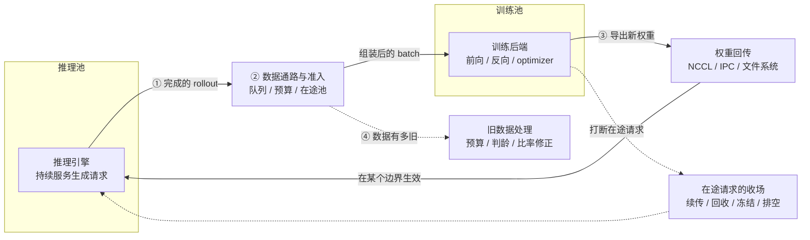
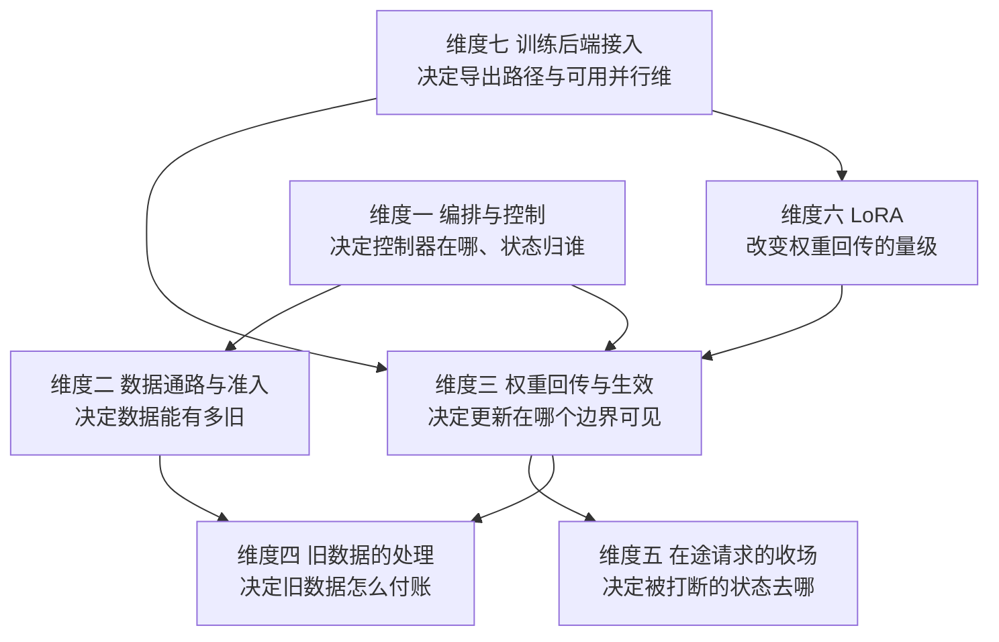

# 把生成和训练拆开之后：异步 RL 训练基础设施的设计决策与框架实现

去年调一个 32B 模型的 GRPO 训练时，我被同一件事反复咬到：`rollout` 那一段的进度条停了四十分钟，八张训练卡的利用率曲线平得像尺子。一开始我以为是某个 prompt 特别长，后来打了 profile 才发现，那四十分钟里 GPU 既不在生成也不在训练，它在等一个「什么时候才能把权重推过去」的决定。

那件事之后我开始逐个读开源 RL 框架的源码，想知道别人是怎么做这个决定的。读下来的第一个感受是：**这些框架面对的设计问题是同一批，但回答的方式差得比我想的远。** 同样是「让生成和训练并行」，有的框架把控制器做成一棵 Ray actor 树，有的让每个进程从配置文件各自推导拓扑，有的干脆把数据丢进消息总线谁也不管谁。同样是「权重怎么推过去」，有的是 NCCL 广播全量参数，有的是写盘加 HTTP 通知，有的只推几十兆的 LoRA adapter。

第二个感受更实际一些：**绝大部分差异不是「谁更先进」，而是同一个设计问题在不同约束下选不同方法的结果。** 一个只在单卡上跑 Unsloth 的框架不需要回答「跨 EP 汇聚 expert 权重」这个问题；一个要在 671B MoE 上做后训练的框架躲不开它。所以这篇文章不打算给出一个「最完整的框架」，我想做的是把设计问题拆清楚，然后把每个问题下的方法归类，最后在**同一种方法内部**比较各框架的实际执行路径，因为真正的工程分歧几乎都发生在方法内部，而不是方法之间。

文章按下面这条线走：

1. **问题背景与共同执行模型**：把「生成与训练分离」这件事的物理约束和四类必须被回答的设计问题讲清楚；
2. **比较对象与设计维度**：给出 16 个框架的基线信息，以及本文的比较维度导航表；
3. **七个维度逐个展开**：每个维度先讲问题的约束、再归纳方法并给出框架映射表，然后逐方法比较框架实现，最后在同方法内部收束差异；
4. **跨维度组合与设计启示**：只从前文已经核实过的实现差异里，推出组合条件与适用负载。

关于证据，这里需要先说清楚口径。文章里每一条关于「某框架怎么做」的断言都来自源码，形式是「仓库@commit 短 hash + 文件路径 + 行号」。16 个框架的本地 clone 在 2026-09-12 复核，其中三个（AReaL、SLIME、verl）的 clone 指向个人 fork，核对以本地 HEAD 为准；OpenRLHF 与 vime 的 clone 明显落后上游，关于它们的结论限定在表里的 commit 上。文中的数字分两类：**引用值**（来自官方文档、论文或上游博客，写明出处）和**成本模型估算**（本文自己按公式算的，写明假设）。没有任何 GPU 实测。

照理，感谢各位大哥的讨论和支持：那些被我半夜抓来问「你们这个 `pause_generation` 到底传没传 `clear_cache`」的朋友们，以及 SGLang RL 社区里一起把权重更新路径从「能跑」推到「能信」的伙伴们。文章里的源码判断如果和你们手上的版本不一致，请务必拍我。

---

## 问题背景与共同执行模型

要理解为什么这些框架长得不一样，得先看清它们被同一组物理约束卡在哪里。

### 同步循环的瓶颈在哪一段

一个最朴素的 GRPO 训练循环按顺序走七步：采样 prompt、生成 `G` 条 completion、算 reward、算组内优势、前向反向、optimizer step、把新权重推给推理引擎。其中绝大部分步骤的耗时可以忽略：采样是 CPU 侧的索引操作，reward 对 outcome 型任务是几次函数调用，优势是组内均值方差，optimizer step 是显存带宽级的操作。真正吃掉时间的是两段：**生成**（自回归、逐 token 吐）和**训练**（前向加反向的 GEMM 风暴）。

把这两段串起来跑，任何一段在进行时另一段都在空转。这就是所有框架都要解决的原始问题。

**生成有多贵？** 解码阶段每出一个 token，都要把全部权重和批内所有序列累积的 KV 读一遍。设每 token 的 KV 字节数为 \(k_{v}=2n_{\mathrm{layer}}n_{\mathrm{kv}}d_{\mathrm{head}}b_{\mathrm{dtype}}\)，批大小 \(b\)、输出长度 \(L_{\mathrm{out}}\)，则一步的访存量是 \(W+b\,L_{\mathrm{out}}k_{v}\)（\(W\) 是权重字节），一步耗时

$$
\tau_{\mathrm{step}}(b)=\frac{W+b\,L_{\mathrm{out}}k_{v}}{\mathrm{BW}}
$$

单序列速率是 \(1/\tau_{\mathrm{step}}\)，批聚合吞吐是 \(b/\tau_{\mathrm{step}}\)。这个式子有一个关键性质：**分母里的 KV 项随 \(b\) 线性增长，权重项固定**，所以吞吐对 \(b\) 次线性，上界是 \(\mathrm{thr}_{\max}=\mathrm{BW}/(L_{\mathrm{out}}k_{v})\)。

代具体数字。7B 级模型（28 层、4 个 KV head、head_dim 128、bf16）的 \(k_{v}\) 是 57,344 B；32B 级（64 层、8 个 KV head、head_dim 128）是 262,144 B。在 H100 的 3.35 TB/s 峰值带宽下：

| 配置 | \(L_{\mathrm{out}}\) | 单序列 KV | \(\mathrm{thr}_{\max}\) | 单序列速率 |
| --- | --- | --- | --- | --- |
| 7B | 600 | 0.034 GB | 97,000 tok/s | 220 tok/s |
| 7B | 32K | 1.88 GB | 1,783 tok/s | 196 tok/s |
| 32B | 600 | 0.16 GB | 21,300 tok/s | 51 tok/s |
| 32B | 32K | 8.59 GB | 390 tok/s | 45 tok/s |

表里有两点值得记住。第一，**短输出下的带宽上界是几万 tok/s 量级**，所以公开 benchmark 里那些 600-token 长度的实测吞吐（7B 约 6,300 tok/s、32B 约 1,200 tok/s）离带宽墙很远，瓶颈在调度和 kernel 效率上；而到了 32K，同一个数字已经超出上界 3 倍以上。**把短输出吞吐外推到长上下文是量级错误**，而且是偏乐观的方向。第二，**解码是彻底的带宽受限**：7B 在 32K、批 30 时的算术强度只有 6.4 FLOP/byte，而 H100 的机器平衡点（算力/带宽）是约 295 FLOP/byte。

**训练有多贵？** 每 token 前向约 \(2N\) FLOPs（\(N\) 是参数量），反向约 \(4N\)，所以训练是 \(6N\) FLOPs/token。生成只有前向，\(2N\)。同一份数据跑一遍时，两段挂钟时间之比是

$$
\frac{T_{\mathrm{gen}}}{T_{\mathrm{train}}}=\frac{\eta_{\mathrm{train}}}{3k\,\eta_{\mathrm{gen}}}
$$

\(k\) 是这份 rollout 被复用几遍训练，\(\eta\) 是各自的 MFU。**这个比值对批大小极度敏感**，因为长上下文解码的 MFU 本质上就是「批大小能开多大」的函数：7B 在 32K 下批 1 时 \(\eta_{\mathrm{gen}}\) 只有 0.3%，比值 44；批开到 KV 容量上限 30 时 \(\eta_{\mathrm{gen}}\) 到 2.2%，比值降到 6.2。所以「生成比训练贵多少倍」没有普适答案，它是一个由批大小决定的谱。

**容量约束比带宽约束更硬。** 一张 H100 装 32B 的 bf16 权重（65.6 GB）之后，可用于 KV 的空间不到 7 GB，而一条 32K 序列的 KV 就是 8.59 GB。所以 32B 在 32K 下 TP=1 连一条序列都放不下，TP=2 只能常驻 9.1 条，TP=8 是 59.4 条。7B 宽松一些：TP=1 能常驻 30.2 条，TP=8 是 298.4 条。**长序列不仅让每条序列更慢，还让能同时跑的序列更少**，这是对吞吐的二次打击。

### 拆开之后多出来的四类设计问题

把生成和训练拆到两个 GPU 池上，原始问题解决了，但换来四类必须被显式回答的设计问题。它们就是本文的四个核心维度：

| 设计问题 | 一句话表述 | 为什么它必然出现 |
| --- | --- | --- |
| **编排与控制** | 谁启动和管理这些角色、谁持有训练进度、工作怎么提交与等待 | 拆开之后系统里同时存在训练进程、推理引擎、reward worker、环境池等多类角色，必须有人协调它们 |
| **数据通路与准入** | 生成结果以什么单位、按什么顺序、在什么容量约束下流向训练侧 | 两个池以不同速率运行，中间必须有个缓冲；缓冲的深度直接决定数据能有多旧 |
| **权重回传与生效** | 训练好的权重怎么导出、怎么传输、在什么边界对推理引擎可见 | 训练侧的并行布局和推理侧的并行布局不同，且推理引擎正在服务请求 |
| **旧数据与在途状态的一致性** | 在旧策略下生成的数据怎么定价；被权重更新打断的在途请求怎么收场 | 一旦并行，数据一定不是严格 on-policy；一旦会打断，在途请求一定要有归宿 |

这四类问题在实现上互相牵动（比如缓冲越深，不一致性上界越大；权重的传输量越小，能允许的中断粒度越细），但它们问的是不同的问题，可以分别回答。文末的「跨维度组合与设计启示」一节会把它们之间的耦合关系收束起来。

把四个问题放在一张图上看，它们各自负责哪一段就清楚了：

<div style="text-align: center;">



</div>

后文还有两个维度，它们不是上面四类问题的直接产物，而是「给定这四类的选择之后，还能不能再压缩成本」的两个杠杆：**LoRA 训练支持**（改变权重回传的量级）、**训练后端接入**（决定权重怎么导出、有哪些并行维可用）。我把它们排在后面，因为只有先理解了前三类问题，才看得懂为什么 LoRA 只推 adapter 这件事在不同框架里的价值差那么多。

---

## 比较对象与设计维度

### 16 个框架的基线信息

下表是本文的被调研样本。所有 HEAD 在 2026-09-12 复核。

| 框架 | 上游仓库 | 复核 HEAD | 最后提交 |
| --- | --- | --- | --- |
| AReaL | [inclusionAI/AReaL](https://github.com/inclusionAI/AReaL) | `ad27064ee5d2ba40d40df77a884af222f765285c` | 2026-09-09 |
| ART | [OpenPipe/ART](https://github.com/OpenPipe/ART) | `879d3365d5065e4ec69dae6141f5c0c646caf643` | 2026-09-12 |
| MILES | [radixark/miles](https://github.com/radixark/miles) | `3ccc2cb37eac2fc51844ac1b4cd4282e923708c1` | 2026-09-11 |
| NeMo-RL | [NVIDIA-NeMo/RL](https://github.com/NVIDIA-NeMo/RL) | `90a2a212d503455d8590be5c8de3cb989d3425b0` | 2026-09-12 |
| open-instruct | [allenai/open-instruct](https://github.com/allenai/open-instruct) | `172e379eada34137885bd1c36543c4f59cb113e4` | 2026-09-11 |
| PRIME-RL | [PrimeIntellect-ai/prime-rl](https://github.com/PrimeIntellect-ai/prime-rl) | `43b4e2bd1334267208fb708e830b415a24f94acc` | 2026-09-11 |
| ROLL | [alibaba/ROLL](https://github.com/alibaba/ROLL) | `192b1a01ea61c113b2deb543f7b115783038dff8` | 2026-08-27 |
| SkyRL | [NovaSky-AI/SkyRL](https://github.com/NovaSky-AI/SkyRL) | `4f5ccd8e58bbcea4804bd831fd47097c3044ff48` | 2026-09-11 |
| SLIME | [THUDM/slime](https://github.com/THUDM/slime) | `870707414451aad3525fdd7acb84e7bc3da88469` | 2026-09-09 |
| Tunix | [google/tunix](https://github.com/google/tunix) | `508eeba78352fafaf15d1b183414f801d82148ca` | 2026-09-11 |
| verl | [volcengine/verl](https://github.com/volcengine/verl) | `67e1c098629e237e1ca2cdf5483a685a8b5b1e03` | 2026-09-12 |
| verifiers-rl | [PrimeIntellect-ai/verifiers](https://github.com/PrimeIntellect-ai/verifiers) | `a32cc09c58be3bdff3dd5a206afd8d03fb5b9945` | 2026-09-11 |
| labs-molt | [NVIDIA-NeMo/labs-molt](https://github.com/NVIDIA-NeMo/labs-molt) | `07ddf03faa8c202bfb8673e1cb72a99e864ef650` | 2026-09-11 |
| Meshy | [OpenBMB/Meshy](https://github.com/OpenBMB/Meshy) | `de37c96edf7eaa35ffa9ad4a9fb9278646a62dc3` | 2026-09-11 |
| OpenRLHF | [OpenRLHF/OpenRLHF](https://github.com/OpenRLHF/OpenRLHF) | `3f8ae08c99db23a3532abc3159144f6a0821a6d0` | 2026-06-17 |
| vime | [vllm-project/vime](https://github.com/vllm-project/vime) | `fa0b6e909bfb578d72afc58011348ed902daf2e4` | 2026-06-11 |

表注几点。AReaL、SLIME、verl 的本地 clone 指向个人 fork，上表写的是各自的上游组织，核对以本地 HEAD 为准。`verifiers-rl` 的包名是 `verifiers`；`NeMo-RL` 的仓库目录名是 `RL`。**OpenRLHF（2026-06-17）与 vime（2026-06-11）的 clone 落后上游较明显**，关于这两个框架的结论都限定在上述 commit 上。Meshy 的仓库里没有 LICENSE 文件（`git ls-files | grep -i licen` 为空），README 挂了 Apache-2.0 badge；labs-molt 的 `version.txt` 是 `0.1.8` 而最新 tag 是 `v0.1.7`。

样本里有几条必须交代的派生与依赖关系，否则会把「框架数量」误当成「独立方案数量」：

- **vime 派生自 slime。** `vime/README.md` 写着「**Vime** is an LLM post-training framework for RL scaling, built on slime」，并注明「Vime is derived from slime. The following upstream resources and in-repo guides still use the slime naming and remain the reference for shared concepts」。不过两者的代码已经分岔得比较远：`slime/slime/ray/rollout.py` 是 495 行，`vime/vime/ray/rollout.py` 是 1,352 行，同名类的实现不同。
- **labs-molt 的 Ray 编排层派生自 OpenRLHF。** `labs-molt/README.md` 写「Molt is based on OpenRLHF and keeps its Python package layout where practical」。代码层面的证据更硬：`OpenRLHF/openrlhf/trainer/ppo_trainer_async.py`（353 行）与 `labs-molt/molt/trainer/rl_trainer.py`（1,041 行）共享 10 个同名定义（`GenerateSamplesActor`、`TrainingActor`、`VLLMLock`、`broadcast_to_vllm`、`fit`…），`OpenRLHF/openrlhf/trainer/ray/ppo_actor.py` 与 `labs-molt/molt/trainer/workers/policy_actor.py` 共享 11 个。**比较这两个框架的编排设计时，要比较它们各自在共享骨架上加/减了什么**，而不是当成两个独立设计。
- **训练后端与推理引擎是可替换依赖，不作为比较对象。** labs-molt 主路径用 FSDP2 + NVIDIA AutoModel（无匹配架构时降级到 HF transformers），Meshy 用 torchtitan，vime 与 SLIME 用 Megatron-LM，OpenRLHF 用 DeepSpeed ZeRO。它们出现在文中的身份是「某框架的训练后端」，不单独设节、不参与计数。vLLM 与 SGLang 同理。
- **verifiers-rl 的本体不含训练循环。** `verifiers/v1/clients/train.py` 只是一个 train client，实际训练由外部的 prime-rl CLI 驱动。所以凡是涉及训练侧设计的维度，verifiers-rl 的答案来自 prime-rl，文中会注明。

### 设计维度导航

正文按七个维度展开。每个维度只回答一个主要设计问题；同一维度内部，方法之间是**替代关系**（选一个）或**可组合的机制**（可以叠加），文中会分别说明。

| 比较维度 | 核心设计问题 | 主要方法 |
| --- | --- | --- |
| **一、编排与控制** | 谁启动和管理训练、推理、reward、环境这些角色，谁持有全局训练进度，工作怎么提交、结果怎么等待 | 控制器本身是一个 actor（labs-molt、OpenRLHF、SLIME、vime、MILES）；控制器在 driver 进程里（SkyRL、verl、open-instruct、NeMo-RL、ROLL）；声明式拓扑自推导（Meshy）；外部 launcher + 进程内并发（AReaL、Tunix、prime-rl、ART） |
| **二、数据通路与准入** | 生成结果以什么载体、什么消费单位、什么顺序流向训练侧，什么量被封顶 | 有界队列 + 容量令牌（labs-molt、OpenRLHF）；版本预算 / 请求计数准入（AReaL、Meshy、NeMo-RL、SkyRL）；跨 batch 固定在途池（slime、vime、verl 的 fully-async）；同步收集（ART） |
| **三、权重回传与生效** | 训练好的权重怎么从训练布局导出、经什么通路传输、在什么边界对推理引擎可见 | 全量参数 NCCL 广播（逐参数或分桶）；共享显存直传（CUDA IPC）；文件系统中转（写盘 + 通知/HTTP 加载）；跨 mesh 重分片（JAX）；生效边界另有两个可独立配置的量 |
| **四、旧数据的处理** | 在旧策略版本下生成的数据怎么定价：限制提交、按年龄拒绝，还是训练侧修正 | 生成侧容量准入；消费侧按版本跨度判龄（丢弃 / 等待）；训练侧比率修正（IS / TIS / OPSM / mask） |
| **五、在途请求的收场** | 权重更新打断正在生成的请求时，请求、已生成 token、行为 logprob、KV cache、路由状态分别怎么处理 | 中止 + 前缀续传；中止 + 回收重跑；冻结后继续（保留 KV）；冻结但清缓存；排空 / 准入闸门；组取消 |
| **六、LoRA 训练与只推 adapter** | adapter 怎么注入训练、优化器管哪些参数；同步时发 adapter 还是发合并权重 | 训练侧：注入实现来源（peft / Megatron-Bridge / 自研）+ 与并行的配合；同步侧：adapter 提取并落盘 + 引擎加载 / 合并后走全量通路 |
| **七、训练后端接入** | RL 控制器在哪个边界调用训练后端，训练布局怎么映射到推理布局，哪些能力由后端提供、哪些要框架自己补 | 训练后端抽象层 + 每后端一个 strategy/worker；导出路径由策略决定；布局转换与命名映射由框架补 |

需要说明维度之间的关系：**前四个维度是「拆开」的直接产物**（编排服务于多角色、数据通路服务于速率解耦、权重回传服务于两个池的同步、旧数据处理服务于并行带来的不一致）；**第五个维度是第三个维度的推论**（只有在权重更新会打断在途请求时，才有收场问题）；**第六、第七个维度是成本杠杆**（LoRA 改变权重回传的量级，训练后端决定权重导出的代价与可用并行维）。

维度之间的耦合会在具体章节里就地说明，最后一节做统一收束。它们之间的依赖方向是：

<div style="text-align: center;">



</div>

---

## 维度一：谁负责启动、协调与推进

### 问题与约束

拆开之后，一个训练步要牵动的东西突然变多了：训练进程要跑 optimizer，推理引擎要持续服务生成请求，reward 要给完成的轨迹打分，agentic 任务还要一个环境池去执行工具调用。这些角色的资源需求不一样（GPU 数量、CPU 核数、是否需要网络出口），故障模式不一样（推理引擎会 OOM、环境会超时、训练进程会被抢占），生命周期也不一样（环境池要按需扩容，训练进程要跨天运行）。

因此「编排」这个词实际上盖住了四件不同的事，我把它们分开问：

1. **谁启动这些角色**：进程是谁 fork 出来的，GPU 是怎么分给它们的；
2. **谁持有全局训练进度**：`global_step`、当前 policy 版本、数据集游标这些状态放在哪个进程里，谁是唯一权威；
3. **工作怎么提交、结果怎么等待**：生成任务是以什么形式发出的，训练侧在哪个调用点阻塞；
4. **暂停、异常与退出由哪一层处理**：权重同步时的互斥、推理引擎崩溃后的重启、训练结束时的清理。

这四件事可以落在不同的层上。把它们混在一起谈，就会出现「A 和 B 都用 Ray，所以编排方式一样」这类没有信息量的结论，**用同一个运行时，不代表把控制器放在同一个位置**。

### 方法归纳与框架映射

按「控制器放在哪里」这一条主线，本样本分四种方法。这里说的是**控制平面的位置**，不是「有没有用某个运行时」。

| 方法 | 核心机制 | 采用它的框架与运行路径 | 主要收益与代价 |
| --- | --- | --- | --- |
| **A. 控制器本身是一个 actor** | 除了 GPU worker actor 之外，另起一个专门的 controller actor；训练循环跑在这个 actor 的 `fit()` 里，它持有 `rollout_queue`、锁和 slot 计数，并向 worker actor 发远程调用 | labs-molt（`RLTrainer`）、OpenRLHF（`PPOTrainerAsync`）、vime（`RolloutManager` + 训练 actor）、SLIME（`RolloutManager`）、MILES（`RolloutExecutor`） | 控制器与 worker 的生命周期都由同一运行时托管，故障语义统一；代价是控制流被切成远程调用，栈追踪和调试要跨 actor |
| **B. 控制器在 driver 进程里** | driver 进程持有训练循环与全部控制状态，worker 是它管理的 actor group；控制流是普通函数调用，只有 compute 被远程化 | SkyRL（`WorkerDispatch` + `PPORayActorGroup`）、verl（`RayPPOTrainer` 及其 fully-async 变体）、open-instruct（`PolicyTrainerRayProcess`）、NeMo-RL、ROLL | 控制流可读、可直接打断点；代价是 driver 成为单点，且 driver 与 worker 之间的状态要自己保持同步 |
| **C. 没有控制器进程，拓扑由声明式配置推导** | 每个进程从同一份 recipe 与全局 GPU 列表**本地**算出自己该启动哪些服务、占用哪些卡、监听哪个端口；服务之间只通过消息总线交换数据与控制信号 | Meshy（`meshy/service/topology.py` 的纯函数 `build_topology`，由 `scripts/launch.py` 起一个 torchrun） | 没有中央调度器可挂，扩展与容错边界清晰；代价是没有统一的进度权威，需要自己定义「谁在什么时候推进版本」 |
| **D. 外部 launcher + 进程内并发** | 进程怎么起交给外部（local / Slurm / Ray 三选一的 launcher），进程内用 asyncio/线程协调 | AReaL（`areal/infra/scheduler/` 与 `areal/infra/launcher/` 各有 local/ray/slurm 三份）、Tunix（JAX mesh + `ThreadPoolExecutor`）、prime-rl（asyncio orchestrator + HTTP 管理端点）、ART（asyncio + 子进程） | 不绑定编排运行时，部署形态灵活；代价是调度与容错要自己实现或依赖外部系统 |

表里把 AReaL 放在 D 而不是 A，是因为它的调度层确实是可替换的：`areal/infra/scheduler/` 下同时有 `local.py`、`ray.py`、`slurm.py`，`areal/infra/launcher/` 同样三份，`areal/infra/scheduler/__init__.py` 把三个都导出。它的 Ray 使用体现在 `RayWorkerProcessLauncher` 这类工具上，而不是「控制器必须是 Ray actor」。

### 方法 A：控制器本身是一个 actor

#### labs-molt / OpenRLHF：同一套骨架的两次实现

这两个框架放在一起讲，因为它们共享骨架。`labs-molt/README.md` 写「Molt is based on OpenRLHF and keeps its Python package layout where practical」，代码层面的证据更硬：`OpenRLHF/openrlhf/trainer/ppo_trainer_async.py`（353 行）与 `labs-molt/molt/trainer/rl_trainer.py`（1,041 行）共享 10 个同名定义，`OpenRLHF/openrlhf/trainer/ray/ppo_actor.py` 与 `labs-molt/molt/trainer/workers/policy_actor.py` 共享 11 个。

**共享的骨架**由四个角色组成：

```python
# OpenRLHF/openrlhf/trainer/ppo_trainer_async.py:19-34
@ray.remote(num_cpus=0)
class VLLMLock:
    def __init__(self):
        self._lock = asyncio.Lock()

    async def acquire(self):
        await self._lock.acquire()

    async def release(self):
        self._lock.release()
```

```python
# labs-molt/molt/trainer/rl_trainer.py:585-597
@ray.remote(num_cpus=0)
class VLLMLock:
    """Cross-actor mutex for vLLM critical sections."""

    def __init__(self):
        self._lock = asyncio.Lock()

    async def acquire(self):
        await self._lock.acquire()

    async def release(self):
        self._lock.release()
```

`VLLMLock` 用 `num_cpus=0` 起一个纯协调 actor，内部包一层 `asyncio.Lock`，这样一个跨进程的互斥就不需要额外的分布式锁服务。GPU actor 用 `@ray.remote(num_gpus=1)` 声明资源需求（`labs-molt/molt/trainer/workers/policy_actor.py:740`、`OpenRLHF/openrlhf/trainer/ray/ppo_actor.py:492`）。控制器的构造顺序是：

1. 先建两个队列（数据队列 + slot 队列），把 slot 队列按容量填满令牌；
2. 建 `VLLMLock`；
3. 建 `GenerateSamplesActor`（持数据加载器、推理引擎句柄、两个队列、锁）；
4. 建 `TrainingActor`（持 actor/critic/reference 的 `RayActorGroup`、optimizer、以及推理引擎句柄）；
5. 控制器自己作为 `@ray.remote` actor 被主进程创建，训练循环在它的 `fit()` 里。

`GenerateSamplesActor` 的构造签名在两边几乎逐字一致（`OpenRLHF/openrlhf/trainer/ppo_trainer_async.py:37-49` vs `labs-molt/molt/trainer/rl_trainer.py:599` 起），都接收 `pretrain, strategy, vllm_engines, *, vllm_lock, rollout_queue, rollout_slots, **generate_kwargs`。

**分岔在于 labs-molt 在控制器上多挂了两样东西**：一个 `VllmRouterActor`/`AgentRunnerActor`（支持 agentic 场景下通过 HTTP 把 rollout 入口暴露给外部 agent，`molt/agents/_chat_server.py` 用 aiohttp 实现、靠 `x-session-id` 做会话路由），以及一个 `--train.force_sync_mode` 开关。后者值得单独看一眼它在控制器里的作用（`molt/cli/train_rl_ray.py:795-803`）：

```
--train.force_sync_mode
    Strictly on-policy: free the rollout slot only AFTER train_step refits vLLM, so the
    next batch is generated with the same weights the trainer recomputes it under. Removes the
    1-step-stale rollout that inflates vllm_kl on routing-sensitive MoE checkpoints, at the
    cost of the generate/train overlap.
```

也就是说 labs-molt 把「slot 什么时候释放」这个控制器内部的动作做成了策略开关：默认释放在 refit 之前（换来重叠），打开 `force_sync_mode` 则释放在 refit 之后（换掉重叠，得到严格 on-policy）。**这是一个纯控制器层的改动，不涉及任何 worker 的行为**，正好说明控制器持有的是「进度与准入」这类状态。

#### vime / SLIME：派生但已分岔的 RolloutManager

vime 从 slime 派生，但两者的 controller 已经不是同一份代码：`slime/slime/ray/rollout.py` 是 495 行，`vime/vime/ray/rollout.py` 是 1,352 行，同名 `RolloutManager` 的内部实现不同。分岔的方向可以从入口文件的差异看出来（`vime/train_async.py:12`）：

```python
    rollout_data_next_future = rollout_manager.generate.remote(args.start_rollout_id)
    for rollout_id in range(args.start_rollout_id, args.num_rollout):
        # Sync the last generation
        if rollout_data_next_future is not None:
            rollout_data_curr_ref = ray.get(rollout_data_next_future)

        # Start the next rollout early.
        if rollout_id + 1 < args.num_rollout:
            rollout_data_next_future = rollout_manager.generate.remote(rollout_id + 1)
```

**「提前发出下一次生成的 future，与本次训练重叠」**，这是把它归到方法 A 的原因：控制器（这里是 driver 里的 `train()` 函数）显式持有一个 future，并且在正确的时机 `ray.get` 它。vime 相对 slime 的改动主要在 rollout 后端（vLLM + vllm-router 取代 SGLang），而这个 look-ahead future 的控制结构两者一致。

MILES 的 `RolloutExecutor` 与 SLIME 的 `RolloutManager` 是同一族设计（MILES 派生自 slime 生态），差异体现在 rollout 后端的接口上。

### 方法 B：控制器在 driver 进程里

#### SkyRL：控制器被收敛成一个 `WorkerDispatch` 对象

SkyRL 没有独立的 controller actor。控制逻辑集中在 driver 进程的一个普通 Python 对象里：

```python
# SkyRL/skyrl/backends/skyrl_train/workers/worker_dispatch.py:43-50
class WorkerDispatch:
    def __init__(
        self,
        ...
```

它管的事情很多，而且名字就说明了职责：`register_actor_group(model, actor_group)`、`ensure_active_adapter(role, model_id)`、`register_adapter` / `delete_adapter`、`get_lcm_dp_size()`、`dp_size(model)`、`_should_manage_offload(model)`、`_get_colocation_group(model)`、`_offload_inactive_model(model)`。**这是一个把「谁当前活着、谁的权重是最新的、要不要 offload」全部收在一个对象里的设计。** 与之配套的 `PPORayActorGroup` 承载 GPU worker，而权重同步的暂停/恢复也由这个对象驱动（`worker_dispatch.py:728-734` 对 `merge_lora=False` 走 in-place LoRA 分支，不重新暂停）。

这种设计的收益在跨模型的场景里最明显：多租户训练时同时存在多套 adapter，`ensure_active_adapter` 必须在广播前把正确的 adapter 切到所有 worker 上，否则会把别的租户的权重发出去。源码注释就是这么写的：

```python
        # Make the requested adapter live on every worker before broadcasting
        # — otherwise we'd export some other tenant's LoRA weights to vLLM.
        self.ensure_active_adapter("policy", model_id)
```

#### verl：主控制器放 driver，fully-async 另起两个 actor

verl 的常规路径是 `RayPPOTrainer` 跑在 driver 里。它的 fully-async 路径（`verl/verl/experimental/fully_async_policy/`）则把 rollout 与训练拆成两个独立的 actor：`FullyAsyncRollouter`（`fully_async_rollouter.py:330`）和 `FullyAsyncTrainer`（`fully_async_trainer.py:54`），两者都继承 `SeparateRayPPOTrainer` 并各自实现 `async def fit()`（`fully_async_rollouter.py:1076`、`fully_async_trainer.py:498`），中间靠 `message_queue.py` 通信，由 `FullyAsyncTaskRunner`（`fully_async_main.py:36`）拉起。

这是一个值得注意的演进：**同一个框架在同步路径上用方法 B，在 fully-async 路径上部分转向方法 A。** 原因是 fully-async 要求 rollout 侧能独立于训练侧持续推进，如果控制器还在 driver 里、且 driver 的循环要等训练步结束，就无法做到「rollout 永不停」。把 `fit()` 拆成两个 actor 之后，两边各有自己的循环，通信退化成消息队列。

#### open-instruct / NeMo-RL / ROLL

这三者的控制器都在 driver 进程里，但「远程化的边界」不同。open-instruct 的 `PolicyTrainerRayProcess` 把训练进程整体远程化，`DataPreparationActor` 和 `EnvironmentPool` 分别管数据与环境；NeMo-RL 的 worker 划分非常细（源码里有 50 多个 `@ray.remote` 类，包括按量化和后端分开的 policy/generation worker、`RouterActor`、`GenerationRouterActor`、`Lock`、`DynamoGpuReservation`），这说明它的控制平面承担了「按配置选择哪套 worker」的分发职责；ROLL 的 actor 里有一批基础设施型的角色（`GlobalDatasetManager`、`GlobalLimiter`、`SharedStorage`、`Barrier`、`Locker`、`ExceptionMonitor`、`RayMemoryStoreServer`），**它的控制平面更像一个自己搭的分布式运行时**。

### 方法 C：没有控制器，拓扑由声明式配置推导

Meshy 的做法与本样本其他 15 个都不同。它不起 Ray、也没有中央调度器，进程模型是「一个 torchrun + 每卡一个 ignitor 进程」，而每个进程**自己算出**整个集群的布局：

```python
# Meshy/meshy/service/topology.py:1-15
"""Deterministic, file-free topology derivation for the card-level SPMD stack.

Under card-level SPMD every ignitor process already all-gathers the global list
of :class:`~meshy.service.base.GPU` (host / global_rank / node_rank / local_rank).
Given that list plus the static :class:`~meshy.service.base.ServiceGroup` DAG,
every process can *locally* recompute the complete placement of every service --
which cards it occupies, on which host, and (deterministically) at which
endpoint / dist port. No cross-process info files are needed to discover
endpoints.

:func:`build_topology` is a pure function of ``(service_groups, gpus)``: it
yields the full registry of every :class:`ServiceInfo`. Which of those a given
card's ignitor process actually ignites is selected afterwards by
:meth:`Topology.local_services`.
"""
```

`build_topology` 是 `(service_groups, gpus)` 的纯函数，端口从各 `ServiceConfig` 子类里读（内置 base 是 `INFER_PORT_BASE = 30000`、`TRAIN_PORT_BASE = 31000` 等）。启动侧只有一条命令（`Meshy/scripts/launch.py` 的 docstring）：

```
The launcher imports the recipe's ``SERVICE_GROUPS`` (cheap: dataclasses only),
computes the total card count, and launches **one** ``torchrun`` with one ignitor process per card.
```

这套设计的直接后果是：**没有地方可以挂一个「全局训练进度」**。Meshy 的应对是把进度做成服务之间的 gate 信号：数据面走 TransferQueue（ZMQ，`meshy/transferqueue/launcher.py:25-28`），控制生成进度靠 gate，只有健康监测用少数 HTTP 管理端点。它自己的中文博客把动机写得很直白（`meshy/docs/meshy-blog-zh.md:85`）：「其不依赖 Ray，也没有中央调度器；服务之间只通过队列中的数据列约定、控制生成进度的 gate 信号，以及少数用于健康监测的 HTTP 管理端点进行协作。」

这套模型对「谁推进版本」的要求比方法 A/B 高：既然没有权威控制器，版本推进就必须由某个服务按约定负责。Meshy 的做法是把 checkpoint dump、权重同步与版本自增绑定在一次「训练窗口」结束时（维度七会看到它的 `stream_minibatch` 调度把这三件事一起延后到满 batch）。

### 方法 D：外部 launcher + 进程内并发

#### AReaL：调度器三选一

AReaL 的调度层是可替换的，`areal/infra/scheduler/` 与 `areal/infra/launcher/` 各有 local / ray / slurm 三份实现，`__init__.py` 把三个都导出。这意味着它的编排设计有两条独立的轴：**进程怎么起**（launcher）和**任务怎么调度**（scheduler），两者可以分别选。

它的控制平面里有一个值得单独看的组件：`RolloutController`（`areal/infra/controller/rollout_controller.py:77`）提供 `get_capacity()`（`:1043`）和 `submit()`（`:1046`）两个方法，容量由 `StalenessManager` 给出（下一节展开）。**这是一个把「能不能再提交一个 rollout」变成显式查询接口的设计**，生成侧的推进不是靠控制器的循环，而是靠每次提交前问一次容量。

#### prime-rl：asyncio orchestrator + HTTP 管理端点

prime-rl 的 orchestrator 是一个 asyncio 进程，对推理引擎的控制全部走 HTTP 管理端点（`src/prime_rl/orchestrator/clients.py` 里是成片的 `asyncio.gather(*[_admin_post(client, ...)])`）。它的调度状态由一个 `dispatcher.py` 维护，里面能看到 `max_off_policy_steps` 这样的准入参数。

#### Tunix 与 ART

Tunix 的协调原语是 JAX mesh，异步重叠靠 `ThreadPoolExecutor`。**把它的编排与 PyTorch 生态的框架直接并列比较没有意义**，它活在 XLA/TPU 的坐标里。本文的做法是在维度一里注明这一点，把它的实际差异留在维度二（数据通路）与维度六（LoRA）里比较，因为在那两处它的对比才有内容。

ART 是唯一的同步框架：它的原子单元是「收集完所有 rollout 再训练」，所以控制器不需要处理「训练与生成同时活着」的并发问题（`ART/src/art/backend.py:58` 的 `train` 是一个 async 接口，但语义上是顺序的）。把 ART 放进这张表是为了给出方法 A/B 之外的对照：**当一个框架选择不重叠时，它整个控制平面都可以简化。**

### 同方法下的差异与取舍

把三种方法放在一起，真正的分岔点其实只有两个。

**第一个分岔：控制器的身份是「actor」还是「driver 里的对象」。** 这不是风格问题，它决定了三件具体的事。其一，**故障语义**：控制器是 actor 时，它可以被运行时按策略重启，但它持有的 in-memory 状态（队列、slot、锁）也会随之一并消失，所以状态必须放在别的 actor 上（这就是为什么 labs-molt 与 OpenRLHF 把队列和锁建成独立的 actor）；控制器在 driver 里时，driver 挂掉就是整个训练挂掉，但状态天然是一致的。其二，**调试成本**：verl 与 SkyRL 的训练循环可以直接在 driver 里打断点，而 labs-molt 的 `RLTrainer.fit()` 是一串 `ray.get(...)`，栈追踪会跨进程。其三，**扩展边界**：控制器是 actor 时，rollout 侧可以独立扩缩容而不用改训练侧代码；控制器在 driver 里时，扩缩容通常要改 driver 的配置。

**第二个分岔：状态是「集中」还是「就地推导」。** Meshy 选了就地推导，代价是没有全局进度权威；AReaL 选了把容量变成一个查询接口，代价是生成侧要负责在容量不足时退避。**这两条路都可行，但它们对「谁负责推进版本」的回答不同**：集中式由控制器回答，就地推导式必须由服务之间的约定回答。这一点在维度三（权重生效边界）里会变成一个真实的设计约束。

关于运行时提供的潜在能力与框架实际实现的差距，有一个具体例子值得记录：open-instruct 用 Ray 的 actor 监督，但从源码里找不到一条专门的「从 vLLM 崩溃中恢复」的代码路径。**用同一个运行时不代表自动获得它的全部能力**，故障恢复这件事要么有代码，要么没有。

---

## 维度二：生成结果怎么流向训练侧

### 问题与约束

两个 GPU 池以不同速率运行，中间必须有东西吸收速率差。这个「东西」要回答五个彼此独立的问题，我把它们分开列，因为现有很多讨论把它们压在一个「队列深度」上，结果既说不清也说不准：

1. **载体是什么**：数据以什么形式在两个池之间传递？Ray object store 里的对象、进程内的 `queue.Queue`、ZMQ 的连接、共享内存、还是磁盘文件。
2. **消费单位是什么**：训练侧一次取走的单位是单个 sample、一个 prompt group（`G` 条一起）、一个 mini-batch、一个 rollout batch，还是一个 episode。
3. **生成与消费怎么调度**：整批等齐才交付、训练开始时提前提交下一次生成、完成一个就交付一个、还是生成侧跨 batch 边界持续在跑。
4. **什么量被封顶**：物理队列容量、同时在跑的请求数、预取的 batch 数、在途 rollout 组数、还是与版本差挂钩的预算。
5. **顺序怎么定**：FIFO、完成顺序、组内必须凑齐、被中断的样本重新入队，还是有别的规则。

**第 4 项是这一维度里最容易出错的地方。** 一个「深度为 K 的队列」和一个「允许超前 K 个版本的生成预算」在代码里可能都写成一个整数，但前者限制的是同时在缓冲区里的对象数，后者限制的是数据能有多旧。这两件事的耦合是有条件的：只有当消费严格 FIFO、而且每个训练步正好消费一批时，队列深度才能推出一个陈旧度上界。

还有一个更基础的约束决定了上限：**能同时跑多少条序列是被 KV 容量锁死的**。「问题背景与共同执行模型」一节算过，32B 在 32K 下 TP=1 只能常驻 0.75 条序列。这意味着在这个配置下，「把队列开深来提吞吐」这个手段根本用不上，推理侧连一条序列都放不下第二条。所以讨论 buffer 深度前，先要确认 KV 预算允许的并发数是多少。

### 方法归纳与框架映射

按「谁在什么时候决定交付」这一条主线分四种方法：

| 方法 | 核心机制 | 采用它的框架与运行路径 | 主要收益与代价 |
| --- | --- | --- | --- |
| **A. 有界队列 + 容量令牌** | 一个数据队列加一个容量队列；容量队列预先填满 K 个令牌，生成侧取令牌才能生成，训练侧消费后归还 | labs-molt（`async_queue_size`，默认 1）、OpenRLHF（同名参数，默认 1） | K 直接控制同时在途的 batch 数，语义清晰；代价是吞吐上限被 K 卡住，且令牌的归还时机变成一个策略选择 |
| **B. 版本预算 / 请求计数准入** | 用「已接受样本数相对当前版本的上限」或「在跑请求数」算出一个剩余容量，生成侧每次提交前查询 | AReaL（`StalenessManager.get_capacity()`）、Meshy（`pacing_window` 推导的 generation budget）、NeMo-RL、SkyRL（staleness 容量门控） | 上限与版本差直接挂钩，不受队列物理容量影响；代价是「容量」这个概念需要生成侧主动轮询 |
| **C. 跨 batch 边界的固定在途池** | 生成侧有一个常驻的后台 worker，维护固定数量的在途 trajectory；训练步只从这里取已完成的，不等最慢的那条 | vime（`AsyncRolloutWorker`）、slime（fully-async rollout）、verl（fully-async policy） | 训练步的等待时间不再等于最长序列；代价是需要一个跨 rollout 调用存活的后台执行体，且中途被中断的组要有归宿 |
| **D. 同步收集** | 收集齐所有 rollout 才开始训练，没有并发窗口 | ART | 控制流与状态最简单；代价是完全没有重叠 |

### 方法 A：有界队列 + 容量令牌

#### labs-molt / OpenRLHF：两队列结构

两个框架用同一套结构：一个**数据队列**和一个**容量队列**，两者容量相同。

```python
# labs-molt/molt/trainer/rl_trainer.py:972-980
queue_size = getattr(strategy.args.train, "async_queue_size", 1)
if queue_size <= 0:
    raise ValueError(f"async_queue_size must be positive, got {queue_size}")
logger.info(f"async_queue_size={queue_size}")

self.rollout_queue = Queue(maxsize=queue_size)
self.rollout_slots = Queue(maxsize=queue_size)
for _ in range(queue_size):
    self.rollout_slots.put(0, block=True)
```

`--train.async_queue_size` 的默认值是 1（`molt/cli/train_rl_ray.py:788`、`openrlhf/cli/train_ppo_ray.py:275`），传输用的是 **`ray.util.queue.Queue`**，不是 Redis、不是 ZMQ、不是共享内存。

**消费单位是「一个 rollout batch」，不是单个样本。** 生成侧把 `(rollout_samples, client_states, rollout_metrics, generation_time, vllm_idle_wait)` 作为一个元组整体入队（`molt/trainer/rl_trainer.py:791-794`），训练侧整体取出。

**令牌的取用与归还构成了这个维度的核心机制**，值得完整走一遍生成侧的循环（`molt/trainer/rl_trainer.py:702-712, 788-799`）：

```python
            while True:
                # Backpressure: slot token carries trainer's latest global_step for eval
                # timing. ...
                _slot_wait_t0 = time.time()
                global_step = self.rollout_slots.get(block=True)
                vllm_idle_wait = time.time() - _slot_wait_t0
                ...
                if rollout_samples:
                    ...
                    self.rollout_queue.put(
                        (rollout_samples, client_states, rollout_metrics, generation_time, vllm_idle_wait),
                        block=True,
                    )
                else:
                    # Nothing enqueued => trainer will never consume this slot.
                    self.rollout_slots.put(global_step, block=True)
```

三个细节值得停下来看。

**第一，令牌里携带的是训练侧的 `global_step`。** 生成侧拿到的不只是一个「可以生成」的信号，还拿到了训练进度。这解释了为什么同一个队列既能做背压又能做 eval 触发与指标归因：`vllm_idle_wait`（生成侧等令牌的时间）直接度量了「vLLM 因为训练慢而空转」，而训练侧的 `actor_idle_wait`（训练侧等数据的时间）度量了「actor 因为生成慢而空转」。源码注释把这个设计意图写得很清楚（`molt/trainer/rl_trainer.py:703-707`、`:907-912`）：

```
                # Backpressure: slot token carries trainer's latest global_step for eval
                # timing. Time the block — in this async split, the generator stuck here
                # means the vLLM side is sitting IDLE waiting for the trainer to free a
                # slot (training slower than generation). This is the true vLLM-idle signal,
                # which the wall-clock generation_time alone cannot show.
```

**第二，生成结果为空时必须显式归还令牌**（上面 `else` 分支）。这是一个很容易漏掉的边界：令牌的归还通常和「训练侧消费」绑定，但当生成侧什么都没产出时（比如数据耗尽、或者这次只触发了 eval），训练侧永远不会消费，令牌就泄漏了，K 会单调衰减到 0 然后死锁。

**第三，令牌的归还可以被配置推迟，而且这个推迟直接决定了数据的陈旧度。** `molt/trainer/rl_trainer.py:890-902`：

```python
            # Batch consumed => free one token to allow generator to produce next batch.
            # --train.force_sync_mode defers this until AFTER train_step (which updates the
            # actor and refits vLLM), so the generator waits for the fresh weights before
            # producing the next batch -> the next rollout is generated with the same
            # weights the trainer recomputes it under (strictly on-policy). This removes the
            # 1-step-stale rollout that inflates vllm_kl on routing-sensitive MoE
            # checkpoints, at the cost of the generate/train overlap. Default off.
            force_sync = getattr(self.args.train, "force_sync_mode", False)
            if not force_sync:
                self.rollout_slots.put(global_step, block=True)

            status, global_step = self.train_step(rollout_samples, global_step)
            if force_sync:
                self.rollout_slots.put(global_step, block=True)
```

默认路径下，训练侧一取出 batch 就归还令牌，生成侧立刻开始下一批，此时 vLLM 里装的是**上一轮 refit 之后的权重**，而训练侧正在算的是**这一批数据**的梯度。等训练完成、refit 之后，在途的那一批已经在旧权重上生成了一半。打开 `force_sync_mode` 则把归还推迟到 `train_step` 返回（`train_step` 内部完成了 refit），生成侧拿到的是新权重，代价是生成与训练不再重叠。

**这正是「队列深度」与「陈旧度上界」不是同一件事的具体证据。** 两种配置下 `async_queue_size` 都是 1，队列容量完全一样，但默认路径下存在「跨一次权重更新的数据」，而 `force_sync_mode` 下不存在。源码注释直言前者会「inflates vllm_kl on routing-sensitive MoE checkpoints」，也就是它在 MoE 上会真的把训推不一致放大。

**OpenRLHF 的对应实现**在 `openrlhf/trainer/ppo_trainer_async.py:287-295`，结构与 labs-molt 相同（`maxsize=queue_size` 的两个 `Queue`，注释「Batch consumed => free one token」），但没有 `force_sync_mode` 这个开关。

### 方法 B：版本预算 / 请求计数准入

#### AReaL：容量是一个可以查询的接口

AReaL 不用队列做背压，而是把「还能不能再提交」做成一个可以查询的方法。`RolloutController.get_capacity()`（`areal/infra/controller/rollout_controller.py:1043-1044`）直接转发给 `StalenessManager`：

```python
    def get_capacity(self):
        return self.staleness_manager.get_capacity()
```

真正的计算在 `areal/infra/staleness_manager.py:99-113`：

```python
        with self.lock:
            current_version = self.version_provider.get_version()
            # Calculate concurrency-based capacity
            max_concurrent_rollouts = max(1, self.max_concurrent_rollouts)
            concurrency_capacity = max_concurrent_rollouts - self.rollout_stat.running

            # Calculate staleness-based capacity
            ofp = self.max_staleness
            sample_cnt = self.rollout_stat.accepted + self.rollout_stat.running
            consumer_bs = max(1, self.consumer_batch_size)
            staleness_capacity = (ofp + current_version + 1) * consumer_bs - sample_cnt

            # Return the minimum of both constraints
            capacity = min(concurrency_capacity, staleness_capacity)
            return capacity
```

把它翻译成人话：**到当前版本 `v` 为止，系统总共最多应该接受 `(ofp + v + 1) · consumer_bs` 个样本，减去已经接受和在跑的，就是还能再收多少。** 两个约束取最小值，一个来自并发上限（同时在跑多少个 rollout），一个来自陈旧度预算。

这个式子的关键在于它**约束的是「样本累计接受量随版本的增长率」，不是「队列里有几个对象」**。所以它不受缓冲区的物理容量影响，也不需要严格 FIFO。代价是生成侧要主动配合：每次提交前查询容量，容量不足时退避轮询。

代码里还有一处很能说明「用累计量做时钟」这种设计的副作用（`areal/infra/staleness_manager.py:115-131`）：

```python
    def on_version_recovered(self, version: int) -> None:
        """Adjust accepted count after checkpoint recovery.

        When a checkpoint is recovered, the version jumps from 0 to the
        recovered value. Without adjusting accepted, the capacity formula
        yields (max_staleness + version + 1) * batch_size instead of the
        intended (max_staleness + 1) * batch_size, causing a burst of
        submissions and unbounded staleness growth.
        """
```

从 checkpoint 恢复时版本号会从 0 跳到 `v`，如果不把 `accepted` 一起跳到 `v · bs`，公式会凭空放出 `v · bs` 个名额，造成提交风暴。**公式里的 `current_version` 同时承担了「时钟」和「计数基准」两个角色**，这是只有真实运行才会暴露的耦合。

#### Meshy：gate 信号加上生成预算

Meshy 的准入由两个东西共同决定：一个**版本 gate**，和一个由 `pacing_window` 推导的**生成预算**。gate 是控制面的一条流（`gen_gate`），训练侧在每个窗口结束时把 gate 抬起来并带上新的 `weight_version`：

```python
# Meshy/meshy/worker/rollout.py:252-270
    async def try_advance_gate(self) -> bool:
        data = await self.read_tq_control("gen_gate")
        if data is None:
            return False
        step = _scalar(data["gate_step"])
        version = _scalar(data["weight_version"])
        expected = self.gates_seen
        ...
        previous = self.weight_version
        self.gates_seen += 1
        self.weight_version = version
```

预算的算法在 `Meshy/meshy/worker/rollout.py:243-301`：

```python
    def _generation_budget(self) -> int:
        if self.gates_seen == 0:
            return 0
        assert self.pacing_window is not None
        return (self.gates_seen - 1 + self.pacing_window) * self.train_batch_size

    async def acquire_generation_slot(self, num_samples: int) -> int:
        ...
        while self.gates_seen == 0:
            if self.stopped:
                raise asyncio.CancelledError
            if not await self.try_advance_gate():
                await asyncio.sleep(min(self.poll_interval, 2.0))
        if self.pacing_window is None:
            await self.drain_gates()
            self.samples_started += num_samples
            return self.weight_version
        while self.samples_started + num_samples > self._generation_budget():
            if self.stopped:
                raise asyncio.CancelledError
            if not await self.try_advance_gate():
                await asyncio.sleep(min(self.poll_interval, 2.0))
        self.samples_started += num_samples
        return self.weight_version
```

把 `pacing_window = N` 代进去：预算 = `(gates_seen - 1 + N) · train_batch_size`，而 `gates_seen` 就是已经过去多少个训练窗口。所以**生成侧最多能超前 `N - 1` 个窗口的数据**。三个取值对应三种行为：

- `pacing_window = 1`：预算 = `gates_seen · batch_size`，也就是生成侧只能为「当前窗口」产生数据，**锁步**；
- `pacing_window = N ≥ 2`：允许超前 `N - 1` 个窗口，**有界重叠**；
- `pacing_window = None`：走 `drain_gates()` 分支，把 gate 全部排空然后不再检查预算，**自由流式**。

初始化时 `"auto"` 被归一成 1（`Meshy/meshy/worker/rollout.py:174-175`），所以默认是锁步。

**注意 `pacing_window = None` 不是「无限容量」。** 数据仍然要落在 TransferQueue 上，而 TQ 的物理容量由服务配置算出来（`Meshy/meshy/transferqueue/spec.py:37-51`）：

```python
    pre_alloc = max(4 * batch_size, 2 * max_running + batch_size, _MIN_PRE_ALLOC)
```

这个 `pre_alloc_sample_num` 会通过环境变量传给 TQ 的存储单元（`meshy/transferqueue/launch.py:145`：`env["TQ_PRE_ALLOC_SAMPLE_NUM"] = str(self.pre_alloc_sample_num)`）。所以流式档的真实语义是「不受 pacing 语义限制，但仍受 TQ 预分配容量限制」。**把 streaming 与 unbounded 当同义词会漏掉这个封顶。**

Meshy 还有一处与准入相关、值得记录的设计：它的 `stream_minibatch` 调度只在 disaggregated 模式下可用，而它把三件事绑在一起延后到满 batch（`Meshy/recipe/justrl_fully_async.py` 的模块 docstring）：

```
This recipe additionally enables the trainer's ``stream_minibatch`` schedule
(disaggregated / non-colocate only): the trainer runs one ``mini_batch_size *
dp_size`` chunk through ``train_step`` (forward/backward/optimizer.step) as soon
as it accumulates, overlapping training compute with ongoing generation, but
defers the checkpoint dump + inference weight sync + version bump until a full
``BATCH_SIZE`` has been trained on.
```

**「minibatch 一满就训练，但权重同步与版本推进延后到整个 batch 训完」**，这是把「训练粒度」与「版本推进粒度」显式分开的做法，只有这样才能在 minibatch 级别重叠的同时保持版本语义清晰。`stream_minibatch` 与 colocate 互斥。

#### NeMo-RL 与 SkyRL

NeMo-RL 与 SkyRL 的准入都不看队列长度，而是**把「允许超前多少」折算成一个由版本差算出来的名额**。NeMo-RL 用逐轨迹的年龄阈值（`max_trajectory_age_steps`，默认 1），SkyRL 用聚合容量门控（`max_staleness_steps`，默认 4）。**两者的共同点是把准入量从「队列里还剩几个位置」换成了「按版本推进算还能收多少」**，因此在维度四里对应生成侧容量准入这一族；区别在于 SkyRL 的阈值只是聚合稳态约束，超限的单条轨迹仍会被接受，而 NeMo-RL 在 replay buffer 里硬剔除超龄轨迹。

### 方法 C：跨 batch 边界的固定在途池

#### vime：一个跨调用存活的后台 worker

vime 的 fully-async 路径用一个常驻的后台线程加 asyncio 循环，从 `data_buffer` 里不断取组、生成、把结果推到一个输出队列：

```python
# vime/vime/rollout/fully_async_rollout.py（模块 docstring）
"""Fully-async rollout for vime.

Decouples ``max_concurrent_tasks`` from ``rollout_batch_size``: a background
asyncio worker keeps a fixed pool of in-flight trajectories across rollout
boundaries, so the next training step doesn't have to wait for the slowest
in-flight sample to finish.
...
The worker is intentionally oblivious to vime's higher-level pause /
weight-update signalling (e.g. ``GenerateState.aborted``). Each in-flight
generation short-circuits on those signals on its own and surfaces
:data:`Sample.Status.ABORTED`; the only piece the worker owns is
**redirecting ABORTED groups back to ``data_buffer``** instead of shipping
them to training, so the next rollout (with refreshed weights) can pick
them up.
"""
```

```python
# vime/vime/rollout/fully_async_rollout.py:80-97
class AsyncRolloutWorker:
    """Background thread + asyncio loop that continuously consumes groups
    from ``data_buffer`` and runs :func:`generate_and_rm_group` on each."""

    def __init__(self, args, data_buffer, concurrency: int = 10):
        self.args = args
        self.data_buffer = data_buffer
        self.concurrency = concurrency
        self.running = True
        self.output_queue: queue.Queue[tuple[int, list[Sample]]] = queue.Queue(maxsize=1000)
        self.worker_thread: threading.Thread | None = None
        self.state = GenerateState(args)
```

而它被做成一个**进程级单例**，跨 rollout 调用存活（`vime/vime/rollout/fully_async_rollout.py:47-62`）：

```python
# Global worker, shared across rollout calls so the queue stays warm.
_global_worker: AsyncRolloutWorker | None = None
_worker_lock = threading.Lock()

def _get_global_worker(args, data_buffer) -> AsyncRolloutWorker:
    global _global_worker
    with _worker_lock:
        if _global_worker is None or not _global_worker.worker_thread.is_alive():
            logger.info("starting fully-async rollout worker")
            _global_worker = AsyncRolloutWorker(...)
            _global_worker.start()
        return _global_worker
```

**「跨调用存活」是实现「跨 batch 边界维持固定 in-flight 池」的必要条件**：如果 worker 在每次 `generate_rollout` 返回时被销毁，池子就跟着没了，下一次调用又得从空池开始，训练步还是要等第一批最慢的。

这里有三处封顶值得分列，它们不是同一个量：`concurrency`（在途样本数的上限，由 `vllm_server_concurrency × 引擎数` 算出来）、`output_queue` 的 `maxsize=1000`（已完成但未被取走的组的缓冲上限）、以及 `data_buffer` 本身的容量。注意 `output_queue` 是**容量 1000 的有界队列**，所以「无界」这个标签对 vime 也不成立。

**vime 与 slime 的关系需要在这里说清**：vime 派生自 slime，两者的 fully-async rollout 是同一族设计（`slime/slime/rollout/fully_async_rollout.py` 与 `vime/vime/rollout/fully_async_rollout.py` 的模块 docstring 与类结构对应），但 vime 的 rollout 后端换成了 vLLM + vllm-router，`vime/vime/ray/rollout.py` 相对 `slime/slime/ray/rollout.py` 从 495 行涨到 1,352 行。**比较这两者时要比较差异，不要把 slime 的脚手架算成 vime 的创新。**

#### verl：fully-async 用消息队列连接两个 actor

verl 的 fully-async 路径把 rollout 与训练拆成两个各自带 `fit()` 的 actor（`FullyAsyncRollouter`、`FullyAsyncTrainer`），中间用 `verl/verl/experimental/fully_async_policy/message_queue.py` 通信。它与 vime 的差别在**执行体的形态**：vime 用一个线程 + asyncio 循环维持池，verl 用两个平等 actor 各自跑循环。前者把「持续生成」藏在一个函数调用内部，后者把它提升成一个独立进程；前者对训练侧透明，后者要求训练侧显式地去消息队列取数据。

### 同方法下的差异与取舍

**第一个差异：令牌/预算的语义不同，导致「陈旧度」的可控性不同。** 方法 A 的 K 限制的是**同时在途的 batch 数**，它只有在「消费严格 FIFO」的前提下才能推出陈旧度上界。方法 B 的预算直接作用在版本差上，所以不受消费顺序影响，但它要求生成侧主动查询、并且要求系统里有一个可靠的「当前版本」权威（AReaL 用 `version_provider`，Meshy 用 gate 里带的 `weight_version`）。**这两条路的适用条件不同**：如果你的系统里版本推进时机清晰、消费顺序会变（有部分 rollout、有组取消），方法 B 更稳；如果消费顺序固定、且你希望生成侧完全不需要理解和版本有关的逻辑，方法 A 更简单。

**第二个差异：谁承担「生成侧空转」的可观测性。** labs-molt 把两个方向的空转都测出来了，并且把测量点放在阻塞调用上（`vllm_idle_wait` 测生成侧等令牌，`actor_idle_wait` 测训练侧等数据）。这是一个低成本但很实用的设计：**在异步系统里，「谁在等谁」是唯一能直接回答「该扩哪一边」的信号**，而它无法从两边的挂钟时间单独推出来。Meshy 的 `acquire_generation_slot` 用的是轮询（`await asyncio.sleep(min(self.poll_interval, 2.0))`），所以它天然能测出「等 gate」的时间；vime 的 async worker 则把等待藏在 asyncio 的并发里，需要额外埋点才能看到。

**第三个差异：中断发生在池子内部时谁负责。** vime 的 docstring 明确说 worker「对上层 pause / weight-update 信号是刻意无感知的」，每个在途生成自己短路、自己报 `ABORTED`，worker 只负责把 `ABORTED` 的组重定向回 `data_buffer`。这意味着**方法 C 的框架必须有一个「被中断数据回哪去」的约定**，否则中断就是丢数据。相比之下方法 A 里，被中断的数据由生成侧自己决定（重新入队或者丢弃），因为它本来就是一次同步的函数调用。这一点在维度五会展开。

**最后是一个所有方法共有的约束**：无论用哪种准入机制，能同时在跑的序列数都被 KV 容量封顶（「问题背景与共同执行模型」一节的 KV 容量表）。换句话说，**准入门控管的是「允许多旧」，KV 容量管的是「允许多少」**，两者独立且都不能省略。一个把队列开到很深的配置，如果没算过 KV 预算，会在推理侧直接 OOM 而不是变快。

---

## 维度三：新权重怎么回传、在什么边界生效

### 问题与约束

权重回传要跨过一道布局鸿沟。训练侧的参数是以某种并行布局存在的（FSDP 的分片、ZeRO 的 stage 分片、Megatron 的 TP×PP×EP 切片），推理侧需要的是另一种布局（vLLM 的 TP 分片、SGLang 的 TP/EP 布局）。所以「把权重发过去」实际上包含四件事：

1. **导出**：从训练侧的哪些 rank、取哪些张量、要不要先做集合通信把它们汇聚起来；
2. **转换**：命名怎么映射（训练的 FQN 到 HF 的名字）、布局怎么转换（分片到分片）；
3. **传输**：走什么通路（NCCL process group、CUDA IPC、文件系统、HTTP），要不要分桶；
4. **生效**：在什么边界上让新权重对推理引擎可见，新请求什么时候被挡住、在途计算怎么处理、什么时候恢复、版本号什么时候推进。

这四件事可以分别设计，所以本节把它们作为**子维度**分开比较，而不是给每个框架贴一个「同步方式」的标签。

**生效边界这一项最容易被按 API 名字误读。** vLLM 与 SGLang 的 pause 接口都带有参数，同一个框架在不同配置下可以落在完全不同的语义上；而「pause 参数里写的是什么」与「权重最终怎么生效」还需要看调用点的完整实参。本文统一按「调用点实际传了什么」来判定，不按参数名判定。

一个前置事实：**训练侧的并行布局决定了导出要不要额外一次集合通信。** 以 OpenRLHF 的 DeepSpeed 路径为例（`openrlhf/openrlhf/trainer/ray/ppo_actor.py:424`）：

```python
                shape = param.shape if self.strategy.args.ds.zero_stage != 3 else param.ds_shape
```

ZeRO-1/2 下参数在每个 rank 上是完整的（优化器状态才分片），所以可以直接逐参数 broadcast；ZeRO-3 下参数本身被切分，必须先 all-gather 到 rank0 再发。**同一段广播代码，因为训练侧分片方式不同，前面的集合通信完全不同。**

### 方法归纳与框架映射

按「字节走什么通路」分四种传输方法；生效边界作为第二个子维度单独比较。

| 传输方法 | 核心机制 | 采用它的框架与运行路径 | 主要收益与代价 |
| --- | --- | --- | --- |
| **A. 全量参数经 NCCL 广播（逐参数或分桶）** | 训练侧 rank0 与全部推理引擎 worker 建一个 torch 进程组，把参数广播过去；接收端按名匹配、各自加载自己的分片 | AReaL、MILES、SLIME、ROLL、NeMo-RL、SkyRL、open-instruct、verl、labs-molt、OpenRLHF（非共置）、vime（非 colocate） | 通路统一、无中间存储；代价是每次同步搬全量模型，且 rank0 成为带宽瓶颈 |
| **B. 分桶打包后广播** | 在 A 之上把若干张量拼成一个扁平 buffer 再一次广播，桶大小受接收端连续显存约束 | labs-molt（512 MiB）、slime（同名默认值）、verl（checkpoint-engine 分桶） | 把「逐参数调用」的启动开销摊掉；代价是接收端要分配一块连续 buffer，桶太大会 OOM |
| **C. 共享显存直传（CUDA IPC）** | 训练与推理在同一批卡上时，用 IPC handle 把张量直接交给推理进程，不走网络 | NeMo-RL（`stream_weights_via_ipc_zmq`）、MILES、vime（colocate 路径）、OpenRLHF（`colocate_all and not async_enable`） | 零拷贝、最快；代价是只在共置拓扑下可用，且要求两侧进程能互相看到显存 |
| **D. 文件系统中转** | 训练侧把权重写成 checkpoint，推理侧从磁盘加载 | Meshy（disk + HTTP）、AReaL（可选 safetensors 路径）、PRIME-RL（可选 safetensors + HTTP）、ART（LoRA adapter 交换） | 不要求两侧同时在线，天然解耦、可做断点；代价是落盘与读回的 I/O 开销，且需要一次显式的加载触发 |
| **E. 跨 mesh 重分片** | JAX 侧用 `device_put` 之类的原语在 mesh 之间重排 | Tunix | 与 JAX 生态一致；代价是无法与其他框架共用通路 |

**生效边界不是「三种可能」，而是两个可独立配置的量**（第二个子维度）：

| 子决策 | 取值 | 含义 |
| --- | --- | --- |
| **在途请求怎么处置** | `abort` / `wait` / `keep` / `retract` / `in_place` | 被中止、等自然完成、还是冻结后继续 |
| **缓存怎么处置** | 清 / 不清 | KV cache 与前缀缓存在同步后是否还可用 |

这两个量在代码里的表达方式五花八门，**而「参数名写了什么」与「实际发生了什么」经常对不上**。下面这张表把 16 个框架的实际调用逐条列出，这是本节最重要的证据：

| 框架 | 在途请求 | 缓存 | 实际调用 |
| --- | --- | --- | --- |
| AReaL（vLLM 路径） | abort | **清** | `pause_generation(wait_for_inflight_requests=False, clear_cache=True)`（`areal/engine/vllm_ext/areal_vllm_server.py:315-318`） |
| labs-molt | 冻结（keep） | **清** | `pause_generation(mode="keep")`，未传 `clear_cache`，走 vLLM 默认 `True`（`molt/trainer/vllm/vllm_engine.py:239-240`） |
| OpenRLHF（开 partial 时） | 冻结（keep） | **清** | 同上（`openrlhf/trainer/ray/vllm_engine.py:132-133`） |
| PRIME-RL | 冻结（keep） | **不清** | **服务端硬编码**：`pause_generation(mode="keep", clear_cache=False)`（`inference/vllm/server.py:68-69`）。调用方传的 query 字符串 `"clear_cache": "false"` 没有被 handler 读取 |
| SkyRL | 冻结（keep） | **不清** | `pause_generation(clear_cache=False)` 且默认值就是 `False`（`remote_inference_client.py:1015-1017`） |
| MILES | 默认 `retract`（可配 `abort`/`in_place`） | **清** | `pause_generation(mode=mode)`，无 `clear_cache`；清缓存是**独立的一次** `flush_cache()`（`session.py:21-23`），且 `mode != "in_place"` 时才做 |
| NeMo-RL | `keep`（vLLM 路径） | **可配** | `pause_generation(mode="keep", clear_cache=clear_cache)`，`clear_cache` 来自 `recompute_kv_cache_after_weight_updates`，默认 `False`（`vllm_worker_async.py:2002`） |
| SLIME | 默认 server-wide abort | **清** | `pause_generation` 的 payload 是**空字典**（`sglang_engine.py:426`），`flush_cache` 是另一个独立请求（`:277`） |
| ROLL | abort + 等排空 | **不清** | `router_manager.suspend()` → `abort_all()` → `wait_complete()`，同步载荷里带 `"flush_cache": False`（`distributed/strategy/sglang_strategy.py:333-345`） |
| ART | **不 abort**：等在途准入归零 | 显存 sleep（level 1, mode wait） | asyncio 锁 + `await state.condition.wait_for(lambda: state.active_admissions == 0)`（`vllm_runtime/src/art_vllm_runtime/policy_spans.py:296`） |
| open-instruct | 停拉取 + sleep 后 drain | 未找到 pause | `actor_manager.set_should_stop(True)` + `engine.sleep.remote()` + 轮询 `len(self.active_tasks) > 0`（`vllm_utils.py:1406-1407`、`:797-799`） |
| Meshy | abort | — | `POST /pause_generation {"mode": "abort"}`（`meshy/engine/sglang.py:276-277`） |
| vime | abort | — | `POST {url}/pause?mode=abort` + 回收（`rollout/vllm_rollout.py:519-538`） |
| verl | abort | 同步前释放、同步后恢复 | `abort_replicas()` 只中断请求、**服务端不保存**（`checkpoint_engine/base.py:476-478`，调用点 `:510-511`）；另有一对 `release_kv_cache_replicas()` / `resume_kv_cache_replicas()`（`:489-505`） |

**「清缓存」这一列值得单独看，因为它决定了一条正确的边界**：清了缓存之后，在途请求的 KV 没了，resume 之后要从等待队列重新 prefill；不清缓存则保留旧权重算出来的 KV。前者的代价是重算，后者的代价是一致性假设。**而 `mode="keep"` 这个参数名在两列上都不带信息**：它只管在途请求不被 abort，不管缓存。

### 方法 A / B：NCCL 广播与分桶

#### labs-molt：512 MiB 分桶与「一次广播、各自分片加载」

labs-molt 的发送侧在 `molt/trainer/workers/policy_actor.py`，分桶逻辑与逐张量处理在同一个循环里（`:596-629`）：

```python
        # 512 MiB flushes, matching slime's `--update-weight-buffer-size` default
        # (512 * 1024**2). vLLM runs at high gpu_memory_utilization (~0.9-0.95) with
        # little free VRAM, and the receiver allocates a contiguous
        # `torch.empty(sum(sizes))` per flush — the old 1 GiB batch OOMed the engine.
        packed_threshold_bytes = 512 * 1024**2  # 512 MiB (slime default)

        pending_metas: list[tuple[str, torch.dtype, tuple[int, ...]]] = []
        pending_tensors: list[torch.Tensor] = []
        pending_bytes = 0

        def _flush():
            nonlocal pending_bytes
            if not pending_metas:
                return
            refs = [engine.update_weights_packed.remote(pending_metas) for engine in self.vllm_engines]
            flat = torch.cat([t.view(torch.uint8).view(-1) for t in pending_tensors], dim=0)
            self._model_update_group.broadcast(flat, src=0, stream=torch.cuda.current_stream())
            ray.get(refs)
            del flat
            pending_metas.clear()
            pending_tensors.clear()
            pending_bytes = 0
```

这里有四处值得展开。

**第一，桶大小不是拍的，是被接收端显存反向约束的。** 注释写得很清楚：接收端每次 flush 要分配一个连续的 `torch.empty(sum(sizes))`，而 vLLM 跑在 `gpu_memory_utilization` 0.9–0.95 的高占用下，1 GiB 的桶会直接把引擎 OOM 掉。而且拼接发生在 `flat = torch.cat(...)` 这一步，它本身也要一块和总字节数等大的连续显存。**这是一个「发送端参数由接收端资源决定」的典型例子。**

**第二，先 flush 再添加，不是添加后再检查。** `:707-709` 的注释说明了这个顺序的重要性：

```python
                # slime's `_chunk_by_size`: flush the accumulated batch BEFORE adding a
                # weight that would take it to/over the buffer size, so each broadcast
                # buffer stays bounded (an oversized lone tensor forms its own batch). The
                # old post-append check let a big tensor land on an already-near-threshold
                # batch, ballooning the receiver's contiguous buffer and OOM-ing vLLM.
```

**第三，每个 rank 都要参与 FSDP 的 gather，但只有 rank0 发。** `:596-600`：

```python
        # Only trainer rank 0 holds `_model_update_group`; non-rank-0 ranks
        # still call `gather_full_param` (an FSDP collective) but drop the
        # gathered tensor immediately — no point staging the batch on every rank.
```

这是一个必须在实现里显式处理的细节：`gather_full_param` 是集合通信，所有 rank 必须调用，但只有 rank0 需要保留结果。如果非 rank0 也保留，显存会白占一份全量参数。

**第四，广播的字节数是全量模型，接收端各自只加载自己那一片。** `_init_vllm_sync_group` 的注释（`policy_actor.py:142-156`）说明了布局：

```
        Layout example (3 engines, TP=4):
            [    0,      1, 2, 3, 4,  5, 6, 7, 8,  9, 10, 11, 12]
            |train rank|  engine-0  |  engine-1  |   engine-2   |
        ...
        The packed broadcast reaches every worker; each loads only the shards/experts/PP-stage
        layers it owns (vLLM's name-based load_weights skips the rest).
```

也就是说 `world_size = vllm_num_engines * (tp × pp × dp) + 1`（`:168`），广播是**一对全部**，过滤发生在接收端。这意味着**广播总字节数不随 TP 增大而下降**，TP 只改变每个 worker 加载多少。

还有一个可以核查正确性的开关值得一提：`--train.check_weight_update_equal` 在广播后向引擎查询「哪些权重没被这次广播覆盖到」（`policy_actor.py:719-730`），并区分出「tied lm_head 是设计使然」与「其他任何没被覆盖的权重都会让 rollout 陈旧」。**这是一个把「同步是否完整」变成可验证量的做法**，比事后看 KL 漂移要直接。

#### OpenRLHF：逐参数广播与 CUDA IPC 的分支

OpenRLHF 的发送路径按参数逐个广播，分片形状按 ZeRO stage 选（前面引过的 `:424`），传输方式按 `--vllm.sync_backend` 选（默认 `"nccl"`，`openrlhf/openrlhf/trainer/ray/ppo_actor.py:102-103`）。CUDA IPC 的启用条件是**共置且非异步**，这一点在引擎侧写得很明确（`openrlhf/openrlhf/trainer/ray/vllm_engine.py:123-127` 附近的 `update_weight_cuda_ipc`）：

```python
    async def update_weight_cuda_ipc(self, name, dtype, shape, ipc_handles, empty_cache=False):
```

`_handle_cuda_ipc` 的实现是：每个 rank 把张量 clone 一份、算出 IPC handle、用 `all_gather_object` 收集全部 handle、由 rank0 一次性发给所有引擎（`ppo_actor.py:440-462`）。**注意 `weight = param.data.clone()` 这一步**，CUDA IPC 之所以能零拷贝，是因为它共享的是显存里的 buffer；但如果直接共享训练侧正在被优化器改写的张量，推理侧读到的可能是一个正在被写的状态，所以这里先 clone，共享的是快照。

**OpenRLHF 与 labs-molt 在同一个通路上的实质分歧是「逐参数还是分桶」。** 逐参数广播的启动开销与张量数成正比，分桶把它摊掉；反过来，分桶要求接收端有连续显存。这也是为什么 labs-molt 的分桶参数会沿用 slime 的默认值，而 OpenRLHF 保持逐参数。

#### vime：传输方式由 `--colocate` 决定

vime 的传输实现按 `--colocate` 二选一，两条路径用的是完全不同的机制：

- **非 colocate** → `UpdateWeightFromDistributed`（`vime/vime/backends/megatron_utils/update_weight/update_weight_from_distributed.py`），走 vLLM 的 `NCCLWeightTransferEngine`（`backend="nccl"`）；
- **colocate** → `UpdateWeightFromTensor`（同目录 `update_weight_from_tensor.py:10,44-84`），走 vLLM 的 `rlhf_ipc` 路线，用 `ipc_handles` 做 CUDA IPC；
- 另有 `update_weights_from_disk`（`:943`）作为第三条路径。

而异步训练路径直接禁止了 colocate（`vime/train_async.py:12`）：

```python
    assert not args.colocate, "Colocation is not supported for async training."
```

所以 **vime 的异步训练只会走 NCCL 或磁盘，CUDA IPC 属于同步/共置场景**。写「vime 用 NCCL 同步权重」时必须带这个条件，否则会漏掉共置下完全不同的实现。

### 方法 D：文件系统中转

Meshy 的权重回传走文件系统加 HTTP，而且它的 `weight_sync_mode` 只接受两个值（`Meshy/meshy/config.py:200` 与 `Meshy/meshy/engine/titan.py:151-155`）：

```python
        if weight_sync_mode not in ("disk", "auto"):
            raise ...
```

`"auto"` 会归一成 `"disk"`（`meshy/service/training.py:154`）。disaggregate 模式下，训练侧写盘，然后向推理引擎发一个 HTTP 请求让 SGLang 从磁盘加载（`meshy/engine/sglang.py:290`）：

```python
        self._management("POST", "/update_weights_from_disk", json={"model_path": model_path}, timeout=1800.0)
```

`timeout=1800.0` 这个数说明了这条路径的量级：**它是分钟级的，不是毫秒级的。** colossal 的模型写盘加大模型从盘加载，耗时由存储带宽决定，跟 NCCL 广播完全不是一个量级。这解释了 Meshy 为什么在数据面用消息总线、而在权重面用最笨的办法：**它把权重同步的频率压到「每个训练窗口一次」，用低频换取实现的简单与解耦。**

colocate 模式下走的是另一条路：训练侧持有 GPU 令牌期间跑完整个窗口不被打断，让出时把状态 offload 到 CPU（`meshy/engine/titan.py:316-323` 的 `offload()` → `trainer.offload_to_cpu()` + `torch.cuda.empty_cache()`）。

### 同方法下的差异与取舍

**第一个分歧：广播粒度。** 逐参数广播（OpenRLHF）与分桶广播（labs-molt）的差别不是常数因子，而是随张量数增长的一项。启动开销占比可以写成

$$
\text{启动开销占比}=\frac{n\tau}{n\tau+\text{bytes}/\mathrm{BW}}
$$

\(n\) 是张量数、\(\tau\) 是每张量的调用开销。取 \(n=400\)、\(\tau=10\ \mu\mathrm{s}\)、\(\mathrm{BW}=50\ \mathrm{GB/s}\)（IB NDR 量级）：7B 全参 bf16 的 15.2 GB 对应传输 304 ms、启动 4 ms，启动占比 **1.3%**；而 40 MB 量级的 LoRA adapter 对应传输 0.8 ms、启动同样是 4 ms，启动占比 **83%**。**同一个优化在两个量级上的价值差 60 倍**，这解释了为什么分桶在 LoRA 场景下几乎是必须的，而在全参场景下只是锦上添花。

**第二个分歧：全量参数还是增量。** 这条分歧不在传输层而在语义层：全量广播的字节数与模型大小成正比，与「这一轮改动了多少」无关。LoRA 场景下如果只推 adapter，字节数可以小三个数量级（维度六展开）；MoE expert LoRA 场景下这个优势会大幅缩水甚至反转（同样是维度六）。

**第三个分歧：是否共置。** CUDA IPC 只在共置拓扑下可用，而共置本身会牺牲重叠能力。所以「用 CUDA IPC 更快」这句话必须附带一个条件：**它更快的前提是两侧已经在同一批卡上，而那个前提是用「推理和训练无法并行」换来的。** vime 在异步路径上直接 assert 掉 colocate，OpenRLHF 的 CUDA IPC 也只在 `colocate_all and not async_enable` 时启用，都是同一个取舍的两种表达。

**第四个分歧：生效边界是否需要「清缓存」。** 三种 keep 语义的差别最终都落到同一件事上：**留着旧 KV 更省算力，但那些 KV 是在旧权重下算出来的。** 这不是实现质量的区别，而是正确性假设的区别。选「保留」的框架（PRIME-RL、SkyRL）需要保证这批 KV 在权重更新后仍然对得上；选「清掉」的框架（labs-molt）付出重算成本来换取缓存干净；选「禁止保留」的框架（NeMo-RL 的 `in_place`）则把这个问题从设计空间里直接删掉。

**还有一个共同的量级事实需要记住：** 权重同步的字节数与生成侧的 KV 读取量不在同一个量级上。以 32B、`L_out = 32K`、512 条序列为例，生成期间累计读取的 KV 是 140.7 TB 量级（见「问题背景与共同执行模型」一节），而一次全量权重广播是 65.6 GB。**所以同步的瓶颈很少是「搬得慢」，而是「搬的时候打断了什么」。**

---

## 维度四：旧策略下生成的数据怎么定价

### 问题与约束

一旦生成和训练并行，训练侧拿到的数据一定不是当前策略采出来的。这不是可以优化掉的工程细节，而是一笔必须显式付账的成本：要么少用数据、要么少用吞吐、要么接受一个有偏或高方差的梯度。

在讨论用哪种货币付账之前，需要先定清楚一件事：**行为分布不是一个单一的旧策略。** 如果一条序列跨越了 k 次权重更新，它的每个 token 是在不同版本下采出来的，真实的行为密度是

$$
\mu(o\mid x)=\prod_{t}\pi_{\nu(t)}(o_t\mid h_t)
$$

其中 \(\nu(t)\) 是生成第 t 个 token 时的版本号。「整条序列由一个 \(\pi_{\mathrm{old}}\) 生成」只是 \(\nu(t)\) 对所有 t 都相同的特例。这个区分决定了「版本标签」与「行为 logprob」各自的用途：**版本标签说明数据是在哪个版本下生成的，行为 logprob 才是能算比率的那个量。** 只有版本标签而没有行为 logprob，构不成 IS 修正；有行为 logprob 但序列跨了版本，也需要逐 token 的版本信息才能知道分母对应哪一支策略。

三种付账方式作用在链条的不同环节，这是本节的组织主线：

| 作用环节 | 机制 | 代价记在哪个科目 |
| --- | --- | --- |
| 生成侧：限制超前提交 | 用版本预算或并发上限控制最多允许超前几个版本 | 生成侧的利用率（可能空转等训练） |
| 消费侧：按年龄接纳或拒绝 | 对到达的数据按版本差判断，超限则丢弃或取消 | 已产生的生成算力，以及数据的版本分布被截断 |
| 训练侧：对已接纳数据加权 | 用行为 logprob 与训练侧 logprob 构造比率，裁剪、掩码或加权 | 梯度的方差，以及裁剪引入的偏差 |

**这三种可以组合使用，不是三选一。** 而且同一组机制在不同框架里落在不同环节：同样是控制陈旧度，AReaL 放在生成侧的容量查询里，open-instruct 放在消费侧的逐结果判龄里。

### 方法归纳与框架映射

| 方法 | 核心机制 | 采用它的框架与运行路径 | 主要收益与代价 |
| --- | --- | --- | --- |
| **A. 生成侧容量准入** | 提交前查询剩余容量，不足则阻塞或退避 | AReaL（`StalenessManager.get_capacity()`）、SkyRL（`_AsyncStalenessManager`，派生自 AReaL）、Meshy（gate + `pacing_window` 推导的 budget）、NeMo-RL（`warmup_generation_lead_steps` 未显式设置时由 `max_trajectory_age_steps` 兜底） | 从源头限制陈旧度，不浪费已产生的算力；代价是生成侧要主动配合，训练慢时生成侧空转 |
| **B. 消费侧按版本跨度判龄** | 数据到达或取样时比较版本跨度，超过阈值则丢弃或等待 | open-instruct（`result_is_stale`，逐结果丢弃）、NeMo-RL（replay buffer 硬剔除）、MILES（`group_staleness` 按最老 token 判，默认关）、verl（`max_off_policy_strategy` 在 `drop` 与 `wait` 之间二选一） | 逻辑集中在一处；`drop` 代价是丢弃已生成的算力并**改变数据的版本分布**，`wait` 代价是拖住训练 |
| **C. 训练侧比率修正并裁剪** | 用行为 logprob 与训练侧 logprob 的差构造比率，按阈值 clip / mask / trunc | labs-molt、OpenRLHF、MILES、SLIME、verl、ROLL、AReaL、vime、Meshy | 不丢样本，生成算力不浪费；代价是梯度方差与裁剪引入的偏差 |

### 方法 A：生成侧容量准入

#### AReaL / Meshy：两种不同的「剩余容量」定义

AReaL 的容量同时受两个约束（`areal/infra/staleness_manager.py:99-113`）：

```python
            current_version = self.version_provider.get_version()
            concurrency_capacity = max_concurrent_rollouts - self.rollout_stat.running

            ofp = self.max_staleness
            sample_cnt = self.rollout_stat.accepted + self.rollout_stat.running
            consumer_bs = max(1, self.consumer_batch_size)
            staleness_capacity = (ofp + current_version + 1) * consumer_bs - sample_cnt

            capacity = min(concurrency_capacity, staleness_capacity)
```

到当前版本 \(v\) 为止，系统总共最多应该接受 \((ofp+v+1)\cdot consumer\_bs\) 个样本，减去已接受与在跑的，就是还能再收多少；再与并发上限取最小值。

Meshy 的容量是一个由 gate 推导的生成预算（`meshy/meshy/worker/rollout.py:243-249`）：

```python
    def _generation_budget(self) -> int:
        if self.gates_seen == 0:
            return 0
        assert self.pacing_window is not None
        return (self.gates_seen - 1 + self.pacing_window) * self.train_batch_size
```

两者的形式很像（都是「已推进到第几步」乘「每步样本数」再加余量），但**时钟不同**：AReaL 用 `current_version`（由 `version_provider` 提供），Meshy 用 `gates_seen`（已收到多少个训练窗口的 gate）。这个差别有实际后果：Meshy 的 `gates_seen` 由训练侧主动推进，所以它能同时承担「权重已经换好了」这个信息（gate 里带着 `weight_version`）；AReaL 的 `current_version` 只是一个计数，权重是否已生效要靠别的机制保证。

AReaL 的实现里有一处细节说明了「用累计量当时钟」的代价（`areal/infra/staleness_manager.py:115-131`）：

```python
    def on_version_recovered(self, version: int) -> None:
        """Adjust accepted count after checkpoint recovery.

        When a checkpoint is recovered, the version jumps from 0 to the
        recovered value. Without adjusting accepted, the capacity formula
        yields (max_staleness + version + 1) * batch_size instead of the
        intended (max_staleness + 1) * batch_size, causing a burst of
        submissions and unbounded staleness growth.
        """
```

从 checkpoint 恢复时版本号从 0 跳到 v，如果不把 `accepted` 一起跳到 \(v\cdot bs\)，公式会凭空放出 \(v\cdot bs\) 个名额。**公式里的 `current_version` 同时承担了时钟与计数基准两个角色**，这是只有真实运行才会暴露的耦合。

#### NeMo-RL：一个参数兼两职

NeMo-RL 的参数定义在 `RL/nemo_rl/algorithms/ppo.py:135-139`：

```python
    max_trajectory_age_steps: int = Field(default=1, ge=1)
    # Number of future target steps generation may fill during critic warmup.
    # None uses max_trajectory_age_steps as the generation lead.
    warmup_generation_lead_steps: int | None = Field(default=None, ge=1)
```

真正的复用发生在解析属性里（`ppo.py:159-164`）：

```python
    @property
    def resolved_warmup_generation_lead_steps(self) -> int:
        """Resolve the optional warmup generation lead."""
        if self.warmup_generation_lead_steps is None:
            return self.max_trajectory_age_steps
        return self.warmup_generation_lead_steps
```

**两个语义不同的量被同一个参数兜底**：`max_trajectory_age_steps` 是「训练最多接受多旧的轨迹」，`warmup_generation_lead_steps` 是「critic 预热期允许生成侧超前几步」。后者未显式设置时取前者的值，而校验器要求显式设置时它不得小于前者（`ppo.py:147-157`）。好处是默认配置只需要一个数，代价是**想单独调其中一个必须先把另一个显式写出来**，而「不小于」这个约束说明了两者在量纲上确实是同一个东西：允许超前多少代，就等于允许未来多少代的轨迹在缓冲里等着。

### 方法 B：消费侧按版本跨度判龄

#### open-instruct：一个纯函数加一条必要的配套约束

判断逻辑是四行（`open-instruct/open_instruct/data_loader.py:994-1003`）：

```python
def result_is_stale(model_step: int | None, training_step: int | None, max_result_age_steps: int | None) -> bool:
    if max_result_age_steps is None or training_step is None or model_step is None:
        return False
    return training_step - model_step > max_result_age_steps
```

它是**逐结果**判龄（比较 `model_step` 与 `training_step`），不是逐 batch。这个粒度很重要：batch 级的准入控制只能看「这批数据什么时候被接纳」，看不到「这批数据内部的样本各自什么时候生成」。

而真正有意思的是配套的那条断言（`data_loader.py:1030-1034`）：

```python
    if max_result_age_steps is not None and not replenish_prompts:
        # Dropping stale results without replenishing would steadily drain the in-flight
        # prompt pool and eventually hang the accumulator waiting for results that never come.
        raise ValueError("max_result_age_steps requires replenish_prompts=True to avoid draining the prompt pipeline.")
```

**丢弃陈旧结果会把在途的 prompt 池抽干**，所以必须同时开启补投。判龄是一个减法，系统里必须有一个对应的加法，否则吞吐会单调衰减到死锁。

丢弃旧样本改变的是什么，这一点要说准：原始目标是所有样本上的期望；截断之后估计的是「版本差不超过阈值」这个条件下的期望。所以它是**有偏但偏差可控**的估计（偏差被限制在版本这个维度上），不是无偏修正。如果版本分布重尾，被截掉的恰好是最偏离 on-policy 的那部分；如果分布很窄，截断几乎不改变分布。

#### SkyRL：显式的容量通知与「丢弃后要记账」

SkyRL 的 staleness manager 在类 docstring 里注明了自己的来源（`SkyRL/skyrl/train/fully_async_trainer.py:133-134`）：

```
    Reference:
    - Modeled after AReal's StalenessManager: https://github.com/inclusionAI/AReaL/blob/b755c4447c2fff97889d8828293ee85f17a806f9/areal/core/staleness_manager.py
    - The idea of this controller is from section 5.1 of AReal's paper: https://arxiv.org/pdf/2505.24298v3
```

**这是一条明确的派生声明**，比较这两个框架时应当把它当成同一套机制的两次实现。SkyRL 在实现上加了一处 AReaL 没有的方法（`fully_async_trainer.py:208-216`）：

```python
    async def on_rollout_filtered(self) -> None:
        """Reclassify an already-accepted group as filtered when it is dropped from training.

        Without this, dropped groups keep counting toward ``accepted`` while ``current_global_step``
        only advances on trained steps, shrinking producer capacity on every drop -> deadlock.
        """
        async with self._cond:
            self._stat.accepted -= 1
            self._stat.filtered += 1
            self._cond.notify_all()
```

**过滤掉一个已经接受的组要把计数退回去，否则容量会单调收缩到死锁。** 这与 open-instruct 的 `replenish_prompts` 断言是同一类问题在不同环节的表现：任何丢弃动作都必须在账本上有对应的减法。

容量公式在两份实现里差一个常数，代码注释解释了原因（`fully_async_trainer.py:180-187`）：

```python
        # NOTE(Charlie): do not need a self._current_global_step + 1 here unlike AReal because our
        # `_current_global_step` is "the version being worked on", not already finished steps.
        consumer_capacity = (self.max_staleness_steps + self._current_global_step) * self.mini_batch_size
        producer_staleness_capacity = consumer_capacity - (self._stat.accepted + self._stat.running)
        producer_concurrency_capacity = self.max_concurrent_generation_groups - self._stat.running
        return min(producer_concurrency_capacity, producer_staleness_capacity)
```

AReaL 的 `current_version + 1` 与 SkyRL 的 `current_global_step` 是**同一个符号在两个框架里的两种定义**：一个数「已完成的步数」，一个数「正在做的版本」。派生实现没有照抄常数，而是照抄了模型再按自己的版本语义重新推了一遍。**对照两份实现时要注意这一点，否则会把「差一个 1」误读成 bug。**

还有一处必须说准的地方：**SkyRL 的阈值不是硬拒绝。** 类 docstring 自己写明这是聚合容量规则而非逐组保证，个别超龄的组仍然会被接受，只是记一条告警和一个计数（`fully_async_trainer.py:1024-1034`）：

```python
            # Check staleness violation.
            if cur_staleness > self.max_staleness_steps:
                # TODO(Charlie): should we drop, drop and resample, or just log?
                logger.warning(
                    "Staleness control violated despite using AsyncStalenessManager: "
                    f"cur_staleness={cur_staleness}, max_staleness_steps={self.max_staleness_steps}.\n"
```

**「配置了阈值」与「超限会被拒绝」是两件事。** 把 SkyRL 与 NeMo-RL 并列成「消费侧判龄并丢弃」会掩盖这个差别：NeMo-RL 在 replay buffer 里硬剔除超龄轨迹，SkyRL 只保证稳态下不超标，并把这个未决定的问题留成了代码里的 TODO。同样地，`max_staleness_steps` 的默认值是 4（`skyrl/train/config/config.py:1016`），而它约束的是聚合在途量，不是任何单条轨迹的年龄上界。

#### verl：把「丢弃」与「等待」做成同一个开关的两个值

verl 的 v1 replay buffer 把版本跨度直接写成取样条件（`verl/verl/trainer/ppo/v1/replay_buffer.py:508-519`）：

```python
    def _stale_terminal_keys(self, global_steps: int, partition_id: str) -> set[str]:
        if partition_id == "val" or self.max_off_policy_strategy != "drop":
            return set()
        prompt_global_steps = self.prompt_global_steps[partition_id]
        terminal_keys = self.finished_keys[partition_id]
        return {
            uid
            for uid in terminal_keys
            if global_steps - prompt_global_steps.get(uid, global_steps) + 1 > self.max_off_policy_threshold
        }
```

判定量是 `global_steps - prompt_global_steps + 1`，也就是**这条 prompt 从提交到被取样之间跨过的版本数**，而不是它完成的时刻与当前时刻之差。两者在稳态下接近，在长尾轨迹多的时候会明显分开：一条早提交、刚刚完成的轨迹，按完成时刻看很新，按版本跨度看已经很旧。

同一份代码里的 `wait` 分支把同一个阈值用成了刹车（`replay_buffer.py:533-544`）：

```python
        # Dropless off-policy control: block sampling while any in-flight prompt has reached the staleness
        # threshold, so it can finish and be trained on instead of dropped.
        if self.max_off_policy_strategy == "wait":
            for key in self.pending_keys[partition_id] | self.running_keys[partition_id]:
                prompt_global_steps = self.prompt_global_steps[partition_id][key]
                if (global_steps - prompt_global_steps + 1) >= self.max_off_policy_threshold:
                    return False

        return len(sampleable_keys) >= batch_size
```

**这是本文看到的唯一一处把「方法 A」与「方法 B」并列成两个可切换取值的实现**：`drop`（默认，默认阈值 8，`verl/trainer/config/ppo_trainer.yaml:285,290`）丢弃并补投新 prompt，`wait`（dropless）不出队、直接让训练侧等。同一套账本、同一个阈值、同一个跨度定义，切换的只是「超限时谁来付账」。它也解释了为什么这里不需要 labs-molt 那样的补投断言：`drop` 分支的驱逐与补投写在同一个函数里，`wait` 分支根本不驱逐。

顺带一提，`drop` 分支在取样后还有一条断言（`replay_buffer.py:589-596`），把「驱逐」与「取样」两次判定的口径钉死在一起：

```python
            assert all(span <= self.max_off_policy_threshold for span in selected_spans), (
                f"drop strategy selected stale prompts: spans={selected_spans}, "
                f"threshold={self.max_off_policy_threshold}"
            )
```

**驱逐用的跨度快照与取样用的必须一致**，否则会出现「刚驱逐完又被选中」的竞态。这是一条把并发不变量写成断言的例子，读它的价值不在逻辑，而在于它标出了这段代码里唯一可能出错的地方。

#### MILES：最细的版本信息与默认关闭的过滤

MILES 是少数把版本信息记到**逐 token 跨度**上的框架（`miles/miles/utils/types.py:361-364`）：

```python
    def oldest_weight_version(self) -> int | None:
        """Minimum weight version across all turns (generation calls) for this trajectory."""
        numeric = [int(span.version) for span in self.all_weight_version_spans if str(span.version).isdigit()]
        return min(numeric) if numeric else None
```

组级的陈旧度直接由这个组里最老的那个 token 决定（`miles/rollout/filter_hub/common_filters.py:45-50`）：

```python
def group_staleness(group: Group, current_version: int | None) -> int | None:
    versions = [version for sample in iter_samples(group) if (version := sample.oldest_weight_version) is not None]
    oldest = min(versions) if versions else None
    if oldest is None or current_version is None:
        return None
    return current_version - oldest
```

**「这一组里最老的 token 是在哪个版本生成的」是一个只有逐 token 跨度才能回答的问题**，per-group 或 per-sample 的标量标签做不到。但这条信息默认不参与准入（`miles/rollout/fully_async_data_buffer.py:148-158`）：

```python
                staleness = group_staleness(entry.group, current_version)
                if staleness is not None:
                    self._metric_consumed_staleness.append(staleness)
                    if self._args.max_weight_staleness is not None and staleness > self._args.max_weight_staleness:
                        logger.info(f"Filtered stale group ({staleness=} > max={self._args.max_weight_staleness})")
                        self._metric_stale_groups += 1
                        self._unused_handler_fn(entry.prompt_group)
                        continue
                return entry
```

`--max-weight-staleness` 的默认值是 `None`（`miles/utils/arguments.py:717-726`），也就是**度量照算、过滤默认关**。开启之后怎么处置交给 `--async-unused-samples-handler`，而它的默认值是 `drop`（`arguments.py:751-762`）；那条 help 写的是「recycled back to the data buffer」，读代码会看到实际动作是调用 `_unused_handler_fn`，只有把 handler 设成 `retry` 才会回收 prompt。**默认值、help 文本与实际代码路径在这里并不完全一致**，配置时以代码为准。

MILES 还有一处与 labs-molt 同族、但覆盖面更宽的 fail-fast（`miles/utils/arguments.py:3696-3714`）：

```python
def validate_async_off_policy_correction(args) -> None:
    """Require an explicit behavior-policy choice for async PPO training.

    In the async train loop the next rollout is generated before the current
    weight update is published, so samples can come from a stale policy. With
    the default flags the PPO ratio denominator (``log_probs``) is recomputed
    by the *current* actor, silently anchoring clipping (and KL-shaped
    advantages) to a policy that never generated the trajectory; the recorded
    ``weight_versions`` are a metric, not an enforcement mechanism.
    """
    if not args.use_critic:
        return
    assert args.use_rollout_logprobs or args.use_tis or args.keep_old_actor, (...)
```

这段 docstring 是对「版本标签不等于修正」最直白的一句表述：**版本跨度是度量，不是强制机制。** 它同时说明了默认配置下会发生什么：PPO 比率的分母由当前 actor 重算，于是裁剪锚定在一个从未生成过这条轨迹的策略上。它与 labs-molt 的两条 fail-fast 是同一个设计取向：**当默认配置会静默产生有偏目标时，宁可在启动时报错。** 这个断言在 `train_async.py:26` 被调用，也就是说它守的是「异步 driver + 有 critic」这个组合，而不是 fully-async 专属。

### 方法 C：训练侧的比率修正

这一节沿实际张量路径讲，因为「IS 修正」在不同框架里的字段名与组合方式差别很大，只按名字对照会错过真正的分歧。

#### 需要的四个量

| 量 | 含义 | 在实现里通常叫什么 |
| --- | --- | --- |
| **行为概率** | 生成该 token 时推理引擎实际使用的分布 | `rollout_log_probs`（labs-molt）、`rollout_logprobs`（vime）、`processed_logprobs`（OpenRLHF，需显式开启） |
| **训练侧旧策略概率** | 训练侧重算的、PPO 比率的分母 | `old_log_probs` |
| **当前策略概率** | 正在被优化的策略在同一 token 上的概率 | loss 函数内当次前向的输出 |
| **reference 概率** | KL 锚点，与 off-policy 修正无关 | `ref_log_probs` |

**IS 修正用的是行为概率与训练侧概率之比，而不是训练侧旧策略与当前策略之比。** 这两个比在 PPO 里都存在，但作用不同：后者是信任域比率，前者是 off-policy 修正。混用会把「策略更新幅度」与「数据有多旧」搅在一起。

#### labs-molt：三级粒度 × 三种界限处理

配置项在 `molt/cli/train_rl_ray.py:460-483`，**默认全关**：

```python
    parser.add_argument(
        "--algo.advantage.is_correction_level",
        type=str, default="off", choices=["off", "token", "seq", "geo"],
        help="Granularity of the gated ratio: off (correction disabled), token (each token), "
        "seq (product = exp(sum), unbiased/high-variance), geo (per-seq geometric mean = exp(mean), "
        "balanced). seq/geo are rejection filters and require --is_correction_mode mask.",
    )
    parser.add_argument(
        "--algo.advantage.is_correction_mode",
        type=str, default="mask", choices=["mask", "clip", "trunc"],
        help="Bound treatment (token level only for clip/trunc): mask (drop out-of-band units, zero "
        "gradient), clip (clamp the weight into [low, high]), trunc (clamp only the upper tail).",
    )
    parser.add_argument(
        "--algo.advantage.is_correction_threshold",
        type=float, nargs=2, default=[0.5, 5.0],
        help="Low and high bounds [low, high] for the off-policy IS ratio pi_train/pi_rollout.",
    )
```

张量路径在 `molt/models/loss.py:368-410`：

```python
            is_log_ratio = torch.nan_to_num(
                old_log_probs.float() - rollout_log_probs.float(),
                nan=0.0, posinf=log_ratio_limit, neginf=-log_ratio_limit,
            ).clamp(min=-log_ratio_limit, max=log_ratio_limit)
            token_ratio = torch.exp(is_log_ratio).detach()

            if self.is_correction_level == "token":
                unit_ratio = token_ratio
            elif self.is_correction_level == "seq":
                seq_log = (is_log_ratio * action_mask.float()).sum(dim=-1, keepdim=True)
                unit_ratio = torch.exp(seq_log.clamp(min=-log_ratio_limit, max=log_ratio_limit))
            else:  # "geo" — per-sequence geometric mean = exp(mean of log-ratios).
                seq_log = masked_mean(is_log_ratio, action_mask, dim=-1).unsqueeze(-1)
                unit_ratio = torch.exp(seq_log)

            if self.is_correction_mode == "mask":
                keep = (unit_ratio >= low) & (unit_ratio <= high)
                coef = torch.where(keep.expand_as(token_ratio), token_ratio, torch.zeros_like(token_ratio))
                unit_filtered = ~keep
            elif self.is_correction_mode == "clip":
                coef = unit_ratio.clamp(min=low, max=high).expand_as(token_ratio)
                unit_filtered = (unit_ratio < low) | (unit_ratio > high)
            else:  # "trunc" — cap only the upper tail; small weights unchanged.
                coef = unit_ratio.clamp(max=high).expand_as(token_ratio)
                unit_filtered = unit_ratio > high

            loss = coef * loss
```

三件事值得看清。

**第一，比率来自 `old_log_probs − rollout_log_probs` 的差**，也就是「训练侧重算的」比「推理引擎记录的」。`token_ratio` 上带了 `.detach()`，所以它只调节梯度幅度、不参与求导。这是 TIS 与 PPO clip 的关键区别。

**第二，`seq` 与 `geo` 先聚合成一个 per-sequence 标量，再广播到该序列的每个 token。** `seq` 用乘积（log 求和），`geo` 用几何平均（log 求均值）。help 文本自己标注了取舍：`seq` 是「unbiased/high-variance」，`geo` 是「balanced」。原因就是序列级权重的方差随长度指数增长。

**第三，`token` 级支持全部三种界限处理，而 `seq`/`geo` 只支持 `mask`。** 逻辑上自洽：序列级聚合成一个标量之后，对它 clamp 只能得到「整条序列放大或缩小同一倍数」，已经退化成全局缩放，不如直接拒绝。

#### labs-molt 的两处 fail-fast，以及它们与「默认关」的关系

labs-molt 在 `is_correction_level == "off"` 时会对两种配置直接报错（`molt/cli/train_rl_ray.py:962-980`）：

```python
    if args.algo.advantage.is_correction_level == "off":
        # The HTTP router path can't observe a mid-request weight swap, so off_policy_len is always 0
        # (no slime-style masking of stale-weight tokens). Async rollout (crosses broadcasts between
        # requests) and partial rollout (preempts mid-request at every weight sync) both then feed
        # off-policy tokens into the loss uncorrected AND unmasked -> fail fast instead of silently
        # biasing the update. ...
        if args.train.async_queue_size > 1 or args.train.partial_rollout_enable:
            raise ValueError(
                "Off-policy rollout (--train.async_queue_size > 1 or --train.partial_rollout_enable) "
                "produces tokens across weight broadcasts that the router path does NOT mask "
                "(off_policy_len is always 0 over HTTP). Set --algo.advantage.is_correction_level "
                "(token|seq|geo) to correct them, or run strictly on-policy (--train.async_queue_size 1 "
                "AND --train.force_sync_mode, no --train.partial_rollout_enable). Note: async_queue_size 1 "
                "alone frees the rollout slot before the refit, so the next batch is still 1-step stale."
            )
```

把它与维度二的令牌机制连起来读，就得到 labs-molt 的完整策略空间：

| `async_queue_size` | `force_sync_mode` | 是否有跨更新数据 | IS 是否必须 |
| --- | --- | --- | --- |
| 1 | 关（默认） | **是**（注释原文：「async_queue_size 1 alone frees the rollout slot before the refit, so the next batch is still 1-step stale」） | 严格说不必须，但会带一步陈旧 |
| 1 | 开 | 否 | 不必须 |
| > 1 | 任意 | 是 | **必须**（否则报错） |

**「队列深度为 1」不等于「严格 on-policy」。** 默认配置下仍存在一步陈旧，因为令牌在 refit 之前就归还了。要真正消掉它必须同时打开 `force_sync_mode`，而那就放弃了生成与训练的重叠。

第二处 fail-fast 与 top-p 有关（`train_rl_ray.py:988-996`）：

```python
    if args.algo.advantage.is_correction_level != "off" and args.rollout.top_p < 1.0:
        # vLLM computes `processed_logprobs` AFTER the top-p mask, so they are renormalized over the
        # kept nucleus while training recomputes over the full vocabulary. Every rollout log-prob is
        # then offset by -log(kept mass), biasing vllm_kl and the IS ratio on every token.
        raise ValueError(
            f"--rollout.top_p {args.rollout.top_p} biases the rollout log-probs the IS correction "
            "consumes; use --rollout.top_p 1.0, or --algo.advantage.is_correction_level off."
        )
```

**这条错误消息本身是一处重要的源码事实**：vLLM 的 `processed_logprobs` 是在 top-p 掩码之后算的，所以在保留的 nucleus 上重新归一化过；训练侧重算的 logprob 在完整词表上。两者的差是 \(-\log(\text{kept mass})\)，于是每一个 rollout logprob 都带一个系统性偏移，IS 比率在每个 token 上都有偏。这个约束把「采样截断」与「IS 修正」绑在一起：要么放弃采样截断，要么放弃 IS 修正。

### 同方法下的差异与取舍

#### 差异一：比率放在哪一层聚合

设 per-token 近似独立、\(\mathbb{E}[\rho_t^{2}]=1+\varepsilon\)，序列权重的方差是

$$
\mathrm{Var}(w)=\prod_{t=1}^{T}\mathbb{E}[\rho_t^{2}]-1=(1+\varepsilon)^{T}-1
$$

\(\varepsilon=0.01\)、\(T=1000\) 时这个值是 \(1.01^{1000}\approx 2.1\times 10^{4}\)。**这就是为什么所有框架的默认粒度都是 token 级，而序列级只作为拒绝过滤器存在。** labs-molt 的 `seq`/`geo` 之所以被限制为只支持 `mask`，正是因为序列级上做连续加权会遇到这个方差。

#### 差异二：裁剪的是权重还是目标

| 机制 | 公式 | 被裁剪的对象 | 梯度 | 目标层级 |
| --- | --- | --- | --- | --- |
| **TIS** | \(\min(\rho_t, C)\) | 权重本身 | 权重 detach | token |
| **PPO clip** | \(\min(\rho_t \hat A_t,\ \mathrm{clip}(\rho_t,1-\varepsilon_{\mathrm{low}},1+\varepsilon_{\mathrm{high}})\hat A_t)\) | 目标函数里的乘积项 | 完整梯度走被选中的一支 | token |
| **CISPO** | 权重裁剪 + detach | 权重本身 | 梯度只从 \(\log\pi_\theta\) 走 | token |

**关键差别是梯度有没有被比率影响。** TIS 与 CISPO 都对权重做了 detach（labs-molt 的 `token_ratio = torch.exp(is_log_ratio).detach()` 就是这一手），所以梯度方向仍来自当前策略的 score function，权重只调节幅度；PPO clip 不 detach，方向与幅度都被比率影响。

还有一件必须声明的事：**裁剪之后的目标函数是一个信任域代理，不是无偏的 IS 估计量。** 裁剪引入偏差，只把方差压到可控范围。labs-molt 的 `clip` 与 `trunc` 是有偏但连续的近似，`mask` 则是直接改目标支撑集。

#### 差异三：真正「默认开」的框架是谁

| 框架 | 开关参数 | 默认值 |
| --- | --- | --- |
| labs-molt | `--algo.advantage.is_correction_level` | `off`（默认关，但配置不当会报错） |
| OpenRLHF | `--algo.advantage.is_correction_enable` | **`False`**（`store_true`） |
| MILES | `--use-tis` / `--use-opsm` | `False` / `False` |
| SLIME | `--use-tis` | `False` |
| vime | `--use-tis` / `--use-opsm` | `False` / `False` |
| Meshy | `use_tis` | `False` |
| **open-instruct** | `use_rho_correction` | **`True`** |

**open-instruct 是这一列里唯一默认开启比率修正的**（`open-instruct/open_instruct/grpo_utils.py:110-116`）：

```python
    use_rho_correction: bool = True
    """Master switch for the train/infer ratio ρ = π^train_old / π^infer_old correction.
    When True, ρ is clamped to [rho_clamp_lower_bound, rho_clamp_upper_bound] and tokens
    whose ρ falls outside [rho_mask_lower_bound, rho_mask_upper_bound] have their
    per-token policy loss zeroed out. This unifies truncated importance sampling
    (https://fengyao.notion.site/off-policy-rl) and IcePop (https://arxiv.org/abs/2510.18855)."""
```

它的默认值是 `True`，而裁剪下界是 0（等于不裁）、上界是 2.0（`grpo_utils.py:116-119`），所以默认行为是「保留比率、只在掩码带外清零」。**同一个机制在不同框架里的默认位置差别很大**：多数框架把它当成一个要显式打开的修正，open-instruct 把它当成默认的正确性要求，只在需要「训推两侧的 logprob 必须来自同一次前向」时才用 `use_vllm_logprobs` 把它换掉（两者互斥，`grpo_utils.py:246-249`）。

**OpenRLHF 这一格特别容易读错**：`--algo.advantage.is_correction_type` 的 `default="tis"`（`openrlhf/cli/train_ppo_ray.py:266-270`）看起来像「默认开 TIS」，但真正的开关是另一个参数（`train_ppo_ray.py:257`）：

```python
    parser.add_argument("--algo.advantage.is_correction_enable", action="store_true", default=False)
```

而 `train_ppo_ray.py:78`、`trainer/ray/ppo_actor.py:81-87` 与 `models/loss.py:198` 都以**这个 flag** 为准来决定要不要把 `processed_logprobs` 传下去。**「类型的默认值」与「功能的开关」是两个不同的东西。**

#### 差异四：同一个修正机制的组合方式不同

| 框架 | 粒度选项 | 界限处理 | 与 OPSM 组合 |
| --- | --- | --- | --- |
| labs-molt | token / seq / geo | mask / clip / trunc | 未实现 |
| OpenRLHF | `tis` / `icepop` / `seq-mask-tis` | 由类型决定 | 未实现 |
| MILES | TIS | — | ✅ `--use-opsm` + `--opsm-delta`（默认 `1e-4`） |
| SLIME | TIS | — | ✅ OPSM |
| vime | TIS（`--tis-clip` 默认 2.0、`--tis-clip-low` 默认 0） | 裁剪 | ✅ `--use-opsm` / `--opsm-delta` |
| ROLL | 六种（`vanilla` / `tis` / `topr` / `cispo` / `kimi15` / `ppo`） | 逐变体 | 未实现 |
| verl | 裁剪的 TIS | 裁剪 | ✅ 可选 OPSM |
| Meshy | TIS（`tis_ratio_min` 0.5 / `tis_ratio_max` 5.0） | 掩码 | 未实现 |

**ROLL 的六种变体是这一列里最丰富的。** 注意 `vanilla` 与 `ppo` 是两个不同选项：前者是不做 off-policy 修正的朴素策略梯度，后者是含 PPO 裁剪的完整目标。**把「off-policy 修正」与「信任域裁剪」当成同一个开关的框架，和把它们分开的框架，配置空间是不一样的。**

#### 差异五：OPSM 改的是目标

OPSM（Off-Policy Sequence Masking）的阈值在 MILES 与 vime 里都叫 `opsm_delta`（MILES 默认 `1e-4`）。它给整条序列打一个二值掩码，把「优势为负且与采样分布的 KL 超阈值」的序列排除掉。**序列级二值掩码把目标改成了幸存子集上的条件期望，这是改目标，不是修正。** 它与 TIS 的区别在付账科目：TIS 付梯度方差（样本全留、权重变化），OPSM 付目标偏移（样本被丢、权重不变）。**把两者并列成「都保持吞吐、都不丢样本」是错的**：TIS 不丢样本，OPSM 恰好丢掉了梯度贡献。

#### 最后一条贯穿性约束

无论选哪种修正方式，**生成侧都要把行为 logprob 记下来**。只有版本标签不够，因为版本标签说明在哪个版本下生成，而算比率需要的是那个版本下的具体概率值。labs-molt 从 vLLM 拿 `logprobs`、vime 拿 `rollout_logprobs`、OpenRLHF 在开启修正时显式请求 `processed_logprobs`，都是同一个要求的不同写法。缺了行为 logprob，IS 修正就退化成「当前策略和自己比」，比率恒为 1。


---

## 维度五：权重更新打断在途请求时怎么收场

### 问题与约束

维度三回答「权重什么时候可以开始生效」，本节回答「被打断的请求去哪」。两者的分工是：**维度三决定中断在哪个边界发生，本节决定中断发生之后已生成的状态怎么处置。**

长上下文场景下一个 rollout 可能跑几分钟，而权重更新可能每几十秒就来一次，所以在途是常态而不是异常。被打断的东西至少有六类状态，各自有归宿：

1. **请求身份与调度状态**：这个请求还算数吗，它会不会被重新调度；
2. **已生成的 token**：保留还是丢弃；
3. **行为 logprob**：与已生成 token 对应的概率值，保留还是丢弃（丢了就没法算 IS）；
4. **KV cache**：这段前缀的计算结果能不能复用；
5. **版本信息**：这条序列的哪些部分是在哪个版本下生成的；
6. **路由或环境状态**：MoE 的 expert 路由、agent 的工具调用状态。

**这六类状态的命运是独立的**，把它们合成一个「部分 rollout 策略」会掩盖真正的分歧。「中止请求」不一定等于「已生成 token 全部作废」（Meshy 把它们接回去了），「保存前缀」也不等于「保留 KV cache」（维度三那张表说明缓存是否保留由另一个参数决定）。还有一个前置事实：**中止 + 前缀续传的浪费不是那几段被丢掉的 decode，而是一次额外的 prefill**，而 prefill 是 compute-bound 的，单位 token 成本远低于 decode。

### 方法归纳与框架映射

| 方法 | 核心机制 | 采用它的框架与运行路径 | 六类状态的命运 |
| --- | --- | --- | --- |
| **A. 中止 + 前缀续传** | 引擎 abort，返回部分输出；客户端把 `prompt + 已生成 token` 重新提交 | Meshy（`sglang.py:186-218` 的续传循环）、AReaL（SGLang 路径的 abort + 客户端扩展 prompt）、verl（客户端 `should_retry` 循环 + 剩余预算） | 请求身份保留；token 与 logprob 保留；KV 丢弃并重算一次 prefill；版本混 |
| **B. 中止 + 回收重跑** | 被中断的组回收进 data buffer，等下一轮用新权重从头再来 | vime（`vllm_rollout.py:518-572`）、SLIME（默认 server-wide abort + partial 回 buffer） | 请求身份回到队列；token 与 logprob 丢弃；KV 丢弃；版本重标 |
| **C. 冻结后继续** | 冻结请求调度，等权重更新完成后 resume 让它们接着跑 | PRIME-RL、SkyRL（两者实效 `clear_cache=False`） | 请求身份保留、原地继续；token 与 logprob 保留；**KV 保留（带旧权重计算结果）** |
| **D. 冻结请求但清缓存** | 冻结调度但缓存被清，运行中请求被 preempt 回等待队列 | labs-molt、OpenRLHF（开 partial 时） | 请求身份保留；token 与 logprob 保留；**KV 释放，未计算 token 需重算** |
| **E. 排空 / 准入闸门** | 不接受新请求，等在途自然完成或准入归零后再同步 | open-instruct（sleep + drain）、ART（准入闸门）、tunix（读写锁） | 无事发生（等在途完成后再同步）；代价是同步空泡 |
| **F. 组取消** | 过期的 rollout 组被取消异步任务，结果丢弃 | PRIME-RL（过期组） | 整组结果丢弃 |

### 方法 A：中止 + 前缀续传

#### Meshy：续传发生在引擎客户端，rollout 侧无感知

Meshy 的 `generate()` 是一个带续传预算的循环（`meshy/engine/sglang.py:186-218`）：

```python
        for continuation in range(self.max_continuations + 1):
            if budget is not None:
                remaining = budget - len(result.tokens)
                if remaining <= 0:
                    # The abort landed exactly on the budget boundary: the
                    # response is as long as ``max_new_tokens`` allows.
                    result.finish_reason = "length"
                    break
                request_params = dict(params)
                request_params["max_new_tokens"] = remaining
            else:
                request_params = params
            chunk = await self._generate_once(
                prompt + result.tokens,
                request_params,
                attempts=attempts,
            )
            result.tokens.extend(chunk.tokens)
            result.logprobs.extend(chunk.logprobs)
            if chunk.finished:
                result.finish_reason = chunk.finish_reason
                return result
            if continuation >= self.max_continuations:
                raise RuntimeError(...)
            result.continuations += 1
```

三处细节值得注意。

**第一，续传的预算是「剩余量」而不是「重新给满」。** `remaining = budget - len(result.tokens)` 保证多次续传加起来不超过 `max_new_tokens`，这是把 abort 造成的多次请求在语义上还原成一次请求的关键。

**第二，续传把 `prompt + result.tokens` 作为新 prompt 重发**，也就是**重新走了一次 prefill**。已生成的 token 保住了（不用重新采样），但它们的 KV 要重算。这与「保留 KV 原地继续」不是一回事。

**第三，续传次数被记账，并变成一个可观测的质量指标**（`meshy/meshy/worker/rollout.py:364`）：

```python
        sample.mixed_version = int(getattr(generation, "continuations", 0) or 0) > 0
```

**「这条样本是否混了版本」被显式记录成一个字段**，之后进指标。这是把中断造成的一致性代价变成可观测量的一步。

Meshy 的设计文档也把意图写清了（`meshy/docs/colocation.md:343`）：

```
被 `pause_generation(abort)` 打断的 `/generate` 请求会返回部分输出，`SGLangEngine.generate` 自动带前缀续传，因此 rollout 侧不需要感知让出。
```

#### AReaL 的 SGLang 路径：两步 pause 的理由

AReaL 的 pause 是一个两步调用，docstring 解释了为什么需要两步（`areal/engine/sglang_remote.py:356-375`）：

```python
    def get_pause_requests(self) -> list[HttpRequest]:
        """Pause in two steps so memory can be released safely.

        The first request keeps SGLang's default mode, which aborts in-flight
        requests and returns their partial output so the client resumes them by
        extending the prompt. That also leaves the scheduler fully idle, which
        SGLang requires before releasing memory.

        The second request looks redundant because Scheduler.pause_generation
        sets its paused flag unconditionally, but the abort path never reaches
        the scheduler: TokenizerManager forwards the request only for non-abort
        modes, and otherwise just drains via abort_request(). Abort therefore
        raises the tokenizer's own gate while the scheduler keeps scheduling.
        Only an in-place pause raises the scheduler flag that the colocate loop
        watches before it services awex work, and by then the abort has already
        left nothing for that mode to retain.
        """
        return [
            self.get_pause_request(),
            self.get_pause_request(mode="in_place"),
        ]
```

这段注释记录了一个具体的实现事实：**abort 路径不会把请求转发到 scheduler，只会在 tokenizer 那一层把门关掉，而 scheduler 仍在调度。** 所以要真正让调度停下必须补一次 `in_place` 调用。这是「参数语义与内部实现路径不一致」的典型例子，只有读进去才发现。

#### verl：续传写在客户端，服务端的注释说了它没做的事

verl 的权重更新入口先 abort，再同步（`verl/verl/checkpoint_engine/base.py:508-517`）：

```python
        # 1. abort and save all unfinished requests for partial rollout
        await self.abort_replicas()
```

**这条注释写的是「abort and save」，但服务端只 abort。** 同一文件里 `abort_replicas()` 的 docstring 是「Abort all in-flight requests on every replica.」，实现是一句 `gather` 调用各 replica 的 `abort_all_requests()`（`base.py:476-478`），没有任何保存动作。真正把已生成 token 接起来的是**客户端**的重试循环（`verl/workers/rollout/llm_server.py:322-341`）：

```python
            # 3. update max_new_tokens
            if original_max_tokens is not None:
                sampling_params[limit_key] = original_max_tokens - len(final_output.token_ids)
                if len(final_output.token_ids) >= original_max_tokens:
                    final_output.stop_reason = "length"
                    break

            # 4. check stop reason
            # If partial rollout not enable, aborted samples will be dropped.
            # For v1 trainer, should_retry is always True. Since self.config.async_training is not exist.
            should_retry = True
            if hasattr(self.config, "async_training") and not self.config.async_training.partial_rollout:
                should_retry = False
            if output.stop_reason not in ("aborted", "abort") or not should_retry:
                break

            await asyncio.sleep(1)
```

三件事值得注意。**第一，续传的预算和 Meshy 一样是「剩余量」**（`original_max_tokens - len(final_output.token_ids)`），所以多次 abort 加起来仍然只对应一次原始请求的 token 上限。**第二，前缀是客户端自己保住的**（`final_output.token_ids` 存在客户端 RAM 里），服务端不存，所以「服务端保存了部分输出」这个印象在任何一层都不成立。**第三，关掉 `partial_rollout` 之后 `should_retry` 变 `False`，被 abort 的样本直接丢弃**，注释原文就写着「If partial rollout not enable, aborted samples will be dropped」。

**「写在注释里的机制」与「代码实际执行的机制」在这里分家了。** 比较框架时如果只读服务端注释，会得出「verl 在服务端保存部分 rollout」的结论，而真实的恢复路径在客户端，且它的开关是 `partial_rollout`。

### 方法 B：中止 + 回收重跑

#### vime：把部分组收集起来还回去

vime 的 `abort()` 是「向每个 worker 发 abort，然后把完成的部分组收起来」（`vime/vime/rollout/vllm_rollout.py:518-572`）：

```python
async def abort(args: Namespace, rollout_id: int) -> list[list[Sample]]:
    aborted_samples: list[list[Sample]] = []
    ...
        pause_tasks = [post(f"{url.rstrip('/')}/pause?mode=abort", {}, max_retries=3) for url in urls]
    ...
        if not args.partial_rollout:
            continue

        for task in done:
            group = task.result()
            for sample in group:
                if sample.response and "start_rollout_id" not in sample.metadata:
                    sample.metadata["start_rollout_id"] = rollout_id
            aborted_samples.append(group)
            count += len(group)
```

三处细节。**第一，`/pause?mode=abort` 是逐 worker 发的**，带 `max_retries=3`，说明这是一条不稳定的控制面路径。**第二，只有开启 `--partial-rollout` 时才收集部分组**，否则 `continue` 直接跳过，被中断的样本就丢了。**第三，收集起来的部分组被打上 `start_rollout_id` 标记**：它记的是「从哪一轮开始」，不是「每个 token 是哪个版本」，所以它不足以支撑逐 token 的 IS 修正。

#### 方法 A 与 B 的实质差别

| | A. 前缀续传 | B. 回收重跑 |
| --- | --- | --- |
| 已生成的 token | 保留，接在 prompt 后面重发 | 丢弃，从头重跑 |
| 代价 | 一次额外 prefill（compute-bound） | 整段 decode 白做 |
| 对引擎的要求 | 「同一请求可分多次提交且语义等价」 | 无 |
| 版本信息 | 一条序列可能跨多个版本，需自己标记 | 重跑后是干净的一个版本 |
| 本样本 | Meshy、AReaL、verl | vime、SLIME（默认） |

**方法 B 多付的是那段 decode，换来的是版本干净。** 这个取舍在长上下文下偏向 A（decode 带宽受限，比 prefill 贵得多），在短上下文下两者的差距会缩到可以忽略。

### 方法 C / D：冻结之后 KV 保不保

维度三已经给出了完整的逐框架调用表，这里只收束结论。三种写法在代码里看起来一样（都写着 `mode="keep"`），但缓存处置不同：

- **PRIME-RL**：服务端硬编码 `clear_cache=False`（`prime-rl/src/prime_rl/inference/vllm/server.py:68-69`）。**结果对，但原因不是调用方传了什么**；调用侧那个 query 字符串 `"clear_cache": "false"` 是死参数。
- **SkyRL**：`pause_generation(clear_cache: bool = False)`，默认就是 `False`，四个调用点（`workers/worker_dispatch.py:745,771`、`weight_sync/delta_strategy.py:79`、`fully_async_trainer_sim.py:44`）都不传实参（定义在 `inference_servers/remote_inference_client.py:1015-1017`）。
- **labs-molt 与 OpenRLHF**：只传 `mode="keep"`，未传 `clear_cache`，走 vLLM 默认的 `True`，于是缓存被清、在跑请求被 preempt。
- **vime**：传的是字符串 `params={"mode": "keep", "clear_cache": "false"}`（`vime/vime/backends/vllm_utils/vllm_engine.py:957-966`）。**字符串能否被正确处理取决于该框架所依赖的 vLLM 版本**，本文不在这一点上给结论。
- **NeMo-RL**：`pause_generation(mode="keep", clear_cache=clear_cache)`，`clear_cache` 来自 `recompute_kv_cache_after_weight_updates`，默认 `False`（`RL/nemo_rl/models/generation/vllm/vllm_worker_async.py:2002`）；而它的 SGLang 路径**明确拒绝** `in_place`（`weight_sync/sglang_weight_synchronizer.py:81-84`），理由写在错误消息里：

```python
        if self._generation.pause_generation_mode == "in_place":
            raise ValueError(
                "pause_generation_mode='in_place' is unsafe for weight refit because "
                "it preserves KV cache entries created by the previous weights."
            )
```

**「保留 KV」与「权重更新」在语义上是冲突的。** 方法 C 选择接受这个冲突（靠 IS 修正或接受误差），NeMo-RL 选择禁止它。

### 方法 E：排空与准入闸门

**open-instruct 既不用 pause 也不用锁**，而是「停源 + 排空」（`open-instruct/open_instruct/vllm_utils.py:1406-1407`、`:797-799`）：

```python
            ray.get(actor_manager.set_should_stop.remote(True))
            ...
                ray.get([engine.sleep.remote() for engine in vllm_engines])
```

```python
        while not self.inflight_updates and len(self.active_tasks) > 0:
            self.check_background_threads()
            time.sleep(DRAIN_ACTIVE_TASKS_SLEEP_S)
```

注意 `not self.inflight_updates` 这个条件：**开启 in-flight 更新时这个等待循环被跳过**，这正是它的 help 文本所说的「In-flight samples may contain tokens from both old and new weights」的来源。**同一个框架的两种配置落在两个不同的方法上**（默认是 E，开 in-flight 后接近 D）。

**ART 用的是准入闸门**：不 abort，而是让新准入等待在途数归零（`ART/vllm_runtime/src/art_vllm_runtime/policy_spans.py:291-296`）：

```python
            state.blocked = True
            ...
            await state.condition.wait_for(lambda: state.active_admissions == 0)
```

**tunix 用的是读写锁**：允许多个 rollout 并发或一个独占的权重同步（`tunix/tunix/rl/agentic/utils.py:219-220`）：

```python
class RolloutSyncLock(object):
    """A lock object that allows many simultaneous rollouts or one exclusive weight sync.
```

### 同方法下的差异与取舍

**差异一：谁来承担版本混乱的后果。** 只要在途请求在权重更新后继续跑（A 的续传、C 的原地继续、D 的 preempt 后重算），一条序列就会跨多个版本。四个框架的处理粒度不同：Meshy 记 `mixed_version`（`continuations > 0`，逐样本布尔）；vime 记 `start_rollout_id`（从哪一轮开始，逐组）；verl 记 `[min_global_steps, max_global_steps]`（逐条轨迹的版本区间）；labs-molt 走 per-token IS 修正。**四种做法的信息粒度不同，能支撑的修正方式也不同**：只有逐 token 的行为 logprob 才能支撑逐 token 的 IS。

verl 那个区间值得单独看，因为它一次回答了两个不同的问题（`verl/verl/trainer/ppo/v1/trainer_base.py:1906-1916`）：

```python
        #   - trajectory_spans: how many distinct model versions a single trajectory was
        #     generated across (1 == fully generated on a single version). This captures the
        #     within-trajectory policy inconsistency caused by partial rollout / continuation.
        #   - trajectory_staleness: how many model versions the trajectory lags behind the
        #     *current* policy. A trajectory spans versions [min_global_steps, max_global_steps],
        #     so the lag is a range: the freshest weights used give the lower bound
        #     (global_steps - max_global_steps) and the oldest weights the worst case
        #     (global_steps - min_global_steps). We log the lower bound as the primary metric.
        trajectory_spans = max_global_steps - min_global_steps + 1
        trajectory_staleness = (global_steps - 1) - max_global_steps
        trajectory_staleness_worst = (global_steps - 1) - min_global_steps
```

`trajectory_spans` 度量的是**一条轨迹内部跨了几个版本**（partial rollout 与续传造成的一致性损失），`trajectory_staleness` 度量的是**它落后当前策略多远**（off-policy 程度）。**这两个量在别的框架里经常被同一个「陈旧度」混在一起**，而它们对应的修正手段其实不同：前者要么靠 mask 掉混合版本的那段 token，要么靠逐 token IS；后者只能靠丢弃或靠整体权重修正。verl 把区间信息同时用于两者，并且明确说明「滞后是一个区间，主指标取上界对应的那个下界」。

**差异二：labs-molt 里那个「存在但未生效」的 mask。** `molt/trainer/rollout/samples_generator.py:38-57` 有一套 slime 式的 off-policy token mask：

```python
def _build_action_token_mask(
    num_tokens: int, action_ranges: List[Tuple[int, int]], off_policy_lens: Optional[List[int]] = None
) -> torch.BoolTensor:
    """... ``off_policy_lens`` (one per action range, optional): the count of LEADING
    action tokens that were generated under stale pre-broadcast weights during a
    partial rollout. Those positions are left False, so they get zero policy
    gradient AND drop out of the global token-mean denominator — slime's
    mask_offpolicy_in_partial_rollout, but folded into the action mask so the loss
    path is unchanged.
    """
```

但它在这条路径上不生效，因为 `off_policy_len` 被固定成 0（`molt/trainer/rollout/router.py:292-295`）：

```python
        # off_policy_len=0: the HTTP transport can't observe a mid-request weight-swap boundary and
        # doesn't need to — each token keeps its generation-time logprob, so per-token IS
        # (models/loss.py) corrects a mixed-weights request and the tis band drops the diverged tokens.
        return SimpleNamespace(outputs=[gen], prompt_routed_experts=None), 0
```

CLI 会在开启 partial rollout 且 IS 已开时打印警告说明这件事（`molt/cli/train_rl_ray.py:981-986`）。**「代码里有一个 mask 函数」与「主路径用了它」是两件事。** 这里代码存在但在主路径上未激活，实际生效的是逐 token IS；两者的代价不同：mask 是丢梯度（改目标），IS 是加方差（不改目标）。

**差异三：MoE 路由状态在中断下的命运。** labs-molt 的 `--train.routing_replay` 与 `--train.partial_rollout_enable` 互斥，help 原文（`molt/cli/train_rl_ray.py:808-810`）：

```python
        help="R3: capture the rollout router's per-token expert selection (vLLM) and replay it in "
        "the training forward (AutoModel RouterReplay) so MoE training/rollout routing match. "
        "MoE models only; incompatible with --train.partial_rollout_enable (preemption drops routing).",
```

**「preemption drops routing」**：被抢占重算的 forward 会重新路由，原来捕获的 expert 选择就对不上了。所以**「部分 rollout」与「MoE 路由一致性」在这个框架里是二选一**，这是一个连接了维度五与训推一致性的真实冲突。

**差异四：成本比较必须建立在已确认的恢复行为上。** 把六种机制的中断成本写成一张表：

| 方法 | 丢掉什么 | 重算什么 | 版本清洁度 |
| --- | --- | --- | --- |
| A. 前缀续传 | 无（token 与 logprob 都留；verl 关掉 `partial_rollout` 时改为丢弃） | 已生成前缀的 prefill | 混（需标记或修正） |
| B. 回收重跑 | 整段已生成 token 与 logprob | 全部 | 干净（新版本重跑） |
| C. 冻结保留 KV | 无 | 无（原地继续） | 混，且 KV 是旧权重的 |
| D. 冻结清 KV | 无 | 未计算 token 的 prefill | 混（需标记或修正） |
| E. 排空 / 闸门 | 无 | 无 | 干净 |
| F. 组取消 | 整组结果 | 全部 | 干净 |

**这张表里没有一格是免费的。** A 与 D 用重算换缓存干净，B 与 F 用整段生成换版本干净，C 保住一切但要承担 KV 与权重不一致的假设，E 什么都不丢但让推理侧空等。选哪一个取决于负载偏哪一头：长上下文下 A/D 的额外 prefill 比 B 丢掉的那段 decode 便宜，短上下文下这个差距消失，B 的实现简单性就更值钱。

---

## 维度六：LoRA 训练与只推 adapter

### 问题与约束

LoRA 在这个领域被当作成本杠杆，理由是它把权重同步的字节数降下来。但「用 LoRA」背后是三个独立问题：训练侧怎么注入 adapter、同步侧发什么、adapter 的绝对体量有多大。第三项必须先算清，因为「LoRA 让权重同步问题消失」只在特定配置下成立。

LoRA 在一个 \(d_{\mathrm{in}}\times d_{\mathrm{out}}\) 的权重矩阵上引入两个低秩矩阵，参数量是

$$
\text{LoRA 参数量}=2r\,(d_{\mathrm{in}}+d_{\mathrm{out}})
$$

**这里的 2 不能漏**：\(A\) 与 \(B\) 两个矩阵都要计入。以 7B 级模型（7.6B 参数、28 层、\(d=3584\)、\(inter=18944\)、\(r=32\)）为例：

| 配置 | 可训练参数 | 占整模型 | bf16 体积 |
| --- | --- | --- | --- |
| attention-only（q/k/v/o） | 25.69 M | 0.338% | 51.4 MB |
| all-linear（加 MLP 三个投影） | 86.25 M | 1.135% | 172.5 MB |

**「可训练参数减少 99%+」只在 attention-only 配置下成立**，而且靠的是「分母是整模型」而不是单矩阵降幅。检查单矩阵：\(1-2r/d\) 在 \(d=3584\)、\(r=32\) 时是 98.2%，要真正降到 1% 以下需要 \(d\ge 200r=6400\)。一旦把 `target_modules` 设成 `all-linear`，降幅掉到 99% 以下（7B 是 98.87%，32B 是 99.13%，恰好跨在 99% 这条线上）。

还有一个口径要分开：**LoRA 省的是参数相关的状态，不是激活值。** 标准 LoRA 在冻结基座旁挂一条低秩分支，前向计算图与张量形状没变，所以激活值的量级不随基座参数量成比例下降。按 AdamW 混合精度每参数 16 B（bf16 权重 2 + fp32 master 4 + Adam \(m\) 4 + Adam \(v\) 4 + bf16 梯度 2）记账：

| | 全参训练 7B | LoRA（attention-only, r=32） |
| --- | --- | --- |
| 权重 | 15.2 GB | 15.2 GB（基座）+ 0.051 GB（adapter） |
| 梯度 | 15.2 GB | 仅 adapter ≈ 0.051 GB |
| 优化器状态 | 91.2 GB | 仅 adapter ≈ 0.31 GB |
| 静态合计 | **121.6 GB** | **15.61 GB**（7.79×） |

### 方法归纳与框架映射

#### 子维度 A：训练侧怎么注入

| 方法 | 核心机制 | 采用它的框架与运行路径 |
| --- | --- | --- |
| **A1. HF `peft` 注入** | `get_peft_model` 替换模型，adapter 由 peft 管理 | OpenRLHF（`models/model.py:129-138`）、AReaL、SkyRL（FSDP 路径）、ROLL（`models/model_providers.py:9,177`） |
| **A2. Megatron-Bridge 注入** | 在 Megatron 并行层里插入 LoRA，支持 QKV 拆分等布局变体 | MILES、verl（Megatron 路径）、SkyRL（Megatron 路径） |
| **A3. 自研 injection** | 框架自己实现 LoRA 层或包装 | NeMo-RL（DTensor 兼容模块）、PRIME-RL（MultiLoRA）、Tunix（`qwix`） |

#### 子维度 B：同步侧发什么

| 方法 | 核心机制 | 采用它的框架与运行路径 |
| --- | --- | --- |
| **B1. 只发 adapter** | 提取 LoRA 参数、映射命名、落盘或推给引擎，由引擎加载/替换 | SkyRL、ART、AReaL、ROLL、MILES、verl、PRIME-RL、Tunix |
| **B2. 合并后走全量通路** | adapter 合并进基座，再走维度三的全量广播 | SkyRL（Megatron `merge_lora=True`）、verl（`model.lora.merge=True`）、NeMo-RL（导出前数学合并） |
| **B3. 没有 LoRA 训练路径** | 训练侧不提供 LoRA 注入，同步只能搬全量参数 | labs-molt、Meshy、vime、SLIME、open-instruct（RL 路径）；OpenRLHF 有 LoRA 训练，但同步路径仍走全量 |

### 方法 A1 / B1：peft 注入与只发 adapter

#### OpenRLHF：注入、训练与 checkpoint 的完整链路

```python
# OpenRLHF/openrlhf/models/model.py:129-138
    # LoRA
    if lora_rank > 0:
        model.enable_input_require_grads()
        lora_config = LoraConfig(
            r=lora_rank,
            lora_alpha=lora_alpha,
            target_modules=target_modules,
            lora_dropout=lora_dropout,
            bias="none",
        )
        model = get_peft_model(model, lora_config)
```

`model.enable_input_require_grads()` 这一行是为了配合 gradient checkpointing：让输入 embedding 的输出带梯度，否则冻结的 embedding 层在重算时拿不到需要梯度的输入，反传链会断。**这是「LoRA 与激活重计算交互」的具体修复，不是可选装饰。**

参数来自 `--ds.lora.rank`（默认 0，即关闭）、`--ds.lora.alpha`（默认 16）、`--ds.lora.target_modules`（默认 `all-linear`）、`--ds.lora.dropout`（默认 0），定义在 `openrlhf/cli/train_ppo_ray.py:365-368`。**`target_modules` 默认是 `all-linear`**，也就是默认落在 1.135% 那一行。

checkpoint 侧只保存 adapter（`openrlhf/utils/deepspeed/deepspeed.py:568-578`）：

```python
            # only save peft weights https://github.com/microsoft/DeepSpeed/issues/4295
            if isinstance(model_to_save, PeftModel):
                model_to_save.save_pretrained(output_dir, **kwargs)
                if self.ds_tensor_parallel_size > 1 or self.stage == 3:
                    torch.save(
                        get_peft_model_state_dict(model_to_save, output_state_dict),
                        os.path.join(output_dir, "adapter_model.bin"),
                    )
```

**但「checkpoint 只存 adapter」不等于「同步时只发 adapter」。** OpenRLHF 的同步路径是全量（`ppo_actor.py:477` 的 `(n, p) for n, p in model.named_parameters() if p.requires_grad` 之后仍全部走 `update_weight`），我在它的同步路径里没有找到 `load_lora_adapter`。所以 OpenRLHF 属于「支持 LoRA」但「无 adapter-only 同步」。

#### SkyRL：adapter 落盘 + 引擎加载

SkyRL 有一条明确的「只发 adapter」路径（`SkyRL/skyrl/backends/skyrl_train/workers/fsdp/fsdp_worker.py:246-300`）：

```python
    async def _save_lora_adapters_and_sync(
        self,
        peft_model,
        lora_sync_path,
        inference_engine_client,
        lora_name: str = SKYRL_LORA_ADAPTER_NAME,
    ):
        """Collect LoRA parameters, save and call inference engine to load."""
        ...
            save_file(lora_params, os.path.join(lora_sync_path, "adapter_model.safetensors"))
            with io.open(os.path.join(lora_sync_path, "adapter_config.json"), "w", encoding="utf-8") as f:
                json.dump(peft_config, f, ensure_ascii=False, indent=4)

            # Send LoRA disk loading request to inference engine.
                await inference_engine_client.load_lora_adapter(lora_name, lora_sync_path)
```

结构是「收集 → 落盘 → 通知引擎加载」，与维度三的方法 D 同族，只是载荷从全量参数变成 adapter，**没有 `merge_and_unload`**。

SkyRL 还有一处容易读错：`skyrl/train/utils/utils.py:483-493` 的断言

```python
        # delta weight sync is not yet supported
        # TODO (sumanthrh): Delta weight sync should be naturally supported for `merge_lora=true`, we should
        # test and enable this in a follow-up. `merge_lora=false` needs bookkeeping of per-LoRA safetensors
        # on the inference side.
        assert (
            cfg.generator.inference_engine.weight_sync_backend != "delta"
        ), "Delta weight sync is not yet supported for LoRA"
```

**它拒绝的是 `weight_sync_backend == "delta"` 这个选项，不是「不支持 adapter-only」。** 两者很容易混：`delta` 是 SkyRL 自己的一个权重同步后端名字（做 checkpoint 增量），拒绝它说明「LoRA 不能和这个 backend 搭配」，而 adapter-only 的能力由上面那条路径提供。**把「某个 backend 不能用」读成「某个能力没有」，是这一维度最容易犯的错。**

SkyRL 还暴露了两条路径的分岔（`worker_dispatch.py:728-734`）：

```python
            is_lora = self.cfg.trainer.policy.model.lora.rank > 0
            if is_lora and not (
                strategy == "megatron" and self.cfg.trainer.policy.model.megatron_config.lora_config.merge_lora
            ):
                # in-place lora case (mostly for multi-tenant training) - no need to pause - can just rely on load_lora_adapter to swap adapter in place
                _broadcast_and_finish()
```

**关键在 `and not (... merge_lora)` 这个条件**：LoRA 且（非 Megatron 或未开 `merge_lora`）时走 in-place adapter 交换，**而且不需要 pause**，因为基座没动，只有 adapter 被替换。这是一个从 LoRA 语义直接推出来的收益：**adapter 交换可以不打断生成，而全量权重更新做不到。** 但如果 `strategy == "megatron"` 且 `merge_lora=True`（`merge_lora` 默认 True，`config.py:427`），adapter 会被合并进权重，退化成全量同步、需要 pause。

**同一框架的 LoRA 路径分岔成两支**，这一点在罗列「谁支持 LoRA」时会被抹掉，但它决定了这个框架在 LoRA 场景下能不能真的做到「同步不打断生成」。

Megatron 那一支还说明了另一件事：**「adapter 落盘」不必然等于「产出一个可加载的 HF PEFT checkpoint」。** SkyRL 的 Megatron 路径给出的是一个 vLLM 布局的产物，config 里把这件事写明了（`skyrl/train/config/config.py:432-444`）：

```python
    normalize_moe_lora: bool = False
    """When True, grouped MoE expert linears use ``rank // moe_router_topk`` as
    their LoRA rank (non-expert layers keep the full rank), normalizing total
    adapter capacity to be comparable to a dense model. Strongly recommended for
    large expert counts with ``merge_lora=False``: the exported PEFT adapter
    stores per-expert tensors, so at full rank a 384-expert model produces a
    multi-GB adapter that is re-gathered, written, and re-read by every
    inference engine on every weight sync.

    Scaling contract: megatron-bridge applies ``alpha / dim`` per module with
    the module's *effective* rank (``alpha / (rank // topk)`` on the experts),
    whereas vLLM applies a single ``lora_alpha / r`` from ``adapter_config.json``
    to every module and ignores ``rank_pattern``. The on-policy sync therefore
    folds ``rank / effective_rank`` into the reduced-rank ``lora_B`` tensors
    before writing them (``fold_lora_rank_scale_for_vllm``) so the sampled
    policy matches the trained one. The synced adapter is a vLLM-layout
    artifact, not a loadable HF PEFT checkpoint."""
```

两处值得记住。**第一，这段 docstring 是「MoE expert LoRA 的 adapter 会变成多 GB」的一条框架自述**，它给出的触发条件是「384 expert + 全 rank」，与维度六差异三那条估算指向同一结论。**第二，两边的缩放契约不同**（Megatron-Bridge 逐模块用有效 rank 算 `alpha / dim`，vLLM 全模块统一用 `lora_alpha / r` 且忽略 `rank_pattern`），所以同步前必须把 `rank / effective_rank` 折进 `lora_B`，否则采样策略与训练策略不一致。**「同一个 adapter」在两侧的定义并不相同，跨框架搬运 adapter 时必须先对齐缩放契约。**

#### ROLL：训练后端与 LoRA 路径的组合

ROLL 的训练策略在 `roll/distributed/strategy/factory.py:26-33` 里只列出 `megatron_train` 与 `fsdp2_train`，**没有 `deepspeed_train`**。LoRA 注入走 `roll/models/model_providers.py:9,177` 的 `get_peft_model`，adapter 同步在 FSDP2/Megatron 路径上有实现（`third_party/megatron/model_update.py:429` 的 `if is_lora := (...)`，`third_party/vllm/worker.py:148-151` 的 `self.tensor_lora_manager.add_weight(name, weight)`），而**SGLang 推理路径明确拒绝 LoRA**（`roll/distributed/strategy/sglang_strategy.py:332`）：

```python
            assert not is_lora, "lora training is not supported with sglang"
```

所以 ROLL 的 LoRA 可用性依赖于「训练后端 × 推理后端」的组合，不是一个框架级的是/否。

### 方法 A2：Megatron-Bridge 注入

Megatron-Bridge 解决的是 LoRA 在 3D 并行下的布局问题。它的价值集中在一个具体变体上：`canonical_lora` 把合并的 QKV 拆成独立的 Q/K/V adapter。**这是一个「权重布局影响训练稳定性」的例子**：合并的 QKV 在 LoRA 下会让一个 adapter 同时影响三个投影的梯度，拆开之后每个投影各自适配，训练更稳。

同一族的实现在 verl（Megatron 路径）、MILES、SkyRL（Megatron 路径）上都有，差别在 checkpoint 格式上：MILES 同时支持 HF `peft` 格式与 Megatron 原生的逐 rank 格式。

### 方法 B3：没有 LoRA 训练路径的框架

这一格是负面结论，所以逐条给出检查方式与依据，便于复现：

| 框架 | 检查方式 | 结论 |
| --- | --- | --- |
| labs-molt | `grep -rni lora --include=*.py` 零命中；`molt/trainer/fsdp/checkpoint.py:124` 硬编码 `is_peft=False` | 无 LoRA 路径。⚠️ `requirements.txt:12` 有 `peft` 但全仓库没有 import 它（裸依赖） |
| Meshy | `lora` / `peft` / `qlora` / `qwix` 全仓库零命中 | 无 LoRA 路径。⚠️ 仓库里大量 `adapter` 全部是 TQ 的 TensorDict 适配器、HF↔torchtitan 的 state-dict 适配器、metrics adapter |
| vime | `git grep -nE '\blora\b' -- ':!docs/analysis/**' ':!tests/**'` 只命中 `--q-lora-rank` / `--kv-lora-rank` | 那两处是 MLA 的低秩投影维度，不是 PEFT LoRA；判定为「未找到 PEFT/LoRA adapter 微调实现」 |
| SLIME | 未找到 LoRA/adapter-only 路径（`update_weight/common.py:147` 遍历全部 `named_parameters()`） | 无 LoRA 路径，同步恒为全量 |
| NeMo-RL | LoRA 在导出前被数学合并进 base（`dtensor_policy_worker_v2.py:114` 跳过 `lora_A/lora_B`，`:166` 做 `tensor + torch.matmul(lora_b, lora_a) * scale`） | 有 LoRA 训练，但同步侧落在 B2，不发 adapter |

**vime 那一行是「关键词命中不等于能力」的典型**：`--q-lora-rank 1536` 看起来像 LoRA 参数，实际是 DeepSeek/Kimi MLA 架构里 Q 投影的低秩维度（`vime/scripts/models/deepseek-v3.sh:31-32`）。

### 同方法下的差异与取舍

**差异一：能省多少取决于适配范围。** attention-only 与 all-linear 的 adapter 体积差 3.4 倍（51.4 MB vs 172.5 MB），这直接决定了维度三那个启动开销占比公式落在哪一侧。只按「用了 LoRA 所以同步很便宜」估算，很容易在 all-linear 场景下估错。

**差异二：「亚毫秒」只在特定链路上成立。** 按 51.4 MB（attention-only、7B、\(r=32\)、bf16）：

| 链路 | 有效带宽 | 传输耗时 | 是否亚毫秒 |
| --- | --- | --- | --- |
| NVLink（节点内） | ~450 GB/s | 0.11 ms | ✅ |
| InfiniBand NDR | ~50 GB/s | 1.03 ms | ❌ |
| 100 GbE | ~12.5 GB/s | 4.11 ms | ❌ |

all-linear 的 172.5 MB 在 NVLink 上是 0.38 ms、IB NDR 上 3.45 ms。**「adapter 体积小到传输可以忽略」只在节点内 NVLink 上成立。**

**差异三：MoE 场景会让「只推 adapter」的优势大幅缩水。** 如果 LoRA 挂在 expert FFN 上，adapter 的数量与 expert 数成正比。按「每层 \(3E\) 个 adapter」计数：

$$
\text{MoE LoRA 参数量}=3EL\cdot 2r\,(h+inter)
$$

取 DeepSeek-V3 型配置（\(E=256\)、\(L=58\)、\(h=7168\)、\(inter=2048\)、\(r=32\)）：

$$
3\times 256\times 58\times 2\times 32\times (7168+2048)\approx 2.63\times 10^{10}\approx 26.3\ \mathrm{B}
$$

bf16 体积 **52.5 GB**，fp32 是 105.1 GB。**这个量级已经超过一个 26B 模型的全参微调**，比 attention-only 的 51.4 MB 大了三个数量级。再叠上 EP 汇聚（ring all-gather 的 per-rank 接收量约 \(\frac{\mathrm{EP}-1}{\mathrm{EP}}E\,E_{\mathrm{size}}b_{\mathrm{dtype}}\)，EP=32 时约 50.9 GB），**「MoE LoRA 下仅 adapter 同步很便宜」这个直觉完全不成立**：它省下的只是「不传基座」，而 adapter 本身的体量已经和一个小模型相当。

**差异四：共享上游的路径要先解释共享机制。** `peft` 与 Megatron-Bridge 都是外部库，多个框架在用。有价值的差异不是「都用了 peft」，而是它们各自怎么接入：OpenRLHF 需要额外调 `enable_input_require_grads()` 配合 gradient checkpointing；SkyRL 把 adapter 落盘再通知引擎加载；ROLL 的 adapter 同步只在其 FSDP2/Megatron 路径上实现而 SGLang 路径直接拒绝。**依赖提供的能力不能算成框架自研的能力，但框架为了让依赖能跑通所做的适配，恰好是它们之间真正的分歧。**

---

## 维度七：训练后端的接入边界

### 问题与约束

这一维度的重点不是「哪个后端支持哪些并行维」，而是**RL 控制器与训练后端在哪条边界上衔接**。一个 RL 框架要向后端要三样东西：一次训练迭代、一次权重导出（维度三的导出阶段）、以及为了导出而做的集合通信。这三样东西的接口形态决定了框架要写多少适配代码。

**训练侧与推理侧的并行维度必须分开看**：推理侧的 TP 是引擎的参数，训练侧的 TP 是后端的参数，两者可以不同，也不能互相推导。

### 方法归纳与框架映射

| 方法 | 核心机制 | 采用它的框架与运行路径 |
| --- | --- | --- |
| **A. 后端抽象层 + 每后端一个 strategy/worker** | 定义策略接口，每个训练后端实现一份，RL 主循环只调接口 | AReaL、ROLL（`strategy/factory.py` 的 `megatron_train` / `fsdp2_train`）、SkyRL、verl、NeMo-RL |
| **B. 单一后端 + 直接调用** | 只支持一个训练后端，导出路径写死 | OpenRLHF（DeepSpeed ZeRO）、SLIME（Megatron-LM）、vime（Megatron-LM）、Meshy（torchtitan）、labs-molt（FSDP2 + AutoModel，带 HF 降级） |
| **C. 后端即框架之外** | 训练循环由外部 trainer 提供，RL 框架只做 rollout 与调度 | verifiers-rl（训练在外部 prime-rl）、Tunix（JAX/XLA 生态内的 mesh） |

### 方法 A：后端抽象层

四个框架都有抽象层，但抽象出的东西不一样。**verl 抽象的是「worker 角色」**（actor / critic / reference / reward 各有自己的 worker 类，各自可以有 FSDP 或 Megatron 实现）；**SkyRL 抽象的是「actor group」**（`PPORayActorGroup` 承载 GPU worker，具体分布式策略在 worker 内部）；**ROLL 抽象的是「strategy」**（一个 `strategy_name` 字符串映射到具体策略类）；**AReaL 抽象的是「engine」**（`areal/engine/` 下同时有训练引擎与推理引擎的抽象）。

抽象层位置不同带来的实际差别在**新增一个后端要改多少地方**：verl 要写一组新 worker 类；SkyRL 要写新 actor group 实现并接到 `WorkerDispatch` 上；ROLL 只要在 `factory.py` 里加一个分支加一份 strategy；AReaL 要加 engine 实现并保证它与推理引擎抽象兼容。**抽象得越靠近「角色」，复用的控制逻辑越多，但新后端的实现负担也越重。**

### 方法 B：单一后端与降级路径

#### labs-molt：双后端与降级能力的显式分级

labs-molt 主路径是 FSDP2 + NVIDIA AutoModel（`molt/models/base.py:348-357`），架构不在注册表里时降级到 HF transformers，**降级时打印明确警告**（`molt/models/base.py:357-368`）：

```python
        if use_hf_model and (not torch.distributed.is_initialized() or torch.distributed.get_rank() == 0):
            print(
                f"[AutoModel] WARNING: no native AutoModel implementation matched {pretrain_or_model!r} "
                "(architecture not in nemo_automodel ModelRegistry) — falling back to HuggingFace "
                "transformers. The native path (custom MoE/EP parallelizer, selective activation "
                "checkpointing, TE attention) is OFF. For MoE / hybrid-SSM (Mamba) checkpoints this can "
                "silently degrade throughput AND break activation-checkpoint recompute determinism. "
                "Verify this checkpoint's `architectures` is registered if you expected the native path."
            )
```

**关键在于它区分了「可以静默降级」与「不可以降级」两类能力。** 对 EP，降级是直接抛错（`molt/models/base.py:316-328`）：

```python
        if is_moe and not ep_active:
            raise ValueError("MoE models require --fsdp.ep_size > 1 in the AutoModel custom-only branch.")
        ...
        if use_hf_model and ep_active:
            raise RuntimeError(
                f"{pretrain_or_model!r}: architecture not in nemo_automodel's ModelRegistry, so molt "
                "would fall back to HF transformers — which has no expert-parallel (EP) dispatch, but "
                "EP is active here (ep_size>1). The HF fallback is forbidden under EP. ..."
            )
```

**理由写在报错里**：HF transformers 没有 expert-parallel dispatch，如果在开 EP 时静默降级，expert 会被错误分片、训练到错误的梯度上。而 TP / CP 在 HF 路径下能跑，所以只警告不报错。**这是一个「哪些能力缺失可以降级、哪些不可以」的清晰分级**，比笼统的「支持/不支持」有信息量得多。

labs-molt 的并行参数定义在 `molt/cli/common_args.py:26-34`，其中 `--fsdp.pp_size` 存在但用了会报错（`molt/cli/train_rl_ray.py:1002-1004`、`molt/trainer/fsdp/strategy.py:184-185`）：

```python
    if args.fsdp.pp_size > 1:
        raise NotImplementedError("Molt trainers are not pipeline-parallel aware yet; set --fsdp.pp_size 1")
```

**「参数存在」和「能力存在」是两件事**：这个参数之所以定义，是为了让误配的用户拿到一条明确的错误消息，而不是一个难懂的崩溃。

#### vime / SLIME：HF 权重不是直载的

vime 的训练用 Megatron-LM，权重加载需要一次离线转换（`vime/tools/convert_hf_to_torch_dist.py`）：

```python
from megatron.core.enums import ModelType
from megatron.training.arguments import parse_args, validate_args
from megatron.training.checkpointing import get_checkpoint_name, get_checkpoint_tracker_filename, save_checkpoint
...
from mbridge import AutoBridge
```

**这是一条运维上的真实成本项**：换模型要先跑一次转换脚本产出 torch_dist 格式 checkpoint，`--hf-checkpoint` 只用来提供 HF 配置。把它和「HF 直载」（OpenRLHF、labs-molt 的 HF 路径、Meshy 的 `initial_load_in_hf=True`）放在一起才是完整比较：**差别不在训练速度上，而在「换一个模型要几步」上。**

vime 还有第三条权重路径是磁盘加载（`vime/vime/backends/vllm_utils/vllm_engine.py:943-953`）：

```python
    def update_weights_from_disk(self, model_path: str, load_format: str | None = None):
        """``POST /collective_rpc`` with ``reload_weights`` and ``weights_path``."""
        ...
                "method": "reload_weights",
                "kwargs": {"weights_path": model_path, "is_checkpoint_format": True},
```

#### Meshy：torchtitan 作为后端，训练侧并行维有限

Meshy 的训练后端是 torchtitan，支持 FSDP / HSDP（`dp_shard_degree` + `dp_replicate_degree`）+ TP + CP。两处限定要写准：

**训练侧 PP 未启用**：`meshy/backend/titan/config.py:108-113` 的 `ParallelismConfig.pipeline_parallel_degree` 从未被赋值，维持默认 1。

**训练侧 EP 不存在**：recipe 里出现的 `ep_size` / `EpSize`（如 `recipe/justrl_qwen3_30b_a3b.py:128`）位于 `InferenceServiceConfig.server_args` 内部，是 **SGLang 的推理参数**。

**这两处都是「参数出现的位置决定了它的语义」的例子。** 一个 recipe 文件同时写着推理侧与训练侧配置，读的时候必须看它在哪个 config 类里。

#### OpenRLHF：DeepSpeed + HF 直载

OpenRLHF 的训练用 DeepSpeed ZeRO + HF transformers 直载：`--ds.zero_stage` 默认 2（`cli/train_ppo_ray.py:308`）、`--ds.tensor_parallel_size` 是 DeepSpeed 的 TP（`:353`）、`--ds.ring_attn_size` 用 ring attention 当 CP（`:506`）。**没有 Megatron，也没有 FSDP/FSDP2 用于 LLM 训练。** 它的并行维就是 ZeRO + DeepSpeed TP + ring-attention CP，不含 PP / EP。

### 同方法下的差异与取舍

**差异一：导出的边界由后端的参数布局决定，不由框架决定。** OpenRLHF 的这两行是最干净的证据（`openrlhf/trainer/ray/ppo_actor.py:471`、`:424`）：

```python
            return deepspeed.zero.GatheredParameters([param], enabled=self.strategy.args.ds.zero_stage == 3)
```

```python
                shape = param.shape if self.strategy.args.ds.zero_stage != 3 else param.ds_shape
```

ZeRO-1/2 下参数在每个 rank 上是完整的（`enabled=False`），可以直接广播；ZeRO-3 下参数被切分，必须先逐参数 all-gather。**同一个框架、同一段广播代码，因为后端配置不同，前面的集合通信完全不同。** 所以「某框架的权重同步代价」这句话在没有说明 ZeRO stage 的情况下是不完整的。

**差异二：MoE 与 EP 只在「与异步接口、权重布局、同步路径直接相关」的部分才属于本维度。** 三条具体后果：EP 让同步量与计算量的比值从 1 变成 \(E/k_{\mathrm{top}}\)（每个 token 只算 top-k 个 expert，但全部 expert 都要汇聚）；EP 引入跨 rank 汇聚；EP 与 HF 降级路径不兼容（labs-molt 直接报错的那一条）。**把 EP 当作「并行维清单里的勾选项」会丢掉前两条的实际后果。**

**差异三：训练侧与推理侧的并行必须分开报。** 两个具体的反例：Meshy 的 recipe 里有 `ep_size` 但那是推理参数；labs-molt 的 `--fsdp.pp_size` 存在但一用就报错。**「配置里写了」与「跑得起来」之间隔着一段适配代码，那段代码就是这一维度的实质内容。**

---

## 跨维度组合与设计启示

前七个维度是分开讲的，但实现上的选择互相牵动。这一节只把前文已经核实过的耦合关系集中起来。

### 三条已被源码证实的耦合

**耦合一：准入深度与陈旧度处理必须一起定。** 维度四里 labs-molt 的配置表已经把这件事摆明：`async_queue_size > 1` 或开启 partial rollout 时，如果 IS 修正关着，直接报错。原因是生成侧与训练侧对「陈旧」的观测能力不同：HTTP 路径看不到 mid-request 的权重切换边界，所以 `off_policy_len` 恒为 0，slime 式的 token mask 用不上，只能靠 per-token IS 兜底。**「把队列开深」这个动作本身就要求你同时打开一套修正机制。**

**耦合二：中断粒度与 MoE 路由一致性在 labs-molt 里是二选一。** `--train.routing_replay` 与 `--train.partial_rollout_enable` 互斥，理由是 preemption 会丢掉路由。这把「维度五的在途状态处置」与「训推路由一致性」直接连了起来：**只要你用抢占来做部分 rollout，就没法保住推理期捕获的 expert 路由。**

**耦合三：持续生成与中止式暂停在经济上不兼容。** MILES 禁止 fully-async 使用 `--pause-generation-mode abort`，理由写得很直白（`miles/miles/utils/arguments.py:62-65`）：

```python
            "--fully-async cannot use --pause-generation-mode abort: generation is always in flight, "
            "so every weight update would kill it and force a full regeneration"
        )
```

**这一条把「维度二的方法 C（跨 batch 持续在跑）」与「维度五的方法 A/B（中止）」之间的关系说清了：它们可以共存，但中止的频率不能高，否则持续生成省下的时间会被反复丢弃的算力吃掉。**

### 四个可以独立选、但组合起来有取舍的决策

| 决策 | 偏向「简单」的一端 | 偏向「利用率」的一端 | 组合之后的表现 |
| --- | --- | --- | --- |
| 准入深度 | 深度 1（labs-molt / OpenRLHF 默认） | 深队列或持续在途池（vime / slime fully-async） | 深队列必须配 IS 修正；浅队列配 `force_sync_mode` 才能拿到严格 on-policy |
| 中断处置 | 排空或准入闸门（open-instruct 默认、ART、tunix） | 前缀续传或冻结保留 KV（Meshy、PRIME-RL、SkyRL） | 排空零风险但推理侧空等；续传省下 decode 但要重算 prefill；保留 KV 最省但要承担 KV 与权重不一致的假设 |
| 权重传输 | 全量逐参数广播（OpenRLHF） | 分桶广播或只推 adapter（labs-molt、SkyRL 的 LoRA 路径） | 分桶的收益随载荷变小而放大：对 15.2 GB 全参是几个百分点，对 40 MB 量级 adapter 才是决定性的 |
| 训练后端 | 单一后端直连（vime / SLIME / Meshy / OpenRLHF） | 多后端抽象层（AReaL / ROLL / SkyRL / verl） | 抽象层降低换后端的成本，但每加一个后端都要写一遍导出路径 |

**这四条里没有「最优组合」。** 一个只做 dense 模型、短输出的部署可以把四条全选在简单一端，性能损失有限；一个要在 671B MoE 上做长上下文 agentic 训练的系统会在每一条上都偏向利用率一端，并且必须为每一条付出对应的适配成本。

### 三个仍然开放的问题

**第一，陈旧度的定价单位还没有统一。** 三种机制的代价落在三个不同科目上：生成侧预算的代价是生成侧空转（可测，labs-molt 就在测），消费侧拒绝的代价是被丢弃的生成算力（可测，但会改变数据分布），训练侧修正的代价是梯度方差（难测，通常只能事后看训练稳定性）。**要让「哪个框架的陈旧度处理更好」这个问题可回答，需要一个把它们换算到同一单位的度量**，比如「在给定的训练步时延目标下，达成相同的 on-policy 程度需要多少 GPU·小时」。本样本里没有任何框架给出过这样的度量。

**第二，MoE 场景下 LoRA 与 EP 的组合经济学没有被讲清。** 维度六的 MoE expert LoRA 参数量（26.3 B / bf16 52.5 GB）是本文自建的估算模型，不是任何框架给出的实测值，但 SkyRL 的 config docstring 独立给出了同方向的判断：全 rank 下 384 expert 的 adapter 会到「multi-GB」，因此它提供 `normalize_moe_lora` 把 expert 的 LoRA rank 降到 `rank // moe_router_topk`。两组量级叠在一起时，adapter 本身约 52.5 GB，EP 汇聚的 per-rank 接收量约 50.9 GB，**「LoRA 省带宽」这个前提基本不成立**，剩下的唯一好处是可训练参数变少（优化器状态更小）。本样本里能拿出手写 expert LoRA 代码的有三家：MILES 在 `miles/backends/megatron_utils/lora_utils.py:379-382` 里把 per-expert 定为默认、另设 `experts_shared_outer_loras`，并有 `targets_expert_leaves` 的配置校验（`bridge_lora_helpers.py:73-77`）；SkyRL 有 `normalize_moe_lora` 与配套的 rank 缩放折叠；ART 有专门的 adapter 转换脚本 `src/art/utils/convert_moe_lora.py`。三家之外找不到同类代码，**样本量不足以支撑任何「MoE 下 LoRA 值不值得」的经验结论**，只能确认这几条路径的存在。

**第三，episode 还没有成为一等公民的工作单元。** 目前所有框架的原子单元仍然是 `(prompt, completion, reward)` 三元组或一个 prompt group。多 agent 训练里真实的单元是一个由 turn、工具调用和 agent 间消息组成的有向图，buffer 设计、陈旧度跟踪与 advantage 计算都需要在 episode 上操作。本样本里有两条部分证据说明这件事已经开始被处理：Meshy 的 `mixed_version` 与 vime 的 `start_rollout_id` 都在记账「这条数据跨了版本」，粒度却都停在样本或轮次上。**没有框架把 episode 当作一等公民。**

### 如果让我从零做一个异步训练器

按下面的顺序做决定，因为靠前的决定会限制靠后的选择空间：

1. **先算 KV 预算**，因为它决定批大小上限，而批大小决定生成侧的 MFU、进而决定「生成比训练贵几倍」。这一步不算，后面所有关于队列深度的讨论都没有意义。
2. **再定中断处置**，因为它决定版本清洁度。如果选「排空」，可以暂时不碰 IS；如果选「前缀续传」或「保留 KV」，就必须同时把行为 logprob 记全，否则后面补不上。
3. **然后定准入深度**，并且**把它的上界与陈旧度上界分开表达**。队列深度只有在严格 FIFO 消费的前提下才能推出陈旧度上界，而这个前提在有部分 rollout 的系统里不成立。
4. **最后定传输与后端**。传输的分桶优化在 LoRA 场景下收益最大，在全参场景下只是锦上添花；后端的抽象层成本在只打算支持一个后端时是不划算的。

如果只让我留一条经验：**先让「谁在等谁」可观测，再谈优化。** labs-molt 把 `vllm_idle_wait` 与 `actor_idle_wait` 两个方向的等待都测出来（`molt/trainer/rl_trainer.py:703-712`、`:907-912`），这是一个成本很低但信息量很高的设计。在异步系统里，「谁在等谁」是唯一能直接回答「该扩哪一边」的信号，而它无法从两边的挂钟时间单独推出来。

知易行难。

---

## 参考资料

### 被调研的 16 个框架

- [AReaL](https://github.com/inclusionAI/AReaL)（本地核对 `PraMamba/AReaL@ad27064`）
- [ART](https://github.com/OpenPipe/ART)（`@879d336`）
- [MILES](https://github.com/radixark/miles)（`@3ccc2cb`）
- [NeMo-RL](https://github.com/NVIDIA-NeMo/RL)（`@90a2a21`）
- [open-instruct](https://github.com/allenai/open-instruct)（`@172e379`）
- [PRIME-RL](https://github.com/PrimeIntellect-ai/prime-rl)（`@43b4e2b`）
- [ROLL](https://github.com/alibaba/ROLL)（`@192b1a0`）
- [SkyRL](https://github.com/NovaSky-AI/SkyRL)（`@4f5ccd8`）
- [SLIME](https://github.com/THUDM/slime)（本地核对 `PraMamba/slime@8707074`）
- [Tunix](https://github.com/google/tunix)（`@508eeba`）
- [verl](https://github.com/volcengine/verl)（本地核对 `PraMamba/verl@67e1c09`）
- [verifiers](https://github.com/PrimeIntellect-ai/verifiers)（`@a32cc09`）
- [labs-molt](https://github.com/NVIDIA-NeMo/labs-molt)（`@07ddf03`）
- [Meshy](https://github.com/OpenBMB/Meshy)（`@de37c96`）
- [OpenRLHF](https://github.com/OpenRLHF/OpenRLHF)（`@3f8ae08`）
- [vime](https://github.com/vllm-project/vime)（`@fa0b6e9`）

### 被引用的依赖

- [vLLM](https://github.com/vllm-project/vllm)（本地核对 `@d8d53f1`）：维度三与维度五讨论的 `pause_generation(mode, clear_cache)`、`_finish_pause`、`reset_prefix_cache(reset_running_requests)` 都在 `vllm/v1/` 下
- [TransferQueue](https://github.com/Ascend/TransferQueue)：Meshy 的数据面与控制面 ZMQ 通道

### 仓库内前序文章

- [RL 系统深思：深入理解权重更新机制](../../rlhf/sys-design/readme-1.md)：维度三的源码级前序
- [深入浅出 slime RL 框架的优雅设计与源码](../../rlhf/slime/code-walk-through/readme.md)：slime 是被调研对象，也是 vime 与 MILES 的术语来源
- [AReal Code Walk Through](../../rlhf/areal/code-walk-through_CN.md)：维度一与维度二的框架级前序
- [浅析以 OpenRLHF 为代表的 post-training 系统的计算流程](../../rlhf/OpenRLHF/readme.md)：OpenRLHF 的计算流
- [Kimi K1.5: Long Context RL 的成功实践](../../rlhf/partial-rollout/readme.md)：维度五部分 rollout 的工业先例
- [系统性分析 verl multi-turn training 的时间消耗](../../rlhf/verl/multi-turn/tool_examples/profile.md)：生成瓶颈的实测对照
- [让速度与精度同在：全面解决 RL 中的训推不一致问题](../../rlhf/slime/mismatch/blog-cn.md)：维度四的 IS 修正与训推不一致背景

### 外部资料

- [Keep the Tokens Flowing: Lessons from 16 Open-Source RL Libraries](https://huggingface.co/blog/async-rl-training-landscape)（HuggingFace，2026-03-10）：本文「设计问题 → 方法 → 框架映射」的组织思路参考了这份调研
- [vLLM H100 benchmark（databasemart）](https://www.databasemart.com/blog/vllm-gpu-benchmark-h100)：短输出（input 100 / output 600 / 300 请求）峰值吞吐基准
- [Dr. GRPO (arXiv:2503.20783)](https://arxiv.org/abs/2503.20783)：去掉 std 归一化的动机
