The Transformer architecture has been a major component in the success of Large Language Models (LLMs). It has been used for nearly all LLMs that are being used today, from open-source models like Mistral to closed-source models like ChatGPT.

To further improve LLMs, new architectures are developed that might even outperform the Transformer architecture. One of these methods is *Mamba*, a *State Space Model*.

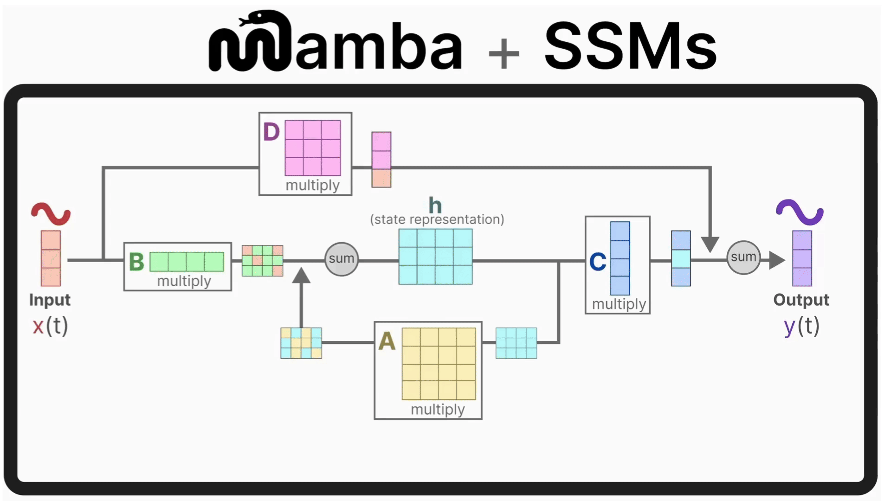

Mamba was proposed in the paper [Mamba: Linear-Time Sequence Modeling with Selective State Spaces](https://arxiv.org/abs/2312.00752).[1](https://newsletter.maartengrootendorst.com/p/a-visual-guide-to-mamba-and-state#footnote-1-141228095) You can find its official implementation and model checkpoints in its [repository](https://github.com/state-spaces/mamba).

*To see a **Table of Contents** (ToC), click on the stack of lines on the left-hand side.*

In this post, I will introduce the field of State Space Models in the context of language modeling and explore concepts one by one to develop an intuition about the field. Then, we will cover how Mamba might challenge the Transformers architecture.

In this visual guide, there are more than **50 custom visuals** to help you develop an intuition about Mamba and State Space Models!

To see more visualizations related to LLMs and to support this newsletter, check out the book I wrote on Large Language Models!

*P.S. If you read the book, a **[quick review](https://www.amazon.com/Hands-Large-Language-Models-Understanding/dp/1098150961)** would mean the world—it really helps us authors!*

## Part 1: **The Problem with Transformers**

To illustrate why Mamba is such an interesting architecture, let’s do a short re-cap of transformers first and explore one of its disadvantages.

A Transformer sees any textual input as a *sequence* that consists of *tokens*.

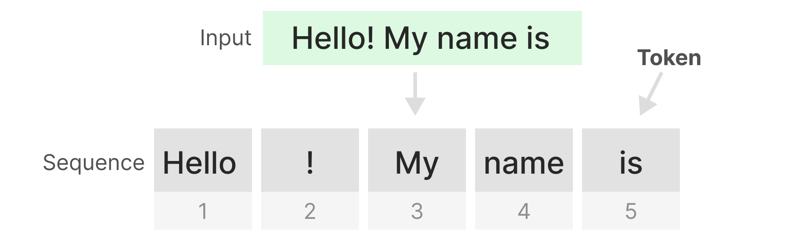

A major benefit of Transformers is that whatever input it receives, it can look back at any of the earlier tokens in the sequence to derive its representation.

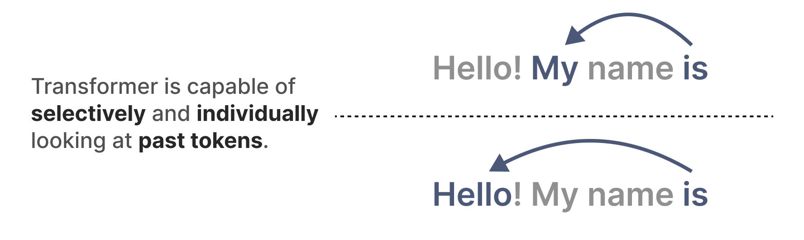

## The Core Components of Transformers

Remember that a Transformer consists of two structures, a set of encoder blocks for representing text and a set of decoder blocks for generating text. Together, these structures can be used for several tasks, including translation.

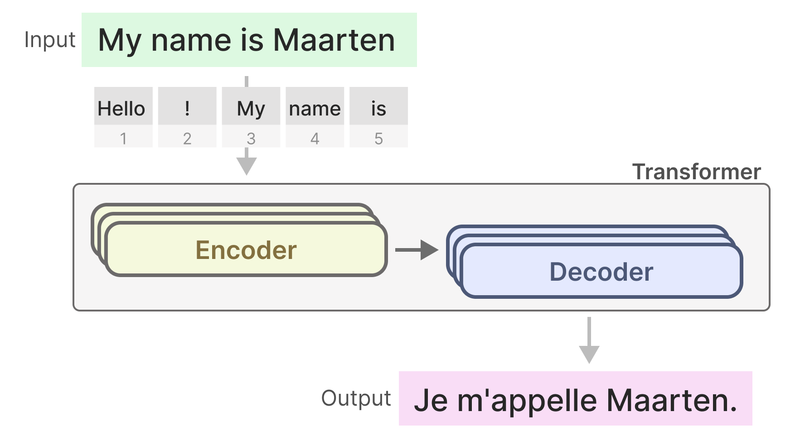

We can adopt this structure to create generative models by using only decoders. This Transformer-based model, *Generative Pre-trained Transformers* (GPT), uses decoder blocks to complete some input text.

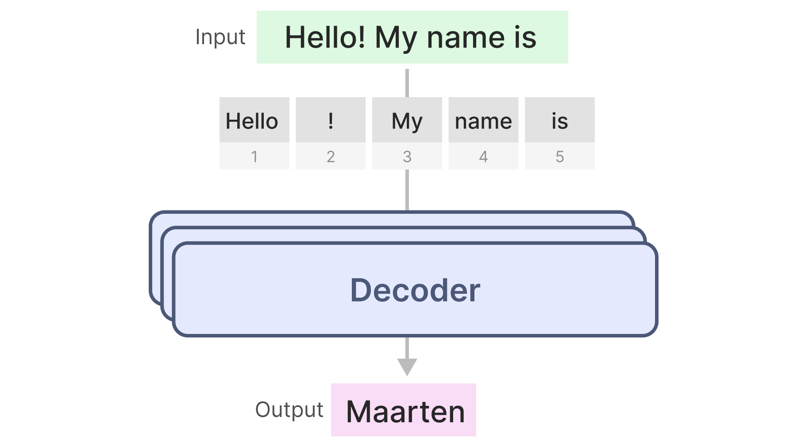

Let’s take a look at how that works!

## A Blessing with Training…

A single decoder block consists of two main components, masked self-attention followed by a feed-forward neural network.

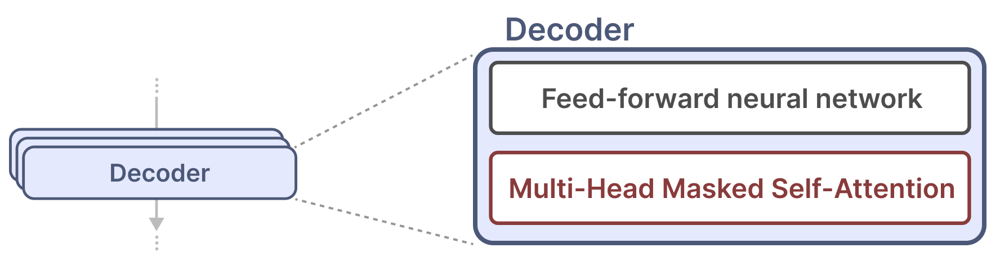

Self-attention is a major reason why these models work so well. It enables an uncompressed view of the entire sequence with fast training.

So how does it work?

It creates a matrix comparing each token with every token that came before. The weights in the matrix are determined by how relevant the token pairs are to one another.

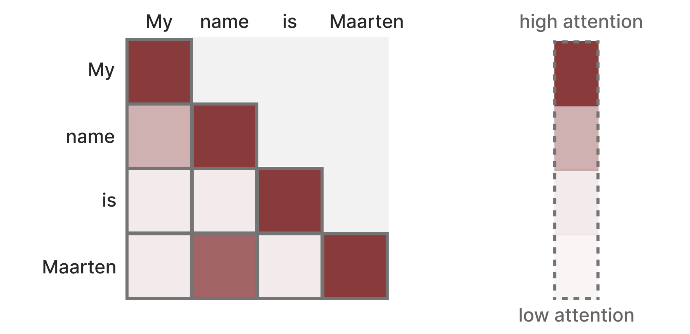

During training, this matrix is created in one go. The attention between “*My*” and “*name*” does not need to be calculated first before we calculate the attention between “*name*” and “*is*”.

It enables **parallelization**, which speeds up training tremendously!

## And the Curse with Inference!

There is a flaw, however. When generating the next token, we need to re-calculate the attention for the *entire sequence*, even if we already generated some tokens.

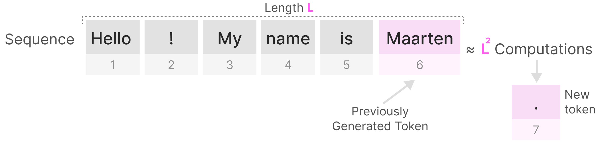

Generating tokens for a sequence of length *L* needs roughly *L²* computations which can be costly if the sequence length increases.

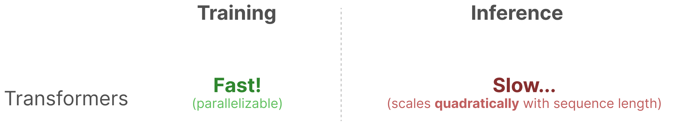

This need to recalculate the entire sequence is a major bottleneck of the Transformer architecture.

Let’s look at how a “classic” technique, Recurrent Neural Networks, solves this problem of slow inference.

## Are RNNs a Solution?

Recurrent Neural Networks (RNN) is a sequence-based network. It takes two inputs at each time step in a sequence, namely the input at time step ***t*** and a hidden state of the previous time step ***t-1***, to generate the next hidden state and predict the output.

RNNs have a looping mechanism that allows them to pass information from a previous step to the next. We can “unfold” this visualization to make it more explicit.

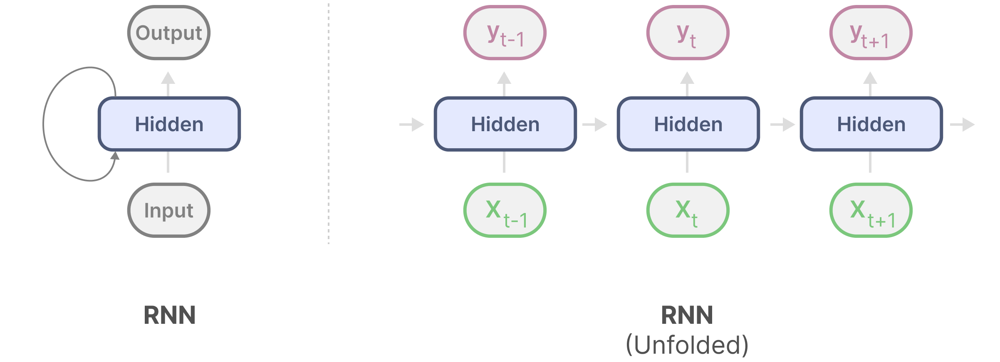

When generating the output, the RNN only needs to consider the previous hidden state and current input. It prevents recalculating all previous hidden states which is what a Transformer would do.

In other words, RNNs can do inference fast as it scales linearly with the sequence length! In theory, it can even have an *infinite context length*.

To illustrate, let’s apply the RNN to the input text we have used before.

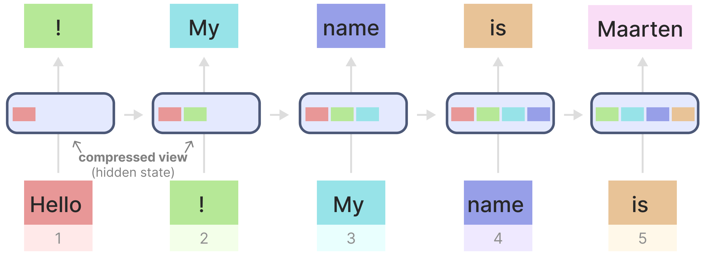

Each hidden state is the aggregation of all previous hidden states and is typically a compressed view.

There is a problem, however…

Notice that the last hidden state, when producing the name “*Maarten*” does not contain information about the word “*Hello*” anymore. RNNs tend to forget information over time since they only consider one previous state.

Although RNNs could be fast for both training and inference, they lacked the accuracy that the Transformer models could offer.

Instead, we look at State Space Models to efficiently use RNNs (and sometimes use convolutions).

## Part 2: The **State Space Model (SSM)**

A State Space Model (SSM), like the Transformer and RNN, processes sequences of information, like text but also signals. In this section, we will go through the basics of SSMs and how they relate to textual data.

## What is a State Space?

A State Space contains the minimum number of variables that fully describe a system. It is a way to mathematically represent a problem by defining a system's possible states.

Let’s simplify this a bit. Imagine we are navigating through a maze. The “*state space*” is the map of all possible locations (states). Each point represents a unique position in the maze with specific details, like how far you are from the exit.

The “*state space representation*” is a simplified description of this map. It shows where you are (current state), where you can go next (possible future states), and what changes take you to the next state (going right or left).

Although State Space Models use equations and matrices to track this behavior, it is simply a way to track where you are, where you can go, and how you can get there.

The variables that describe a state, in our example the X and Y coordinates, as well as the distance to the exit, can be represented as “*state vectors*”.

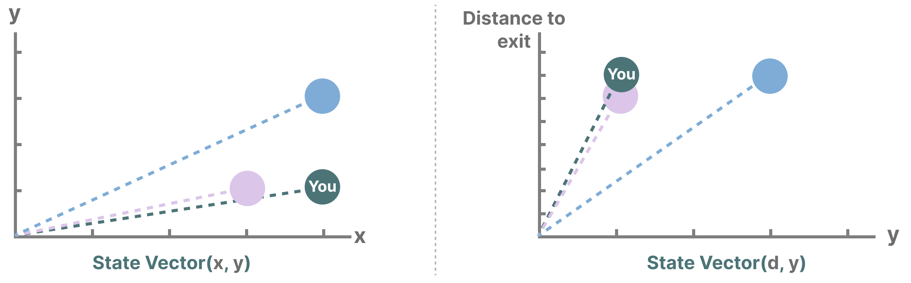

Sounds familiar? That is because embeddings or vectors in language models are also frequently used to describe the “state” of an input sequence. For instance, a vector of your current position (state vector) could look a bit like this:

In terms of neural networks, the “state” of a system is typically its hidden state and in the context of Large Language Models, one of the most important aspects of generating a new token.

## What is a State Space Model?

SSMs are models used to describe these state representations and make predictions of what their next state could be depending on some input.

Traditionally, at time ***t***, SSMs:

However, instead of using *discrete* *sequences* (like moving left once) it takes as input a *continuous* *sequence* and predicts the output sequence.

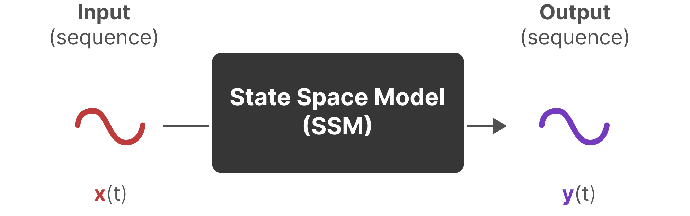

SSMs assume that dynamic systems, such as an object moving in 3D space, can be predicted from its state at time ***t*** through two equations.

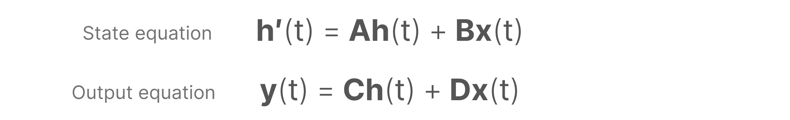

By solving these equations, we assume that we can uncover the statistical principles to predict the state of a system based on observed data (input sequence and previous state).

Its goal is to find this state representation ***h(t)*** such that we can go from an input to an output sequence.

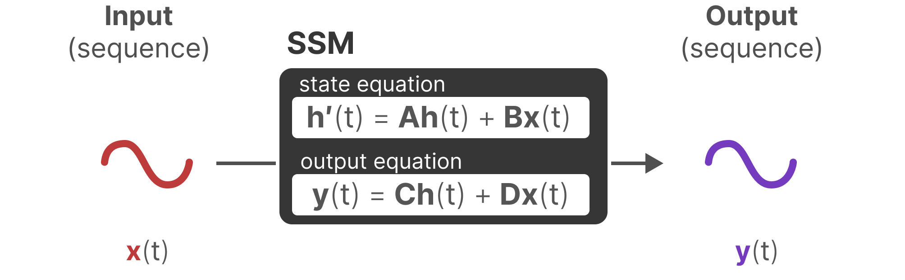

These two equations are the core of the State Space Model.

The two equations will be referenced throughout this guide. To make them a bit more intuitive, they are **color-coded** so you can quickly reference them.

The **state equation** describes how the state changes (through *matrix A*) based on how the input influences the state (through *matrix B*).

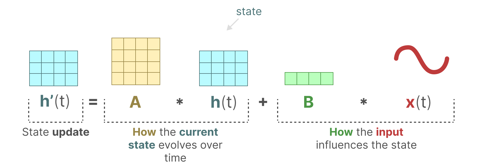

As we saw before, ***h(t)*** refers to our latent state representation at any given time ***t***, and ***x(t)*** refers to some input.

The **output equation** describes how the state is translated to the output (through *matrix C*) and how the input influences the output (through *matrix D*).

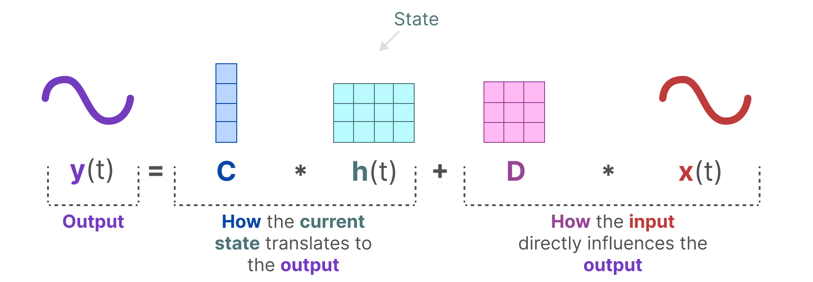

> **NOTE**: Matrices *A*, *B*, *C*, and *D* are also commonly refered to as *parameters* since they are learnable.

Visualizing these two equations gives us the following architecture:

Let’s go through the general technique step-by-step to understand how these matrices influence the learning process.

Assume we have some input signal ***x(t)***, this signal first gets multiplied by *matrix B* which describes how the inputs influence the system.

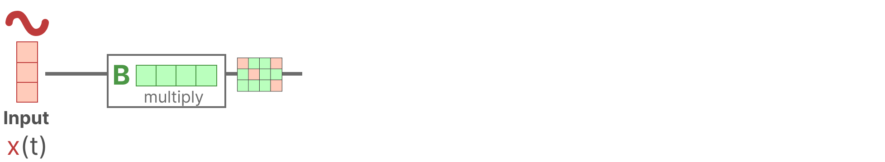

The updated state (akin to the hidden state of a neural network) is a latent space that contains the core “knowledge” of the environment. We multiply the state with *matrix A* which describes how all the internal states are connected as they represent the underlying dynamics of the system.

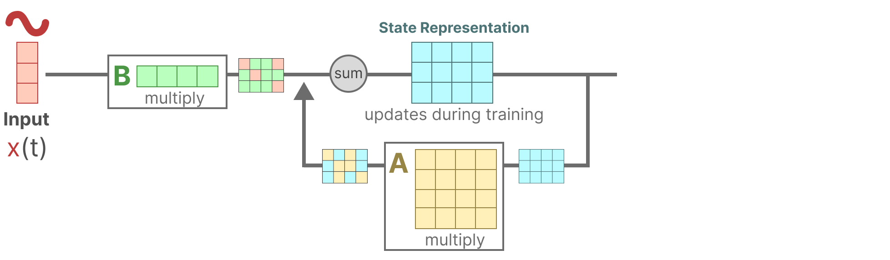

As you might have noticed, *matrix A* is applied before creating the state representations and is updated after the state representation has been updated.

Then, we use *matrix C* to describe how the state can be translated to an output.

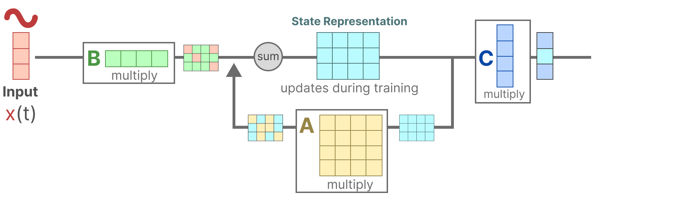

Finally, we can make use of *matrix D* to provide a direct signal from the input to the output. This is also often referred to as a *skip-connection*.

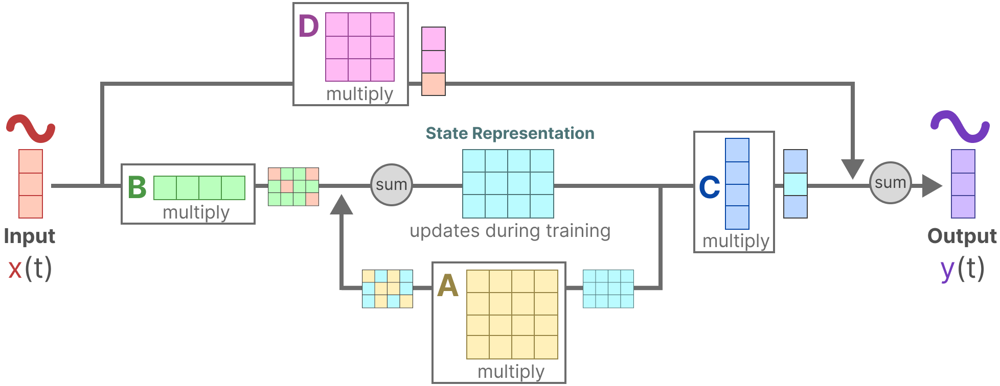

Since *matrix D* is similar to a skip-connection, the SSM is often regarded as the following without the skip-connection.

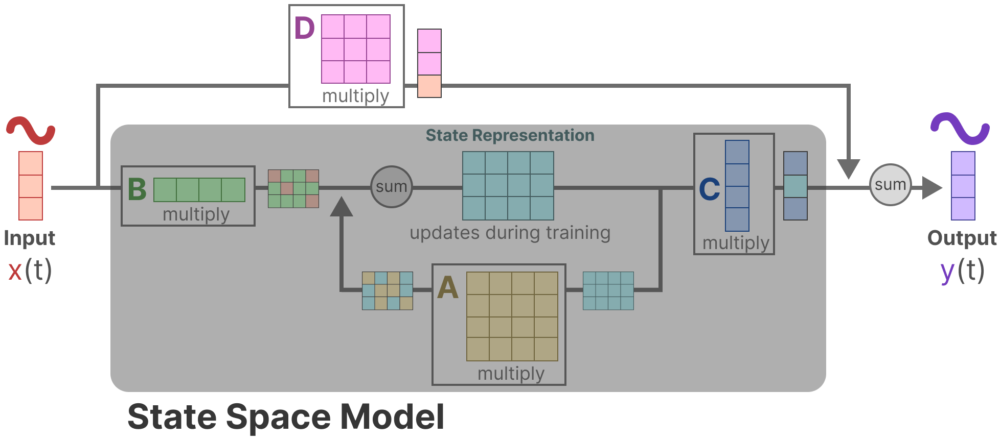

We can also go through each step in more detail:

Going back to our simplified perspective, we can now focus on matrices *A*, *B*, and *C* as the core of the SSM.

Which can be shown as:

We can update the original equations (and add some pretty colors) to signify the purpose of each matrix as we did before.

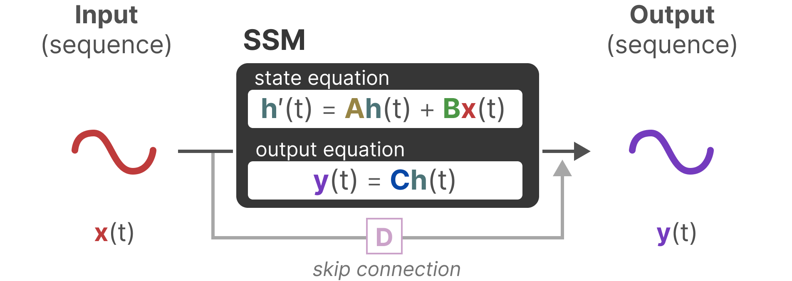

Together, these two equations aim to predict the state of a system from observed data. Since the input is expected to be continuous, the main representation of the SSM is a **continuous-time representation**.

## From a Continuous to a Discrete Signal

Finding the state representation ***h(t)*** is analytically challenging if you have a continuous signal. Moreover, since we generally have a discrete input (like a textual sequence), we want to discretize the model.

To do so, we make use of the *Zero-order hold technique.* It works as follows. First, every time we receive a discrete signal, we hold its value until we receive a new discrete signal. This process creates a continuous signal the SSM can use:

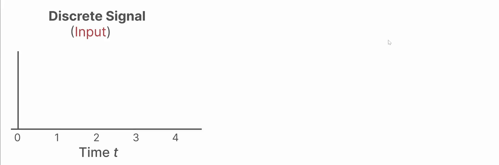

How long we hold the value is represented by a new learnable parameter, called the *step size* **∆**. It represents the resolution of the input.

Now that we have a continuous signal for our input, we can generate a continuous output and only sample the values according to the time steps of the input.

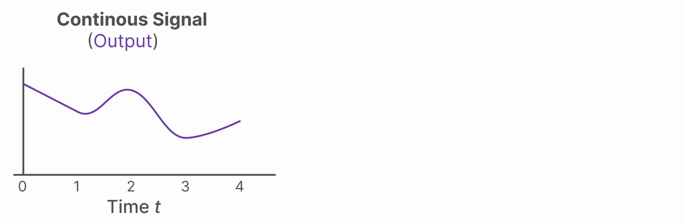

These sampled values are our discretized output!

Mathematically, we can apply the Zero-order hold as follows:

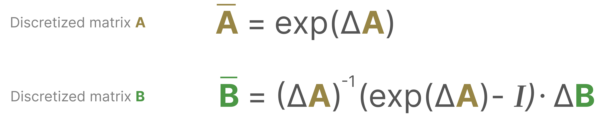

Together, they allow us to go from a continuous SSM to a discrete SSM represented by a formulation that instead of a *function-to-function*, ***x(t)*** → ***y(t)***, is now a *sequence-to-sequence, **x*****ₖ** → ***y*****ₖ**:

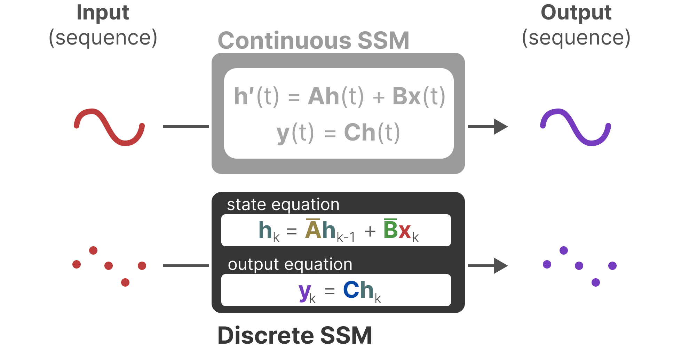

Here, matrices *A* and *B* now represent discretized parameters of the model.

We use ***k*** instead of ***t*** to represent discretized timesteps and to make it a bit more clear when we refer to a continuous versus a discrete SSM.

> **NOTE:** We are still saving the continuous form of *Matrix A* and not the discretized version during training. During training, the continuous representation is discretized.

Now that we have a formulation of a discrete representation, let’s explore how we can actually *compute* the model.

## The Recurrent Representation

Our discretized SSM allows us to formulate the problem in specific timesteps instead of continuous signals. A recurrent approach, as we saw before with RNNs is quite useful here.

If we consider discrete timesteps instead of a continuous signal, we can reformulate the problem with timesteps:

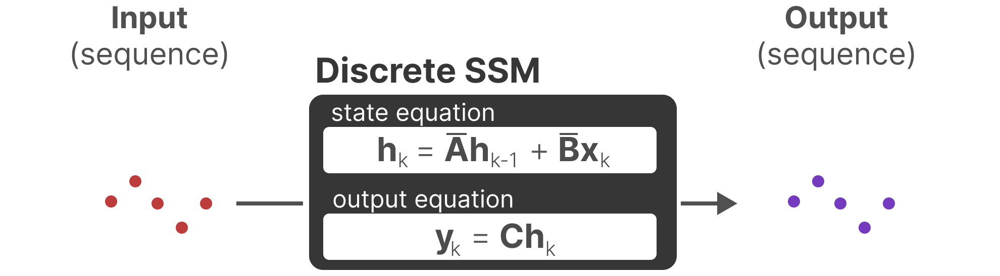

At each timestep, we calculate how the current input (***Bx*****ₖ**) influences the previous state (**Ahₖ₋₁**) and then calculate the predicted output (***Ch*****ₖ**).

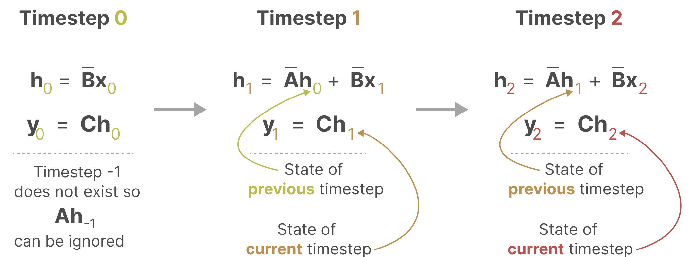

This representation might already seem a bit familiar! We can approach it the same way we did with the RNN as we saw before.

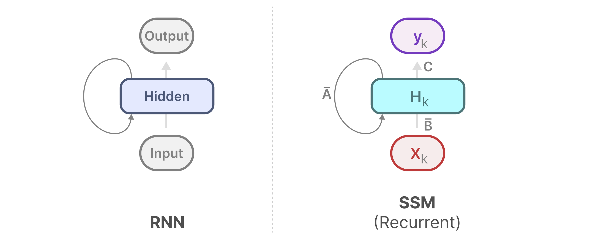

Which we can unfold (or unroll) as such:

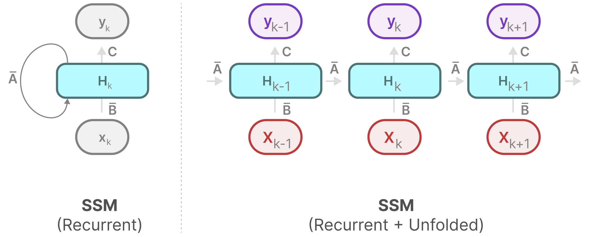

Notice how we can use this discretized version using the underlying methodology of an RNN.

## The Convolution Representation

Another representation that we can use for SSMs is that of convolutions. Remember from classic image recognition tasks where we applied filters (*kernels*) to derive aggregate features:

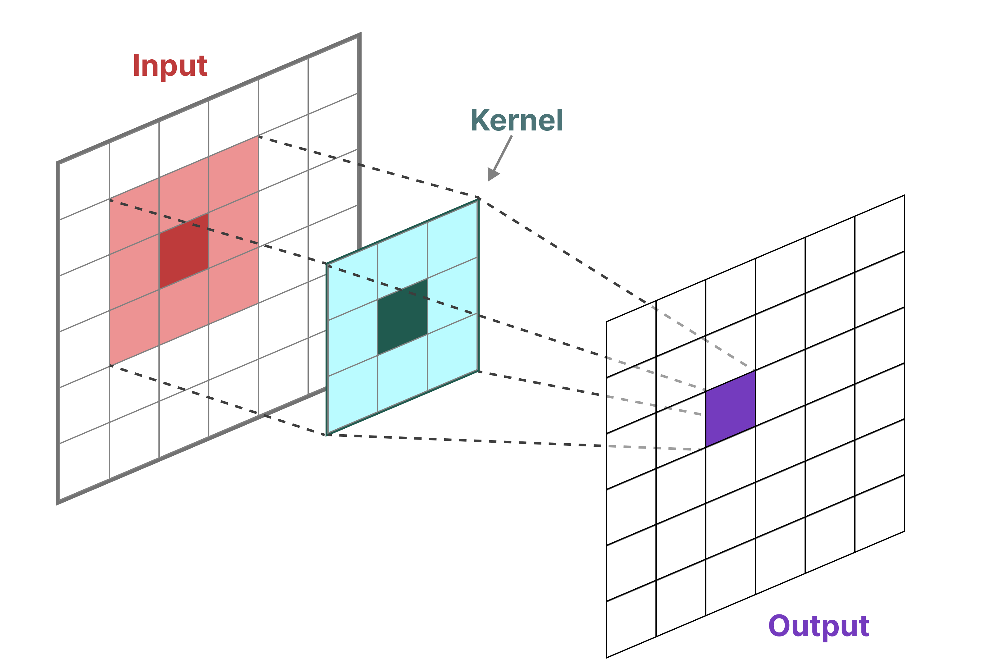

Since we are dealing with text and not images, we need a 1-dimensional perspective instead:

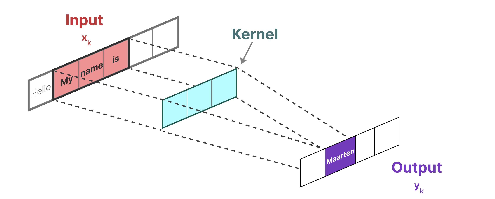

Using techniques from a different field makes for an interesting pipeline:

The kernel that we use to represent this “filter” is derived from the SSM formulation:

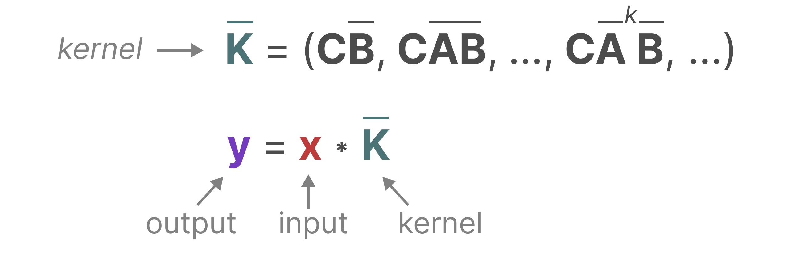

Let’s explore how this kernel works in practice. Like convolution, we can use our SSM kernel to go over each set of tokens and calculate the output:

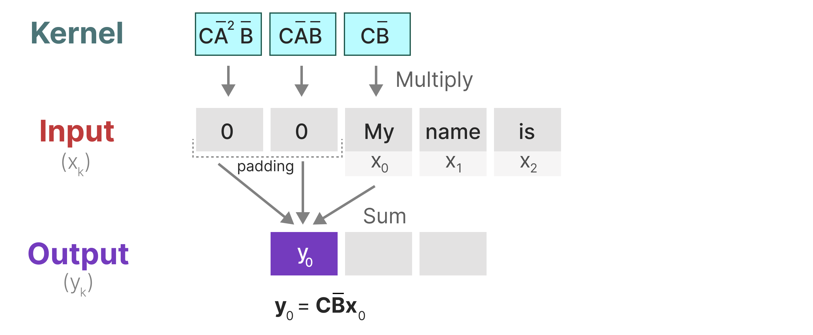

This also illustrates the effect padding might have on the output. I changed the order of padding to improve the visualization but we often apply it at the end of a sentence.

In the next step, the kernel is moved once over to perform the next step in the calculation:

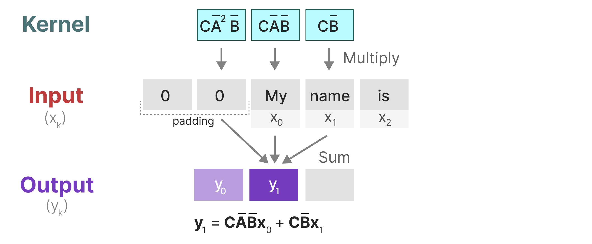

In the final step, we can see the full effect of the kernel:

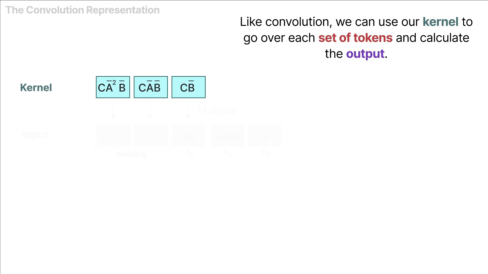

A major benefit of representing the SSM as a convolution is that it can be trained in parallel like Convolutional Neural Networks (CNNs). However, due to the fixed kernel size, their inference is not as fast and unbounded as RNNs.

## The Three Representations

These three representations, *continuous*, *recurrent*, and *convolutional* all have different sets of advantages and disadvantages:

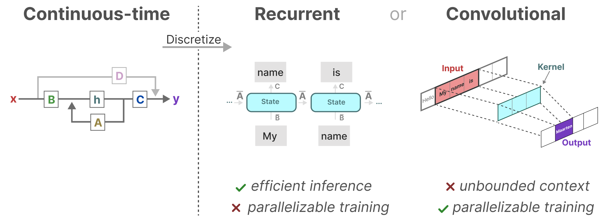

Interestingly, we now have efficient inference with the recurrent SSM and parallelizable training with the convolutional SSM.

With these representations, there is a neat trick that we can use, namely choose a representation depending on the task. During training, we use the convolutional representation which can be parallelized and during inference, we use the efficient recurrent representation:

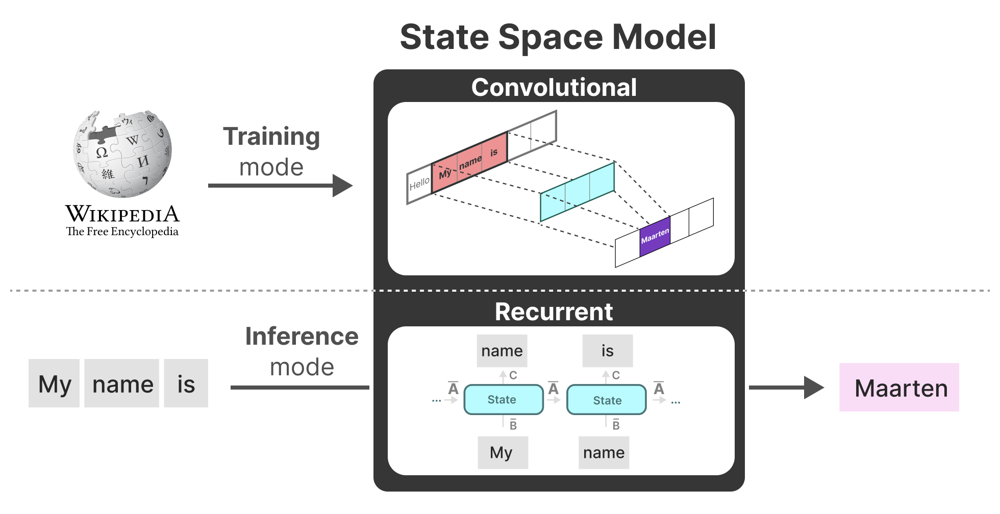

This model is referred to as the [Linear State-Space Layer (LSSL)](https://proceedings.neurips.cc/paper_files/paper/2021/hash/05546b0e38ab9175cd905eebcc6ebb76-Abstract.html).[2](https://newsletter.maartengrootendorst.com/p/a-visual-guide-to-mamba-and-state#footnote-2-141228095)

These representations share an important property, namely that of ***Linear Time Invariance*** (LTI). LTI states that the SSMs parameters, *A*, *B*, and *C*, are fixed for all timesteps. This means that matrices *A*, *B*, and *C* are the same for every token the SSM generates.

In other words, regardless of what sequence you give the SSM, the values of *A*, *B*, and *C* remain the same. We have a static representation that is not content-aware.

Before we explore how Mamba addresses this issue, let’s explore the final piece of the puzzle, *matrix A*.

## The Importance of Matrix *A*

Arguably one of the most important aspects of the SSM formulation is *matrix A*. As we saw before with the recurrent representation, it captures information about the *previous* state to build the *new* state.

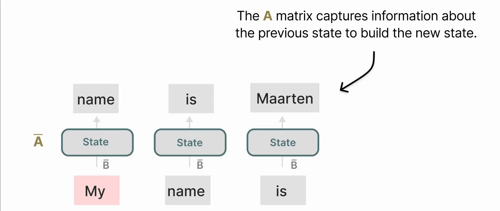

In essence, *matrix* *A* produces the hidden state:

Creating *matrix A* can therefore be the difference between remembering only a few previous tokens and capturing every token we have seen thus far. Especially in the context of the Recurrent representation since it only *looks back* *at the previous state*.

So how can we create *matrix A* in a way that retains a large memory (context size)?

We use Hungry Hungry Hippo! Or [HiPPO](https://proceedings.neurips.cc/paper/2020/hash/102f0bb6efb3a6128a3c750dd16729be-Abstract.html)[3](https://newsletter.maartengrootendorst.com/p/a-visual-guide-to-mamba-and-state#footnote-3-141228095) for **Hi**gh-order **P**olynomial **P**rojection **O**perators.

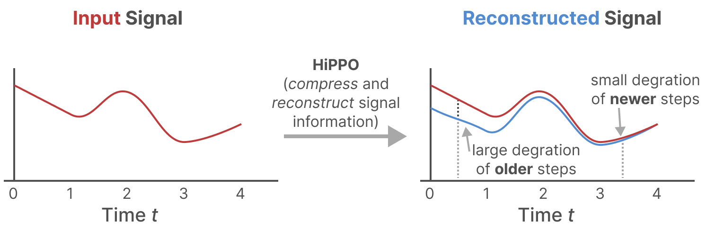

HiPPO attempts to compress all input signals it has seen thus far into a vector of coefficients.

It uses *matrix A* to build a state representation that captures recent tokens well and decays older tokens. Its formula can be represented as follows:

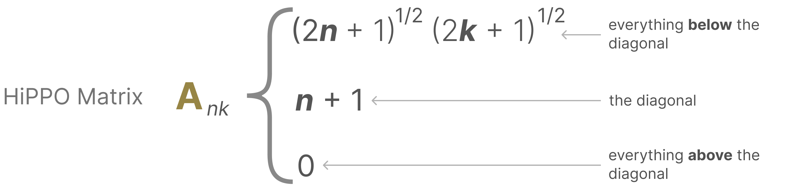

Assuming we have a square *matrix A*, this gives us:

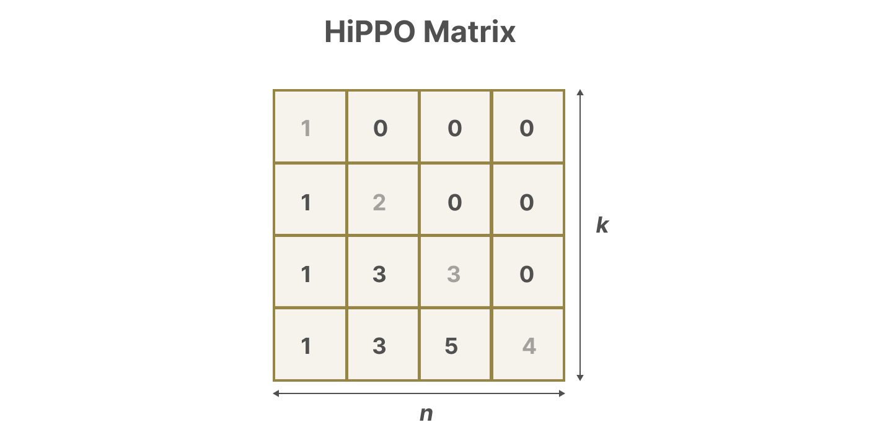

Building *matrix A* using HiPPO was shown to be much better than initializing it as a random matrix. As a result, it more accurately reconstructs *newer* signals (recent tokens) compared to *older* signals (initial tokens).

The idea behind the HiPPO Matrix is that it produces a hidden state that memorizes its history.

Mathematically, it does so by tracking the coefficients of a [Legendre polynomial](https://proceedings.neurips.cc/paper/2019/hash/952285b9b7e7a1be5aa7849f32ffff05-Abstract.html) which allows it to approximate all of the previous history.[4](https://newsletter.maartengrootendorst.com/p/a-visual-guide-to-mamba-and-state#footnote-4-141228095)

HiPPO was then applied to the recurrent and convolution representations that we saw before to handle long-range dependencies. The result was [Structured State Space for Sequences (S4)](https://arxiv.org/abs/2111.00396), a class of SSMs that can efficiently handle long sequences.[5](https://newsletter.maartengrootendorst.com/p/a-visual-guide-to-mamba-and-state#footnote-5-141228095)

It consists of three parts:

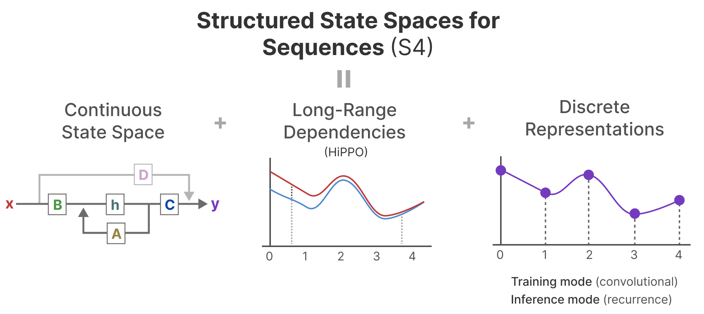

This class of SSMs has several benefits depending on the representation you choose (recurrent vs. convolution). It can also handle long sequences of text and store memory efficiently by building upon the HiPPO matrix.

> **NOTE**: If you want to dive into more of the technical details on how to calculate the HiPPO matrix and build a S4 model yourself, I would HIGHLY advise going through the [Annotated S4](https://srush.github.io/annotated-s4/).

## Part 3: **Mamba - A Selective SSM**

We finally have covered all the fundamentals necessary to understand what makes Mamba special. State Space Models can be used to model textual sequences but still have a set of disadvantages we want to prevent.

In this section, we will go through Mamba’s two main contributions:

1.  A **selective scan algorithm**, which allows the model to filter (ir)relevant information

2.  A **hardware-aware algorithm** that allows for efficient storage of (intermediate) results through *parallel scan*, *kernel fusion*, and *recomputation*.

Together they create the *selective SSM* or *S6* models which can be used, like self-attention, to create *Mamba blocks*.

Before exploring the two main contributions, let’s first explore why they are necessary.

## What Problem does it attempt to Solve?

State Space Models, and even the S4 (Structured State Space Model), perform poorly on certain tasks that are vital in language modeling and generation, namely *the ability to focus on or ignore particular inputs*.

We can illustrate this with two synthetic tasks, namely **selective copying** and **induction heads**.

In the **selective copying** task, the goal of the SSM is to copy parts of the input and output them in order:

However, a (recurrent/convolutional) SSM performs poorly in this task since it is ***Linear Time Invariant*****.** As we saw before, the matrices *A*, *B*, and *C* are the same for every token the SSM generates.

As a result, an SSM cannot perform *content-aware reasoning* since it treats each token equally as a result of the fixed A, B, and C matrices. This is a problem as we want the SSM to reason about the input (prompt).

The second task an SSM performs poorly on is **induction heads** where the goal is to reproduce patterns found in the input:

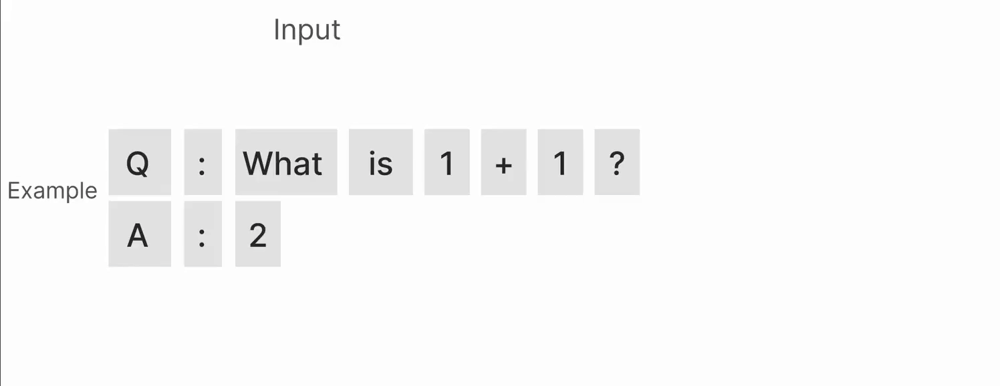

In the above example, we are essentially performing one-shot prompting where we attempt to “teach” the model to provide an “***A:***” response after every “***Q:***”. However, since SSMs are time-invariant it cannot select which previous tokens to recall from its history.

Let’s illustrate this by focusing on *matrix B*. Regardless of what the input ***x*** is, *matrix B* remains exactly the same and is therefore independent of ***x***:

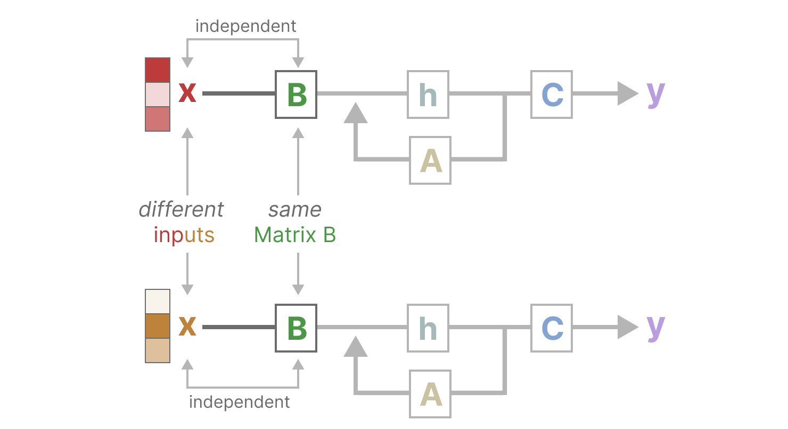

Likewise, *A* and *C* also remain fixed regardless of the input. This demonstrates the *static* nature of the SSMs we have seen thus far.

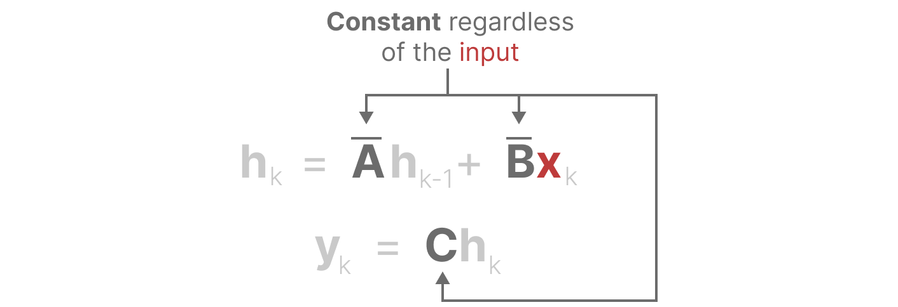

In comparison, these tasks are relatively easy for Transformers since they *dynamically* change their attention based on the input sequence. They can selectively “look” or “attend” at different parts of the sequence.

The poor performance of SSMs on these tasks illustrates the underlying problem with time-invariant SSMs, the static nature of matrices *A*, *B*, and *C* results in problems with *content-awareness*.

## Selectively Retain Information

The recurrent representation of an SSM creates a small state that is quite efficient as it compresses the entire history. However, compared to a Transformer model which does no compression of the history (through the attention matrix), it is much less powerful.

Mamba aims to have the best of both worlds. A small state that is as powerful as the state of a Transformer:

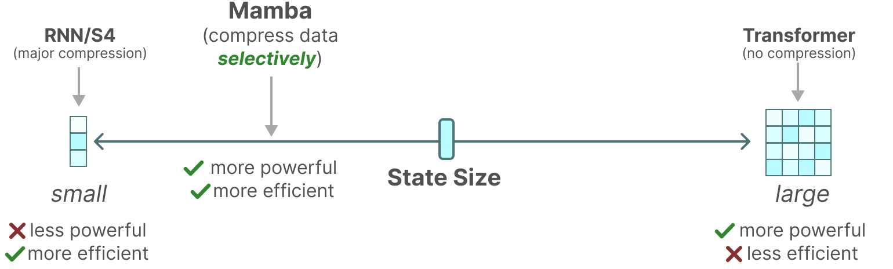

As teased above, it does so by compressing data selectively into the state. When you have an input sentence, there is often information, like stop words, that does not have much meaning.

To selectively compress information, we need the parameters to be dependent on the input. To do so, let’s first explore the dimensions of the input and output in an SSM during training:

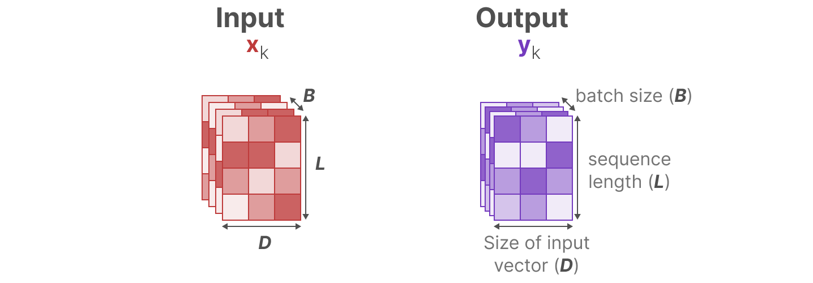

In a Structured State Space Model (S4), the matrices *A*, *B*, and *C* are independent of the input since their dimensions ***N*** and ***D*** are static and do not change.

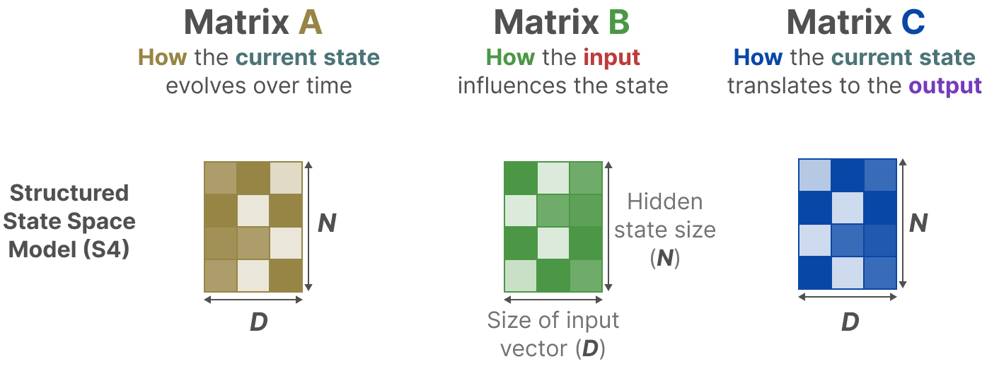

Instead, Mamba makes matrices *B* and *C,* and even the *step size* **∆***,* dependent on the input by incorporating the sequence length and batch size of the input:

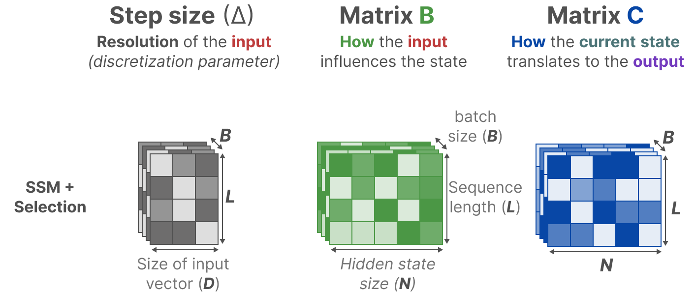

This means that for every input token, we now have different *B* and *C* matrices which solves the problem with content-awareness!

> **NOTE**: Matrix *A* remains the same since we want the state itself to remain static but the way it is influenced (through *B* and *C*) to be dynamic.

Together, they *selectively* choose what to keep in the hidden state and what to ignore since they are now dependent on the input.

A smaller *step size* **∆** results in ignoring specific words and instead using the previous context more whilst a larger *step size* **∆** focuses on the input words more than the context:

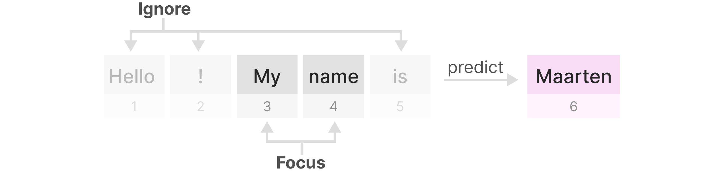

## The Scan Operation

Since these matrices are now *dynamic*, they cannot be calculated using the convolution representation since it assumes a *fixed* kernel. We can only use the recurrent representation and lose the parallelization the convolution provides.

To enable parallelization, let’s explore how we compute the output with recurrence:

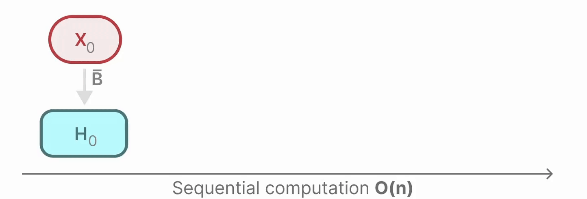

Each state is the sum of the previous state (multiplied by *A*) plus the current input (multiplied by *B*). This is called a *scan operation* and can easily be calculated with a for loop.

Parallelization, in contrast, seems impossible since each state can only be calculated if we have the previous state. Mamba, however, makes this possible through the *[parallel scan](https://developer.nvidia.com/gpugems/gpugems3/part-vi-gpu-computing/chapter-39-parallel-prefix-sum-scan-cuda)* algorithm.

It assumes the order in which we do operations does not matter through the associate property. As a result, we can calculate the sequences in parts and iteratively combine them:

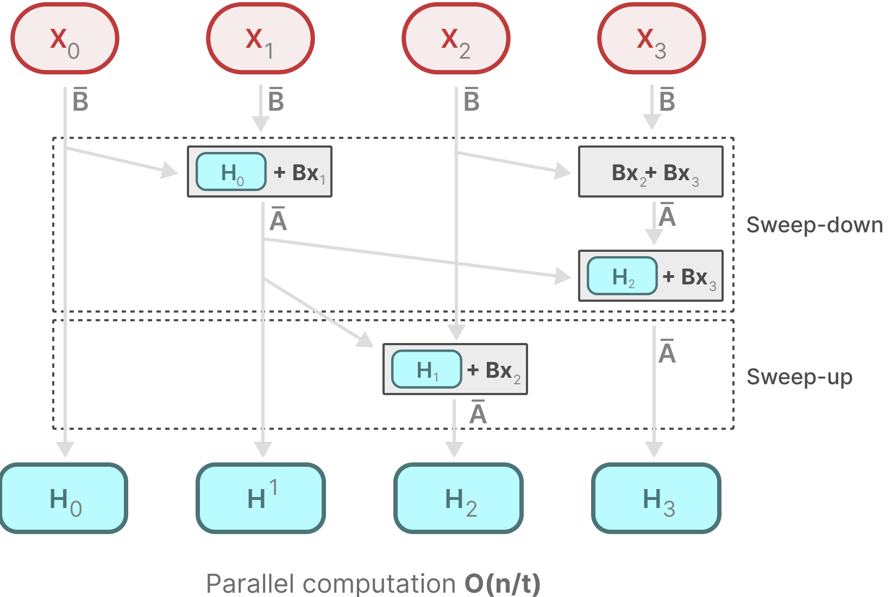

Together, dynamic matrices *B* and *C*, and the parallel scan algorithm create the ***selective scan algorithm*** to represent the dynamic and fast nature of using the recurrent representation.

## Hardware-aware Algorithm

A disadvantage of recent GPUs is their limited transfer (IO) speed between their small but highly efficient SRAM and their large but slightly less efficient DRAM. Frequently copying information between SRAM and DRAM becomes a bottleneck.

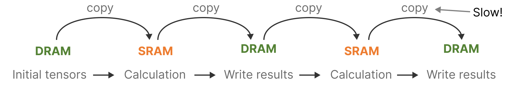

Mamba, like Flash Attention, attempts to limit the number of times we need to go from DRAM to SRAM and vice versa. It does so through *kernel fusion* which allows the model to prevent writing intermediate results and continuously performing computations until it is done.

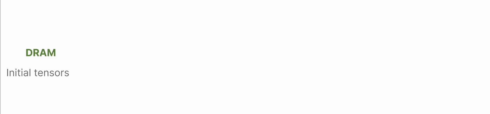

We can view the specific instances of DRAM and SRAM allocation by visualizing Mamba’s base architecture:

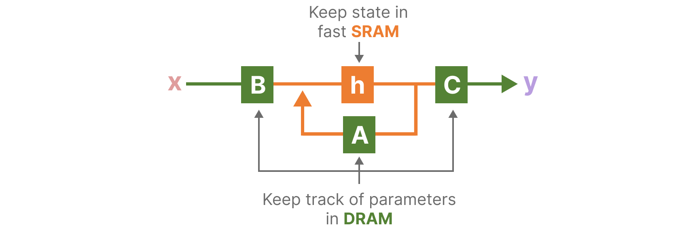

Here, the following are fused into one kernel:

The last piece of the hardware-aware algorithm is *recomputation*.

The intermediate states are not saved but are necessary for the backward pass to compute the gradients. Instead, the authors recompute those intermediate states *during* the backward pass.

Although this might seem inefficient, it is much less costly than reading all those intermediate states from the relatively slow DRAM.

We have now covered all components of its architecture which is depicted using the following image from its article:

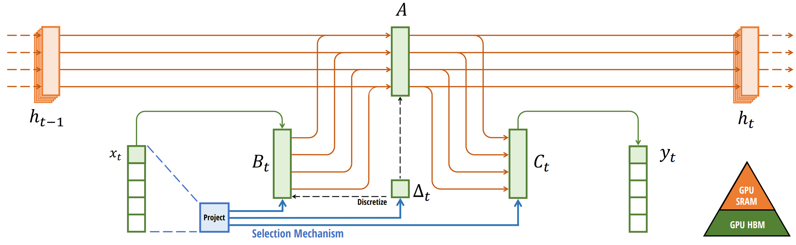

**The Selective SSM.** Retrieved from: Gu, Albert, and Tri Dao. "Mamba: Linear-time sequence modeling with selective state spaces." *arXiv preprint arXiv:2312.00752* (2023).

This architecture is often referred to as a ***selective SSM*** or ***S6*** model since it is essentially an S4 model computed with the selective scan algorithm.

## The Mamba Block

The *selective SSM* that we have explored thus far can be implemented as a block, the same way we can represent self-attention in a decoder block.

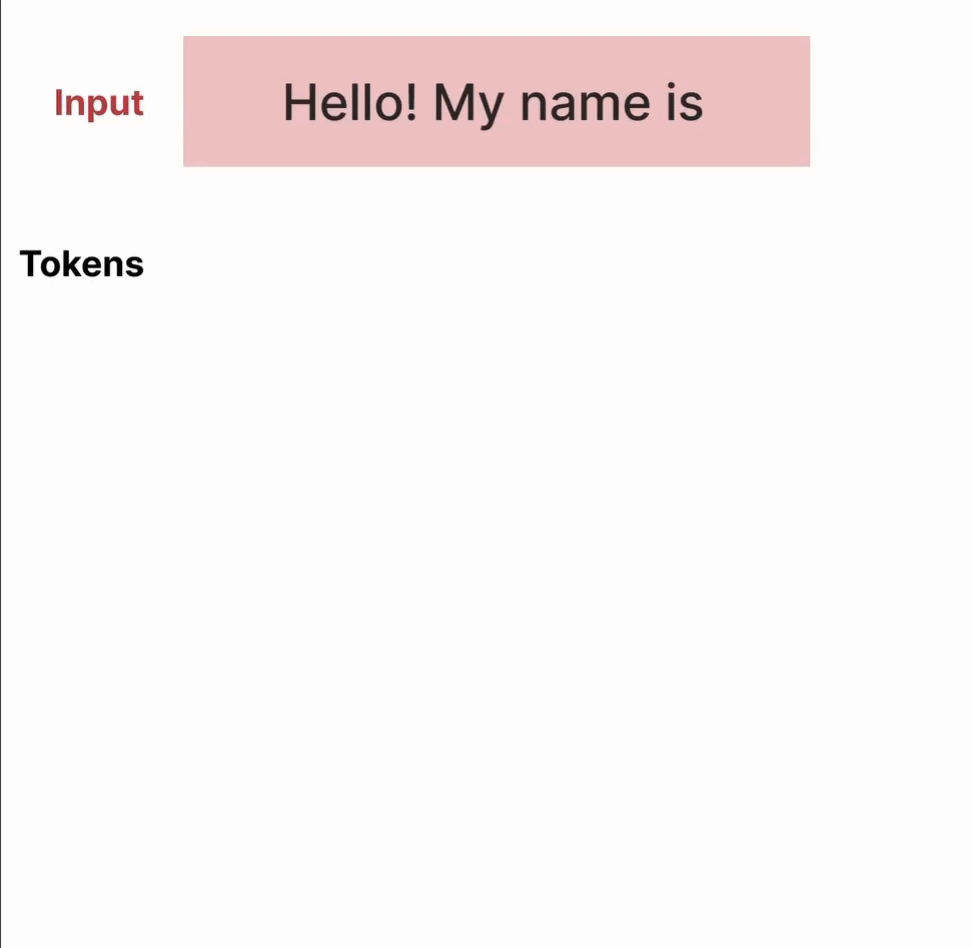

Like the decoder, we can stack multiple Mamba blocks and use their output as the input for the next Mamba block:

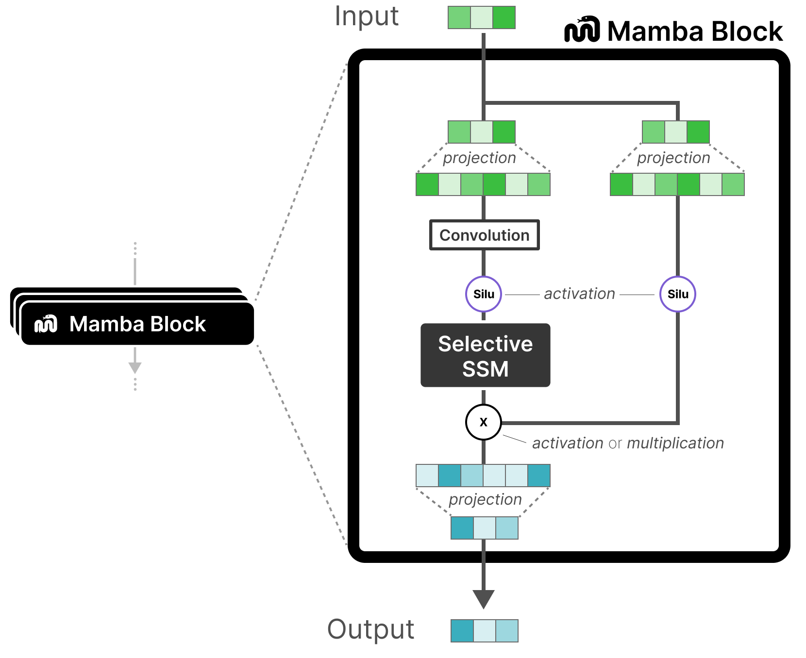

It starts with a linear projection to expand upon the input embeddings. Then, a convolution before the *Selective SSM* is applied to prevent independent token calculations.

The *Selective SSM* has the following properties:

We can expand on this architecture a bit more when looking at the code implementation and explore how an end-to-end example would look like:

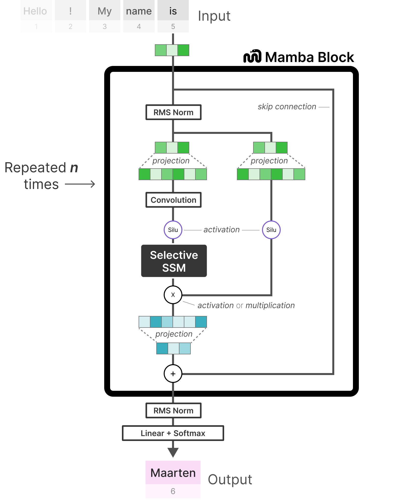

Notice some changes, like the inclusion of normalization layers and softmax for choosing the output token.

When we put everything together, we get both fast inference and training and even unbounded context. Using this architecture, the authors found it matches and sometimes even exceeds the performance of Transformer models of the same size!

## **Conclusion**

This concludes our journey in State Space Models and the incredible Mamba architecture using a selective State Space Model. Hopefully, this post gives you a better understanding of the potential of State Space Models, particularly Mamba. Who knows if this is going to replace the Transformers but for now, it is incredible to see such different architectures getting well-deserved attention!

To see more visualizations related to LLMs and to support this newsletter, check out the book I wrote together with Jay Alammar.

## Resources

Hopefully, this was an accessible introduction to Mamba and State Space Models. If you want to go deeper, I would suggest the following resources:
