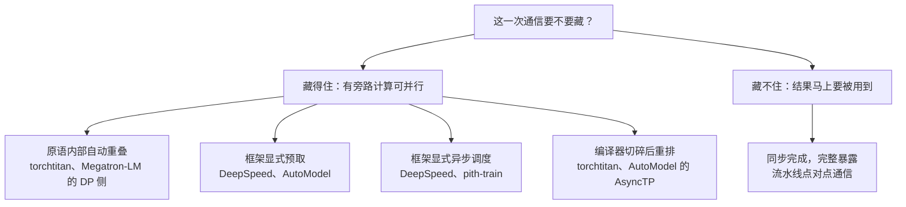

# 同一个设计问题，五种工程答案：Megatron-LM、DeepSpeed、torchtitan、AutoModel、pith-train 的逐方法横向调研

**检索与复核日期：2026 年 9 月 17 日。**

训练框架的横向对比通常写成一张功能矩阵：谁支持 ZeRO-3、谁有 DualPipe、谁默认开 FP8。这张矩阵回答不了选型问题，因为**同一个功能名在不同框架里往往不是同一种东西**。DeepSpeed 的 ZeRO-3 参数预取深度是硬编码的，AutoModel 的预取是一条可开关的链；Megatron-LM 的 batch 不变性由六条 assert 约束住，torchtitan 的 batch 不变性由十项 NCCL 环境变量换回来。名字相同，代价不同。

所以这篇文章换一种组织方式：**不问「谁有什么」，而问「同一个设计问题，各家选了哪条路，在这条路上具体怎么跑」。**

全文沿十个基本设计决策展开。每一个决策先归纳出若干种真实存在的方法，把五个框架归入这些方法，然后**逐一进入每个方法，写清采用它的框架各自的执行路径，并指出同一条路上的分岔与代价**。读者读完一个维度，应该能回答四个连续的问题：这个问题有哪些做法？哪些框架用哪种做法？同一种做法在各框架里具体怎样运行？它们在什么条件下差别才会显现？

路线是：

1. **先把账算出来**：单卡为什么装不下，以及「切」与「缝」的代价记在显存、通信、算力这三只角上（§动机）；
2. **交代样本与口径**：五个框架不是同一种东西，比较深度因此天然不同（§比较对象）；
3. **逐维度横向拆解**：每个维度先给方法分类表，再按方法逐个框架写实现，最后收拢同方法内的分岔（§维度 1 到 §维度 10）；
4. **收敛到判断**：哪些耦合是硬的、五个框架各自的取舍是什么、三组可以直接拿去用的选型判断（§跨维度关系与设计启示）。

数学只出现在解释机制与权衡的地方，且全部标明假设与单位。所有的通信量、显存、气泡、重算数字都是**推导值**，不是实测值；凡属项目自述的性能数字，文中一律标注为「文档声称」。

## 动机与共同系统问题

### 从单卡的崩溃点开始

先看一个最朴素的训练循环。它做的事情少得可怜：取一个 batch，前向算 loss，反向算梯度，优化器更新参数，梯度清零。

```python
for batch in dataloader:
    loss = model(**batch)         # 前向：产生激活值
    loss.backward()               # 反向：产生梯度
    optimizer.step()              # 更新：读写参数与优化器状态
    optimizer.zero_grad()         # 清零
```

这段代码里每一个环节都在往显存里放东西，而放进去的东西**寿命不同**：

- 前向产生的**激活值**要留到反向对应位置算完才能释放，寿命是「整个前反向」；
- **梯度**在所有 microbatch 累加完之后才用得上，寿命是「整个迭代」；
- **参数**与**优化器状态**跨迭代存活，寿命是「整个训练」。

寿命不同，字节数也不同。在 AdamW 加混合精度的常规配置下，**每个参数的静态开销是 16 字节**：

| 缓冲 | 精度 | 字节/参数 | 为什么是这个精度 |
| --- | --- | --- | --- |
| 前向/反向用的参数 | bf16 | 2 | 矩阵乘的输入精度 |
| 梯度 | bf16 | 2 | 反向的输出精度 |
| 主参数副本 | fp32 | 4 | 更新必须发生在高精度上，否则小更新会被舍掉 |
| Adam 一阶矩 \(m\) | fp32 | 4 | 与参数同步长，需要用高精度累积 |
| Adam 二阶矩 \(v\) | fp32 | 4 | 同上 |

这笔账立刻给出规模上的分界线。一个 7B 模型的光静态状态就是 \(7\times10^9 \times 16\ \mathrm{B} = 104.3\ \mathrm{GiB}\)，装不进一张 80 GB 的卡。一个 671B 模型是 **9.8 TiB**，连切到 64 张卡都还是每卡 156 GiB。

**单卡装不下，是全文唯一的出发点。** 其余所有机制都是它的推论：把状态与计算摊到多张卡上（切），再用通信与算力把切口缝起来（缝）。切与缝都要付账，而账记在三个地方：**显存、通信、算力**。这三者构成一个不可能同时优化的三角，每个框架的设计差异，最后都可以还原成「它把哪只角让给了另外两只」。

账算到这里，可以问出全文要回答的那个问题了。

> **把同一个模型摊到多张卡上，是免费的午餐吗？显存确实降下来了，但多出来的通信、气泡、重算与精度折损，分别由谁买单？更关键的是：同一笔账，这五个框架各自是怎么记的，为什么同一句「支持 ZeRO-3」在不同框架里指向不同的代价？**

这个问题之所以不能更早提出，是因为在不知道 16 B/param 由哪五样东西构成、不知道「切开的参数要取回」与「取回后丢不丢」是两个独立决定之前，「谁买单」只是一句修辞。而后面十个维度，本质上都在回答它的不同侧面：维度 2 回答「显存省了多少」，维度 3 回答「通信由谁付、藏在哪」，维度 4 回答「气泡有多大」，维度 5 回答「算力换显存的汇率」，维度 6 与维度 10 回答「精度与可复现折损记在谁头上」。

### 五个框架不是同一种东西

本文比较五个在大模型训练中实际被用作训练框架、且本地有可核对源码的项目。它们都是「能独立跑完训练的机器」，但在**训练循环归谁**这件事上形态不同，这直接决定了后面每个维度能问出多深的答案。

| 框架 | 它是什么 | 训练循环归谁 | 用户主要写什么 |
| --- | --- | --- | --- |
| **DeepSpeed** | 库 + 运行时引擎 | 用户（引擎接管状态与通信） | 模型 + 循环 + JSON 配置 |
| **NVIDIA AutoModel** | 训练/微调库 + 配方 | 库（recipe 驱动） | 模型配置 + YAML 配方 |
| **Megatron-LM** | 完整框架 | 框架 | 配置 + 模型构建器的点分路径 |
| **torchtitan** | 完整框架 | 框架 | Python 配置函数 + 模型注册 |
| **pith-train** | 完整框架（MoE 专精，代码量最小） | 框架 | 纯 Python dataclass 脚本 |

这个形态差异决定了提问的口径：对 DeepSpeed 这类库，问的是**它提供了哪些原语、边界在哪**；对 Megatron-LM、torchtitan 这类完整框架，问的是**它替你做了哪些决定、这些决定写在哪**。两者给出的答案深度天然不同，这不是可比性缺陷，而是每条比较结论都必须附带的适用条件。

样本边界用一句话交代：本文只收**自带完整分布式切分机制、能独立跑完训练**的项目。只提供可组合分片原语的库是可被框架调用的零件，与这五台机器不同类，因此不纳入。

### 证据口径

- **源码事实**以本地 checkout 为准，引用格式为 `https://github.com/<org>/<repo>/blob/<40 位 commit>/<path>#L<行>`。
- 正文中的路径与符号全部来自本地源码，五个 commit 及引用口径见文末「引用口径」。
- 项目文档、README、示例配置与源码冲突时，以源码为准，冲突只在该维度会影响结论时就地说明。
- 理论推导、官方报告的性能数据与实测数据在文中分别标注。本文没有做任何实测。

## 比较对象与设计维度

五家各自的源码基线如下。引用 commit 与本地 checkout 的关系记在文末「引用口径」，正文引用的行号均可在对应 commit 上复核。

| 框架 | 上游仓库 | 引用 commit |
| --- | --- | --- |
| **Megatron-LM** | `NVIDIA/Megatron-LM` | `4fe0daffe4fc45efc231efc7b5bfc3018d81d516` |
| **DeepSpeed** | `deepspeedai/DeepSpeed` | `3e486febfcfc3c843a9066619697344d2cb7b9ec` |
| **torchtitan** | `pytorch/torchtitan` | `56a721b649a9f2e343d9e67deef6958b53acb2dd` |
| **NVIDIA AutoModel** | `NVIDIA-NeMo/Automodel` | `dc8f31f2c35e9e98a8721b575037a833807c7ac1` |
| **pith-train** | `mlc-ai/pith-train` | `f62378ea3d9fab4533b90a2a3dfbe65e77495e08` |

**这五个 commit 是在本地工作树上核对源码时使用的版本。** 除 pith-train 外，四个仓库的本地工作树各自比引用 commit 多一个提交，**且那个提交只新增文件、不修改任何已有文件**（Megatron-LM 与 DeepSpeed 各新增一份分析与报告文档，torchtitan 与 AutoModel 各新增一批开发工具配置）。因此正文引用的路径与行号在引用 commit 与本地工作树上**完全一致**，读者可以任选一个核对。

### 十个维度分别回答什么

维度的划分方式是：**先找一个具体的、可执行的设计决策，再问这个决策有哪些真实存在的解法。** 一个维度只承载一个决策，因此它必须能用一句话问出来，也必须能让每个框架给出一个明确的落点。

| 比较维度 | 它回答的基本设计问题 | 主要方法 |
| --- | --- | --- |
| **维度 1：并行拓扑的推导** | 一组并行度数如何变成可用的进程组网格，每条轴的约束在哪里被检查？ | 一次初始化调用建全部组（Megatron-LM）／显式拓扑对象（torchtitan、AutoModel）／没有统一度数对象（DeepSpeed）／折叠成两张网格（pith-train） |
| **维度 2：状态的分布与静态开销** | 参数、梯度与优化器状态分别落在哪些设备上，每张卡要留多少？ | 五家共同的起点（都不切）／切到状态与梯度为止（DeepSpeed、Megatron-LM）／连参数一起切（四家）／专家权重与非专家部分分开切（pith-train 解耦，三家按独立轴） |
| **维度 3：通信的调度与重叠** | 每一次通信在什么时机被发起、与哪一段计算重叠？ | 重叠藏在通信原语内部（torchtitan、Megatron-LM 的 DP 侧）／显式预取（DeepSpeed、AutoModel）／显式异步调度（DeepSpeed、pith-train）／编译期重叠（torchtitan、AutoModel）／不重叠（pith-train 与 DeepSpeed 的流水线 P2P、torchtitan 的一个 EP 后端） |
| **维度 4：微批在流水线上的排布** | 一批微批按什么顺序映射到流水线的级与时间槽？ | 全前向再全反向／逐微批交替（1F1B）／交错式（每卡多段）／零气泡／双向（DualPipe 及其 V 形） |
| **维度 5：中间结果的存储策略** | 哪些中间张量被保存下来、哪些在反向时重新计算？ | 全存／只重算平方项／保存层边界、层内全重算／子模块粒度／重算下沉到融合核内部 |
| **维度 6：主权重副本与精度预算** | 谁持有参数的高精度权威副本，精度在哪一步被降下来？ | 显式 fp32 主副本（且副本精度可配）／分片参数本身就是权威副本，仅在通信与计算时降精度／优化器状态一起降精度／无主副本概念的固定低精度配方 |
| **维度 7：检查点的格式与重分片** | 存盘格式是否与当前并行拓扑绑定，换拓扑后如何恢复？ | 依拓扑分片存（需同拓扑恢复）／规范化全量表示＋在线重分片／格式与拓扑无关（DCP 元数据驱动）／显式 FQN 映射重排 |
| **维度 8：模型与配置如何进入框架** | 新架构与并行组合以什么形式交给框架，由谁负责把它变成可执行的布局？ | 显式注册表＋声明式切分（torchtitan）／入口点注册表＋配方（AutoModel）／模型定义权完全交给用户（DeepSpeed）／类型分派的紧凑配置脚本（pith-train）／工厂生成配置＋点分路径（Megatron-LM） |
| **维度 9：专家如何分布与路由** | 专家落在哪些设备上，token 如何在设备之间被派发与收回？ | 有派发但专家逐个算（DeepSpeed）／收集全部 token 后本地选专家（Megatron-LM 的默认档）／all-to-all 派发加 grouped GEMM（三家）／自研融合派发带去重（pith-train） |
| **维度 10：并行执行的等价性验证** | 框架为「并行执行与参考执行等价」承诺什么口径，用什么机制兑现或检验？ | 不做显式承诺／固定归约与算法选择换取逐位可复现／批次不变性／经验包络验证／稀疏路由的一致性 |

这张表用来定位后文，不替代后文。每个维度的方法分类依据与这张表一致；表里列出的方法，在对应维度里都能找到各自的框架实现分析。

维度之间存在真实的耦合，把它们当独立问题读会得出错误结论，因此读的时候需要记住三条连线：

- **维度 1 是其余维度的前置**：没有沿某条轴切，就没有那条轴上的通信、气泡或专家并行。
- **维度 2 与维度 3 是直接的兑换关系**：切分省下的每一份显存，都要用一次前向或反向里的取回通信来偿还；而「取回后是否立刻丢弃」这个决定，会同时改变显存与通信量。
- **维度 4 与维度 5 通过同时在途的微批数耦合**：加大微批数能摊薄流水线气泡，但每个在途微批都要独占一份激活值，所以这个数的上界由激活显存决定。维度 6 一旦变化，维度 2 的字节账与维度 3 的通信量都要按新的字宽重算。

---

## 维度 1：并行拓扑的推导与可除性约束

切分有若干条轴：数据并行（DP）、张量并行（TP）、流水线并行（PP）、上下文并行（CP）、专家并行（EP）。一旦同时启用多条轴，设备就构成一张网格，每张卡在每条轴上都有一个坐标，也必须能查出「和我同在一条 TP 轴上的另外几张卡是谁」。

这个维度问的是**这件事由谁负责、在哪一步完成、约束在哪里被检查**。它之所以重要，是因为它决定了三件下游的事：一是配置错误会在启动时立刻暴露还是在训练中途才崩；二是用户能不能在运行前算出「我这 512 张卡该怎么摆」；三是**可除性约束被施加在哪一级**，这直接决定哪些并行组合在数学上就不可行。

### 方法分类

| 方法 | 核心机制 | 采用它的框架及适用路径 | 主要收益与代价 |
| --- | --- | --- | --- |
| **一次初始化调用建全部组** | 把各轴度数作为一组整数传给初始化函数，函数内部构造秩生成器并逐轴建组 | **Megatron-LM**（`initialize_model_parallel`，所有并行路径的唯一入口） | 收益：单一入口、启动即建组，组拓扑集中可查；代价：没有「拓扑对象」可供校验、序列化或复用，约束检查散在初始化代码里 |
| **显式拓扑对象** | 一个 dataclass 持有各轴度数，由它自己校验并构建 device mesh 与各轴子网格 | **torchtitan**（`ParallelDims`）、**NVIDIA AutoModel**（`ParallelismSizes`） | 收益：约束集中在一处，网格可推导、可断言、可传给分片原语；代价：多一层抽象，且对象字段与「宣传支持的轴集合」不一定一致 |
| **没有统一度数对象** | 各轴度数由不同配置块分别表达，进程组由模型并行初始化过程建立，模型定义权交给用户 | **DeepSpeed**（JSON 配置的 `train_batch_size` / `tensor_parallel` / `pipeline` 等块） | 收益：不与任何模型网格绑定，用户可包裹任意 `nn.Module`；代价：没有单一位置能回答「我的拓扑是什么」，组合约束无法统一校验 |
| **折叠成两张网格** | 不做一张 \(n\) 维大网格，而把同一个秩块折成「注意力侧」与「专家侧」两张网格 | **pith-train**（MoE parallel folding） | 收益：CP 与 EP 只需各自整除本 stage 的大小，**彼此不必整除**，可用组合显著变多；代价：两侧看到不同的 DP 度数，跨侧对齐成为框架的责任 |

这四种方法不是互斥的抽象层级，而是**同一个决策的四种落点**：谁持有拓扑、什么时候检查约束。前三种的差别在工程组织方式上，第四种改变了约束本身的可满足集合，因此它是这一维度里唯一一处「数学上不同的解」。

### 一次初始化调用建全部组

共同机制是：**拓扑不是对象，而是一次调用的副产物。** 用户传入一组度数，初始化函数据此算出一个秩到多维坐标的映射，逐轴创建 NCCL 进程组并缓存到模块级变量里。此后所有并行层都从这个缓存里查自己的组，而不是从某个配置对象里读。

#### Megatron-LM：`RankGenerator` 加逐轴建组

入口是 `megatron/core/parallel_state.py` 的 `initialize_model_parallel`。它接收模式串（`order`）与各轴度数，构造一个 `RankGenerator`，由后者把全局秩排列成多维坐标。

`RankGenerator` 的构造函数接收 `(tp, ep, dp, pp, cp, order, ...)`，内部算出总规模并把秩按 `order` 指定的轴顺序做笛卡尔展开。**这里没有「并行维度对象」这种东西**：并行度就是一组传进初始化函数的整数，配置里写什么，初始化时就按什么建组。之后 `initialize_model_parallel` 按轴调用内部建组函数，把每张卡在各轴上的邻居集合缓存下来，供 `get_tensor_model_parallel_group()` 一类的查询函数使用。

这个设计的直接后果是约束检查的形态：度数之间的整除关系要在初始化路径上被动地体现为「乘积必须等于 world size」，而不是在一处集中断言。写错一个数字，报错会出现在网格展开或建组的过程中，而不是在配置校验阶段。

配置面还有一层容易踩的坑：Megatron-LM 的绝大多数 flag 不是字面量的 `add_argument`，而是由 `ArgumentGroupFactory` 从 `TransformerConfig` 这类 dataclass 自动生成。对布尔字段，工厂的规则是默认值为 `True` 时**只生成否定形式**（`--no-…` / `--disable-…`）。也就是说 `--tp-comm-bulk-wgrad` 这种正向拼写在 parser 里根本不存在，而 `--no-tp-comm-bulk-wgrad` 存在。这与大多数框架「要开才写 flag」的直觉相反，且直接导致「在 `arguments.py` 里 grep 不到」不能作为某个 flag 不存在的证据。

### 显式拓扑对象，网格由它推导

共同机制是：**先把拓扑变成一个对象，再让对象自己检查约束、构建网格。** 用户配置的是对象字段，框架在对象构造或校验阶段就把非法的组合挡掉，然后把网格交给下层分片原语。

#### torchtitan：六个字段的 `ParallelDims`，网格由它推导

`torchtitan/distributed/parallel_dims.py` 里的 `class ParallelDims` 字段为 `dp_replicate / dp_shard / cp / tp / pp / ep`（另有 `world_size` 与私有的 mesh 缓存字典）。它的校验逻辑把 DP 拆成了两条语义不同的轴：`dp_replicate` 是复制维、`dp_shard` 是分片维，两者共同构成 HSDP 的混合分片布局。

`dp_shard` 允许写 `-1`，此时它按 `world_size // (dp_replicate * cp * tp * pp)` 反推，随后断言各轴乘积等于 `world_size`。**断言之外还有一条专门的专家并行校验**：它把 `dp_shard * cp * tp` 算成一个「稀疏区域」，要求这个数能被 `ep` 整除，否则直接抛错（这里用的是异常而不是断言）。这个「反推 + 断言 + 整除校验」的组合是显式拓扑对象的典型收益：用户只需要给出想固定的那些轴，剩下的由框架补齐，而补齐的结果连同专家并行的借用关系一起被检查。

**但它的字段比它宣传的轴少，这一点在比较时必须区分开。** torchtitan 常被描述为支持 `DP-replicate / DP-shard / TP / SP / PP / VPP / CP / EP`，而 `ParallelDims` 只直接管六个轴：**SP 是 TP 的子开关**（配置里的 `enable_sequence_parallel`），**VPP 由 `pipeline_parallel_layers_per_stage` 推出**，两者都不在字段里（前者的默认值是开）。另外它的 EP 是从 `dp_shard * cp * tp` 借秩的：`efsdp` 用整除算出，含 CP 而不只是分片维与 TP，上面那条整除校验正是为它准备的。

#### AutoModel：同样是显式对象，但 CP 的接入面宽得多

`nemo_automodel/components/distributed/mesh.py` 的 `ParallelismSizes` 是一个 frozen dataclass，六个字段为 `dp_size / dp_replicate_size / tp_size / pp_size / cp_size / ep_size`，**其中没有 VPP 字段**：虚拟流水线阶段在 AutoModel 里是推导量而不是配置项（用户的旋钮是「每个流水线阶段放几层」，虚拟阶段数由总层数除以它向上取整算出）。**它的 DP 也是推导量**：不给 `dp_size` 时由总卡数除以张量并行、上下文并行与流水线并行的乘积反推，然后按 `dp_replicate_size` 把它劈成复制维与分片维；EP 则把「除流水线并行以外的所有轴」摊平后重切，因此上下文并行、张量并行与数据并行都被计入 EP 的可用秩池。

与 torchtitan 的差别不在字段数量，而在字段背后的接入面。**AutoModel 的 CP 对外提供三类可挂载入口**：一个负责建立上下文并行上下文，一个把并行钩子挂到模型上，还有一个专门对接 Transformer Engine 的路径，仓内另有 `cp_size: 2` 的现成配方。torchtitan 的 CP 目录小得多（两个文件，一个导出、一个实现），主入口是一个「按负载均衡策略切分输入」的函数，具体做法分 KV all-gather 与 Ulysses 两类，并带两种负载均衡器。

**所以「两家都用显式拓扑对象」只说明它们在这一层的组织方式相同**，真正决定接入成本的是字段下面挂着几类入口、以及这些入口要求什么样的 attention backend。

### 没有拓扑对象，度数散落在配置块里

#### DeepSpeed：没有度数对象，只有配置块

DeepSpeed 的 DP/TP/PP 度数来自 JSON 配置与模型并行组的初始化过程，没有统一的维度对象。它的 `initialize()` 接收一个任意的 `nn.Module`，因此框架无法假设模型的层结构，也就无法像前两家那样把「模型如何切」写进拓扑推导。

这个选择本身是自洽的：**既然模型定义权完全交给用户，拓扑就不可能是一个由框架推导的对象。** 代价是用户失去了一个可以检查组合合法性的位置。它的 CP 情况尤其能说明这一点：全仓检索 `context_parallel*` 零命中，但它有一个 Ulysses sequence parallelism 实现（`deepspeed/runtime/sequence_parallel/ulysses_sp.py`，配置键 `sequence_parallel_size`）。其 docstring 写明这是「通过序列并行与注意力头并行来高效训练长序列」的机制，**语义上就是头并行的 CP，只是没有被命名为 CP**。按机制它算得上一档 CP，按命名它不算，而这个差别会实际影响用户能否从配置面推断出「我能不能做序列切分」。

### 折叠成两张网格，让 CP 与 EP 互不约束

共同机制是：**承认注意力侧与专家侧需要的并行结构不同，于是给它们各建一张网格。** 这是本维度里唯一改变约束可满足集合的方法。

#### pith-train：CP 与 EP 各自整除 stage size

`pithtrain/modules/distributed.py` 的 `DistributedCfg` 只有五个字段：`pipeline_parallel_size` / `context_parallel_size` / `expert_parallel_size` / `timeout` / `hsdp_replica`。全仓检索 `tensor_parallel`、`tp_size`、`tp_rank` 零命中，`data_parallel_size`、`data_parallel_degree` 也零命中：**它没有 TP，也没有独立的 DP 字段**，DP 度数从 world size 推导。

它走的是完全不同的组合方式：把同一个 `world_size // pp_size` 的秩块折成两张网格，注意力侧与专家侧各一张。

```python
attn_dp_size = stage_size // cp_size
expt_dp_size = stage_size // ep_size
attn_mesh = init("cuda", (pp_size, attn_dp_size, cp_size), mesh_dim_names=("pp","dp","cp"))
expt_mesh = init("cuda", (pp_size, expt_dp_size, ep_size), mesh_dim_names=("pp","dp","ep"))
```

（`pithtrain/modules/distributed.py`）它自己的 docstring 把结论写得很直白：CP 与 EP 各自只需要整除 stage size，**彼此不需要整除**。

对比前三种方法，这个差别的分量在于：在「一张大网格」的模型下，\(N_{cp}\) 与 \(N_{ep}\) 同时出现在乘积等式里，因此它们必须共同满足整除约束；折叠之后，两条轴的可行性解耦了。代价是**注意力侧与专家侧看到的是两套不同的 DP 度数**，而同一条 stage 内的秩在这两张网格上有两套坐标，彼此之间没有函数关系。

**这份代价在实现上的落点是梯度语义而不是跨侧通信。** 因为专家在派发时已经吃到了整个 EP 组的 token，它在专家侧网格上的梯度求和已经是全局梯度，而与注意力侧网格上的求和尺度不同；所以框架把所有分片模块的梯度除因子统一设为 1，改由训练循环末尾的一个标量归一化把两侧合到一起。**换句话说：对齐工作没有消失，它从用户的配置约束变成了框架里一处必须写对的标量。** 源码里也能看到它带来的硬约束：专家权重按「全局专家号」定位，单卡实际持有的专家号由 EP 排名、EP 每卡专家数与本地分片偏移共同决定。

### 同维度内的比较：差异落在哪三条线上

把四种方法并排，分岔集中在三处，而不是「支持多少轴」这种计数：

**第一条线：约束在哪里被检查。** torchtitan 与 AutoModel 把「各轴乘积必须等于 world size」写成对象构造时的断言，配置错误在启动阶段就失败。Megatron-LM 把度数交给初始化函数，检查发生在网格展开与建组的过程中。DeepSpeed 没有集中的检查点，因为它的模型定义权在用户手里。**这不是三种检查方式的优劣，而是「谁能替用户算」的差别**：有拓扑对象的两家可以支持 `-1` 反推这样的写法，没有对象的两家只能要求用户给全。

**第二条线：字段数与轴数是否一致。** torchtitan 与 AutoModel 都用六个字段，但两家都把一部分轴做成了推导量：torchtitan 的 SP 是 TP 的子开关、VPP 由每 stage 层数推出；AutoModel 没有 VPP 字段。**读这两家的配置面时，字段清单不是能力清单**，能力要看对象下面挂着什么实现。

**第三条线：CP 的实现厚度，而不是 CP 的有无。** 五家都能沿序列维切：Megatron-LM 与 torchtitan 有名为 CP 的机制，AutoModel 有完整的三入口子系统，DeepSpeed 用 Ulysses SP 实现同类语义但未如此命名，pith-train 把 CP 作为折叠网格的一半。**「五家都有 CP」这句话在选型上没有信息量**，有信息量的是：入口有几个、与 attention backend 如何耦合、是否要求特定的 kernel。

最后一条值得单独记住的差异是**约束本身的形状**。Megatron-LM 在秩生成器的构造里有一条明确的断言：**EP 与 CP 不能同时大于 1**，理由是 CP 只出现在默认的秩生成器里、EP 只出现在专家秩生成器里，两者不在同一个生成器上共存。这是一个比「乘积要整除」更硬的限制：它直接把「上下文并行加专家并行」这个组合排除在单一生成器之外。torchtitan 的做法是把 CP 与 TP 一起纳入 EP 借秩的那条表达式，于是 EP 的可行值由三者的乘积决定。

**只有 pith-train 通过折叠让这两条轴互不约束。** 在其余四家，`cp` 与 `ep` 都与 DP、TP 一起落在同一个整除关系里；在 pith-train 上，只要它们各自整除 stage size 即可。

---

## 维度 2：状态的分布与每卡静态开销

维度 1 决定能沿哪些轴切，这一维度回答「切了之后省多少」。**它要回答的基本设计问题是：参数、梯度与优化器状态这三类状态分别落在哪些设备上，每张卡在两次迭代之间要留下多少静态开销。** 这个决策的结构比上一维度简单，因为状态是静态的：切成几份就是几份，没有调度与时序的干扰。

### 方法分类

AdamW 加混合精度下，一份完整状态是 16 B/param（见「动机与共同系统问题」）。设状态切分所在轴的度数为 \(N_d\)，则四种方法的每卡开销如下。**注意这四种方法切的东西不同**，不能统一写成「除以 \(N_d\)」：

| 档位 | 参数常驻 | 梯度常驻 | 优化器状态 | 每卡 B/param | \(N=7\times10^9, N_d=64\) |
| --- | --- | --- | --- | --- | --- |
| **不全切** | 2 | 2 | 12 | \(16\) | 104.3 GiB |
| **切到状态与梯度为止** | 2 | \(2/N_d\) | \(12/N_d\) | \(2 + 14/N_d\) | 27.9 GiB |
| **连参数一起切** | \(2/N_d\) | \(2/N_d\) | \(12/N_d\) | \(16/N_d\) | 1.63 GiB |

**这张表要按「什么在迭代之间常驻」来读，而不是按「什么被切了」来读。** 三列的含义是：参数常驻指每张卡在两次迭代之间保留多少参数字节；梯度常驻指反向结束后保留多少梯度字节；优化器状态指每张卡持有的 \(m\) 与 \(v\)。

**这里有一处常见的记账错误要先排掉：把「某个 stage 切梯度」直接读成「梯度通信变成 reduce-scatter」。** 这两件事在这些框架里是分开的。以数据并行不切状态时为例，梯度通信本来就可以是 reduce-scatter，而每张卡仍保留完整的梯度缓冲，因为反向要往它里面累加；反过来，只切优化器状态那一档在反向之后只保留自己那份梯度，靠的是「归约后把非本分区清掉」，而不是换了一种归约原语。

所以三档的实际语义是：

- **不全切**：参数、梯度、优化器状态每卡一份，反向结束后对梯度做一次 all-reduce。
- **切到状态与梯度为止**：参数仍每卡一份，优化器状态按排名切分，梯度在归约后只在本 rank 的分区内保留（其余分区被清除），因此梯度那 2 B/param 也按 \(N_d\) 折算。
- **连参数一起切**：参数也按排名分片，计算前取回、算完释放。

三个数字值得停一下：

- 7B 模型在 64 卡上从「不全切」的 **104.3 GiB** 降到「连参数一起切」后的 **1.63 GiB**，省 **64 倍**；
- 671B 模型即便切到 64 卡，每卡仍是 **156.2 GiB**，**依然装不下**。必须再叠一层计算切分（例如 TP=8）才能落到 19.5 GiB。**纯状态切分在超大模型上到不了终点**，这是维度 1 与维度 2 耦合的最直接证据；
- 「参数也切」这一档的 \(16/N_d\) 有个前提：**参数在前向或反向被取回后立刻丢弃**。若选择不丢（让它留在显存里），显存回到中间档，但反向那次取回通信可以被短路。这个「丢不丢」的开关，是维度 3 里最重要的一处差异来源。

| 档位 | 核心机制 | 采用它的框架及适用路径 | 主要收益与代价 |
| --- | --- | --- | --- |
| **五家共同的起点** | 参数、梯度、状态每卡一份 | 所有框架在只开数据并行、不开切分开关时都是这一档，也是其余三档的比较基线 | 收益：无额外通信，梯度规约就是一次 all-reduce；代价：状态随参数量线性增长，7B 就装不下单卡 |
| **切到状态与梯度为止** | 优化器状态按 DP 排名切分，梯度归约后只留本地分区 | **DeepSpeed**（`ZeroStageEnum` 的两个较低档）、**Megatron-LM**（`--use-distributed-optimizer`，默认关） | 收益：约 3.7 倍降幅，参数保持全量因此取回路径简单；代价：参数仍需每卡一份，超大模型不够用 |
| **连参数一起切** | 参数按 DP 排名分片，计算前取回、用完释放 | **DeepSpeed**（`ZeroStageEnum` 的最高档）、**Megatron-LM**（需显式开 Megatron-FSDP 或 Torch-FSDP2）、**torchtitan / AutoModel**（经 PyTorch 分片原语）、**pith-train**（HSDP replica 配置） | 收益：显存降 \(N_d\) 倍；代价：每迭代多出前向与反向两次取回，通信量从 \(2P\) 量级升到 \(3P\) |
| **专家权重与非专家部分分开切** | 专家权重按 EP 轴切，非专家部分按 DP 轴切，两侧度数可以不同 | **pith-train**（折叠网格）、**Megatron-LM / torchtitan / AutoModel**（EP 作为独立轴，专家权重单独分片） | 收益：稀疏模型下参数切分与专家切分解耦；代价：需要两套索引，检查点与权重同步都要分别处理 |

### 五家共同的起点：全复制

这是所有框架的默认起点，也是理解后面三档的基线。参数、梯度、优化器状态每卡一份，反向结束后对梯度做一次 all-reduce。它的每迭代通信量是 \(2P(N-1)/N \approx 2P\)（\(P\) 为一份完整参数集的字节数），也就是 ring all-reduce 的一次完整往返。

**五家在这个方法上的实现差异很小，差异出现在「从哪里离开它」**：torchtitan 与 AutoModel 走 PyTorch 的分片原语，因此离开全复制的方式是给 `fully_shard` 一个非平凡的 mesh；Megatron-LM 与 DeepSpeed 各自有独立实现，离开方式是打开自己的开关。这一点决定了后面的所有比较口径。

### 只切优化器状态与梯度

共同机制是：**把寿命最长、体积最大的优化器状态切开，参数与梯度保持全量。** 这是收益/复杂度比最高的一档，代价是参数本身仍然每卡一份。

#### DeepSpeed：`ZeroStageEnum` 就是这一档类型学的骨架

DeepSpeed 是所有 ZeRO 讨论的起点，因为这三个 stage 就是它定义的。`deepspeed/runtime/zero/config.py` 里的 `ZeroStageEnum` 恰有四个值：`disabled = 0` / `optimizer_states = 1` / `gradients = 2` / `weights = 3`，另有一个 `max_stage = 3` 作为 `weights` 的同值别名；**不配置时默认取 `disabled`**。前三个值恰好对应上表的第 1 到第 3 行，第 4 行对应 `weights`。

它在实现上有两处容易被写错的地方。一是**优化器状态张量不由 DeepSpeed 分配**：`runtime/zero/stage_1_and_2.py` 与 `stage3.py` 只是持有被包裹的优化器并在步末调用它的 `step()`，\(m\) 与 \(v\) 由被包裹优化器自己在 `state['exp_avg']` / `state['exp_avg_sq']` 里创建（源码注释明确说这些状态在首次 step 时惰性初始化）。DeepSpeed 确实接管了状态的**放置**：它把参数组的参数重指到 fp32 的扁平分区上，并重链状态的键；但它不创建那两个矩张量。**因此讨论 DeepSpeed 的 bytes/param 时，必须同时声明用的是哪个优化器实现**，否则这个数字没有意义。二是它的配置默认值在多处与文档不一致（`stage3_prefetch_bucket_size` 源码为 5e7、文档示例为 5e8；`sub_group_size` 源码为 1e9、docstring 与文档为 1e12；`stage3_param_persistence_threshold` 的文档示例为 1e6 而同一页表格为 1e5），**引用这些键时要回到源码**。\(\\)注意这三个键以及 `reduce_bucket_size` 的单位都是**元素个数而不是字节**，换算成字节要乘 dtype 宽度。

#### Megatron-LM：开关是 opt-in，且开启后只到中间档

Megatron-LM 的对应开关是 `--use-distributed-optimizer`，它是 **opt-in，默认 `False`**，字段在分布式初始化配置里。开启后的语义是把优化器状态按数据并行 rank 切分，**同时把梯度的归约从 all-reduce 换成 reduce-scatter**：分布式优化器把参数与梯度放进按需 padding 的连续缓冲，缓冲按数据并行度数均分，每张卡只保留自己那一段，代价是缓冲长度必须能被数据并行度数整除（这也是要 padding 的原因）。

⚠️ **所以「开启后梯度每 rank 全量」这句话是错的**，它是一处很常见的转述错误：正确说法是「参数每卡全量、梯度与优化器状态按排名分片」。对照本文的三档，它落在**中间那一档**，而不是「只切优化器状态」这一种更弱的说法。

**要参数也切，得显式打开另一条路径**：Megatron-FSDP 或 Torch-FSDP2，这两个默认同样都是 `False`。这与「Megatron 支持 ZeRO-3」这句话的口径直接冲突：**在默认配置下，这个说法不成立。**

**而这两条路径的封装层完全不同，这是本维度里最实质的一处分岔**：Megatron-FSDP 是仓库自带的分片实现（不是 PyTorch 的那个函数），它自己管理取回管线，前向预取默认开启。而 Torch-FSDP2 直接把分片交给 PyTorch 的那个函数，Megatron 只额外做两件事：按子模块粒度包装以便即时取参，以及在开启激活重算时**显式改写反向预取链**，避免重算打乱自动生成的调度。代价是 Torch-FSDP2 这条路径有一串硬约束：不支持流水线并行、不支持专家并行、不支持 Megatron 自己的分布式优化器、不支持梯度累加融合，且要求使用较新的检查点格式与不绑定词嵌入。**换句话说，在这条路径上你拿到的分片能力更强，但同时放弃的其它机制也更多。**

这里还有一层命名差异需要分清。Megatron-LM 的仓库自己从不把 `--use-distributed-optimizer` 称为 ZeRO-1，它的文档只说这是把优化器状态分片到数据并行 rank 上；字面的 ZeRO 标签属于另一条路径上的分片策略选项。**所以「`--use-distributed-optimizer` 等于 ZeRO-1」是本文按语义做的外部映射，不是它的原生词汇**，这类映射在跨框架比较里必须标明。另外这个开关的最终生效值可能被别的开关改写：开启 Megatron-FSDP 的旧版本时会强制把它打开，而另一条优化器路径会把它转成逐层分片。

#### 与 PyTorch 分片原语的关系：谁提供机制，谁只做封装

torchtitan 与 AutoModel 都能到第 4 档，但**它们自己不提供分片机制**：分片由 PyTorch 的 `fully_shard` 完成，torchtitan 的 `ParallelDims` 负责推导 mesh，AutoModel 用 `strategy` 选择策略路径。这个区分在选型时很实际：**机制提供者决定能力的上限与调优空间，上层封装只决定暴露哪些旋钮。**

AutoModel 在这一档有两个必须分开写的字段。一个是 `strategy`，它决定走哪条分片路径（默认走 PyTorch 分片原语那条）。另一个是 `zero_dp_strategy`，**它是 int，默认 `3`，而且只是走了 Megatron-FSDP 那条路径时才存在的字段**：取值不为 3 时，源码会打印一条「参数将不会被分片」的警告，然后把该值原样转发给底层的分片函数。**仓内没有任何强制关闭分片的代码**，真正的 1/2/3 语义由上游那个第三方分片包定义，而那个包并不在本仓库里。所以「设成 1 或 2 等于得到不分片」这句话在本文的核对范围内**无法证实**：能证实的是那条警告文案与原样转发，实际分片行为取决于外部依赖的解释。这是一个「文档、字段与外部依赖各说一套」的实例，也是本文的一处信息缺口。

### 参数也切：前向取回、用完即丢

共同机制是：参数按状态切分轴分片存储，计算前 all-gather 出完整的一份，算完立刻释放。这一档把每卡参数压到 \(2/N_d\)，代价是每迭代多出两次取回通信。

这个方法的全部实现差异集中在**取回被安排在什么时机、能提前多少、以及能不能不丢**。

#### DeepSpeed：trace cache 状态机驱动的预取

`deepspeed/runtime/zero/partitioned_param_coordinator.py` 是这一档里最早成型的实现，它的核心是一个 **trace cache 状态机**：`ZeRoTraceMode` 有 `RECORD = 1` / `COMPLETE = 2` / `INVALID = 3` 三个状态，初始为 `INVALID`。第一次前向反向往返会记录一遍网络执行顺序，记录成功后置为 `COMPLETE`；只有 trace 完整时才会做 prefetch。如果某一步的执行顺序与 trace 不符，`_invalidate_trace()` 会清掉记录、退回重新记录状态。

**这个设计的实际后果是：预取能力依赖于执行图的稳定性。** 训练循环里插入一个条件分支、换一个 batch 形状、或者前面挂了会改变执行顺序的 hook，都可能让 trace 失效，而失效之后预取直接关闭、参数释放也退化成「释放整个子模块」，直到新的 trace 记录完成；对动态控制流的模型，这可能意味着它长期停在低效模式上。**整个过程对用户是静默的。**

这一档还有一个常见的配置陷阱：**`allgather_bucket_size` 对参数也切这条路径不起作用**。它的消费点只在较低切分档的显式 all-gather 工具函数里，设置它不会改变参数取回的分桶行为；真正控制取回粒度的是 `stage3_prefetch_bucket_size`（预取深度）、`stage3_max_live_parameters`（常驻未分区参数上限）与 `stage3_param_persistence_threshold`（小于该值的参数不分区）三个键，单位都是元素个数。

预取深度也有硬边界。在途 fetch 事件数的上限在源码里是**硬编码的 2**，并留着一句 `# TODO. make this configurable via JSON`：

```python
# TODO. make this configurable via JSON
self.__max_ongoing_fetch_events: int = 2
```

也就是说 DeepSpeed 的取回深度**不是用户可配的**，想要更深的预取只能改源码。这与 AutoModel 把预取做成一条显式可开关的链形成直接对照。

#### AutoModel：把预取写成一个显式开关

AutoModel 有 `enable_fsdp2_prefetch` 开关，开启后**显式建立预取链**：把分片单元拍平成一个列表，然后逐个调用 `set_modules_to_forward_prefetch(targets)` 与 `set_modules_to_backward_prefetch(targets)`，让第 \(i\) 个模块的取回与第 \(i-1\) 个模块的计算并行。

**但这个名字在 AutoModel 里有三层语义不一致**：字段默认值是 `False`，docstring 写的是默认 `True`，而部分调用点（diffusion 的两条并行化路径）的兜底又是 `True`。净效果是走分片原语那条 YAML 路径默认不开，走 diffusion 那两条路径默认开。这是一个文档、字段与调用点各说一套的实例，照着 docstring 写配置会得到与预期不同的行为。

#### torchtitan：预取交给分片原语

torchtitan 在这一档没有自己的预取开关，取回时机由 PyTorch 分片原语的 `reshard_after_forward` 与内置的逐层预取决定。它另外提供了 `enable_fsdp_symm_mem` 这个对称内存开关来做通信优化，有显式的 capability gate（要求 compute capability 达到 9.0）。

#### 三家在同一个方法下的分岔

把三家并排，分岔点有三个，且都不是「支不支持预取」：

1. **由谁决定预取时机。** DeepSpeed 由 trace 状态机在执行过程中推断，AutoModel 由用户开关加一条显式链，torchtitan 由上游分片原语内部决定。前者对执行顺序敏感、后者对配置敏感，中间那家把决定权显式交回给了用户。
2. **深度能不能调。** 只有 DeepSpeed 的深度写死在源码里；另外两家要么交给原语，要么根本不暴露深度这个量。
3. **「用完即丢」能不能关。** 这一档的显存收益前提是取回的参数用完即释放。关掉它能把反向那次取回短路（通信量从 \(3P\) 降到 \(2P\)），代价是多留一份完整参数。关于这个开关，见维度 3。

### 专家权重单独切，与非专家部分解耦

MoE 模型让状态切分多出第四条轴：专家权重可以只活在 EP 组内，与非专家部分采用不同的切分度数。**这一档只有 pith-train 做到了「两侧解耦」**，其余三家把 EP 当作独立轴处理（细节见维度 9）。

**pith-train 的 `hsdp_replica` 是它唯一的状态切分旋钮**，作用在非专家部分上；专家部分由 EP 轴分管。这个组合的收益是专家权重不必再按 DP 复制一遍，代价是每张卡要维护两套索引：非专家参数按 DP 分片，专家参数按 EP 分片，检查点与权重同步都要按这两套索引分别处理（见维度 7）。

### 同维度内的比较

**第一条线：省下来的是哪一份。** 三档的降幅分别来自优化器状态（最大的一份）、梯度缓冲与参数本体。**这条线决定了你该先动哪个旋钮**：显存缺口的量级如果只比可用显存大一点，第二档就够；如果要装下的是几百 B 的模型，只有第三档能到终点。

**第二条线：开关的默认值与耦合。** DeepSpeed 用同一个枚举表达三档，档位之间是顺序关系；Megatron-LM 把切分与「梯度是否按分片规约」耦合在同一个开关上，而且**开关默认关闭**，更深的分片档位要换另一条路径；torchtitan 与 AutoModel 的档位由并行轴组合与策略选择共同决定，**不是**一个显式的 stage 数字；pith-train 甚至连独立的 DP 字段都没有，它的 DP 度数是从总卡数推导的，唯一的状态切分旋钮是 HSDP 的复制维。**换框架时，同一个「开 ZeRO-3」的说法对应的操作完全不同**：有的是改一个枚举，有的是加一个轴，有的是换一条装填路径。

**第三条线：机制由谁提供，以及这件事在排障时意味着什么。** DeepSpeed 与 Megatron-LM 各自实现了分片与取回，所以它们的调优旋钮是各自定义的、命名也各不相同：DeepSpeed 用「预取分桶 + 常驻参数上限 + 复用距离」三个元素数单位的上限来描述参数生命周期，Megatron-LM 则用「桶大小 + 是否对齐取回 + 是否与优化器步重叠」来描述通信时机。**两家要回答的是同一组问题（取多少、留多久、什么时候发），但旋钮的切分方式完全不同**，这意味着调优经验不能直接迁移。

torchtitan 与 AutoModel 都建在 PyTorch 的分片原语上，因此**它们的旋钮是上游旋钮的暴露子集**：退回分片策略、取回精度、卸载策略都由原语定义，框架只决定暴露哪几个、默认给什么。这条差别在排障时才显现：出问题时，前两家能在框架内找到取回管线的实现与日志，后两家只能看到传给原语的参数，而「这个参数为什么是这个值」的答案在上游。

**第四条线：专家权重让这条轴多出一档。** 前三条线在稠密模型上就能讨论完；一旦模型是稀疏的，参数分片与专家分片就是两件不同的事。**pith-train 用折叠网格把它们彻底解耦**（专家按 EP 切、其余按 DP 切，两侧度数互不约束），另外三家把 EP 当作一条独立轴、专家权重在这条轴上单独分片。这一档的取舍见维度 9，此处只记它的位置：**它是本维度里唯一一处「状态怎么分布」会因为模型是否稀疏而改变答案的地方。**

---

## 维度 3：通信的发起时机与重叠方式

维度 2 里每一档省下来的显存都不是白来的：参数被切开，用的时候就得先合回来。**这一维度的基本设计问题是：每一次通信在什么时机被发起，它能不能与某一段计算重叠。** 也就是从「合回来要付多少通信」进一步问到「这笔通信由谁来付、藏在谁的影子里」。

这张维度的方法分岔可以先用一张图定位：**先看这次通信藏不藏得住，再决定由谁来做这个决定。**



（图中的四个「藏得住」分支只说明通信与哪段计算并行，不表示四者是互斥选项：Megatron-LM 同时用了前两个分支与一条点对点路径。）

先把账算清。以一份完整参数集 \(=P\) 字节为单位，DP 度数为 \(N\)：

| 通信 | 每迭代通信量（每 rank） | 来源 |
| --- | --- | --- |
| 全复制的梯度 all-reduce | \(2P(N-1)/N \approx 2P\) | ring all-reduce 的一次完整往返 |
| 切到状态与梯度为止时的梯度归约 | \(\approx P\) | 归约后每 rank 只保留自己那一份分区（与全复制档的通信目标相同，但只留下分片） |
| 参数也切、用完即丢 | \(3P\) | 前向取回 \(P\) + 反向取回 \(P\) + 反向 reduce-scatter \(P\) |
| 参数也切、不丢 | \(2P\) | 反向取回被短路 |
| TP | 每层每前向 \(\approx 4bsh\) 字节 | 每层两处 all-reduce，与前向次数成正比 |

**那个 \(3P\) 是这一维度最值得推导的数字**，因为它反直觉：为什么参数分片（省显存）会让通信量涨到全复制的 1.5 倍？三个 collective 各干各的一件事：前向算之前必须把参数合回完整的一份（\(P\)）；前向用完若立刻丢掉，反向算梯度时参数又不在手上，必须再合一次（\(P\)）；梯度算出来后要在 DP 组内规约，且规约结果是切片的，reduce-scatter 恰好同时完成规约与切分（\(P\)）。三次相加就是 \(3P\)。

**这就是「通信换显存」的明码标价**：从 \(2P\) 涨到 \(3P\) 多付的 1.5 倍，换的是维度 2 表里 64 倍的显存降幅。这笔汇率是否合算，取决于瓶颈在显存还是在带宽。

**TP 是完全不同的一种贵。** 上面的表里它写的是「每层每前向」，这个形式本身就在提示差别：DP 系的通信是「每步几次」，TP 是「每层每前向几次」。一个 32 层模型每前向的 TP 通信量是层数乘上每层两处 all-reduce，量级虽小于一次 \(P\)，但频率高出两三个数量级。

**重叠效果用暴露时间衡量。** 设一次通信需要 \(T_{\mathrm{comm}}\)，可与之重叠的计算有 \(T_{\mathrm{comp}}\)，则真正落在关键路径上的部分是 \(T_{\mathrm{exposed}} = \max(0, T_{\mathrm{comm}} - T_{\mathrm{comp}})\)。这个式子给出两个推论：只要 \(T_{\mathrm{comp}} \ge T_{\mathrm{comm}}\)，重叠就是完美的，此时「重叠率」这个指标已经饱和、没有意义；而重叠本身不是免费的，要把计算排到通信旁边，就得有「不依赖这次通信结果」的计算可用，通常靠提前发起下一次取回来实现，于是又要多占一份显存。

用一个更贴近手感的说法：**重叠不是让通信变快，而是给它找一段「本来也在忙、且不指望它」的时间。** 所以能不能重叠，取决于这次通信的结果在下一次计算开始之前是否被用到：梯度规约可以等，参数取回不能等，这就是下面几种方法分岔的根源。

### 方法分类

| 方法 | 核心机制 | 采用它的框架及适用路径 | 主要收益与代价 |
| --- | --- | --- | --- |
| **通信原语层自动重叠** | 重叠内建在分片原语的 collective 实现里，调用点看到的是一次同步语义的取回，异步与分桶由原语内部完成 | **torchtitan**（分片原语内部完成预取）；**Megatron-LM**（分布式优化器的梯度规约与反向重叠内建在优化器实现里） | 收益：用户无需理解调度，默认即重叠；代价：可调空间小，「哪一段计算与哪一次通信重叠」不透明 |
| **显式预取** | 框架在模块序列上建立预取链，按序提前发起下一次取回 | **AutoModel**（`enable_fsdp2_prefetch` + 前向/反向预取链）；**DeepSpeed**（trace cache 驱动的 prefetch） | 收益：能明确控制重叠对象与深度；代价：预取要占额外显存，且对执行顺序或配置语义敏感 |
| **显式异步调度** | 通信被放到独立流上异步发起，由框架在明确的点等待，或多个计算流彼此填空 | **DeepSpeed**（`overlap_comm` 把参数也切那一档的梯度规约放到独立归约流）；**pith-train**（双向流水线把两个 chunk 的逐层前反向放进同一个层循环交替执行） | 收益：调度自由度最高；代价：正确性依赖等待点的位置，且这条路径通常只藏住一部分通信 |
| **编译期自动重叠** | 把 TP 通信下沉到编译器生成的 kernel 序列里，由编译机制决定通信与计算的交错 | **torchtitan**、**AutoModel**（AsyncTP：`_micro_pipeline_tp`） | 收益：不需要手写缓冲与流，理论上可覆盖所有 TP 通信点；代价：要求开启编译、有前置条件，且与确定性模式冲突 |
| **不重叠** | 通信同步完成，计算等待 | **pith-train** 与 **DeepSpeed** 的流水线点对点通信；**torchtitan** 的 `minimal_async_ep` 后端（明确不提供 overlap） | 收益：接口简单、便于图捕获与一致性验证；代价：通信时间完整暴露在关键路径上 |

这五种方法之间有重叠，但不能互换：**同一框架可以同时采用多种**，例如 Megatron-LM 的 DP 侧重叠、TP 侧 userbuffer 与流水线 P2P 恰好落在三个不同的方法上。分类表里的框架是「在该方法上有实现」，而不是「只属于该方法」。

### 重叠藏在通信原语内部

共同机制是：**把异步与分桶藏进原语内部，调用点只看到「取回完成」这个语义。** 用户不需要知道通信何时发起，框架也不需要暴露调度。

#### torchtitan：预取留在分片原语内部

torchtitan 的参数取回由 `fully_shard` 内部的 collective 实现完成。原语内部按分片单元逐层发起 all-gather，并在反向时按相反顺序发起，取回与释放的时机由 `reshard_after_forward` 这类参数调节。torchtitan 在这一层只做两件事：决定网格（`resolve_fsdp_mesh` 按是否启用 CP、是否启用 HSDP 拼出分片轴与复制轴），以及决定退回分片策略（配置里的 `fsdp_reshard_after_forward` 取三个值，默认那个的语义是「不开流水线时才退回分片」，词嵌入与输出层在权重共享或末层位置被强制为「总是退回」）。**它不建立自己的预取链，这块差异全部来自上游原语。**

#### Megatron-LM：重叠是独立开关，但分片那条路径会强制打开它

Megatron-LM 的 DP 侧重叠由仓库自带的数据并行包装实现：它把参数与梯度放进按 dtype 分组的连续缓冲，再切成桶；反向过程中每个桶的参数梯度都就绪后，就对该桶发起一次异步集合通信，于是**桶 \(i\) 的通信与桶 \(i+1\) 之后的反向计算重叠**，等待统一发生在步末收尾。

**这套机制有一个独立开关，而且默认是关的。** 更值得注意的是它的两个边界：一是关闭重叠时桶被退化成单桶（因为不需要分桶来创造重叠机会）；二是**分片那条路径会强制把它打开**：当分片策略包含梯度分片时，源码直接断言这个开关必须为真，理由是分片状态下梯度必须边算边规约。**所以「切分」与「重叠」在 Megatron-LM 里不是同一个决定，但到了较深的分片档位就变成强制的组合。**

还有一条与维度 2 联动的后果：打开重叠后每张卡不再持有完整的归约梯度，只持有自己的分片；需要在别处使用完整梯度的路径（例如某些权重梯度相关功能）必须显式要求走 all-reduce 而不是 reduce-scatter。

### 显式预取：框架按模块顺序提前发起取回

共同机制是：**框架按模块执行顺序提前发起下一次取回**，让取回与当前模块的计算并行。**它要解决的问题与方法一相同：参数也切那一档里，每次计算前的取回若同步完成，就会完整暴露在关键路径上。** 两者的分界不在目标，而在「谁决定提前量」：方法一由分片原语的内部实现决定，方法二由框架的调度逻辑或用户的开关决定。

**采用方法二的两家在「提前量由什么决定」上正好相反**：一家由执行过程中记录下来的模块顺序推断，另一家由用户在配置里决定是否建链。

#### DeepSpeed：由 trace 状态机决定提前量

如维度 2 所述，DeepSpeed 的预取由 trace cache 驱动，深度硬编码为 2。**这个方法的代价在这里体现得最清楚**：trace 完整时才预取，而 trace 会因为执行顺序变化而失效；预取深度不能调，因此显存与通信的平衡点无法按机器调整。

#### AutoModel：由用户开关决定是否建链，深度也可配

AutoModel 的 `enable_fsdp2_prefetch` 打开后，框架**真的建立一条显式的双向预取链**：先把被分片的单元拍平成一个列表，再逐个设置「前向要预取哪些后继」与「反向要预取哪些前驱」，两个方向各有独立的深度参数（反向默认 2，前向默认 1，docstring 的解释是反向深度 2 能把取回藏在计算后面、降到 1 则以少量吞吐换峰值显存）。

**这条链有两个容易忽略的门控。** 一是**开了流水线并行时根本不建链**：源码的注释说明此时权重本来就跨微批常驻、不需要预取，脚本里对应的判断直接把它短路。二是**退回分片被显式设为关时也不建链**，理由同上。所以「打开这个开关」并不等于「一定会预取」，实际是否建链取决于分片策略与是否启用流水线。

**与 torchtitan 对照，两家的目标一致而落点不同**：都在让第 \(i\) 个模块的取回与相邻模块的计算重叠。torchtitan 把这件事留在原语内部，AutoModel 把它做成用户可见、可关、且深度可调的显式链。**这个开关的实际价值取决于场景**：显存紧张时关掉可以换来更大的 batch 或更深的流水线，带宽紧张时打开能减少暴露时间。

### 显式异步调度：框架自己排布通信与计算

共同机制是：**框架自己掌握通信与计算的排布顺序**，用异步 collective 发起、在明确的点等待。这一方法的自由度最高，也最依赖实现正确性。

#### DeepSpeed：`overlap_comm` 的真实作用域

DeepSpeed 的旋钮是 `overlap_comm`。它的默认值是 `None`，由 validator 动态解析为「仅当 stage 为 `weights` 时为真」，**也就是只有参数也切的那一档才默认开启**。

**打开它具体改变了什么，值得按机制写清，因为它的三个效果各自对应一处代价。** 一是它建了一条独立的归约流，梯度规约从默认流搬到这条流上，从而与反向计算并行；二是它为规约桶做双缓冲并翻转缓冲下标，使「本步正在规约的桶」与「正在往里写梯度的桶」不冲突，代价是峰值显存多一份桶；三是非本 rank 分区的梯度会被延迟清除（交给一个「上一步已规约梯度」的列表承载），并在下一次规约前做一次显式同步。**关闭它时，这三件事全部退回当前流串行执行**：拷贝与规约都在默认流上，峰值显存少一份桶，但通信完整暴露。另外这条路径还有一个同构的硬编码上限：在途参数规约事件数也写死为 2。

这里有一处流传很广的错误说法需要纠正：**「开了流水线并行会强制关闭 `overlap_comm`」只在只切优化器状态与梯度的路径上成立。** 源码里那段检查位于 stage 小于等于 `gradients` 的分支内：

```python
if isinstance(self.module, PipelineModule):
    if overlap_comm:
        logger.warning("Pipeline parallelism does not support overlapped communication, will be disabled.")
        overlap_comm = False
```

参数也切的那一档走的是另一条解析路径，不受这段检查影响。**这个差别很重要，因为 MoE 与 ZeRO-3 在 DeepSpeed 里是硬互斥的**（见维度 9）：一个想同时用流水线、专家并行和最强状态切分的用户，实际能拿到什么组合，取决于这段分支的边界。

#### pith-train：重叠的是计算与计算，不是计算与通信

pith-train 的 DualPipeV 是自己实现的完整引擎，它的重叠发生在把两个 module 的逐层前向与反向放进**同一个 layer 循环**里交替执行：每一轮循环里固定编队，一侧的反向阶段与另一侧的前向阶段交替出现，双向填满彼此的等待。

**但它的流水线点对点通信仍然是同步的**：通信请求先被攒起来，在 chunk 边界一次性批量提交，然后逐个等待完成。**所以 pith-train 在这一方法里重叠的是两个方向的计算，而不是计算与通信。**

**把 DeepSpeed 的流水线路径拿来做对照，能看清两家在同一个问题上的不同落点**：DeepSpeed 的 P2P 是阻塞式发送与接收，而且每条梯度是一次一个发送、没有批处理，源码里甚至连异步 P2P 的封装都没有被调用。所以**两家都没有把 P2P 传输藏进计算里**，区别只在「攒不攒批」：pith-train 把一个 chunk 内累积的请求合成一批提交再统一等待，DeepSpeed 则是逐个张量阻塞完成。**这个区分的实际含义是：单级计算量小于单次 P2P 时延的配置下，两者都会形成气泡，只是粒度不同。**

### 编译期重叠：把通信交给编译器切碎

共同机制是：**不手写缓冲与流，而是让编译器把通信切碎并塞进计算之间。**

#### torchtitan 与 AutoModel：同源的 AsyncTP，不同的前置条件

两家的 TP 通信重叠都走 AsyncTP。torchtitan 的开关是 `enable_async_tensor_parallel`，它要求同时开启编译且在组件列表里包含模型定义；实现在编译入口处走对称内存组加 `torch._inductor.config._micro_pipeline_tp = True`。**但这里有一条静默路径**：真正生效需要张量并行度数大于 1，度数为 1 时源码直接返回，既不报错也不设置那个编译开关。AutoModel 同样设置 `_micro_pipeline_tp`，但**多了一条显式前置检查**：`enable_async_tensor_parallel=True` 而序列并行未开时会直接抛 `ValueError`。

**两家复用同一个上游机制，真正的差异在封装边界**：torchtitan 把前置条件表达为「必须开编译、必须在组件列表里包含模型」，AutoModel 表达为「必须先开序列并行并抛错」。前者要求用户理解组件装配顺序，后者把一条隐含依赖变成了启动时的硬失败。**这是同一个算法、两种失败模式的差别**，而不是两种算法。

#### Megatron-LM：走 Transformer Engine 的 userbuffer，且不在 TP 目录里

Megatron-LM 的 TP 通信重叠**不在 `core/tensor_parallel/` 里**：该目录下检索 `userbuffer` 与 `tp_comm_overlap` 零命中，而 `tp_comm_buffer_name` 这个参数在 `core/tensor_parallel/layers.py` 里被直接注释为未使用。**真正的实现分成两半**：建立 userbuffer 通信器的是训练初始化流程里的一个专用函数（由 `--tp-comm-overlap` 触发，它读取一个可选的 YAML 配置，并按「序列长度乘微批大小再除以上下文并行度数」算出缓冲区形状，再调用 Transformer Engine 的 userbuffer 初始化）；把开关挂到具体线性层上的是 TE 扩展路径。

**缓冲区形状那一步值得单独看一眼，因为它是一个初始化期约束**：userbuffer 的大小由启动时的序列长度与微批大小决定，这意味着这两个量在初始化之后不能再改（例如换一个更长的序列或更大的微批），否则缓冲区尺寸不匹配。

**另一条容易忽略的边界是「量化模式」**：在支持该参数的 TE 版本上，userbuffer 可以按是否启用 FP8 选择量化模式，也就是说这条重叠路径与维度 6 的 FP8 配方是有交互的。

**TE 只支持四个固定的 buffer 名（对应 QKV 投影、输出投影与 MLP 的两个 GEMM）**，超出这个集合的名字会被拒绝并降级为不重叠。这个白名单是这一方法在 Megatron-LM 上的实际能力边界：能被重叠的 TP 通信点是被枚举出来的，而不是任意的。

⚠️ 这条差异还带来一个用户可见的反直觉点：Megatron-LM 的 bulk 系列开关默认全为真，parser 只生成否定形式，**要关才写 flag**。

#### 一处反向的例子：名字里有 async 不等于重叠

torchtitan 的 `minimal_async_ep` 明确不提供重叠。它的 docstring 说明该后端暴露的是同步的自定义算子边界，调用者拿到的是一个可读缓冲而不是异步句柄，这样做是为了保持接口对图捕获友好，代价是不提供微批级的通信重叠。**它的设计目标恰恰是同步**，因此不能把它列为重叠机制。

### 不重叠的那一档，说明的是同一件事的反面

前四种方法都在回答「怎样把通信藏起来」，第五种是明确不藏。**它的价值在于把「哪些通信藏不住」这件事暴露出来**，因此它与前四种不是替代关系，而是同一张图上的对照组。

三处明确的同步通信：pith-train 的流水线点对点收发（攒批提交后逐个等待完成，重叠的是两个方向的计算而不是通信本身）；torchtitan 的最小异步专家并行后端（为了保持接口对图捕获友好而选择同步边界）；以及 DeepSpeed 的流水线点对点路径（阻塞式收发、每条梯度单独发送，源码里的异步 P2P 封装从未被调用）。

**把这三处放在一起看，能得出一条跨维度的判断：点对点通信是这一维度里最难被藏住的一类。** 梯度规约有分桶与独立流可用，TP 通信有 userbuffer 与编译期重排可用，而跨级传递的激活与梯度只是「一个张量从一个 rank 到另一个 rank」，可用的手段只有攒批与延迟等待，且它的时延直接决定流水线能不能填满。**这也解释了为什么维度 4 里几家的双向调度都要额外交代 P2P 是否同步**：调度能填掉计算空洞，但填不掉通信时延。

### 同维度内的比较：分岔落在哪三条线上

**第一条线：重叠由谁决定。** torchtitan 把参数取回的重叠完全交给上游原语，用户不参与；AutoModel 虽然也用同一个原语，却额外把预取链做成显式开关加两个深度参数；DeepSpeed 由 trace 状态机在执行中推断，因此对执行顺序敏感；Megatron-LM 的 DP 侧重叠是一个独立开关，但在含梯度分片的路径上被强制打开；两家的 AsyncTP 由一个配置开关加前置条件共同决定。**这五种「谁决定」对应不同的失败模式**：执行顺序变化、配置与文档不符、遗漏前置条件、无法表达「要切分但不要重叠」，以及开了开关却因为度数不足而静默不生效。

**第二条线：重叠的是什么。** 同样叫重叠，DeepSpeed 藏的是梯度规约，pith-train 藏的是另一个方向的计算，两家 AsyncTP 藏的是 TP 通信，Megatron-LM 的 userbuffer 藏的是四个被枚举出来的 TP 通信点，而它的数据并行路径藏的是分桶后的梯度规约。**「支持通信重叠」这句话必须补上「重叠的对象」才有信息量。**

**第三条线：前置条件与冲突。** AutoModel 的 AsyncTP 要求先开序列并行；torchtitan 的要求是开编译并包含模型组件；Megatron-LM 的 TP 重叠与确定性模式互斥（确定性检查会要求关闭 TP 通信重叠，见维度 6）；DeepSpeed 的重叠在流水线路径上被关闭，但只针对较低的切分档。**这些条件没有一条写在「支持重叠」这类宣传语里，它们才是选型时真正要核对的清单。**

## 维度 4：微批在流水线上的排布

流水线并行把模型按层切成 \(p\) 级，每个 batch 再切成 \(m\) 个微批依次流过。浪费发生在两端：流水线**开始**时只有第一级有活干，后面 \(p-1\) 级在等；**结束**时只有最后一级有活干。这两段空白就是气泡，而「微批按什么顺序排布」决定它有多大。

这一维度问的是：**给定 \(p\) 级与 \(m\) 个微批，谁来决定每个时间槽里哪一级做什么？** 这个决定的重要之处在于它同时影响三件事：气泡率、同时在途的微批数（因此影响激活显存）、以及可选的调度数量本身构成一处复杂度（用户要做选择，而框架通常不给选择标准）。

### 气泡率的约定必须先声明

同一个调度方案的「气泡率」在文献里有多个互不相同的写法，因为三件事的取法不同：一个时间单位是一次微批的前向、一次前向或反向、还是一个前向加反向对；分子是空闲时隙数、空闲级乘时间、还是空闲占完工时间的比例；分母是理想时间、实际完工时间，还是总时隙数。**三件事各有两三种取法，乘起来就是十几个不同的数字。** 本文统一采用「一个动作占一个时间槽、以完工时间为分母」的口径，理由是它的每一步都能在调度图上逐格点出来。

在这套口径下，微批逐个交替（1F1B）的完工时间是 \((p-1) + 2m\) 个槽（\(p-1\) 个槽用来填充流水线，之后每一级要做 \(2m\) 个动作），理想时间是 \(2m\)，于是

$$
\text{Bubble}_{\text{1F1B}} = \frac{p-1}{2m + p-1}
$$

若每张卡持有 \(v\) 个不连续的层段（交错式），每一级要做的动作数变成 \(2vm\)，填充深度不变：

$$
\text{Bubble}_{\text{interleaved}} = \frac{p-1}{2vm + p-1}
$$

把它整理成 \(\frac{1}{v + (p-1)/(2m)} \cdot \frac{p-1}{2m}\) 就能看出交错式的实际收益为什么达不到 \(v\) 倍：下降倍率取决于 \((p-1)/(2m)\) 与 \(v\) 的相对大小。\(p=8, m=8\) 时 \((p-1)/(2m) = 0.4375\) 与 \(v=2\) 同量级，从 \(v{=}1\) 到 \(v{=}4\) 只降到 3.09 倍；\(p=16, m=64\) 时该项只有 0.117，倍率升到 3.69 倍。**\(m\) 越大，交错式越划算。**

最后一条推论把这一维与下一维连起来：气泡率随 \(m\) 增大而下降，但 \(m\) 的上界不在流水线这一侧，而在**激活显存**这一侧，因为每个在途微批都要独占一份激活值。**气泡率的下限由激活显存决定，不由调度算法决定。**

### 方法分类

| 方法 | 核心机制 | 采用它的框架及适用路径 | 主要收益与代价 |
| --- | --- | --- | --- |
| **全前向再全反向** | 一个 batch 的所有微批前向跑完，再统一反向 | **AutoModel**（`pp_schedule` 可取 `gpipe`）；Megatron-LM 与 DeepSpeed 无 | 收益：调度最简，稳态区域最大；代价：所有微批的激活要同时存活，激活显存随 \(m\) 线性上涨 |
| **逐微批交替（1F1B）** | 每个微批前向之后尽快安排它的反向，前向与反向在稳态区交替 | **Megatron-LM**（默认可选）、**DeepSpeed**（唯一硬编码）、**torchtitan**、**AutoModel** | 收益：激活峰值大幅下降，是最普遍的默认；代价：气泡率仍随级数上升，需要靠加大 \(m\) 摊薄 |
| **交错式（每卡多个层段）** | 每卡持有 \(v\) 个不连续的层段，同一级上交错推进 \(v\) 倍的微批 | **Megatron-LM**（三个调度函数之一）、**torchtitan**（来自上游 PyTorch）、**AutoModel**（仓内实际在用） | 收益：气泡按 \(v\) 倍下降，不需要加大 \(m\)；代价：要求层数能被 \(p \cdot v\) 整除，PP 通信次数随 \(v\) 增加 |
| **零气泡** | 把反向拆成输入梯度与权重梯度两段，把权重梯度那一段挪到原本空闲的槽位里 | **torchtitan**（两个零气泡字面值）；**pith-train** 的 DualPipeV 内部也带这套机制 | 收益：在不增加 \(m\) 的前提下压缩气泡；代价：调度复杂度上升，权重梯度的延迟执行要求额外的存储与失效管理 |
| **双向（DualPipe 及其 V 形）** | 让两个方向的前向与反向互相填补对方的空洞 | **torchtitan**（`DualPipeV`）、**pith-train**（唯一的调度类） | 收益：双向填充，理论气泡最低；代价：V 形布局对 stage 数有硬约束，且必须解决两个方向的状态隔离 |

### 全前向再全反向，与「只有一种调度」的对照

这两件事放在一起看，因为它们是同一枚硬币的两面：**调度数量的多少本身就是一处设计选择。**

#### DeepSpeed：只有一种，而且没有配置键

DeepSpeed 没有调度枚举、没有 schedule 配置键：训练侧硬编码调用 `TrainSchedule`（逐微批交替），推理侧硬编码 `InferenceSchedule`，仅此两种。交错式、零气泡、双向在这条路径上都不存在，代码与文档里也没有任何气泡率公式。

**「没有选择」在这里有实际含义**：用户的调优空间只剩下 \(m\) 与 \(p\) 两个数，气泡率只能靠加大 \(m\) 摊薄。好处是不会配错，代价是当层数无法被 \(p\) 整除、或者激活显存不足以支撑更大的 \(m\) 时，没有别的路可走。

#### Megatron-LM：三个调度函数，但没有全前向再全反向

Megatron-LM 有**恰好三个**调度入口：无流水线、逐微批交替、交错式。全前向再全反向与双向都不在这三个里，代码与文档里也没有气泡率公式（`bubble` 只出现在散文注释里）。**所以「Megatron 支持 GPipe」这句话是不成立的**，而这条信息的实际价值在于：需要用全前向再全反向换取更大稳态区域、或者用双向调度压气泡的场景，在 Megatron-LM 上只能自己实现调度。

#### AutoModel：提供全前向再全反向，但文档列的值多数不可用

AutoModel 的 `pp_schedule` 是直传给上游 PyTorch 的调度解析函数的字符串。**它的配置文档列出了七个下划线命名的值，而只有其中两个能真正解析通过**：上游解析函数只认驼峰式的键（或去掉下划线的小写形式），因此文档里的下划线写法会在解析时抛错。仓内实际使用的调度是逐微批交替与**去掉下划线的交错式写法**两种，双向调度在仓内零引用。

**这处偏差的清单值得完整列出，因为它是这一方法下最实用的一条信息**：可解析的是逐微批交替与全前向再全反向；文档里的交错式下划线写法抛错，能解析的写法是去掉下划线的小写形式或驼峰式；文档里的另几个名字同样抛错，其中一个（深度优先）在上游的候选清单里根本不存在；文档里的「V 形调度」在上游的真实名字是零气泡的另一个字面值。所以**配置文档里七个值中能直接照抄的只有两个**，其余要么语法错、要么名字错。

**这处文档与实现的偏差是这一方法下最实用的一条信息**：用户按配置文档写一个值，得到的不是「不支持的调度」这类清晰报错，而是上游解析函数抛出的异常。要确认可用值，应当直接读上游的调度类清单，或者看仓内示例配方实际用了什么。

### 交错式：每卡多个层段

共同机制是：**让每张卡持有多个不连续的层段**，于是同一张卡上可以交错推进 \(v\) 倍的微批，填充深度不变而稳态区变长。前两种方法的差别在「谁来保证层段的切分正确」。

#### Megatron-LM：把调度做成一张显式的表

Megatron-LM 的交错式调度先把调度表算出来，再按表执行。调度表的生成函数接收微批数、模型段数与每个虚拟流水线阶段包含的微批组大小，输出一张「哪个微批在哪一级的哪个槽位执行什么动作」的表。**把调度变成数据而不是控制流，带来两个后果**：调度是可检查的（能在执行前打印出来），也是可预测的（执行顺序固定，便于与重算、确定性模式协作）。

#### torchtitan 与 AutoModel：解析字符串，把切分交给配置

torchtitan 的 `pipeline_parallel_schedule` 是一个字符串，直接交给上游 PyTorch 的调度类解析函数。**它自己不做调度，只做三件事**：解析字符串、检查 stage 数约束（V 形调度要求每 rank 两个 stage，源码里有断言）、按每 stage 层数把模型切好交给上游。

AutoModel 走同一条路，因此两家在这一方法下的实现差异很小，真正的差异在**约束检查的时机与方式**：torchtitan 显式拒绝抽象基类（解析到抽象基类会抛错，而字面值清单里有一个是真正的抽象基类，所以「九个可用调度」这个说法是错的），并要求 V 形满足每 rank 两 stage；AutoModel 主要依赖上游解析函数报错。

**这里可以如实说明一处「没有实质差异」：在同为交错式、且都从上游拿调度的前提下，torchtitan 与 AutoModel 的实现差别只是封装边界，而不是算法。** 让它们显得不同的是各自暴露了哪些值、以及哪些值会失败。

### 零气泡：把反向拆成两段填进空档

共同机制是：**把反向计算拆成两段**。标准反向里，算某一层的输入梯度与权重梯度是连在一起的两件事；零气泡把权重梯度那一段推迟，让它填到流水线原本空闲的槽位里。代价是权重梯度必须被暂存并延迟执行。

#### torchtitan：两个零气泡字面值，机制在上游

torchtitan 通过字符串暴露两个零气泡调度，实现都在上游 PyTorch 里。它在这一方法下的实际工作是保证前置条件：模型被切成正确的层段、stage 数满足约束，其余交给上游。

#### pith-train：零气泡不是调度，而是同一个调度内部的机制

pith-train 的引擎里只有一种调度类，零气泡**不是另一种可选调度，而是同一个执行循环上的内部机制**：一个开关控制延迟权重梯度存储是否启用，负责把推迟下来的权重梯度在空闲槽位里取出来重放。

这个差别值得明确指出，因为它是两种不同的产品形态：torchtitan 把零气泡做成「用户从清单里选一个」，pith-train 把它做成「引擎内部的既定行为，可开关但不改变调度身份」。**前者给用户选择，后者给用户一个已经调好的组合**，这与两家整体定位一致（一个通用框架、一个 MoE 专用的紧凑框架）。

### 双向调度：两个方向互填空洞

共同机制是：**让两个方向的前向与反向互相填空。** 单向流水线的气泡来自填充与排空，如果能有两个方向的微批同时在流水线上跑，一个方向的排空阶段恰好可以填另一个方向的填充阶段。

#### pith-train：自己实现的完整 V 形引擎

pith-train 的 V 形布局是：rank \(r\) 持有 chunk \(r\) 与 chunk \(2p-1-r\)，也就是说首尾两级的层段落在同一张卡上，因此一张卡上天然有两个方向可跑。它的执行循环把两个 module 的逐层前向与反向放进同一个 layer 循环里交替执行。

如维度 3 所述，**它的点对点通信仍然是同步的**：攒批提交后逐个等待完成。所以这里的双向重叠**重叠的是两个方向的计算**，跨级的 P2P 通信时间仍然暴露在关键路径上。这一点决定了它的收益上限：气泡被填掉了，但每一级之间的传递延迟没有被藏起来。

#### torchtitan：从上游拿 V 形调度，代价是一条硬约束

torchtitan 的 V 形调度来自上游 PyTorch，因此它自己的实现工作集中在满足硬约束上：**每 rank 必须有两个 stage**（源码里有断言）。把这条约束与前列的层段切分规则合起来看，能推出一个实际限制：**不是所有 \(p\) 都能用 V 形调度**，因为每 rank 两个 stage 意味着模型段数必须是 \(2p\) 的倍数关系，而层数还要能被每个 stage 的层数整除。

### 同维度内的比较：分岔落在哪三条线上

**第一条线：调度从哪里来。** 上游 PyTorch（torchtitan、AutoModel）、框架自己的函数（Megatron-LM）、框架自己的引擎（pith-train）、硬编码一种（DeepSpeed）。这条线决定了「调度数量」这个指标该怎么读：torchtitan 的九个字面值不是它自己实现的九种调度，其中两个还是抽象基类；而 pith-train 的一种调度里有双向与零气泡两套机制。**比较调度能力时，数清单长度会得出错误结论。**

**第二条线：调度是数据还是控制流。** Megatron-LM 在交错式上先把调度表算出来再执行，这让调度可以被检查、被打印、也更容易与确定性模式协作。另外三家把调度写进控制流或交给上游的调度类。**这条差异在调试时才显现**：一张可打印的调度表能直接回答「为什么第 37 个槽位这一级是空的」，而控制流式的调度只能靠读代码或加日志。

**第三条线：约束被写在哪。** V 形要求每 rank 两个 stage（torchtitan 的断言）、交错式要求层数可被 \(p \cdot v\) 整除（三家的共同数学约束）、双向要求两个方向的状态互不干扰（pith-train 用 chunk 配对实现）。**这些约束没有一条出现在「支持交错式 / 支持双向调度」这类表述里，但它们是决定一个具体配置能否跑起来的原因。**

**第四条线：点对点通信能不能重叠。** 有几家把跨级收发做成可重叠的：Megatron-LM 有一个延迟等待的点对点路径，但**它的默认值在三层之间不一致**（解析器层面默认开、数据类字段默认关、且非交错式时被运行时强制改成关），所以用户实际只能在「开虚拟流水线阶段且不显式关闭」这条组合里拿到它。**把数据类字段的默认值当作命令行默认值，会得出相反的结论。** 这也是本维度里最典型的一处「声明与生效不是一回事」：同一个开关有三处默认值，而只有运行时的强制改写决定最终行为。

---

## 维度 5：中间结果的保存与重算

维度 4 结尾把 \(m\) 的上界推给了激活显存，这一维度就来算这笔账。**它的基本设计问题是：哪些中间张量被保存下来，哪些在反向时重新计算。** 这是那个经典交易的具体形态：用算力换显存。

### 代价从哪来

以一个 batch 乘序列长度乘隐藏维的输入为例，一个 transformer 层在前向中会产生一批中间张量（QKV 投影输出、注意力输出、MLP 中间态等），粗略地说是 16 个「batch 乘序列乘隐藏维」大小的张量；此外还有**注意力矩阵**本身，它的大小是 batch 乘 head 数乘序列长度的平方。

这里有一个关键的不对称：**线性项随序列长度线性增长，注意力矩阵随序列长度平方增长。** 取 \(b=1, s=8192, h=4096, a=32\)（bf16）：

| 部分 | 每层大小 | 增长阶 |
| --- | --- | --- |
| 16 个线性张量 | 1024 MiB | 随 \(s\) 线性 |
| 注意力矩阵 | 4096 MiB | 随 \(s\) 平方 |

**注意力矩阵是全部线性项的 4 倍。** 一个 32 层模型若把这些全存下来，单是激活就要 160 GiB。

重算的算力代价可以按每 token 的前向与反向 FLOPs 估出来：前向约 \(2N\)、反向约 \(4N\)，合计 \(6N\)（\(N\) 为参数量）。**若把每层的前向整段重跑一遍**，额外付出一个 \(2N\)，总代价变成 \(8N/6N\)，即 **+33.3%**，且这个数字与序列长度无关。

这个交易可以用一个熟悉的场景来记：**重算就是「上课时把每一步都抄下来，还是只记标题、考试时自己推一遍」。** 全存是抄满整本笔记（本子重、但不用思考），全量重算是只记标题（本子薄、但每道题都要重推），选择性重算则介于两者之间：只把最难推的那部分抄下来。

**只重算注意力那一段则便宜得多，但代价随序列长度变化。** 设隐藏维为 \(h\)，一个标准 transformer 层每前向的矩阵乘 FLOPs 分解为：QKV 投影 \(6bsh^2\)、输出投影 \(2bsh^2\)、注意力 \(4bs^2h\)、MLP \(16bsh^2\)，于是注意力占前向的比例是

$$
r_{\text{attn}}(s,h) = \frac{4bs^2h}{4bs^2h + 24bsh^2} = \frac{s}{s + 6h}
$$

只重算注意力相当于补做 \(r_{\text{attn}} \cdot 2N\) 的前向工作，总代价是 \(1 + r_{\text{attn}}/3\)。取 \(h=4096\)：

| 序列长度 \(s\) | \(r_{\text{attn}}\) | 额外 FLOPs | 总代价 |
| --- | --- | --- | --- |
| 2048 | 7.7% | \(+0.15N\) | +2.6% |
| 8192 | 25.0% | \(+0.50N\) | **+8.3%** |
| 32768 | 57.1% | \(+1.14N\) | +19.0% |
| 131072 | 84.2% | \(+1.68N\) | +28.1% |

**「注意力占前向约三分之一」这个流传很广的说法只在 \(s \approx 3h\) 时成立**（\(h=4096\) 时约 \(s=12288\)）。本文统一采用 \(s=8192\) 一档的 +8.3%。随着序列变长，选择性重算的代价向全量重算的 +33.3% 靠拢，**「选择性重算远比全量重算便宜」这个结论在超长上下文下会逐渐失效**。

### 方法分类

| 方法 | 核心机制 | 采用它的框架及适用路径 | 主要收益与代价 |
| --- | --- | --- | --- |
| **全存** | 中间张量全部保留到反向 | 五家都可配置到这一端（作为对照档） | 收益：零额外算力；代价：激活显存随层数、序列长度平方项线性上涨 |
| **只重算平方项** | 保留线性项，反向时重算注意力矩阵 | **Megatron-LM**（`selective` 粒度）、**torchtitan**（`selective` 策略）、**AutoModel**（`"selective"` 策略） | 收益：\(s=8192\) 时约 +8.3% FLOPs 换掉约 80% 激活；代价：依赖 attention 的具体实现，且收益随序列长度下降 |
| **保存层边界、层内全重算** | 每层只留输入，反向时整层前向重跑 | 五家都提供（Megatron-LM 的 `full`、torchtitan 的 `full`、AutoModel 的 `"full"`、DeepSpeed 的 checkpointing 开关） | 收益：激活压到层边界，约 40 倍降幅；代价：固定 +33.3% 算力 |
| **子模块或区域粒度** | 重算单元不是整层，而是层内的指定子模块或一段区域 | **AutoModel**（策略加作用域，并有子模块级包装）、**torchtitan**（区域级与内存预算策略）、**Megatron-LM**（按模块名白名单指定） | 收益：能把重算对准真正大的那几块，粒度最细；代价：需要用户知道哪些子模块值得重算，配置面变复杂 |
| **重算下沉到融合核内部** | 不保存某些中间激活，反向时在 kernel 内部重算 | **pith-train**（融合算子内部重算，模块级重算完全不存在） | 收益：省掉的不只是显存，还有读写这些中间张量的带宽；代价：每引入一个新算子就要为它单独写一个带反向重算的融合 kernel |

### 整层粒度：只重算平方项，或层内全重算

**这两档的框架差异不在算法，而在「可配粒度」与「重算单元由谁指定」。**

#### Megatron-LM：二维配置，粒度与方法分开

Megatron-LM 的配置是二维的：粒度取 `full` 或 `selective`（选项恰好是这两个），方法取 `uniform` 或 `block`，名义上有四种组合。入口是核心重算模块里的模块级函数，选择性路径走一个不物化输出的检查点包装器。

它还有一条按模块名指定重算对象的白名单路径。**这里有一处照抄文档会踩到的坑**：白名单里 MoE 层对应的名字与源码里打印的弃用提示所暗示的名字并不一致，按提示写会触发断言。这类「源码里的提示文字与真实合法值不同步」的情况，在配置面宽、由 dataclass 自动生成 flag 的框架里更容易出现。

#### torchtitan：把粒度做成连续参数

torchtitan 有五种重算策略可选（全量、选择性、区域、内存预算、关闭）。**其中内存预算这一档的实现方式值得单独看，因为它与其他四种不是同一种东西**：另外四种都要把模块包进检查点包装器（区域那一种改用重算库自己的检查点函数并需要先配置区域），而内存预算这一档**不包装任何模块**，它只设一个全局的激活内存预算系数（默认值 0.5），把「重算到什么程度」交给编译时的求解器。它也因此强制要求开启编译且在组件列表里包含模型。

**这就是「连续参数」与「离散档位」的真实区别**：内存预算档不是在几种静态策略之间选一种，而是把预算交给编译器去分配，所以它是维度 4 留下的那个问题的半步答案。但它管的是重算粒度，不是微批数。

另外它的提前停止参数在三种模块级策略里都是硬编码为假的，配置类里也没有这个字段，因此用户无法从配置面改到它。**这也是一处「字段存在但不可达」的例子**：该参数确实作为字段出现在上游的检查点包装器上，但 torchtitan 把它写死。

#### AutoModel：粒度最细，作用域单独表达

AutoModel 的配置是「策略 + 作用域」两段式：策略取布尔或两个字符串值，另有一个作用域字段限定作用范围（覆盖全部、或只覆盖语言/视觉/音频/多模态中的某一类）。**它的子模块粒度是真做进去了**：有一个专门的函数把 MLP、注意力、归一化这几类子模块逐个用检查点包装器包起来，而不是整块包一层。

**这里有一处极易误读的字段**：AutoModel 的 `offload_policy` 作用于**参数、梯度与优化器状态**，最终传给分片原语，不是激活卸载。把它当成 activation offload 会得到一个完全错误的心理模型。

#### DeepSpeed：开关最多，但形态是布尔修饰而非粒度

DeepSpeed 是唯一把 CPU checkpointing 做成一等配置的一家：顶层有一个激活检查点配置块，下面若干子键默认全为假或空，其中连续内存优化有明确前置条件（要求分区激活为真且检查点数量非空，源码里有对应断言）。

**两条容易误判的事实需要钉住**：它的 CPU checkpointing 不是 pinned memory（该子目录内检索 `pin_memory` 零命中，整仓其他位置的 `pin_memory` 属于显存交换与 NVMe 路径）；它也没有激活的 NVMe 卸载。这两条都属于「听起来应该有、实际没有」的类型。

### 子模块与区域粒度：把重算单元缩小到层内

这一方法的共同机制是**把重算单元从「层」缩小到「层内的一部分」**。三家做的方向相同，落点不同：AutoModel 用子模块类型清单加作用域限定，torchtitan 用区域划分与内存预算，Megatron-LM 用模块名白名单。

**三家的分岔在「谁来指定重算对象」**：AutoModel 由框架按子模块类型自动决定（用户只选策略与作用域），Megatron-LM 要用户列出模块名，torchtitan 由预算系数间接决定。**这对应三种不同的知识负担**：不需要知道模型结构、需要逐模块列举、需要给出一个能收敛的预算值。

### 融合核内重算：不在模块边界上做决定

#### pith-train：模块级重算完全不存在

pith-train 全仓没有使用标准的检查点包装器，因此**不能说它「支持激活重算」**。它走的是第三条路：把重算下沉到 kernel 内部，用三样替代手段省激活。

一是**融合核内的反向重算**：它的 SiLU 乘法算子与钳制 SwiGLU 算子的 docstring 都写明只保存部分中间量，反向时在 kernel 内重新算出 sigmoid 等中间结果。**也就是说它不存这些中间激活，而是在反向时现算。**

二是**权重梯度延迟**：把参数梯度从反向里拆出来，交给零气泡机制在空闲槽位重放，由专门的存储承载。这不是省显存，而是把同时存活的张量峰值错开。**这里有一处配置面与实际路径不一致的地方**：在非重叠的 chunk 路径上，是否延迟权重梯度由一个开关决定；而在重叠路径上，那一步是**无条件打开**的，也就是专家权重梯度的延迟执行在那个路径上不可关闭。只看开关的定义处会得出「可以关掉」的错误结论。

三是**低精度权重的跨微批缓存**：量化一个权重是每步一次的工作，不是每个微批一次的工作，因此量化结果在同一个流水线步骤内跨微批复用。失效机制是一个全局版本号：每步开头版本号自增，使所有模块的缓存失效并在本步首次用到时重新量化一次；步末再显式清空缓存，注释给出的理由是把这块显存让给优化器更新所需的临时张量。**复用的边界恰好是一个 `step()`**，而权重真正改变发生在优化器更新时、晚于清空，因此不需要任何脏标记或梯度钩子来同步。另有一条边界：在编译路径下这条缓存被完全绕开、每次直接量化。

**它与其余四家的差异不是「做得少」，而是「做在别的层」**：别人在模块边界上决定存不存激活，它在 kernel 内部决定重算什么。代价是每引入一个新算子就要为它单独写一个带反向重算的融合 kernel。**这是一种把复杂度从配置面转移到 kernel 开发上的选择**，也只有在一个算子集合相对固定的紧凑框架里才划得来。

### 同维度内的比较

**第一条线：重算单元由谁指定。** 框架按类型自动决定（AutoModel）、用户列模块名（Megatron-LM）、用户给预算系数（torchtitan）、内核作者写死在 kernel 里（pith-train）。**同一个「选择性重算」，四家的用户需要知道的东西完全不同**，这比「支持哪些粒度」更能解释接入成本。

**第二条线：收益有没有被写进配置校验。** 五家之中没有一家把重算的 FLOPs 代价写进文档或配置检查。用户在配置里写一个策略名，框架不会告诉他这一步让每步时间涨了多少。**所以本文上面那些百分比全部是自推的**，不是引用来的。

**第三条线：重算与序列长度的关系。** 选择性重算的收益随序列长度下降（+8.3% 到 +28.1%），全量重算是常数 +33.3%。**这意味着超长上下文场景下，「选择性」与「全量」的选择空间在收窄**，真正解决问题的是不物化注意力矩阵的那条路。

---

## 维度 6：主权重副本与精度预算

前四个维度都在算「多少字节」和「多少时间」，这一维度算的是另一种代价：**精度**。它特殊在不可加：不是多花时间，而是结果可能不对。

这个维度包含一个具体的结构性决策：**优化器更新的那个张量是什么精度的，它和计算时用的那个张量是不是同一份存储。** 这个决策决定了三件事：每参数字节账里有没有一份独立的 fp32 参数、低精度转换发生在哪一步（每次计算前还是更新后）、以及优化器状态能不能一起降精度。

低精度格式与缩放配方的选择（BF16、FP8 的几种缩放粒度）是同一个维度里的第二个子问题，因为一旦决定了「谁是权威副本」，剩下的问题就是「副本之间的转换用什么格式、按什么粒度缩放」。

### 方法分类

| 方法 | 核心机制 | 采用它的框架及适用路径 | 主要收益与代价 |
| --- | --- | --- | --- |
| **独立的高精度主副本** | 优化器持有并更新一份与计算副本分离的参数（通常是 fp32），计算前把它转成低精度，更新后把梯度转回高精度累加 | **Megatron-LM**（默认强制 fp32 主参数，精度感知优化器时每类缓冲的精度可分别配置）、**DeepSpeed**（ZeRO 管理分片后的主参数，但优化器状态精度由被包裹的优化器决定） | 收益：更新永远发生在高精度上，小的参数更新不会被舍掉，收敛行为最接近 fp32 训练；代价：每参数多 4 字节，且每次计算前要转换 |
| **分片参数自身就是权威副本** | 不额外分配高精度副本：分片存储的参数按模型原始精度保存，优化器直接更新它，取回（all-gather）时才转成计算精度 | **torchtitan**、**AutoModel**（经 PyTorch 分片原语） | 收益：省掉独立副本的 4 B/param，配置面简单；代价：权威精度由模型加载精度决定，若模型以 bf16 加载则更新发生在 bf16 上，且没有「用高精度更新」这个选项 |
| **优化器状态一起降精度** | 参数保持高精度，但一阶矩与二阶矩用低精度存储与累加 | **Megatron-LM**（精度感知优化器的状态 dtype 字段）、**torchtitan**（`fused_opt_states_bf16`） | 收益：省下优化器状态的一半（8 B/param 降到 4 B/param），这是状态账里最大的一块；代价：需要融合 kernel 的混合精度路径支持，且对收敛的影响要按模型验证 |
| **低精度格式加缩放配方** | 用 FP8 一类更窄的格式承载计算，配合缩放因子把有限表示范围对准数据 | **Megatron-LM**、**AutoModel**、**torchtitan**、**pith-train**；**DeepSpeed 训练侧无 FP8** | 收益：显存与带宽同时减半；代价：尾数位不可恢复，且缩放因子引入了对 batch 组成的依赖（见维度 10 的数值一致性讨论） |

### 独立的高精度主副本

共同机制是：**把「用来算的」和「用来更新的」分成两份存储。** 前向与反向读低精度副本，梯度累加到高精度副本上，优化器只碰高精度那份，更新完再转写回低精度副本。这份分离是整个混合精度训练传统的基线。

#### Megatron-LM：主参数默认强制 fp32，且各缓冲的精度可分别配置

Megatron-LM 把主参数做成强制项。优化器配置里主参数与主梯度的 dtype 字段默认是 fp32，并且在**未启用精度感知优化器时被断言强制**：一旦关闭这个开关，四个 dtype 字段都必须保持 fp32，否则配置校验直接失败。所以它的每参数字节账里那份 fp32 参数是显式存在的。

**打开精度感知优化器之后，这四个字段才变成真正的旋钮**：主梯度、主参数、一阶矩、二阶矩各自可以指定 dtype。但这条路径有明确前置条件：只支持 Adam 类优化器；要求特定版本的 Transformer Engine 提供带相应参数的融合 Adam，否则断言失败或直接抛错；`skip_megatron_wrapping=True` 与它不兼容。

**这里有一处实现细节解释了为什么「精度感知」不等于「什么都降」**：源码里另有一个派生标志，只有在主参数不是 fp32、或者 FP8 配方为空或为延迟缩放、或者优化器卸载到 CPU 时才为真。也就是说，**某些 FP8 配方组合下，即使打开了精度感知优化器，参数处理路径仍然按传统的高精度副本方式走**。配置面看起来是四个独立的 dtype 字段，实际生效组合由一个派生条件把关。

#### DeepSpeed：主副本由 ZeRO 管理，状态精度不归它管

DeepSpeed 的分片优化器持有主参数与主梯度，更新在它们上面发生。**但它不分配 Adam 的一阶矩与二阶矩**：分片优化器只是持有被包裹的优化器并在步末调用它的 `step()`，状态张量由被包裹的优化器自己在状态字典里创建。

**这个边界的实际后果是：讨论 DeepSpeed 的 bytes/param 时必须同时声明用的是哪个优化器实现。** 换一个优化器实现（例如换成把状态存成 bf16 的实现），同一份 ZeRO 配置的每参数开销就变了，而 DeepSpeed 的配置里看不到这件事。这是「库」形态在这一维度的直接体现：它接管状态切分，但不接管状态精度。

### 分片参数自身就是权威副本

共同机制是：**不做两份存储。** 分片后的参数按模型原始精度保存，优化器直接更新本地分片；计算前 all-gather 时再转成计算精度。PyTorch 分片原语的实现方式是：分片参数保持其原始 dtype，取回的输入在转换后交给计算，归约用单独的归约精度，归约结果再转回参数自身的 dtype。

#### torchtitan 与 AutoModel：同一上游机制，不同的精度旋钮暴露方式

**torchtitan 把两类精度分开暴露**：训练 dtype 决定参数与梯度的存储精度，另有两个独立字段分别指定取回后的计算精度与归约精度。每次并行化调用都会构造一个混合精度策略对象，把这两个字段传进分片原语。**所以「参数是什么精度」与「计算是什么精度」在 torchtitan 里是两个问题上、两个开关。**

**AutoModel 没有对应的独立字段**：混合精度策略由模型加载的 dtype 推导，模型以什么精度加载，权威副本就是什么精度。

**两家在同一个方法下的差异因此是「能不能把权威精度与计算精度解耦」**：torchtitan 可以做到「参数以 fp32 存储与更新、取回后以 bf16 计算」，这正是方法一的效果，只是通过上游原语实现；AutoModel 在默认路径上没有这个旋钮，**要得到同样效果就得自己确保模型以 fp32 加载**。两者的每参数开销因此可能差 4 字节，而配置面上看不出这个差别。

### 优化器状态一起降精度

共同机制是：**参数精度不动，但把状态账里最大的一块（一阶矩与二阶矩）降到低精度。** 这一档的收益非常直接：状态从 8 B/param 降到 4 B/param。

#### Megatron-LM：状态 dtype 是精度感知优化器的一个字段

Megatron-LM 的这条路径把一阶矩与二阶矩的 dtype 做成了精度感知优化器的配置字段，与主参数、主梯度的 dtype 并列。它要求融合优化器内核支持混合精度路径。

#### torchtitan：通过一个步前钩子预置低精度状态

torchtitan 把这条路做成了一个优化器实现档位（`fused_opt_states_bf16`），而不是一组 dtype 字段。实现机制是一个**步前钩子**：在 Adam 的惰性状态初始化跑之前，先把一阶矩与二阶矩预置成 bf16 张量；这样 `_init_group` 看到状态非空就跳过自己的 fp32 分配，融合内核随后看到「fp32 参数 + bf16 状态」的 dtype 不匹配，分派到混合精度路径。

**这条路径的边界条件比字段级的实现多，而且每一条都是硬约束**：只支持 Adam 与 AdamW；只支持标准的优化器容器，**不支持「反向内做优化器步」的容器**（那种组合在配置构造时就被拒绝）；检查点必须用同一个档位读写（PyTorch 原生加载器会把浮点状态转成参数 dtype，因此另有一个加载后钩子把状态改回 bf16，混用档位不被支持）。

**两家在这一方法下的比较因此落在「配置形态」上**：Megatron-LM 用四个 dtype 字段表达一个连续的设计空间，代价是组合爆炸与派生条件；torchtitan 用一个档位名表达一组已经验证过的组合，代价是失去中间档位。**前者给灵活度，后者给可预测性，这是同一个取舍在两个框架里的不同落点。**

### 低精度格式与缩放配方

共同机制是：**用更窄的浮点格式承载计算，并用缩放因子把有限的表示范围对准数据分布。** 一个浮点格式的相对误差由尾数位数决定，E4M3 与 E5M2 的相邻可表示数间距分别是 \(2^{-3}\) 与 \(2^{-2}\) 的量级；缩放只能让这几位用在刀刃上，不能增加位数。缩放粒度从 per-tensor 到 rowwise 再到 blockwise，精度依次变好、开销依次变大。

#### Megatron-LM：格式与配方分开，配置面最完整

Megatron-LM 用两个 flag 分别指定格式（E4M3 或混合）与缩放配方（tensorwise / delayed / mxfp8 / blockwise / custom），默认配方是延迟缩放。**这两个 flag 都是自动生成的**，而且裸的 `--fp8` 或 `--fp8-hybrid` 并不存在，这是两处常见的错误写法。

#### AutoModel：两条互相独立的通路

AutoModel 有两条 FP8 通路：一条经 torchao，可用配方包括 tensorwise、rowwise 与一个面向权重梯度高精度的变体；另一条经 Transformer Engine，可用配方包括 current、block 与 mxfp8。**两条通路的可用集合不同，因此「AutoModel 支持哪些 FP8 缩放粒度」这个问题的答案取决于走哪条通路**，「只有 tensorwise 与 rowwise」这个说法是不成立的。它还有第三条与专家相关的路径，可用值包括 torch、TE、grouped GEMM 等几个后端。

#### pith-train：只有一种配方，且没有开关

pith-train 的 FP8 配方是固定的：E4M3 格式、DeepGEMM 承载、缩放因子用 E8M0（纯 2 的幂）。**E8M0 的实现按硬件分岔**：在较新架构上用一条 PTX 指令原生计算，在较旧架构上用 IEEE-754 位操作模拟。

**缩放的时机**：每个 scale 由**当前 tile 的 amax 现算**，源码里没有 amax 历史窗口、也没有延迟缩放的状态，行为上等价于「用当前数据定 scale」。源码里没有使用「当前缩放」这个词，这是按实现行为的外推，不是它的原生术语。

**块粒度也要指明路径**：模块 docstring 写的是「块粒度是 128 个元素」，但其中一条带转置的量化路径实际是 128×128 的 tile 共享一个标量 scale，此时 128 是 tile 的边长而不是元素个数。

它的负向清单同样要如实写出：没有延迟缩放、没有 E5M2、没有 per-tensor、没有 fp16。**「只有一种配方」在这里不是能力缺失，而是设计选择**：固定的配方意味着不需要为每种组合准备 kernel 与配置，代价是用户无法按数据分布调缩放粒度。

#### DeepSpeed：训练侧没有这一档

DeepSpeed 在训练侧没有 FP8：运行时目录下不存在 FP8 子目录，检索 `fp8` 在该目录零命中。它的 FP8 只出现在推理的 weight-only 量化 GEMM 里。**仓库里唯一的 FP8 测试第一行就导入外部的 Transformer Engine**，它测的是 ZeRO 与外部 FP8 的兼容性，不是 DeepSpeed 自己的 FP8 训练能力。把这行 import 读成「DeepSpeed 支持 FP8 训练」是很容易犯的错。

### 同维度内的比较

**第一条线：权威精度是否可配。** Megatron-LM 把四类缓冲的 dtype 都做成字段（默认全 fp32 并被断言强制），torchtitan 用两个字段把存储精度与计算精度解耦，AutoModel 的权威精度由模型加载精度决定，DeepSpeed 把状态精度转交给被包裹的优化器，pith-train 是固定配方。**这条线的实际含义是：当对方问「你们的每一步更新发生在什么精度上」时，五家的答案需要不同的追查路径。**

**第二条线：低精度转换发生在哪一步。** 方法一在每次计算前把高精度副本转成低精度（每次都要转，但更新精度有保障）；方法二在取回时转换（转换点更少，但权威精度可能本来就是低精度）。**这个差别决定了两件事**：一是每参数多不多 4 字节，二是当模型以 bf16 加载时还有没有「用高精度更新」这个选项。

**第三条线：状态精度是配置还是档位。** Megatron-LM 是四个字段加一个派生开关，torchtitan 是一个档位名加三条硬约束，DeepSpeed 是「不归我管」。**在这条线上，三家的选择与它们的整体定位一致**：一个追求配置空间完整，一个追求已验证组合的可预测性，一个把边界画在引擎之外。

---

## 维度 7：检查点的格式与重分片

前面几个维度都在处理「训练进行时」的问题，这一维度处理「训练被打断之后」的问题。**它的基本设计问题是：存盘格式是否与当前并行拓扑绑定，换一个并行度之后如何恢复。** 它看起来是工程细节，实际决定了三件事：**你的集群能不能改并行度、一次故障要回退多远、以及存盘会不会拖慢训练。**

先算体积。一个检查点至少要存参数，通常还要存优化器状态，否则无法续训：

| 模型 | 只存 bf16 参数 | fp32 参数 | 含优化器状态（16 B/param 口径） |
| --- | --- | --- | --- |
| 7B | 13.0 GiB | 26.1 GiB | 104.3 GiB |
| 671B | 1249.8 GiB | 2499.7 GiB | 9998.7 GiB |

**671B 模型带优化器状态的检查点是 9.8 TiB。** 写到 10 GB/s 的存储上，同步保存要停约 1077 秒，也就是每次存盘停 18 分钟。如果每 100 步存一次而每步只要 5 秒，存盘时间比训练时间还长。这就把这一维度分成了两个必须分开处理的问题：**格式问题**（存的是什么、能不能换拓扑读回）与**持久化问题**（什么时候写、写的时候训练能不能继续）。

### 格式与重分片：方法分类

从 64 卡切到 128 卡，旧检查点还能不能读，取决于检查点里**存的是什么**。这件事可以类比成搬家的打包方式：**按房间分箱打包（每个 rank 写自己那份）最省事，但换一套房子就不知道箱子该放哪个房间；只装一份总清单再按新格局现场分（规范化表示加重分片）代价大，但换什么房子都能住。**分片存储省显存、支持高并行度，但你拿到的是「按旧网格切开的碎片」；要能换拓扑读回，就必须同时知道这些碎片如何拼回全局张量。元数据因此至少要记录三样东西：**全局形状**（完整张量长什么样）、**分片轴**（碎片是沿哪一维切开的）、**各轴度数**（每一条并行轴上有多少份）。缺任何一样，重分片都无从下手。

| 方法 | 核心机制 | 采用它的框架及适用路径 | 主要收益与代价 |
| --- | --- | --- | --- |
| **按当前拓扑分片存储，读回时重排** | 每个 rank 写自己持有的分片，元数据只描述本次存盘的分片布局；读回时按新布局重新切分 | **Megatron-LM**（优化器状态默认用一种只支持数据并行维重分片的存盘类型，换模型并行度要显式切换）、**DeepSpeed**（分片检查点 + 独立的全量转换脚本） | 收益：写盘路径最直接，各 rank 并行写；代价：重分片能力受存盘类型限制，跨模型并行度换卡要显式换类型或先做转换 |
| **规范化表示 + 在线重分片** | 存盘时把分片聚合成与拓扑无关的表示（含专家权重），读回时按新拓扑重新切分 | **DeepSpeed** 的 universal checkpoint（转换脚本产出规范化形式，真正的重分片发生在加载侧） | 收益：跨拓扑恢复能力最强；代价：转换脚本不改变模型并行度、重分片逻辑分布在加载路径里，且转换本身要一次全量读写 |
| **自描述分片格式，加载侧按元数据重排** | 分片数据自带描述（全局形状、分片轴、mesh 信息），加载时由检查点库按目标 mesh 重排 | **torchtitan**、**AutoModel**（都经 PyTorch 分布式检查点） | 收益：格式与拓扑解耦，加载时按元数据重排；代价：能力边界由上游检查点库决定，框架不做额外承诺 |
| **显式名字映射重排** | 用规范名与运行时名的双向映射，把专家权重按 rank 逐个重排，不触发额外通信 | **pith-train** | 收益：重排逻辑显式、可复算，且保存时不把专家权重聚合起来；代价：映射规则由框架自己维护，换模型结构要同步维护 |

方法之间不是替代关系：**同一个框架可以在不同路径上采用不同方法**。最清楚的例子是 DeepSpeed：它的分片检查点落在第一类，而 universal checkpoint 那条路径落在第二类。Megatron-LM 则落在第一类，但它的重分片能力由存盘类型决定，切换到另一种存盘类型后能获得接近第二类的效果。

### 按当前拓扑分片存储，读回时重排

共同机制是：**每个 rank 写自己那份，元数据描述本次的分片布局。**

#### Megatron-LM：重分片能力取决于优化器状态的存盘类型

Megatron-LM 用分布式检查点模块的 save/load，**隐式重分片发生在加载策略里**。这里有一处容易张冠李戴的地方需要分清：决定「能不能换并行度读回」的不是检查点格式本身（默认是它的分布式张量格式），而是**优化器状态的存盘类型**，它有两个取值：一个只支持数据并行维重分片，另一个在保存时于数据并行主 rank 上聚合成「每个模型参数一份同形状状态」的规范表示、从而支持任意模型并行度。后者的开关是一个默认关闭的配置项。

**所以在 Megatron-LM 上判断「旧检查点能不能换并行度读」，要看的是优化器状态用的是哪种存盘类型，而不是看检查点是不是分布式格式。** 这条差别与实际操作直接相关：默认配置下改张量并行或流水线并行的度数恢复会失败，正确做法不是调参数，而是换存盘类型重新存一次。

#### DeepSpeed：分片检查点，转换脚本不改变并行度

DeepSpeed 的分片检查点由各 rank 分别写自己的分片。它另有一个 universal checkpoint 转换脚本，**但这个脚本不改变 TP/PP 度数**：输出路径仍然按原始的度数值构造，真正的重分片发生在加载侧。**把转换脚本读成「一键换并行度」是这一维度里最容易犯的错**，它的作用是把分片形式规范化，让加载侧有足够信息重排。

### 规范化表示加在线重分片

#### DeepSpeed：重分片逻辑在加载路径里

接上文，DeepSpeed 的跨拓扑能力来自「规范化表示 + 加载侧重排」这个组合：转换脚本产出与拓扑弱相关的高精度形式，加载时按新的度数重新切分。**这个设计的代价是流程变成两步**，而且两步之间的中间产物是完整模型尺寸的文件，对 671B 量级意味着一次完整的全量读写。

### 自描述分片格式，加载侧按元数据重排

共同机制是：**格式本身承载足够信息，加载时按目标网格重排。**

#### torchtitan 与 AutoModel：都走上游检查点，差异在开关与档位

torchtitan 的检查点器把保存分成三档：禁用、异步、以及把快照搬进 pinned memory 的异步（非法值会在归一化时抛错）。后两档会额外建一个 gloo 进程组专门用于异步保存的协调。**pinned memory 那一档正是「双份缓冲」这个代价的具体解法**：异步保存要求被写的那份状态在写完之前不能被下一步覆盖，用 pinned memory 承载快照可以把这份复制的开销与时延压下来。

AutoModel 同样走上游检查点，开关是两个布尔量：一个决定是否异步，另一个决定「在释放内存前是否阻塞等待暂存完成」，而后者只在异步打开时才有意义（源码的默认值是关，且未走异步时它的等待逻辑完全惰性）。异步本体用的是上游检查点库的**后台进程**执行器，不是仓内线程。**它有一个版本门槛**：源码注释写明异步保存只在较新的 PyTorch 版本下启用（因为异步检查点的 API 在相邻两个版本之间有过较大改动），低于该版本会打一条错误日志并静默禁用异步。

**两家在这一方法下的分岔有两条**：一是档位粒度（torchtitan 三档，AutoModel 两布尔量），二是版本门槛的处理方式（torchtitan 没有对应检查，AutoModel 明确检查并按版本降级）。**后一条更值得注意**：静默禁用异步意味着存盘突然变成阻塞的，而训练脚本对此不会有任何感知。

### 显式名字映射重排

#### pith-train：映射规则显式，且保存时不聚合专家

pith-train 的重分片机制是本文样本里最显式、最可复算的：它用规范名与本地名的映射做转换。规范格式不含模块序号前缀、专家按个索引；运行时格式带前缀且专家是堆叠的。转换时先建一张「去掉前缀的规范名到本地名」的映射表，然后在重排时按规范名找回本地名。

**它有一个关键实现细节值得单独指出**：从分片张量里取出本地专家数据的函数**不触发聚合通信**。它直接读本地张量并按网格算出偏移量，保存时每个数据并行 rank 只写自己拥有的那些专家。**这是一个很实际的设计选择**：保存时不需要把所有专家权重先聚合起来，写盘带宽与显存峰值都不会因为专家数而膨胀。代价是映射规则由框架自己维护，新增模型结构时要同步维护这套名字规则。

### 持久化与容错：方法分类

格式解决「能不能读回」，持久化解决「什么时候写」，容错解决「坏了怎么办」。这三件事经常被混为一谈，但难度差一个量级：**异步保存是 IO 调度问题，容错要解决的是「并行度变了之后，剩下的 rank 如何接管死去 rank 的状态」，而后者恰好以前者的重分片能力为前提。**

| 方法 | 核心机制 | 采用它的框架及适用路径 | 主要收益与代价 |
| --- | --- | --- | --- |
| **阻塞保存** | 存盘期间训练停顿 | **pith-train**（保存调用内联在训练步里） | 收益：实现最简、状态一致性最直观；代价：存盘时间直接计入训练时间，大模型上不可接受 |
| **异步保存** | 写盘交给后台线程或独立流，训练继续 | **Megatron-LM**、**DeepSpeed**、**torchtitan**、**AutoModel** | 收益：存盘不阻塞训练；代价：需要双份缓冲，且状态在写完前不能被覆盖；部分实现有版本门槛或默认关闭 |
| **专用弹性训练运行时** | 由一个外部的编排器负责成员变更与状态接管 | **torchtitan**（仅在实验目录）、**Megatron-LM**（依赖外部韧性扩展包与专用启动器） | 收益：真正的故障续训；代价：都在 core 路径之外或有外部依赖，不装即无效 |
| **快速失败** | 检测到故障立刻退出，不做挂住等待 | **pith-train**（硬退出，理由是默认的分布式关闭流程会无限等待永远不会到达的对等方） | 收益：避免整个作业挂死；代价：这不是容错，只是把「挂住」换成「快速失败 + 重启」 |

### 异步保存与容错：逐方法展开

#### 异步保存：四家的开关形态与陷阱

Megatron-LM 有异步保存接口；torchtitan 的三档与 AutoModel 的两布尔量已在上文说明。

**DeepSpeed 这一档要分清三个容易混淆的键**：真正的异步保存开关是配置里独立的写盘器选项（默认关闭）；另一个 `parallel_write` 类选项的作用是把各流水线层的检查点文件**摊到数据并行 rank 上分别写**，是「写得分散」而不是「写得异步」；而 `aio` 前缀的那些键是 NVMe 的低层 IO 参数，用于构造异步 IO 句柄，属于**更底层的写盘通道**，也不是异步开关。**三个键都在配置文件里挨得很近，但只有第一个回答「存盘会不会阻塞训练」。**

#### 容错：两家的实现前提完全不同

**torchtitan 的容错在 core 路径上完全不存在**：它的训练入口、训练器、组件目录与配置目录里检索容错与弹性训练运行时的名字都是零命中。实现全部落在实验性目录下，并且是通过一个继承训练器的容错子类扩展出来的，因此核心训练路径不加载它。检索容错关键字在全仓命中九个文件，其中实验目录之外的三处分别是两份技能文档与一个仓级单元测试。

**Megatron-LM 有一套完整的容错集成，但依赖外部包**：它围绕初始化、训练步、检查点三个区段做超时监控，训练与评估步骤被包进步区段（前若干预热步除外，源码注释解释是为了让步超时可以设得短、避免初始慢步被误杀），检查点相关操作（含异步保存的收尾）包进检查点区段；另有一个选项能按观测到的间隔自动更新超时，还有故障注入接口。

**但它的前提必须一并写出**：它的 docstring 明确要求工作负载必须用外部韧性扩展包提供的启动器运行，且**容错未初始化时该模块的公开 API 全是空操作**。也就是说它是可选集成而非自带能力：不装那个包、不用那个启动器，整套东西都不生效。

#### 另外三家：空白的形态不同

AutoModel 没有容错子系统（检索命中的是一条与容错无关的推理重投递逻辑）。DeepSpeed 的容错检索命中的是测试里 `assert_close` 的容差注释，属于**假阳性**，它的重启能力实际来自常规的 worker group 重启加检查点。pith-train 明确只有快速失败。

**pith-train 这里有一个「看起来像但实际不是」的陷阱**：它的启动器都带 rendezvous 后端参数，但这**不是弹性重启**。该参数只是 rendezvous 的后端选择（用来在启动时对成员达成一致），而且是启动器自身的默认值；真正的弹性还需要最大重启次数大于零，而它的所有启动器都没有传这个参数（该值全仓零命中）。它的快速失败是硬退出，理由写在源码 docstring 里：默认的分布式关闭流程会为了排空永远不会被对等方满足的在途通信而无限挂住，硬退出可以让其他 rank 快速失败而不是一起挂住。**这是「宁可快速失败，不要挂住」的取舍，不是容错。**

### 同维度内的比较

**第一条线：默认格式承诺了什么。** Megatron-LM 默认不承诺跨模型并行度重分片（要显式切格式），torchtitan 与 AutoModel 把格式与拓扑解耦作为默认行为，DeepSpeed 把跨拓扑能力放在一个需要主动执行的转换流程里，pith-train 用显式映射自己实现了重排。**「能不能换并行度」这个问题在五家有四个不同答案，而它们的差异不在数学上，而在「框架愿意为默认路径承诺多少」。**

**第二条线：异步保存的可用性。** 四家有异步保存，但可用的确定性不同：AutoModel 有明确的版本门槛并在不满足时静默降级，torchtitan 用三档中的 pinned memory 档来缓解双份缓冲的代价，DeepSpeed 的真开关与两个看起来像开关的键混在一处，pith-train 没有这一档。

**第三条线：容错都在 core 路径之外。** 两家有容错实现，一家在实验目录、一家依赖外部包与专用启动器，**没有一家把容错做成默认生效的能力**。这一条与前面几维形成对照：状态切分、通信重叠、精度配方都已经被收敛成配置项，而「训练中途坏一张卡怎么办」的答案仍然是「重启，并希望上次的检查点足够新」。

---

## 维度 8：模型接入与配置面

前面七个维度讨论的是框架**怎么跑**，这一维度讨论框架**怎么被接上**。**它的基本设计问题是：一个新的模型架构与新的并行组合以什么形式交给框架，其中哪些决定由框架做、哪些必须由用户写下来。** 也就是说，权重从哪来、切分意图写在哪、配置能不能被静态检查。

它的重要性在长周期的实践里才会显现。一个模型被反复使用，就要在配置面、切分声明、权重转换和检查点格式之间来回改动；**接入成本低不代表切分声明就少**，反过来也一样：一个模型可以只用一个分支接入，同时要求作者把每一层的切分方式写清楚。这一维度因此衡量的不是代码行数，而是**「谁必须知道什么」**：接入的人要知道到哪一层，训练的人要知道到哪一层。

这个维度与前七个维度都不同：前七个的答案是运行时的机制，这一维的答案是**接口的形状**。所以它的结论不能与「跑得更快」混在一起读。

### 方法分类

| 方法 | 核心机制 | 采用它的框架及适用路径 | 主要收益与代价 |
| --- | --- | --- | --- |
| **显式注册表加声明式切分** | 模型名进一个显式集合，每个模型提供一个注册函数返回规格对象，切分方式由模型自己声明的声明式配置给出 | **torchtitan**（名字集合 + 每模型注册函数 + 切分声明） | 收益：切分意图由模型作者写死，通用规则猜错的风险最小；代价：接入方要写多个文件、要知道框架的切分概念 |
| **入口点注册表加配方** | 内置架构进一个映射表，同时开放入口点让第三方包注册自己的架构，配方以声明式文件给出 | **NVIDIA AutoModel**（架构映射表 + 入口点发现 + YAML 配方） | 收益：第三方包可以不改本仓就接入；代价：配方与实现之间容易出现文档与代码不同步，底层旋钮的暴露也不一致 |
| **模型定义权完全交给用户** | 框架不提供模型、也不提供注册概念，只接收一个模块并划分状态 | **DeepSpeed**（`initialize` 接收任意模块） | 收益：任意模型都能用，不存在接入概念；代价：切分声明与并行合法性都没有框架侧的表达位置，只能靠用户自己写对 |
| **类型分派的紧凑配置脚本** | 没有注册表，按配置里的类型字段用一串分支选出模型类，配置是纯 Python dataclass | **pith-train**（类型分支 + `AutoConfig` 取配置） | 收益：配置面小到可以整仓读完，新增模型是加一个分支；代价：扩展性靠改源码，权重必须先离线转换 |
| **工厂生成配置，模型经点分路径指定** | 大部分 flag 不是手写的，而是由 dataclass 工厂自动生成；模型经一个点分路径字符串指定 | **Megatron-LM**（配置工厂 + 模型构建器点分路径） | 收益：配置项与数据类字段不会漂移；代价：源码里搜不到 flag 字面量，默认值的表达形式（否定式）反直觉 |

### 显式注册表加声明式切分：模型作者把答案写下来

#### torchtitan：多个文件加一处中央注册

torchtitan 的模型名保存在一个显式集合里（另有一个实验性模型的集合，两者在配置管理模块里取并集），每个模型目录里要实现一个返回规格对象的注册函数。规格对象要求填满八个字段，其中与切分直接相关的是并行化函数与流水线函数。

**它的接入成本主要不在注册，而在切分声明**：模型目录里有一个专门的声明模块，用声明式的切分配置描述嵌入、归一化、注意力与前馈各自的放置方式，并声明这些轴按什么顺序排列；模型自己的并行化函数按固定顺序调用「模型切分 → 激活重算 → 编译 → 分片」。

**这个设计的意图很直接：通用并行化规则在复杂架构上经常猜错，所以让模型作者把答案写出来。** 代价是接入方必须理解框架的切分概念（轴名、放置、声明顺序），而不能只写一个模型定义。

**这里还有一处清单与代码脱节，值得作为「照文档接入」的反例记下来**：框架自己的模型接入清单里列了一个可选的流水线文件，但两个已支持模型都没有这个文件（流水线走的是共享实现）；清单里还提到一个「损失函数构造器」，而它并不是规格对象的字段（损失挂在训练配置上）。**照清单接入会多写一个死文件，并按一个不存在的字段去填规格对象。**

#### NVIDIA AutoModel：一个注册点，第三方可零改动本仓

AutoModel 的注册机制是「内置架构映射表 + 注册类 + 注册函数」的组合，**真正决定接入成本的是它用入口点机制发现第三方注册**：别的包只要在自己的项目元数据里声明一组约定名称的入口点，就能把自己的模型注册进来，不需要改 AutoModel 的任何文件。

**这与 torchtitan 构成两种明确的取舍**：接入方写的代码最少（一个注册点），代价是切分意图不由模型作者声明，而由框架的策略选择与配置项决定，因此接入方对「这个模型会被怎么切」的控制更弱。

### 权重从哪里来：与注册机制无关的第二条接入面

注册机制解决「模型类从哪来」，权重加载解决「参数从哪来」。**这两件事的成本来源不同，可以独立选择**：一个框架可以接入很简单却要求离线转换，也可以接入文件很多却支持原地加载。

#### AutoModel：在同一个调用里完成加载与并行化

AutoModel 的加载入口接受一个分布式设置对象与一个设备网格参数，在同一个调用里完成「加载权重」与「并行化」。**它有一处有意的接口收紧**：分布式相关的若干关键字参数不能直接传，必须通过那个分布式设置对象传入，否则直接抛类型错误，源码的报错文案明确要求把分布式设置通过该对象传入。这是为了让「谁负责并行化」这件事没有歧义。

**这个收紧的代价是配置形态被限制**：想在加载时细调分片行为，必须走框架指定的那一个入口，而不能像直接调用上游分片原语那样自由组合参数。

#### torchtitan：通过状态字典适配器做权重转换

torchtitan 不直接在原地加载外部权重，而是通过每个模型自带的状态字典适配器，在框架定义与外部定义之间做键名与形状的映射。适配器以可选文件的形式存在（清单里把它标为离线探索时可省略），但它同时被离线转换脚本与训练中的检查点管理器使用。

**两家在这一层的分岔是「转换发生在哪一侧」**：AutoModel 把外部权重当作可以直接加载的输入，torchtitan 把它当作需要适配的另一种格式。**前者接入快，后者对键名差异的容忍度更高。**

#### Megatron-LM：一个点分路径字符串，而不是注册表

Megatron-LM 没有模型注册表、也没有名为模型规格的对象（全仓检索零命中）。它的接入方式是：写一个模型配置的子类，其中构建器是一个 `ClassVar[str]` 的点分路径字符串，框架用 `importlib` 把它解析成一个构建器类；各子模块从哪里导入则由模块规格描述对象给出。**它的扩展点是「给一个类加一个点分路径」，不是一个注册表。** 这里有一处表述要避免过宽：仓库内部确实有别的注册表（视觉编码器与某个 RL 组件各有一个映射表），准确的说法是「**模型**这一层没有注册表」。

#### pith-train：一串类型分支

pith-train 走得更紧：它也没有注册表，真正分派是一串按配置里的类型字段展开的分支，加一个模型就是加一个分支。**配置只用来取架构参数，权重随后是随机初始化的**：外部权重必须先经一个转换脚本转成它的检查点格式，训练才能从那个目录读起。这个约束是结构性的而不是文档约定，训练侧的加载路径只认那个转换后的目录，没有任何直接读外部权重的分支。

### 模型定义权完全交给用户：没有接入概念

#### DeepSpeed：框架侧的接入面为零

DeepSpeed 的初始化函数接收一个任意模块，因此它既不提供模型、也不需要注册表，训练侧也不需要离线转换。**「接入成本」这个问题在它这里没有对应的东西**：成本全部转移到用户侧，用户要自己保证模型结构与并行划分是自洽的。

**这里有一处常见的误解要澄清**：外部训练库的集成配置类并不住在 DeepSpeed 里，而在上游库中；DeepSpeed 自己碰外部模型的地方是它自己的线性层初始化路径与序列并行路径，不是「DeepSpeed 提供了外部格式兼容层」。仓库里也没有那个常被引用的模块文件。

### 配置面与接入面在各框架的落点

配置面是本维度里最容易被当成「易用性排名」来读的一项，但它实际影响的是**可被静态检查的程度**。

| 框架 | 配置形态 | 能否被静态工具解析 | 一处具体后果 |
| --- | --- | --- | --- |
| **torchtitan** | 配置是 `--module X --config Y` 指向的 **Python 函数**，由配置管理器动态取出并调用 | 不能 | 配置里可以有条件、循环与继承，代价是不能用文本搜索或通用解析器检查一份配置，必须真的执行它 |
| **AutoModel** | YAML 配方加命令行覆盖 | 能 | 配方可以被静态检查，代价是配方与代码之间需要人工同步，而已经观察到多处不同步 |
| **pith-train** | 纯 Python dataclass，只填声明了默认值的字段 | 部分能 | 配置代码极短，代价是模型级旋钮只有配置工厂暴露才能从命令行到达 |
| **Megatron-LM** | dataclass 为真源，argparse 分组由工厂自动生成 | 能 | 配置项与字段不会漂移，代价是大量 flag 的字面量在源码里搜不到 |
| **DeepSpeed** | JSON 配置块 | 能 | 与代码解耦，代价是默认值可以在校验器里被动态改写，文档很难跟上 |

**这张表里最值得记住的是第一行与第四行的对比。** torchtitan 用可执行的 Python 函数换来了配置的表达力，Megatron-LM 用数据类工厂换来了配置项与字段的一致性；**前者不能静态解析，后者不能按字面搜索**。两者都不是缺陷，但它们决定了你排查配置问题的方式：一个是「把配置跑一遍」，一个是「把 parser 建出来读回选项」。

### 同维度内的比较

**第一条线：把一个新模型接进来，成本落在谁身上。** torchtitan 落在模型作者身上（多个文件加切分声明），AutoModel 落在框架的注册点与配方上（第三方可零改动本仓），pith-train 落在框架源码上（加一个类型分支），Megatron-LM 落在配置类与点分路径上，DeepSpeed 完全落在用户身上。**这条线决定了「接入」是一次性投入还是持续投入**：前两者把成本前移到接入时刻，DeepSpeed 把成本后移到每次并行配置变更。

**第二条线：切分意图有没有被写下来的地方。** torchtitan 用声明式切分配置让模型作者写下来，AutoModel 让框架策略与配置项决定，Megatron-LM 与 pith-train 各自在并行化函数里写死，DeepSpeed 没有这个位置。**这条线直接决定维度 1 里那些整除约束在什么地方暴露**：有声明位置的两家能在启动时校验，没有的只能等运行时报错。

**第三条线：权重从哪来。** AutoModel 支持在加载时一并接管并行化；torchtitan 通过状态字典适配器做键名与形状的映射；Megatron-LM 可按 `hf://` 路径加载上游实现的子模型甚至顶层语言模型，但没有按通配名批量加载外部权重的训练侧入口；pith-train 要求先跑一个独立转换任务；DeepSpeed 取决于用户怎么写。**这条线常被忽略，但它决定了「换一个新模型要多久能跑起来」**：能在原地加载的框架，第一次跑通的时间是分钟级；要求离线转换的框架，要先写出正确的转换脚本。

---

## 维度 9：专家的分布与 token 路由

前七个维度都可以在稠密模型上讨论，这一维度是第一个**只有稀疏模型才会遇到**的问题。**它的基本设计问题是：专家落在哪些设备上，token 如何在设备之间被派发出去、又如何在算完之后收回来。** MoE 给训练框架带来三个新问题：专家的计算是**稀疏且不规则触发**的（每个 token 只被路由到少数几个专家，因此每个专家收到的 token 数事先不知道，取决于 router 的输出）；token 要**跨设备搬运**（这是 all-to-all，与前面所有集合通信的形状都不同）；负载**天然不均衡**（router 会自我强化：被选得越多的专家训得越好、越容易被再选，需要辅助损失或容量因子纠偏）。

### 这笔通信到底贵不贵

设总 token 数为 \(N_{\text{tok}}\)、每 token 路由到 \(k_{\text{top}}\) 个专家、EP 度数为 \(N_{ep}\)，则每个 rank 平均收发的 token 数是 \(N_{\text{tok}} \cdot k_{\text{top}} / N_{ep}\)。这个期望值解释了容量因子的必要性：all-to-all 是集合通信，最快的 rank 也要等最慢的，而容量因子就是给这个方差留的余量。

但「要搬多少 token」不等于「这笔搬运相对计算有多重」。把字节与 FLOPs 分别算出来相除（\(b\) 为 batch、\(s\) 为序列长度、\(h\) 为隐藏维、每卡专家数 \(E_r = E/N_{ep}\)、token 的字宽为 \(w\) 字节，dispatch 与 combine 各一次，专家计算是每卡两个 GEMM）：

$$
\mathrm{comm} = 2\,b\,s\,k_{\text{top}}\,h\,w
\qquad\qquad
\mathrm{compute} = \frac{4\,b\,s\,k_{\text{top}}\,h^2 E_r}{N_{ep}}
$$

相除后 \(b, s, k_{\text{top}}\) 全部约掉：

$$
\frac{\mathrm{comm}}{\mathrm{compute}} = \frac{w \cdot N_{ep}}{2\,h\,E_r} = \frac{w\,N_{ep}^2}{2\,h\,E}
$$

代入 \(h=7168\)（DeepSeek-V3 量级）、bf16、每卡一个专家，这个比值只有 **0.11%（8 专家）到 3.57%（256 专家）**，FP8 下再减半。**EP 的 all-to-all 在「字节对 FLOPs」这个账上一点都不贵**，因为专家 GEMM 的计算密度极高（每个字节权重要参与约 \(2h\) 次浮点运算），而 all-to-all 只搬 token 不搬权重。

**那「EP 让通信变贵」这句话还成立吗？成立，但原因不是通信量，而是同步结构与可预测性。** 每一层、每一次前向，EP 都要做 dispatch 与 combine 两次全局 all-to-all，每次都要求全员到齐；而 dense 模型的 all-gather 同样要搬全部参数（就是维度 3 里那个 \(3P\)），量级一点不小。**两种通信真正的差别在于：dense 的 all-gather 是规整的、可预测的、可以提前预取的；EP 的 all-to-all 是数据依赖的，必须先算完 router 才知道要把哪些 token 发到哪里。不可预测的通信比大通信更难藏。**

### 方法分类

| 方法 | 核心机制 | 采用它的框架及适用路径 | 主要收益与代价 |
| --- | --- | --- | --- |
| **有派发但专家逐个算** | 有本地路由与 all-to-all 派发，但每个专家一次 Python 循环调用，没有 grouped GEMM | **DeepSpeed**（专家是循环串行调用） | 收益：路由与派发机制齐全，实现比 grouped GEMM 简单；代价：每个专家一次 kernel 启动，专家计算的并行度用不满，且**与最强的状态切分档位硬互斥** |
| **收集全部 token 后本地选专家** | 所有 rank 收集全部 token，各自在被选中的本地专家上计算 | **Megatron-LM**（`allgather` 派发，且**这是默认值**） | 收益：通信规整、无数据依赖、实现简单；代价：退化成稠密通信，稀疏收益消失，要拿到真正的稀疏路由必须显式切换 |
| **all-to-all 派发 + grouped GEMM** | token 按 router 输出经 all-to-all 发到持有目标专家的 rank，本地用 grouped GEMM 一次算完所有专家 | **Megatron-LM**（`alltoall` 与 `flex` 派发）、**torchtitan**（四个后端）、**AutoModel**（五个派发后端，装了 DeepEP 且有 CUDA 时默认走 DeepEP） | 收益：真正利用稀疏性，grouped GEMM 吃满专家计算；代价：通信数据依赖、不可预测，派发后端需要选择而框架不给选择标准 |
| **自研融合派发，带 token 去重** | 自己写 all-to-all 与融合 kernel，在派发阶段对路由到同一 rank 的 token 去重 | **pith-train**（不用 DeepEP，自研两条 all-to-all 路径与 Triton 融合派发） | 收益：直接削减 all-to-all 体积；代价：派发与融合 kernel 全部自维护，绑定固定的专家布局与路由格式 |

这四种方法描述的是**一家在某条路径上的实际做法**，而不是给框架贴的唯一标签：同一个框架可以在后两种方法之间切换。Megatron-LM 的三种派发、torchtitan 的四种后端、AutoModel 的五种后端都属于这种可切换的情形，切换的代价是通信形态随之改变（从规整的稠密通信变成数据依赖的 all-to-all）。

### 有派发，但专家逐个算

#### DeepSpeed：派发是完整的，问题出在专家这一段

DeepSpeed 是唯一落在这一档的框架。**需要先纠正一个容易过头的前提：它并不是「没有跨设备路由」**：它有一个真正的 all-to-all 自动微分函数（前向直接调 all-to-all-single，反向自反），也按容量因子做 token 丢弃，专家本身是每卡本地的（不复制）。**它与另外四家的差别只在专家计算的实现方式。**

它的限制需要整组写出才能看清后果：

1. **没有独立的 MoE 配置块**：运行时配置与常量里检索 `moe` 零命中，MoE 通过层构造参数配置。
2. **训练侧没有 grouped GEMM**：专家在实现里是**每个专家一次 Python 循环调用**的，这与另外四家走 grouped GEMM 是本质差别；后果是每张卡上本地专家数个 kernel 串行启动。
3. **负载均衡损失算出来但从不加进总损失**：前向确实计算了辅助损失并把它返回出去，但 `runtime/` 与 `moe/` 下没有任何消费者，**唯一的消费者是测试文件**。所以负载均衡要用户自己加，DeepSpeed 只负责算出数值。
4. **MoE 与最强的状态切分档位硬互斥**：源码里是一条断言，MoE 层存在时不允许开启参数切分档。

**第四条的影响最大**：它意味着在 DeepSpeed 上做 MoE，你就用不了维度 2 里那一档省显存最多的能力。这四条合起来给出一个明确结论：**DeepSpeed 的 MoE 是「能跑」，不是「跑得好」**，而它的存在价值主要在于让用户在已有的 ZeRO 训练循环里不换框架就试一下稀疏模型。还有一处边界要交代：当专家并行度数为 1 时，那条 all-to-all 直接被短路成本地张量，全程没有任何跨设备路由。

### 收集全部 token 后本地选专家

#### Megatron-LM：默认走的是这一档

Megatron-LM 的派发类型有三个取值（收集全部、all-to-all、以及一个可插拔的 flex 档），**默认值是「收集全部 token」而不是 all-to-all**。这条默认路径的具体做法是在**张量并行乘专家并行**那个进程组上做 all-gather：路由图、路由权重与隐藏状态分别被收集，然后每张卡按本地专家索引切出自己要算的列并做本地重排。**它的通信量与显存因此随张量并行乘专家并行的乘积线性增长**（每张卡都持有全量 token），换来的是实现简单与完全没有专家并行的 all-to-all。

**这个默认值值得单独记住，因为它与「Megatron 支持专家并行」这句话给人的印象相反**：要拿到 all-to-all 的稀疏收益需要显式切换，而切换之后通信变成数据依赖的，性能曲线也随之改变。选择默认值时优先考虑的是稳健性与实现简单，而不是稀疏收益。

### all-to-all 派发加 grouped GEMM

共同机制是：token 按 router 输出经 all-to-all 发到持有目标专家的 rank，接收侧用 grouped GEMM 一次算完本地所有专家收到的 token，再把结果 combine 回原 rank。**这一方法下的框架差异集中在「派发后端有几个、默认是哪个、以及默认值是怎么定出来的」。**

#### Megatron-LM：三个派发，默认不是稀疏的那一个

三个取值分别是收集全部、all-to-all、以及 flex。flex 档下面还要再选一个后端（可选值对应三个不同的 manager 类），grouped GEMM 走 Transformer Engine。**它还有一处别家没有的机制：路由回放。** 它把某次前向选中的 top-k 专家记录下来，之后重放同一路由，用于让重算或重放路径与原始路径落在同一个专家集合上，而不是重新计算路由。**这个机制的存在本身就说明一件事：MoE 的路由结果一旦被记录，就不能再假设重算时 router 会给出同样的输出**：这是稀疏训练特有的确定性需求。

这里还有一处「配置项被接受但不生效」的实例需要记下来：grouped GEMM 的开关在某条 spec provider 路径下会被静默忽略，对应的方法接受该参数却从不读它，永远返回非 grouped 的实现，而且不给任何警告。排查 MoE 性能问题时很容易踩到这一点。

#### torchtitan：四个后端，其中一个明确不提供重叠

torchtitan 的后端取值包括一个标准实现、两个外部通信库实现、以及一个最小异步实现（未知值会抛错并在错误信息里列出全部合法值），实现类都在同一个 token 派发模块下。

**这里要澄清两件事。** 一是那个名字里带 `async` 的最小异步后端**明确不提供微批级通信重叠**（见维度 3），它的同步接口是为了图捕获友好。二是 torchtitan 的分布式目录下**不存在名为 `ExpertParallel` 的类**：派发模块里还残留着两处引用它的过时痕迹，测试目录下也还有同名测试文件，但那个测试只验证配置校验。**这些残留不能作为「有 ExpertParallel 类」的证据。**

#### AutoModel：可选后端最多，而且默认值是条件性的

AutoModel 有五个派发后端可选（一个名为 `torch` 的实现、两个外部通信库实现、一个联邦通信库实现、以及一个 megakernel 实现）。**它的默认值由运行环境决定，这一点与别家都不同**：默认表达式会在检测到 DeepEP 且 CUDA 可用时选择 DeepEP，否则在检测到另一个库时选择它，最后兜底到 `torch`。**也就是说只要装了 DeepEP 且有 GPU，它就默认走 DeepEP**：这是「默认就用」，而不只是「支持」。它另有一个已废弃的旧开关（传了会打警告并被置空忽略）和一个只接受三个外部通信库值的 flex 层。注意 `torch` 与 megakernel 是合法的派发取值却在 flex 层被拒，因为它们由另外的代码路径服务。

⚠️ **这里的 `torch` 后端需要单独说明，因为它的名字与实际数据流不符。** 它的配置 docstring 说这个后端走张量分片的 all-gather 与 reduce-scatter，而实现并非如此：它先在各 rank 之间交换 token 数，然后对输入、权重、索引与掩码做**变长的 all-gather**，让每张卡拿到全部 token，再只计算自己负责的专家切片，最后做一次**可微的 all-reduce 求和**并切回本 rank 的 token 区间。源码在反向函数的 docstring 里明确写了**刻意不用 reduce-scatter**，理由是避免混合了分片与专家并行反向集合通信顺序时的屏障死锁。

**这个差别的量级很大**：真正的 all-to-all 只搬每个 token 需要去的目标 rank，而这条路径让每张卡都收到全部 token，通信量随专家并行度数线性膨胀。**所以「`torch` 后端」在性能上不是「保守但安全的选择」，而是与另外四个后端属于不同量级的设计**；把它当兜底方案时这一点必须知道。

#### 方法内部的分岔

三家的差异可以归到三条线上：

1. **后端数量与默认值。** Megatron-LM 三个（默认最保守的那个）、torchtitan 四个（标准实现是默认）、AutoModel 五个（默认按环境探测）。**后端数量本身就是复杂度的度量**：用户要做选择，而选择标准（什么网络拓扑该用哪个）框架并没有给。
2. **稀疏收益是不是默认。** Megatron-LM 默认不稀疏，AutoModel 默认走 DeepEP（装了就是稀疏），torchtitan 默认走标准实现。**同样是「支持 EP」，默认行为决定了用户第一天的性能曲线。**
3. **路由一致性的处理。** 只有 Megatron-LM 提供路由回放。这是一条与「性能」无关但影响正确性的分岔：在开启重算或重放的配置下，其余三家如何保证路由一致，需要各自核对。

### 自研融合派发，带 token 去重

#### pith-train：不用外部通信库，自己写两条路径并做 token 去重

pith-train 的派发完全自研：全仓检索外部通信库的名字零命中，它自己写了两条 all-to-all 路径（一条是不经自动微分函数封装的异步实现，另一条用于 dispatch/combine 的元数据与展开索引）。

**它在这一维度有一个别家都没有的优化：Triton 融合派发里带 token 去重。** 派发模块的 docstring 写明这是「带 token 去重的专家并行派发融合 Triton kernel」，准备派发的函数会把「经多个专家路由到同一个 EP rank」的 token 去重，以削减 all-to-all 体积，并计算展开索引以便接收侧重建完整映射。

**执行顺序值得写清，因为它说明这份优化省的是哪一段**：三个 Triton kernel 先在本地把「每个 token 是否访问过某个目标 EP rank」记成位图并做前缀和，组装出每个目的 rank 要收的 token 数与去重后的 token 行号；派发元数据用**一次 all-to-all** 在 rank 之间交换；随后只对去重后的 token 行做本地聚集，发起异步 all-to-all 把 token 送到目标 rank，同时把展开索引用另一次小 all-to-all 送过去；接收侧先按展开索引把去重 token **还原到全量槽位**，再按专家分组做 GEMM。回程仍走全量的 combine 切分。

**所以省下来的只是派发那一次 all-to-all 的体积，专家计算量与 combine 体积都不变**：去重压掉的是重复传输，不是计算。这条优化也带来一个硬约束：位图用 int32 承载，因此 EP 度数有上限（源码里有一条断言与它对应）。

**其余四家没有同类优化**，它们在这一维度的差别体现在派发后端的实现上。

它还有两个与其他家不同的默认值：它的**流水线阶段模型里三个是逐层全 MoE，第四个是首层稠密的混合模型**（那一层走稠密分支、不经过派发路径），以及**负载均衡系数默认是 0**（注释写明设为 0 即关闭，且只在大于 0 时才安装那个损失）。**默认关掉辅助损失是一个明确取舍**：它把负载均衡的责任交给容量因子与路由本身，而不是靠一个辅助损失纠偏。

### 同维度内的比较

**第一条线：稀疏收益是默认还是可选项。** Megatron-LM 默认不稀疏，AutoModel 装了 DeepEP 就默认稀疏，torchtitan 默认标准实现。**这条线决定了「支持 EP」这句话的实际含义**，也决定了用户在默认配置下能观察到多少稀疏收益。

**第二条线：派发是不是需要用户选的。** 三个框架给出的后端数量是 3、4、5，而选择标准没有被写进配置文档。**这与维度 3 里 DP 通信的情况形成鲜明对照**：DP 的 collective 是固定的，用户不需要选；EP 的派发后端是数据依赖且与网络拓扑强相关，恰恰最需要指导。

**第三条线：谁在削减通信体积本身。** 五家里只有 pith-train 在派发阶段做 token 去重，其余四家的工作集中在「换更好的通信后端」上。**这是两种不同的优化方向**：一种减少要搬的数据，一种让搬运更快。前者需要改派发算法并绑定固定的专家布局，后者只需要换后端实现。

---

## 维度 10：并行执行的等价性验证

前面八个维度都在讨论「怎么跑得更快或更省」，这一维度问的是**怎么知道它跑对了**。之所以单独成维，是因为分布式训练的正确性有两个无法回避的现实：并行会改变归约顺序与 kernel 形状，因此结果与单卡不会逐位相同；而集群规模越大，静默的硬件或通信错误越难靠肉眼发现。

这里的基本设计决策是：**框架为「并行执行与参考执行等价」这件事承诺什么口径，以及用什么机制去兑现或检验它。** 三种口径依次增强：不做显式承诺；承诺同一配置下逐位可复现；承诺输出与批次组成无关（batch 不变性）。兑现方式也分两类：把约束写成启动时的检查或环境变量，或者把验证做成一个可以反复运行的流程。**口径越强，能被使用的优化越少**：这是这一维度的核心张力。

### 方法分类

| 方法 | 核心机制 | 采用它的框架及适用路径 | 主要收益与代价 |
| --- | --- | --- | --- |
| **不做显式承诺** | 不提供确定性开关，也不提供等价性验证流程 | **DeepSpeed**、**AutoModel**（全仓无全局确定性与批次不变性开关） | 收益：不牺牲任何性能优化，配置面简单；代价：出问题时没有可复现的基线，只能靠单卡重跑对比 |
| **固定归约与算法选择的逐位可复现** | 用确定性算法开关加固化通信库的归约算法与协议，使同一配置下两次运行的输出逐位相同 | **Megatron-LM**（确定性模式，纯校验式）、**torchtitan**（`debug.deterministic` 加环境变量设置） | 收益：同一配置下可逐位对比，便于二分定位；代价：放弃一部分通信库优化，且要求通信库配置在进程组初始化前设定 |
| **批次不变性** | 进一步要求同一样本的输出与它和哪些样本组成批次无关，逐位一致 | **Megatron-LM**（批次不变模式，带一组启动断言）、**torchtitan**（批次不变模式，标准预训练入口禁止它） | 收益：训推一致性与消融对比的强前提；代价：约束最严，与多种 kernel、并行轴与低精度路径互斥 |
| **经验包络验证** | 不做逐位承诺，而是把「同一份代码跑两遍的差异」测成基线，再用特征改动相对基线的比值判断是否回归 | **pith-train**（验证流程：同一训练跑三次，基线两次、特征分支一次） | 收益：不要求可复现，直接量化「无法消除的噪声有多大」；代价：需要可重复的对照运行，且判定依据是一个经验包络而不是定理 |
| **稀疏路由的一致性** | 记录一次前向选中的专家，之后重放同一路由，使重算或重放路径与原始路径落在同一专家集合上 | **Megatron-LM**（路由回放） | 收益：消除稀疏训练特有的「重算时路由可能不同」问题；代价：需要保存与重放路由元数据 |

### 不做显式承诺

#### DeepSpeed 与 AutoModel：空白的位置不同

两家的检索结果都是空的，但空白的位置不同。DeepSpeed 有完整的 CPU 卸载与检查点机制，却没有确定性与批次不变性开关；AutoModel 有精度配方、派发后端与检查点开关，同样没有全局的确定性开关。**AutoModel 里唯一与「确定性」同名的字段是某个视觉注意力实现上的一个可选项**，与训练全局的可复现性无关。

**这个空白对使用者的实际含义是：出问题时没有官方提供的对照基线。** 用户能做的只有自己跑两遍相同的配置，把差异当成噪声底噪，而这恰好是方法四在做的事，只是要自己搭。

### 固定归约与算法选择，换取逐位可复现

共同机制是：**打开框架的确定性算法开关，并把通信库的归约算法与协议固定下来。** 这一方法有一个共同陷阱：**环境变量必须在进程组初始化之前设定**，因为它影响的是通信库初始化时读到的配置。

#### Megatron-LM：纯校验式，且明确拒绝某些归约算法

Megatron-LM 的确定性模式建立在专门的确定性模块上。它的入口做三件事：**断言**每个必须取特定值的选项确实取了那个值；**校验并补齐**与确定性相关的环境变量；然后打开框架的确定性算法开关。

第一件事的实现方式值得单独看：它把要求写成一张「取值要求表」（交叉熵损失融合必须为假、TP 通信重叠必须为假），在参数解析完成后逐项校验，并且**只校验、不修改**（模块 docstring 明确写了这是纯校验）。**也就是说在 Megatron-LM 里，想要打开 TP 通信重叠就必须放弃可复现**：这不是文档建议，而是一条会被执行的检查。这是「性能与可复现互斥」这一张力在源码层面最直接的证据。

它的环境变量策略同样值得看，因为其中有一条**明确拒绝**的取值：它接受的 NCCL 归约算法集合包含 Ring、两个 Collnet 变体，以及一个「排除 NVLS」的写法，而**Tree 被有意排除在外**。源码注释给出的理由很具体：Tree 的节点内链式归约顺序不可由用户控制，多节点下的树间拓扑在没有固定拓扑文件时也可能逐次变化，因此无法为其背书。

#### torchtitan：用同一个开关，固定到另一个归约算法

torchtitan 的确定性开关同样是一个配置字段（另有一个「只警告不报错」的伴随开关），实现上打开确定性算法、固定 cuDNN 行为、并关掉一些与确定性冲突的编译路径。

**与 Megatron-LM 的对照非常清楚**：两家都在固定通信库行为，但一家明确拒绝 Tree，另一家反而把归约算法固定为树形（批次不变路径里固定为 `allreduce:tree`）。**这处分歧不是谁写错了，而是两种不同的固定策略**：固定到 Ring 是从归约顺序本身可验证出发，固定到 Tree 是配合批次不变算子包的整体行为。它说明「确定性」在这个层级上不是一个单点开关，而是一组需要与算子实现共同选定的配置。

### 批次不变性：输出与批次组成无关

共同机制是：**不只要求两次运行一致，还要求同一样本的输出与批次组成无关。** 这比方法二强得多，因为批次组成会改变归约的切分与顺序。

#### Megatron-LM：把约束写成一组启动断言

Megatron-LM 的批次不变模式启用时的约束全部是配置校验路径上的断言，覆盖参数精度、注意力后端、注意力实现版本、上下文并行度数、dropout 与后端选择等多个方面。

**其中两条最能说明这个模式的代价。** 一是它只允许较新版本的 FlashAttention，**较旧版本被明确排除**，注释给出的理由是那几版没有暴露批次不变 kernel 所需的固定切分调度；二是**上下文并行度必须为 1**，理由是上下文并行直接走特定注意力实现的前后向 kernel、无法固定到另一个版本。

**MoE 模型下还有一组附加约束**：训练侧必须使用 all-to-all 派发；部分后端要求特定的 grouped GEMM 绑定；**低精度格式必须全部关闭**；不做 permute 融合；容量相关的 padding 选项必须关闭。**把这组约束与维度 6 的方法四并排看，就是这一维度最重要的结论：在 Megatron-LM 上，FP8 训练与批次不变性不能同时开启。**

#### torchtitan：把约束做在通信库层，并硬禁止预训练

torchtitan 的批次不变模式走的是另一条路：它**在通信库那一层动手**。它固定 tile 迭代顺序，并通过上游的批次不变算子包注册一批固定迭代顺序的算子（该包在源码注释里指明参考了 vLLM 的对应实现）；在此之上，它覆盖 10 项 NCCL 环境变量：固定启动模式、关掉集合通信卸载与 NVLink 归约、关掉 P2P、把通道数与线程数都压到 1、把协议固定为 Simple、把归约算法固定为树形。此外还关掉低精度归约与 TF32。

**换句话说，为了逐位一致，你要主动放弃 NCCL 的大部分性能优化**：固定归约算法、固定协议、通道数与线程数都压到 1。源码里有一条明确的注释指出这些变量必须在进程组初始化之前设置，这是一个很容易踩的时序坑。

⚠️ **而这一档在标准训练入口上有一个必须写出来的硬约束：预训练被硬禁止。** 那个训练配置在构造时会直接抛异常，明确写出批次不变模式不支持预训练，因此任何使用它的预训练配方只要设了这个开关就立刻失败。**实际使用者全部来自 RL 路径，而 RL 用的是另一个训练器配置类（没有这条守卫），并且显式设置了这个开关**：所以限制落在标准入口上，而 RL 是绕过它的那条路。它还额外要求确定性模式为真、参数精度为 bf16，并且不支持序列并行。

### 经验包络：把运行间噪声测成基线

#### pith-train：把「无法消除的噪声」测成基线

pith-train 没有确定性开关，但它有一个把正确性验证流程化的机制：**同一份训练跑三次**（基线分支两次、特征分支一次），然后用基线两次之间的差异作为「运行间噪声底噪」，把特征分支与基线的差异按这个底噪的比值来判断是否构成回归。

**这个流程的动机写在它的技能文档里，而且是一条被实测出来的结论**：两次相同代码的运行在第一步之后就**不再一致**，因为 FlashAttention 的反向即使在确定性算法开关打开时也不可复现（该开关既管不到它，也管不到 Triton kernel）；在该代码库上实测的结果是前向逐位可复现，而两次相同运行的梯度范数相差约 **8%**。

**由此推出的两个设计判断同样写得很明确，而且直接否定了更简单的做法**：一是固定容差不能替代包络，因为实测漂移在不同并行网格之间相差 3.6 倍，而一个常见的固定容差既误拒过后来被证明无差别的改动、也在四个网格中的两个上误拒过完全相同的代码；二是三次运行必须严格串行，因为对照臂靠切换分支实现，一次并发的检出会静默地跑错分支。

**这条路径与前两个方法的关系值得说清**：它不是「更弱的确定性」，而是在承认无法逐位可复现的前提下，把验证目标从「等价」改成「差异小于噪声底噪」。**这个目标更弱，但它可执行**：不需要框架为每一处归约顺序背书，代价是每次都要付三倍的短训练成本，且判定依赖一个经验包络而不是一条定理。

### 稀疏路由的一致性：记录并重放专家选择

#### Megatron-LM：路由回放

如维度 9 所述，Megatron-LM 把某次前向选中的 top-k 专家记录下来，之后重放同一路由。**这条机制属于这一维度而不是性能维度**：它解决的问题是「重算或重放时 router 可能给出不同输出」，因此它是稀疏模型的确定性需求，与前面的批次不变性同属「让结果可对比」这一类目标。

**其余四家没有对应的机制**，因此在开启激活重算的 MoE 配置下，重算路径的路由是否与原始前向一致，需要各自核对实现（这一处是本文的信息缺口：四家各自的处理方式没有在本次调研中逐一核实）。

### 同维度内的比较

**第一条线：承诺的口径。** 无承诺（DeepSpeed、AutoModel）、逐位可复现（Megatron-LM、torchtitan）、批次不变（Megatron-LM、torchtitan）、经验包络（pith-train）。**四种口径之间不是强弱排序**：包络验证在最弱的承诺下提供了可执行的回归判据，而批次不变性在最强的承诺下把可用配置砍到了很小的一块。

**第二条线：约束写在哪里。** Megatron-LM 写在配置校验路径上（一组启动断言加一张取值要求表，纯校验不修改），torchtitan 写在通信库环境变量与配置构造的硬失败上（预训练直接抛异常）。**两家都在「启动即失败」这一点上做得比另外三家彻底**，这正是维度 1「约束在哪里被检查」在数值层面的同一种设计取向。

**第三条线：代价落在哪只角上。** Megatron-LM 的代价是关掉 TP 通信重叠与全部低精度格式；torchtitan 的代价是放弃通信库的多通道多线程，并且不能用于预训练；pith-train 的代价是三倍的验证运行成本。**三种代价分别记在性能、适用范围与验证开销上**，这也是本维度没有单一更优解的原因。

---

## 跨维度关系与设计启示

前面十个维度各自回答一个问题，选型时需要把它们合起来看。这一节把前文已经建立的结论收成三组判断，不引入新的技术内容。

### 三处硬耦合

**第一处：切分与通信之间的兑换率是固定的。** 维度 2 表里的每一档省下来的显存，都在维度 3 的表里对应着确定的通信量：全复制约 \(2P\)，参数也切且用完即丢时 \(3P\)。从 \(3P\) 回到 \(2P\) 的办法是不退分片，代价是多留一份完整参数。**这条兑换率在五家都一样，差别只在「谁来决定兑换」**：torchtitan 与 AutoModel 把决定交给上游原语，DeepSpeed 把切分档位与重叠开关做成两个独立配置，Megatron-LM 把两者绑在同一个 flag 上。

**第二处：气泡率的下限由激活显存决定。** 维度 4 的闭式说明加大微批数可以摊薄气泡，而维度 5 的激活账说明每个在途微批都要独占一份激活。**这两条合起来意味着：调大微批数不是调度问题而是显存问题**，而重算策略恰恰是买显存的手段，所以「重算粒度」与「微批数」实际上是同一笔预算的两个出口。五家之中没有一家把这个平衡自动求解出来：torchtitan 的内存预算策略管的是重算粒度而不是微批数，其余四家要求用户先设一个微批数、跑起来 OOM 再往下调。

**第三处：低精度同时改变显存、通信与数值口径。** 维度 6 的方法四一旦启用，维度 2 的字节账与维度 3 的通信量都要按新的字宽重算；而维度 10 的批次不变性又要求低精度格式全部关闭。**所以在 Megatron-LM 上，「上 FP8」与「要批次不变」是一对互斥的选择**，而 torchtitan 则干脆禁止了批次不变模式用于预训练。

### 沿着五个框架各自的取舍读一遍

把五个框架当成五组一致的取舍，比逐维度记忆更容易得到可用的判断。

**Megatron-LM 把配置空间做大，代价是组合爆炸与派生条件。** 它的并行度数是一组整数而非对象，它的优化器有四个可分别配置的精度字段（默认被断言锁死为 fp32），它的重算粒度有二维组合，它的派发有三个后端。这些设计的共同后果是：**能力强，但「哪些组合真的生效」需要回到源码确认**，而它的 flag 由 dataclass 自动生成、默认值为真的字段只生成否定形式，进一步抬高了确认成本。

**DeepSpeed 把边界画在引擎之外，代价是状态精度与 MoE 的最后一公里不由它负责。** `initialize()` 接受任意 `nn.Module`，因此它无法提供拓扑对象，也不负责优化器状态张量的分配；它的 MoE 派发与路由是完整的，但专家是逐个串行调用的，负载均衡损失算出来却不接进总损失，而且整个 MoE 与最强的参数切分档位硬互斥。**用它的正确姿势是把它当零件而不是机器**：状态切分与梯度通信它做得很好，其余部分需要用户自己补齐。

**torchtitan 把机制留在上游，代价是能力边界由上游决定。** 分片走 PyTorch 的分片原语，流水线调度来自上游调度类，检查点走分布式检查点，批次不变性依赖上游的批次不变算子包。**这带来了一个可预期的好处和一个可预期的坏处**：好处是上游的改进会自动进来，坏处是「torchtitan 支持什么」这个问题必须区分「它提供的」与「它暴露的」，前者往往更少（六个并行字段、调度字面值里混着一个抽象基类，都是这类例子）。

**AutoModel 把接入成本压到最低，代价是底层旋钮的暴露不一致。** 它的第三方模型注册走 entry point，HF 权重可以在同一个调用里加载并接管分布式，这是五家里接入成本最低的一条路。但它的精度策略由模型加载精度推导、预取开关的文档与字段与调用点三层说法不一致、调度文档列出的值多数不能解析。**接入快与调优可控在这个框架里是一对真实的取舍**，而不是可以同时拿到的东西。

**pith-train 把复杂度搬进 kernel，代价是算子集合被固定。** 它没有模块级激活重算，把重算下沉到融合核内部；它不用外部通信库，自己写 all-to-all 并做 token 去重；它的流水线只有一种调度，零气泡是引擎内部机制而不是可选项。**这些选择在一个算子集合固定的紧凑框架里是合算的**，它的验证流程甚至把「无法逐位复现」这件事直接测成了可用的噪声包络。代价是引入新算子就要写新的融合 kernel，而它的配置面小到可以用一个 if/elif 链做模型分派。

### 三组可以直接拿去用的判断

**第一组：先问训练循环归谁。** 如果你的流程是标准的、端到端可被框架接管的（从零预训练一个稠密或稀疏模型、数据静态），越像机器的框架越省事，Megatron-LM 与 torchtitan 会把流水线、重算、检查点这些决定都做掉，代价是你也被它的配置面绑住（接入新模型要动多个文件）。如果你的流程被外部事件切得很碎（RL 是典型：rollout 结束才有一批数据、reward 算完才知道权重、还要把权重同步给推理引擎），越轻的框架越合适，DeepSpeed 把训练循环留给你，引擎只接管状态与通信。

**第二组：先承认自己卡在哪只角上。** 单卡装不下就上状态切分与张量并行，代价是通信从 \(2P\) 涨到 \(3P\) 且 TP 通信与前向次数成正比；显存够但通信打满就去掉「用完即丢」、优先做预取，代价是多留一份完整参数；流水线空洞大就加大微批数或上交错式，代价是微批数被激活显存卡住；激活装不下就用选择性重算换，代价是随序列长度上升的额外算力；训练会被打断则**没有好答案**（见下）。

**第三组：为可复现付多少。** 如果同一个输入跑两次结果不同是不可接受的（严格对比的消融实验、偶发数值问题的排查），那么要准备放弃的不只是 TP 通信重叠，还包括通信库的多通道与多线程，而且这些设置必须在进程组初始化之前完成。**这张账单上不只有模型代码，还有通信库的配置。**

### 与姊妹篇的关系

本文与 [让 Token 持续流动：16 个开源 RL 框架的异步训练基础设施横向调研](../async-rl-training-landscape/readme.md) 是同一个系统的两张成本表。那一篇调研「推理池与训练池的拓扑关系」，回答的是生成与训练之间要等多久、权重怎么送过去、允许训练落后生成多少步；本文调研「训练池内部如何切分与缝合」，回答的是一次前向反向被拆解的代价。**两层不可互相替代，而且优化方向经常冲突。**

一个具体的冲突例子：本文维度 2 与维度 3 说明「不退分片能把通信从 \(3P\) 降到 \(2P\)」，但代价是前向到反向之间要多留一份完整参数；而在跨池视角下，这段时间恰好是权重需要被同步给推理引擎的窗口，于是池内的「省一次通信」可能变成跨池的「多一份显存竞争」。反过来，本文维度 10 讨论的批次不变性在纯预训练里只是一个可选的数值性质，在 RL 里却是训推一致性的前提，而训推不一致正是姊妹篇的核心问题之一。**同一个技术性质，在两层视角下的重要性完全不同。**

### 本文没有解决什么

- **没有做任何实测。** 全文的通信量、气泡率、重算代价与显存账都是推导值，不是测量值。它们能给出量级与兑换方向，不能回答「在你这套集群上哪种配置更快」。
- **十个维度不是穷举。** 通信的压缩与量化、自研通信库、CPU 卸载的完整谱系、以及各家的 kernel 层实现差异都没有展开，它们各自都是独立的话题。
- **读的是「切分与缝合」相关的代码路径，不是全仓。** 各家的 kernel 实现（用户缓冲区的内部、量化核、紧凑框架里的 Triton kernel）只读到了调用边界。因此关于「同一机制实现深度不同」的判断是按配置面与调用图下的，不是按 kernel 效率下的。
- **有一处信息缺口如实标出**：除 Megatron-LM 之外的四家在开启激活重算的 MoE 配置下如何保证路由一致，本次调研未逐一核实（见维度 10 方法五）。

---

## 参考资料

### 通信与显存基础

- [NCCL 与 NVIDIA TOPO](../../torch/nccl/readme.md)：collective 语义与拓扑
- [PyTorch Distributed](../../torch/torch-distributed/readme.md)：`torch.distributed` 通信实践
- [通过 Torch Memory Snapshot 分析 VLM RL 训练中的显存泄露问题](../../torch/mem-snapshot/readme.md)：显存分析方法论

### RL 系统视角

- [RL 系统深思：深入理解权重更新机制](../../rlhf/sys-design/readme-1.md)：跨池传参的视角
- [RL 系统深思：FSDP 训练后端](../../rlhf/sys-design/readme-2.md)：FSDP1 时代的分片原理与 verl 的落地。⚠️ 其中的 `_state_dict_utils.py`、`FlatParameter`、`ShardingStrategy` 等符号属 FSDP1，与本文讨论的分片原语不是同一层
- [深入浅出 DeepSeek MoE，EP 与 FSDP 经典二次开发](../../rlhf/sys-design/readme-4.md)：EP 在分片原语上的落地实践
- [Support FSDP2 as A Training Backend for slime](../../rlhf/slime/fsdp/readme.md)：把分片原语装进已有 RL 循环的真实案例
- [让 Token 持续流动：16 个开源 RL 框架的异步训练基础设施横向调研](../async-rl-training-landscape/readme.md)：本文的姊妹篇，跨池视角

### 上游源码（全部固定 commit）

- Megatron-LM：[`NVIDIA/Megatron-LM@4fe0daff`](https://github.com/NVIDIA/Megatron-LM/tree/4fe0daffe4fc45efc231efc7b5bfc3018d81d516)
- DeepSpeed：[`deepspeedai/DeepSpeed@3e486feb`](https://github.com/deepspeedai/DeepSpeed/tree/3e486febfcfc3c843a9066619697344d2cb7b9ec)
- torchtitan：[`pytorch/torchtitan@56a721b6`](https://github.com/pytorch/torchtitan/tree/56a721b649a9f2e343d9e67deef6958b53acb2dd)
- NVIDIA AutoModel：[`NVIDIA-NeMo/Automodel@dc8f31f2`](https://github.com/NVIDIA-NeMo/Automodel/tree/dc8f31f2c35e9e98a8721b575037a833807c7ac1)
- pith-train：[`mlc-ai/pith-train@f62378ea`](https://github.com/mlc-ai/pith-train/tree/f62378ea3d9fab4533b90a2a3dfbe65e77495e08)

### 引用口径

五个 commit 与本地 checkout 的关系如下，正文引用的路径与行号均可在对应 commit 上复核。本地 checkout 的 HEAD 比引用 commit 多出的提交只涉及文档或工具配置，不改变正文涉及的源码路径：

| 框架 | 引用 commit | 与本地工作树的关系 |
| --- | --- | --- |
| **Megatron-LM** | `4fe0daffe4fc45efc231efc7b5bfc3018d81d516` | 本地工作树在其上多一个仅新增文档的提交，源码路径与行号不变 |
| **DeepSpeed** | `3e486febfcfc3c843a9066619697344d2cb7b9ec` | 同上，多出的提交仅新增一份分析文档 |
| **torchtitan** | `56a721b649a9f2e343d9e67deef6958b53acb2dd` | 同上，多出的提交仅新增开发工具配置（`.codex/`、`.claude/`） |
| **NVIDIA AutoModel** | `dc8f31f2c35e9e98a8721b575037a833807c7ac1` | 同上，多出的提交仅新增 `.claude/` 工具配置 |
| **pith-train** | `f62378ea3d9fab4533b90a2a3dfbe65e77495e08` | 本地工作树与引用 commit 一致 |

本文所有源码事实均出自上表 commit 对应的本地工作树。凡属项目文档、README 或示例配置自述的性能数字，正文一律标注为「文档声称」，未作为事实使用。
