# 把显存墙翻译成切分账：六个大模型训练后端的横向调研

**检索与复核日期：2026 年 9 月 17 日。**

前一阵子在调一个训练任务，遇到了一件挺打击人的事：模型在一张 80 GB 的卡上跑不起来，我按经验把并行度往上推，结果能跑起来了，但吞吐比单卡还低。更难受的是，我盯着 profiler 看了半天，发现自己说不清楚慢在哪里：我不知道多出来的时间究竟是花在通信上、花在流水线的空洞里，还是花在了重算上。

这件事真正的教训不是「并行度别乱调」，而是**我没有一笔能算的账**。我知道切分能省显存，但我说不出省下来的每一 GB 要拿多少通信或多少算力去换，也说不出这六个我天天在用的后端，在这笔汇率上到底差多少。

所以这篇文章想做的事情很朴素：**把这笔账算一遍**。我挑了 6 个在大模型训练里实际被用作训练后端的项目，沿 9 个维度做横向拆解，全部结论回到本地源码上核对，尽量让每一个数字都能被读者自己复算一遍。

我也是第一次这么系统地横向读训练后端。这几个项目加起来有几百万行代码，我只读到了和「切分与缝合」直接相关的部分，肯定还有很多东西没看懂（比如某些通信 kernel 的具体实现，我基本是跳过的）。如果有写错的地方，欢迎大家批评指正。

照理，感谢参与本文档讨论和梳理的各位朋友们。

顺便把本文与上一篇的分工用一句话锚定：**我在上一篇调研里把「推理池与训练池的拓扑关系」讲透了，但它对训练池内部的处理只有七个维度里的一个：「分布式训练后端与并行策略」，一句话带过；那一个维度，在本文里展开成了整篇文章。**

本文的路线是：

1. **先把账算出来**：单卡训练要占多少显存，这个数字是怎么一项项加出来的，以及它在什么规模上崩掉；
2. **建立分析工具**：切分沿「状态」与「计算」两个正交方向展开，每一种切法都要用通信、气泡或算力去买；
3. **横向拆解六个后端**：沿 9 个维度，每个维度都切成离散类型，看这 6 家各自落在哪一格；
4. **收敛到判断**：哪些是六家都收敛了的，哪些还没解决，以及如果要选一个后端我会怎么问第一个问题。

## 概要（TL;DR）

- **问题**：单张加速卡装不下大模型。这是全文唯一的出发点，其余所有设计都是它的推论。
- **大家收敛到的解法**：沿若干条轴把模型状态与计算摊到多卡上，再用通信与算力把切缝缝起来。差别从来不在目标，而在**选择哪些轴、以什么粒度、在什么时刻**去缝。
- **调研范围**：**6 个训练后端 × 9 个维度**。6 个后端是 PyTorch FSDP2、DeepSpeed、Megatron-LM、torchtitan、NVIDIA AutoModel、pith-train；9 个维度是并行组合、状态切分、计算-通信重叠、流水线调度、激活重算、精度与数值一致性、检查点与重分片、MoE/EP、模型接入与配置面。
- **核心发现**：这 6 家**不是同类项**。FSDP2 是一组可组合的**零件**，其余 5 家是能独立跑完训练的**机器**。所以在很多维度的表里 FSDP2 填的都是「无」：无流水线调度、无内置激活重算、无 FP8、无专家并行 API、无容错。把这读成「FSDP2 能力弱」是误读；它只是把决定权留给了使用者。（下一节会把这个二分展开。）
- **一个反直觉的分布**：在「数值一致性」这个子维度上，**四家有四种答案**，没有任何两家收敛。这可能是九个维度里分歧最大的一处：大家都在乎精度，但对「可复现」的定义和代价的判断完全不同。
- **证据基础**：全部结论以本地源码为依据，每个引用固定到具体 commit。文中所有显存、通信、气泡、重算的数字都是**可推导的**，不依赖任何项目的自述口径；凡是项目自己宣称的性能数字，一律标注为「文档声称」。

---

## 1. 动机：从一张装不下的卡开始

### 1.1 baseline：单卡训练循环，以及它在哪一步崩掉

先看一个最朴素的训练循环。它做的事情少得可怜：取一个 batch，前向算 loss，反向算梯度，优化器更新参数，梯度清零：

```python
for batch in dataloader:
    loss = model(**batch)         # 前向：产生激活值
    loss.backward()               # 反向：产生梯度
    optimizer.step()              # 更新：读写参数与优化器状态
    optimizer.zero_grad()         # 清零
```

这段代码里，**每一个环节都在往显存里放东西**，而且放进去的东西寿命完全不同：

- 前向产生的**激活值**要一直留到反向对应位置算完才能释放，寿命是「整个前反向」；
- **梯度**在所有 microbatch 累加完之后才用得上，寿命是「整个迭代」；
- **参数**和**优化器状态**跨迭代存活，寿命是「整个训练」。

既然寿命不同，占的字节数也完全不同。这里必须先把账算清楚，因为后面九个维度里有一半都在跟这笔账打交道。

**在 AdamW + 混合精度下，每个参数的静态开销是 16 字节。** 这个数字值得逐项拆开看：

| 缓冲             | 精度 | 字节/参数    | 为什么是这个精度                   |
| ---------------- | ---- | ------------ | ---------------------------------- |
| 模型参数         | bf16 | 2            | 前向反向用它算，半精度换带宽和算力 |
| 梯度             | bf16 | 2            | 反向产生，用于 all-reduce 与更新   |
| master weights   | fp32 | 4            | **必须有**，见下文           |
| Adam 一阶矩\(m\) | fp32 | 4            | 梯度的指数滑动平均，长期累积量     |
| Adam 二阶矩\(v\) | fp32 | 4            | 梯度平方的指数滑动平均，长期累积量 |
| **合计**   |      | **16** |                                    |

有两个「为什么」需要说清楚，否则这张表看起来只是五个拍脑袋的数字。

**第一个问题：为什么非要有 fp32 的 master weights？** bf16 只有 8 位尾数（含隐含位一共 8 位有效精度），它能表示的最小相对间隔约为 \(2^{-8}\)。当一次参数更新量小于当前权重的这个间隔时，`param += update` 在 bf16 里**直接变成恒等操作**：更新被吞掉了。这不是随机噪声，而是系统性的：训练后期梯度变小，被吞掉的比例越来越高，模型会停止收敛。master weights 就是那个高精度账本：优化器更新 fp32 的它，每次前向之前再把 fp32 的参数 cast 成 bf16 拿去算。所以**权威副本是 fp32 那一份，bf16 那份只是投影**。这个区分在后面讲本文维度 2 里 FSDP2 的精度模型时会再回来一次，因为 FSDP2 恰好利用这个结构省掉了一份内存；而这几类张量恰好也正是分片要切的对象，如果你对它们的组织方式还不熟，可以先看 [RL 系统深思：FSDP 训练后端](../../rlhf/sys-design/readme-2.md)，那篇从 DP → DDP → ZeRO 逐级推演了这几类缓冲怎么被切开。

**第二个问题：Adam 的 m 和 v 为什么也必须是 fp32？** 因为它们做的是**长期累积**。\(v\) 是梯度平方的滑动平均，而 Adam 的更新量里有一项要除以 \(\sqrt{\hat v}\)；如果 \(v\) 用 bf16 累积，小梯度会在平方之后彻底下溢到 0（bf16 的最小正规数约 \(10^{-38}\)，但梯度的平方很容易比这还小），随后除法直接爆炸。累积量用低精度带来的不是随机噪声，而是**系统性偏差**，这一点和「激活值可以用低精度」是本质不同的，因为激活值只被读一次，不参与累积。

**这里必须声明这笔账不包含什么**：它不含激活值、不含通信缓冲、不含临时 workspace。激活值是随 batch 与序列长度变化的动态量，我们留到 §1.3 和维度 5 再算。

有了 16 B/param，第一个数字就出来了。一个 7B 模型，只在**一个** rank 上存放全部训练状态：

$$
7\times 10^9 \times 16\ \mathrm{B} = 112\times 10^9\ \mathrm{B} \approx 104.3\ \mathrm{GiB}
$$

一张 80 GB 的卡，光是状态就超了。再往上走一个量级，671B 的模型：

$$
671\times 10^9 \times 16\ \mathrm{B} \approx 9998.7\ \mathrm{GiB} \approx 9.8\ \mathrm{TiB}
$$

**9.8 TiB。** 这不是「有点大」，这是「把一台服务器的内存全拿来做显存都不够」。所以单卡训练循环崩掉的位置非常明确：它崩在「状态必须被完整复制在每一个执行单元上」这个假设上。打破这个假设，就是所有训练后端共同的故事。

### 1.2 切分的两个正交方向

既然装不下，唯一的出路是**沿某些轴把状态和计算摊到多卡上**。摊的方法有很多种，名字也很多（DP、TP、PP、CP、EP、ZeRO 的各个 stage、FSDP），但这些名字其实是两组完全不同的问题混在一起。把它们分开，是本文后面所有分析的基础。

**第一组是状态切分。** 它切的是「每个参数在每张卡上到底占多少字节」。回到 §1.1 那张表：16 B/param 由五样东西构成，那么一个很自然的问题是：这五样东西**必须**一起切吗？

不必。这里有一条从保守到激进的演进路径，恰好也是 DeepSpeed ZeRO 三个 stage 的定义：

1. **什么都不切（DDP）**：每张卡存完整的一份，16 B/param。通信上最省：每步只需要一次梯度 all-reduce。
2. **只切优化器状态（ZeRO-1）**：\(m\)、\(v\) 和 master weights 一共 12 B/param 摊到 \(N_d\) 张卡上，参数和梯度仍然每卡全量。省的是最大的一块（12/16 = 75%），代价是每步多一次梯度 reduce-scatter，以及步末要把更新后的参数广播回去。
3. **再切梯度（ZeRO-2）**：梯度也摊开。省得更多，通信模式不变但通信量变了。
4. **连参数也切（ZeRO-3 / FSDP2）**：连前向要用的参数都不再每卡全量，用之前临时 all-gather 回来、用完立刻丢掉。**这是最省显存的一档，也是通信最贵的一档**，因为前向和反向各要 all-gather 一次参数。

**第二组是计算切分。** 它切的是「一次前向-反向的**执行流程**怎么摊到多卡上」。这一组和「每个参数占多少字节」是正交的：

- **数据并行（DP）**：流程不切，每张卡算不同的数据，靠梯度通信把结果合起来；
- **张量并行（TP）**：把单层的矩阵乘切开，一层之内就要通信（这是它和前者的本质区别）；
- **流水线并行（PP）**：把层分段，不同段放不同卡上，靠点对点激活传递串起来；
- **上下文并行（CP）**：把序列维切开，attention 需要跨卡交换 KV；
- **专家并行（EP）**：MoE 的专家分到不同卡，token 靠 all-to-all 路由过去。

**这两组正交，但会耦合。** 比如说「TP=8 的 ZeRO-3」：状态在 DP 组内切了 \(N_d\) 份，而每个 TP rank 上的参数又只是完整参数的一部分，所以每卡字节数要除以 \(N_d \cdot N_{tp}\)，省得更狠。实际系统往往是两组一起上，这也解释了为什么后面维度 1 要专门讲「并行组合能力」。

**这个二分和上一篇调研的关系，需要交代清楚，因为它决定了上面那两组的「自由度」是从哪来的。** 我在上一篇关于异步 RL 训练的调研里，把推理池与训练池的拓扑分成了两类：

- **colocated**：生成与训练共用同一批卡（通常通过时分复用或权重卸载切换角色）。此时**只有一组资源**，池的大小就是全部卡数；训练池能沿哪些轴切、切到多细，都被「还要给推理留出空间」这条约束压着。
- **disaggregated**：生成与训练各自持有独立的卡组。此时卡数是**两份预算**，训练池可以独立地决定自己的并行拓扑，代价是两池之间要显式搬运权重。

**这个拓扑差别直接改变本文的求解空间。** 在 colocated 下，「切分」这件事有一个额外的边界条件：训练池的并行组合不能把卡占满，否则推理没有落脚点，于是本书维度 1 里那些「能把五条轴全用上」的全维组合型后端，在 colocated 场景里反而可能用不上，因为预算不够铺满网格。而在 disaggregated 下，本文的九个维度可以放开讨论，因为训练池的卡数是自己的。

**所以两个层次的关系不是简单的「上下位」，而是「上层约束决定了下层的可行域」**：上一篇回答「**有没有两个池、池之间怎么协调**」，它输出的是一组资源约束；本文回答「**在给定资源约束下，池内部沿哪些轴切、以什么粒度缝**」。先有拓扑上的一个或两个池（可行域的边界），才轮到池内部沿哪些轴切（可行域内的选择）。这也是为什么本文的维度 1 要把「各轴的可除性约束」写成判定式：**在 colocated 场景里，那个判定式的右边往往不是集群的总卡数，而是训练池分到的那一部分。**

### 1.3 量化痛点：切分的三种代价

摊开的每一份都要在某个时刻跟其他份交换信息，交换就是通信；有些切法会让一部分卡在某些时刻无事可做，那就是气泡；还有些切法为了省显存而重算，那就是算力。这三样就是切分的全部代价。**它们不是可以同时优化的三个独立目标，而是一组兑换关系**：省显存要付通信或付算力，省通信要付显存。我把这个结构叫做「显存—通信—算力」的三角账。

三种代价的量级，先在这里各给一个第一眼印象（详细推导分别在维度 3、4、5）：

| 代价                 | 由什么切法引入 | 量级（以数据并行度数\(N_d\) 为变量）                                                                                                                                                                                                           | 详细推导位置 |
| -------------------- | -------------- | ---------------------------------------------------------------------------------------------------------------------------------------------------------------------------------------------------------------------------------------------- | ------------ |
| **通信**       | 所有跨卡切分   | 从每步\(\approx 2P\)（DDP 梯度 all-reduce）到每步 \(3P\)（ZeRO-3/FSDP2），\(P\) 是一份完整参数集的字节数；TP 则与前向次数成正比                                                                                                                | 维度 3       |
| **流水线气泡** | 仅流水线并行   | 1F1B 下气泡占**实际 makespan** 的比例是 \((p-1)/(2m+p-1)\)（\(p\) 为级数、\(m\) 为 microbatch 数）；\(m \gg p\) 时退化为 \((p-1)/(2m)\)。⚠️ 这个式子的形式**完全取决于「一个时间单位」怎么定义**，本文采用 slot 单位，详见维度 4 | 维度 4       |
| **重算算力**   | 激活重算       | 全量重算**+33.3%** FLOPs（与序列长度无关）；选择性重算 **+8.3%**（\(s=8192\) 一档，随 \(s\) 增长而上升，见维度 5）                                                                                                                 | 维度 5       |

除此之外还有第四种代价：**精度损失**，它不属于「多花时间」，而属于「结果可能不对」。这个代价特殊在它**不可加**：它不是时间的开销，而是数值正确性的折损。我们看到第 6 个维度（精度与数值一致性）时，会发现这 6 家的分歧远大于前三维。它值得单独一维。

### 1.4 驱动问题与核心洞察

账算到这里，可以问出全文真正要回答的那个问题了。

> **切分是免费的午餐吗？把一个 671B 的模型摊到 \(N\) 张卡上，显存账确实降下来了，但多出来的通信量、流水线气泡、重算 FLOPs 和精度损失，分别由谁买单？这 6 个后端给出的汇率表，差在哪里？**

这个问题之所以不能更早提出，是因为在不知道 16 B/param、不知道 all-gather 与 reduce-scatter 是两种不同的 collective、不知道流水线存在 warmup 与 cooldown 之前，「谁买单」只是一句修辞。只有三种代价的量级先摆出来，它才成为一个可以逐维度追问的脊柱。而后面 §3 的九个维度，本质上都在回答它的不同侧面：维度 2 回答「显存省了多少」，维度 3 回答「通信由谁付」，维度 4 回答「气泡有多大」，维度 5 回答「算力换显存的汇率」，维度 6 回答「精度折损记在谁头上」。

而把 6 家横向看下来，我的核心观察是：

> **所有训练后端都在做同一件事：把「单卡装不下」这个约束，翻译成一组合法的切分维度，再用通信和算力把切缝缝起来。它们的差异不在目标，而在选择哪些轴、以什么粒度、在什么时刻去缝，以及缝的代价记在谁头上。**

这句话是本文的主线。接下来的 §2 先交代被调研的对象和可比性口径，§3 沿九个维度逐条展开这张汇率表。

---

## 2. 被调研的对象：六个后端，以及它们不是同类项

### 2.1 调研口径

先把口径说清楚，因为它决定了读者该怎么看待后面的表格。

- **样本**：6 个后端：PyTorch FSDP2、DeepSpeed、Megatron-LM、torchtitan、NVIDIA AutoModel、pith-train。
- **纳入标准**：在大模型训练中**实际被用作训练后端**，且本地有可核对的源码。也就是说，我不收「理论上能做训练」的项目，也不收只做推理的项目。
- **证据基础**：本地源码 + 固定到具体 commit 的引用。所有源码引用格式为 `https://github.com/<org>/<repo>/blob/<commit>/<path>#L<行>`。
- **检索与复核日期**：2026 年 9 月 17 日。

**为什么是这 6 个，以及为什么不含某些常见候选。** 这个选择本身是有偏好的，我应该坦白：

- 收入 FSDP2 是因为它在 PyTorch 主干里，是「最小可组合单元」这一端的代表；不收入 FSDP1 是因为它在 2.x 里已进入维护状态，且它的机制（`FlatParameter`、`ShardingStrategy`、`_state_dict_utils.py` 等）与 FSDP2 是两套东西，混着讲只会制造混乱。
- 收入 Megatron-LM、DeepSpeed 是因为它们是这一代训练框架的两条主干，几乎所有 RL 框架的训练后端都要么直接用它、要么对标它。
- 收入 torchtitan 是因为它是 PyTorch 官方给出的「完整配方」参考实现，恰好站在 FSDP2 的对面：同一套底层原语，一个是零件一个是机器。
- 收入 AutoModel 是因为它代表了「配方驱动 + HF 权重直载」这条路线，和 Megatron 的「离线转换 + 原生实现」正好构成一对。
- 收入 pith-train 是因为它把 MoE 与专家并行做成了主战场而非附加功能，而且代码量小到可以整个读完：它恰好能验证「代码量小 ≠ 能力弱」。
- **不含**某些常见候选（如各类轻量微调封装、纯推理引擎的「训练模式」），原因是它们要么不自带分布式切分机制、要么切分能力依赖上游框架，无法在本文的维度上给出独立答案。

这里要强调一句：**本文比较的是能力与机制，不是易用性排名。** 后面很多表格里会有「有 / 无」的对比，但「无」不代表差：它可能只是定位不同，下一小节就是这个问题的展开。

### 2.2 六个后端不是同类项

在开始逐个维度比较之前，必须先交代一个会让总览表读错的事实：**这 6 个后端处在不同的抽象层级上**。拿一个可组合 API 和一个完整框架比「配置项数量」，就像拿一个螺丝刀和一台车床比参数，不是不能比，但必须说清在比什么。

| 后端                       | 它是什么                                                            | 训练循环归谁               | 用户主要写什么                     |
| -------------------------- | ------------------------------------------------------------------- | -------------------------- | ---------------------------------- |
| **PyTorch FSDP2**    | PyTorch 内部的一组**可组合 API**（`fully_shard`），不是框架 | **用户**             | 模型 + 训练循环 + 并行 mesh        |
| **DeepSpeed**        | **库 + 运行时引擎**：包一层 `engine`，用 JSON 配置驱动      | 用户（引擎接管状态与通信） | 模型 + 循环 + JSON 配置            |
| **NVIDIA AutoModel** | **训练/微调库 + 配方**（YAML recipe + CLI）                   | 库（recipe 驱动）          | 模型配置 + YAML 配方               |
| **Megatron-LM**      | **完整框架**                                                  | 框架                       | dataclass/YAML 配置 + 模型实现注册 |
| **torchtitan**       | **完整框架**                                                  | 框架                       | Python 配置函数 + 模型注册         |
| **pith-train**       | **完整框架**（MoE 专精、代码量最小）                          | 框架                       | 纯 Python dataclass 脚本           |

**这个分类直接决定了后面所有比较的口径**：对一个「库」类后端，我问的是**它提供了什么原语**；对一个「框架」类后端，我问的是**它替你做了什么决定**。两者的答案深度天然不同：FSDP2 不会告诉你「该用多少 pipeline 并行度」，因为它根本不提供流水线；Megatron 会告诉你，因为它替你决定了整个训练流程。这不是可比性问题，而是必须显式声明的口径差异。

### 2.3 一条贯穿全文的主线：零件 vs 机器

上面那张表里藏着一个会在后面反复出现的结构性现象，我先把它挑明：

> **FSDP2 在多张表里填的都是「无」**：无流水线调度、无内置激活重算、无 FP8、无专家并行 API、无 bucket 配置、无容错。**这不是缺陷，而是定位差异**：它是**零件**（一个可组合的分片原语），不是**机器**（一个能独立跑完训练的框架）。其余五家是机器，替用户做了大量决定；FSDP2 把决定权留给你。

这条线值得单独说明，因为它很容易被读成「FSDP2 落后」。实际的情况是：一个做 RL 训练的人很可能**需要**零件，因为 RL 的训练流程被 rollout、reward、权重同步切得七零八落，一个替你把整个循环写死的框架反而碍事。这正是 `rlhf/slime/fsdp/readme.md` 里给 slime 加 FSDP 后端的动机所在：它要的不是一个会自己跑的框架，而是一个能被塞进已有 RL 循环的分片原语。

所以后面每次讲到 FSDP2 的「无」，我都会把它归因到这条线上，而不是归因到能力弱。到 §6 收尾时我会回到它，它其实是选型的**第一个**问题：**你要的是零件还是机器**。

---

## 3. 比较框架：九个维度

要比较六个训练后端，先得说清「比较什么」。而维度的选择不能靠枚举：**该看哪些属性，是由训练后端要解决的约束决定的**，所以这里从约束倒推。

回到 §1.1 那个崩溃点：单卡装不下模型。把这个约束解开，训练后端要回答的问题就只有一条主线：**一次前向-反向传播，在分布式环境下如何被拆解与缝合**。这条主线一确定，需要考察的属性就跟着确定了，因为每一个都必须能回答「切开的那一刀，代价记在谁头上」：

- 沿哪些轴切？这决定了后面所有代价的**存在性**：没切就没有该轴上的通信（**维度 1**）；
- 每个参数在每张卡上占多少字节？这决定了**显存省了多少**（**维度 2**）；
- 切缝要缝起来，通信有多少、能不能藏进计算？这决定了**通信由谁付**（**维度 3**）；
- 流水线填不满的空洞有多大？这决定了**气泡有多大**（**维度 4**）；
- 激活装不下时拿算力换，汇率是多少？（**维度 5**）
- 半精度或 FP8 省下的显存和带宽，用什么还？这决定了**精度折损记在谁头上**（**维度 6**）；
- 并行度改了之后，旧 checkpoint 还能不能读？（**维度 7**）

**前七维都是「机制问题」：它们问的是同一次前向-反向内部发生了什么。** 这七个问题的组织原则是同一套：每一个都要能切出离散类型、都要有可推导的数学、都要能回答「代价记在谁头上」，因为只有这样才能横向比较六个后端，而不是把它们的配置项摆在一起比数量。

但只有机制是不够的，还有两个问题决定一个后端**能不能用**：

- **维度 8（MoE / EP）** 问的是「训练对象是稠密模型吗」。这不是机制问题而是**前提问题**：一旦模型是稀疏的，参数与计算的关系本身变了，前七维里关于「参数全量搬运」的那些账都要重算，通信形态也从规整的 all-gather 变成数据依赖的 all-to-all；
- **维度 9（模型接入与配置面）** 问的是「把一个新架构接进来要写多少代码」。这是**工程经济学**，与机制无关，但它常常是选型的实际决定因素。

所以九个维度是 **7 个机制 + 2 个前置条件**，前七个回答「它跑得多快」，后两个回答「它能不能用」。顺序也是有意排的：**先机制、再前提、最后工程经济**，因为它们对结论的影响范围依次收窄。

每个维度都遵循同一个三段式：**设问句**（这个维度要回答什么问题）→ **类型学表**（把设计空间切成离散类型，再把 6 家归类）→ **解读段**（这个类型的取舍是什么，以及推导它需要什么数学）。每个维度末尾给一个「6 个后端中有 \(N\) 个……」的计数，因为单看某一家说明不了格局。

它们之间有明确的耦合，也必须说清楚，否则单看某一维会得出错误结论：

- **② 与 ③ 是直接的兑换关系**：ZeRO-3/FSDP2 每省一份参数显存，就要在每迭代多付一次 all-gather；
- **④ 与 ⑤ 通过 microbatch 数 \(m\) 耦合**：加大 \(m\) 能摊薄气泡，但 \(m\) 的上界由激活显存卡住；
- **⑥ 一变，② 和 ③ 的数字都要重算**：精度配方决定 bytes/param，也决定通信量按多少字节计；
- **① 是其余所有维度的前置**：没有沿某个轴切，就没有该轴上的通信、气泡或 EP。

### 维度 1：并行组合能力，它允许你同时沿哪些轴切？

§1.2 把切分分成了「状态切分」与「计算切分」两组，并列出计算切分有五条轴（DP、TP、PP、CP、EP）。一个自然的问题是：**这些轴能同时用几条？** 这不是一个学术问题：同时沿多条轴切会产生网格状的进程组拓扑，而每一张卡在每一维上都要知道自己属于哪个组。切得越多，省得越多，但进程组管理、可除性约束和调试难度都跟着上。

所以本维度的类型学按「可用轴集合 + 组合约束」来切：

| 类型                              | 可用轴                                                        | 组合约束                                                                                                     | 本文样本中的后端                                                                                                                                                                                                                                                                                                                                 |
| --------------------------------- | ------------------------------------------------------------- | ------------------------------------------------------------------------------------------------------------ | ------------------------------------------------------------------------------------------------------------------------------------------------------------------------------------------------------------------------------------------------------------------------------------------------------------------------------------------------ |
| **纯数据并行 / 状态分片型** | DP（含 HSDP 的两级复制）                                      | 只有一条轴，没有组合问题；但**参数已经是被切过的 DTensor 时**，只能把 DP mesh 与已有的 TP/EP mesh 拼接 | **PyTorch FSDP2**（`fully_shard` + `DeviceMesh`）                                                                                                                                                                                                                                                                                      |
| **张量 + 流水线型**         | DP / TP / PP（+ CP / EP 视配置）                              | 经典 3D 并行，各轴度数需满足整除                                                                             | **Megatron-LM**、**DeepSpeed**                                                                                                                                                                                                                                                                                                       |
| **全维组合型**              | DP-replicate / DP-shard / TP / SP / PP / VPP / CP / EP        | 轴最多，需要显式的并行维度对象来推导 mesh 与进程组                                                           | **torchtitan**（`ParallelDims`）、**NVIDIA AutoModel**（`ParallelismSizes`）。⚠️ torchtitan 的 `ParallelDims` 字段只有 `dp_replicate/dp_shard/cp/tp/pp/ep` 六个；**SP 是 TP 的子开关**（`enable_sequence_parallel`）、**VPP 由 `pipeline_parallel_layers_per_stage` 推出**，两者都不在 `ParallelDims` 里 |
| **折叠式组合**              | attention\((pp, dp, cp)\) 与 expert \((pp, dp, ep)\) 两张网格 | 不走「一张\(n\) 维网格」，而是折成两张网格，因此 **CP 与 EP 彼此不必整除**                             | **pith-train**（MoE parallel folding）                                                                                                                                                                                                                                                                                                     |

**「给定 \((dp,tp,pp,cp,ep)\) 与 \(N\) 卡是否合法」这件事可以写成一组判定式。** 设总卡数为 \(N_{\mathrm{gpu}}\)，各轴度数为 \(N_d, N_{tp}, N_{pp}, N_{cp}, N_{ep}\)：

$$
N_{\mathrm{gpu}} = N_d \cdot N_{tp} \cdot N_{pp} \cdot N_{cp} \cdot N_{ep}
$$

这条等式本身是「网格必须铺满所有卡」的直接后果。由它立刻得到两条判定：

$$
N_{\mathrm{gpu}} \bmod N_x = 0 \quad \text{对每一轴 } x
$$

以及，**每一轴的进程组数量**等于

$$
\#\text{groups}_x = \frac{N_{\mathrm{gpu}}}{N_x}
$$

第二条式子看起来平淡，但它解释了很多实际现象。比如 TP=8、\(N_{\mathrm{gpu}}=64\) 时有 8 个 TP 组，而这 8 个组之间必须靠 DP 通信来同步梯度。**这就是「TP 组内通信最贵、组间通信频繁」这句经验说法的来源**：组内是 all-gather/reduce-scatter 的密集通信，组间是梯度同步的周期性通信，两者频率差了几个数量级。

还有一条约束不能省：**非 0 维的分片要求整除**。这条在 FSDP2 里可以直接读到源码，它的 `_spmd_mesh` 是由 DP mesh 与 TP mesh 拼接出来的：

```python
self._spmd_mesh = DeviceMesh._concatenate([dp_mesh, tp_mesh])
if len(self._tp_spec.placements) > 2:
    raise NotImplementedError(
        f"FSDP only supports 1D TP/EP or 2D EP+TP, not {self._tp_spec.placements}"
    )
split_factor = self._tp_spec.num_shards_map[shard_dim]
if not (2 <= self._spmd_mesh.ndim <= 4):
    raise AssertionError(
        "_spmd_mesh.ndim can only be 2 (FSDP+TP/EP), 3 (FSDP+EP+TP, HSDP+TP/EP), "
        f"or 4 (HSDP+EP+TP) but got {self._spmd_mesh.ndim}."
    )
```

这段代码（[`torch/distributed/fsdp/_fully_shard/_fsdp_param.py`](https://github.com/pytorch/pytorch/blob/449b1768410104d3ed79d3bcfe4ba1d65c7f22c0/torch/distributed/fsdp/_fully_shard/_fsdp_param.py#L298-L308)）很值得逐行读，因为它把 FSDP2 的定位压缩在了五行里：

1. 当参数已经是 DTensor（也就是说，别处已经对这块参数做过 TP 或 EP 切分）时，FSDP2 把 DP mesh 与那个 TP/EP mesh **拼接**起来，而不是自己去切，它**接受**别人切好的布局；
2. `len(self._tp_spec.placements) > 2` 直接抛 `NotImplementedError`，也就是 TP/EP 只支持 1D 或 2D（EP+TP）；
3. 拼接后的 mesh 维数被限制在 \([2,4]\)，对应注释里写明的四种组合。

**注意这里的含义**：FSDP2 并没有「实现」专家并行，它是**允许**一个已经被别人按 EP 切好的 DTensor 参数落进自己的分片体系。这个区别看起来细微，但它解释了一个后文会反复提到的事实：整个 `torch` 树里 `expert_parallel` 是零命中的。这不是遗漏，而是分工：FSDP2 负责「在 DP 维上再切一刀」，EP 该由上层负责。

**这里有一个表述陷阱必须避开**：这 6 家表达「并行维度」的方式完全不同，**不能用同一个抽象名去统称**。torchtitan 有一个真的叫 `ParallelDims` 的类；Megatron-LM 用的是 `RankGenerator` 加 `initialize_model_parallel`，**全仓没有 `ParallelDims` 这个东西**（我在 `Megatron-LM/` 里做过大小写不敏感的检索，零命中）；FSDP2 用的是 `DeviceMesh` 加 `MeshInfo`。把它们都叫「ParallelDims」会让人以为它们共享一个抽象，实际上它们连「并行度是一等对象」这件事都没有共识：Megatron 那边，并行度只是初始化函数的一组参数。

**聚合统计**：6 个后端中，**6 个都有 DP**，**4 个原生支持 TP**（FSDP2 只接受已切好的 TP 布局、自己不提供 TP 原语，pith-train 完全没有 TP），**4 个支持 PP**（FSDP2 与 pith-train 是例外，不过 pith-train 走的是 DualPipeV 这条特殊路线，见维度 4），**4 个能按序序列维切**：Megatron-LM 与 torchtitan 有名为 CP 的机制（torchtitan 的 `context_parallel/` 是独立子系统），AutoModel 有 `components/distributed/context_parallel/` 下的 magi / mamba / torch 三条路径（不只是 `ParallelismSizes` 里的一个 `cp_size` 字段），**DeepSpeed 有 Ulysses sequence parallelism**（`runtime/sequence_parallel/ulysses_sp.py`，配置键 `sequence_parallel_size`，语义上就是头并行的 CP，只是没叫这个名字）；pith-train 用 MoE folding 支持 CP。**5 个支持 EP**（唯独 FSDP2 没有 EP API）。**没有任何一家支持全部五种轴**，而 torchtitan 是轴集合最全的一家。

### 维度 2：状态切分与显存预算，每个参数在每张卡上到底占多少字节？

维度 1 回答的是「能沿哪些轴切」，但它没有回答「切了之后省多少」。这一维就补上这个缺口，而且它有一个天然的优势：**这一维的数学是全文最干净的**，因为 §1.1 的 16 B/param 是一笔静态账，切成几份就是几份。

设 \(N\) 为参数量（个数），\(P\) 为一份完整参数集的字节数，则在这笔口径下

$$
P = 16N
$$

设 \(N_d\) 为状态切分所在那一维的度数（通常就是 DP 度数），则各方案的每卡字节数如下。这里必须强调：**这五种方案切的东西不同，所以每一项的分子分母都不同**，不能简单地说「除以 \(N_d\)」。

| 方案                            | 参数               | 梯度      | 优化器状态 | 每卡 B/param           | \(N=7\times10^9, N_d=64\) |
| ------------------------------- | ------------------ | --------- | ---------- | ---------------------- | ------------------------- |
| DDP（全复制）                   | 2                  | 2         | 12         | \(16\)                 | 104.3 GiB                 |
| ZeRO-1（仅优化器状态分片）      | 2                  | 2         | \(12/N_d\) | \(2 + 2 + 12/N_d\)     | 27.3 GiB                  |
| ZeRO-2（+梯度分片）             | 2                  | \(2/N_d\) | \(12/N_d\) | \(2 + 2/N_d + 12/N_d\) | 14.5 GiB                  |
| ZeRO-3 / FSDP2（+参数分片）     | \(2/N_d\)          | \(2/N_d\) | \(12/N_d\) | \(16/N_d\)             | 1.63 GiB                  |
| ZeRO-3 + TP=8（再在 TP 组内切） | \(2/(N_d N_{tp})\) | —        | —         | \(16/(N_d N_{tp})\)    | 0.20 GiB                  |

**这张表是本文最重要的表之一**，因为它直接解释了「为什么必须切」和「切到哪一档才装得下」。把 §1.1 的两个算例代进去：

- **7B 模型**：全复制 **104.3 GiB**（装不进 80 GB 卡）→ ZeRO-1 降到 **27.3 GiB**（省 3.8×）→ ZeRO-2 降到 **14.5 GiB**（省 7.2×）→ 状态切到 64 卡上的 FSDP2 **1.63 GiB**（省 **64 倍**）。
- **671B 模型**：全复制 **9998.7 GiB ≈ 9.8 TiB** → 切到 64 卡 **156.2 GiB**（还是装不下！）→ **再叠加 TP=8** 变成 **19.5 GiB**（终于宽裕了）。

第二个算例特别值得停一下。**156.2 GiB 这个数字说明：纯状态切分并不总是够用。** 671B 模型在 64 卡上做 ZeRO-3，每卡还要扛 156 GiB 的状态，这已经超过单卡容量了。必须再叠一层计算切分（TP=8）把参数本身也拆开，才能落到 19.5 GiB。这就是维度 1 里那条「两组切分正交但会耦合」的经验证据：**在超大模型上，光靠状态切分到不了终点**。

#### ⚠️ 口径陷阱：不同后端说的「每参数字节数」不是同一个东西

这张表有一个必须显式处理的危险：**「16 B/param」是本文声明的口径，而其他文档和源码注释里的「18」或「12」是各自的口径**，直接放在一张表里比大小是错的。我核对到的四个口径如下：

| 来源                         | 数字                   | 分解                                                                    |
| ---------------------------- | ---------------------- | ----------------------------------------------------------------------- |
| **本文口径**           | **16**           | bf16 参数 2 + bf16 梯度 2 + fp32 master 4 + Adam\(m\) 4 + Adam \(v\) 4  |
| **DeepSpeed 源码注释** | **18**           | 16-bit 梯度 2 + 32-bit 梯度 4 + 32-bit 参数 4 + 32-bit 优化器状态 8     |
| **Megatron 官方表**    | **18 / 16 / 20** | 随参数与梯度的精度组合变化                                              |
| **torchtitan**         | **16 / 12**      | fp32 AdamW 状态 8 B/param；开`fused_opt_states_bf16` 后降为 4 B/param |

差异的来源其实是三个不同的建模选择，把它们拆开就看得很清楚：

1. **DeepSpeed 的 18 把梯度算了两份。** 它的分解里同时有「16-bit 梯度 2」和「32-bit 梯度 4」，也就是假设维护了一份低精度梯度用于通信、一份 fp32 梯度用于更新；而且它**没有单列 16-bit 参数**。这是 DeepSpeed 自己实现里的缓冲结构，不是通用账。按本文口径，同样配置应该是 \(16 - 2\text{(去掉重复梯度)} + 4\text{(加回 bf16 参数)} = 18 - 2 + 2\)，恰好也是 18：**两个 18 的构成完全不同，这是个巧合，不能当成互相印证**。
2. **Megatron 的 18/16/20 是参数×梯度精度的组合枚举。** 它的表之所以有三个值，是因为它把「参数用什么精度、梯度用什么精度」当成两个独立维度来列，而本文口径固定为「bf16 参数 + bf16 梯度 + fp32 优化器状态」这一种组合。
3. **torchtitan 的 16/12 差在优化器状态。** 它的 12 是「fp32 AdamW 状态按 4 B/param 计」的结果（\(m\) 和 \(v\) 合并/降精度），而它的 16 与本文口径一致。所以 torchtitan 的 12 对应本文的 \(16 - 4 = 12\)，也就是「优化器状态用 bf16」的那一档。

**因此本文的规则是**：(a) 全文只用本文口径做跨后端比较；(b) 引用任何后端自述的 bytes/param 数字时，**先换算到本文口径**再比较，或者并列给出并说明差异来源；(c) **严禁把不同口径的数字放在同一张表里直接比大小**。

还有两处极易写反的事实，这里一并钉住：

- **Megatron-LM 的 `--use-distributed-optimizer` 是 opt-in（默认 `False`），一旦开启就是 ZeRO-1 语义**：只分片优化器状态、参数与梯度每 rank 全量，对应本文口径的 \(6 + 12/N_d\)（\(2+2\) 全量的参数与梯度，加上被切的 12）。**不要把它写成 ZeRO-3 / FSDP**。要 ZeRO-3 级别得显式开 `--use-megatron-fsdp` 或 `--use-torch-fsdp2`（两者默认同样都是 `False`）。
  ⚠️ 顺带记一处**命名与口径的双重差异**：Megatron-LM 的仓库**自己从不把 `--use-distributed-optimizer` 称为「ZeRO-1」**：它的文档只说「sharding optimizer state across data parallel ranks instead of replicating it on every rank」，而字面的 `ZeRO-1` 标签属于另一个 flag（`--data-parallel-sharding-strategy optim`，走的是 Megatron-FSDP 路径）。所以「`--use-distributed-optimizer` = ZeRO-1」是**本文按语义做的外部映射**，不是它的原生词汇。同时，它自己文档里的字节账写的是 **18 B/param**（记作 `6 + 12/d`），其中梯度按 **fp32** 计，而本文口径把梯度按 bf16 计：这正是本文口径对账表里「Megatron 官方表 18/16/20」的来源。**两套账的差异只在梯度的 dtype 假设上，切分结构（谁被切、谁被复制）完全一致**，所以这个映射是站得住的。
- **DeepSpeed 不负责分配 Adam 的 \(m\)/\(v\)**。ZeRO 切的是「被包裹优化器所持有的状态」，至于 \(m\)/\(v\) 是什么精度、占多少字节，那是被包裹优化器的事。所以讨论 DeepSpeed 的 bytes/param 时，必须同时声明用的是哪个优化器实现。

#### FSDP2 在这个维度上有一个不明显的优势

值得单独说一句：FSDP2 的精度模型里**不需要额外的 fp32 参数副本**。它的 `MixedPrecisionPolicy` 文档把原因写得很直白：

> FSDP works well with module-level mixed precision since it keeps the high-precision sharded parameters in memory anyway. In other words, FSDP does not require any extra memory to keep a high-precision copy of the parameters for the optimizer step.

也就是说，那 16 B 里的「fp32 master weights 4」和 FSDP2 的分片参数是**同一份东西**：分片后的参数保持原始精度（通常是 fp32），优化器更新它，all-gather 之前才 cast 成 `param_dtype` 拿去算。这正是 §1.1 里「fp32 那份是权威副本、bf16 只是投影」的直接兑现。`MixedPrecisionPolicy` 的字段数也少得出奇，一共四个：`param_dtype`、`reduce_dtype`、`output_dtype`、`cast_forward_inputs`（默认 `True`）。**没有**任何关于 master weights 的开关，因为在这个结构下它不需要成为一个选项。

**聚合统计**：6 个后端中，**6 个都能做到 ZeRO-1 及以上**；**按「谁自己提供 ZeRO-3 级机制」这个口径，只有 3 家**：DeepSpeed（`ZeroStageEnum` 里的 `weights=3`）、FSDP2（`fully_shard` 的本职）、以及 Megatron-LM（需显式开启，非默认）。**另外 3 家能到这一档，但用的是别人的机制**：torchtitan 与 AutoModel 走 FSDP2 路径（自己是上层封装），pith-train 走的是 HSDP replica 配置。⚠️ 这个区分在选型时很实际：机制提供者决定能力的上限与调优空间，上层封装只决定暴露哪些旋钮。

### 维度 3：计算-通信重叠，通信被藏起来了吗？藏的代价是什么？

维度 2 里每一档省下来的显存，都不是白来的：参数被切开了，用的时候就得先合回来。这一维就回答「合回来要付多少通信」，以及更实际的：**这笔通信能不能被藏进计算的影子里**。

先算通信量。以「一份完整参数集 \(=P\) 字节」为单位，\(N\) 为数据并行度数：

| 方案                                 | 每迭代通信量（每 rank）  | 这个量是怎么来的                                                                                                                                                                                                                                                                                                                                          |
| ------------------------------------ | ------------------------ | --------------------------------------------------------------------------------------------------------------------------------------------------------------------------------------------------------------------------------------------------------------------------------------------------------------------------------------------------------- |
| DDP                                  | \(2P(N-1)/N \approx 2P\) | ring all-reduce 的一次完整往返（reduce-scatter + all-gather 各一份）                                                                                                                                                                                                                                                                                      |
| ZeRO-1                               | \(P(N-1)/N \approx P\)   | 只需对梯度做 reduce-scatter，参数更新后靠广播或下一轮 AG 摊销                                                                                                                                                                                                                                                                                             |
| ZeRO-2                               | \(\approx 2P\)           | 梯度 reduce-scatter + 步末参数 all-gather。⚠️**注意这里有个反直觉之处**：ZeRO-2 的通信量反而**高于** ZeRO-3（\(2P\) vs \(3P\) 的量级对比要按各自切法算：ZeRO-2 每步只需梯度 RS 加一次参数 AG，而 ZeRO-3 因为参数用完即丢，前向反向各要一次 AG）。所以「切得更细 ⇒ 通信更多」并不是单调的，**它取决于「参数是否被丢弃」这个具体决定** |
| **ZeRO-3 / FSDP2**             | **\(3P\)**         | **前向 all-gather + 反向 all-gather + 反向 reduce-scatter**                                                                                                                                                                                                                                                                                         |
| FSDP2`reshard_after_forward=False` | \(2P\)                   | 反向的 all-gather 被短路                                                                                                                                                                                                                                                                                                                                  |
| TP                                   | 每层每前向\(2bsh\)       | 与前向次数成正比                                                                                                                                                                                                                                                                                                                                          |

#### 那个 \(3P\) 是怎么来的

这张表里最需要推导的是 \(3P\)，因为它是一个很反直觉的数字：**为什么参数分片（省显存）会让通信量涨到 DDP 的 1.5 倍？**

拆开看就是三个 collective，各干各的一件事：

1. **前向要 all-gather 一次**。切开的参数在前向算之前必须先合回完整的一份，否则根本没法做矩阵乘。通信量 \(P\)（每 rank 收发 \(P/N_d\)，ring 上等价于整体 \(P(N_d-1)/N_d \approx P\)）。
2. **反向要 all-gather 一次**。前向用完如果立刻 reshard 把参数丢掉（这是默认行为，理由见下），反向算梯度时参数又不在手上了，必须重新合回来。通信量又是 \(P\)。
3. **反向要 reduce-scatter 一次**。梯度算出来之后要在 DP 组内规约，而且规约结果是**切片的**（因为参数本来就是切片的，每个 rank 只需要自己那一片的梯度）。reduce-scatter 恰好同时完成规约与切分，通信量 \(P\)。

三次相加就是 \(3P\)。**这就是「通信换显存」的明码标价**：从 DDP 的 \(2P\) 涨到 \(3P\)，多出来的 1.5 倍，换的是维度 2 表里那个 64 倍的显存降幅。这笔汇率合不合算，取决于你的瓶颈在显存还是在带宽：**而这两者谁先到顶，正是不同团队给出不同答案的原因**。

这个推导在 FSDP2 源码里有直接的调用图证据：all-gather 的触发点在三处：`pre_forward`、`pre_backward` 以及 prefetch 路径；而 reduce-scatter 在这套代码里只有 `post_backward` 这一个触发点。三个 collective 的位置与上面推导完全对应，这也反过来说明「前向 AG / 反向 AG / 反向 RS」不是凭空的公式，而是执行流程本身的结构。

#### `reshard_after_forward`：一个把 \(3P\) 降回 \(2P\) 的旋钮

既然反向那次 all-gather 只是为了把前向用完丢掉的参数找回来，那**不丢**不就行了？这就是 `reshard_after_forward=False` 的全部含义。

它的作用链条很短：前向之后不 reshard，参数保持在 unsharded 状态，于是反向开始时参数已经在手上，**反向的 all-gather 被短路**：通信量从 \(3P\) 回到 \(2P\)。代价是前向到反向之间要多留一份完整参数在显存里。

这里有一个**很容易写错的细节**，也是我判断一篇文章有没有真读源码的地方：`reshard_after_forward` 的默认值**不是 `True`，而是 `None`（auto）**。签名里明确写着 `reshard_after_forward: Optional[Union[bool, int]] = None`，随后

```python
auto_reshard_after_forward = reshard_after_forward is None
# If the user does not provide ``reshard_after_forward``, we set it to True.
# During lazy_init, we identify which module is the root and override its value to False
post_forward_mesh_info = _get_post_forward_mesh_info(
    reshard_after_forward if not auto_reshard_after_forward else True,
    mesh_info,
)
```

这段（[`_fully_shard.py`](https://github.com/pytorch/pytorch/blob/449b1768410104d3ed79d3bcfe4ba1d65c7f22c0/torch/distributed/fsdp/_fully_shard/_fully_shard.py#L206-L212)）和 lazy init 里那段

```python
if self._fsdp_param_group and self._auto_reshard_after_forward:
    # For the root, do not reshard after forward since for training,
    # the parameters would be freed and all-gathered immediately
    self._fsdp_param_group.post_forward_mesh_info = None
```

（[`_fsdp_state.py`](https://github.com/pytorch/pytorch/blob/449b1768410104d3ed79d3bcfe4ba1d65c7f22c0/torch/distributed/fsdp/_fully_shard/_fsdp_state.py#L184-L187)）合起来说明：**auto 在非 root 上解析为 `True`、在 root 上解析为 `False`**。root 之所以特殊，注释里给了理由：训练场景下 root 的参数丢掉了马上又要在反向 all-gather 回来，不如干脆留着。所以在默认配置下，这个模型实际上**已经**享受了「root 那一层不做反向 AG」的折扣。

⚠️ 顺带记一处文档与源码的冲突：本仓库 `torch/fsdp2/D-production-knobs/readme.md` 把这个默认值写成了 `True`。按源码为准，默认是 `None`（auto），解析结果随模块是不是 root 而变。

#### TP 的通信量为什么是完全不同的一种贵

表里 TP 那一行写的是「每层每前向 \(2bsh\)」，这个形式本身就在提示它与众不同：**DP 系是「每步几次」，TP 是「每层每前向几次」**。

以 \(b\) 为 batch、\(s\) 为序列长度、\(h\) 为 hidden size、单精度 2 字节计，一个 \(bsh\) 张量是 \(2bsh\) 字节。TP 在每个 transformer 层里有两处必须通信（attention 和 MLP 各一次 all-reduce），所以每层每前向的通信量约 \(2 \times 2bsh = 4bsh\) 字节。关键在于**乘数**：这份开销要乘上「层数 × 前向次数」，而梯度通信是每步一次。

代一个具体数字进去感受一下：\(b=1, s=8192, h=4096\)，则 \(bsh = 32\ \mathrm{M}\) 个元素，bf16 下 \(2bsh = 64\ \mathrm{MiB}\)。一个 32 层的模型，TP 每层的两处 all-reduce 就是 \(32 \times 2 \times 64\ \mathrm{MiB} = 4\ \mathrm{GiB}\) 的**每前向**通信量。相比之下，一个 7B 模型的 \(P\) 是 \(7\times10^9 \times 2 = 14\ \mathrm{GB}\)（bf16 参数），DDP 的 \(\approx 2P = 28\ \mathrm{GB}\) 是**每步**的量。**前者的量级虽小，但频率高出两三个数量级**。这就是为什么 TP 的重叠机制（Megatron 靠 Transformer Engine 的 userbuffer、torchtitan 有 AsyncTP）和 DP 的重叠机制（FSDP2 的 prefetch 流水）在实现上完全是两套东西：一个要藏的是「高频小包」，另一个要藏的是「低频大包」。

#### 重叠效果怎么衡量：暴露时间

既然「藏」是关键词，就需要一个衡量藏得好不好的量。设一次通信需要 \(T_{\mathrm{comm}}\)，能够与之重叠的计算有 \(T_{\mathrm{comp}}\)，则真正暴露在关键路径上、无法被藏掉的部分是

$$
T_{\mathrm{exposed}} = \max\left(0,\ T_{\mathrm{comm}} - T_{\mathrm{comp}}\right)
$$

这个式子的价值在于它把「重叠」从定性说法变成了定量目标，而且立刻给出两个推论：

1. **只要 \(T_{\mathrm{comp}} \ge T_{\mathrm{comm}}\)，重叠就是完美的**，继续增大计算量不再有收益，所以「重叠率」这个指标在饱和之后没有意义，该看的是 \(T_{\mathrm{exposed}}\) 是不是已经到 0；
2. **重叠不是免费的**：要把计算排到通信旁边，就得有「不依赖这次通信结果」的计算可用。FSDP2 的做法是把下一个参数组的 all-gather 提前（prefetch），让它和当前层的计算并行；这就引入了额外的显存占用（提前拿回来的参数）与更长的参数存活期。**换句话说，重叠在用显存买时间**，又一次回到三角账。

**聚合统计**：6 个后端中，**没有一家不做重叠**，但重叠的对象和时刻差异很大，可以切成四档：**只做梯度通信与反向重叠**（DeepSpeed 的 `overlap_comm`，默认值 `None`，只在 stage 3 才被解析为 `True`；⚠️ 这里有个容易写错的细节：PP 强制关闭它**只发生在 ZeRO-1/2 路径**，`engine.py` 里那段 `isinstance(self.module, PipelineModule)` 的检查位于 `zero_stage <= ZeroStageEnum.gradients` 分支之内，**ZeRO-3 路径上没有这个检查**，所以「开 PP 就会关掉 overlap_comm」这句笼统的说法在 stage 3 上是错的）；**做参数预取与前向重叠**（FSDP2 的隐式单层 prefetch、AutoModel 的显式 prefetch 链）；**做双向调度重叠**（pith-train 的 DualPipeV、torchtitan 从 PyTorch 拿到的 DualPipeV 调度）；**还要额外藏 TP 通信**（Megatron 靠 TE 的 userbuffer、torchtitan 的 AsyncTP、AutoModel 的 AsyncTP）。**6 家之中有 3 家提供了专门针对 TP 的异步通信机制，而这三家恰好都是完整框架**。这不是巧合：TP 重叠需要框架层面控制「哪一次通信对应哪一段计算」的排布，一个只提供分片原语的库没有这个位置去插手。

### 维度 4：流水线调度与气泡，流水线填不满的那部分占多少？

维度 3 讲的是「通信能不能被藏进计算里」，但流水线并行引入的浪费不是通信，而是**一段根本没有任何任务可做的空白**。这一维要算清这笔空白有多大。

先把「气泡」这个说法精确化。流水线分成 \(p\) 级，每个 batch 切成 \(m\) 个 microbatch 依次流过。在流水线的**开始**，只有第一级有活干，后面 \(p-1\) 级都在等；在**结束**，只有最后一级有活干。这两段就是 warmup 和 cooldown，中间那段所有级都满负荷的区域叫稳态。气泡率衡量的就是 warmup + cooldown 相对总时间的占比。

按调度家族分类如下：

| 调度家族                                     | 核心思路                                                                                | 本文样本中的后端                                                                                                                                    |
| -------------------------------------------- | --------------------------------------------------------------------------------------- | --------------------------------------------------------------------------------------------------------------------------------------------------- |
| **GPipe**                              | 先把这个 batch 的所有 microbatch 前向全跑完，再统一反向。稳态区域大，但激活值要全部留着 | DeepSpeed 无、Megatron-LM 无；**AutoModel** 的 `pp_schedule` 可解析出 `gpipe`                                                             |
| **1F1B（非交错）**                     | 前向反向交替（one forward one backward），激活峰值大幅下降                              | **Megatron-LM**（默认）、**DeepSpeed**（唯一硬编码）、AutoModel、torchtitan                                                             |
| **交错式（VPP，每卡 \(v\) 个 chunk）** | 每张卡持有多个不连续的层段，把\(m\) 放大成 \(v\cdot m\)                                 | **Megatron-LM**（3 个调度函数中有交错式）、**AutoModel**（仓内实际用 `interleaved1f1b`）、**torchtitan**（`Interleaved1F1B`） |
| **零气泡**                             | 把反向拆成输入梯度与参数梯度两段，把参数梯度那一段挪到空闲槽位里                        | **torchtitan**（`ZBVZeroBubble`、`InterleavedZeroBubble`）；**pith-train** 的 DualPipeV 内部也有 zero-bubble 机制                   |
| **双向（DualPipe 及其 V 形变体）**     | 让两个方向的前反向互填空洞                                                              | **torchtitan**（`DualPipeV`）、**pith-train**（DualPipeV，唯一调度）                                                                  |

**这张表里最重要的信息是那些空格。** 我在几个仓库里做过大小写不敏感的检索，结论必须如实写出来，因为很多二手文章在这里写错了：

- **Megatron-LM 恰好只有 3 个调度**：「无流水线」、1F1B 非交错、交错式。**GPipe、零气泡、DualPipe 在 Megatron-LM 全仓是零命中**，而且它的代码与文档里**没有任何气泡率公式**。
- **DeepSpeed 只有硬编码的 1F1B**。没有 schedule 枚举、没有配置键，训练侧直接构造 `TrainSchedule`，推理侧构造 `InferenceSchedule`，仅此两种。**GPipe、交错式、零气泡、DualPipe 在 DeepSpeed 全仓都不存在**，也没有气泡公式。
- **FSDP2 完全没有 PP**。整个 `_fully_shard/` 目录对 pipeline 的全部痕迹是**一条 docstring**（`share_comm_ctx` 里提到每个 PP chunk 是一个 FSDP root），没有任何调度。这一格的「无」要在总览表里如实留空。
- **torchtitan 的 9 个调度字面值来自 PyTorch 而不是它自己**。它把 `pipe_schedule` 直接交给 `torch.distributed.pipelining.schedules.get_schedule_class` 去解析，那 9 个值（`1F1B`、`Interleaved1F1B`、`GPipe`、`LoopedBFS`、`InterleavedZeroBubble`、`PipelineScheduleSingle`、`PipelineScheduleMulti`、`ZBVZeroBubble`、`DualPipeV`）定义在安装的 PyTorch 里。⚠️ 这里还有一个陷阱：**9 个里有 2 个是抽象基类**（`PipelineScheduleSingle`、`PipelineScheduleMulti`），所以「9 个可用调度」是错的；torchtitan 自己就显式拒绝了前者。另外 torchtitan **自己也没有气泡公式**：它对气泡的全部表达是一句警告文案。
- **pith-train 只有 DualPipeV 一种调度**，zero-bubble 是它**内部的机制**（同一个 `step()` 上的 `enable_zb` 开关）而不是另一种可选调度。

#### 气泡率必须从调度图推导，而且必须声明约定

这是全文最容易出错的一处。文献里同一个流水线方案的「气泡率」有多种互不相同的写法，因为它们对三件事的约定不同：

1. 一个「时间单位」是**一次 microbatch 的前向**、**一次前向或反向**，还是**一个「前向+反向」对**；
2. 分子是**空闲 slot 数**、**空闲 stage·时间**，还是**空闲占 makespan 的比例**；
3. 分母是**理想时间**、**实际 makespan**，还是**总 slot 数**。

**三件事各有两到三种取法，乘起来就是十几个不同的「气泡率」。** 不声明约定而直接引用公式，等于没写。所以我不引用公式，而是从调度图数起。

**先看 \\(p=2, m=2\\)。** 在真正的 1F1B 下，每个 stage 每个 slot 做一个动作（前向或反向）：

```mermaid
gantt
    title 1F1B，p=2，m=2（横轴 = slot，每 slot 一个动作）
    dateFormat X
    axisFormat %s
    section Stage 1
    F1 :a1, 0, 1
    B1 :a2, 1, 1
    F2 :a3, 2, 1
    B2 :a4, 3, 1
    section Stage 2
    F1 :b1, 1, 1
    B1 :b2, 2, 1
    F2 :b3, 3, 1
    B2 :b4, 4, 1
```



逐格点数：stage 1 在 slot 0–3 各做一个动作，stage 2 从 slot 1 开始、到 slot 4 结束。于是

- **makespan** \\(= 4\\)（最后一个动作落在第 4 个 slot）；
- **每个 stage 的工作量** \\(= 2m = 4\\) 个 slot（\\(m\\) 个前向 + \\(m\\) 个反向）；
- **总 slot 数** \\(= p \times \text{makespan} = 8\\)，其中 stage 2 在 slot 0 空转 1 格，故**空闲 slot 数 \\(= 1\\)**。

$$
\frac{\text{空闲 slot 数}}{\text{总 slot 数}} = \frac{1}{8} = 0.125
\qquad\text{对比}\qquad
\frac{\text{空闲}}{\text{makespan}} = \frac{1}{4} = 0.25
$$

**再看 \\(p=3, m=4\\)**（同样按 slot 单位）：

```mermaid
gantt
    title 1F1B，p=3，m=4（横轴 = slot）
    dateFormat X
    axisFormat %s
    section Stage 1
    4F 与 4B 交替 :a1, 0, 8
    section Stage 2
    2 slot 空转 :done, i2, 0, 2
    4F 与 4B 交替 :b1, 2, 8
    section Stage 3
    4 slot 空转 :done, i3, 0, 4
    4F 与 4B 交替 :c1, 4, 8
```



stage 3 在 slot 0–3 空转 4 格、从 slot 4 起做 8 个动作，最后一个动作落在 slot 11，所以 **makespan \\(= 12\\)**；空闲共 \\(0+2+4=6\\) 格；**总 slot 数 \\(= 3\times12=36\\)**。

$$
\frac{\text{空闲 slot 数}}{\text{总 slot 数}} = \frac{6}{36} = 0.1667
\qquad\text{对比}\qquad
\frac{\text{空闲}}{\text{makespan}} = \frac{6}{12} = 0.5
$$

**光是换一个分母，同一张图就从 0.5 变成 0.1667，差 3 倍。**

**slot 单位下还能直接推出一个闭式。** 最后一级的完工时刻 = 填充深度 + 自己要做完的动作数：

$$
T_{\mathrm{makespan}}^{(\mathrm{slot})} = (p-1) + 2m
$$

因为每个 stage 的工作量都是 \\(2m\\) 格，所以「理想 makespan」（若流水线能瞬间填满）= \\(2m\\)。以 makespan 为分母的气泡率就是

$$
\frac{T_{\mathrm{makespan}}^{(\mathrm{slot})} - 2m}{T_{\mathrm{makespan}}^{(\mathrm{slot})}} = \frac{p-1}{2m+p-1}
$$

代 \\(p=3,m=4\\) 得 \\(2/10 = 0.2\\)；若改用「空闲占比 = 空闲格数 / 总 slot 数」，则是

$$
\frac{m(p-1)}{p\,(2m+p-1)} = \frac{4\times 2}{3\times 10} = 0.2667
$$

**到这里，同一张 \\(p=3,m=4\\) 的调度图已经有四个都说得通的数：0.5 / 0.1667 / 0.2 / 0.2667。** 这正是本节要展示的现象。

#### 与常见文献公式的换算

文献里最常见的那两个式子长这样：

$$
\text{Bubble}_{\mathrm{classic}} = \frac{p-1}{m+p-1}
\qquad\qquad
\text{Bubble}_{\mathrm{slot}} = \frac{p-1}{2m+p-1}
$$

上面我们已经推出了右边那个（slot 单位、以 makespan 为分母）。**左边那个要多一步换算才能对上**：它隐含的时间单位不是「一个动作」，而是**一个「前向+反向」对**。在这套单位下，最后一级的完工时刻是「\\(p-1\\) 个填充单位 + \\(m\\) 个 pair」，即 \\(m+p-1\\)；而理想时间是 \\(m\\) 个 pair。两者相减除以 makespan，恰好就是 \\((p-1)/(m+p-1)\\)。

| \\(p\\)（级数） | \\(m\\)（microbatch 数） | pair 单位：\\(\dfrac{p-1}{m+p-1}\\) | slot 单位：\\(\dfrac{p-1}{2m+p-1}\\) | 比值  |
| --------------- | ------------------------ | ----------------------------------- | ------------------------------------ | ----- |
| 2               | 2                        | 0.3333                              | 0.2000                               | 1.667 |
| 3               | 4                        | 0.3333                              | 0.2000                               | 1.667 |
| 8               | 8                        | 0.4667                              | 0.3043                               | 1.533 |
| 8               | 32                       | 0.1795                              | 0.0986                               | 1.821 |
| 16              | 64                       | 0.1899                              | 0.1049                               | 1.810 |
| 32              | 128                      | 0.1950                              | 0.1080                               | 1.805 |

比值在 **1.5× 到 1.8×** 之间。**这个倍数足以让「气泡占比」的结论完全变样**，所以看到任何气泡率数字，第一件事是问它用的是哪套约定。

**本文统一采用 slot 单位下的 \\((p-1)/(2m+p-1)\\)**（即上表第二列），因为它的每一步都能在调度图上逐格点出来，而且与前面手数的 0.2 / 0.2667 同源。后文凡出现「气泡率」而不加限定，指的都是这一列。

> ⚠️ **一个必须点出的推论**：在 slot 单位下，气泡率的极限行为是 \\(\lim_{m\to\infty}(p-1)/(2m+p-1)\to (p-1)/(2m)\\)：**加大 \\(m\\) 摊薄气泡的效率是 pair 单位下的两倍**（因为分母里的 \\(2m\\)）。但 \\(m\\) 的上界由激活显存决定，这条耦合见维度 5。

#### 交错式的气泡下降公式与倍数

交错式（VPP，Virtual Pipeline Parallelism）的关键是让每张卡持有 \(v\) 个不连续的层段，于是**同一个 stage 上可以交错推进 \(v\) 倍的 microbatch**。把它代进上面 slot 单位的推导，最后一级要做的动作数从 \(2m\) 变成 \(2vm\)，于是

$$
\text{Bubble}_{v}^{(\mathrm{slot})} = \frac{p-1}{2\,v\,m + p - 1}
$$

数值验证（统一用本文的 slot 单位）：

| 场景           | \(v=1\) | \(v=2\) | \(v=4\) | \(v{=}1\to v{=}4\) 的倍率 | 理论上限\(v\) | \((p-1)/(2m)\) |
| -------------- | ------- | ------- | ------- | ------------------------- | ------------- | -------------- |
| \(p=8, m=8\)   | 0.3043  | 0.1795  | 0.0986  | **3.09×**          | 4×           | 0.4375         |
| \(p=16, m=64\) | 0.1049  | 0.0554  | 0.0285  | **3.69×**          | 4×           | 0.1172         |

**注意倍率并没有达到理论上限 4×，而且两个场景差得不少。** 把公式整理一下就能看清原因：

$$
\text{Bubble}_v^{(\mathrm{slot})} = \frac{p-1}{2vm+p-1} = \frac{1}{v + \dfrac{p-1}{2m}} \cdot \frac{p-1}{2m}
$$

因为分母里的 \\((p-1)/(2m)\\) 与 \\(v\\) 是**相加**关系，下降倍率是 \\(v + (p-1)/(2m)\\) 的比值，所以它取决于这两者的相对大小：

- 当 \\((p-1)/(2m) \ll v\\) 时，倍率趋于 \\(v\\) 本身：第 2 行正是这种情况（\\(15/128=0.12\\) 远小于 4），倍率 3.69× 已很接近 4×；
- 当 \\((p-1)/(2m)\\) 与 \\(v\\) 同量级时，倍率明显低于 \\(v\\)：第 1 行是这种情况（\\(7/16=0.44\\) 不可忽略），倍率只有 3.09×。

**这就是「\\(m\\) 越大，交错式越划算」的定量依据**：\\((p-1)/(2m)\\) 随 \\(m\\) 增大而减小，倍率因而单调趋近 \\(v\\)。它也解释了为什么交错式在小 batch（\\(m\\) 小）的配置里收益会被打折。

> ⚠️ **一个容易搞混的等价关系**：把上面 slot 单位的公式与 pair 单位的表对一下会发现：**slot 单位的 \\(v\\) 值恰好等于 pair 单位的 \\(2v\\) 值**（例如 slot 下 \\(v=2\\) 的 0.1795 就是 pair 下 \\(v=4\\) 的 0.1795）。这不是巧合：pair 单位的推导里分母是 \\(v\cdot m\\)，而 slot 单位是 \\(2\,v\,m\\)，所以 slot 的 \\(v\\) 与 pair 的 \\(2v\\) 指的是同一个物理量：**「同一个 stage 上交错推进多少倍 microbatch」在两套约定下的刻度不同**。引用交错式的数字时，把「\\(v\\)」和「时间单位」一起写出来是必要的，只写 \\(v\\) 会歧义。

⚠️ 顺便交代一处容易自相矛盾的地方：如果你在别的资料上看到 \(p=8,m=8\) 的 1F1B 气泡率写作 **0.4667**，那是 **pair 单位**下的 \\(7/15\\)；本文 slot 单位下同一个配置是 **0.3043**（\\(7/23\\)）。**这两个数都对，但不可混用**：本文统一用后者，所以上表的 \\(v=1\\) 基线是 0.3043 而不是 0.4667。

#### 气泡率的极限行为，以及它和激活显存的耦合

把 slot 单位的公式对 \(m\) 取极限：

$$
\lim_{m \to \infty} \frac{p-1}{2m+p-1} = \frac{p-1}{2m} \quad (m \gg p)
$$

这说明**加大 microbatch 数可以无限摊薄气泡**：\(p=8\) 时，\(m=8\) 的气泡率是 0.3043，\(m=32\) 降到 0.0986，\(m=128\) 降到 0.0285，几乎可以忽略。看起来这是一个免费的旋钮。

但 \(m\) 有上界，而且这个上界不在流水线这一侧，而在**显存**这一侧：每个 in-flight 的 microbatch 都要独占一份激活值，而 1F1B 的激活峰值随 microbatch 数增长。**这就是 §3 开头声明的「维度 4 与维度 5 通过 \(m\) 耦合」的具体含义：气泡率的下限由激活显存决定，不由调度算法决定。** 这也是为什么「换一个更好的流水线调度」并不能替代「省激活显存」：当 \(m\) 被显存卡在 8 的时候，无论调度怎么优化，气泡都不可能比 \(7/23 \approx 0.30\) 更小。

**聚合统计**：6 个后端中，**4 家支持 PP**（Megatron-LM、DeepSpeed、torchtitan、AutoModel），**2 家在这一维是空白但性质不同**：FSDP2 **完全没有 PP**（全目录对 pipeline 的全部痕迹是一条 docstring），pith-train 则是**把唯一一种 PP 调度做得很深**（DualPipeV），严格说它是「有 PP 但只有一条路」。**只有 2 家把调度做成了可选配置**（Megatron-LM 的 3 个调度函数、torchtitan 的 9 个 PyTorch 字面值），**DeepSpeed 是硬编码的 1 家**（只有 1F1B），**AutoModel 是「直传 PyTorch 但 docstring 与实现不一致」的 1 家**：它的 `pp_schedule` config docstring 列出了 7 个值，但**只有 `1f1b` 与 `gpipe` 能解析通过**，其余会抛 `ValueError`，而仓内实际使用的又只有 `interleaved1f1b` 与 `1f1b`，**`DualPipeV` 在 AutoModel 仓内零引用**，所以「AutoModel 支持 DualPipeV」这个说法是错的，读者应被引向它的 `docs/guides/pipelining.mdx`。**最关键的一条是：6 家之中没有一家在自己的代码或文档里给出气泡率公式**，本文上面全部的气泡数字都是自推的。

### 维度 5：激活显存与重计算，激活值存不下时，你愿意用多少算力换？

维度 4 结尾留下了一个钩子：microbatch 数 \(m\) 的上界由激活显存决定。这一维就来算这笔激活账，以及当它装不下时的那个经典交易：**用算力换显存**。

先把激活账算清楚。对一个 \(b\)（batch）\(\times s\)（序列长度）\(\times h\)（hidden size）的输入，一个 transformer 层在前向中会产生一批中间张量：QKV 投影输出、attention 输出、MLP 中间态等，粗略地说是 \(16\) 个 \(bsh\) 大小的张量；此外还有**注意力矩阵**本身，大小是 \(b \cdot a \cdot s^2\)（\(a\) 是 attention head 数）。

这里立刻可以看出一个关键的不对称：**线性项的规模随 \(s\) 线性增长，而注意力矩阵随 \(s^2\) 增长**。代一个具体数字进去（\(b=1, s=8192, h=4096, a=32\)，bf16）：

| 部分                  | 每层大小                                                                          | 说明                   |
| --------------------- | --------------------------------------------------------------------------------- | ---------------------- |
| 16 个\(bsh\) 张量     | \(16 \times 1 \times 8192 \times 4096 \times 2\ \mathrm{B} = 1024\ \mathrm{MiB}\) | 随\(s\) 线性           |
| 注意力矩阵\(b a s^2\) | \(1 \times 32 \times 8192^2 \times 2\ \mathrm{B} = 4096\ \mathrm{MiB}\)           | 随\(s\) **平方** |

**注意力矩阵是全部线性项的 4 倍。** 一个 32 层的模型，如果把每层的这些激活全存下来，一共要

$$
(1024 + 4096)\ \mathrm{MiB} \times 32 = 160.0\ \mathrm{GiB}
$$

160 GiB 只为一层的激活（还没算任何梯度、优化器状态和参数）。**这就是长上下文训练的真实瓶颈所在**：它不是参数装不下，而是激活装不下。

于是有了三种省法，代价从低到高排列：

| 方案                   | 存什么                                    | 32 层合计 | 相对全存省     | 额外 FLOPs                                          |
| ---------------------- | ----------------------------------------- | --------- | -------------- | --------------------------------------------------- |
| **A 全存**       | 16 个\(bsh\) + 注意力矩阵                 | 160.0 GiB | —             | 0                                                   |
| **B 选择性重算** | 只存 16 个\(bsh\)，注意力矩阵在反向时重算 | 32.0 GiB  | **5×**  | **+8.3%**（\(s=8192\)；\(s\) 越大这个数越高） |
| **C 全量重算**   | 只存层边界（2 个\(bsh\)），层内全部重算   | 4.0 GiB   | **40×** | **+33.3%**                                    |

⚠️ **这两条省法的倍率不能混写。** 从 A 到 B 拿到 5×，靠的是「注意力矩阵是线性项的 4 倍」这个结构；从 B 到 C 再拿到 8×，靠的是「连那 16 个线性项也不存」。前者省的是**平方项**，后者省的是**线性项**。把它们合并说成「重算省 40×」会掩盖真正重要的事实：**注意力矩阵那 4 倍是最划算的一刀，因为它省得最多（占总量的 80%）而 FLOPs 代价最小。**

#### 重算的 FLOPs 代价从何而来

每 token 的前向约 \(2N\) FLOPs、反向约 \(4N\) FLOPs（\(N\) 为参数量），合计 \(6N\)：

$$
\underbrace{2N}_{\text{前向}} + \underbrace{4N}_{\text{反向}} = 6N
$$

**全量重算**意味着反向时要把每一层的前向整个重跑一遍，于是额外付出一个 \(2N\)：

$$
\frac{6N + 2N}{6N} = \frac{8}{6} = 1.333\times \quad \text{即 } +33.3\%
$$

这个数字与序列长度无关，因为它的分子分母都按「整个前向」计。**选择性重算就不一样了**：它只重跑 attention 那一段，所以必须先把「attention 占前向多少」算出来，而这个比例**随序列长度变化**。

**先做 FLOPs 分解。** 设 batch 为 \(b\)、序列长度为 \(s\)、hidden size 为 \(h\)，忽略 bias 与非线性，一个标准 transformer 层每前向有三块矩阵乘：

| 组成                                   | 矩阵乘                                                                             | FLOPs               |
| -------------------------------------- | ---------------------------------------------------------------------------------- | ------------------- |
| QKV 投影                               | \((bs\times h)\times(h\times 3h)\)                                                 | \(6bsh^2\)          |
| 输出投影                               | \((bs\times h)\times(h\times h)\)                                                  | \(2bsh^2\)          |
| **注意力（QK\\(\top\\) 与 AV）** | 每个 head 一组\((s\times d)\times(d\times s)\) 与 \((s\times s)\times(s\times d)\) | \(\mathbf{4bs^2h}\) |
| MLP（两个 GEMM，中间维\(4h\)）         | \((bs\times h)\times(h\times 4h)\) 及反向                                          | \(16bsh^2\)         |

其中注意力那一行值得单独推一下：它有 \(a\) 个 head、每 head 维度 \(d=h/a\)，QK\\(\top\\) 是 \(2bs^2d\) 再乘上 \(a\) 个 head，得 \(2bs^2h\)；AV 同量，合计 \(4bs^2h\)。**关键观察是：它是 \(s^2\) 项，而其余三块都是 \(s\) 的一次项。**

把三项相加，每层前向总 FLOPs 是

$$
\mathrm{FLOPs}_{\mathrm{fwd}} = 4bs^2h + 24bsh^2 = 4bsh\underbrace{(s + 6h)}_{\text{每 token 的线性系数}}
$$

于是 **attention 占前向的比例**是

$$
r_{\mathrm{attn}}(s,h) = \frac{4bs^2h}{4bs^2h + 24bsh^2} = \frac{s}{s+6h}
$$

代入常用的 \(h=4096\)（此时 \(6h = 24576\)）：

| 序列长度\(s\) | \(r_{\mathrm{attn}} = s/(s+6h)\) | 选择性重算的额外 FLOPs | 总代价                              |
| ------------- | -------------------------------- | ---------------------- | ----------------------------------- |
| 2048          | **7.7%**                   | \(+0.15N\)             | \(1.026\times\) 即 **+2.6%**  |
| 8192          | **25.0%**                  | \(+0.50N\)             | \(1.083\times\) 即 **+8.3%**  |
| 32768         | **57.1%**                  | \(+1.14N\)             | \(1.190\times\) 即 **+19.0%** |
| 131072        | **84.2%**                  | \(+1.68N\)             | \(1.281\times\) 即 **+28.1%** |

推导是这样接上的：重算 attention 相当于补做一块前向工作，量是 \(r_{\mathrm{attn}} \cdot 2N\)（因为前向是 \(2N\)），所以

$$
\frac{6N + r_{\mathrm{attn}} \cdot 2N}{6N} = 1 + \frac{r_{\mathrm{attn}}}{3}
$$

**这张表纠正了一个流传很广的简化说法。** 很多资料（包括我以前的笔记）会把「attention 占前向约 \(1/3\)」当成一个常数，然后得出「选择性重算约 +11%」。但按上面的分解，**\(1/3\) 只在 \(s \approx 3h\)（也就是 \(s \approx 12288\) 于 \(h=4096\)）时成立**；本文 §1.3 与后面引用时统一采用 **\(s=8192\) 这一档的 +8.3%**，因为它是当前常见的长上下文训练配置。**换序列长度这个数字就要重算，它不是一个可以照抄的常数。**

> **本文统一口径**：全文凡提到选择性重算的 FLOPs 代价，一律按 \(s=8192\) 一档的 **+8.3%** 计（对应 \(r_{\mathrm{attn}}=25.0\%\)）。若你在别的资料上看到 **+11%** 左右的值，那它取的是 \(r_{\mathrm{attn}}=1/3\)，等价于 \(s \approx 3h\)；两个值都不是错的，但**必须与序列长度绑定**，脱离 \(s\) 单独引用会误导。

**为什么选择性重算这么划算？** 因为它对准的恰好是那个不对称，但准确的说法比「1/3」更微妙：

- 在 \(s=8192\) 这一档，注意力矩阵的**显存**是线性项的 4 倍（4096 MiB vs 1024 MiB/层，见上文算例），而它的**FLOPs** 只占前向的 25%。**用 +8.3% 的算力换掉 80% 的激活显存**，这笔汇率远好于全量重算的 +33.3% 换 97.5%。
- 而随着 \(s\) 增长，注意力的 FLOPs 占比**上升得比显存占比更快**：\(s=131072\) 时它已占前向 84.2%，此时选择性重算的代价涨到 +28.1%，与全量重算的 +33.3% 已经很接近。**所以在超长上下文下，「选择性重算比全量重算便宜得多」这个结论会逐渐失效**，真正解决问题的是 FlashAttention 那条路（不物化完整注意力矩阵，把注意力显存降到 \(O(s)\)），而不是在重算粒度上做文章。

**这就是 FlashAttention 与选择性重算为什么成对出现的同一个原因**：它们都在处理那个平方项，但一个从显存侧绕开它，另一个只是把它算回来。当平方项足够大时，前者是唯一可行的；后者的价值窗口在中等序列长度。

#### 六家在这条轴上的分布

| 后端                       | 激活重算支持                                        | 粒度                                                                                                                                                                                                                                                                                                                                                                                                                                         |
| -------------------------- | --------------------------------------------------- | -------------------------------------------------------------------------------------------------------------------------------------------------------------------------------------------------------------------------------------------------------------------------------------------------------------------------------------------------------------------------------------------------------------------------------------------- |
| **torchtitan**       | **5 种策略**                                  | `selective` / `region` / `full` / `memory-budget`（带 `memory_budget` 系数）/ `none`，用 subcommand 形式选择                                                                                                                                                                                                                                                                                                                     |
| **NVIDIA AutoModel** | `bool` / `full` / `selective` + scope         | 有**子模块粒度**的指定能力                                                                                                                                                                                                                                                                                                                                                                                                             |
| **Megatron-LM**      | `full` / `selective` × `uniform` / `block` | 入口是`core/recompute.py` 的模块级 `checkpointed_forward`；selective 路径走 `CheckpointWithoutOutput`；另有细粒度 offload                                                                                                                                                                                                                                                                                                              |
| **DeepSpeed**        | 6 个开关                                            | 顶层`activation_checkpointing` 键，6 个子键默认全 False/None；`contiguous_memory_optimization` 要求 `partition_activations=True` 且 `number_checkpoints` 非空；CPU checkpointing **不是 pinned memory**（`deepspeed/runtime/activation_checkpointing/` 内 `pin_memory` 零命中；注意整仓 `deepspeed/` 有 30 个文件用到 `pin_memory`，都在 NVMe / swap_tensor 路径而非 AC），且**没有 activation 的 NVMe offload** |
| **PyTorch FSDP2**    | **无内置 AC**                                 | 只有`reshard_after_forward` 这个**显存↔通信**旋钮，与激活重算无关。AC 来自 `torch.utils.checkpoint`，两者正交                                                                                                                                                                                                                                                                                                                     |
| **pith-train**       | **模块级 AC 完全不存在**                      | 全仓`torch.utils.checkpoint` **零命中**。替代手段是 wgrad 延迟（交给 zero-bubble 的 W 阶段）、FP8 权重跨 microbatch 缓存、以及融合核内的反向重算                                                                                                                                                                                                                                                                                     |

**这里有两处必须钉死的「无」**：**不要写「FSDP2 内建激活重算」**：FSDP2 提供的 `reshard_after_forward` 是参数分片的重新切分，跟激活值毫无关系；**也不要写「pith-train 支持 AC」**：它的全仓检索结果是零命中。pith-train 选择了另一条路：既然模块级 AC 不存在，它就用「把重算塞进融合 kernel」和「把 wgrad 挪到 W 阶段」来达成类似效果，替代手段是真实存在的，但机制完全不同，不能混称。

⚠️ 还需记一处 **NOT FOUND**：这些仓库里**都没有**「重算省 X% 显存」的量化数字。上面所有倍率都是本文自推的。

**聚合统计**：6 个后端中，**4 家有模块级 AC**（torchtitan、AutoModel、Megatron-LM、DeepSpeed），**1 家完全没有**（pith-train），**1 家明确不提供、把它留给正交的 `torch.utils.checkpoint`**（FSDP2）。**只有 2 家做到了策略可选**（torchtitan 的 5 种、Megatron 的 `full`/`selective` × `uniform`/`block` 组合），其余两家是布尔开关加少量修饰。**没有一家把「重算的 FLOPs 代价」写进文档或配置校验**。也就是说，选择重算策略时，用户拿不到「这笔省法要付多少算力」的官方答案。

### 维度 6：精度策略与数值一致性，半精度/FP8 省下的显存和带宽，用什么还？

维度 2 到 5 都在算「多少字节」和「多少时间」，这一维要算的是另一种代价：**精度**。它特殊在**不可加**：不是多花时间，而是结果可能不对。

精度配方有一条清晰的演进路径，每一步都在解决上一步的数值问题：

1. **FP16 + loss scaling**：FP16 的指数位只有 5 位，动态范围窄，梯度平方很容易下溢到 0。loss scaling 的做法是先放大 loss、让梯度落进可表示范围，更新前再缩放回来。它有效但脆弱：缩放因子要么手工调，要么动态搜索。
2. **BF16 免缩放**：BF16 不增加尾数（8 位，和 FP16 的 10 位相比更少），而是把指数位加到 8 位，动态范围与 FP32 相同。于是**溢出/下溢问题消失，loss scaling 不再需要**。代价是尾数更少，精度更粗，但对训练来说，动态范围比尾数更关键。
3. **FP8 延迟缩放（delayed scaling）**：FP8 把尾数进一步压到 2–3 位。为了让有限的表示范围覆盖住张量，需要 per-tensor 或 per-block 的缩放因子。延迟缩放的意思是：**用前若干步观测到的 amax 历史窗口的最大值，作为这一步的 scale**，而不是用当前这一步的实际 amax。
4. **FP8 当前缩放（current scaling）**：直接用**当前张量自己算出来的 amax** 做 scale。精度更好（scale 完全匹配当前数据），但要付出额外的 amax 归约开销。

**FP8 的数值代价可以严格推导。** 一个浮点格式的相对误差上界由尾数位数决定：

$$
\varepsilon_{\mathrm{rel}} \approx 2^{-\text{mantissa bits}}
$$

于是 E4M3（3 位尾数）与 E5M2（2 位尾数）分别是

$$
\varepsilon_{\mathrm{rel}}(\mathrm{E4M3}) \approx 2^{-3} = 12.5\%, \qquad
\varepsilon_{\mathrm{rel}}(\mathrm{E5M2}) \approx 2^{-2} = 25.0\%
$$

**这两个数字要标注清楚它们的含义**：这是「相邻可表示数之间的间距」这个量级的上界，而且是在**没有**任何 scaling 的情况下。实际系统里 128 元素一组的 block scaling 会把有效精度提高一大截，因为每个 block 的 amax 归一化到了 FP8 的最大值附近，相当于把这 12.5% 的**间距**重新映射到一个窄得多的实际取值范围上。但无论怎么 scale，**尾数只有 3 位这件事是不可恢复的**：scale 只能让这 3 位用在刀刃上，不能增加位数。

**延迟缩放为什么需要历史窗口？** 因为**单步的 amax 噪声太大**。如果直接用当前步的 amax 当 scale，那么：

- 当这一步恰好出现一个大 activation/weight 时，scale 会被抬得很高，导致其余绝大多数数值被压到 FP8 的小端，精度骤降；
- 当这一步的 amax 偏小时，下一屏可能出现溢出。

用历史窗口取最大值，等价于**用一个保守的 scale 换取稳定性**：宁可牺牲一点分辨率，也不要在某一步溢出。这是一个典型的「用统计量替代瞬时值」的交易，代价是对数据分布的突变反应滞后。

**per-tensor / rowwise / blockwise 的差别**就是 scale 的粒度：

| 缩放粒度                               | 精度                                         | 额外开销                            |
| -------------------------------------- | -------------------------------------------- | ----------------------------------- |
| **per-tensor**                   | 最差：一个极端值会毁掉整张量的分辨率         | 最省，1 个 scale                    |
| **rowwise**                      | 中等                                         | 每行一个 scale                      |
| **blockwise**（如 128 元素一组） | **最好**：局部 amax 更接近局部取值范围 | 最贵：需要更多 scale 存储与转换开销 |

**blockwise 更准但更贵**，这就是这一维的核心取舍。

#### 数值一致性：四家四种答案

写到这里必须把精度和**数值一致性**分开，因为它们是两件不同的事，混为一谈是这一维最常见的错误。

- **determinism（可复现）**：同样的输入、同样的并行度、同样的执行顺序，两次运行结果**逐位相同**。它约束的是「不确定性来源」：原子加法的顺序、归约的树形结构等。
- **batch invariance（batch 不变性）**：**同一个样本，不论它与哪些其他样本组成一个 batch，输出都逐位相同**。它比 determinism 强得多，因为 batch 组成会改变归约的 tile 划分与顺序。

在本文的 6 个后端里，这个子维度的分布是**四家四种答案，没有任何两家收敛**：

| 后端                       | 数值一致性支持                | 约束条件                                                                                                                                                                                                                                                                                                                                                                                      |
| -------------------------- | ----------------------------- | --------------------------------------------------------------------------------------------------------------------------------------------------------------------------------------------------------------------------------------------------------------------------------------------------------------------------------------------------------------------------------------------- |
| **Megatron-LM**      | 有`--batch-invariant-mode`  | 约束**很严**，而且全部是 assert：bf16 参数 + `--attention-backend flash` + **FA3/FA4**（FA2 被明确排除）+ `context_parallel_size == 1` + `attention_dropout == 0.0`；MoE 下还要求 alltoall dispatch、关闭 fp8/fp4、不融合 permute。⚠️ **这个 flag 是 `ArgumentGroupFactory` 从 `TransformerConfig` 自动生成的，在 `arguments.py` 里 grep 不到**（详见 §7.3） |
| **torchtitan**       | 有`--debug.batch_invariant` | 固定 tile 迭代顺序 + 覆盖**10 项 NCCL 环境变量**；⚠️⚠️ **预训练被硬禁止**（trainer 的 `__post_init__` 直接抛异常），只有 RL 可用                                                                                                                                                                                                                                            |
| **NVIDIA AutoModel** | **无**                  | 全仓`batch_invarian` 零命中                                                                                                                                                                                                                                                                                                                                                                 |
| **pith-train**       | **无**                  | 无确定性开关；`torch.use_deterministic_algorithms` 在 `pithtrain/` 内零命中                                                                                                                                                                                                                                                                                                               |
| **DeepSpeed**        | **无相关开关**          | —                                                                                                                                                                                                                                                                                                                                                                                            |
| **PyTorch FSDP2**    | **无**                  | `_fully_shard/` 内 determinism / batch-invariant 零命中                                                                                                                                                                                                                                                                                                                                     |

⚠️ **不要把它含糊成「各家都支持确定性训练」。** 这四家的差异比维度 3、4 的任何一处都大：一个有但约束严，一个有但禁掉了主要用途，两个完全没有。

而**最有力的一条源码级证据**来自 Megatron-LM。它把「确定性」编码成了一张**取值要求表**：

```python
ARG_VALUES_REQUIRED_FOR_DETERMINISM = {"cross_entropy_loss_fusion": False, "tp_comm_overlap": False}
```

（[`megatron/training/determinism.py`](https://github.com/NVIDIA/Megatron-LM/blob/4fe0daffe4fc45efc231efc7b5bfc3018d81d516/megatron/training/determinism.py#L22-L24)）`apply_determinism_to_args` 会在解析完参数后校验这两项必须为 `False`，并且**只校验、不修改**（docstring 明确说 "This is a verification-only check — it never mutates `args`"）。也就是说，**在 Megatron 里你想打开 TP 通信重叠，就必须放弃确定性**：这不是文档建议，而是一条会被执行的检查。

torchtitan 那 10 项 NCCL 环境变量也值得看一眼，因为它们说明「batch 不变性」的代价远不止模型代码：`NCCL_ALGO="allreduce:tree"`（固定归约算法）、`NCCL_PROTO="Simple"`（固定协议）、`NCCL_MIN_NCHANNELS` 与 `NCCL_MAX_NCHANNELS` 都设为 1（关掉多通道）、`NCCL_NTHREADS` 与 `NCCL_SOCKET_NTHREADS` 都设为 1（关掉多线程）。**换句话说，为了逐位一致，你要主动放弃 NCCL 大部分的性能优化**。而且这些变量必须在 `dist.init_process_group()` **之前**设置：这是个很容易踩的时序坑。

**聚合统计**：6 个后端中，**4 家支持 FP8 训练**（Megatron-LM、torchtitan、AutoModel、pith-train），**DeepSpeed 不支持**（`runtime/fp8/` 不存在，FP8 只用于推理的 weight-only 量化 GEMM），**FSDP2 不支持**（目录内 `fp8` 只出现在一条关于梯度 dtype 的注释里）。**2 家支持 batch 不变性**（Megatron-LM 有约束、torchtitan 禁预训练），**4 家没有**。**FP8 的缩放粒度选择上，blockwise 是 3 家的选择**（Megatron-LM 的 `blockwise` recipe、AutoModel 的 TE `block` 与 `mxfp8`、pith-train 的 128 元素 block + E8M0），**这说明 blockwise 已经成为 FP8 训练的事实标准**，而它也恰好是最贵的那一档。

### 维度 7：检查点、重分片与容错，并行度变了之后，旧 checkpoint 还能读吗？

前六个维度都在处理「训练进行时」的问题，这一维处理的是「训练被打断之后」的问题。它看起来是个工程细节，实际却是分布式训练里最容易被低估的一环，因为**它决定了你的集群能不能改并行度**。

先算体积。一个 checkpoint 至少要存参数，通常还要存优化器状态（否则无法续训）：

$$
V_{\mathrm{ckpt}} = N \cdot \underbrace{2}_{\text{参数半精度}} \quad \text{或} \quad N \cdot \underbrace{16}_{\text{含优化器状态（§1.1 口径）}}
$$

代数字：

| 模型 | 只存 bf16 参数 | fp32 参数  | 含优化器状态（16 B/param） |
| ---- | -------------- | ---------- | -------------------------- |
| 7B   | 13.0 GiB       | 26.1 GiB   | 104.3 GiB                  |
| 671B | 1249.8 GiB     | 2499.7 GiB | 9998.7 GiB                 |

**671B 模型带优化器状态的 checkpoint 是 9.8 TiB。** 这不是写一次就完事的量：如果每 100 步存一次，训练几千步就会产生几十份这样的文件。所以这一维的核心矛盾非常直白：**存得起，也存得慢**。

#### 重分片的本质

现在来看这一维真正有意思的问题：我把 64 卡切成 128 卡，旧的 checkpoint 还能读吗？

这取决于 checkpoint 里**存的是什么**。有两种完全不同的做法：

- **单 rank 全量存**：某个 rank（通常是 rank 0）把完整参数写下来。换并行度当然能读，因为存的是全局量，任何并行度都能重新切。但代价是 rank 0 要用自己的显存/内存容纳整个模型，671B 上根本做不到，而且所有流量挤在一个 rank 上。
- **分片存 + 元数据**：每个 rank 各写自己那一片。省显存、并行度高，但换并行度就读不了了，因为你拿到的是「按旧 mesh 切的碎片」。

**重分片的本质就是后一种的解药：checkpoint 里存的不只是分片数据，还有描述这些分片如何拼回全局张量的元数据；重分片 = 按新的 mesh 重新切分。** 所以元数据必须记录三样东西，**缺一不可**：

1. **全局 shape**：这个张量完整时长什么样。没有它，你只能拿到一堆无法定位的碎片。
2. **分片轴**：碎片是沿哪一维切开的。沿 dim 0 切和沿 dim 1 切，得到的碎片形状可能一样但语义完全不同。
3. **各轴度数**：每一条并行轴上有多少份。同一个全局 shape、同样的分片轴，\(N_d=64\) 和 \(N_d=128\) 产生的碎片数量不同，拼法也不同。

这三样合起来，才能从一个「旧 mesh 下的碎片集合」推导出「新 mesh 下每个 rank 该拿哪些数据」。

回到源码上，这一维的三种做法恰好构成一条清晰的谱系：

| 后端                       | 机制                                                                                                                                                                                                               | 重分片                         | 异步保存                                                                    | 容错                                                                                                             |
| -------------------------- | ------------------------------------------------------------------------------------------------------------------------------------------------------------------------------------------------------------------ | ------------------------------ | --------------------------------------------------------------------------- | ---------------------------------------------------------------------------------------------------------------- |
| **PyTorch FSDP2**    | **DCP（Distributed Checkpoint）**：`get/set_model_state_dict` 配 `torch.distributed.checkpoint.save/load`。FSDP2 只注册一个 state_dict hook 把参数 reshard 回 DTensor，**真正的重分片由 DCP 承担** | ✅ 由 DCP 负责                 | ✅ DCP 支持                                                                 | ❌ 无 rendezvous、无成员监听                                                                                     |
| **pith-train**       | 最显式、最可复算：canonical FQN ↔ 本地 FQN 映射，`unwrap_dtensor_experts` **不触发 all_gather**                                                                                                           | ✅ 显式映射                    | ❌ 无异步保存（`dcp.save` 阻塞）                                          | ❌ 只有 fail-fast                                                                                                |
| **torchtitan**       | DCP                                                                                                                                                                                                                | ✅                             | ✅`async_mode` 三档：`disabled` / `async` / `async_with_pinned_mem` | ⚠️ 仅在 experiment 目录（torchft）                                                                             |
| **NVIDIA AutoModel** | `is_async` + `wait_for_staging` 走 `dcp.async_save`                                                                                                                                                          | ✅ load 时按 metadata 重排     | ✅                                                                          | ❌ 无                                                                                                            |
| **DeepSpeed**        | universal checkpoint 转换脚本                                                                                                                                                                                      | ✅**发生在 load 时**     | ✅ 真开关是`checkpoint.writer.decoupled`                                  | ❌ 只有 torchrun 式 worker group 重启                                                                            |
| **Megatron-LM**      | `dist_checkpointing/serialization.py` 的 `save`/`load`，隐式重分片在 `strategies/torch.py` 的 load 策略里                                                                                                  | ✅**隐式**发生在 load 时 | ✅                                                                          | ⚠️ 有`ft_integration.py`（section 超时监控），但**需外部 `nvidia-resiliency-ext` + `ft_launcher`** |

这张表里有几处极容易写错，需要逐条钉住：

- **FSDP2 的检查点入口是 DCP，不是 FSDP2 自己。** FSDP2 的角色只是「注册一个 hook，把 sharded 参数在存之前 reshard 回 DTensor 形态」，剩下的全局拼接、分片元数据、重分片全部是 DCP 的活。**不要把 `_state_dict_utils.py` 写成 FSDP2 的机制**：那是 FSDP1 的文件，`_fully_shard/` 对它零引用。
- **pith-train 的 checkpoint 配置根本没有布尔开关。** 它用的是 `save_interval`（`None` 表示只读不写）与 `save_location`（见 `pithtrain/modules/training.py`）。⚠️ 这里要特别当心：`enable` 是 **torchtitan** 的键名（`components/checkpointer/base.py`），**不是 pith-train 的**：把两者混起来写，读者照着改配置会直接报错。
- **DeepSpeed 的 universal checkpoint 转换脚本不改变 TP/PP 度**：它写出来的还是原来的度数，**真正的 resharding 发生在 load 时**。另外它的异步保存开关真名是 `checkpoint.writer.decoupled`，而 `parallel_write.pipeline_stage`（把 pipeline 各层的 checkpoint 文件摊到 DP rank 上写）与 `aio.*`（NVMe 的低层 IO 参数）**都不是**异步保存：这两个键名非常容易被误读。
- **pith-train 的 `--rdzv-backend=c10d` 不是弹性重启。** c10d 在这里只是 rendezvous 的后端（用来在启动时就成员达成一致），而它是 torchrun 自己的默认值。真正的弹性还需要 `--max-restarts` 大于 0，而它的所有 launcher 都没有传这个参数。**这是一个「看起来像但实际不是」的陷阱。**
- **Megatron-LM 的 `core/resharding/` 不是 checkpoint 重分片**，那是 **RL 权重 refit**（把训练好的权重送给推理引擎）。这是一个典型的「名字对但语义完全不同」的坑。

#### 异步保存的带宽-时延权衡

最后算一下异步保存到底省了什么。设 checkpoint 体积为 \(C\) 字节、存储带宽为 \(BW\)，**同步保存**的停顿时长是

$$
T_{\mathrm{sync}} = \frac{C}{BW}
$$

代一个数字：9.8 TiB 的 checkpoint 写到 10 GB/s 的存储上，\(T_{\mathrm{sync}} \approx 1077\ \mathrm{s}\)，也就是**每次存盘要停 18 分钟**。如果每 100 步存一次，而每步只要 5 秒，那么存盘时间比训练时间还长：**这显然不可接受**。

异步保存的做法是把写盘放到后台，训练继续跑，把这个 \(T_{\mathrm{sync}}\) 藏到后续计算后面。但它不是免费的，代价是**双份缓冲**：在写盘完成之前，被写的那份状态不能被下一步覆盖。所以异步保存要么接受额外的显存/内存占用（一份正在写的快照 + 一份正在更新的状态），要么用 pinned memory 把快照搬到 host 侧：这也是 torchtitan 为什么专门有一个 `async_with_pinned_mem` 档位。

**聚合统计**：6 个后端中，**6 家都有分片存 + 元数据的检查点机制**（这是这一维唯一全部收敛的地方）；**5 家有异步保存**（只有 pith-train 没有，它的 `dcp.save` 是阻塞的）；**2 家能真正做重分片且机制最显式**（FSDP2 靠 DCP、pith-train 靠 canonical FQN 映射），另外 4 家是把重分片藏在 load 策略里（隐式）；**2 家有容错，但都有前提**：torchtitan 的在 `experiments/torchft/` 里（core 路径没有）；**Megatron-LM 有一套完整的 FT 集成**（`megatron/training/ft_integration.py`，369 行，围绕 `setup` / `step` / `checkpointing` 三个 section 做超时监控），但它**依赖外部包** `nvidia-resiliency-ext` 与其中的 `ft_launcher` 才能启用，不是自带能力。**换句话说，容错仍然是这 9 个维度里覆盖最薄的方向**：6 家里 2 家沾边，其余 4 家（DeepSpeed、FSDP2、AutoModel、pith-train）都只有「重启 + 读最近 checkpoint」这一条路。这与 §5.4 那条趋势正好呼应。

### 维度 8：MoE / Expert Parallelism，稀疏模型是特例还是主战场？

前七个维度都可以在 dense 模型上讨论，这一维是第一个**只有稀疏模型才会遇到**的问题。但它的重要性在快速上升：如果 MoE 正在成为大模型的默认形态，那么 EP 就从「特例」变成了「主战场」。

先看 MoE 给训练后端带来的三个新问题：

1. **专家的计算是稀疏且不规则触发的**。每个 token 只被路由到 \(k_{top}\) 个专家，所以每个专家收到的 token 数**事先不知道**，取决于 router 的输出。
2. **token 要跨卡搬运**。专家分布在不同卡上，token 必须被路由过去再送回来，这是 all-to-all，与前面所有 collective 的形状都不同。
3. **负载天然不均衡**。router 会自我强化：某些专家被选得越多、训得越好、越容易被再选。所以需要辅助 loss（aux loss）或容量因子来纠偏。

按 EP 成熟度分三类：

| 成熟度                    | 特征                                                                               | 本文样本中的后端                                                                                                               |
| ------------------------- | ---------------------------------------------------------------------------------- | ------------------------------------------------------------------------------------------------------------------------------ |
| **无 EP API**       | 不提供专家并行原语，只通过 DTensor placement**接受**别处切好的布局           | **PyTorch FSDP2**                                                                                                        |
| **有 EP，但有约束** | 有 EP，但与其他机制存在互斥或缺失关键优化                                          | **DeepSpeed**（无 grouped GEMM、专家是 Python 循环串行调用、aux loss 算出但不加进 loss、**MoE 与 ZeRO-3 硬互斥**） |
| **EP 为一等公民**   | 有 all-to-all dispatch、grouped GEMM、容量因子、aux loss、shared expert 等完整设施 | **Megatron-LM**、**torchtitan**、**NVIDIA AutoModel**、**pith-train**                                  |

**FSDP2 这一格必须写「无」，而且要写对原因。** 全 `torch` 树里 `expert_parallel` 是**零命中**，`_fully_shard/` 里 `moe` 也是零命中。但这不是说 FSDP2 无法与 MoE 共存：上一维讲过的 `_spmd_mesh` 拼接机制允许它**接受**一个已经被 EP 切好的 DTensor 参数，然后在这个布局之上再做 DP 维的分片。**所以准确的说法是「FSDP2 没有 EP API，但它能组合在别人切好的 EP 布局之上」**，而不是「FSDP2 不支持 MoE」。这个区别很重要，因为它正是「零件」这个定位的又一体现。

⚠️ Megatron-LM 这一维还有两个细节值得记：**router replay（`moe_enable_routing_replay`，实现于 `core/transformer/moe/router_replay.py`）是记录式回放**：把某次前向选中的 top-k 专家记录下来，之后重放同一路由，用于让重算或重放路径与原始路径落在同一个专家集合上，而不是重新计算路由。另外，**`--moe-grouped-gemm` 在 `--transformer-impl local` 这条 spec provider 路径下会被静默忽略**：那个 `grouped_mlp_modules(moe_use_grouped_gemm: bool)` 方法接受参数却从不读它，永远返回 `SequentialMLP`，而且**不给任何警告**。这是一个「配置项被接受但不生效」的实例，排查性能问题时很容易踩到。

**四家一等公民的实现差异也是这一维的看点。** 它们的 dispatcher 后端数量不同：Megatron-LM 有 **3 个**（`allgather` / `alltoall` / `flex`，其中 flex 的 backend 可以是 deepep / hybridep / ncclep），torchtitan 有 **4 个**（`standard` / `deepep` / `hybridep` / `minimal_async_ep`），AutoModel 有 **5 个**（`torch` / `deepep` / `hybridep` / `uccl_ep` / `mok`），pith-train 是**自研两条路径**（不用 DeepEP，自写 all-to-all 加 Triton 融合的 dispatch/combine，**并带 token 去重**：把路由到同一 EP rank 的多个专家收到的相同 token 合并，直接削减 all-to-all 体积）。

**注意「支持 DeepEP」这个计数要按默认值口径看**：AutoModel 在 `HAVE_DEEP_EP` 可用时把 `deepep` 作为**默认** dispatcher，所以它不只是「支持」，而是「默认走」；Megatron-LM 要显式把 flex backend 设成 `deepep`，torchtitan 则靠 `moe_comm_backend` 选。

⚠️ 这里有一个反向的例子必须写出来，因为它推翻了「EP 必然等于异步重叠」的直觉：**torchtitan 的 `minimal_async_ep` 明确不提供 overlap**。它的文档原话是「callers receive a readable buffer, not an async handle… this backend does not provide microbatch communication overlap」。名字里有 `async`，但它的设计目标恰恰是**同步**（为了便于 graph capture）。**不要把它列为重叠机制。**

#### EP 的通信量与同步/计算比

EP 的 all-to-all 通信量可以估出来。设总 token 数为 \(N_{\mathrm{tok}}\)、每 token 路由到 \(k_{top}\) 个专家、EP 度数为 \(N_{ep}\)，则每个 rank 平均收发的 token 数是

$$
\mathbb{E}\left[\text{tokens per rank}\right] = \frac{N_{\mathrm{tok}} \cdot k_{top}}{N_{ep}}
$$

这个式子解释了 EP 的**负载不均衡**为什么需要容量因子：期望值是一回事，实际分布是另一回事；router 的自我强化会让某些 rank 远超期望、某些远低于期望，而 all-to-all 是**集合通信**：最快的 rank 也要等最慢的。容量因子就是给这个方差留的余量：调大 ⇒ 负载更均衡但 padding/丢弃更多；调小 ⇒ 丢弃或复制 token 更多。

但上面那个期望值只说了「要搬多少 token」，没说清「这笔搬运相对计算有多重」。要回答这个，得把**字节**与 **FLOPs** 分别算出来比一比。

设 batch 为 \(b\)、序列长度为 \(s\)、hidden 为 \(h\)、专家总数为 \(E\)、EP 度数为 \(N_{ep}\)、每卡专家数 \(E_r = E/N_{ep}\)、token 的 dtype 宽度为 \(w\) 字节。

**每卡的通信量（dispatch 加 combine 各一次）：**

$$
\mathrm{comm} = 2 \times b \cdot s \cdot k_{top} \cdot h \cdot w
$$

这里 \(b \cdot s\) 是它要送出的 token 数，每个 token 有 \(k_{top}\) 份副本、每份是一个 \(h\) 维向量，所以重复项是 \(k_{top} \cdot h \cdot w\) 字节；乘 2 是因为 dispatch 送出去、combine 还要收回来。

**每卡的计算量：** 它收到 \(b \cdot s \cdot k_{top}/N_{ep}\) 个 token，每个要过本地 \(E_r\) 个专家，每个专家两个 GEMM（取中间维为 \(h\)）：

$$
\mathrm{compute} = \frac{b \cdot s \cdot k_{top}}{N_{ep}} \cdot E_r \cdot 2 \cdot 2h^2 = \frac{4\,b\,s\,k_{top}h^2E_r}{N_{ep}}
$$

两者相除，\(b\)、\(s\)、\(k_{top}\) 全部约掉：

$$
\frac{\mathrm{comm}}{\mathrm{compute}} = \frac{w \cdot N_{ep}}{2\,h\,E_r} = \frac{w\,N_{ep}^{2}}{2\,h\,E}
$$

**这个结果值得停下来看，因为它和直觉相反。** 代入 \(h=7168\)（DeepSeek-V3 量级）、bf16（\(w=2\)）、每卡一个专家（\(N_{ep}=E\)）：

| 配置                                 | \(E_r\) | comm/compute（bf16） | comm/compute（fp8,\(w=1\)） |
| ------------------------------------ | ------- | -------------------- | --------------------------- |
| \(E=N_{ep}=8,\ k_{top}=2\)           | 1       | **0.11%**      | 0.06%                       |
| \(E=N_{ep}=64,\ k_{top}=6\)          | 1       | **0.89%**      | 0.45%                       |
| \(E=N_{ep}=128,\ k_{top}=8\)         | 1       | **1.79%**      | 0.89%                       |
| \(E=N_{ep}=256,\ k_{top}=8\)         | 1       | **3.57%**      | 1.79%                       |
| \(E=256,\ N_{ep}=64\)（每卡 4 专家） | 4       | 0.22%                | 0.11%                       |

**注意这些数字有多小：连 4% 都不到。** 也就是说，**EP 的 all-to-all 在「字节 vs FLOPs」这个账上一点都不贵**：因为专家 GEMM 的计算密度极高（每个字节权重要参与约 \(2h\) 次浮点运算），而 all-to-all 只搬 token 不搬权重。这与 dense 侧的账形成鲜明对照：FSDP2 每步那 \(3P\) 搬的是**全部参数**，参数量远大于单层 token 数。

**那「EP 让通信变贵」这句话还成立吗？成立，但原因不是通信量，而是同步次数。** 每一层、每一次前向，EP 都要做 **dispatch 与 combine 两次全局 all-to-all**，而每次 all-to-all 都是一个**硬同步点**：所有 rank 必须到齐，最慢的那个决定整体节奏。所以 EP 的真实成本要按**同步轮数**而不是字节数来算：

$$
\text{同步轮数} \propto 2 \times \text{层数} \times \text{前向次数}
$$

这与维度 3 里 TP 的处境是同构的（通信频率随层数与前向次数走），而**与 DP 系完全不同**：DP 的梯度通信每步只有一次。把它和维度 4 的气泡放在一起看就很清楚了：**EP 的问题不是「搬运多少字节」，而是「每层都要停下来等一次全员到齐」。**

⚠️ **注意口径差异**：另一种常见的写法把 EP 成本记作 \(\text{同步}/\text{计算} \propto E/k_{top}\)，并给出 4×／10.7×／16×／32× 这类数字。**那是「同步延迟」口径，不是字节口径**：按上面的字节/FLOPs 推导，比值里根本没有 \(E/k_{top}\) 这个组合，具体数值只有 0.1%–4%。两个口径都成立但不能混用，本文用后者，并把「同步次数」作为定性结论单列。

⚠️ 但这里必须补一句，否则结论会被误读：**不要说成「dense 模型没有这个开销」。** dense 模型的 FSDP all-gather 同样要搬全部参数（就是维度 3 里那个 \(3P\)），量级一点不小。EP 与 dense 的差别不在「有没有通信开销」，而在**通信的形态**：dense 的 all-gather 是规整的、可预测的、可以提前 prefetch 的；EP 的 all-to-all 是**数据依赖的**：你必须先算出 router 的输出，才知道要把哪些 token 发到哪里。**不可预测的通信比大通信更难藏**，这才是 EP 真正的难点。

另外 Megatron-LM 的 `--moe-token-dispatcher-type` **默认值是 `allgather`** 而不是 `alltoall`。也就是说默认走的是「所有 rank 收集全部 token 再各自算自己负责的专家」，而不是真正的 all-to-all 路由。要拿到 all-to-all 的稀疏收益需要显式切换。

**聚合统计**：6 个后端中，**5 家有完整 EP 支持**（Megatron-LM、torchtitan、AutoModel、pith-train、DeepSpeed，不过 DeepSpeed 那一格要打折扣，见上表），**1 家无 EP API**（FSDP2）。**dispatcher 后端数从 3 到 5 不等**，**3 家支持 DeepEP**（Megatron-LM 的 flex、torchtitan、以及 AutoModel（后者在 `HAVE_DEEP_EP` 可用时**默认就用 deepep**））。AutoModel 的 dispatcher 选择最多（5 个，含 `uccl_ep` 与 `mok`）。**只有 1 家（pith-train）在 dispatch 里做了 token 去重**。这是一个很实际的优化：既然多个专家可能被路由到同一个 rank，那么这些专家共享的 token 只需要发一次。

### 维度 9：模型接入与配置面，把一个新架构接进来，你要写多少代码？

维度 1–7 是「系统机制」、维度 8 是「前提条件」，这一维两者都不是：它是「工程经济学」。**我特意把它放在最后，也不把它与维度 1–8 平行处理**，因为它衡量的不是「跑得多快」或「能不能用」，而是「接进来要花多少人力」。这个差别必须显式声明，否则读者会以为「配置面小」和「通信量小」是同一类优势。

按「权重来源 × 配置形态 × 训练循环归属」分三类：

| 类型                                     | 权重来源                                              | 配置形态                                 | 训练循环                   | 本文样本                                    |
| ---------------------------------------- | ----------------------------------------------------- | ---------------------------------------- | -------------------------- | ------------------------------------------- |
| **原生实现 + 转换脚本 + 自有循环** | 必须离线转换                                          | dataclass 为真源 / YAML 可选             | 框架                       | **Megatron-LM**、**pith-train** |
| **HF 直载 + 配方 + 自有循环**      | HF 权重可直载                                         | YAML recipe + CLI                        | 库（recipe 驱动）          | **NVIDIA AutoModel**                  |
| **纯 API 库（训练循环由用户写）**  | 用户自己决定                                          | 用户的 Python 代码                       | **用户**             | **PyTorch FSDP2**                     |
| **库 + 引擎（JSON 配置驱动）**     | 用户自己决定（`initialize` 接受任意 `nn.Module`） | JSON                                     | 用户（引擎接管状态与通信） | **DeepSpeed**                         |
| **Python 配置函数 + 模型注册**     | 需 state_dict adapter                                 | Python 函数（`--module X --config Y`） | 框架                       | **torchtitan**                        |

这一维以对照表为主、不强行公式化，但要给出**可核对的量**。我把「新增一个架构要改几个文件 / 有几个注册点」逐个点了一遍：

| 后端                       | 注册机制                                                                                                          | 新增架构的改动量                                                                                                                                                                                                                                                                |
| -------------------------- | ----------------------------------------------------------------------------------------------------------------- | ------------------------------------------------------------------------------------------------------------------------------------------------------------------------------------------------------------------------------------------------------------------------------- |
| **torchtitan**       | `frozenset` 名单（12 个模型名）+ 每模型一个 `model_registry(flavor) -> ModelSpec`                             | **最多 9 个文件**：模型目录内 6 个必需（`model.py`、`state_dict_adapter.py`、`sharding.py`、`parallelize.py`、`__init__.py`、`config_registry.py`）+ 2 个可选（`pipeline.py`、`README.md`）+ 1 处中央注册（把名字加进 `torchtitan/models/__init__.py`） |
| **NVIDIA AutoModel** | **entry-point 注册表**：`MODEL_ARCH_MAPPING` + `_ModelRegistry` + `register_architecture()`           | 一个注册点；HF 权重可`from_pretrained` 直载并接管分布式                                                                                                                                                                                                                       |
| **Megatron-LM**      | ❌**无 registry、无 `GPTModelSpec`**。接入 = `ModelConfig` 子类 + `builder` 点分路径 + `ModuleSpec` | 配置面是**dataclass 为真源、argparse 自动生成、YAML 可选**；❌ **无原地 HF 加载**（`--load-hf-*`、`--model-provider` 均不存在），必须离线转换                                                                                                                   |
| **pith-train**       | ❌**无注册表**：真正分派是 `model_type` 上的 **if/elif 链**（4 个分支 + 一个 `raise ValueError`） | 加一个模型 = 加一个 elif 分支；**AutoConfig-only**，HF 权重**不能直载训练**，必须先 `hf2dcp` 转成 DCP。配置面是纯 Python dataclass，**无 YAML / tyro / hydra / click**                                                                                      |
| **DeepSpeed**        | ❌ 无模型注册概念（`initialize` 接受任意 `nn.Module`）                                                        | 用户自己写模型；训练侧不需要离线转换                                                                                                                                                                                                                                            |
| **PyTorch FSDP2**    | ❌ 无注册概念                                                                                                     | 用户自己写模型与循环；这是「零件」定位的直接后果                                                                                                                                                                                                                                |

这张表里有几个对比特别有信息量：

- **torchtitan 的 9 个文件 vs AutoModel 的一个注册点**，是「显式注册」与「entry-point 发现」两种哲学的对话。torchtitan 的 9 个文件里其实藏着它的设计意图：`parallelize.py` 与 `sharding.py` 是分开的，意味着**它要求你显式声明「这个模型怎么切」**，而不是靠通用规则猜。这是一个有意的约束：通用并行化规则在复杂架构上经常猜错。
- **Megatron-LM 的 CLI 有一个反直觉的实现细节**：它有 **406 处**字面量的 `add_argument`，但**还有 13 个由 `ArgumentGroupFactory` 从 dataclass 生成的分组**：最大的一个（`transformer configuration`，来自 `TransformerConfig`）一家就有 **250 个选项**。这一点在写文章或找源码时很关键：**你想引一个 flag，应该去引它的 dataclass 字段加那个工厂，而不是去找一行根本不存在的 `add_argument`**：`--batch-invariant-mode`、`--fp8-format`、`--no-tp-comm-bulk-wgrad` 都是这一类（见 §7.3）。它还带来一个用户可见的后果：**默认值为 `True` 的布尔字段只生成否定形式**（`--no-…` / `--disable-…`），所以「要关才写 flag」，这与大多数框架的直觉相反。
- **HF 互操作的分野很清楚**：AutoModel 能 `from_pretrained` 直载并接管分布式，是这条路上走得最远的；Megatron-LM 与 pith-train 都**必须离线转换**（pith-train 尤其明确：HF → `hf2dcp` → DCP → 训练）；DeepSpeed 与 FSDP2 把这件事留给用户。**这不是能力高低，而是权衡**：直载省人力，但把「权重布局的假设」藏进了框架内部；离线转换费人工，但每一步都可核对。

**聚合统计**：6 个后端中，**只有 2 家有真正的注册机制**（torchtitan 的 frozenset + `model_registry`、AutoModel 的 entry-point 注册表）；**2 家完全没有注册表**（Megatron-LM、pith-train），其中 pith-train 直接是 if/elif 链；**2 家把模型定义权完全交给用户**（FSDP2、DeepSpeed）。**2 家支持 HF 权重直载训练**（AutoModel、DeepSpeed，后者的 `initialize` 接受任意 `nn.Module`，所以「能不能直载」取决于用户怎么写模型），**4 家需要某种形式的转换或原生实现**。**配置形态上，4 家用 Python/dataclass，1 家用 YAML 配方（AutoModel），1 家用 JSON（DeepSpeed）**。`torchtitan` 尤其值得注意：**全仓只有 `pyproject.toml`，零个训练 TOML**，配置是 `--module X --config Y` 指向的 Python 函数。这意味着 torchtitan 的配置**可以有逻辑**（条件、循环、从其他配置继承），代价是配置文件不能再被非 Python 工具静态解析。

---

## 4. 全局总览：六个后端 × 十个维度

把前面九个维度压到一张表里，跨行的模式才显形。加「形态」列是刻意的：它让读者一眼看到可比性边界（§2.2 交代过的那条）。

|                            | **形态**                   | **并行轴**                                                                                                                                                                                                    | **状态切分**                                                                                    | **每迭代通信量**                                            | **流水线调度**                                                                                                               | **激活重算**                                                                                | **FP8 训练**                                                                                    | **检查点**                                                                                                   | **MoE/EP**                                                                                                                                                | **模型接入**                                                                                                                 |
| -------------------------- | -------------------------------- | ------------------------------------------------------------------------------------------------------------------------------------------------------------------------------------------------------------------- | ----------------------------------------------------------------------------------------------------- | ----------------------------------------------------------------- | ---------------------------------------------------------------------------------------------------------------------------------- | ------------------------------------------------------------------------------------------------- | ----------------------------------------------------------------------------------------------------- | ------------------------------------------------------------------------------------------------------------------ | --------------------------------------------------------------------------------------------------------------------------------------------------------------- | ---------------------------------------------------------------------------------------------------------------------------------- |
| **PyTorch FSDP2**    | 可组合 API（**零件**）     | DP（含 HSDP）；只**接受**已切好的 TP/EP 布局                                                                                                                                                                  | ZeRO-3 级（参数/梯度/优化器状态全分片）                                                               | **\(3P\)**，`reshard_after_forward=False` 时 \(2P\)       | **无**（全目录仅 1 条 docstring）                                                                                            | **无内置 AC**；只有 `reshard_after_forward` 这个显存↔通信旋钮                            | **无**（`fp8` 仅 1 条梯度 dtype 注释）                                                        | **DCP**（`get/set_model_state_dict` + `torch.distributed.checkpoint`）                                   | **无 EP API**；靠 DTensor placement 接受别处切好的布局                                                                                                    | 无注册概念，用户自写模型与循环                                                                                                     |
| **DeepSpeed**        | 库 + 运行时引擎                  | DP / TP / PP；**无 `context_parallel*` 命名**（全仓零命中），但**有 Ulysses sequence parallelism**（`runtime/sequence_parallel/ulysses_sp.py`，配置键 `sequence_parallel_size`），按语义算一档 CP | ZeRO-1/2/3（`ZeroStageEnum` 四值）                                                                  | ZeRO-1\(\approx P\)、ZeRO-2 \(\approx 2P\)、ZeRO-3 \(\approx 3P\) | **仅硬编码 1F1B**（`TrainSchedule` / `InferenceSchedule`）                                                               | 6 个开关；CPU checkpointing 非 pinned；无 activation NVMe offload                                 | **无**（`runtime/fp8/` 不存在；FP8 仅推理 weight-only GEMM）                                  | universal checkpoint（**不改变 TP/PP 度**，resharding 在 load 时）；异步开关 `checkpoint.writer.decoupled` | 无 grouped GEMM、专家 Python 循环串行调用、aux loss 算出但不进 loss、**与 ZeRO-3 硬互斥**                                                                 | `initialize` 接受任意 `nn.Module`；训练侧不需离线转换                                                                          |
| **Megatron-LM**      | 完整框架                         | DP / TP / PP / CP / EP（`RankGenerator` + `initialize_model_parallel`）                                                                                                                                         | `--use-distributed-optimizer` 为 opt-in，开启即 **ZeRO-1**；ZeRO-3 级需显式开                 | 视配置                                                            | **恰 3 个调度**（无流水线 / 1F1B / **交错式**）；GPipe、零气泡、DualPipe **全仓零命中**                          | `full`/`selective` × `uniform`/`block`；入口 `core/recompute.py`                       | 有（`--fp8-format` + `--fp8-recipe`，默认 recipe 是 `delayed`）                                 | `dist_checkpointing/serialization.py`；隐式重分片在 load 策略里                                                  | 3 个 dispatcher（`--moe-token-dispatcher-type` 取 `allgather`/`alltoall`/`flex`，flex 后端可为 `deepep`/`hybridep`/`ncclep`）；另有 router replay | **无 registry、无 `GPTModelSpec`**；`ModelConfig` 子类 + `builder` 点分路径 + `ModuleSpec`；**无原地 HF 加载** |
| **torchtitan**       | 完整框架                         | **轴最全**：DP-replicate / DP-shard / TP / SP / PP / VPP / CP / EP（`ParallelDims` 管六个轴；SP 是 TP 的子开关，VPP 由 `pipeline_parallel_layers_per_stage` 推出）                                        | ZeRO-3 级（走 FSDP2）                                                                                 | 视配置                                                            | **9 个字面值来自 PyTorch**（含 `DualPipeV`、`ZBVZeroBubble`；其中 2 个是抽象基类）                                       | **5 种**：`selective`/`region`/`full`/`memory-budget`/`none`                      | 有（走`model_registry(converters=[...])` 而非 config flag）                                         | DCP，`async_mode` 三档；键名是 **`enable`**                                                              | 4 个后端（`standard`/`deepep`/`hybridep`/`minimal_async_ep`；⚠️ 最后一种**明确不提供 overlap**）                                                | frozenset 名单 + 每模型`model_registry(flavor) -> ModelSpec`；**最多 9 个文件**                                            |
| **NVIDIA AutoModel** | 训练/微调库 + 配方               | DP / TP / PP / CP / EP（`ParallelismSizes` 六字段，**无 VPP 字段**）                                                                                                                                        | `strategy` 三选一；`zero_dp_strategy` 是 **int（默认 3）**，**只有 3 才真正分片参数** | 视配置                                                            | **`pp_schedule` 直传 PyTorch**；docstring 列 7 个值但**只有 `1f1b` 与 `gpipe` 能解析**；仓内零引用 `DualPipeV` | `bool`/`full`/`selective` + scope，有**子模块粒度**                                   | 有，两条独立通路（torchao：tensorwise/rowwise/rowwise_with_gw_hp；TE：current/block/**mxfp8**） | `is_async` + `wait_for_staging` → `dcp.async_save`（需 torch ≥ 2.9）                                       | **5 个 dispatcher**（`torch`/`deepep`/`hybridep`/`uccl_ep`/`mok`）                                                                              | **entry-point 注册表**（`MODEL_ARCH_MAPPING` + `_ModelRegistry` + `register_architecture()`）；HF 直载                 |
| **pith-train**       | 完整框架（MoE 专精，代码量最小） | **无 TP、无 DP 字段**；核心是 **MoE parallel folding**（折成 attention \((pp,dp,cp)\) 与 expert \((pp,dp,ep)\) 两张网格）                                                                               | HSDP replica                                                                                          | 视配置                                                            | **只有 DualPipeV**；zero-bubble 是其内部机制而非可选调度                                                                     | **模块级 AC 完全不存在**（全仓零命中）；替代手段是 wgrad 延迟 + FP8 权重缓存 + 融合核内重算 | 有（DeepGEMM + 128 元素 block + E8M0 +**current scaling**，E4M3）                               | canonical FQN ↔ 本地 FQN 映射，`unwrap_dtensor_experts` **不 all_gather**；**无异步保存**           | 4 个模型**全是 MoE**；自研 all-to-all 两条路径，Triton 融合 dispatch/combine **含 token 去重**；负载均衡系数默认 **0**                        | **无注册表**：`model_type` 的 **if/elif 链**；**AutoConfig-only**，HF 权重不能直载训练，必须先 `hf2dcp`      |

从这张表横向读下来，有三个跨列的模式值得单独指出。

**模式一：FSDP2 的「无」不是散落的，而是系统性的。** 数一下这张表里 FSDP2 那一行的空格：流水线调度、激活重算、FP8、EP API，一共四处。加上表外的 bucket 配置与容错，是六处。**一个后端在六个不同维度上都「没有」，这不可能是能力不足的巧合**。它是同一条定位选择的六个侧面：FSDP2 只做一个分片原语，其余决定留给上层。这正好回到 §2.3 那条主线。

**模式二：四个「机器」在配置面高度分散，却在机制面高度收敛。** Megatron-LM 用 dataclass + argparse 自动生成，torchtitan 用 Python 配置函数，AutoModel 用 YAML 配方，pith-train 用纯 dataclass，四家的配置方式几乎没有一个共同点。但在机制侧，四家都支持 ZeRO-3 级状态切分、都有异步检查点、都有 EP、都在做计算-通信重叠。**这提示配置面的差异主要是历史与生态的产物，而机制面的收敛是被硬件约束逼出来的。** 换句话说：如果你要判断「未来三年这些框架会不会长得更像」，机制那一侧会，配置那一侧不会。

**模式三：容错是唯一一个几乎全空的列。** 表格里 6 家只有 torchtitan 有容错，而且只在 experiment 目录。这与 §5 最后一条趋势直接相关。

---

## 5. 下一波浪潮：三个趋势、一条暗线，以及它们各自没解决什么

前面九维是横切，这一节换纵切：看哪些约束正在被放大，以及被放大之后**哪些问题被解决了、哪些反而更严重了**。我挑三个与本调研咬合最紧的趋势，每个都按「趋势 → 解锁了什么 → 没解决什么」来写，因为最后一段才是真正有信息量的部分；三条之后还有一条贯穿它们的暗线（§5.4），以及一次与上一篇调研的合账（§5.5）。

### 5.1 长上下文把激活推成主导项，但重算的账还没算清

**趋势**：序列长度从 4K 走到 128K、再走向百万级，激活值里的注意力矩阵按 \(s^2\) 增长。§维度 5 那个算例已经说明了量级：\(s=8192\) 时，注意力矩阵是全部线性项的 4 倍；如果 \(s\) 翻倍，这个倍数也翻倍。

**解锁了什么**：两条互补的路径。**FlashAttention 一类的方法干脆不物化完整注意力矩阵**，用分块计算把注意力部分的显存从 \(O(s^2)\) 压到 \(O(s)\)；**选择性重算**则在必须物化时把它算回来：在 \(s=8192\) 一档只用 **+8.3%** 的 FLOPs 换掉 80% 的激活（这个代价随 \(s\) 增长，见维度 5）。这两条路都在处理同一个平方项，而且**它们是正交的**：可以同时用。这也是为什么长上下文训练在今天变得可行。

**没解决什么**：三件事。

1. **重算的 FLOPs 代价从来没有进入配置校验。** 本文维度 5 的聚合统计里有一条：6 家里**没有一家**把「重算要付多少算力」写进文档或配置检查。用户在配置文件里敲一个 `selective` 或 `full`，框架不会告诉他这一步让每步时间涨了 11% 还是 33%。
2. **\(m\) 与显存的耦合无法自动求解。** 维度 4 结尾那条耦合是硬的：气泡率随 \(m\) 下降，但 \(m\) 的上界由激活显存决定。今天这个平衡靠人调：先设一个 \(m\)，跑起来 OOM 就往下调，跑起来有余量就往上调。torchtitan 的 `memory-budget` 策略算是往「让框架自己算」走了半步（它有 `memory_budget` 系数），但它管的是重算粒度，不是 \(m\)。
3. **长上下文让「存哪些层的激活」从一个静态选择变成一个动态问题。** 层与层的激活大小可能差一个量级（比如 MoE 层与 attention 层的中间态），而今天所有框架的 AC 策略都是**按层类型静态指定**的。pith-train 的做法：把重算融进 kernel（`silu_mul`、`clamped_swiglu` 都在反向里重算激活），绕开了这个问题，但代价是每种算子都要单独写一个融合 kernel。

### 5.2 FP8 成为默认，但它与数值一致性的张力正在变紧

**趋势**：FP8 训练的缩放粒度从 per-tensor 走到 rowwise、再走到 blockwise，本文维度 6 的统计显示 **blockwise 已经是 3 家的事实标准**（Megatron-LM 的 `blockwise` recipe、AutoModel 的 TE `block`/`mxfp8`、pith-train 的 128 元素 block + E8M0）。粒度越细精度越好，而粒度越细意味着**每 128 个元素就要一个 scale**。

**解锁了什么**：FP8 同时省下显存（维度 2 的 bytes/param 直接减半）与带宽（维度 3 的通信量按字节计也减半）。在带宽成为瓶颈的大规模训练里，这是目前最直接的一条收益。而且 blockwise 的精度已经足够好，使 FP8 从「实验特性」变成了「生产默认」。

**没解决什么**：**scale 的存在本身就与 batch 不变性冲突**。这个冲突值得写清楚，因为它是必然的、不是实现缺陷：

- batch 不变性要求**同一个样本的输出与它和谁组成 batch 无关**；
- 而 blockwise 的 scale 是**从数据里算出来的**（取一个 block 的 amax）：当你把不同的样本拼进同一个 batch，这个 block 的 amax 就变了，scale 跟着变，量化误差跟着变。

本文维度 6 的表里已经看到这个张力的结果：**6 家里只有 2 家支持 batch 不变性**，而在支持的那 2 家里，**Megatron 明确要求 `fp8` 与 `fp4` 都必须关闭**，torchtitan 则干脆禁止了预训练。**换句话说，今天你几乎不能同时拥有 FP8 训练和 batch 不变性。**

这个张力在 RL 场景下会变得更尖锐。RL 的训练侧需要 batch 不变性（因为 rollout 的 batch 组成与训练 batch 不同，任何 batch 依赖都会变成训推不一致），而 RL 的模型越来越大、越来越需要 FP8 来省带宽。**这两条需求正在往相反方向拉**，而本调研里没有任何一家给出了同时满足两者的方案。

**聚合统计给个格局判断**：6 家中 4 家支持 FP8 训练、2 家支持 batch 不变性，**同时支持两者的：0 家**。

### 5.3 MoE 成为默认，EP 的复杂度却没有被任何框架封住

**趋势**：本文维度 8 统计里，**pith-train 的 4 个模型全部是 MoE**；Megatron-LM、torchtitan、AutoModel 都把 MoE 作为一等公民（dispatcher 后端数 3 到 5 个）；连 DeepSpeed 也有 MoE 层。稀疏化正在从「少数超大模型的选择」变成「默认架构」。

**解锁了什么**：在给定算力预算下把参数量推高一个量级。这是 MoE 的全部意义，也是它必然成为默认的原因。

**没解决什么**：**EP 的复杂度是被「支持」了，不是被「封装」了。** 三个层面的证据：

1. **dispatcher 后端数量本身就是复杂度的度量。** 3 到 5 个可选后端意味着用户要做选择，而选择的标准（什么网络拓扑该用 deepep、什么时候 hybridep 更好）框架并没有给。这与维度 3 里 DP 通信的情况形成鲜明对比：DP 的 collective 是固定的，用户不需要选。
2. **`minimal_async_ep` 那个反例说明连命名都在误导。** 一个叫 `async` 的后端**明确不提供 overlap**，因为它为了 graph capture 选择了同步接口。这说明 EP 的「重叠」与「可捕获」本身是一对矛盾，而框架把这个矛盾原样交给了用户。
3. **维度 8 那条同步/计算比还在恶化。** \(E=256, k=8\) 时同步量是计算量的 32 倍，而专家数还在涨。dense 模型的 all-gather 至少是**可预测**的（维度 3 的 \(3P\) 每步固定），EP 的 all-to-all 是**数据依赖**的：必须先算完 router 才知道发什么。**不可预测的通信比大通信更难藏**，而目前唯一在削减它的是 pith-train 的 token 去重（6 家里只有 1 家做了）。

### 5.4 一条贯穿三条趋势的暗线：容错仍然是空的

上面三条趋势都在讲「规模变大带来的新压力」。但规模变大还有一个后果，它不在任何一条趋势里，却更基础：**规模越大，一次故障的代价越高**。

本文维度 7 的统计仍然是全文最刺眼的一条：**6 个后端里只有 2 家沾边容错，而且两家都有前提**。torchtitan 的在 `experiments/torchft/` 里而非 core 路径；**Megatron-LM 有一套完整的 FT 集成**（`megatron/training/ft_integration.py` 围绕 `setup`/`step`/`checkpointing` 三个 section 做超时监控，还能用 `--calc-ft-timeouts` 按观测到的间隔自动更新超时），但它**要靠外部包 `nvidia-resiliency-ext` 与 `ft_launcher` 才能启用**，不装就全是 no-op。DeepSpeed 的 `fault.toleran` 检索只有测试里的假阳性，它的重启能力实际来自 torchrun 与 checkpoint engine；pith-train 明确只有 fail-fast（`os._exit(1)`，理由是默认的 torch.distributed 关闭流程可能在 drain in-flight NCCL 时永久挂住，硬退出反而能让其他 rank 快速失败）；FSDP2 没有 rendezvous、没有成员监听。

而这里正好有一个「看起来像但不是」的陷阱，值得单独说：**pith-train 的 `--rdzv-backend=c10d` 不是弹性重启。** c10d 只是 rendezvous 的后端（用来在启动时对成员达成一致），而它是 torchrun 自己的默认值；真正的弹性需要 `--max-restarts` 大于 0，而它的所有 launcher 都没有传这个参数。这是一个会被误读成「已支持弹性」的细节。

**趋势 → 解锁了什么 → 没解决什么**：大规模训练解锁了更大的模型，但**「训练中途坏一张卡怎么办」这个问题的答案，今天仍然是「重启，并希望上次的 checkpoint 足够新」**。异步保存（5 家有）解决的是「存盘不阻塞训练」，不是「故障不打断训练」。这两件事经常被混为一谈，而它们的难度差了一个量级：前者是 IO 调度问题，后者要解决的是「并行度变了之后，剩下的 rank 如何接管死去 rank 的状态」，而后者恰好需要维度 7 那个重分片能力。**所以重分片能力其实是弹性训练的前置条件，而它是本文里少数几个「技术已经就位、只是没人接起来」的地方。**

### 5.5 把两篇调研放在一起，一个 RL 训练系统的完整成本结构才成立

前面四条都在训练池内部。最后回到我在上一篇调研里建立的那个视角。**一个 RL 训练系统的成本，要分成两个层次来算，而这两层不可互相替代**：

| 成本层次       | 上一篇回答的问题                                                                         | 本文回答的问题                          | 计量单位                                                      |
| -------------- | ---------------------------------------------------------------------------------------- | --------------------------------------- | ------------------------------------------------------------- |
| **跨池** | 推理池与训练池如何协调？生成与训练之间要等多久、权重怎么送过去、允许训练落后生成多少步？ | （不在本文范围）                        | 等待时间、权重传输时延、数据的新鲜程度                        |
| **池内** | （不在上一篇范围）                                                                       | 一次前向-反向被拆解与缝合的代价是多少？ | 每迭代通信量（\(P\) 的倍数）、气泡率、重算 FLOPs、bytes/param |

这两层的**优化方向经常是冲突的**，这是把它们放在一起看才有价值的理由。举一个具体的例子：池内维度 3 告诉我们「`reshard_after_forward=False` 能把通信从 \(3P\) 降到 \(2P\)」，但代价是前向到反向之间要多留一份完整参数，而跨池视角下，这段时间恰好是**权重需要被同步给推理引擎**的窗口。于是池内的「省一次通信」可能变成跨池的「多一份显存竞争」。**没有哪一篇单独能看出这个冲突。**

反过来，池内的一些结论也只有在跨池语境下才显得重要。比如维度 6 的 batch 不变性：在纯预训练里它只是一个可选的数值性质，但在 RL 里它是训推一致性的前提，而训推不一致正是上一篇调研里最核心的问题之一。**同一个技术性质，在两层视角下的重要性完全不同。**

这就是我把本文与上一篇并列放在 `rlhf/` 下的原因：**它们不是两篇独立的调研，而是一个系统的两张成本表。**

---

## 6. 设计启示：如果让我来问第一个问题

§5.5 把两篇调研的成本表拼在了一起，说清了「池内」这一层在整套成本里的位置。但拼出表是一回事，**据此做选择是另一回事**：这一节就把前面九个维度收敛成几条我会真正拿去用的判断。

### 6.1 第一个问题不是「哪个快」，而是「你要零件还是机器」

这是全文那条主线的收束。回头看维度 1 到 9 里 FSDP2 填的所有「无」：无流水线、无内置 AC、无 FP8、无 EP API、无 bucket 配置、无容错。**这些「无」在两套坐标系里有完全相反的含义**：

- 如果你的训练流程是**标准的、端到端可被框架接管的**（比如从零预训练一个 dense 或 MoE 模型，数据是静态的），那么「机器」明显更优：Megatron-LM 或 torchtitan 会替你把流水线、重算、EP、容错该做的决定都做掉，你只需要写配置。你会**主动使用**那些 FSDP2 没有的能力。
- 如果你的训练流程**被外部事件切得很碎**（RL 就是典型：rollout 结束才有一批数据、reward 算完才知道权重、还要把权重同步给推理引擎），那么「机器」替你做的那些决定反而会碍事：你需要在一个自己的循环里，按自己的节奏调用分片原语。这时候 FSDP2 的「无」是**feature 而不是 bug**，因为它把决定权留在了你手里。

`rlhf/slime/fsdp/readme.md` 记录的就是第二种情况的真实案例：给 slime 加 FSDP 后端的动机不是「FSDP 比 Megatron 快」，而是**FSDP 能更灵活地支持架构创新的模型**（Qwen3-Next、gpt-oss 这类），并且能把分片原语塞进 slime 已有的 RL 循环里。**这正是「选零件」的动机。**

所以我的判断是：**先回答「我的训练循环归谁」，再回答其余八个维度。** 这一问定错了，后面所有比较都会指向错的答案。

### 6.2 第二个问题：我的瓶颈在哪一只角上

三角账（显存、通信、算力）的三只角不可能同时优化，必须先承认自己卡在哪一只上。这里有一组很实用的对照：

| 你的瓶颈                       | 该动哪只角 | 具体旋钮                                                                       | 代价记在哪                                                                                                            |
| ------------------------------ | ---------- | ------------------------------------------------------------------------------ | --------------------------------------------------------------------------------------------------------------------- |
| **单卡装不下模型**       | 省显存     | 上 ZeRO-3/FSDP2（\(16/N_d\)）、加 TP、上 FP8                                   | 通信从\(2P\) 涨到 \(3P\)；TP 的通信与前向次数成正比                                                                   |
| **显存够但通信打满**     | 省通信     | `reshard_after_forward=False`（\(3P \to 2P\)）、调大 bucket、优先做 prefetch | 多留一份完整参数在显存里                                                                                              |
| **流水线有大量空洞**     | 摊薄气泡   | 加大\(m\)、上交错式（\(v\) 倍）                                                | \(m\) 的上界被激活显存卡住；交错式要求每卡持有多个层段，通信边界变多                                                  |
| **激活装不下**           | 用算力换   | 选择性重算（\(s=8192\) 时 +8.3% FLOPs 换 5×）、FlashAttention                 | 全量重算固定 +33.3%；\(s\) 越大选择性重算越贵，超长上下文下两者会趋同                                                 |
| **带宽不够（FP8 场景）** | 省带宽     | 上 FP8                                                                         | 放弃 batch 不变性（本文统计：同时支持两者的后端为**0 家**）                                                     |
| **训练会被打断**         | ……       | **没有好答案**                                                           | 6 家里只有 2 家沾边：torchtitan 的在 experiment 目录，Megatron-LM 的需外部`nvidia-resiliency-ext` + `ft_launcher` |

最后一行是这张表里最诚实的部分。**如果容错是你的硬需求，本文的调研结论是：今天没有一个训练后端把它做好了。** 你能做的是「异步保存 + 缩短 checkpoint 间隔」，而不是「故障后无缝续训」。

### 6.3 第三个问题：你愿意为「可复现」付多少

这个问题以前看起来是学术洁癖，现在我认为它是工程必需，**因为 RL 把它变成了必需**。维度 6 的四家分布（一个有但约束严、一个禁预训练、两个完全没有）说明这个领域的共识还没形成，而 Megatron 那张取值要求表给出了最明确的一个答案：**确定性与 TP 通信重叠互斥，你必须选一个。**

所以我会这样问：**你能接受「同样的输入跑两次结果不同」吗？** 如果答案是「不行」（比如你在做需要严格对比的消融实验，或者在排查一个偶发的数值问题），那么你要准备好放弃一部分性能优化：不只是 TP 通信重叠，还包括 NCCL 的多通道与多线程（torchtitan 那 10 项环境变量就是在做这件事），而且这些环境变量必须在 `init_process_group()` 之前设置好。**「可复现」的账单上不只有模型代码，还有通信库的配置。**

### 6.4 一条关于「要不要自研」的判断

写完这篇，我对「要不要自己写训练后端」这件事的判断比以前更明确了。看维度 9 那张表：新增一个架构，torchtitan 要动最多 9 个文件，而 FSDP2 只要你会写 PyTorch。

这个差别的含义是：**训练后端的「机制部分」（切分、通信、调度、检查点）已经不太有自研空间了**：它们的答案被硬件约束收敛得差不多，本文六个后端在最核心的机制上高度一致。**真正还有空间的是「接入部分」**：怎么让一个新架构、一个新的并行组合、一个新的精度配方尽可能低成本地被接进来。

所以如果让我选一条投入方向，我会选后者：**不要重写一个 FSDP，但值得为你反复要接入的模型架构做一个更薄的接入层。** pith-train 是这个判断的一个极端验证：它只有 11039 行 Python（且全仓 20409 行），却做到了 4D 并行、计算-通信重叠和 FP8 训练。**它证明了「代码量小」与「机制完整」不矛盾，只要你不试图把每一种可能性都做成配置项。**

### 6.5 最后：这篇调研没解决什么

按我自己喜欢的收尾方式，留几句白。

- **我没有做任何实测。** 全文的通信量、气泡率、重算代价都是推导值，不是测量值。它们能告诉你量级和兑换方向，不能告诉你「在你这套集群上哪种配置更快」：那个问题只能靠 profiler 回答（方法论可参考 `torch/mem-snapshot/readme.md`）。
- **九个维度不是穷举。** 我按「7 个回答跑得多快 + 2 个回答能不能用」的原则选了九个，但还有一些我没能展开的：通信的压缩与量化、NCCL 之外的自研通信库、CPU offload 的完整谱系、以及各家的 kernel 层实现差异。这些都是独立的话题。
- **维护活跃度我只是给了可复算的计数，没有做趋势预测。** 本文的做法是「目录 + 12 个月窗口 + commit 计数」（见 §7），因为「最近 90 天有没有 commit」这个判据会漏掉「快照冻结」这种情况：DeepSpeed 的本地 checkout 停在 2026-06-04、近 90 天 0 个 commit，但拉长到 12 个月它有 256 个 commit（月均 17–45 个），直到 2026-05 都正常。**把快照冻结读成项目废弃，是这类调研最常见的错误。**

---

## 7. 差异与裁决：文档与源码冲突的记录

本文坚持「源码优先」。这一节把所有查到的文档-源码冲突、以及 commit 口径的选择记录下来，方便读者核对与追责。

### 7.1 引用 commit 与上游口径

六个后端的引用 commit 与本地 checkout 的关系已逐一用 `git diff --name-only` 核对：

| 后端                       | 引用 commit                                  | 与本地 HEAD 的差异                                                        | 结论                                                                                                                                                                                                           |
| -------------------------- | -------------------------------------------- | ------------------------------------------------------------------------- | -------------------------------------------------------------------------------------------------------------------------------------------------------------------------------------------------------------- |
| **Megatron-LM**      | `4fe0daffe4fc45efc231efc7b5bfc3018d81d516` | 仅多一个**文档**提交（新增 `docs/analysis/**` 三个文件，2402 行） | `megatron/` 与上游**逐字节一致**；`package_info.py` 版本 **0.20.0**                                                                                                                            |
| **DeepSpeed**        | `3e486febfcfc3c843a9066619697344d2cb7b9ec` | 仅多一个**文档**提交（新增 `docs/analysis/**` 一个文件，1102 行） | 源码树**逐字节一致**；版本 `0.19.2`                                                                                                                                                                    |
| **torchtitan**       | `56a721b649a9f2e343d9e67deef6958b53acb2dd` | 仅多一个工具配置提交（新增`.codex/` 与 `.claude/`，共 62 个文件）     | `torchtitan/`、`tests/`、`docs/`、`scripts/` **零改动**，行号有效                                                                                                                                |
| **NVIDIA AutoModel** | `dc8f31f2c35e9e98a8721b575037a833807c7ac1` | 仅多一个`.claude/` 工具配置提交（51 个文件）                            | `src`（`nemo_automodel/`）与 `examples/`、`docs/` **零改动**                                                                                                                                     |
| **pith-train**       | `f62378ea3d9fab4533b90a2a3dfbe65e77495e08` | **无差异**：非 fork，直接引用本地 HEAD                              | tags 止于 v0.1.3，HEAD 已含其后的 18 个提交（CP/EP 解耦、DualPipeV 引擎简化、c10d rendezvous 等）                                                                                                              |
| **PyTorch FSDP2**    | `449b1768410104d3ed79d3bcfe4ba1d65c7f22c0` | **本地无 git checkout**                                             | 源码来自已安装 wheel（`2.10.0+cu129`）；commit 从 `torch/version.py` 的 `git_version` 读出。**文中所有 FSDP2 的行号都来自这个 wheel，不是来自 GitHub 上的文件**，读者核对时请以 wheel 内的行号为准 |

### 7.2 文档与源码冲突清单

**DeepSpeed（4 处，全部以源码为准）**

| 参数或说法                             | 源码                                          | 文档 / 示例                                                                                              | 差异                                                           |
| -------------------------------------- | --------------------------------------------- | -------------------------------------------------------------------------------------------------------- | -------------------------------------------------------------- |
| `stage3_prefetch_bucket_size`        | **`5e7`**，即 5000 万个**元素** | `docs/_pages/config-json.md` 的 JSON 示例写 `5e8`，同页正文也写 `5e8`；autotuning 模板同样 `5e8` | **差 10×**                                              |
| `sub_group_size`                     | **`1e9`**                             | 同文件 docstring 与`config-json.md` 都写 `1e12`；多个示例配置也写 `1e12`                           | **差 1000×**（且源码文件内部 docstring 与字段也不一致） |
| `stage3_param_persistence_threshold` | **`1e5`**                             | `config-json.md` 的 JSON 示例写 `1e6`，**同一页正文**却正确写 `1e5`                          | **文档自相矛盾**                                         |
| `overlap_comm`                       | `None` → 仅在 stage 3 解析为 `True`      | `config-json.md` 正文写「Default `false`」；多个 tutorial 写 `true`                                | **没有任何一个文档值对全部 stage 成立**                  |

另外还有一处**源码内部**的冲突：激活重算的真实配置形态是顶层 `activation_checkpointing` + `partition_activations`，但同一个文件的 docstring 却写成 `session_params` 包裹 + `partitioned_activations`，而 `session_params` 这个键在运行时配置代码里**从未被读取**。

⚠️ **单位陷阱**：DeepSpeed 的 `reduce_bucket_size`、`allgather_bucket_size`、`stage3_prefetch_bucket_size` 三个默认值的单位都是**元素个数**，不是字节。换算成字节要乘 dtype 宽度。引用时必须带上单位。

**Megatron-LM（3 处不存在的 flag 写法）**

| 常见误写                            | 事实                                                                                                                                                                                                                                                              |
| ----------------------------------- | ----------------------------------------------------------------------------------------------------------------------------------------------------------------------------------------------------------------------------------------------------------------- |
| `--grad-reduce-in-fp32`           | **不存在**。真名是 `--grad-reduce-in-bf16`。误写出现在仓内 `moe/README.md`                                                                                                                                                                              |
| `--overlap-p2p-comm`              | **不存在**。唯一的开关是 `--no-overlap-p2p-communication`（`store_false`，因此 **CLI 默认 True**）；⚠️ 而 dataclass 字段 `overlap_p2p_comm` 的默认值是 **`False`**，两者相反，因为它被列在 `ArgumentGroupFactory` 的 exclude 名单里 |
| 裸`--fp8` 或 `--fp8-hybrid`     | **不存在**。应为 `--fp8-format {e4m3,hybrid}` 加 `--fp8-recipe {tensorwise,delayed,mxfp8,blockwise,custom}`                                                                                                                                             |
| `--recompute-granularity partial` | **不存在**（choices 只有 `full` 与 `selective`）                                                                                                                                                                                                        |

还有一个用户可见的反直觉点：Megatron 的 bulk 系列开关**默认全为 True，parser 只生成否定形式**（`--no-…` / `--disable-…`）。**要关才写 flag**，这与其他后端的直觉相反。

**Megatron-LM 的规模声明（1 处）**

它的 README 与部分文档给出过多个大数字（README 提到 6144 张 H100 上跑过 462B 模型、另一处提到 4608 GPU、某篇文档提到 3072 GPU），但**仓内的 CI 配置上限是 8 GPU**（`tests/test_utils/recipes/**` 里所有文件都是 1 节点或 2 节点，`gpus:` 取 1 / 4 / 8，上限 8），**仓内没有任何 512 GPU 的配置**；**示例脚本与文档最高到 8 节点 × 8 GPU = 64 GPU**（`examples/post_training/modelopt/ADVANCED.md` 明确写「8 nodes of DGX H100 … 64 H100 GPUs in total」，`examples/rl/README.md` 用 `--nnodes=8`）。另外 `docs/advanced/index.md` 里「970 TFLOPS/GPU」只作为**链接文本**出现，指向的目标文件**在本 checkout 中不存在**，且 URL 指向会漂移的 `dev` 引用：**因此这个数字无法在本仓库内复核**。这些规模数字一律按「文档声称」对待。

**本仓库内部（1 处，与本文直接相关）**

`torch/fsdp2/D-production-knobs/readme.md` 把 `reshard_after_forward` 的默认值写成 `True`。**源码里默认是 `None`（auto）**，在 lazy init 时解析为「非 root → `True`、root → `False`」。本文以源码为准，并在维度 3 中给出了两段源码作为依据。

### 7.3 一处「grep 不到不等于不存在」的教训：`--batch-invariant-mode` 确实存在

这一条我原本打算写成「存疑」，因为核查时出现了非常强的反证信号：**`megatron/training/arguments.py` 里 `batch_invariant` 零命中，全仓也没有 `--batch-invariant-mode` 这个字面字符串。** 按「文档说的不算、源码说的算」的原则，一个在参数文件里搜不到的 flag，看起来就是不存在的。

**但这个结论是错的，而错的原因恰好是本文反复强调的那件事的一个变体。** Megatron-LM 的绝大多数 flag **不是字面量的 `add_argument`**，而是由 `ArgumentGroupFactory` 从 `TransformerConfig` 这个 dataclass 自动生成的：

```python
transformer_factory = ArgumentGroupFactory(TransformerConfig, exclude=exclude)
transformer_group = transformer_factory.build_group(parser, "transformer configuration")
```

（[`megatron/training/arguments.py`](https://github.com/NVIDIA/Megatron-LM/blob/4fe0daffe4fc45efc231efc7b5bfc3018d81d516/megatron/training/arguments.py#L2516-L2517)）工厂用 `dataclasses.fields()` 遍历字段（**包括继承来的字段**），每个字段变成一个选项。所以 `batch_invariant_mode: bool = False` 这个 `TransformerConfig` 字段，会**自动**产生 `--batch-invariant-mode`，而它永远不会出现在 `arguments.py` 的文本里。

**这个机制还带来一个用户可见的后果**，本文维度 9 里已经提到过，这里给出源码依据。对 `bool` 字段，工厂的规则是：

```python
if argparse_kwargs["type"] == bool:
    argparse_kwargs["action"] = "store_true" if attribute.default == False else "store_false"
    argparse_kwargs.pop("type")
    # add '--no-*' and '--disable-*' prefix if this is a store_false argument
    if argparse_kwargs["action"] == "store_false":
        argparse_kwargs["arg_names"] = [self._format_arg_name(attribute.name, prefix="no"), self._format_arg_name(attribute.name, prefix="disable")]
```

（[`megatron/training/argument_utils.py`](https://github.com/NVIDIA/Megatron-LM/blob/4fe0daffe4fc45efc231efc7b5bfc3018d81d516/megatron/training/argument_utils.py#L189-L196)）**默认值为 `True` 的布尔字段只有否定形式**（`--no-…` 与 `--disable-…`），根本没有正向拼写。这与其他后端的直觉正好相反：**要关才写 flag**。所以像 `--tp-comm-overlap-bulk-wgrad` 这样的写法必然找不到：`tp_comm_bulk_wgrad` 默认为 `True`，parser 只会生成 `--no-tp-comm-bulk-wgrad` 和 `--disable-tp-comm-bulk-wgrad`。

**`--batch-invariant-mode` 启用时的完整约束集合**（全部位于 `TransformerConfig.__post_init__` 的校验路径，[`transformer_config.py`](https://github.com/NVIDIA/Megatron-LM/blob/4fe0daffe4fc45efc231efc7b5bfc3018d81d516/megatron/core/transformer/transformer_config.py#L3475-L3498)）：

| 约束                                       | 形式   | 说明                                                                                                     |
| ------------------------------------------ | ------ | -------------------------------------------------------------------------------------------------------- |
| `params_dtype == torch.bfloat16`         | assert | 只支持 BF16 参数                                                                                         |
| `attention_backend == AttnBackend.flash` | assert | 只支持 FlashAttention                                                                                    |
| `flash_attention_version in (3, 4)`      | assert | **FA2 被明确排除**，注释给出的理由是它不暴露 batch-invariant kernel 所需的固定 `num_splits` 调度 |
| `context_parallel_size == 1`             | assert | 不支持上下文并行，理由是 CP 直接走 TE 的 FA2 前后向 kernel、无法固定到另一个版本                         |
| `attention_dropout == 0.0`               | assert | dropout 本身不是 batch-invariant 的                                                                      |
| `batch_invariant_backend` 属于已知集合   | assert | `{te_native, deepgemm, triton}`，默认 `te_native`                                                    |

MoE 模型下还有一组附加约束（`num_moe_experts > 0` 时）：训练侧 `moe_token_dispatcher_type == "alltoall"`；`deepgemm`/`triton` 后端要求 DeepGEMM 的 bf16 grouped-GEMM 绑定；**`fp8` 与 `fp4` 都必须为假**；不做 permute 融合；以及容量相关的 padding 选项必须关闭。推理侧另有 `inference_grouped_gemm_backend ∈ {torch, vllm}`，以及 EP>1 时 `inference_moe_token_dispatcher_type == "nvls"`。

**消费者两侧都有。** 训练侧包括 `megatron/training/initialize.py`（调用 `enable_batch_invariant_mode`）、`core/transformer/moe/moe_utils.py`、`core/transformer/moe/router.py`、`core/models/common/language_module/language_module.py` 与 `megatron/rl/rl_utils.py`；推理侧包括 `core/inference/moe/`、`core/inference/contexts/dynamic_context.py`、`core/inference/engines/dynamic_engine.py` 等。所以它**同时**作用于训练与推理的前向路径：这也与 `TransformerConfig` 的 docstring 一致。

**怎么自己验证这一点。** 既然 `arguments.py` 里 grep 不到，正确的验证方式就是**直接把 parser 建出来读回选项**：只要构造一个 `ArgumentParser`、调用 `add_megatron_arguments(parser)`，然后在 `parser._actions` 里按 `option_strings` 查找即可，三个选项的 `dest` 分别是 `batch_invariant_mode`、`batch_invariant_backend`、`batch_invariant_collective`，`action` 类型与 `choices` 也都能一并读出来。**本文所有「某个 flag 是否存在」的判断都应当用这个方法复核，而不是靠检索 `arguments.py`。**

顺带一提，这条坑不止影响这一个 flag：本文前面提到的 **`--fp8-format`**（`fp8` 字段的 argparse 别名）、**`--no-tp-comm-bulk-wgrad`**（`tp_comm_bulk_wgrad = True` 的否定式）、**`--use-megatron-fsdp`**、**`--use-torch-fsdp2`** 全部是工厂生成的，在 `arguments.py` 里同样一个字都搜不到。**「在 `arguments.py` 里搜不到」不能作为「这个 flag 不存在」的证据**：这句话值得作为读 Megatron-LM 的一条方法论记下来。

**这条经历值得记下来**，因为它说明「源码优先」这条原则本身需要小心地执行：**grep 不到一个 flag，可能只是因为这个 flag 是被生成的。** 正确的做法是去读生成机制（这里就是 `ArgumentGroupFactory` 与它的 `build_group`），而不是停在检索结果上。本文维度 9 里那句「应该去引它的 dataclass 字段加那个工厂，而不是去找一行根本不存在的 `add_argument`」，说的就是这件事。

### 7.4 关于未跟踪目录的一处警告（给后续读者）

`Megatron-LM/`、`DeepSpeed/`、`pith-train/` 下的 `docs/analysis/`，以及 torchtitan、AutoModel 下的 `.worktrees/`（内含整份仓库副本与同名分析文档），**都是此前 session 的本地产物，不是上游文档**。这一点很危险，因为其中一个文件已经**虚构了不存在的配置键**：`DeepSpeed/docs/analysis/kernelwiki-training-expansion-report.md` 里出现了 `"pipe_schedule": "pipeline-1f1b"` 与 `"pipeline_parallel": "pipeline-1f1b"`，而 DeepSpeed 源码里**根本没有 schedule 配置键**（本文维度 4 已核实）；它还给出无源码支撑的声称，例如 `~O(sqrt(L))` 的 activation 上界与 bubble rate `~P/M`。Megatron 侧的 `docs/analysis/` 同样确认是多处 file:line 引用无法解析的机器生成分析。

**⇒ 凡只在 `docs/analysis/` 里出现而源码里找不到的说法，正确结论是「该说法无源码支撑」，而不是「照抄」。本文没有把其中任何一条作为事实来源。**

### 7.5 维护活跃度的可复算计数

按「目录 + 12 个月窗口 + commit 计数」给出，全部可在本文引用的 checkout 上复算（窗口起点：12 个月 = 2025-09-17，90 天 = 2026-06-19，统计时点 2026-09-17）：

> ⚠️ **窗口必须写成绝对日期。** 用 `git rev-list --since='365 days ago'` 这种相对写法，窗口起点会随运行日期滑动，同一份 checkout 在不同日子会得出不同的数（本文从 9 月 12 日复核日滑到 9 月 17 日，DeepSpeed 就从 262 变成 256）。**要么固定绝对日期，要么把检索日期与全部五个计数一起更新。**

| 后端                | 最后提交日期         | 12 个月 commit 数 | 90 天 commit 数 | 说明                                                                        |
| ------------------- | -------------------- | ----------------- | --------------- | --------------------------------------------------------------------------- |
| Megatron-LM         | 2026-09-12           | 2596              | 719             | 本地 HEAD 那个提交是文档提交                                                |
| **DeepSpeed** | **2026-06-04** | **256**     | **0**     | ⚠️**快照冻结**，不是项目废弃（月均 17–45 个，直到 2026-05 都正常） |
| torchtitan          | 2026-09-12           | 1334              | 439             | HEAD 那个提交只是工具配置                                                   |
| NVIDIA AutoModel    | 2026-09-12           | 1731              | 589             | 同上                                                                        |
| pith-train          | 2026-09-09           | 83                | 26              | 仓库不满一年，所以 12 个月计数等于总提交数                                  |

**这张表的用法很重要**：判断某个后端或子系统的活跃度，**必须用 12 个月窗口**，不能用「最近 90 天有没有 commit」（会漏掉快照冻结）；反过来，**也不能因为某个 checkout 的 HEAD 是最近几天就断定项目活跃**（torchtitan 与 AutoModel 的 HEAD 都只是工具配置提交）。

### 7.6 项目自述的性能数字：一律视为「文档声称」

本文不编造任何无法离线核实的数据，也不把项目自述的数字写成实测结论。已核查到的三类自述数字如下，**读者应按「文档声称」对待**：

1. **AutoModel 的 Kimi-K3 基准注释：可信度最高的一档。** `examples/llm_benchmark/kimi/kimi_k3_gb200.yaml` 的头部有**作者实测**注释：约 496 tok/s/GPU、约 13.7% MFU（256×GB200，EP32×PP8×DP32），并附了 MFU 的计算基准、wall-clock 交叉验证（4096 行 × 1024 token ≈ 33 s/step）、消融说明（关掉 `compile_norm` 与 `benchmark_static_routing` 后约 441–458 tok/s/GPU），**以及一条自述的时效警告**：这组数字是在某个 PR 对齐 checkpoint 默认值**之前**测的，当时构建出的是约 101.5B active 的非对齐形状，所以「在今天的形状上预计低约 2%，重新测量后会替换上述数字」。**这种把 provenance 与时效缺陷一并写出的自述，是我在这次调研里见到的最诚实的性能声明。**
2. **AutoModel 的 `docs/performance-summary.mdx` 表格：多处无法复现。** 文档载明日期 **2025-10-02**，且标注 `Version: main Branch`（**未固定 commit，因此不可复现**），比本地 checkout 早约 11 个月。它的 671B 行确实写着 PP4 + VP8；而仓内的 671B benchmark 配置（`examples/llm_benchmark/deepseek/deepseek_v3_te_deepep.yaml` 与 `..._1024.yaml`）用的是 `pp_size: 4`，Kimi K2/K3 用 `pp_size: 8`，**只有较新的 GB200 改写版才是 `pp_size: 1`**，所以「表格与仓内配置不一致」这个判断需要分别陈述：**PP=4 这一半对得上，而 VP=8 无法从仓内 `layers_per_stage` 推出**（按仓内 fixture 的 `num_hidden_layers=61` 推导，256 卡配置得 VP=7、1024 卡配置得 VP=4），这属于**无法解释的偏差**，而不是已证伪。另外这份表格在仓库里还有几份互相抄写的副本，**它们之间的数字甚至彼此矛盾**（同一个 Qwen3 MoE 30B 在两处分别写 277 TFLOPs / 12,040 tok/s 与 212 TFLOPs / 11,842 tok/s）。
3. **纯文档加速比，无产出脚本。** AutoModel 的 `docs/guides/fp8-training.mdx` 声称「8×H100 上超过 1.2× 训练加速」与「1.24× speedup」，但全仓找不到产生这组数字的 benchmark 脚本（`1.24` 这个值只出现在那一行文档里）；`docs/guides/speculative/eagle.mdx` 声称「2-3× faster」，有测量工具（`bench_sglang.py` / `bench_vllm.py`）但**没有签入能产出这组具体数字的脚本或记录**。Megatron-LM 的 970 TFLOPS/GPU 同样无法复核（其来源 guide 目录不在本 checkout 内）。

**本文自身的数字全部是推导值，不是测量值。** 每参数字节账来自 §1.1 的逐项分解；通信量来自 collective 的语义；气泡率来自调度图的手算（且显式声明了约定）；重算代价来自 FLOPs 的分解；EP 的通信/计算字节比来自每层 dispatch+combine 与专家 GEMM 的 FLOPs 分解（结论是它**并不大**，只有 0.1%–4%，真正的成本在同步轮数）。它们都标了假设与单位，也都可被读者独立复算。

---

## 参考

### PyTorch FSDP2

- FSDP2 完整教程（本文只做横向对比定位，不重复教学）：[FSDP2 系统学习教程](../../torch/fsdp2/readme.md)
- FSDP2 源码：[`torch/distributed/fsdp/_fully_shard/`](https://github.com/pytorch/pytorch/tree/449b1768410104d3ed79d3bcfe4ba1d65c7f22c0/torch/distributed/fsdp/_fully_shard)（行号来自 wheel `2.10.0+cu129`）

### 通信与显存基础

- [NCCL 与 NVIDIA TOPO](../../torch/nccl/readme.md)：collective 语义与拓扑
- [PyTorch Distributed](../../torch/torch-distributed/readme.md)：`torch.distributed` 通讯实践
- [通过 Torch Memory Snapshot 分析 VLM RL 训练中的显存泄露问题](../../torch/mem-snapshot/readme.md)：显存分析方法论

### RL 系统视角（引用时请注意视角差异）

- [RL 系统深思：深入理解权重更新机制](../../rlhf/sys-design/readme-1.md)：跨池传参的视角
- [RL 系统深思：FSDP 训练后端](../../rlhf/sys-design/readme-2.md)：FSDP1 时代的分片原理与 verl 的落地。⚠️ 其中的 `_state_dict_utils.py`、`FlatParameter`、`ShardingStrategy` 等符号属 FSDP1，**不可移植到本文的 FSDP2 讨论**
- [深入浅出 DeepSeek MoE，EP 与 FSDP 经典二次开发](../../rlhf/sys-design/readme-4.md)：EP 在 FSDP 上的落地实践。⚠️ 该文在仓库 `README.md` 中同时出现在正式目录与底部的 [Pending Review] 列表两处，状态自相矛盾；本文按已在 `README-cn.md` 正式列出处理
- [Support FSDP2 as A Training Backend for slime](../../rlhf/slime/fsdp/readme.md)：把 FSDP2 作为零件装进已有 RL 循环的真实案例

### 上游源码（全部固定 commit）

- Megatron-LM：[`NVIDIA/Megatron-LM@4fe0daff`](https://github.com/NVIDIA/Megatron-LM/tree/4fe0daffe4fc45efc231efc7b5bfc3018d81d516)
- DeepSpeed：[`deepspeedai/DeepSpeed@3e486feb`](https://github.com/deepspeedai/DeepSpeed/tree/3e486febfcfc3c843a9066619697344d2cb7b9ec)
- torchtitan：[`pytorch/torchtitan@56a721b6`](https://github.com/pytorch/torchtitan/tree/56a721b649a9f2e343d9e67deef6958b53acb2dd)
- NVIDIA AutoModel：[`NVIDIA-NeMo/Automodel@dc8f31f2`](https://github.com/NVIDIA-NeMo/Automodel/tree/dc8f31f2c35e9e98a8721b575037a833807c7ac1)
- pith-train：[`mlc-ai/pith-train@f62378ea`](https://github.com/mlc-ai/pith-train/tree/f62378ea3d9fab4533b90a2a3dfbe65e77495e08)
- PyTorch：[`pytorch/pytorch@449b1768`](https://github.com/pytorch/pytorch/tree/449b1768410104d3ed79d3bcfe4ba1d65c7f22c0)

### 姊妹篇（待补链接）

本文与 `rlhf/async-rl-training-landscape/` 是姊妹篇：那一篇调研「推理池与训练池的拓扑关系」，本文调研「训练池内部如何切分与缝合」，两者合起来才构成一个 RL 训练系统的完整成本结构（见 §5.5 与 §6）。

⚠️ **该篇成稿目前尚未在仓库的两个 README 中正式列出**，因此本文**没有为它添加相对链接**，正文相关处一律改用叙述性指代。**待它正式发布后，此处应补上指向 `../async-rl-training-landscape/readme.md` 的相对链接**（链接文本可用该篇标题），并在下面三处一并补链：**① §1 开篇路线图之前那句分工锚定**（「那一个维度，在本文里展开成了整篇文章」）；**② §1.2 末尾「这个二分和上一篇调研的关系」一段**（此处应给出指向该篇拓扑分类小节的链接）；**③ §5.5 标题下**（「把两篇调研放在一起」处）。

<!-- /learn-write 自动检查报告
双轨检查：PASS。概念框架（§1 状态切分 vs 计算切分、三角账）先于代码分析建立；九个维度各自「设问句 → 类型学表 → 解读段」；所有代码片段来自真实源码并附固定 commit 链接（FSDP2 的 `_fsdp_param.py`、`_fully_shard.py`、`_fsdp_state.py`，Megatron 的 `determinism.py`）。
叙事检查：PASS。开篇从「模型装不下、切完反而更慢、说不清慢在哪里」的个人经历切入，避开模板化句式；路线图 4 条；有致谢；commit hash 在代码引用处自然出现，无「本文基于 commit xxx」声明。
深度检查：理解复现级（understand-reproduce）→ 实际深度 PASS。以原理讲解 + 关键 API/配置 + 源码锚点为主，不深入 kernel 实现；符合 .learn/config.md 对「依赖的基础设施（FSDP/Megatron）」的层级定位。
递进推导检查：PASS。驱动问题（切分的三种代价分别由谁买单）显式落在 §1.4，位于 §1.1 字节账与 §1.2 切分二分之后；九维度每段开篇说明推导来源；维度 4 与维度 5 通过 microbatch 数 m 的耦合被显式点出；「约束映射」融入行文，未独立成表。
交叉引用建议：已引用 torch/fsdp2、torch/nccl、torch/torch-distributed、torch/mem-snapshot、rlhf/sys-design/readme-1、readme-2、readme-4、rlhf/slime/fsdp 共 8 篇已发布文章；未引用 torch/tensor-parallelism 与 rlhf/sys-design/readme-3（均为 [Pending Review]），未引用 torch/dualpipe 与 torch/deepep（均未发布、未 tracked）；姊妹篇 rlhf/async-rl-training-landscape/readme.md 因未在 README 中列出，改用无链接叙述性指代并在「参考」处标为待补链接。
-->
