# DeepEP 深度学习笔记：从 MoE 的 token 搬运，到拓扑、显存布局与计算通信重叠

> **为什么 MoE 每个 token 只激活少数专家，GPU 还是经常在等通信？**
>
> 因为「少算一些矩阵乘法」和「把数据高效地送到正确的矩阵旁边」是两个不同的问题，DeepEP 主要解决后者，而它的设计又会反过来决定前者能不能被高效地执行。

这个仓库里，[PyTorch Distributed](../torch-distributed/readme.md) 已经把 rank、`all_to_all_single` 这些通信接口讲清楚了，[NCCL 与 NVIDIA TOPO](../nccl/readme.md) 也交代过 NVLink 与 InfiniBand 的层次，但每次有人问我「MoE 的 all-to-all 到底贵在哪里」，我能给出来的仍然只是「token 要发给好几个 rank，所以很贵」这种没有信息量的回答。DeepEP 正好卡在这个缺口上：它既不是路由算法（那是模型侧的事），也不是通用集合通信库（那是 NCCL 的事），而是一个**知道路由结果的通信系统**，知道 token 要去哪些专家、哪些专家共处一个 rank、哪些 rank 共处一个高速互联域，于是才能把一次数据交换改造成去重、转发、布局转换与局部归约的组合。

读它之前，我先把官方公布的数字摆在这里，因为后面每一处设计取舍都可以回到这张表来找动机。**下表全部来自官方文档，不是本文的实测结果**：V2 的五组数字出自 DeepEP 仓库 README 的性能表，V1 的两组出自 tag `v1.2.1` 的 README；`docs/legacy.md` 是它的 V2 时期归档改写版（正文措辞已从「DeepEP」改成「DeepEP V1」并加了小节标题），两张表数值相同，但不要把归档版当成原样副本。

| 路径与配置 | Dispatch | Combine | 说明 |
| --- | ---: | ---: | --- |
| V1 normal，H800 + CX7，EP8，4096 tokens/batch | 153 GB/s | 158 GB/s | NVLink 瓶颈带宽，top-4 groups / top-8 experts |
| V1 low-latency，H800 + CX7，EP64，128 tokens/batch | 173 μs | 314 μs | 延迟口径，同一组的 RDMA 带宽为 43 / 46 GB/s |
| V2，SM90 + CX7，EP 8×2，8K tokens/batch | 90 GB/s | 81 GB/s | 12 SM，RDMA 瓶颈带宽 |
| V2，SM90 + CX7，EP 8×4，8K tokens/batch | 61 GB/s | 61 GB/s | 6 SM，RDMA 瓶颈带宽 |
| V2，SM100 + CX7，EP 8×2，8K tokens/batch | 90 GB/s | 91 GB/s | 12 SM，RDMA 瓶颈带宽 |
| V2，SM100，EP 8，8K tokens/batch | 726 GB/s | 740 GB/s | 64 SM，NVLink 瓶颈带宽（Max perf） |
| V2，SM100，EP 8，8K tokens/batch | 643 GB/s | 675 GB/s | 24 SM，同样配置下的 Min #SM 档 |

表里有两处口径必须先说清楚，否则很容易被读成互相矛盾的数字：V2 那几行报告的是**逻辑带宽**，README 的原话是「the results are logical bandwidth」，并且特意举了 `EP 8 x 2` 的 90 GB/s 里「actually contains local rank traffic」；而 V1 normal 那一行是另一个年代的硬件与另一套接口，**两组数字不能相除得出「V2 快了几倍」**。另外，本文从头到尾没有任何 GPU 实测，所有性能数字都能回溯到某个官方文档或 commit，凡是估算出来的量我都尽量把假设写在旁边，方便读者自己复算。

这篇文章的路线图是四步：

1. 先把 MoE 的通信语义写成可验证的代数式，并用一个 CPU 上能跑的教学实现锚定它；
2. 再看 DeepSeekMoE 与 DeepSeek-V3 把路由塑造成了什么形状，为什么「专家变细」会让通信变贵；
3. 然后分层读 DeepEP：V1（tag `v1.2.1`）的 normal 与 low-latency 两条路，V2（`01dc3aaa`）的统一接口与 NCCL Gin 后端；
4. 最后回到工程：路由权重乘在哪里、生产框架怎么调用它、官方数字应该怎么读。

照例感谢把代码与文档完整开源出来的 DeepEP 与 DeepSeek-V3 团队。没有 `docs/legacy.md`、`figures/` 和那份 bibtex，本文的版本分层基本讲不清楚。

---

## 0. 先分清两个版本：V1 与 V2 不是同一套接口

这篇文章会同时涉及两代实现，而它们在文件路径、API 名字、性能口径与能力边界上都不一样，所以有必要在最前面把 revision 约定定下来，后面每次引用都以它为准。

**V1 指 tag `v1.2.1`，对应 commit [`9af0e0d0e74f3577af1979c9b9e1ac2cad0104ee`](https://github.com/deepseek-ai/DeepEP/tree/9af0e0d0e74f3577af1979c9b9e1ac2cad0104ee)（2025-09-15）。** 它的 Python 入口是单文件 `deep_ep/buffer.py`，内核在 `csrc/kernels/` 下，跨节点通信走 NVSHMEM/IBGDA。

**V2 指上游 main 的 [`01dc3aaac82068020353dce2c302e38153c0bfaa`](https://github.com/deepseek-ai/DeepEP/tree/01dc3aaac82068020353dce2c302e38153c0bfaa)（2026-08-04）。** 它的 Elastic 接口在 `deep_ep/buffers/elastic.py`，V1 那套接口被整体保留为 `deep_ep/buffers/legacy.py`，而 V1 的内核被搬到了 `csrc/kernels/legacy/`。V2 的公开发布节点是 [`b306af06afd412c88e51e71802951606e40b7358`](https://github.com/deepseek-ai/DeepEP/commit/b306af06afd412c88e51e71802951606e40b7358)，author date 是 2026-04-30 02:37 +0800，也就是 2026-04-29 18:37 UTC，两个日期指的都是同一件事，写的时候要带上时区。

两者最容易被混淆的三处差异是：

| 维度 | V1（`v1.2.1`） | V2（`01dc3aaa`） |
| --- | --- | --- |
| 容量上界的声明位置 | 每次调用时传 `num_max_dispatch_tokens_per_rank` | 构造 `ElasticBuffer` 时给定 `num_max_tokens_per_rank` 作为默认值，`dispatch()` 仍可按调用覆盖（第 10.2 节的 SGLang 例子就是逐调用传参） |
| 归一化路径 | `Buffer` 同时承载 normal 与 low-latency，两套契约 | `ElasticBuffer` 统一接口，布局与同步变成显式开关 |
| 低延迟语义 | 低延迟 combine **内部乘路由权重** | combine **不乘权重**，权重作为独立数据回传 |

最后一行不是风格差异，而是会直接影响模型输出的正确性问题，第 9 章会专门拆开讲。

---

## 1. 三层计数对象：token、token–rank 对、token–expert 对

阅读本文只需要三个前置概念：Transformer 的 FFN、张量的 shape，以及分布式进程里的 rank。

专家并行，Expert Parallelism，简称 **EP**，是把不同的专家参数放到不同的 GPU 上。它和「每张卡都持有一份完整模型副本」的数据并行不同，也不等于「把同一个矩阵切开」的张量并行：在本文的最小模型里，**每个专家完整地放在一个 EP rank 上**，生产实现可以再叠加专家张量并行，Megatron 的 Flex dispatcher 就需要处理这种组合（[token_dispatcher.py](https://github.com/NVIDIA/Megatron-LM/blob/0d7ecc5d6117ba8eae08d0bd2c7e2a0d9d28f3d6/megatron/core/transformer/moe/token_dispatcher.py)）。

只考虑 routed experts，先不管共享专家。对于输入 token $x_t$，路由器选出 $K$ 个专家，并给出对应的权重：

$$
y_t=\sum_{k=1}^{K}p_{t,k}\,f_{e_{t,k}}(x_t).
$$

其中 $x_t\in\mathbb{R}^{H}$，$p_{t,k}\in\mathbb{R}$，$e_{t,k}\in\{0,\dots,E-1\}$ 是全局专家编号，$f_e$ 是专家 $e$ 的 FFN。表面上这个式子只描述了一次加权求和，但它把数据流切成了三段：先把 $x_t$ 送到 $e_{t,k}$ 所在的设备，在那边算 $f_{e_{t,k}}(x_t)$，再把结果按 $p_{t,k}$ 加权并累加回 $t$ 所在的设备。这三段就是 **dispatch、专家计算、combine**。

设每个 rank 当前持有 $T$ 个 token，那么路由的输出是三个张量：

| 张量 | shape | dtype（典型） | 含义 |
| --- | --- | --- | --- |
| `x` | `[T, H]` | bfloat16 或 fp8 + scale | 本 rank 的 token 隐藏状态 |
| `topk_idx` | `[T, K]` | `torch.int64`，`-1` 表示未选中 | 每个 token 选中的全局专家编号 |
| `topk_weights` | `[T, K]` | `torch.float` | 对应的路由权重 |

如果有 $E$ 个专家、$P$ 个 EP rank，并假设专家连续且均匀地分给各个 rank，那么每个 rank 持有

$$
E_{\text{local}}=\frac{E}{P},\qquad \operatorname{owner}(e)=\left\lfloor \frac{e}{E_{\text{local}}} \right\rfloor
$$

个专家。这个映射是整个 EP 通信的地基，它也是后面所有「目的 rank」计算的来源。

### 1.1 一个必须算清楚的例子

取 $P=4$、$E=8$、$E_{\text{local}}=2$、$T=4$、$K=2$，专家按顺序分配，某个源 rank 上的四个 token 路由如下：

| token | 选中的专家 | 目的 rank |
| --- | --- | --- |
| $t_0$ | 0、1 | 0、0 |
| $t_1$ | 1、2 | 0、1 |
| $t_2$ | 4、6 | 2、3 |
| $t_3$ | 6、7 | 3、3 |

逐项数一遍会得到三组完全不同的计数：token–expert 的 assignment 一共 8 条；按目的 rank 展开后是 `[3, 1, 1, 3]`；而**按 (token, 目的 rank) 去重之后只有 6 条**，因为 $t_0$ 同时命中 rank 0 上的两个专家，网络上只需要传一份。

这就引出全文第一个反直觉点：**网络上传的份数既不是 token 数，也不是 assignment 数。** 前者是「按 token 去重」，后者是「按 (token, 目的 rank) 去重」，而 DeepEP 的布局设计始终在显式区分这两层对象，因为它在后面还要再加一层，也就是「按 (token, 目的节点) 去重」，让一份数据跨过慢速链路之后在节点内复制。

一个可以直接跑出来的对照：仓库里的 [`codes/minimal_moe.py`](./codes/minimal_moe.py) 会打印这个例子的三个计数（8 / 6 / 4）。教学实现本身不参与 DeepEP 的性能讨论，它的作用只是把这些语义固定下来。

### 1.2 共享专家不参与路由

DeepSeekMoE 之后的模型（例如 DeepSeek-V3）普遍带 1 个共享专家，它对所有 token 都生效。**共享专家不参与路由，因此也不产生跨 rank 的 dispatch 流量**：每个 rank 拿到的还是同一份激活值，本地算完直接相加即可。把这部分算力从 routed 路径里摘出去，等价于把「必然本地」的计算与「可能远程」的通信解耦，这是理解 DeepSeekMoE 与 DeepEP 分工的关键，也是第 4 章那张图里绿色方块的含义。

DeepSeek-V3 的官方参考实现里可以看到同样的结构：`y` 只累加 routed experts 的输出，共享专家的结果 `z` 最后单独加上去（[model.py#L690-L693](https://github.com/deepseek-ai/DeepSeek-V3/blob/b15f0dbbbe6a4bc403306175698439ef380f5fb5/inference/model.py#L690-L693)）。

---

## 2. 把 dispatch 与 combine 写成矩阵

第 1 章的例子停留在计数层面，而计数只能说明「传几份」，说明不了「传完怎么算」。把路由固定下来之后，整个过程可以用一个线性算子写出来，这样后面讨论反向传播和布局转换时才有共同语言。

把所有 rank 的输入 token 拼成 $X\in\mathbb{R}^{N\times H}$，并为当前这一次路由构造 assignment 矩阵 $D\in\{0,1\}^{M\times N}$：每一行对应一个有效的 token–expert 对 $M=TK$（按 rank 求和后的总数），该行在来源 token 的列上为 1，其余为 0。于是

$$
Z=DX\in\mathbb{R}^{M\times H}
$$

就是展开后的专家输入，$Z$ 的每一行都已经是被复制过的「某个 token 送给某个专家」的那一份数据。把专家的计算记成逐行作用在 $Z$ 上的映射 $F$（真实实现是 grouped GEMM，输入需要按专家连续分段），再记 $p\in\mathbb{R}^{M}$ 为对应的路由权重，那么输出是

$$
Y=D^{\top}\!\left(p\odot F(DX)\right)\in\mathbb{R}^{N\times H},
$$

其中 $p$ 沿隐藏维广播。这个式子里有两件事值得单独拎出来。

**第一，combine 通常不是 dispatch 的逆。** 如果所有专家都是恒等映射、又不乘权重，那么 $D^{\top}D$ 只是把每个 token 复制了 $K$ 份再加起来，得到的是 $KX$ 而不是 $X$；只有当权重满足相应的归一化条件时，$D^{\top}(p\odot DX)$ 才可能回到 $X$。这就是为什么框架必须把 `topk_weights` 一路带到合并阶段，而不是「反正最后都会加起来」。

「不是逆」这句话要写成可判定的条件，得先把层次分开。在**单次前向**的代数式里，恒等成立与否由 $p$ 与 $F$ 的**联合作用**决定：设 $s_n=\sum_k p_{n,k}$ 是第 $n$ 个 token 的权重和，则恒等要求 $s_n\cdot F=\mathrm{id}$；单独要求「$F=\mathrm{id}$」或「$s_n=1$」都不充分，$F=2\cdot\mathrm{id}$ 配上 $s_n=0.5$ 同样能精确回到 $X$。现实中的权重既不恒为 1、也不彼此相等：DeepSeek-V3 的 sigmoid 分支在 top-k 归一化之后还要再乘 `route_scale=2.5`，权重和是 **2.5**；DeepSeekMoE 那种截断 softmax 的权重和则**小于 1**（见第 4.3 节）；两者偏离 1 的方向恰好相反。除了这个代数条件，还有两条属于**系统状态**的假设，与前一条不在同一层次：dispatch 不能引入有损变换（FP8 量化、padding 槽位被当成有效行、dropout 都会破坏它）；训练时前后向必须用**同一次路由**（同一个 handle），否则反向 $dX=D^{\top}dZ$ 里的 $D$ 已经不是前向那一个。工程上任意一条不成立，把 combine 当作 dispatch 的逆都会得到错误结果，而错误通常不会以精度下降的形式出现，而是直接算错。

**第二，反向传播走的是伴随算子。** 固定路由后 $D$ 是常数矩阵，对 $Z=DX$ 求导得到 $dX=D^{\top}dZ$，形状上正好是「把 M 行的梯度合回 N 行」。这解释了训练框架里那个看起来很奇怪的组织方式：

| autograd 节点 | forward | backward |
| --- | --- | --- |
| `FusedDispatch` | `buffer.dispatch` | `buffer.combine` |
| `FusedCombine` | `buffer.combine` | 用原 handle 的 `buffer.dispatch` |

Megatron 的 `fused_a2a.py` 就是按这个结构写的：`FusedDispatch.backward` 直接调用 `buffer.combine`，并把 `grad_token_probs` 作为 `topk_weights` 一起送回去（[fused_a2a.py#L143-L164](https://github.com/NVIDIA/Megatron-LM/blob/0d7ecc5d6117ba8eae08d0bd2c7e2a0d9d28f3d6/megatron/core/transformer/moe/fused_a2a.py#L143-L164)）。

这里要说清一个前提：$dX=D^{\top}dZ$ 成立是因为路由索引 $e_{t,k}$ 被当成离散常量，不参与求导。真实模型里路由器本身是可导的，它那部分的梯度需要单独沿着路由概率回传，Megatron 正是把这份梯度显式交给 combine，而不是指望通信算子顺带算出来。

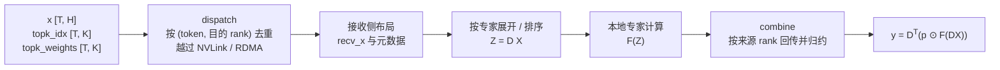

这张图里有两个容易被忽略的细节：**去重发生在 dispatch 的发送侧**，而**展开发生在接收侧**，也就是说网络上传一份，落地后可能变成多个专家的输入；至于 combine，它把结果换回源 rank 之后，还要做一次与展开相反的归约。

---

## 3. 一个能跑的最小实现（教学代码，不是 DeepEP）

矩阵写法有个副作用：它容易让人以为实现里真的存在一个稠密的 $D$。真实的实现既不会构造 $D$，也不会做稠密乘法，而是把「展开、排序、归约」三步直接编进 kernel 的索引计算里。为了把这三步从矩阵记号里拆出来，我在仓库里放了两个只依赖 PyTorch 的脚本，它们和 DeepEP 没有调用关系，唯一的用途是锚定语义。

第一个脚本是单进程的 [`codes/minimal_moe.py`](./codes/minimal_moe.py)，它把 assignment 展开成行、按专家做稳定排序、逐专家计算、再乘一次路由权重并按来源 token 归约：

```python
def moe_by_expert(x, expert_ids, probs, weights):
    """x: [T, H]；expert_ids: [T, K]，-1 表示无效；probs: [T, K]；weights: [E, H, H]"""
    t_count, k_count = expert_ids.shape
    expert_count = weights.shape[0]
    # 1) 展开成 assignment 列表
    token = torch.arange(t_count, device=x.device).repeat_interleave(k_count)
    expert, prob = expert_ids.reshape(-1), probs.reshape(-1)
    valid = expert >= 0
    token, expert, prob = token[valid], expert[valid], prob[valid]
    # 2) 让同一专家的行连续，grouped GEMM 才拼得出来
    order = torch.argsort(expert, stable=True)
    token, expert, prob = token[order], expert[order], prob[order]
    # 3) dispatch 的语义：每个 assignment 取一份输入副本
    dispatched = x.index_select(0, token)
    # 4) 逐专家计算（生产实现是 grouped GEMM）
    pieces = [torch.tanh(dispatched[expert == e] @ weights[e]) for e in range(expert_count)]
    expert_output = torch.cat(pieces, dim=0)
    # 5) 权重在这里乘一次，再按来源 token 归约
    out = torch.zeros_like(x)
    return out.index_add(0, token, expert_output * prob[:, None])
```

第二个脚本是四进程的 [`codes/distributed_ep.py`](./codes/distributed_ep.py)，它用 `torch.distributed.all_to_all_single` 的不等长切分走完整条链路：本地路由 → 按目的 rank 排序 → 交换计数 → 交换激活与专家编号 → 本地专家计算 → 逆排列 → 反向交换 → 加权归约。它同时演示了第 2 章那条伴随关系为什么能落到代码上：

```python
class _AllToAll(torch.autograd.Function):
    @staticmethod
    def forward(ctx, x, out_sizes, in_sizes):
        ctx.out_sizes, ctx.in_sizes = out_sizes, in_sizes
        out = x.new_empty((sum(out_sizes), x.shape[1]))
        dist.all_to_all_single(out, x.contiguous(),
                               output_split_sizes=out_sizes, input_split_sizes=in_sizes)
        return out

    @staticmethod
    def backward(ctx, grad_out):
        # 反向只是把两个切分长度对调，这就是 dispatch 与 combine 互为反向的通信契约
        grad_in = grad_out.new_empty((sum(ctx.in_sizes), grad_out.shape[1]))
        dist.all_to_all_single(grad_in, grad_out.contiguous(),
                               output_split_sizes=ctx.in_sizes, input_split_sizes=ctx.out_sizes)
        return grad_in, None, None
```

`all_to_all_single` 的契约本身就值得单独看一眼，因为 DeepEP 之所以不能只做一次这样的调用，原因全在这几个参数上：它把输入按 `input_split_sizes` 切片后散给各个进程，再把收到的数据按 `output_split_sizes` 顺序拼起来，两个列表为 `None` 时要求该维度能被 world size 整除（[distributed_c10d.py#L6129-L6136](https://github.com/pytorch/pytorch/blob/e8430bed0fd5e742b51c1164b8cc8f5da7a038ea/torch/distributed/distributed_c10d.py#L6129-L6136)）。也就是说，调用方必须**事先知道**每个目的 rank 要发多少、每个来源 rank 会来多少，而 MoE 的接收量恰恰是运行时才知道的，这份「不知道」正是后面所有计数交换、前缀和与 CPU 同步问题的源头。

两个脚本都在 CPU 上验证过（Gloo，4 rank），验证范围与命令写在 [`codes/readme.md`](./codes/readme.md) 里，结论可以概括成三句话：

- 单进程实现在四个用例（常规路由、含 `-1` 无效路由、单 token 命中同一专家两次、全部无效）下，前向与 `dX` / `dProbs` / `dWeights` 三项梯度都与逐 token 参考实现一致，最大绝对误差不超过 2.3e-16；
- 四进程实现在四个用例（含「某个 rank 完全没有 token」与「所有 rank 都没有 token」）下，前向与三项梯度对全局参考实现的最大绝对误差不超过 4.5e-16；
- 第 1 章那个 8 条 assignment 的例子里，单进程脚本打印的三个计数是 8 / 6 / 4；四进程脚本刻意不做去重，rank 0 在常规路由用例下打印的是「本实现发送 8 行，按 (token, 目的 rank) 去重后本可为 7 行」，在「同一 token 命中同一 rank 的两个专家」用例下则是 8 行对 4 行。教学实现**故意没有做去重**，这个差额正是 DeepEP 的第一个优化点。

这些结果只说明语义与梯度关系正确，**不能用来推断任何通信性能**：脚本跑的是 CPU 张量和 Gloo，既没有 NVLink，也没有 RDMA，更没有 DeepEP 的 kernel、布局与同步策略。把教学实现和生产实现分开看，是这篇文章里证据分级的第一条规则。

---

## 4. 模型侧：路由被塑造成了什么形状

前三章一直假设「路由已经给定」，但通信量有多大、碎片有多碎，取决于模型侧怎么切专家、怎么选专家。要回答「为什么 MoE 明明少算了还是卡在通信上」，必须先看路由形态本身。

### 4.1 DeepSeekMoE：把专家切细，同时把激活数提上去

DeepSeekMoE（arXiv `2401.06066v1`）的定位是用更细的专家粒度换取更强的专家特化，主模型是 16.4B 总参数、2.8B 激活参数。它由两个设计组成：**细粒度专家切分**把专家的 FFN 中间维度降为 $1/m$、同时把专家数扩到 $mN$、激活数扩到 $mK$，以保证总参数量与总算力大致不变；**共享专家隔离**则是从这 $mN$ 个专家里**划出** $K_s$ 个作为始终激活的共享专家（论文的 16.4B 主模型 $K_s=2$），并把 routed experts 的激活数相应减少 $K_s$，用这种方式在不增加算力的前提下把公共知识从 routed 路径里摘出去。

<div style="text-align: center; width: 100%; margin: 0 auto;">
    
</div>

> **图片来源**：DeepSeekMoE（arXiv 2401.06066v1）Figure 2，§3 之前的架构对比图。本地副本：`references/papers/deepseek-moe/deepseek-moe.md` 第 74 行引用图。

这张图最值得记住的不是「专家变多了」，而是**单个专家变小、每 token 激活的专家数同步上升**。它带来一个由张量形状直接推出的系统后果：每个 expert 的中间维度缩到了 $1/m$，但**每个 assignment 仍然要搬运完整的 $H$ 维输入向量**，因为 $x_t$ 的维度不会因为专家变细而变小。于是「算力不变、专家数变多」的同时，assignment 数从 2 涨到 $mK$，需要投递的目的地也随之变多。

模型侧还在主动把激活专家数往上调，这一点可以从 DeepSeekMoE 自己的消融里读出来：在激活参数量相同的条件下，把激活的 routed experts 从 3 个加到 7 个，Pile loss 是持续下降的，而论文图注同时记下了另一件更值得注意的事，**只激活 4 个 routed experts 时 DeepSeekMoE 的 Pile loss 就已经与 GShard 相当**。

<div style="text-align: center; width: 100%; margin: 0 auto;">
    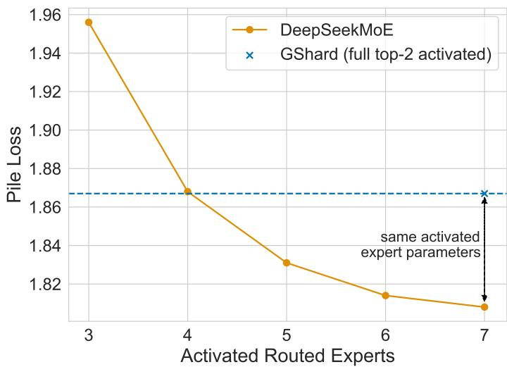
</div>

> **图片来源**：DeepSeekMoE（arXiv 2401.06066v1）Figure 5，§4.5 Analysis on Expert Specialization。本地副本：`references/papers/deepseek-moe/deepseek-moe.md` 第 249 行引用图。

换句话说，**路由扇出 $K$ 是模型侧的一个设计变量，而不是通信库能改的参数**，它一旦被定成 8，每 token 就要在通信系统里产生最多 8 条 assignment。通信侧的优化空间只剩下「这 8 条里有多少可以合并、有多少可以走近路」，这也是本文后半段所有去重与转发设计的立足点。

<details>
<summary>补充：同一套切分在专家规模更大时的表现（论文 Figure 6）</summary>

DeepSeekMoE 的训练实验里还有一组对照，把「0 个共享专家 + 16 个 routed experts 中激活 2 个」的 GShard 与「1 个共享专家 + 63 个 routed experts 中激活 3 个」的 DeepSeekMoE 直接放在六个基准上比：在**总专家参数量相同、激活专家参数量只有一半**的前提下，后者仍然全面不劣，TriviaQA 与 NaturalQuestions 这类知识型基准上的差距尤其明显。论文图注的原文是「With the same total expert parameters and only half of the activated expert parameters, DeepSeekMoE still outperforms GShard.」它解释的是模型侧的收益，与本文的通信主线只有间接关系，所以放在这里作为补充证据。

<div style="text-align: center; width: 100%; margin: 0 auto;">
    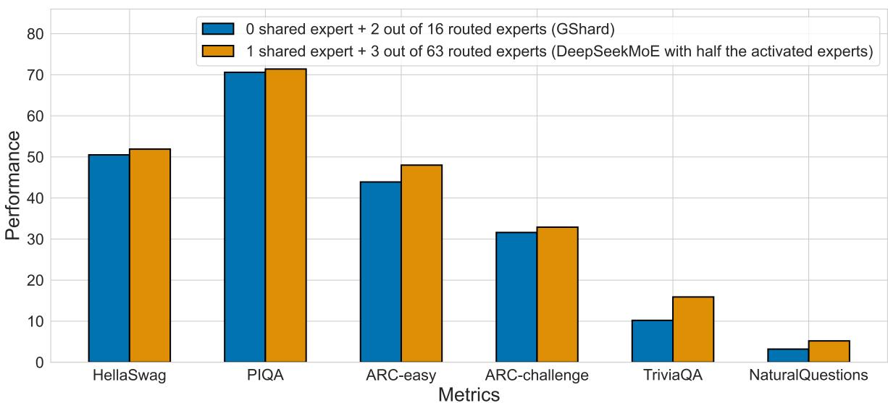
</div>

> **图片来源**：DeepSeekMoE（arXiv 2401.06066v1）Figure 6，§4.5 Analysis on Expert Specialization。本地副本：`references/papers/deepseek-moe/deepseek-moe.md` 第 252–255 行（图与图注）。

</details>

### 4.2 DeepSeek-V3：把路由约束和网络拓扑一起考虑

DeepSeek-V3 把上面这套思路放大了一个数量级：671B 总参数、每 token 激活 37B，61 层里前 3 层是 dense，其余层是 MoE 层；MoE 层有 256 个 routed experts 加 1 个共享专家，每个 token 激活 8 个 routed experts，隐藏维 $H=7168$。这些数字不是我数出来的：参数量与层数出自 Technical Report 的 Model Hyper-Parameters 一节（§4.2），下面这张表的每一列则能在官方配置里逐字对上（[config_671B.json](https://github.com/deepseek-ai/DeepSeek-V3/blob/4c2fdb8f55e049553b9f4f1a3241f86d739c8cf8/inference/configs/config_671B.json)）：

| 字段 | 值 | 对通信的含义 |
| --- | ---: | --- |
| `dim` | 7168 | 每个 assignment 要搬运的数据量正比于它 |
| `n_routed_experts` | 256 | EP 至少要切分这么多份专家参数 |
| `n_shared_experts` | 1 | 不参与路由，不产生跨 rank 流量 |
| `n_activated_experts` | 8 | 每条 token 的 assignment 扇出 |
| `n_expert_groups` / `n_limited_groups` | 8 / 4 | 路由的节点访问范围被限制在 4 个组内 |
| `route_scale` | 2.5 | 权重之和并不等于 1，见下面的门控语义 |

<div style="text-align: center; width: 100%; margin: 0 auto;">
    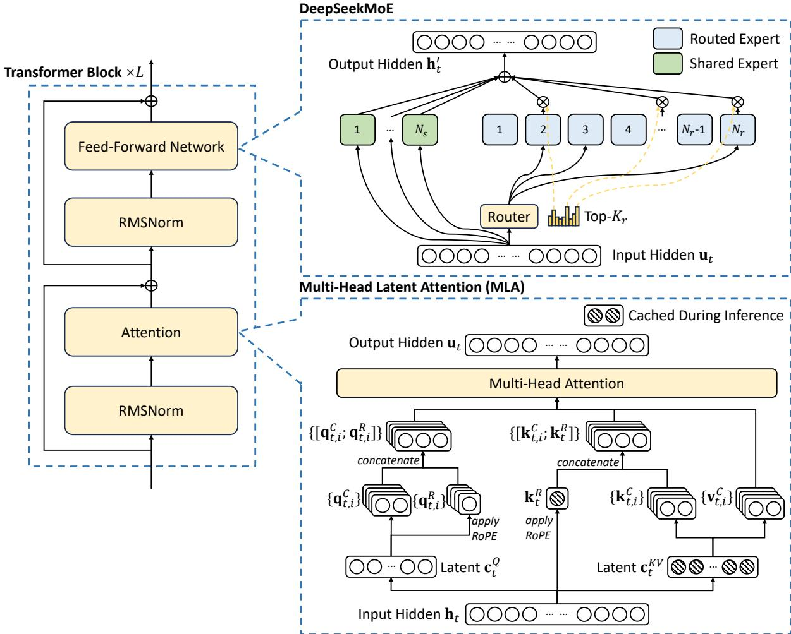
</div>

> **图片来源**：DeepSeek-V3 Technical Report（arXiv 2412.19437v2）Figure 2，§2.1 Basic Architecture。本地副本：`references/papers/deepseek-v3-report/deepseek-v3-report.md` 第 127 行引用图。

### 4.3 门控语义：权重和并不总是 1

讲通信量之前必须先把权重说准，因为「归一化」在不同模型里不是同一个意思。DeepSeek-V3 的 `Gate.forward` 是这样的：先算分数，`softmax` 分支直接归一化、`sigmoid` 分支不归一化；随后只有存在 `self.bias` 时才加上 bias，而分组筛选（group-limited routing）用的是加过 bias 的分数、返回的权重却取自**加 bias 之前的** `original_scores`；最后 sigmoid 分支补一次 `weights /= weights.sum(...)`，再统一乘 `route_scale`（[model.py#L566-L598](https://github.com/deepseek-ai/DeepSeek-V3/blob/b15f0dbbbe6a4bc403306175698439ef380f5fb5/inference/model.py#L566-L598)）。

这里有三点容易被记错：bias 只影响专家选择、不影响权重数值（不过分组分数的算法会随 bias 是否存在切换：无 bias 时取 `amax`，有 bias 时取 top-2 之和，671B 配置恒在有 bias 的分支）；**top-k 之后的重归一化**只发生在 sigmoid 分支（softmax 分支在全集上已经归一化、不再重归一），把它笼统写成「先 softmax 再归一化」是错的；671B 配置的 `route_scale` 是 2.5，所以最终权重之和并不等于 1。既然权重和可能不等于 1，那么第 2 章里「只有权重满足归一化条件，$D^{\top}(p\odot DX)$ 才可能回到 $X$」这句话就不是一句可以跳过的限定，而是一个真实的配置依赖。

### 4.4 node-limited routing：把跨节点流量做成模型侧的预算

如果放任路由自由选专家，跨节点流量会随 EP 规模一起膨胀。DeepSeek-V3 的做法是先按组打分、只在得分最高的若干个组内选专家，把每个 token 能访问的节点数限制住；报告里对应的通信方案是：跨节点 dispatch 先经 InfiniBand 抵达目标节点上索引相同的那张 GPU，再由节点内 NVLink 转发到真正持有专家的 GPU。

这个设计的收益不是「多走一跳更快」，而是**把慢链路上的副本数压下来**：同一个 token 在目标节点内可能被多个专家使用，那么只跨一次慢链路，快链路上复制几次都便宜。但它的前提是专家分组与物理部署真的对齐，group-limited routing 只是给出逻辑约束，收益取决于路由分布与专家放置是否配合。

### 4.5 DualPipe 是调度层，DeepEP 是原语层

讲到重叠时最常见的误读，是把 DeepSeek-V3 报告里的 DualPipe 说成 DeepEP 的能力。两者不在同一层：DualPipe 安排的是「什么时候做什么」，DeepEP 提供的是「一次 MoE 通信具体怎么执行」。

<div style="text-align: center; width: 100%; margin: 0 auto;">
    
</div>

> **图片来源**：DeepSeek-V3 Technical Report（arXiv 2412.19437v2）Figure 4，§3.1 末尾（正文在 §3.2.1 DualPipe and Computation-Communication Overlap 引用）（正文第 304 行原文为「As illustrated in Figure 4, for a pair of forward and backward chunks, we rearrange these components…」）。本地副本：`references/papers/deepseek-v3-report/deepseek-v3-report.md` 第 291 行引用图。该图为论文原图的调度示意条带，纵向分辨率只有 129 px。

<div style="text-align: center; width: 100%; margin: 0 auto;">
    
</div>

> **图片来源**：DeepSeek-V3 Technical Report（arXiv 2412.19437v2）Figure 5，§3.2.1 DualPipe and Computation-Communication Overlap。本地副本：`references/papers/deepseek-v3-report/deepseek-v3-report.md` 第 306 行引用图。该图同为调度示意条带，纵向分辨率 212 px，正文缩放后建议给足宽度。

把两张图并列看，DualPipe 解决的是「往流水线里塞足够的并行工作，好让 all-to-all 有东西可以藏」；而它能不能被藏住，取决于 DeepEP 这一层能不能把通信做成可异步、可切分、可回收的细粒度工作。**调度层腾出的空隙，需要通信库真的能利用它才有意义**，这也解释了为什么 V1 要专门做一个基于 hook 的重叠接口。

---

## 5. 通信量：把「很贵」变成可以复算的数字

第 4 章给了路由参数，现在可以算账了。取 DeepSeek-V3/R1 预训练里常用的配置 $T=4096$ tokens/batch、$H=7168$、$K=8$，并假设**每个 assignment 都独立传输一份**，那么一次 dispatch 的逻辑数据量是

$$
V_{\text{BF16}}=T\cdot K\cdot H\cdot 2
=4096\times 8\times 7168\times 2
=469{,}762{,}048\ \text{B}
=448\ \text{MiB},
$$

其中最后一个因子 2 是 bfloat16 每个元素的字节数，$4096\times 8=32{,}768$ 是 assignment 数，乘 $H$ 得到元素数，再乘字节宽度得到字节数（$1\ \text{MiB}=1024^2\ \text{B}$，所以 $469{,}762{,}048/1{,}048{,}576=448.0$）。

如果改成 FP8，按 DeepSeek-V3 的细粒度量化，每 128 个元素配一个 FP32 的 scale，那么每条 assignment 的体积是

$$
\underbrace{7168}_{\text{FP8 数据}}+\underbrace{\frac{7168}{128}\times 4}_{\text{scale}}=\;7168+224=7392\ \text{B},
$$

$$
V_{\text{FP8}}=32{,}768\times 7392=242{,}221{,}056\ \text{B}=231.0\ \text{MiB},
$$

两者之比 $242{,}221{,}056/469{,}762{,}048=0.5156$，也就是 **51.6%**。多出来的 1.6 个百分点全部来自 scale：这 224 字节占了单条 assignment 的 3.03%。至于 `topk_idx` 这类元数据，按 `torch.int64` 的 `[4096, 8]` 算是 262,144 B，约 0.25 MiB，占 $V_{\text{BF16}}$ 的 0.056%，量级上确实可以忽略，但它确实存在，所以严格的说法是「以上估算只计了激活值（与 scale），没有计入索引与目的信息的元数据」。

不过这 1.6 个百分点是从哪来的？它不是量化误差，而是一条固定开销：数据本身缩到了 1/2，scale 却按 FP32 存，于是省下来的比例永远回不到 50%。换个说法，每 128 个元素要用 4 字节的 FP32 去交代它们的缩放关系，这份「说明书」占掉的正是那 1.6%。

而这 51.6% 本身也不是一个与实现无关的常数，它取决于 scale 的打包口径。上面用的是「每 128 个元素一个 FP32 scale」，这个口径在 DeepSeek-V3 报告的 1×128 tile 量化与 V1 的 `hidden // 128` 里都成立（[buffer.py#L566-L577](https://github.com/deepseek-ai/DeepEP/blob/9af0e0d0e74f3577af1979c9b9e1ac2cad0104ee/deep_ep/buffer.py#L566-L577)）。V1 自己就提供了第二种**真实通信量**口径：`use_ue8m0=True` 时 scale 被压成 `hidden // 512` 个打包 int32（同一区间），同一个例子里每行的 scale 占用从 $56\times4=224$ B 降到 $14\times4=56$ B，单条 assignment 从 7392 B 变成 7224 B，比例随之从 51.6% 降到 $7224/14336=50.39\%$。**同一份「FP8 dispatch」，两种打包约定给出 50.39% 与 51.6% 两个都真实存在的数**，写性能或显存估算时把口径写在数字旁边，比记住某一个数更重要。

这里另有一个极易与通信量混淆的数字：V2 主机侧 `calculate_buffer_size` 用 `num_sf_packs = ceil_div(hidden, 32)` 个 SF pack（每个 pack 是 `{float, int}` 的 4 字节联合体，[compiled.cuh#L74-L80](https://github.com/deepseek-ai/DeepEP/blob/01dc3aaac82068020353dce2c302e38153c0bfaa/deep_ep/include/deep_ep/common/compiled.cuh#L74-L80)）来估算**接收缓冲的最坏情况预留**，源码注释自己标着「An approximation for number of SF packs」与「The worst case SF bytes must be less than the main part」（[buffer.hpp#L659-L676](https://github.com/deepseek-ai/DeepEP/blob/01dc3aaac82068020353dce2c302e38153c0bfaa/csrc/elastic/buffer.hpp#L659-L676)）；真实 dispatch 的 SF pack 数取自调用方传入的 scale 张量形状（[buffer.hpp#L758-L768](https://github.com/deepseek-ai/DeepEP/blob/01dc3aaac82068020353dce2c302e38153c0bfaa/csrc/elastic/buffer.hpp#L758-L768)）。按这个约定外推会得到 56.25%，但那是**显存上界**、不是任何真实 dispatch 的通信量，不能与 51.6% 并列。

<div style="text-align: center; width: 100%; margin: 0 auto;">
    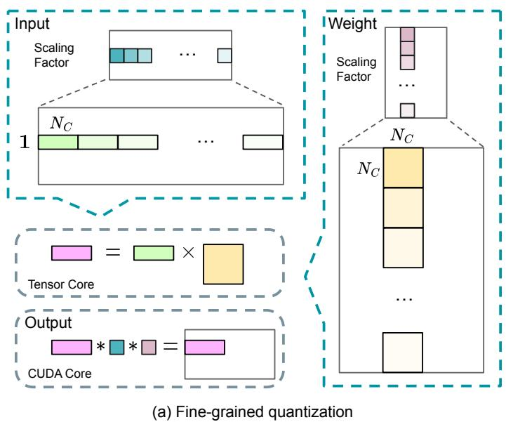
</div>

> **图片来源**：DeepSeek-V3 Technical Report（arXiv 2412.19437v2）Figure 7(a)，§3.3.1 FP8 Mixed Precision Framework。本地副本：`references/papers/deepseek-v3-report/deepseek-v3-report.md` 第 347 行引用图。本文「每 128 个元素一个 FP32 scale」的算法即来自这张图所描述的块内缩放。

<div style="text-align: center; width: 100%; margin: 0 auto;">
    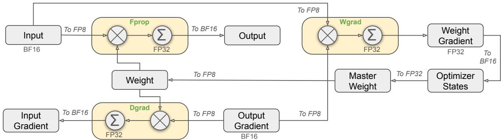
</div>

> **图片来源**：DeepSeek-V3 Technical Report（arXiv 2412.19437v2）Figure 6，§3.3 FP8 Training（图位于 §3.3.1 之前）（正文第 341 行原文为「The overall framework is illustrated in Figure 6.」）。本地副本：`references/papers/deepseek-v3-report/deepseek-v3-report.md` 第 336 行引用图。它是「dispatch 用 FP8、combine 用 BF16」这一组合的模型侧背景：低精度被逐算子地选择性使用，而不是全链路替换。

低精度省下的是体积，不是白送的精度：FP8 的累加误差需要额外手段来压，报告里对应的做法是把部分累加提升到 CUDA Core 上完成。这也是「FP8 dispatch」在整个系统里只是一个环节的原因，它必须和量化粒度、累加精度一起设计。

<div style="text-align: center; width: 100%; margin: 0 auto;">
    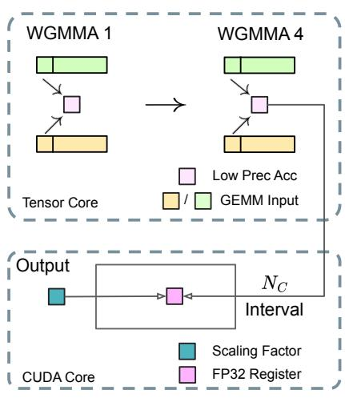
</div>

> **图片来源**：DeepSeek-V3 Technical Report（arXiv 2412.19437v2）Figure 7(b)，§3.3.1 FP8 Mixed Precision Framework。本地副本：`references/papers/deepseek-v3-report/deepseek-v3-report.md` 第 349 行引用图。

必须强调的是，$V_{\text{BF16}}$ 与 $V_{\text{FP8}}$ 都是**按 assignment 展开的逻辑量**，它既没有扣除「token 与专家同 rank、压根不需要上网络」的部分，也没有扣除「同一 token 命中同一 rank 的多个专家只传一份」的去重，更没有扣除节点内转发带来的副本合并。把它当成实际网卡流量，会立刻得到「400 Gb/s 网卡跑出 90 GB/s」这种看起来矛盾的数字，第 11 章会解释那个 90 究竟是怎么来的。

真正可以叠加的是两条正交路径，而且它们不能互相重复计算收益：

| 优化方向 | 手段 | 影响的是 |
| --- | --- | --- |
| 少传几份 | 按 (token, 目的 rank) 去重、按目的节点合并、本地命中不走网络 | 上面的 $T\cdot K$ 这个因子 |
| 每份更小 | FP8 + 细粒度 scale | 上面的 $H$ 这个因子的字节宽度 |

把「少传几份」这条线单独拉出来看，就是 DeepEP 之所以存在的演化路径：


这张图只是「发多少份」的维度；它不涉及每份有多大（那是 FP8 与 scale 的事），也不涉及「什么时候发」（那是第 7 章的 hook 与第 8 章的 direct/hybrid 的事）。三条线各管一段，混在一起谈就会得出「V2 把所有问题都解决了」这种结论。

---

## 6. DeepEP V1 的第一条路：normal 与它的隐含等待

第 5 章算出来的量级说明「按 assignment 逐份发送」的代价很高。到这里可以正式提出全文的驱动问题了，因为它已经不是开篇那句没有信息量的抱怨，而是有具体数字支撑的追问：**在 token 足够多、路由已经给定的前提下，怎样把「去重、分域转发、布局转换」组织成一条能持续吃满链路的流水线，而不是一批批地等？** V1 的 normal 路径就是针对「训练与 prefill 这种吞吐优先、token 很多」的场景给出的第一个回答。

V1 只有一个类，但它同时承载两套契约：`Buffer.__init__(group, num_nvl_bytes=0, num_rdma_bytes=0, low_latency_mode=False, num_qps_per_rank=24, allow_nvlink_for_low_latency_mode=True, allow_mnnvl=False, explicitly_destroy=False, comm=None)`（[buffer.py#L32-L38](https://github.com/deepseek-ai/DeepEP/blob/9af0e0d0e74f3577af1979c9b9e1ac2cad0104ee/deep_ep/buffer.py#L32-L38)）。这里首先要纠正一个很容易记错的细节：**V1 的构造参数里没有 `num_max_tokens_per_rank`、`hidden`、`num_topk` 这些名字**，低延迟路径的容量上界是每次调用时传进去的 `num_max_dispatch_tokens_per_rank`；把「构造期给定每 rank 最大 token 数」说成 V1 的行为，是把 V2 的 `ElasticBuffer` 记串了。

normal 路径的执行链分成三步。第一步是 host 侧的布局计算，`get_dispatch_layout` 一次性返回 `num_tokens_per_rank`、`num_tokens_per_rdma_rank`（intranode 时为 `None`）、`num_tokens_per_expert` 与 `is_token_in_rank` 四个张量（[buffer.py#L276-L297](https://github.com/deepseek-ai/DeepEP/blob/9af0e0d0e74f3577af1979c9b9e1ac2cad0104ee/deep_ep/buffer.py#L276-L297)）。其中 `is_token_in_rank` 记的是「这个 token 有没有任何一个 top-k 命中该 rank」，而不是命中次数，这一点在 [layout.cu#L85-L94](https://github.com/deepseek-ai/DeepEP/blob/9af0e0d0e74f3577af1979c9b9e1ac2cad0104ee/csrc/kernels/layout.cu#L85-L94) 里写得很直白：累加的是 `(is_in_rank[j] > 0)`，也就是先做布尔化再计数；而 `-1` 的无效路由因为落在任何专家区间之外，会被自然跳过。

第二步是通信本身。跨节点路径不是「一个 kernel 干完所有事」：计数通知是一个独立的 `notify_dispatch` 内核，主内核则按角色划分 warp，角色包括 RDMA 发送者与协调者、RDMA 与 NVLink 的转发者、转发协调者，以及 NVLink 接收者（[internode.cu#L371-L375](https://github.com/deepseek-ai/DeepEP/blob/9af0e0d0e74f3577af1979c9b9e1ac2cad0104ee/csrc/kernels/internode.cu#L371-L375)），每个 rank 通道占两个 SM、发送侧分配 7 个 warp（[internode.cu#L1008](https://github.com/deepseek-ai/DeepEP/blob/9af0e0d0e74f3577af1979c9b9e1ac2cad0104ee/csrc/kernels/internode.cu#L1008)、[#L1039](https://github.com/deepseek-ai/DeepEP/blob/9af0e0d0e74f3577af1979c9b9e1ac2cad0104ee/csrc/kernels/internode.cu#L1039)）。这种组织方式就是后面反复出现的 **warp specialization**：把「发送」「转发」「接收」拆给不同 warp，让数据按 chunk 在链路上流水推进，而不是等整批 RDMA 做完再开始 NVLink。

第三步是接收侧的布局。这里有一个绕不过去的落差：**通信布局是按到达顺序组织的，专家 GEMM 需要的是按专家连续分段**，两者并不天然一致。用第 1 章的例子说明，rank 0 收到的是 `[t0, t1]` 两行，但计算两个专家时需要的是「专家 0 拿到 `[t0]`、专家 1 拿到 `[t0, t1]`」三行输入，这个「通信 2 行、计算 3 行」的差额正是展开与排列要补的洞。Megatron 的 `_DeepepManager` 在 fused dispatch 之后仍然要做本地专家排列（类声明之后的 docstring 第 3 步写明这点，[token_dispatcher.py#L1234-L1236](https://github.com/NVIDIA/Megatron-LM/blob/0d7ecc5d6117ba8eae08d0bd2c7e2a0d9d28f3d6/megatron/core/transformer/moe/token_dispatcher.py#L1234-L1236)；实际调用点见 [#L1424](https://github.com/NVIDIA/Megatron-LM/blob/0d7ecc5d6117ba8eae08d0bd2c7e2a0d9d28f3d6/megatron/core/transformer/moe/token_dispatcher.py#L1424) 与 [#L1446](https://github.com/NVIDIA/Megatron-LM/blob/0d7ecc5d6117ba8eae08d0bd2c7e2a0d9d28f3d6/megatron/core/transformer/moe/token_dispatcher.py#L1446)），这直接说明 **fused dispatch 不等于「所有专家排列都消失了」**。

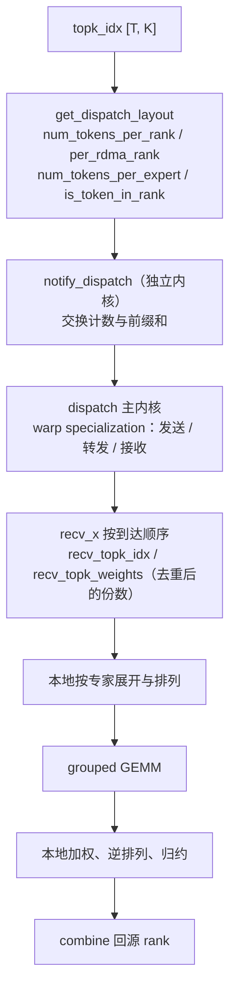

<div style="text-align: center; width: 100%; margin: 0 auto;">
    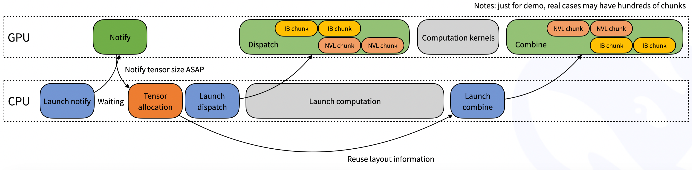
</div>

> **图片来源**：DeepEP 官方仓库 `figures/normal.png`，commit `9af0e0d0e74f3577af1979c9b9e1ac2cad0104ee`（tag `v1.2.1`，与 `01dc3aaa` 下的同名 blob 逐字节一致）。该图被 tag `v1.2.1` 的 README 以「an implicit CPU wait for GPU received count signal will be involved, as the following figure shows」引出（`README.md` 第 227–229 行），后来被搬进 V2 的 `docs/legacy.md`（第 227 行）。

这张图里那条「隐式 CPU 等待」的线，是 normal 路径必须付出的代价：**收到多少 token 取决于所有来源 rank 当前的路由结果，host 侧要拿到这个数字才能决定输出形状**。V1 在 intranode 下提供了一个逃生门，用 `num_worst_tokens` 预声明最坏情况，从而不等待 CPU、也就能被 CUDA Graph 捕获，但跨节点路径直接把这个参数断言掉了（[buffer.py#L337-L360](https://github.com/deepseek-ai/DeepEP/blob/9af0e0d0e74f3577af1979c9b9e1ac2cad0104ee/deep_ep/buffer.py#L337-L360)）。Megatron 的封装同样在 fused dispatch 旁边留下了这条注释：「the CPU will wait for GPU's signal to arrive, so this is not compatible with CUDA graph」（[fused_a2a.py#L106-L108](https://github.com/NVIDIA/Megatron-LM/blob/0d7ecc5d6117ba8eae08d0bd2c7e2a0d9d28f3d6/megatron/core/transformer/moe/fused_a2a.py#L106-L108)）。这是**某一条具体调用路径**的限制，不应被扩大成「所有版本的 normal 模式永远无法图捕获」。

---

## 7. 为什么 V1 还需要第二条路：low-latency 与「0 SM」的真实含义

第 6 章结尾那条等待，是解码场景里不能接受的开销，但它并不是唯一的固定成本。用一个粗略的分解看一次通信：

$$
T_{\text{comm}}\approx T_{\text{launch}}+T_{\text{metadata}}+\frac{V}{B}+T_{\text{sync}},
$$

其中 $V/B$ 是数据量除以可用带宽、$T_{\text{sync}}$ 是把各方状态对齐所花的时间。当 $V$ 很大时，中间那一项占主导，吞吐路径就够了；当每个 rank 只有一百多个 token 时，**启动、元数据交换与同步这些与 $V$ 无关的项反而更显眼**，这就是 V1 把低延迟路径单独做出来的原因。

### 7.1 用固定容量换掉 CPU 计数等待

低延迟 dispatch 的接口是 `low_latency_dispatch(x, topk_idx, num_max_dispatch_tokens_per_rank, num_experts, cumulative_local_expert_recv_stats=None, dispatch_wait_recv_cost_stats=None, use_fp8=True, round_scale=False, use_ue8m0=False, async_finish=False, return_recv_hook=False)`，其中 `num_max_dispatch_tokens_per_rank` 要求所有 rank 取同一个值（[buffer.py#L530-L549](https://github.com/deepseek-ai/DeepEP/blob/9af0e0d0e74f3577af1979c9b9e1ac2cad0104ee/deep_ep/buffer.py#L530-L549)）。它的返回布局是专家维已经展开好的三维张量：

$$
X_{\text{recv}}\in\mathbb{R}^{E_{\text{local}}\times(P\cdot T_{\max})\times H},
$$

其中 $P$ 是 rank 数、$T_{\max}$ 就是上面那个 `num_max_dispatch_tokens_per_rank`。与之配套的还有 GPU 上的计数张量

$$
\text{recv\_count}\in\mathbb{Z}^{E_{\text{local}}},\qquad \text{recv\_count}[e]=\text{本 rank 的专家 } e \text{ 实际收到的 token 数}.
$$

docstring 里对这份契约说得很清楚：「not all tokens are valid, only some of the `num_max_dispatch_tokens_per_rank * num_ranks` are, as we do not synchronize CPU received count with GPU」（[buffer.py#L566-L579](https://github.com/deepseek-ai/DeepEP/blob/9af0e0d0e74f3577af1979c9b9e1ac2cad0104ee/deep_ep/buffer.py#L566-L579)）。**张量的容量不等于有效 token 数**，消费侧必须依赖 `recv_count` 或等价的 mask，把整块预分配区域当成样本来算会直接算错。

这份容量是有界的，来源也很具体。在 `csrc/config.hpp` 里，单条 dispatch 消息的字节数是 `sizeof(int4) + max(hidden * sizeof(nv_bfloat16), hidden + num_scales * sizeof(float))`，也就是「BF16 数据」与「FP8 数据加 scale」取较大者，再加 16 字节的元信息头；接收侧按 `num_experts * num_max_dispatch_tokens_per_rank` 预留，并整体开两份做双缓冲（[config.hpp#L129-L166](https://github.com/deepseek-ai/DeepEP/blob/9af0e0d0e74f3577af1979c9b9e1ac2cad0104ee/csrc/config.hpp#L129-L166)）。落到每个 (本地专家, 源 rank) 槽位上，容量正好是 `num_max_dispatch_tokens_per_rank`，由内核里的原子计数器分配 slot（[internode_ll.cu#L153-L161](https://github.com/deepseek-ai/DeepEP/blob/9af0e0d0e74f3577af1979c9b9e1ac2cad0104ee/csrc/kernels/internode_ll.cu#L153-L161)），而这份容量成立的前提是 host 侧那句断言：`x.size(0) <= num_max_dispatch_tokens_per_rank`（[deep_ep.cpp#L1105](https://github.com/deepseek-ai/DeepEP/blob/9af0e0d0e74f3577af1979c9b9e1ac2cad0104ee/csrc/deep_ep.cpp#L1105)）。

### 7.2 「0 SM」承诺了什么，没承诺什么

低延迟路径最有名的一句话是「a hook-based communication-computation overlapping method that does not occupy any SM resource」，它写在 **tag `v1.2.1` 的 `README.md` 第 7 行**（[README.md#L7](https://github.com/deepseek-ai/DeepEP/blob/9af0e0d0e74f3577af1979c9b9e1ac2cad0104ee/README.md#L7)），后来被搬进了 V2 的归档文档（[docs/legacy.md#L11](https://github.com/deepseek-ai/DeepEP/blob/01dc3aaac82068020353dce2c302e38153c0bfaa/docs/legacy.md#L11)），而 V2 的根 README 里已经没有这句话了，引用时不要挂错版本。它在代码里的实现方式是**把一个内核拆成 send 与 recv 两次启动**：`return_recv_hook=True` 时 host 只发 send 阶段，并把「再启动一次做 recv 阶段」的 lambda 作为 hook 返回（[deep_ep.cpp#L1184-L1199](https://github.com/deepseek-ai/DeepEP/blob/9af0e0d0e74f3577af1979c9b9e1ac2cad0104ee/csrc/deep_ep.cpp#L1184-L1199)），内核则用 `LOW_LATENCY_SEND_PHASE` / `LOW_LATENCY_RECV_PHASE` 两个标志位各自提前返回（[internode_ll.cu#L86-L88](https://github.com/deepseek-ai/DeepEP/blob/9af0e0d0e74f3577af1979c9b9e1ac2cad0104ee/csrc/kernels/internode_ll.cu#L86-L88)、[#L246-L253](https://github.com/deepseek-ai/DeepEP/blob/9af0e0d0e74f3577af1979c9b9e1ac2cad0104ee/csrc/kernels/internode_ll.cu#L246-L253)）。hook 模式还有一个附加条件：它总是跑在 compute stream 上，并且与 `async_finish` 互斥（[deep_ep.cpp#L1131-L1137](https://github.com/deepseek-ai/DeepEP/blob/9af0e0d0e74f3577af1979c9b9e1ac2cad0104ee/csrc/deep_ep.cpp#L1131-L1137)）。

于是这句「不占用任何 SM」的准确含义是：**在你调用 recv hook 之前的那个窗口里，设备上没有本库的内核在驻留等待**，这段时间可以拿去算别的东西。这里要补一句我自己的推断，它不是文档原话：recv hook 本身仍然是一次内核启动，而低延迟内核在 V1 里明确「there is no SM control API for the low-latency kernels」（tag `v1.2.1` 的 `README.md` 第 243 行；V2 的 README 里没有这句，引用时不要挂错版本），启动时用的是整卡 SM 数，所以「0 SM」不等于「整条低延迟路径都不吃 SM」。

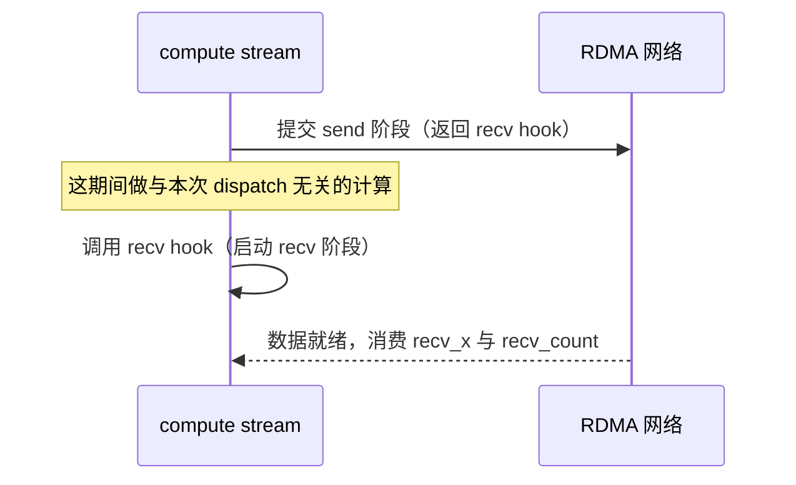

<div style="text-align: center; width: 100%; margin: 0 auto;">
    
</div>

> **图片来源**：DeepEP 官方仓库 `figures/low-latency.png`，commit `9af0e0d0e74f3577af1979c9b9e1ac2cad0104ee`（tag `v1.2.1`，与 `01dc3aaa` 下的同名 blob 逐字节一致）。tag `v1.2.1` 的 README 在「With our receiving hook interface, the RDMA network traffic is happening in the background, without costing any GPU SMs from the computation part」一句后引用该图（`README.md` 第 290–292 行），对应 V2 的 `docs/legacy.md` 第 290 行。

### 7.3 可重叠与不可重叠

「0 SM」的另一半是「必须真的有独立计算可做」。当前 dispatch 可以与共享专家的计算重叠，也可以与另一个 microbatch 的计算重叠；但**不能凭空重叠**：如果某个专家的输入还没到达，依赖这批输入的同批专家输出就没法先算。DeepSeek-V3 的 DualPipe 负责在更大的调度范围里寻找这类机会（第 4.5 节那两张图的用处就在这里），DeepEP 负责让这些机会真的能被用上。

还有一处需要澄清的过度概括：V1 的低延迟路径虽然以「pure RDMA」起家，但 `allow_nvlink_for_low_latency_mode` 的默认值在 tag `v1.2.1` 里是 `True`，docstring 同时提醒它与 hook 式重叠「somehow incompatible」、PCIe 连接还可能因内存序问题报错（[buffer.py#L49-L52](https://github.com/deepseek-ai/DeepEP/blob/9af0e0d0e74f3577af1979c9b9e1ac2cad0104ee/deep_ep/buffer.py#L49-L52)）；内核里也确实存在「先判断是否同机、命中就走 P2P 拷贝、否则才发 RDMA」的分支（[internode_ll.cu#L162-L170](https://github.com/deepseek-ai/DeepEP/blob/9af0e0d0e74f3577af1979c9b9e1ac2cad0104ee/csrc/kernels/internode_ll.cu#L162-L170)）。所以「V1 的低延迟永远只走 RDMA」不成立，它只是把 RDMA 当成主路径，NVLink 的收益需要通过开关与场景来换。

---

## 8. DeepEP V2：统一接口，但没有消灭取舍

第 6、7 章合起来看，V1 的形态是「两套路径、两套契约」：吞吐路径依赖 host 侧计数，低延迟路径用固定容量换掉计数，代价是 0 SM 的重叠能力只在特定条件下成立。V2 的公开说明把这次改造讲得很直白：它是「a complete refactoring of Expert Parallelism — achieving extreme performance with several times fewer SM resources compared to V1」，「switched from the NVSHMEM backend to the more lightweight NCCL Gin backend」（`README.md` 第 9 行）。

改造带来的收益可以量化，而且官方给的是可以直接引用的对照：**在 V3-like 的 legacy training 场景下，SM 占用从 24 降到 4–6，性能持平或更好**（`README.md` 第 22 行）；**V2 相对 V1 最多带来 1.3x 的峰值性能，同时最多节省 4x 的 SM**（`README.md` 第 55 行）；规模上支持到 **EP2048**（`README.md` 第 19 行）。与此同时它明确列出了三条边界：buffer 占用比 V1 大、**0 SM RDMA low-latency EP 不再支持**、Engram / PP / CP 仍是实验特性（`README.md` 第 29–31 行）。最后一条尤其重要，因为它意味着第 7 章讲的 V1 low-latency 0 SM 语义在 V2 里被有意删掉了，而不是文档漏写。

### 8.1 `ElasticBuffer` 统一了什么

V2 的 EP 操作全部收敛到 `ElasticBuffer` 接口下，构造签名是 `group, num_bytes=None, num_cpu_bytes=0, num_max_tokens_per_rank=0, hidden=0, num_topk=0, use_fp8_dispatch=False, deterministic=False, allow_hybrid_mode=True, allow_multiple_reduction=True, prefer_overlap_with_compute=True, sl_idx=3, num_allocated_qps=0, num_cpu_timeout_secs=300, num_gpu_timeout_secs=100, explicitly_destroy=False`（[elastic.py#L228-L246](https://github.com/deepseek-ai/DeepEP/blob/01dc3aaac82068020353dce2c302e38153c0bfaa/deep_ep/buffers/elastic.py#L228-L246)）。这里出现了一个 V1 没有的分工：**「显式给 `num_bytes`」与「给 MoE 设置让库自己推算」是两条互斥的入口**，后者需要 `num_max_tokens_per_rank`、`hidden`、`num_topk`，而这三个参数在 V1 的构造函数里根本不存在。

`dispatch` 与 `combine` 也不再对称地长成「一个通信函数」的样子。dispatch 的真实签名里有三个容易看漏的参数：`do_expand`（输出是按 token–rank 组织还是按 token–expert 展开）、`do_zero_padding`（只有 expand 时有效，是否把对齐 padding 清成 0）、以及 `do_cpu_sync`（是否等 CPU 拿到精确接收数，未提供 handle 时默认为 `True`）（[elastic.py#L855-L925](https://github.com/deepseek-ai/DeepEP/blob/01dc3aaac82068020353dce2c302e38153c0bfaa/deep_ep/buffers/elastic.py#L855-L925)）。配套的约束是用 assert 写死的，不是文档建议：

```python
assert topk_idx is None
assert do_cpu_sync is None or not do_cpu_sync, 'Cannot do CPU sync with cached handle'
```

（[elastic.py#L937-L944](https://github.com/deepseek-ai/DeepEP/blob/01dc3aaac82068020353dce2c302e38153c0bfaa/deep_ep/buffers/elastic.py#L937-L944)，紧邻的还有 `num_sms` 与 `num_qps` 的自动取值，见 8.4 节。）这行断言的意义是：一旦你决定复用上一次的 handle，就必须同时放弃「CPU 知道精确收数」这件事，因为接收量已经由上次的布局固定下来了。

这里还有一处**实现与文档互相矛盾**的地方，值得作为「有意义差异」记下来：`topk_weights` 参数的 docstring 写着「Must be `None` if `handle` is provided」（[elastic.py#L889-L890](https://github.com/deepseek-ai/DeepEP/blob/01dc3aaac82068020353dce2c302e38153c0bfaa/deep_ep/buffers/elastic.py#L889-L890)），而 `handle` 参数自己的 docstring 又写着「`topk_weights` can be optionally provided (e.g. for backward pass with cached expand)」（[elastic.py#L906-L908](https://github.com/deepseek-ai/DeepEP/blob/01dc3aaac82068020353dce2c302e38153c0bfaa/deep_ep/buffers/elastic.py#L906-L908)）。代码侧只约束了 `topk_idx` 与 `do_cpu_sync` 两件事，`topk_weights` 一旦传入，runtime 会原样把它转发下去（[elastic.py#L976](https://github.com/deepseek-ai/DeepEP/blob/01dc3aaac82068020353dce2c302e38153c0bfaa/deep_ep/buffers/elastic.py#L976)），接收侧也会照常分配 `recv_topk_weights` 这个输出张量（[buffer.hpp#L1106-L1110](https://github.com/deepseek-ai/DeepEP/blob/01dc3aaac82068020353dce2c302e38153c0bfaa/csrc/elastic/buffer.hpp#L1106-L1110)），所以按代码读，准确的契约是**「可传、但不强制」**：复用 handle 时不能再传路由索引、也不能做 CPU 同步，权重是否传入取决于这条路径还要不要用到它。官方 README 的两段示例只能佐证 `combine` 那一侧：dispatch 的反向路径（cached expand）显式把 `grad_recv_topk_weights` 交给 `combine`（`README.md` 第 213–217 行），而 decode 的 cached-handle 分支只传 `handle`、不传权重（第 294–299 行）；`combine_backward` 的第 245–250 行同样只传 handle。README 里**没有** `dispatch(handle=…, topk_weights=…)` 的示例，所以这条契约靠断言与转发路径来定，不能靠示例的沉默来推断。

顺手把 `combine` 这一侧的结构也记下来，避免拿 `dispatch` 的形参去套：`combine` 的 `handle` 是**必填**参数、**没有** `do_cpu_sync`（它不做 CPU 计数同步）、多一个 `bias`（0/1/2 个 `[num_combined_tokens, hidden]` 的 BF16 输出偏置），expand 模式下的 `topk_weights` 是**一维** `[num_tokens]`（非 expand 模式才是 `[num_tokens, num_topk]`），`num_sms=0` 表示沿用 dispatch 记在 handle 里的 SM 数，返回值是**三元组** `(combined_x, combined_topk_weights, event)`（[elastic.py#L1046-L1107](https://github.com/deepseek-ai/DeepEP/blob/01dc3aaac82068020353dce2c302e38153c0bfaa/deep_ep/buffers/elastic.py#L1046-L1107)）。

### 8.2 `EPHandle`：一次路由的完整账本

handle 是这个接口的中枢，它要回答的问题远不止「上次收到多少」。字段与语义可以直接对着 docstring 读（[elastic.py#L25-L57](https://github.com/deepseek-ai/DeepEP/blob/01dc3aaac82068020353dce2c302e38153c0bfaa/deep_ep/buffers/elastic.py#L25-L57)），其中三处最容易被误读：

- **`psum_num_recv_tokens_per_scaleup_rank` 是按 rank 去重的计数前缀和**，docstring 的原话是「A token is counted once per rank even if multiple of its top-k experts land on the same rank」，并且最后一个元素就是接收 token 总数。这正是第 1 章「按 (token, 目的 rank) 去重」那层对象，只不过在 V2 里换成了 scaleup rank 的口径。
- **`psum_num_recv_tokens_per_expert` 在 expand 模式下不是普通的独占前缀和**：`psum[i]` 等于专家 `i` 之前所有专家的对齐累计量加上专家 `i` 自己的未对齐计数；`expert_alignment` 会先把每个专家的收数对齐，再参与前缀和。
- **`num_unaligned_recv_tokens_per_expert` 只在 expand 模式下被填充**，它才是每个专家真实的收数。也就是说，凡是按 expert 前缀和去索引的场景，都要先想清楚自己拿到的是「对齐后的位置」还是「真实的数量」。

另外，`num_recv_tokens` 的赋值旁边留着一句注释「May not be accurate without CPU sync」（[elastic.py#L93-L94](https://github.com/deepseek-ai/DeepEP/blob/01dc3aaac82068020353dce2c302e38153c0bfaa/deep_ep/buffers/elastic.py#L93-L94)），它是第 7 章那条「容量不等于有效 token 数」在 V2 里的同一条约束，只不过载体从 `recv_count` 换成了 handle 字段。

### 8.3 不做 CPU 同步时，空间怎么分配

在这条「未传 handle、也不做 CPU 同步」的分支上，V2 选择了最坏情况分配。这句话有两个限定不能省：它描述的是 `do_cpu_sync=False` 且是非 cached（没有复用上一次 handle）的路径，而下面那个展开量只在 `do_expand=True` 时才真正被用作接收缓冲的大小，`do_expand=False` 时接口分配的是 `num_recv_tokens` 而不是 `num_expanded_tokens`。源码里对应的注释就写在分支上（`// Non-cached mode without CPU sync, allocate with the worst case`，[buffer.hpp#L1065-L1075](https://github.com/deepseek-ai/DeepEP/blob/01dc3aaac82068020353dce2c302e38153c0bfaa/csrc/elastic/buffer.hpp#L1065-L1075)，`do_expand` 在分配处的分流见 [buffer.hpp#L1075](https://github.com/deepseek-ai/DeepEP/blob/01dc3aaac82068020353dce2c302e38153c0bfaa/csrc/elastic/buffer.hpp#L1075)）：

```cpp
num_recv_tokens = num_max_tokens_per_rank * nccl_context->num_ranks;
num_expanded_tokens = nccl_context->num_ranks * num_max_tokens_per_rank * std::min(num_topk, num_local_experts);
num_expanded_tokens += (expert_alignment - 1) * num_local_experts;
num_expanded_tokens = math::align(num_expanded_tokens, expert_alignment);
```

把 $a$ 记作 `expert_alignment`，这三行对应的容量公式可以写成

$$
M_{\text{cap}}=\operatorname{align}\left(P\,T_{\max}\min(K,E_{\text{local}})+(a-1)E_{\text{local}},\;a\right),
$$

其中第一项是「每个 token 最多落到本 rank 的 $\min(K,E_{\text{local}})$ 个专家上」的最坏展开量，第二项 $(a-1)E_{\text{local}}$ 是**专家之间对齐预留的最坏浪费**：每个专家最多浪费 $a-1$ 个 slot。`math::align` 的定义是 `ceil_div(a, b) * b`，也就是向上取整到 $b$ 的倍数（[math.cuh#L16](https://github.com/deepseek-ai/DeepEP/blob/01dc3aaac82068020353dce2c302e38153c0bfaa/deep_ep/include/deep_ep/common/math.cuh#L16)）。

以 SGLang 的真实取值举例（它把 `_EXPERT_ALIGNMENT` 设为 128，[deepep_v2.py#L29](https://github.com/sgl-project/sglang/blob/7399c2b5587e1559f3e5a26566ed322e81e1433a/python/sglang/srt/layers/moe/token_dispatcher/deepep_v2.py#L29)）：取 $P=8$、$T_{\max}=128$、$K=8$、$E_{\text{local}}=32$，则第一项是 $8\times128\times8=8192$，第二项是 $127\times32=4064$，两者相加 12256、向上对齐到 128 的倍数后是 **12288 个 slot**。相比最坏展开量它多了 50%，而这部分余量里有一部分永远用不上，换来的是「不等 CPU 也能给出固定形状」。V1 的作者在自己的归档文档里也给过同方向的建议：「consider using fixed-size buffers allocated to maximum capacity for simplicity and better performance」（[docs/legacy.md#L310](https://github.com/deepseek-ai/DeepEP/blob/01dc3aaac82068020353dce2c302e38153c0bfaa/docs/legacy.md#L310)），V2 相当于把这条经验做成了默认路径。

### 8.4 SM 与 QP 的解析估算，以及它的适用边界

V2 取消了 V1 那套 auto-tuning 扫参，改成按带宽建模的解析估算；`num_sms` 仍可由调用方显式指定，传 0 才走自动（源码 docstring 写的是 `0 for automatic`）：

```python
def get_theoretical_num_sms(self, num_experts: int, num_topk: int,
                            num_scaleout_topk: int = 0,
                            rdma_gbs: float = 0, nvlink_gbs: float = 0,
                            # TODO: use different values for other architectures
                            sm_read_gbs: float = 200, sm_write_gbs: float = 50) -> int:
```

（[elastic.py#L729-L747](https://github.com/deepseek-ai/DeepEP/blob/01dc3aaac82068020353dce2c302e38153c0bfaa/deep_ep/buffers/elastic.py#L729-L747)。）它有三条必须一起读的边界：docstring 里的 **「This assumes a balanced gate distribution.」**（[elastic.py#L736](https://github.com/deepseek-ai/DeepEP/blob/01dc3aaac82068020353dce2c302e38153c0bfaa/deep_ep/buffers/elastic.py#L736)）、同一函数注释里的 **「For V3.0's group-limited gate, please do not use this function」**（[#L749-L756](https://github.com/deepseek-ai/DeepEP/blob/01dc3aaac82068020353dce2c302e38153c0bfaa/deep_ep/buffers/elastic.py#L749-L756)），以及初始计数处的 **「we don't count HBM traffic」**（[#L766](https://github.com/deepseek-ai/DeepEP/blob/01dc3aaac82068020353dce2c302e38153c0bfaa/deep_ep/buffers/elastic.py#L766)）。换句话说，这个估算的隐含前提是「每个专家收到的 token 数大致均衡」；而 DeepSeek-V3 报告里的实测恰好相反，**它的图注直接写着 auxiliary-loss-free 这一版的专家更特化（「The auxiliary-loss-free model shows greater expert specialization patterns」），也就是负载更不均匀**：

<div style="text-align: center; width: 100%; margin: 0 auto;">
    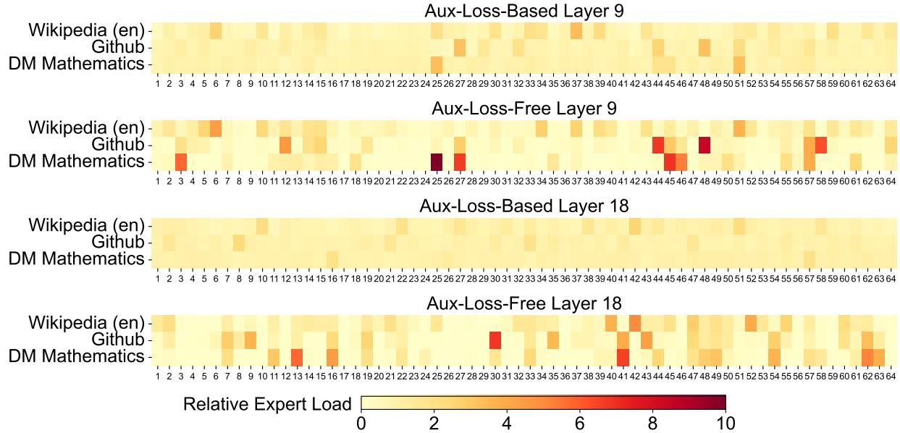
</div>

> **图片来源**：DeepSeek-V3 Technical Report（arXiv 2412.19437v2）Figure 9，§4.5.3 Batch-Wise Load Balance VS. Sequence-Wise Load Balance。本地副本：`references/papers/deepseek-v3-report/deepseek-v3-report.md` 第 543 行引用图。

估算模型本身的结构不复杂。局部函数 `get_expected_topk` 算的是**「一个 token 的 K 个选择一共期望命中多少个不同的 rank」**，也就是第 1 章那个「按目的 rank 去重」的对象，用组合数写成 $\text{num\_groups}\cdot\bigl(1-\binom{E-E/G}{K}/\binom{E}{K}\bigr)$（源码注释原文即「Expected top-k scale-out ranks / scale-up ranks」，[elastic.py#L770-L777](https://github.com/deepseek-ai/DeepEP/blob/01dc3aaac82068020353dce2c302e38153c0bfaa/deep_ep/buffers/elastic.py#L770-L777)）。这个区分不是措辞问题：在 $E=256,G=8,K=8$ 的配置下，「命中的不同 rank 数」约是 5.29，而「命中本 rank 的 top-k 数」是 1.00；两者当成一回事，量级会差 5 倍以上。它随后把 scaleout 与 scaleup 的流量分别折进 RDMA 与 NVLink 的带宽，取两者中较大者作为瓶颈（这一步有前置门控：只有 `self.num_scaleout_ranks > 1` 时 RDMA 一路才参与竞争，[elastic.py#L809](https://github.com/deepseek-ai/DeepEP/blob/01dc3aaac82068020353dce2c302e38153c0bfaa/deep_ep/buffers/elastic.py#L809)），最后反推出满足该瓶颈所需的 SM 数（[elastic.py#L770-L825](https://github.com/deepseek-ai/DeepEP/blob/01dc3aaac82068020353dce2c302e38153c0bfaa/deep_ep/buffers/elastic.py#L770-L825)）。它给出的不是「最少需要几个 SM」，而是一个带经验系数的建议值：结果先取 `max(4, ceil(num_sms * 1.25))` 并对齐到偶数，再按 `prefer_overlap_with_compute` 决定是否抬到至少 64 个 SM，最后才被设备 SM 总数截断（[elastic.py#L820-L825](https://github.com/deepseek-ai/DeepEP/blob/01dc3aaac82068020353dce2c302e38153c0bfaa/deep_ep/buffers/elastic.py#L820-L825)）。换句话说，「有独立计算可以重叠时少占 SM、没有的时候多占 SM」是源码写死的策略，其中那个 1.25 是经验放大而不是物理推导。源码里一共留了三处 TODO：`num_scaleout_topk` 目前必须为 0（`assert num_scaleout_topk == 0`）、不支持 `do_expand`、不支持 `allow_multiple_reduction`（[elastic.py#L732-L757](https://github.com/deepseek-ai/DeepEP/blob/01dc3aaac82068020353dce2c302e38153c0bfaa/deep_ep/buffers/elastic.py#L732-L757)）；这几条路径的流量它并没有建模。

QP，即 RDMA Queue Pair，数量同样是算出来的，而且分支由**构造参数** `allow_hybrid_mode`（默认 `True`）决定、不随单次调用的运行时模式切换：关闭时取 `min(num_sms, 8 + 1)`，开启时取 `num_sms * 16 + 1`，再按已分配上限截断（[elastic.py#L836-L853](https://github.com/deepseek-ai/DeepEP/blob/01dc3aaac82068020353dce2c302e38153c0bfaa/deep_ep/buffers/elastic.py#L836-L853)）。那个额外的 1 在两处注释里都有交代：hybrid 模式希望每个 channel（含 notify）都有独立 QP，而自动分配 QP 上限时也专门多留了一个给 notify warp（[elastic.py#L326-L333](https://github.com/deepseek-ai/DeepEP/blob/01dc3aaac82068020353dce2c302e38153c0bfaa/deep_ep/buffers/elastic.py#L326-L333)）；这个 8 + 1 很容易被当成凑整，但它在 num_sms 取 64 与取 6 两种情形下作用完全不同，这也是 hybrid 分支要写成 16 倍而不是照抄 8 的原因。

这里还藏着一个和「逻辑带宽 vs 物理带宽」直接相关的实现细节：估算里用到的带宽来自真实探测，RDMA 那一路读的是 `ibstat` 的 `Rate` 字段然后**直接除以 8**（[envs.py#L246-L265](https://github.com/deepseek-ai/DeepEP/blob/01dc3aaac82068020353dce2c302e38153c0bfaa/deep_ep/utils/envs.py#L246-L265)），NVLink 那一路是把 `nvidia-smi nvlink -s` 里各条链路的带宽相加再乘 0.9（[envs.py#L193-L220](https://github.com/deepseek-ai/DeepEP/blob/01dc3aaac82068020353dce2c302e38153c0bfaa/deep_ep/utils/envs.py#L193-L220)）。所以这个库口中的 GB/s 是十进制的 GB/s，400 Gb/s 在它眼里就是 50 GB/s，这一点在第 11 章解释官方数字时会用到。

### 8.5 NCCL Gin：换的是后端，不是把通信变成了一次 collective

V2 的后端迁移经常被简化成「从 NVSHMEM 换到 NCCL」，但 NCCL Gin 提供的其实是一组**设备侧**通信原语：DeepEP 在自己的头文件里包了一层 `put`、`put_value`、`red_add_rel`（[handle.cuh#L178-L208](https://github.com/deepseek-ai/DeepEP/blob/01dc3aaac82068020353dce2c302e38153c0bfaa/deep_ep/include/deep_ep/common/handle.cuh#L178-L208)、[#L98-L109](https://github.com/deepseek-ai/DeepEP/blob/01dc3aaac82068020353dce2c302e38153c0bfaa/deep_ep/include/deep_ep/common/handle.cuh#L98-L109)），并按 team tag 区分三个通信域：全局的 `ncclTeamTagWorld`、NVLink 域的 `ncclTeamTagLsa`、以及 rail 域的 `ncclTeamTagRail`（[handle.cuh#L12-L17](https://github.com/deepseek-ai/DeepEP/blob/01dc3aaac82068020353dce2c302e38153c0bfaa/deep_ep/include/deep_ep/common/handle.cuh#L12-L17)）。NCCL 上游对应的接口是 `ncclGinPut` / `ncclGinGet` / `ncclGinSignal` / `ncclGinFlush` 这些声明（[gin.h#L150-L177](https://github.com/NVIDIA/nccl/blob/b0e84e58b8efbeb83193c5e292e3418c65a38ca5/src/include/nccl_device/gin.h#L150-L177)）。

有一个细节值得记下来，因为它能防止把「barrier 是谁提供的」记错：`ncclTeamTag*` 与 barrier **不在** `gin.h` 里，DeepEP 使用的 barrier 是自己在 `comm.cuh` 里用 `ncclGin(...).flush(...)` 加网格同步组合出来的（[comm.cuh#L145-L152](https://github.com/deepseek-ai/DeepEP/blob/01dc3aaac82068020353dce2c302e38153c0bfaa/deep_ep/include/deep_ep/common/comm.cuh#L145-L152)）。资源模式也在这个文件里分档：单 SM 时用 `NCCL_GIN_RESOURCE_SHARING_CTA`，否则用 `NCCL_GIN_RESOURCE_SHARING_GPU`（[comm.cuh#L59-L60](https://github.com/deepseek-ai/DeepEP/blob/01dc3aaac82068020353dce2c302e38153c0bfaa/deep_ep/include/deep_ep/common/comm.cuh#L59-L60)）；NCCL 这一侧的定义其实有三个档位（GPU / CTA / THREAD），DeepEP 只用了其中两个，这个差别在跨版本排查时会显现出来。

**准确的说法是：DeepEP 借助 NCCL 的设备侧网络能力，自己实现 MoE 专用的路由、槽位分配、转发与归约**；把它读成「换成了一个通用 all-to-all 的别名」，会把上面这些语义全部丢掉。

那为什么不用一个通用的 all-to-all 就好？通用 all-to-all 解决的是一类很宽的问题：给定每个进程要发给其余每个进程的数据量，把数据搬过去，拓扑差异、负载均衡与顺序由集合通信库负责（第 3 章那段 `all_to_all_single` 的切分契约就是它的典型形态）。MoE 的场景恰好把它的两个前提都拿掉了：**收发的分量在调用时并不已知**（取决于本 rank 与其他 rank 各自的路由结果），而且**同一份 hidden state 常常要发给同一个目的 rank 上的多个专家**，通用接口没有「按 (token, 目的 rank) 去重」这个概念，只能按调用方给出的 split sizes 重复搬运。结论不是「all-to-all 慢」，而是它把 MoE 已知的路由信息当成未知，从而必须多做一遍数据移动；DeepEP 换来的收益正是「利用那份已知信息」。

### 8.6 warp 分工与两条数据路径

到了 kernel 层，V2 仍然靠 warp specialization 组织流水线，只是参数更显式：dispatch 侧有 `kNumNotifyWarps` 与 `kNumDispatchWarps`（[dispatch.cuh#L21](https://github.com/deepseek-ai/DeepEP/blob/01dc3aaac82068020353dce2c302e38153c0bfaa/deep_ep/include/deep_ep/impls/dispatch.cuh#L21)），混合路径再多出 `kNumScaleoutWarps` 与 `kNumForwardWarps`，以及 `kNumScaleoutRanks` / `kNumScaleupRanks` 两个维度参数（[hybrid_dispatch.cuh#L16-L17](https://github.com/deepseek-ai/DeepEP/blob/01dc3aaac82068020353dce2c302e38153c0bfaa/deep_ep/include/deep_ep/impls/hybrid_dispatch.cuh#L16-L17)）。这组参数里有一条静态约束特别能说明设计意图：`kNumScaleoutWarps == kNumForwardWarps`（[hybrid_dispatch.cuh#L54](https://github.com/deepseek-ai/DeepEP/blob/01dc3aaac82068020353dce2c302e38153c0bfaa/deep_ep/include/deep_ep/impls/hybrid_dispatch.cuh#L54)），也就是「负责跨节点发出去的 warp 数」必须等于「负责在节点内转发出去的 warp 数」，两边配平之后流水线才不会一头堵住。


### 8.7 编译策略：elastic 走 JIT，legacy 仍然 AOT

最后是工程上最容易踩的一处：V2 的 README 写着「All kernels are compiled at runtime via a lightweight Just-In-Time (JIT) module, requiring no CUDA compilation during installation」（`README.md` 第 3 行），但 `setup.py` 里仍然把 `csrc/python_api.cpp`、`csrc/kernels/legacy/layout.cu`、`legacy/intranode.cu`、`legacy/internode.cu`、`legacy/internode_ll.cu` 以及三个 backend 源文件编进 `CUDAExtension`（[setup.py#L100-L127](https://github.com/deepseek-ai/DeepEP/blob/01dc3aaac82068020353dce2c302e38153c0bfaa/setup.py#L100-L127)，后续还有构建扩展的 `BuildExtension` 调用）。

以源码为准的表述应该是：**V2 的 elastic 系列 kernel 在运行时通过 nvcc 编译成 cubin 并加载，V1 legacy 内核与 backend 仍然是安装期的 AOT 编译**。JIT 的缓存目录默认是 `$HOME/.deep_ep`，可以用 `EP_JIT_CACHE_DIR` 覆盖（[compiler.hpp#L52-L54](https://github.com/deepseek-ai/DeepEP/blob/01dc3aaac82068020353dce2c302e38153c0bfaa/csrc/jit/compiler.hpp#L52-L54)），README 的环境变量表里还列了 `EP_JIT_DUMP_ASM` / `EP_JIT_DUMP_PTX` / `EP_JIT_DUMP_SASS` 三个互不相同的 dump 开关（`README.md` 第 344–356 行）。「运行时不编译」这种说法在两代实现上都不成立，差别只是编译发生在安装期还是首次调用时。

### 8.8 统一接口没有消灭的三件事

把 V2 读完之后，有三件事必须留在心里。

第一，**direct 与 hybrid 不是 V1 的 normal 与 low-latency 的改名**。它们回答的问题是「数据通过怎样的通信域与转发方式移动」，与「输出按 token–rank 还是按 token–expert 组织」的 `do_expand`、「CPU 是否等待接收计数」的 `do_cpu_sync` 是三个不同维度。把 `direct` 等同于「V1 low-latency」、把 `hybrid` 等同于「V1 normal」，会在读到具体框架配置时立刻出错。

第二，**expanded 布局不等于 V1 那套三维专家 slab**。V2 的 expanded 输出通常是一个二维矩阵 $X_{\text{expanded}}\in\mathbb{R}^{M\times H}$，按专家组织行段、用前缀和与元数据解释；它不自动等于 $[E_{\text{local}},M_{\max},H]$ 这种 masked GEMM 用的三维布局。SGLang 的 V2→DeepGEMM 适配里确实存在从 expanded 输出到 masked slab 的转换函数（[deep_gemm.py#L1564](https://github.com/sgl-project/sglang/blob/7399c2b5587e1559f3e5a26566ed322e81e1433a/python/sglang/srt/layers/moe/moe_runner/deep_gemm.py#L1564)、[#L1699](https://github.com/sgl-project/sglang/blob/7399c2b5587e1559f3e5a26566ed322e81e1433a/python/sglang/srt/layers/moe/moe_runner/deep_gemm.py#L1699)），这本身就是证据：**通信已经展开，并不保证计算后端不再需要布局适配**。

第三，**SM 估算不是全局最优**。它是按带宽瓶颈与「均衡路由」假设推出来的一个起点，源码自己写了两个 TODO 和一句「group-limited gate 不要用这个函数」。把它当成「所有机器上的最优解」，正是第 8.4 节那张热力图想反驳的。

---

## 9. 路由权重到底在哪里乘

前面几章反复提到权重，而这一节是整篇文章里最容易造成线上事故的地方：**dispatch 与 combine 都不负责「自动把路由权重乘好」，而且不同路径的乘法位置并不相同。**

| 路径 | combine 是否把路由权重乘到 hidden states | 依据 |
| --- | --- | --- |
| V1 `Buffer.combine`（normal） | **不乘** | docstring 原文是「Combine (reduce) tokens (addition **without** weights)」，权重通过 `topk_weights` 单独传入 |
| V1 `low_latency_combine` | **会乘** | docstring 原文是「reduce **with weights**」，内核里显式乘权重再累加 |
| V2 `ElasticBuffer.combine` | **不乘** | 归约函数只做加法，权重作为独立输出返回 |

V1 的两条路径可以直接读 docstring 对照（[buffer.py#L395-L405](https://github.com/deepseek-ai/DeepEP/blob/9af0e0d0e74f3577af1979c9b9e1ac2cad0104ee/deep_ep/buffer.py#L395-L405)、[#L600-L606](https://github.com/deepseek-ai/DeepEP/blob/9af0e0d0e74f3577af1979c9b9e1ac2cad0104ee/deep_ep/buffer.py#L600-L606)）。V2 的证据更硬一些，因为它在三个层面同时成立：归约函数 `combine_reduce` 的签名里没有任何权重参数，源码注释写的是「We use BF16 add as much as possible, as casting is slow」（[combine_utils.cuh#L58-L67](https://github.com/deepseek-ai/DeepEP/blob/01dc3aaac82068020353dce2c302e38153c0bfaa/deep_ep/include/deep_ep/impls/combine_utils.cuh#L58-L67)）；主 kernel 只在 `not kDoExpandedSend` 时才把用户传进来的 `topk_weights` 写进待发送的 buffer，也就是**只搬运、不参与求和**（[combine.cuh#L215-L224](https://github.com/deepseek-ai/DeepEP/blob/01dc3aaac82068020353dce2c302e38153c0bfaa/deep_ep/include/deep_ep/impls/combine.cuh#L215-L224)）；而在 expanded send 这条路径上，kernel 直接断言 `topk_weights == nullptr`（[combine.cuh#L68-L69](https://github.com/deepseek-ai/DeepEP/blob/01dc3aaac82068020353dce2c302e38153c0bfaa/deep_ep/include/deep_ep/impls/combine.cuh#L68-L69)）。返回的 `combined_topk_weights` 之所以存在（[elastic.py#L1092-L1095](https://github.com/deepseek-ai/DeepEP/blob/01dc3aaac82068020353dce2c302e38153c0bfaa/deep_ep/buffers/elastic.py#L1092-L1095)），本身就是「权重没有被就地吸收进 `combined_x`」的证据。

用第 1 章的一维例子把错误后果量出来。设两个专家输出 $z_1=10$、$z_2=20$，权重 $p_1=0.8$、$p_2=0.2$：

$$
y=p_1z_1+p_2z_2=0.8\times10+0.2\times20=12 .
$$

漏乘权重得到 $10+20=30$；重复乘一次得到 $0.8^2\times10+0.2^2\times20=6.4+0.8=7.2$。三个数字都能顺利跑出形状正确、dtype 正确的张量，这也是它危险的地方。这三个数可以直接在 [`codes/minimal_moe.py`](./codes/minimal_moe.py) 的输出里复现。

顺带解释一个常见的阅读困惑：Megatron 的 `FusedDispatch.backward` 会把 `grad_token_probs` 当作 `topk_weights` 交给 `combine`（见第 2 章那张表），这不代表 combine 会拿它去乘 hidden states。那是**路由概率的梯度**，它需要沿着与 token 相同的路径回到源 rank，通信算子只负责搬运它。

---

## 10. 生产框架怎么接：四条不同的边界

第 9 章的结论说明「谁乘权重」必须逐路径核对，而这件事在生产框架里更麻烦，因为框架和 DeepEP 之间存在两层版本：框架自己的调度层，以及它绑定的 DeepEP API。本章的四个案例分别代表四种边界：Megatron 停在 V1 的 `Buffer` 上，SGLang 两代适配器并存，verl 把 DeepEP 留在训练与推理引擎内部，vLLM 则同时保留 V1 的高吞吐、V1 的低延迟与 V2 三条可选后端，本文只取其中的 V2 一条来看它如何把估算值交给上层调度。这里统一采用**本地快照 + 快照日期**的口径：Megatron-LM 用 `0d7ecc5d6117ba8eae08d0bd2c7e2a0d9d28f3d6`（2026-06-04），SGLang 用 `7399c2b5587e1559f3e5a26566ed322e81e1433a`（2026-08-30）。这么选是因为这两个仓库在本地可读、行号可验证，而 DeepSeek-V3、PyTorch、NCCL 这些本地没有源码的对象，统一改用第 4、5 章那种文件级 pin。

### 10.1 Megatron-LM：通信之外还要接上 autograd 与专家排列

Megatron 的配置面已经收敛到三个名字上：`moe_token_dispatcher_type` 支持 `'allgather' | 'alltoall' | 'flex'`，`moe_flex_dispatcher_backend` 支持 `'deepep' | 'hybridep' | 'ncclep'`，SM 数量统一由 `moe_flex_dispatcher_num_sms` 控制；旧的 `moe_enable_deepep` 仍然存在但已被标记为 deprecated，并在 `__post_init__` 里被路由到新的字段（[transformer_config.py#L916-L993](https://github.com/NVIDIA/Megatron-LM/blob/0d7ecc5d6117ba8eae08d0bd2c7e2a0d9d28f3d6/megatron/core/transformer/transformer_config.py#L916-L993)、[#L1899-L1912](https://github.com/NVIDIA/Megatron-LM/blob/0d7ecc5d6117ba8eae08d0bd2c7e2a0d9d28f3d6/megatron/core/transformer/transformer_config.py#L1899-L1912)）。

调用链是 `MoEFlexTokenDispatcher` → `_DeepepManager` → `fused_dispatch` / `FusedDispatch` → DeepEP 的 `Buffer.dispatch` → 本地专家排列 → 专家计算 → 本地逆排列与加权归约 → `FusedCombine` → `Buffer.combine`。这里有两个细节值得单独记下来。

第一个细节是版本错位：这份 Megatron 快照里的 `fused_a2a.py` 仍然 `from deep_ep import Buffer`（[fused_a2a.py#L12-L13](https://github.com/NVIDIA/Megatron-LM/blob/0d7ecc5d6117ba8eae08d0bd2c7e2a0d9d28f3d6/megatron/core/transformer/moe/fused_a2a.py#L12-L13)），也就是说它走的是 V1 那套接口与它那套 `async_finish` / `allocate_on_comm_stream` 参数，而不是 `ElasticBuffer`。**装了带 V2 的 DeepEP 包，并不等于训练框架自动切到了 V2 的 API**，判断依据只能是框架源码里的 import 与调用点。

第二个细节是 `hybridep` 这个名字。它在框架层是另一个 backend，并且对应另一条 import 路径（同一个文件里有 `from deep_ep import HybridEPBuffer`，[fused_a2a.py#L272](https://github.com/NVIDIA/Megatron-LM/blob/0d7ecc5d6117ba8eae08d0bd2c7e2a0d9d28f3d6/megatron/core/transformer/moe/fused_a2a.py#L272)）。**不能仅凭名字把框架的 `hybridep` 后端与 DeepEP V2 的 hybrid mode 画上等号**，前者是配置项，后者是库内部的通信模式，二者要靠代码而不是命名去对齐。

### 10.2 SGLang：同一个模型，prefill 与 decode 可以走不同布局

SGLang 侧同时存在两套适配器：`deepep.py` 里是 V1 的 `DeepEPBuffer` 与 `DeepEPDispatcher`（[deepep.py#L175](https://github.com/sgl-project/sglang/blob/7399c2b5587e1559f3e5a26566ed322e81e1433a/python/sglang/srt/layers/moe/token_dispatcher/deepep.py#L175)、[#L887](https://github.com/sgl-project/sglang/blob/7399c2b5587e1559f3e5a26566ed322e81e1433a/python/sglang/srt/layers/moe/token_dispatcher/deepep.py#L887)），`deepep_v2.py` 里是独立的 `DeepEPv2Dispatcher`（[deepep_v2.py#L420](https://github.com/sgl-project/sglang/blob/7399c2b5587e1559f3e5a26566ed322e81e1433a/python/sglang/srt/layers/moe/token_dispatcher/deepep_v2.py#L420)）。后者不是把旧适配器里的类名换掉，而是围绕 V2 的开关重新组织调用：

```python
# This collective argument must not depend on a rank-local batch.
num_max_tokens = self.num_max_dispatch_tokens_per_rank
# Masked dispatch stays asynchronous for CUDA graph capture.
do_cpu_sync_val = True
if use_masked:
    do_cpu_sync_val = False

buffer = self._get_buffer()
recv_x, recv_topk_idx, recv_topk_weights, handle, event = buffer.dispatch(
    dispatch_x,
    topk_idx=topk_ids,
    topk_weights=topk_weights,
    num_experts=self.num_experts,
    num_max_tokens_per_rank=num_max_tokens,
    expert_alignment=_EXPERT_ALIGNMENT,
    num_sms=envs.SGLANG_DEEPEP_V2_NUM_SMS.get(),
    use_tma_aligned_col_major_sf=use_tma_aligned_col_major_sf,
    do_cpu_sync=do_cpu_sync_val,
    do_expand=use_expand_layout,
)
```

（逐字摘录，[deepep_v2.py#L321-L340](https://github.com/sgl-project/sglang/blob/7399c2b5587e1559f3e5a26566ed322e81e1433a/python/sglang/srt/layers/moe/token_dispatcher/deepep_v2.py#L321-L340)。）

这两条注释加一处分支几乎把第 8 章的取舍复述了一遍：`num_max_tokens` **不能取决于本 rank 当前的 batch**，因为它是所有 rank 必须一致的声明式上界；`use_masked` 为真时把 `do_cpu_sync` 关掉，换取的正是 CUDA Graph 捕获能力；`expert_alignment` 用的是模块顶部定义的固定常量 `_EXPERT_ALIGNMENT`。继续往下游走，通信结果还要经过 `pre_permute_deepep_v2_to_deep_gemm` 之类的布局转换才能进 grouped GEMM（[deep_gemm.py#L1564](https://github.com/sgl-project/sglang/blob/7399c2b5587e1559f3e5a26566ed322e81e1433a/python/sglang/srt/layers/moe/moe_runner/deep_gemm.py#L1564)），这也再次说明「接入了 DeepEP」不等于「所有搬运与排列开销都融合掉了」。框架层的入口则在 `server_args.py`：`moe_a2a_backend` 的候选里同时有 `deepep` 与 `deepep_v2`，V2 另有自己的 `deepep_v2_mode`（[server_args.py#L2352-L2392](https://github.com/sgl-project/sglang/blob/7399c2b5587e1559f3e5a26566ed322e81e1433a/python/sglang/srt/server_args.py#L2352-L2392)）。

### 10.3 verl：它站在更上一层

verl 的情况不太一样，它的 DeepSeek 训练文档里与 DeepEP 直接相关的内容其实只有几条：文档开篇写的是它「integrates Megatron to support large MoE models」（第 5 行），随后明确交代镜像是在 **Hopper GPU 上用 DeepEP 构建的、不支持 A100 这类非 Hopper 卡**，换卡需要重新安装 DeepEP（第 29 行）（[dpsk.md#L5-L29](https://github.com/verl-project/verl/blob/3467d90aeb3a00f0de84040e984fe37cf1a25021/docs/perf/dpsk.md#L5-L29)）。它**没有**给出任何 DeepEP 通信延迟或带宽数字，唯一的性能表是训练侧的端到端结果。

所以更准确的说法是：**verl 本身不直接管理 MoE 的 dispatch/combine，它通过训练引擎（例如 Megatron）与 rollout 引擎（例如 SGLang）间接使用 DeepEP**，EP 参数在两侧各自生效。工程上要分别核对「训练侧的通信组与 dispatcher 是什么」以及「rollout 侧的通信组与 dispatcher 是什么」，把 actor 的 EP 配置设好，并不能证明 rollout 也用了同一套后端。

### 10.4 vLLM：从另一个方向印证「估算值会被真的用起来」

vLLM 侧的情况可以作为交叉对照（本地快照 `d8d53f17c231bf477aa89f25a904f9b7c54fbcb9`，2026-09-09）：它有一个独立的 `DeepEPV2All2AllManager` 包住 `ElasticBuffer`（[all2all.py#L1005](https://github.com/vllm-project/vllm/blob/d8d53f17c231bf477aa89f25a904f9b7c54fbcb9/vllm/distributed/device_communicators/all2all.py#L1005)），在初始化时会真的去探测 NCCL GIN 是否可用，失败时给出的错误信息是「This usually means IBGDA-capable InfiniBand NICs or drivers ...」（[all2all.py#L1061](https://github.com/vllm-project/vllm/blob/d8d53f17c231bf477aa89f25a904f9b7c54fbcb9/vllm/distributed/device_communicators/all2all.py#L1061)）；更能说明第 8.4 节那个估算函数不是装饰品的是这一行：它把 `handle.get_theoretical_num_sms(...)` 的结果直接当作自己的 `_num_sms`（[all2all.py#L1079](https://github.com/vllm-project/vllm/blob/d8d53f17c231bf477aa89f25a904f9b7c54fbcb9/vllm/distributed/device_communicators/all2all.py#L1079)）。也就是说，DeepEP 的启发式估算会一路影响到上层的资源调度决策，**它的错误假设最终会变成真实的 SM 分配**，这也是第 8.4 节那张专家负载图值得认真看的原因。

### 10.5 生态里还有一条不在本文主线上的分支

DeepEP 的 README 在第三方扩展一节里列了一个 `Infrawaves/DeepEP_ibrc_dual-ports_multiQP`（[README.md#L427](https://github.com/deepseek-ai/DeepEP/blob/01dc3aaac82068020353dce2c302e38153c0bfaa/README.md#L427)），说明它「Adds multi-QP solution and dual-port NIC support in IBRC transport」。它值得记一笔但不值得展开：本文讲的 QP 是库自己按 SM 数算出来的队列对，而这个扩展关注的是同一张网卡的两个端口与 IBRC 传输层怎么并行，属于部署拓扑层面的改动。判断标准很简单，它改变的是「一条链路怎么被用满」，而前面八章讨论的是「一次 MoE 交换需要多少条链路、每条链路上放什么」。

---

## 11. 性能数字应该怎么读

第 0 章那张表里有两个看起来互相矛盾的数字：CX7 是 400 Gb/s 的网卡（这条规格出自 tag `v1.2.1` 的 README 测试条件，V2 的 README 只标了 NIC 型号 CX7），官方却报告 90 GB/s。**为什么一块 400 Gb/s 的网卡能跑出 90 GB/s？** 这不是笔误，而是口径不同。

先做单位换算：

$$
400\ \mathrm{Gb/s}=400/8\ \mathrm{GB/s}=50\ \mathrm{GB/s},
$$

也就是单张 CX7 的物理上限是五十几 GB/s 这个量级，第 8.4 节提到的 `ibstat Rate / 8` 就是这个换算在 DeepEP 源码里的形态。而 V2 报告的是**逻辑带宽**

$$
B_{\text{logical}}=\frac{V_{\text{logical}}}{T},
$$

其中分子是按约定口径算出来的逻辑数据量，分母是耗时。README 的脚注给了一个决定性的限定：「the results are logical bandwidth. For example, under the `EP 8 x 2` case, 90 GB/s actually contains local rank traffic」（`README.md` 第 53 行）。既然分子里混进了**不需要出网卡**的本地 rank 流量，那么逻辑带宽超过单链路的物理上限就完全正常，它衡量的从来不是「这张网卡有多快」。

这也是为什么跨节点那一列（61–91 GB/s）与节点内那一列（726–740 GB/s）不能拿来当硬件常数：它们分别是特定拓扑、特定 EP 规模、特定 SM 数下的瓶颈口径。同一份 README 里 SM100 的 EP8 在 64 SM 与 24 SM 两档下分别是 726/740 与 643/675 GB/s，本身就说明**资源占用也是结果的一部分**，报带宽时把 SM 数一起报出来才完整。

同一把尺子也适用于 V1 的那两行。它们出自 tag `v1.2.1` 的 README 性能表（`README.md` 第 15–37 行，测试条件是 H800 加 CX7 400 Gb/s、batch 4096 tokens、7168 hidden、top-4 groups / top-8 experts、FP8 dispatch + BF16 combine），V2 的表则是另一套配置与另一代后端。**两组数字不能相除得到「V2 快了几倍」**，能相除的只有同一实验里的同一口径。低延迟那张表还多一层提醒：它给出的是 EP 8/16/32/64/128/256 六档的延迟与 RDMA 带宽，同一组里 EP64 的 dispatch 是 173 μs、对应的带宽是 43 GB/s；延迟随规模增长、带宽却下降，这个反向走势本身就说明延迟不是一个可以用带宽约掉的平均值。

我自己倾向的读法是把测量分成三层，这样每一层都能回答一个明确的问题：

| 层次 | 测什么 | 回答的问题 |
| --- | --- | --- |
| 通信原语 | 固定路由与形状下的 dispatch / combine 耗时、SM 占用、buffer 大小 | 这一次交换本身要花多少代价 |
| 完整 MoE 层 | 量化、计数、排列、两个专家 GEMM、激活、逆排列一起计时 | 通信省下来的时间有没有被布局转换吃掉 |
| 任务级 | 训练看 step time，推理看吞吐、prefill 延迟与逐 token 延迟 | 最终交付的指标有没有变好 |

这三层不能互相替代，尤其不能因为第一层变快就推断第三层变快。本文没有做任何一层实测，能给出来的只有「数字该按什么口径读」。

---

## 12. 一个真实 PR，以及几类常见失败模式

第 11 章那三层口径解决的是「数字怎么读」，但工程现场还有第二类问题：数字读对了，顺序仍然可能是错的。发布语义、完成语义、布局有效性这类东西不会出现在带宽表里，只会在某个特定的拓扑组合下偶发地咬人，下面这几节就是这类失败模式的样本。

### 12.1 网卡完成，不等于所有 GPU 写入都已发布

DeepEP 的 PR #715 标题是「fix: add system-scope release before the GIN barrier when scaleup spans NVLink and RDMA」，在 2026-08-04（UTC 01:25，+0800 当日 09:25）被合并，merge commit 是 `11d1cab604bba8ebe15022be44e09c22a659c857`，改动只有一个文件、净增两行（[pull/715/files](https://github.com/deepseek-ai/DeepEP/pull/715/files)）。补丁加在 `gin_barrier_wo_local_sync` 的 flush 之后、barrier 之前：

```cpp
if constexpr (std::is_same_v<team_t, ncclTeamTagWorld>)
    ptx::fence_acq_rel_sys();
```

这两行在 `01dc3aaa` 下位于 [comm.cuh#L151-L152](https://github.com/deepseek-ai/DeepEP/blob/01dc3aaac82068020353dce2c302e38153c0bfaa/deep_ep/include/deep_ep/common/comm.cuh#L151-L152)，条件分支恰好命中「scaleup 同时跨 NVLink 与 RDMA」的 world team 路径。它说明的事很清楚：**同节点数据可能通过 TMA 直接写进 peer GPU 的显存，而跨节点数据走 Gin，只等网络侧完成并不足以替代前者所需的系统作用域可见性保证。**

因此四件事必须分开看：发送已经提交、本地操作已经完成、远端可以安全观察数据、buffer 可以被下一轮复用，它们是四个不同的契约。需要说明证据边界：**这是官方已合并 PR 里记述的问题与修复，不是本文独立复现的 GPU 实验**，本文作者手上也没有能复现它的多节点 NVLink + RDMA 环境，这一节的全部依据都来自 PR 记述、补丁本身与源码中的既有限制。

### 12.2 最值得优先检查的几件事

| 误区 | 为什么会失败 | 怎么检查 |
| --- | --- | --- |
| 把 token–rank 数当成 token–expert 数 | GEMM 输入展开不完整，或者计数对不上 | 分别核对按 rank 去重的计数与按专家展开的计数 |
| 认为 combine 总会乘权重 | 漏乘或重复乘，结果依然「看起来正常」 | 标出整条路径里唯一的门控乘法位置（第 9 章） |
| 把预分配容量当有效 token 数 | padding 与未初始化行参与计算 | 用 GPU 侧计数、前缀和与 mask 决定有效范围 |
| 形状相同就复用 handle | 路由与 slot 映射可能已经变了 | 只在同一次 forward 的映射契约内复用，并遵守 `do_cpu_sync` / `topk_idx` 的约束 |
| 以为 `async` 之后可以立刻读结果 | 当前流可能还没等到通信完成 | 在消费前建立正确的 event 或 hook 依赖 |
| 某个 rank 没 token 就跳过通信 | 其他 rank 仍可能向它发送专家工作 | 所有成员遵循一致的协议顺序 |
| 只升级 DeepEP，不检查框架调用方 | 新包可能仍在执行旧接口 | 检查 import、dispatcher 类与实际函数调用（第 10 章） |

最后一条在本文的写作过程里被反复验证：同一个仓库里，V1 与 V2 两套接口同时存在，框架的快照又各自停在不同的时间点，**能对齐它们的只有具体的 commit 与具体的 import**。

（写完这篇之后我最大的收获不是记住了哪个公式，而是改掉了「只看 README 就下结论」的毛病：README 说「全 JIT」、`setup.py` 却还在编 legacy 内核，README 说「0 SM」、源码里却把这句话限定在 hook 等待窗口内。这些矛盾只能靠读源码消掉。）

---

## 13. 总结：一条从模型到系统的因果链

回到开篇那个问题：MoE 少算了，为什么还是卡在通信上。现在这条因果链已经完整了。

模型侧先把路由形态做成了「专家变细、激活数上升」：DeepSeekMoE 把 FFN 中间维降到 $1/m$、同时把专家数与激活数同步放大，DeepSeek-V3 再用 256 个 routed experts、top-8 与 group-limited routing 把它放大到 671B 的规模。**算力被切细了，但每个 assignment 仍然要搬完整的 $H$ 维向量**，所以通信量与碎片度并没有随算力一起下降。

系统侧的优化因此分成三条正交的线：知道专家归属，就能按 $(token, 目的 rank)$ 去重；知道互联层级，就能让跨节点只传一份、在节点内复制；知道专家 GEMM 的输入要求，就能把布局转换、计数与来源映射一起做进 kernel。三条线叠加起来，才是「减少完整执行链上的无效搬运与等待」这句话的真实含义。

V1 用两套接口分别服务吞吐与延迟：normal 依赖 host 侧计数，换来精确的动态形状；low-latency 用固定容量与 hook 换来「等待窗口里不占 SM」的重叠能力。V2 把接口统一到 `ElasticBuffer`，把后端换成 NCCL Gin，把 SM 与 QP 的估算解析化，同时明确删掉了 0 SM RDMA low-latency EP、承认 buffer 占用更大。**统一的是接口，不是取舍**：布局（`do_expand`）、同步（`do_cpu_sync`）、拓扑（direct / hybrid）依然是使用者必须回答的问题。

如果只让我留一句话，大概是这个意思：

> **DeepEP 的价值不在于「比 all-to-all 快」，而在于它把 MoE 的稀疏路由语义、异构互联拓扑、专家 GEMM 的布局要求与异步执行契约放到同一个系统里一起优化；而一个正确的集成，必须同时回答五个问题：数据在哪里、顺序是什么、哪些行有效、权重乘过没有、以及现在是不是真的可以消费它。**

---

## 参考资料与源码阅读表

以下资料统一检索或核对于 2026-09-10。DeepEP 的 V1 与 V2 分属两个 revision，论文描述、当前主线与历史 tag 之间不能无条件互相替代；本地没有源码仓库的对象一律使用文件级 commit。

| 资料 | 版本 / 类型 | 用途 |
| --- | --- | --- |
| [DeepSeekMoE](https://arxiv.org/abs/2401.06066) | arXiv 2401.06066v1，论文 | 细粒度专家切分与共享专家隔离的动机，对应第 4.1 节 |
| [DeepSeek-V3 Technical Report](https://arxiv.org/abs/2412.19437) | arXiv 2412.19437v2，技术报告 | node-limited routing、DualPipe、FP8 与专家负载，对应第 4、5 节 |
| [DeepSeek-V3 `inference/model.py`](https://github.com/deepseek-ai/DeepSeek-V3/blob/b15f0dbbbe6a4bc403306175698439ef380f5fb5/inference/model.py#L566-L598) | `b15f0dbb`，官方参考代码 | `Gate.forward` 与 `MoE.forward` 的权重语义，对应第 4.3 节 |
| [DeepSeek-V3 `config_671B.json`](https://github.com/deepseek-ai/DeepSeek-V3/blob/4c2fdb8f55e049553b9f4f1a3241f86d739c8cf8/inference/configs/config_671B.json) | `4c2fdb8f`，官方配置 | 256 experts / top-8 / route_scale 2.5 等路由参数 |
| [PyTorch `distributed_c10d.py`](https://github.com/pytorch/pytorch/blob/e8430bed0fd5e742b51c1164b8cc8f5da7a038ea/torch/distributed/distributed_c10d.py#L6129-L6136) | `e8430bed`，官方源码 | `all_to_all_single` 的切分契约，对应第 3 章 |
| [NCCL `gin.h`](https://github.com/NVIDIA/nccl/blob/b0e84e58b8efbeb83193c5e292e3418c65a38ca5/src/include/nccl_device/gin.h#L150-L177) | `b0e84e58`，官方头文件 | 设备侧 `ncclGinPut` / `Get` / `Signal` / `Flush` 的声明，对应第 8.5 节 |
| [DeepEP V2 发布提交](https://github.com/deepseek-ai/DeepEP/commit/b306af06afd412c88e51e71802951606e40b7358) | `b306af06`，官方 commit | V2 的时间节点与重构范围，对应第 0 章 |
| [DeepEP `main` @ `01dc3aaa`](https://github.com/deepseek-ai/DeepEP/tree/01dc3aaac82068020353dce2c302e38153c0bfaa) | `01dc3aaa`，工作树快照 | V2 的全部源码引用与 README 数字，对应第 8 章 |
| [DeepEP tag `v1.2.1`](https://github.com/deepseek-ai/DeepEP/tree/9af0e0d0e74f3577af1979c9b9e1ac2cad0104ee) | `9af0e0d0`，官方 tag | V1 的全部源码引用与性能表，对应第 6、7 章 |
| [DeepEP PR #715](https://github.com/deepseek-ai/DeepEP/pull/715) | 已合并，merge commit `11d1cab6` | 混合路径的内存可见性案例，对应第 12.1 节 |
| [Megatron-LM](https://github.com/NVIDIA/Megatron-LM/tree/0d7ecc5d6117ba8eae08d0bd2c7e2a0d9d28f3d6) | `0d7ecc5d`，本地快照（2026-06-04） | Flex dispatcher、`_DeepepManager` 与自定义 autograd，对应第 10.1 节 |
| [SGLang](https://github.com/sgl-project/sglang/tree/7399c2b5587e1559f3e5a26566ed322e81e1433a) | `7399c2b5`，本地快照（2026-08-30） | V1 / V2 两套 dispatcher 与 DeepGEMM 布局转换，对应第 10.2 节 |
| [verl `docs/perf/dpsk.md`](https://github.com/verl-project/verl/blob/3467d90aeb3a00f0de84040e984fe37cf1a25021/docs/perf/dpsk.md#L5-L29) | `3467d90a`，官方文档 | Megatron 集成、Hopper + DeepEP 的镜像要求与训练侧 benchmark，对应第 10.3 节 |
| [vLLM `all2all.py`](https://github.com/vllm-project/vllm/blob/d8d53f17c231bf477aa89f25a904f9b7c54fbcb9/vllm/distributed/device_communicators/all2all.py#L1005) | `d8d53f17`，本地快照（2026-09-09） | V2 管理器的 GIN 探测与 SM 估算消费，对应第 10.4 节 |
| [DeepEP README](https://github.com/deepseek-ai/DeepEP/blob/01dc3aaac82068020353dce2c302e38153c0bfaa/README.md) 与 [docs/legacy.md](https://github.com/deepseek-ai/DeepEP/blob/01dc3aaac82068020353dce2c302e38153c0bfaa/docs/legacy.md) | `01dc3aaa`，官方文档 | V2 的能力边界与 V1 的归档说明，含第 11 章的口径说明 |

repo 内的延伸阅读与前置依赖：[PyTorch Distributed](../torch-distributed/readme.md)（rank 与 `all_to_all_single` 的基础）、[NCCL 与 NVIDIA TOPO](../nccl/readme.md)（NVLink 与 InfiniBand 的层次）、[FSDP2 系统学习教程](../fsdp2/readme.md)（分布式基础与组合并行）、[深入浅出 DeepSeek MoE，EP 与 FSDP 经典二次开发](../../rlhf/sys-design/readme-4.md)（训练侧的整体切分叙事，本文只借它的结论，不重复推导 EP 与 FSDP 的组合过程）。

配套材料：[`codes/minimal_moe.py`](./codes/minimal_moe.py) 与 [`codes/distributed_ep.py`](./codes/distributed_ep.py) 是两个可以离线运行的教学实现（CPU/Gloo，命令与验证范围见 [`codes/readme.md`](./codes/readme.md)）；`pics/` 目录保存正文引用的图片副本与出处，`pics/README.md` 记录了每张图的逐张核对结果。

<!-- /learn-write 自动检查报告
双轨检查：PASS。概念框架（第 1–2 章：三层计数对象、assignment 代数与伴随）先于代码分析（第 6–8 章的 V1/V2 源码走读），代码全部来自真实仓库（DeepEP `v1.2.1` / `01dc3aaa`、Megatron `0d7ecc5d`、SGLang `7399c2b5`、DeepSeek-V3 `b15f0dbb`、PyTorch `e8430bed`、NCCL `b0e84e58`、verl `3467d90a`），自编的教学实现只出现在第 3 章并被显式标注为教学代码、附带 CPU/Gloo 的验证范围与命令。
叙事检查：开篇不使用模板句式，先给出官方 benchmark 表并标注「非本文实测 / 逻辑带宽」口径，路线图为 4 条编号列表，致谢自然。存在跨文引用（torch-distributed、nccl、fsdp2、rlhf/sys-design readme-4）。
深度检查：understand-reproduce（依赖的基础设施）→ 实际深度一致。V1/V2 走到函数签名、关键断言与 kernel 分工一级，不深入 PTX 与寄存器分配；SGLang / Megatron / verl 的集成只讲调用契约与版本错位，不做改库级分析。
递进推导检查：PASS。驱动问题分两处出现：开篇以「为什么 MoE 少算了还是卡在通信上」引入，第 6 章在读者拿到通信量量级（448 / 231 MiB）之后正式提出可回答的版本，第 13 章回收；每章开头引用前一章的具体结论（第 6 章接第 5 章的量级、第 7 章接第 6 章的隐含等待、第 8 章接第 6–7 章的两套契约、第 9 章接第 8 章的 handle 语义、第 10 章接第 9 章的权重结论）。设计演进按 baseline（逐 assignment 发送）→ 中间方案（normal 的计数等待、low-latency 的固定容量）→ 最终方案（V2 最坏情况分配 + 显式开关）展开，并在第 8.8 节显式澄清「统一接口没有消灭什么」。全文无 ASCII 字符画，流程图用 5 张 Mermaid、对比用表格，图片一律从 `pics/` 相对路径引用。
交叉引用建议：如需补充，可在第 10.3 节的 RL 语境里再引 `rlhf/slime/code-walk-through/readme.md`（训练引擎与推理引擎的分层），以及在 `torch/fsdp2/` 的通信章节回引本文的 dispatch/combine 语义。
-->
