# DualPipe 深度解析：当流水线填满之后，通信躲到哪里去了

> **已经用了 1F1B，调度图的稳态区域也几乎填满了，为什么训练时 GPU 仍然有大量等待？把气泡继续压小，为什么吞吐没有相应提高？**
>
> 因为调度图上的一个 F 或 B 方块，不一定全是有效计算：方块内部还可能整段在等通信。而「让设备有活干」和「让活干的时候不用等通信」，是两个不同的问题。

在这个仓库里，同批整理的 [DeepEP 深度学习笔记](../deepep/deep-dive.md)（该篇与本文同期写作，尚未进入两个 README 的索引）已经把 MoE 的 token 搬运讲到了拓扑、显存布局与 SM 占用这一层，[PyTorch Distributed](../torch-distributed/readme.md) 交代过 rank 与集合通信，[NCCL 与 NVIDIA TOPO](../nccl/readme.md) 交代过 NVLink 与 InfiniBand 的带宽层次。但每次有人问我「DeepSeek 那个 DualPipe 到底厉害在哪」，我能给出的回答仍然停留在「它双向跑，所以能重叠」这种没有信息量的层面：既说不清它重叠的到底是哪一种等待，也说不清官方仓库里那 440 行代码究竟实现了哪一部分。这两件事不弄清楚，读 Megatron 的 `combined_1f1b.py` 或者 PyTorch 的 `ScheduleDualPipeV` 时，就只会看到一堆名字相似、语义不明的动作枚举。

第一次认真读 Zero Bubble 那篇论文时我有点意外：它把反向拆成 B 与 W 这件事，在数学上只是把一次矩阵乘法拆成两次，但整个流水线调度的设计空间因此被重新打开了。DualPipe 恰好站在这个岔路口上，它既是 Zero Bubble 那条线的延续，又是为 MoE 的 All-to-All 量身定做的一次转向，而这两条线一旦分开讲，双向布局里那些看起来多余的安排就全都没有了动机，所以本文把它们放在同一条时间线上讲。

需要先声明一件事：**本文没有任何 GPU 实测，也没有跑过官方示例。** 文中出现的所有性能与显存数字，要么来自论文与官方 README，要么来自本仓库里可复跑的教学实验（`codes/` 下的两个脚本，都是 CPU 上纯依赖级别的验证）。凡是我自己估算出来的量，我都会把假设写在旁边，方便读者自己复算；凡是我没能核实的说法，我会直接说没核实。

这篇文章的路线图是四步：

1. 先分清两种等待：流水线气泡与 stage 内部的通信等待；
2. 建立一套不会再和参考资料混淆的记号，把「反向可以拆开」这件事讲透，并给出 1F1B 与 Zero Bubble 的基线与公式；
3. 说明 DualPipe 的双向布局提供了什么、代价是什么，再从「对半裁剪」推出 DualPipeV 的 V 形布局，并在统一口径下重算气泡与显存；
4. 回到源码：官方仓库实现了哪一部分、PyTorch 与 Megatron 各补上了哪一层、推理侧的 TBO 为什么不能直接类比过来。

照例感谢把 DualPipe、Zero Bubble、Controllable Memory 与 Megatron 完整开源的这些团队，尤其是 Sea AI Lab 的几位作者：本文第五章到第七章的调度谱系，几乎全部建立在他们的论文与那篇 cut-in-half 博客之上，没有这两份材料，「V 形从哪来」这个问题只能靠猜。

---

## 一、先分清 DualPipe 到底在优化哪一种等待

### 1.1 流水线边界上的等待

把模型按层切到多个设备上，最简单的样子是串成一条链：


```mermaid
flowchart LR
    A["输入"] --> S0["Stage 0"] --> S1["Stage 1"] --> S2["Stage 2"] --> S3["Stage 3"] --> L["Loss"]
```

最后一个 stage 在训练刚开始时必须等前面的 stage 把输入传过来；反向结束时又会反过来，前面的 stage 已经无事可做，后面的 stage 还在算。**这段因为依赖链而必然出现的空闲，就是通常说的 pipeline bubble（流水线气泡）。** 它的长度只取决于 stage 数、microbatch 数与每个方块的耗时，与硬件带宽无关，增加 microbatch 数、改变前反向顺序、把 stage 切得更细都能改变它。

### 1.2 一个 stage 内部的等待

对于 MoE，情况要复杂一层。某个 stage 的前向并不是「一层接一层地做矩阵乘法」，而更像下面这样：


```mermaid
flowchart LR
    AT["Attention / Router"] --> D["Dispatch All-to-All"] --> E["Expert MLP"] --> C["Combine All-to-All"]
```

**专家并行（Expert Parallelism，EP）把不同专家的参数放到不同设备上**，所以 token 要先按路由结果发给专家所在的设备，算完再汇总回来。这里的通信和相邻 stage 之间传隐藏状态的**点对点通信（Point-to-Point，P2P）** 完全是两件事：P2P 只发生在流水线边界，一次传输的数据量是一个 microbatch 的隐藏状态；All-to-All 发生在每一个 MoE 层内部，数据量取决于 token 数与激活专家数，而且它的形状由路由结果决定，不均衡的路由会让某些设备等得更久。

MoE 的这一层结构不是新东西。这里涉及的模型先给个全貌：DeepSeek-V3 是 671B 总参数、每 token 激活 37B 的 MoE 语言模型，其 MoE 侧设计直接来自 DeepSeekMoE 这篇工作（arXiv 2401.06066，在 2B 与 145B 两个规模上做验证）。**DeepSeekMoE 的核心改动是把专家切得更细，并把一个共享专家单独隔离出来**，论文 Figure 2 把三种架构并排画在一起，并且明确说明三者的参数量与计算量是保持恒定的：

<div style="text-align: center; width: 100%; margin: 0 auto;">
    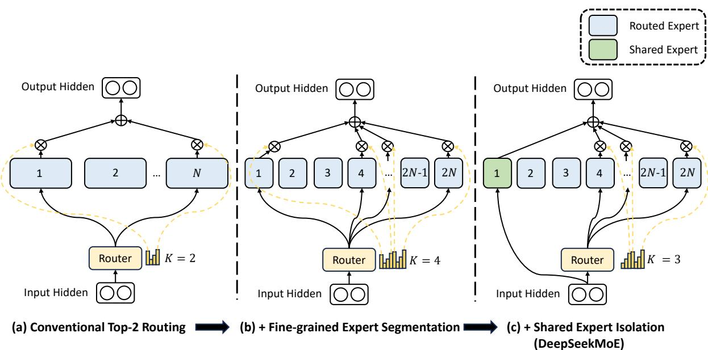
</div>

> **图片来源**：DeepSeekMoE（arXiv 2401.06066v1）Figure 2，§2 Preliminaries。本地副本：`references/papers/deepseek-moe/deepseek-moe.md` 第 74 行引用图。本文与 `torch/deepep/pics/` 里那张是同一份素材的两份副本，各自引用、互不跨目录链接。

**同一份计算量被拆给了更多专家，意味着每个 token 要触达的专家数变多，All-to-All 的通信结构随之改变。** 这正是 DualPipe 要面对的通信形状：计算量没变，但通信从「可有可无的边界开销」变成了「与计算同量级的关键路径」。所谓「同量级」出自 DeepSeek-V3 报告对 DualPipe 动机的表述，报告原话是该模型训练时「computation-to-communication ratio of approximately 1:1」。

两种等待的区别可以这样对照：

| 等待类型 | 直接原因 | 谁能解决 |
| --- | --- | --- |
| 流水线气泡 | 当前设备没有依赖已满足的 stage 任务 | 外层调度：改 microbatch 数、改前反向后顺序、细拆 stage、双向喂数据 |
| stage 内部通信等待 | 当前计算依赖尚未完成的 All-to-All 结果 | 内层执行：找出与这次通信无关、却可以立刻推进的计算来盖住它 |

所以：

> **外层调度负责让设备有任务可做，内层执行负责让任务在跑的时候不必一直等通信。**

DualPipe 同时动了这两层，这也是它比一般的调度改进更难讲清楚的原因：只实现外层那部分，你得到的是一张更满的调度图；只实现内层那部分，你没有足够的独立任务可以拿来盖通信。真正想要的是「可持续配对执行的前向与反向」这件事，而**提供独立配对的任务本身并不需要双向布局**：1F1B 的稳态配对 $(F_{k+p-r-1}, B_k)$ 在 $r < p-1$ 时本来就是两个不同 microbatch、彼此没有数据依赖，Megatron 只用单向的 interleaved 1F1B 再多做一个 warm-up 前向，就能在所有 rank 上拿到独立配对（源码注释写得很明白：`This is needed to ensure the forward and backward computations are independent in all 1f1b steps`）。双向布局换来的是另外两样东西：不必额外加 warm-up，以及把配对依赖的深度按 $p/2$ 而不是 $p$ 计。至于为什么一个前向块内部会有这么大一段通信要藏，DeepSeek-V3 报告 Figure 4 给出的答案是重排算子顺序，把 dispatch、combine 与 P2P 都塞进计算块之间的空隙里：

<div style="text-align: center; width: 100%; margin: 0 auto;">
    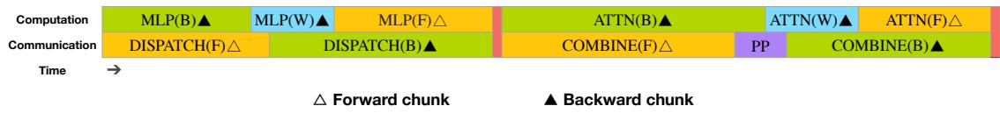
</div>

> **图片来源**：DeepSeek-V3 Technical Report（arXiv 2412.19437v2）Figure 4，§3.2.1。本地副本：`references/papers/deepseek-v3-report/deepseek-v3-report.md` 第 291 行引用图。这张图只讲**一对 chunk 内部**算子的重排，不给出全局调度；全局调度在第五章的官方调度图里讲，两者不要混引。

社区里有一张图把「串行」与「重叠」的差别画得更直白，它把 EP 1F1B 的三种排布并排放：上排是计算与通信串行，下左是通信被计算盖住，下右是同样思想的 Dense 1F1B：

<div style="text-align: center; width: 100%; margin: 0 auto;">
    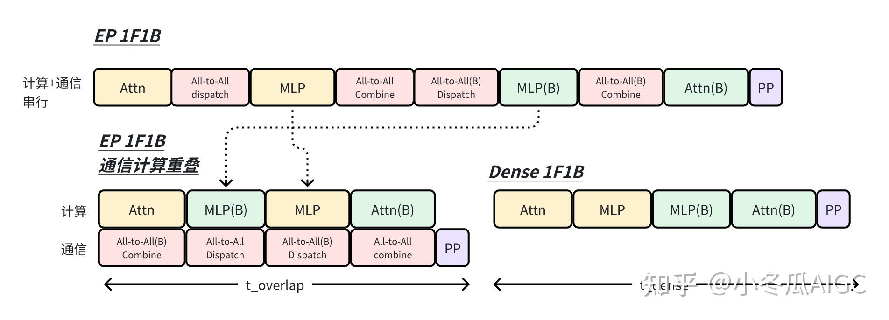
</div>

> **图片来源**：知乎 小冬瓜AIGC《【手撕DualPipe】让我们一步步把 MoE EP 通信「消除」》（<https://zhuanlan.zhihu.com/p/1910995677451912435>）。本地副本：`references/articles/xiaodonggua-shousi-dualpipe/xiaodonggua-shousi-dualpipe.md` 第 59 行引用图。**层级说明**：这是社区作者自绘的示意图，不是论文原图；它表达的重叠思想与 DeepSeek-V3 Figure 4 一致，但算子切分粒度更粗，引用时以 Figure 4 为准。

到这里可以给出本文的驱动问题了，因为读者此时已经同时握有两块背景：

> 调度图上的稳态区域可以被 F、B 方块填满，但每个方块内部还有一段由 All-to-All 造成的等待。既然这段等待不能用「多塞几个 microbatch」消掉，那么设备上必须存在**另一段与这次通信没有任何依赖关系的计算**。这段计算从哪里来？

后面从反向拆分讲到 V 形布局、再讲到框架侧的执行计划，都是在回答这一句话。

---

## 二、反向可以拆开：I / W 与一套不混淆的记号

### 2.1 先把 B 的两套含义分开

参考资料之间最容易混淆的符号是 `B`。Zero Bubble 论文把反向拆成两个部分，其中 `T_B` 指的是**输入梯度**那一部分；而 DeepSeek 官方 README 的比较表里，`B` 明确指**完整反向**。直接拼接这两套公式，结果会差一个 `W`。

所以本文统一列一套记号，后面所有公式都以它为准：

| 记号 | 含义 | 单位 |
| --- | --- | --- |
| $p$ | 流水线组里的**物理设备数** | 台 |
| $s$ | 一份完整模型经过的**逻辑 stage 数** | 个 |
| $m$ | 一次逻辑训练迭代的**总 microbatch 数** | 个 |
| $b$ | 一个 microbatch 里的样本数 | 个 |
| $F$ | 前向计算，或它的耗时 | 时间 |
| $I$ | 输入梯度计算（input gradient，也称 dgrad） | 时间 |
| $W$ | 参数梯度计算（weight gradient，也称 wgrad） | 时间 |
| $B_{\mathrm{full}}$ | 完整反向；在本文的等时简化里 $B_{\mathrm{full}} = I + W$ | 时间 |
| $C$ | 一个前向与一个完整反向**配对执行**后的耗时，即官方 README 的 $F\&B$ | 时间 |
| $A$ | 一个 stage、一个 microbatch 的激活占用 | 显存 |

这里有两件事必须先说清，否则后面每一张表都会被读错。

**第一，$W$ 不是优化器更新。** $W$ 只负责算出参数梯度，优化器在那之后才用梯度改参数。这个区分重要，因为「延迟 $W$」延迟的只是梯度计算，而「延迟优化器更新」会改变训练语义，两者的实现难度完全不同。

**第二，$C$ 的取值需要明确，它落在 $\max(F, B_{\mathrm{full}}) \le C \le F + B_{\mathrm{full}}$ 这个区间里。** 官方 README 对 $F\&B$ 的定义是「the execution time of two mutually overlapped forward and backward chunks」，也就是两个 chunk 被摆在一起时的实际耗时。左端要求两块计算真正并排执行，右端只要求它们的通信被藏起来；**官方材料（DeepSeek-V3 报告 Figure 4 与官方调度图）站在右端**，第七章会说明怎么从调度图的格子数验证这一点。取哪一端会让气泡差一倍，所以任何一个引用这张表的结论都必须写明用的是哪一端。

### 2.2 输入梯度与参数梯度的可分离性

先不看 Transformer，只看一个没有 bias 的线性层：

$$
Y = X\Theta^\top .
$$

设 $X\in\mathbb{R}^{N\times H_{\mathrm{in}}}$、$\Theta\in\mathbb{R}^{H_{\mathrm{out}}\times H_{\mathrm{in}}}$、$G = \partial L / \partial Y \in \mathbb{R}^{N\times H_{\mathrm{out}}}$，那么反向其实是两次形状不同的矩阵乘：

$$
\underbrace{\frac{\partial L}{\partial X} = G\Theta}_{I},
\qquad
\underbrace{\frac{\partial L}{\partial\Theta} = G^\top X}_{W}.
$$

取一组具体的数：$X$ 是 `[4, 8]`、$\Theta$ 是 `[16, 8]`、$Y$ 与 $G$ 是 `[4, 16]`，于是 $I$ 得到 `dX [4, 8]`，$W$ 得到 `dTheta [16, 8]`。只要 $G$ 已经拿到，并且前向时保存下来的 $X$ 还在，这两个乘法**都不需要等对方**：

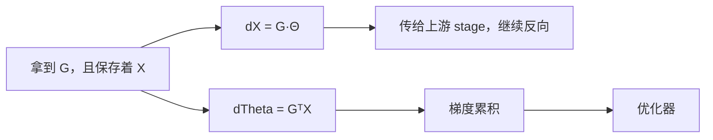
```mermaid
flowchart LR
    G["拿到 G，且保存着 X"] --> I["dX = G·Θ"]
    G --> W["dTheta = GᵀX"]
    I --> UP["传给上游 stage，继续反向"]
    W --> ACC["梯度累积"] --> OPT["优化器"]
```

**$W$ 在数学上并不依赖已经算出的 dX。** 真实的 stage 包含多个算子，某些参数梯度仍然要等后面算子把梯度传回来，但这不改变那条关键事实：**输入梯度传播完毕，与全部参数梯度算完，不是同一个完成事件。** Zero Bubble 论文 Figure 1 用 MLP 的计算图把这件事画清楚了：前向与反向分成两栏，反向栏里再切成 `B` 与 `W` 两块，橙色的矩阵乘框标出各自的来源。

<div style="text-align: center; width: 100%; margin: 0 auto;">
    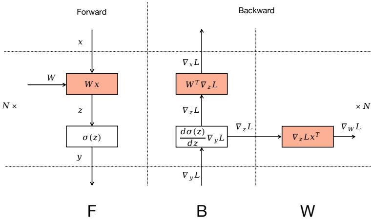
</div>

> **图片来源**：Zero Bubble Pipeline Parallelism（arXiv 2401.10241v1）Figure 1，§2。本地副本：`references/papers/zero-bubble/zero-bubble.md` 第 23 行引用图。这张图的作用是**定义记号**，不是调度对比图。

论文还给出了每个 pass 的量化口径，Table 1 里 hidden 维在 FFN 内是 $4h$、每个 attention head 的维度是 $h/a$，只统计矩阵乘的 FLOPs：

| Pass | FLOPs | 需要保存的激活 |
| --- | --- | --- |
| F | $sbh(24h+4s)$ | 0 |
| B | $sbh(24h+8s)$ | $sb(34h+5as)$ |
| W | $sbh(24h)$ | $32sbh$ |

由此得到论文自己的两条结论：$T_W < T_F < T_B$，以及 $T_B + T_W = 2T_F$（把第 1、3 行相加正好是第 2 行的两倍）。**注意这两个式子是 FLOPs 层面的解析近似，不是实测值**；论文 Table 9 的 profiled 数据与它们并不完全自洽：1.5B 模型那三行都相差约 26%（以 $p=8$、$m=24$ 为例，$T_F=18.522$、$T_B=18.086$、$T_W=9.337$，$T_B + T_W = 27.423$ 对 $2T_F = 37.044$），其余模型在 13.7% 到 18.1% 之间；而且 12 行**全部**是 $T_B < T_F$，与论文正文声明的 $T_F < T_B$ 相反。两种口径不能混用。本文后面凡是写「等时假设 $F = I = W = t$」的地方，指的都是论文 §2 手工调度分析所用的理想化前提，而不是实测结论。

### 2.3 优先 $I$ 的调度依据与前提

假设 Stage 2 正在反向。它一旦完成 $I$，就可以把输入梯度传给 Stage 1，让 Stage 1 立刻开工；而 Stage 2 的 $W$ 是否算完，通常不影响 Stage 1 对当前 microbatch 的反向。因此调度优先级可以从

> 完成 Stage 2 的全部反向 → 把梯度传给 Stage 1

改成

> 完成 Stage 2 的 $I$ → 尽早把梯度传给 Stage 1 → Stage 2 在合适的时机再补 $W$

这缩短的是**跨 stage 的反向依赖链**，并没有减少任何必须计算的参数梯度。**但这里有一个容易被跳过的前提：「优先 $I$」是一条调度策略，不是数学必然。** 对单个线性算子，$I$ 与 $W$ 确实互不依赖；但一段真实 stage 里可能有算子（例如需要沿序列维归约的部分）让某些参数梯度的可用时间晚于输入梯度。调度器能保证的只是「不因为等 $W$ 而挡住下游」，而不是「所有 $W$ 都能被推到任意靠后的位置」。

### 2.4 延迟 $W$ 的显存代价

因为算 $d\Theta = G^\top X$ 仍然需要 $X$ 与 $G$。输入梯度已经发走，并不代表这个 microbatch 的所有中间数据都可以释放。

> **延迟 $W$ 的显存代价，就是那些「只为了参数梯度而继续保留」的张量。**

Zero Bubble 论文明确区分了这两类存储：做完 $B$ 之后，一部分激活不再被需要，但为了 $W$ 还要额外留下一些梯度（论文 Figure 1 里的 $\nabla_z L$）。Table 1 给出的量是 $W$ 侧 $32sbh$ 对 $B$ 侧的 $sb(34h+5as)$，论文明说 $M_W < M_B$。这个不等式是后面 ZB-H1 能保持与 1F1B 相同峰值激活的关键。

### 2.5 用一个可运行的最小版本验证

上面这套说法可以压缩成一个只做一件事的实验：**前向照常执行，反向先返回输入梯度，把参数梯度留到之后算。** 它不是 DualPipe，也没有任何通信，但它是后面所有调度的地基。

```python
class SplitLinear(torch.autograd.Function):
    @staticmethod
    def forward(ctx, x, theta):
        ctx.save_for_backward(x, theta)
        return x @ theta.T

    @staticmethod
    @torch.autograd.function.once_differentiable
    def backward(ctx, g):
        x, theta = ctx.saved_tensors
        # 为稍后的 W 保留 X 与 G；detach 只切断计算图，不释放底层存储
        pending.append((theta, x.detach(), g.detach()))
        # 现在只返回输入梯度，参数位置返回 None
        return g @ theta, None
```

完整脚本在 `codes/01_split_backward_minimal.py`，它同时检查三件事：`loss.backward()` 返回之后 `theta.grad` 仍然是 `None`；拆分版的 `dX` 与常规 autograd 逐元素一致；补算 `W` 之后 `dTheta` 也一致。本机实测（PyTorch 2.10.0+cu129，CPU，float64，`x` 为 `[8,8]`、`theta` 为 `[16,8]`、2 个 microbatch）结果是：

```text
backward 返回后 dTheta is None : True
max |dX_split - dX_ref|        : 0.000e+00
max |dTheta_split - dTheta_ref|: 1.110e-16
PASS
```

这三点里最重要的是第三点：**参数梯度不完成，就不能执行 `optimizer.step()`**；如果在清空延迟队列之前更新参数，训练的数学语义就变了，而不是「结果略有偏差」。这个脚本还刻意省略了 bias、混合精度、分布式梯度归约、`checkpoint` 与高阶梯度，手工写 `.grad` 也不能当成 DDP/FSDP 的通用接入方式。

---

## 三、1F1B：气泡、显存与 warmup 规律

### 3.1 朴素 micro-batch 流水线的气泡基线

要说明 1F1B 改了什么，先要有基线。GPipe 论文 Figure 2 把三件事画在同一张图上，读的时候必须点名子图，否则很容易把不同量级的东西混在一起。按论文图注：(a) 是**被切到四张卡上的网络结构图**（画的是层与层之间的连接，不是时间轴）；(b) 是**朴素的模型并行**，也就是每个设备算完自己的前向再算反向、设备之间几乎串行，利用率极低；(c) 才是 micro-batch 流水线，并且网格中部显式标出了 `Bubble`。

<div style="text-align: center; width: 100%; margin: 0 auto;">
    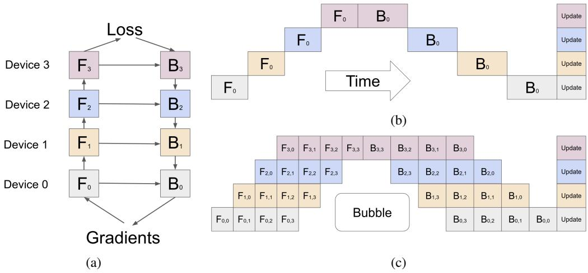
</div>

> **图片来源**：GPipe（arXiv 1811.06965）Figure 2，§2。本地副本：`references/papers/gpipe/gpipe.md` 第 53 行引用图。**$(p-1)(F+B)$ 这条气泡基线只对应子图 (c)**；把 (b) 的「近乎零利用率」当成气泡量级会把结论放大一个数量级，而 (a) 是结构图、本身无所谓利用率。

AIInfra 教材页给了一张把 flush 与 idle 标得更清楚的 GPipe 时间轴，两张图放在一起看会更直观：

<div style="text-align: center; width: 100%; margin: 0 auto;">
    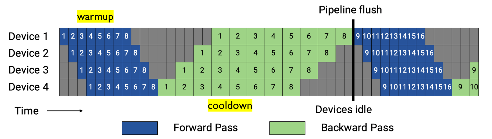
</div>

> **图片来源**：Infrasys-AI AIInfra 教材页《PP 并行：1F1B/1F1B Interleaved》（<https://infrasys-ai.github.io/aiinfra-docs/04Train02ParallelAdv/08PPInterleaved.html>），对应源文件 `10pipeline01.png`。本地副本：`references/docs/aiinfra-pp-1f1b-interleaved/aiinfra-pp-1f1b-interleaved.md` 第 13 行引用图。**该图是教材示意图，不是论文原图。**

### 3.2 1F1B 的状态划分和配对关系

**1F1B（One Forward One Backward）指设备进入稳态之后交替执行一个前向与一个反向，而不是训练一开始就这样。** 对一个设备持有一个 stage 的标准流水线，rank $r$ 的 warmup 前向数是

$$
n_{\mathrm{warmup}}(r) = \min(p-r-1,\; m).
$$

Megatron-LM 的非交错实现就是按 warmup、steady、cooldown 三段组织的，`num_warmup_microbatches` 先取 `pipeline_parallel_size - pipeline_parallel_rank - 1` 再被 `total_num_microbatches` 截断，剩下的交给稳态循环（以下行号按 tag `core_v0.19.0`：`megatron/core/pipeline_parallel/schedules.py:926-950`）。AIInfra 教材页把这段阶梯画得很清楚，图中还标出了最后一个 stage 的 `num_warmup_microbatches = 0`：

<div style="text-align: center; width: 100%; margin: 0 auto;">
    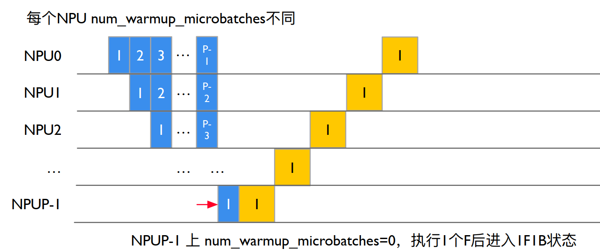
</div>

> **图片来源**：Infrasys-AI AIInfra 教材页《PP 并行：1F1B/1F1B Interleaved》，对应源文件 `10pipeline10.png`。本地副本：`references/docs/aiinfra-pp-1f1b-interleaved/aiinfra-pp-1f1b-interleaved.md` 第 346 行引用图。该页第 346 行的 alt 文本误写为「args 超参设置」，与画面不符，本文不沿用。

以 $p=4$、microbatch 足够多为例，warmup 前向数与第一组稳态配对的对应关系是：

| rank $r$ | warmup 前向数 $\min(p-r-1,m)$ | 第一组稳态配对 |
| ---: | ---: | --- |
| 0 | 3 | $(F_3, B_0)$ |
| 1 | 2 | $(F_2, B_0)$ |
| 2 | 1 | $(F_1, B_0)$ |
| 3 | 0 | $(F_0, B_0)$ |

所以稳态的配对关系可以写成

$$
\boxed{(F_{k+p-r-1},\; B_k)}
$$

或者等价地写成 $(F_x, B_{x-(p-r-1)})$。**这个下标差的含义是：当前 stage 需要让多少个 microbatch 处于「已经前向、尚未完成反向」的状态，流水线才不会断。** 换句话说，1F1B 是用「在途 microbatch 数」换来了「气泡不随 $m$ 增长」。

Zero Bubble 论文 Figure 2 是这条基线最干净的画法：整图只有 Forward、Backward、Optimizer step 三种颜色，**没有任何 W 格**，因此它不能用来讨论反向拆分。

<div style="text-align: center; width: 100%; margin: 0 auto;">
    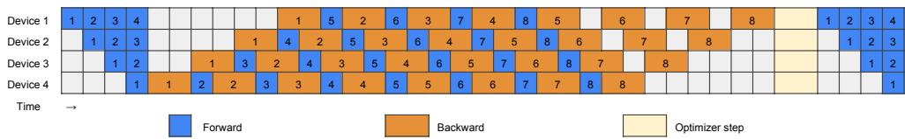
</div>

> **图片来源**：Zero Bubble Pipeline Parallelism（arXiv 2401.10241v1）Figure 2，§2。本地副本：`references/papers/zero-bubble/zero-bubble.md` 第 38 行引用图。它是与 Figure 3 完全独立的两个文件（1026×159 与 1032×310），不存在「1F1B 与手工调度在同一图块」的情况。

AIInfra 教材页另有一张把 warmup、稳定、cooldown 三段与 microbatch 编号都标全的 1F1B 时间轴，可以作为基线速查：

<div style="text-align: center; width: 100%; margin: 0 auto;">
    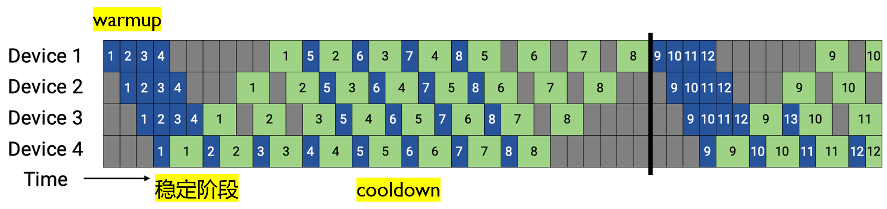
</div>

> **图片来源**：Infrasys-AI AIInfra 教材页《PP 并行：1F1B/1F1B Interleaved》，对应源文件 `10pipeline02.png`。本地副本：`references/docs/aiinfra-pp-1f1b-interleaved/aiinfra-pp-1f1b-interleaved.md` 第 29 行引用图。**教材示意图，不是论文原图。**

### 3.3 显存上的含义

在上述简化模型下，rank $r$ 最多同时保留约 $\min(m, p-r)$ 个 microbatch 的反向所需激活。假设各 stage 均匀划分、每个 stage 每个 microbatch 的激活占用为 $A$，峰值约为 $\min(m,p)A$；当 $m \ge p$ 且 $A = A_{\mathrm{all}}/p$（$A_{\mathrm{all}}$ 是不切流水线时一个 microbatch 的全部激活）时：

$$
pA = A_{\mathrm{all}}.
$$

这解释了为什么在某些理想分析里，1F1B 的最坏 rank 激活峰值与「完整模型上跑一个 microbatch」相同。**但这个等式不能推广成「流水线并行不省显存」**：参数、梯度与优化器状态已经被切开；`checkpoint` 重计算会改变激活项；层划分通常不均匀（例如第一个与最后一个 stage 少放一层以补偿 embedding 与 loss 的开销）；microbatch 大小与序列长度也会改变结论。等式成立的前提是「均匀划分 + 不做重计算 + 忽略所有通信 buffer 与临时张量」。

### 3.4 时间上的含义

忽略通信、假设 stage 均衡，1F1B 一次迭代的总时长是

$$
T_{\mathrm{1F1B}} = (m + p - 1)\,(F + B_{\mathrm{full}}),
$$

其中有效工作与气泡分别是

$$
T_{\mathrm{busy}} = m(F + B_{\mathrm{full}}), \qquad
T_{\mathrm{bubble}} = (p-1)(F + B_{\mathrm{full}}),
$$

于是气泡率为

$$
\beta_{\mathrm{1F1B}} = \frac{p-1}{m+p-1}.
$$

这条总时长公式的两部分分别有出处：论文 Table 2 直接给出 1F1B 的气泡是 $(p-1)(T_F+T_B+T_W)$，与上面的 $T_{\mathrm{bubble}}$ 一致；有效工作 $m(F+B_{\mathrm{full}})$ 就是 $m$ 个 microbatch 各做一次前向与一次完整反向。两者相加即得总时长。论文附录另有一句「an 1F1B iteration takes $(m+p-1)(T_F+T_B+T_W)$」，但那是在 $m \le p$ 且忽略通信的粗略分析里写的，**本文引用的是 Table 2 的气泡加有效工作，不受那个前提限制**。

**注意这里和官方 README 的写法并不矛盾，只是口径不同。** README 的比较表写 1F1B 的气泡是 $(PP-1)(F+B)$，那是**时长**口径；$\beta_{\mathrm{1F1B}}$ 是**比率**口径，两者之间差一个 $T_{\mathrm{busy}}$。第七章重算比较表时会明确写出用的是哪一种。

1F1B 的结论是：增加 $m$ 能摊薄固定的边界开销，但它完全没有触及「一个 F 或 B 方块内部的通信等待」。而下一章要用的工具，恰好是从这个未解决的问题里长出来的：如果完整反向可以被拆开，那条被它拉长的跨 stage 依赖链就未必需要保持完整。

---

## 四、Zero Bubble：把不必立即完成的计算移出关键路径

### 4.1 ZB-H1 改变了什么

ZB-H1 的做法可以一句话概括：**保留与 1F1B 相同的峰值激活预算，但不再把完整反向当作不可拆分的一整块。** 它的稳态配对关系是在 1F1B 的基础上把 $W$ 再往后推：

$$
\left(F_x,\; I_{x-(p-1-r)},\; W_{x-(p-1)}\right).
$$

这里 $I$ 的序号随 rank 改变，而 $W$ 的序号只跟 $x$ 有关，说明 $W$ 被整体后移、与当前的流水线节奏解耦。用区间不等式可以直接把 warmup 与 cooldown 的分段推出来。稳态下标满足

$$
f_i = x \;\ge\; b_i = x-(p-1-i) \;\ge\; w_i = x-(p-1),
$$

于是在 warmup 阶段会先出现只有 $F$ 的情形（对应 $0 > b_i \ge w_i$，即 $x < p-1-i$，共 $p-1-i$ 个），再出现 $(F, I)$ 而 $W$ 仍未到（对应 $b_i \ge 0 > w_i$，即 $p-1-i \le x < p-1$，共 $i$ 个）；cooldown 阶段对称地先出现 $(I, W)$ 再出现只有 $W$。

Zero Bubble 论文 Figure 3 上栏就是这张调度：warmup 的 $F$ 数按行递减为 4/3/2/1，warmup 结束后每行仍留 3/2/1/0 个白格。**这些白格并没有被填掉，它们就是 ZB-H1 剩下的气泡**（每台设备合计 3 个空格，正好是 $(p-1)t$ 在 $p=4, t=1$ 下的值）；论文说的是「the tail-end bubbles are filled by the later-starting $W$ passes」，被 $W$ 填的是**尾部**那一段，不是 warm-up 后面这些空格。

### 4.2 论文给出的气泡与显存

论文 Table 2 直接给出了三个方案的气泡与峰值激活，这是本章所有结论的第一手依据：

| Schedule | Bubble size | Peak activations memory |
| --- | --- | --- |
| 1F1B | $(p-1)(T_F + T_B + T_W)$ | $pM_B$ |
| ZB-H1 | $(p-1)(T_F + T_B - T_W)$ | $pM_B$ |
| ZB-H2 | $(p-1)(T_F + T_B - 2T_W)$ | $(2p-1)M_B$ |

把它换成本文的记号（$T_B = I$、$T_W = W$、$T_F = F$，且 $B_{\mathrm{full}} = I + W$）就得到

$$
T_{\mathrm{bubble,H1}} = (p-1)(F + I - W) = (p-1)\left(F + B_{\mathrm{full}} - 2W\right),
$$

$$
T_{\mathrm{bubble,H2}} = (p-1)(F + I - 2W) = (p-1)\left(F + B_{\mathrm{full}} - 3W\right).
$$

在等时假设 $F = I = W = t$ 下，1F1B 的气泡是 $3(p-1)t$，H1 降到 $(p-1)t$，也就是论文正文说的「reduced to a third of 1F1B's size」；H2 则是 $(p-1)(t + t - 2t) = 0$，即论文说的平行四边形、零气泡。

下面有两处需要自己算一遍才不会读错的地方。

**第一，H1 的气泡为什么能写成两种形式。** $(p-1)(F+I-W)$ 与 $(p-1)(F + B_{\mathrm{full}} - 2W)$ 是同一个式子，因为 $B_{\mathrm{full}} = I + W$。这个替换看起来平淡，但它说明「H1 省下的 $2W$」不是凭空来的，而是把 $B_{\mathrm{full}}$ 中两个 $W$ 的位置挪到了尾部填气泡。

**第二，H2 的「零气泡」不是仅靠拆 $B$ 就能拿到的。** 论文 §4 专门讨论了绕过优化器阶段同步的问题：常规做法下每个 stage 都要参与全局梯度范数裁剪与 NaN/INF 检查的 all-reduce，这个同步点会把平行四边形切掉，零气泡就不成立。论文 Figure 4 画的就是它的替代机制：先沿对角线传播局部归约值（橙块 1 到 4），再做一次全局归约并把结果回传给各 stage（橙块 5 到 8），optimizer step（米色）因此可以逐行错位，并保留一条在 validation 失败时回滚（深红）的通路。

<div style="text-align: center; width: 100%; margin: 0 auto;">
    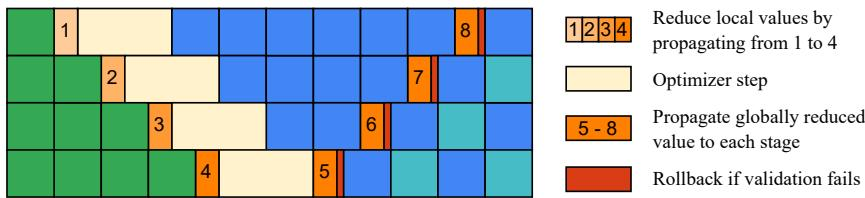
</div>

> **图片来源**：Zero Bubble Pipeline Parallelism（arXiv 2401.10241v1）Figure 4，§4 Bypassing Optimizer Synchronizations。本地副本：`references/papers/zero-bubble/zero-bubble.md` 第 94 行引用图。

### 4.3 ZB-H2 多付了什么

论文对两个手工调度的激活给出了按 worker 编号的公式：worker $i$ 的激活是

$$
(p - i + 1)M_B + (i-1)M_W \quad\text{(ZB-H1)},
\qquad
(2p - 2i + 1)M_B + (2i-2)M_W \quad\text{(ZB-H2)}.
$$

由于 $M_W < M_B$，H1 的峰值出现在 $i=1$，即 $pM_B$；H2 的峰值同样是 $i=1$，即 $(2p-1)M_B$。**H2 用大约两倍的激活换来了零气泡**，注意峰值是 $(2p-1)M_B$ 而不是 $2pM_B$，后者只是 $p$ 较大时的近似。论文没有解释「H1」「H2」这两个编号的含义；本文只报告一个观察，即二者与 1×/2× 的内存预算恰好对应，也与该论文 §5 里 ZB-1p / ZB-2p 的命名平行，但这是观察而不是原文结论。

### 4.4 ZB-H1 / H2 的调度长什么样

论文 Figure 3 把两个手工调度上下并排放在一张图里，这是全文最值得逐格看清的一张图：

<div style="text-align: center; width: 100%; margin: 0 auto;">
    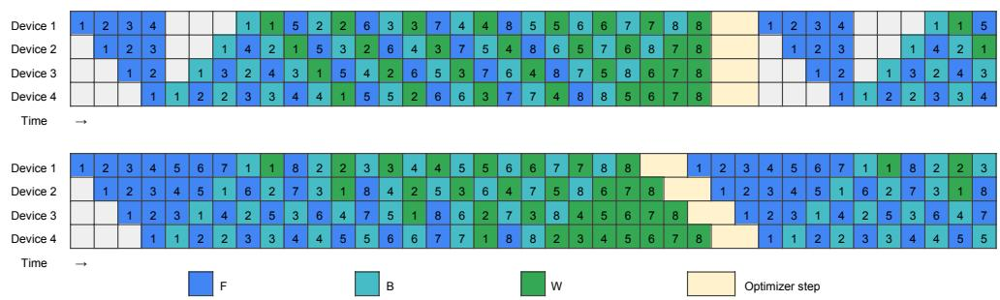
</div>

> **图片来源**：Zero Bubble Pipeline Parallelism（arXiv 2401.10241v1）Figure 3，§2.1 Memory Efficient Schedule 与 §2.2 Zero Bubble Schedule。本地副本：`references/papers/zero-bubble/zero-bubble.md` 第 41 行引用图（图注在第 42 行）。

两处读图就能验证的差别，正好对应本章的两个结论：warm-up 的 $F$ 数从 4/3/2/1 增加到 7/5/3/1，而 **7 = 4+3、5 = 3+2、3 = 2+1、1 = 1+0**：每一行新铺的前向数恰好等于 H1 同一行留下的白格数，也就是说 H2 是**用多铺的前向把 H1 的气泡逐个填掉**的；H1 上栏在 warm-up 之后每行还留 3/2/1/0 个白格、H2 下栏同一位置没有白格，说明 H2 的平行四边形确实把气泡清空了，代价就写在 4.3 节那两个激活公式里。

**W 在这张图里的位置说明了一件重要的事：$I$ 优先、$W$ 可延迟是一条调度策略，而不是数学必然。** 图上 $W$ 只是被搬到了尾部，它的计算量一个都没有少。

到这里手上的工具已经很明确了：**把一部分不必立即完成的计算从关键路径上移开。** 但 MoE 还有一个问题没解决：$F$ 与 $I$ 的内部也可能整段在等 All-to-All。这正是第一章末尾那个驱动问题的落点，也是 DualPipe 要接手的部分。

## 五、DualPipe：双向布局提供了什么，代价是什么

### 5.1 「双向」不是 DualPipe 第一次提出的

在讨论 DualPipe 之前需要先纠正一个常见印象：双向流水线训练这件事，Chimera 在 2021 年就做过了。Chimera 论文 Figure 2 把五种调度放在同一根时间轴上对照（PipeDream 与 PipeDream-2BW 共用一组，另有 GPipe、GEMS、DAPPLE 与 Chimera），图里已经出现 `replica0` 与 `replica1` 两个副本的路径，以及右侧 `M_θ` 与 `M_a` 两根显存柱：

<div style="text-align: center; width: 100%; margin: 0 auto;">
    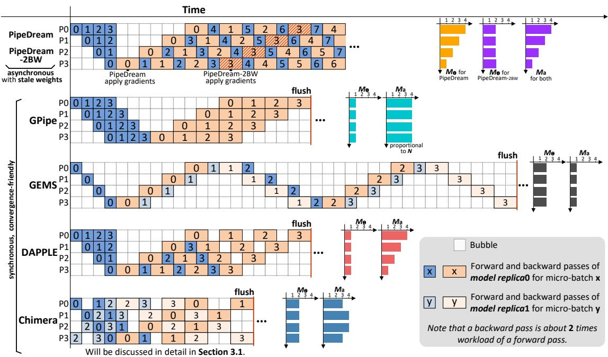
</div>

> **图片来源**：Chimera: Efficiently Training Large-Scale Neural Networks with Bidirectional Pipelines（arXiv 2107.06925，SC21）Figure 2。本地副本：`references/papers/chimera/chimera.md` 第 74 行引用图。注意这篇论文把「权重暂存 / 参数版本」的信息放在 Figure 2 右侧的 $M_\theta$ 小柱与表格的 Weights Memory 列里，**没有**独立插图。另外「气泡率、显存与吞吐三个口径」那句话出自 **Figure 1** 的图注，不是 Figure 2。

Chimera 的调度做法是让两份副本分别承担 down 与 up 两条流水线，再把它们合并成一张调度：

<div style="text-align: center; width: 100%; margin: 0 auto;">
    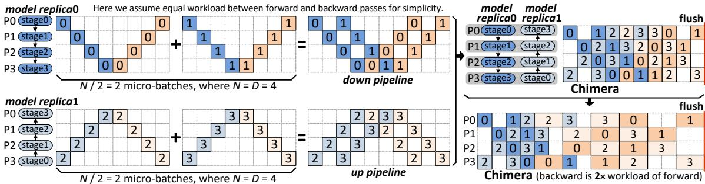
</div>

> **图片来源**：Chimera（arXiv 2107.06925）Figure 3。本地副本：`references/papers/chimera/chimera.md` 第 81 行引用图。**不要把 Figure 3 与 `forward doubling` 混为一谈**：Figure 3 画的是两个副本的 down/up 流水线合并；论文 §3.5「Scale to More Micro-Batches」里的 `forward doubling` 是微批次数多于设备数时用来减少中间气泡的技巧，做法是把每个前向的 micro-batch 数增至两个，以配平前向与反向的工作量。

所以 DualPipe 的贡献不能简化成「首次让数据从两端进入」。更有辨识度的地方在于：**它把双向布局、前反向配对、细粒度通信计算交错，以及边界上的反向拆分组合成一套适合大规模 MoE 训练的执行方案。** 其中「反向拆分」这一条明确继承自 Zero Bubble，而第四章刚讲过 Zero Bubble 的原始设定里并没有 MoE 通信这件事。

### 5.2 双向布局的两条路径

假设完整模型分成四段 $L_0, L_1, L_2, L_3$，原始 DualPipe 的概念布局是：

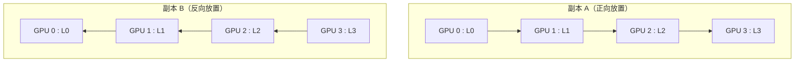
```mermaid
flowchart TB
    subgraph repA["副本 A（正向放置）"]
        direction LR
        A0["GPU 0 : L0"] --> A1["GPU 1 : L1"] --> A2["GPU 2 : L2"] --> A3["GPU 3 : L3"]
    end
    subgraph repB["副本 B（反向放置）"]
        direction RL
        B3["GPU 3 : L3"] --> B2["GPU 2 : L2"] --> B1["GPU 1 : L1"] --> B0["GPU 0 : L0"]
    end
```

副本 A 的输入从 GPU 0 进入，副本 B 的输入从 GPU 3 进入。**这不是把 token 顺序倒过来，也不是让第二份模型倒着算层**；两条路径都按完整模型的正常层顺序执行，只是参数在物理设备上的放置方向相反。官方示例把这层对应关系写得很直白，本地两份模块分别取自 `full_modules[rank]` 与 `full_modules[pp_size - 1 - rank]`。

如果一次迭代共有 $m$ 个 microbatch，两条路径通常各处理 $m/2$ 个。于是每个设备持有两个模型层段，这就是参数复制开销的来源：**每台设备要放两份参数，参数份额是标准 $p$-stage 划分下 `1x` 的两倍。**

### 5.3 两个方向的梯度必须合并

因为它们必须是**同一个模型的同步副本**，而不是两个各自训练的模型。对某个逻辑层 $\ell$，正确的总梯度应当同时包含两个方向的数据：

$$
g_\ell = \frac{1}{m}\left(\sum_{k \in A}\nabla_{\Theta_\ell} L_k + \sum_{k \in B}\nabla_{\Theta_\ell} L_k\right).

这里的 $1/m$ 是「按 microbatch 数取平均」的归一化约定，**它必须与框架实际的 loss 口径一致**：官方示例是逐 microbatch 调一次 `F.mse_loss` 并直接累加、不除以 $m$，那时等价的写法就是不带 $1/m$ 的求和。把归一化显式写出来，比事后排查梯度差一个 $m$ 倍要省事得多。
$$

如果两个方向各自更新、不合并梯度，两份参数就会逐渐分叉。官方示例用一个相当直接的办法验证这件事：在 `step()` 之后，把本地两个 chunk 的参数梯度各做一次 `all_gather_into_tensor`，再把镜像位置的梯度加回来（索引是 `pp_size - 1 - rank`），最后与单卡参考实现的梯度比较。**这是一段演示代码，不是生产级做法**：它在整个 PP 组上做全收集，通信量远大于实际需要的两两交换，而且直接对 `.grad` 做加法绕过了标准梯度归约路径。它能证明的是「调度器把两个方向的梯度都算对了」，不能证明「公开调度器已经替应用实现了完整的优化器与副本同步流程」。

### 5.4 稳态配对 $(F_0, B_1, F_1, B_0)$ 的下标推导

下标 0、1 表示本地的两个方向或 chunk，不是 microbatch 编号。稳态可以反复执行

$$
\boxed{(F_0,\; B_1), \qquad (F_1,\; B_0)}
$$

这里当前方向的前向，与另一方向较早 microbatch 的反向配成一组。**它们之间没有「这个 F 必须等这个 B 结束」的直接数据依赖**（上半区第 $r$ 台设备上，$F_0$ 处理方向 0 的某个 microbatch、$B_1$ 处理方向 1 的另一个 microbatch，两者来自两份不相交的数据），这就是第一章驱动问题的答案里「独立计算」那一半。需要说准的是：**这种独立性并不是双向布局独有的**（见第一章末尾的说明），双向布局的贡献是让它在不额外增加 warm-up 的前提下、以 $p/2$ 的依赖深度稳定出现。

在写下标公式之前，先把 virtual device 类型调度的通用规则列出来，因为它是判断配对是否合法的依据（这套规则对 1F1B 与 DualPipe 都适用，区别只在于 stage 与设备的对应关系）：

1. **单个 chunk 单个 microbatch 在单个 stage 内必须遵循 $F \to B \to W$ 的顺序**，W 只能出现在同 stage 同 chunk 的 B 之后；
2. **同一 stage 内同一 chunk、同一类计算，小 microbatch 编号必须排在大编号之前**；
3. **跨 stage 依赖按方向分别定义**：正向放置的 chunk（副本 A）里，stage $i$ 的前置是 $i-1$、后置是 $i+1$；反向放置的 chunk（副本 B）里恰好相反，stage $i$ 的前置是 $i+1$、后置是 $i-1$。

在这套规则下，只看上半区 $0 \le r < p/2$（用 $r$ 表示 `half_rank`，见 8.2 节），稳态里编号为 $x$ 的那一组配对可以写成

$$
\boxed{
\left(
F_{0,\,x},\;
B_{1,\,x-p/2},\;
F_{1,\,x-p/2+1+r},\;
B_{0,\,x-p+1+r}
\right)
}
$$

**这个公式值得逐个代入验证一次，因为它同时约束了四个方向的进度。** 取 $p=8$、$r=1$、$x=8$ 得到 $(F_{0,8},B_{1,4},F_{1,6},B_{0,2})$，与草稿给出的例子一致。但更值得弄清楚的是 $x$ 为什么不能随便取：在 `p=8, m=20` 下，$r=1$ 的设备在进入稳态之前已经完成了 6 个 $F_0$、2 个 $B_1$、4 个 $F_1$，因此**第一组稳态工作的 $x$ 必然是 6**，代入公式得到 $(F_{0,6},B_{1,2},F_{1,4},B_{0,0})$。第一组可以用 `codes/02_schedule_sim.py` 直接复现：脚本逐行镜像官方 `step()` 的循环结构与任务次序，把每个 rank 在 step 4 第一轮的四个计数器打出来，`--p 8 --m 20` 时 rank 1 打印的就是 `F0_6, B1_2, F1_4, B0_0`（即 $x=6$）。第二组（$x=8$）脚本不会打印，因为它只记录主步的第一轮，而主循环每往前走一轮，四个计数器同步加一，所以 $x=8$ 那组由 $x=6$ 那组各加 2 推出。**换句话说，公式里的 $x$ 不是自由参数，它由 warmup 阶段已经推进的工作量决定。**

参数 $r$ 的取值范围 $0 \le r < p/2$ 也不是附加条件，它是「只看上半区」这句话的直接结果：在上半区里，方向 1 的反向进度（下标 $x-p/2$）不落后于方向 0 的反向进度（下标 $x-p+1+r$），二者之差 $\frac{p}{2}-1-r \ge 0$ 正是 $r < p/2$ 这个取值范围的来由；一旦跨过中点，两个方向的名义就会互换，公式需要写成对称形式。官方实现里那个 `phase ^= self.is_in_second_half` 就是在做这件事。

### 5.5 官方调度图的读法

DeepSeek 官方仓库的 `images/dualpipe.png` 是 8 个 PP rank、双向合计 20 个 micro-batch（每方向 10 个）的完整调度图（图中反向方向的 microbatch 编号与正向对称，为简洁起见省略），**两个被同一个黑框圈住的格子表示这一段计算与通信是相互重叠的**：

<div style="text-align: center; width: 100%; margin: 0 auto;">
    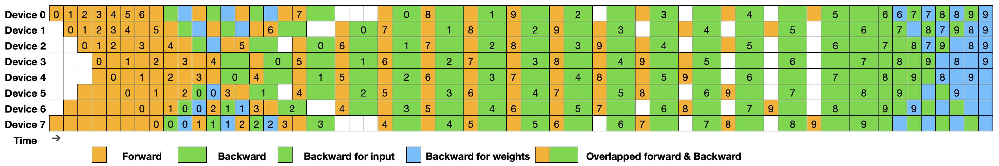
</div>

> **图片来源**：DeepSeek 官方仓库 `deepseek-ai/DualPipe`，commit `030ce4325f4ebeb437da4ebc6d00a70469dd58ae`，`images/dualpipe.png`。README 对该图的说明是「Example DualPipe scheduling for 8 PP ranks and 20 micro-batches in two directions」，也就是双向合计 20 个、每方向 10 个，这与官方示例里 `num_chunks = 20` 被 `half_num_chunks = num_chunks // 2` 切成两半的写法一致。本图与 DeepSeek-V3 报告 Figure 5 是同一张调度的两个版本，可互证。

同一个调度在论文里的版本是 Figure 5：

<div style="text-align: center; width: 100%; margin: 0 auto;">
    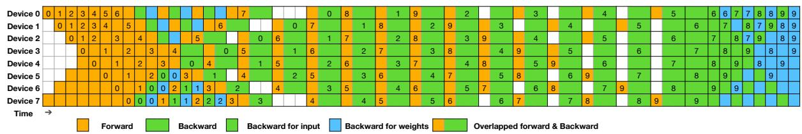
</div>

> **图片来源**：DeepSeek-V3 Technical Report（arXiv 2412.19437v2）Figure 5，§3.2.1。本地副本：`references/papers/deepseek-v3-report/deepseek-v3-report.md` 第 306 行引用图。**该图块只包含调度网格，不包含 Table 2**：Table 2 是同一个 md 文件第 310 行的独立 HTML 表格，MinerU 另存了一份独立裁图但 md 没有引用它。需要 Table 2 的公式时直接转写为 Markdown 表格，不要把表格截进这张图里一起引用。

社区文章里有作者在官方调度图上叠了红线，把整张图切成与 `step()` 八步对应的八段，这张图在读第八章的代码时很有用：

<div style="text-align: center; width: 100%; margin: 0 auto;">
    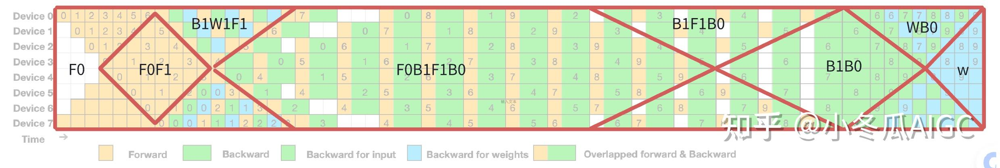
</div>

> **图片来源**：知乎 小冬瓜AIGC《【手撕DualPipe】让我们一步步把 MoE EP 通信「消除」》。本地副本：`references/articles/xiaodonggua-shousi-dualpipe/xiaodonggua-shousi-dualpipe.md` 第 606 行引用图。**层级说明**：底图是官方调度图，红色分段线与文字为社区作者添加，属于二手解读；分段结果与官方 `step()` 的八步结构一致，可以对照使用，但不要当成官方图引用。

最后一张对照图解决的问题是「为什么每台设备能拿到两个方向上的层段」：1F1B 里 pipe 0 到 pipe 7 各持一个 Layer，而 DualPipe 里 dual pipe 0 到 7 各持两个 Layer（0 与 7、1 与 6，依此类推），并且标出了 F0B0 与 F1B1 两个相反方向：

<div style="text-align: center; width: 100%; margin: 0 auto;">
    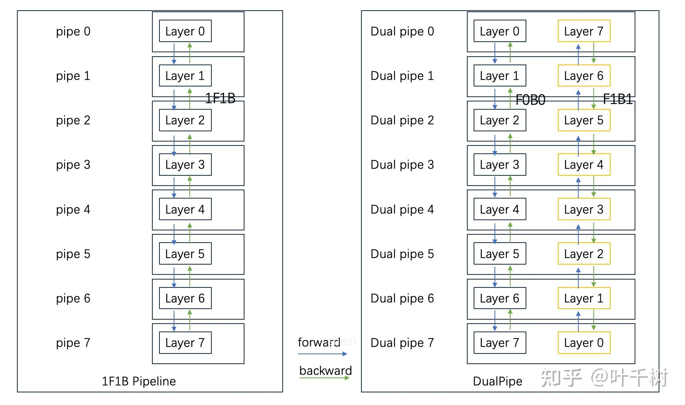
</div>

> **图片来源**：知乎 叶千树《理解DualPipe源码和pipeline实现逻辑》（2025-04-08）。本地副本：`references/articles/yeqianshu-dualpipe-source-walkthrough/yeqianshu-dualpipe-source-walkthrough.md` 第 59 行引用图。**层级说明**：社区作者自绘，用于解释层归属；它与官方 `example_dualpipe.py` 里 `full_modules[rank]` 与 `full_modules[pp_size - 1 - rank]` 的取值完全一致。

### 5.6 稳态最好的配对方式，不一定也是边界处最好的方式

官方实现在 `step()` 主循环的第一轮对中间 rank 做了一次特殊处理，并在源码里留了一句注释：`NOTE: We don't overlap these two chunks to further reduce bubble size.` 也就是说，这一步是**故意不重叠**的：它把 $F_0$ 与 $B_1$ 拆成两次顺序计算，两次计算都不做发送，随后把 $F_1$ 的输出、$F_0$ 的输出与 $B_1$ 的输入梯度三个发送操作一起挂起，等下一个提交点成批发出。**这说明「把两个方向配成一对」并不总是最优**：在 warmup 与 cooldown 的边界处，减少一次方块级重叠、把若干条消息合并成一批，反而能让整体气泡更小。官方注释只给了结论而没有展开论证，我这里也只能说到「合并发送比多叠一个方块更划算」这一层，具体的收益量级需要 profile 才能确认。

同样的道理也解释了另一个容易被误读的细节：**$(F_0,B_1,F_1,B_0)$ 是稳态的节奏，而不是整张调度图的模板。** 在调度图的两端，实际执行的是 $F_0$ 连做、$(F_0,F_1)$ 成对、$(I_1,W_1,F_1)$ 成组这样的混合形态，第六章会把这些形态逐段列出来。

---

## 六、DualPipeV：删掉参数副本，保留配对结构

### 6.1 从「双向」到「V 形」

第五章最后留下了一个具体代价：双向布局让每台设备放两份参数。既然双向布局的作用只是「让设备上同时存在两个可配对的 chunk」，那么自然要问：**能不能只保留配对结构，把两个方向的副本关系去掉？**

Sea AI Lab 给出的答案叫 cut-in-half。他们的博客里先把官方 DualPipe 调度图补全了反向方向的 microbatch 编号，并标注出 `The two parts are mirrored`，也就是说上下两半区逐格镜像：

<div style="text-align: center; width: 100%; margin: 0 auto;">
    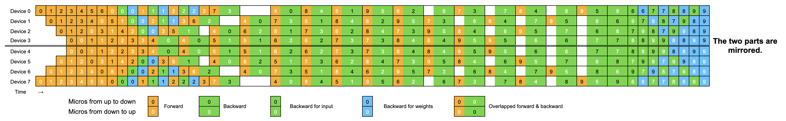
</div>

> **图片来源**：Sea AI Lab《双流并行(DualPipe) 没有双流会更好》（Penghui Qi、Xinyi Wan、Guangxing Huang、Min Lin，2025-02-27，<https://hackmd.io/@ufotalent/S1N_ay0ckx>，英文版 <https://hackmd.io/@ufotalent/r1lVXsa9Jg>）。本地副本：`references/articles/sea-ai-lab-cut-in-half/sea-ai-lab-cut-in-half.md` 第 19 行引用图。**层级说明**：这张图是按官方 DualPipe 调度重绘的版本（尺寸与图例样式都与官方 `dualpipe.png` 不同），补全了反向方向的 micro-batch 编号并加了 `The two parts are mirrored.` 标注，属于 Sea AI Lab 作者的加工。官方 README 明确致谢了这项工作：「DualPipeV is a concise V-shape schedule derived from DualPipe using a "cut-in-half" procedure, introduced by Sea AI Lab」。

既然镜像，就可以只保留一半设备，把下方的编号接到上方的尾部，得到一张更窄的调度：

<div style="text-align: center; width: 100%; margin: 0 auto;">
    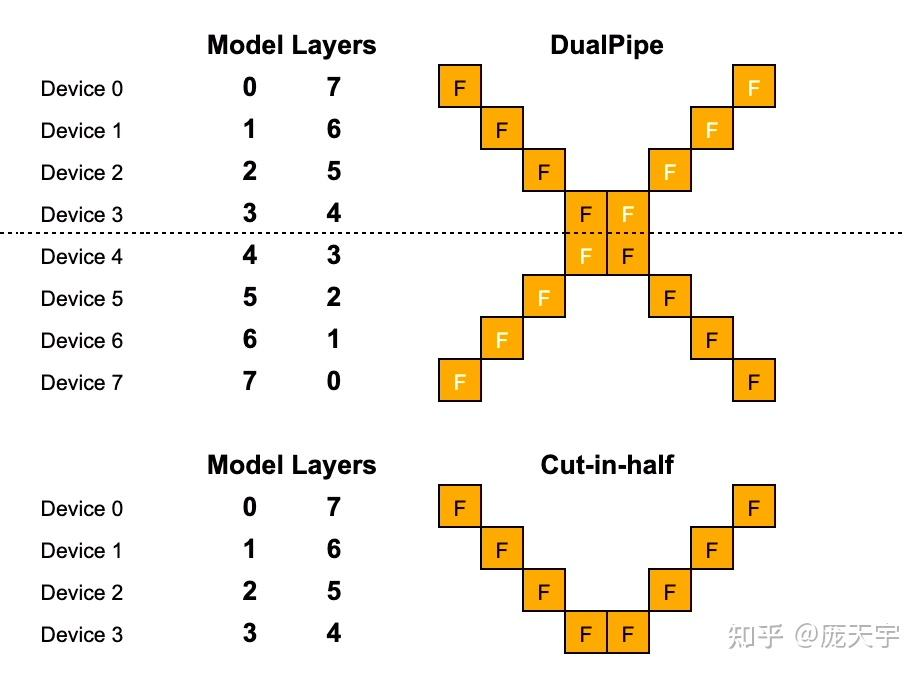
</div>

> **图片来源**：Sea AI Lab《双流并行(DualPipe) 没有双流会更好》（Penghui Qi、Xinyi Wan、Guangxing Huang、Min Lin，2025-02-27；本地副本取自该博客的知乎转载页，图面带「知乎 @庞天宇」水印）。本地副本：`references/articles/sea-ai-lab-cut-in-half/sea-ai-lab-cut-in-half.md` 第 26 行引用图。**层级说明**：这是 cut-in-half 与 V 形布局的**第一手来源**（作者即 Zero Bubble 团队），官方 `dualpipev.png` 由该做法导出；它不是论文原图。

**这个做法在调度谱系上并不是凭空出现的。** V 形布局最早出现在 Zero Bubble 论文 §6 的 ZB-V 调度里（该论文 §2 的 ZB-H1/H2 还只是横向的梯形与平行四边形）：把整个模型均匀切成 $2p$ 个 chunk、每个 worker 分两个，分配顺序是「从第一个 worker 走到最后一个，再从最后一个走回第一个」，形成 V 形。论文里那个 4-stage、16 层的例子说得很具体：worker 1 拿到第 1-2 层与第 15-16 层，worker 2 拿到第 3-4 层与第 13-14 层，依此类推。同时论文点出了 V 形最关键的性质：**每个 microbatch 的前向与反向都起止于同一台设备**，这与 1F1B 和 interleaved 1F1B 都不同（后两者的前向从第一个 worker 出发、反向从最后一个 worker 开始）。这个性质带来的好处是第一个 worker 不必等反向从最后一台设备绕回来就能开始反向，因而显存可以更早释放。四个月之后（2024-01 到 2024-05），同一批作者中的三位在 Controllable Memory 论文里把 V 形进一步拆成可复用的 building block，派生出 V-Min / V-Half / V-ZB 这一族变体（该文正文用的是这三个名字，没有再出现 ZB-V）；ZB-V 与 DualPipeV 同属这一族，但 DualPipeV 的八步结构是 DeepSeek 按 MoE 场景另外写的。

Controllable Memory 论文 Figure 2 把两种放置方式并排对比：左侧 Parallel 下 device 1 同时挂 $l_1$ 与 $l_4$、device 2 挂 $l_2$ 与 $l_5$，长 lifespan 与短 lifespan 没有配对；右侧 V-Shape 下 device 1 挂的是 $l_1$ 与 $l_6$，最长与最短的层被放到同一台设备上，因此各设备的峰值显存更均衡。

<div style="text-align: center; width: 100%; margin: 0 auto;">
    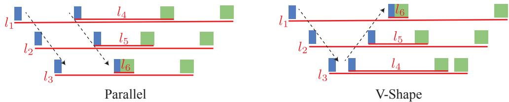
</div>

> **图片来源**：Pipeline Parallelism with Controllable Memory（arXiv 2405.15362v1）Figure 2，§3。本地副本：`references/papers/controllable-memory/controllable-memory.md` 第 77 行引用图。

论文 §6 进一步说明了 ZB-V 的整体形态：warm-up 阶段每个 worker 做 $2p-1$ 次前向（第一个 chunk 做 $2p-i$ 次、第二个 chunk 做 $i-1$ 次），随后进入 1F-1B-1W 的稳态；论文给出的结论是**在 $T_F = T_B = T_W$ 下 ZB-V 达到零气泡，峰值激活为 $pM_B$，与 1F1B 的峰值相同**，并且显存占用在各 worker 之间天然均衡。Figure 8 画的就是这个调度：

<div style="text-align: center; width: 100%; margin: 0 auto;">
    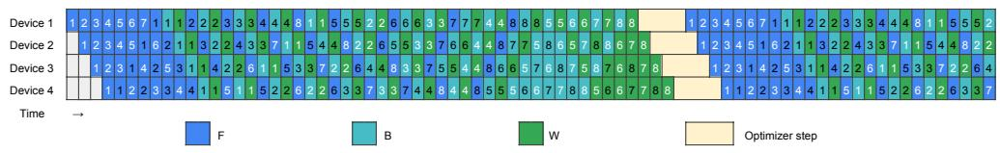
</div>

> **图片来源**：Zero Bubble Pipeline Parallelism（arXiv 2401.10241v1）Figure 8，§6 V-Shape Schedule。本地副本：`references/papers/zero-bubble/zero-bubble.md` 第 158 行引用图。**注意图号容易被记错：Figure 8 是 ZB-V，`3955441b…` 那张气泡率随显存上限变化的四联曲线是 Figure 7。**

Controllable Memory 论文 Figure 4 把 V 形族里的四张完整调度并排画出，是理解「同一个 V 形骨架可以派生出多少变体」最省时间的一张图：

<div style="text-align: center; width: 100%; margin: 0 auto;">
    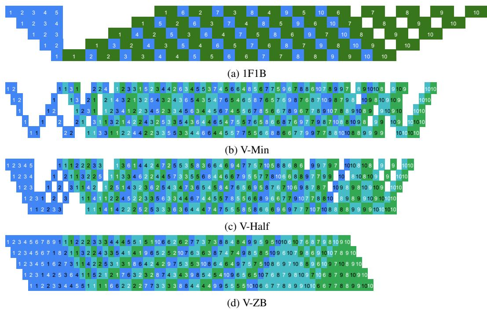
</div>

> **图片来源**：Pipeline Parallelism with Controllable Memory（arXiv 2405.15362v1）Figure 4，§3.2。本地副本：`references/papers/controllable-memory/controllable-memory.md` 第 111 行引用图。

### 6.2 DualPipeV 的 stage 分配

为了在 $p$ 个设备上放下一份完整模型，DualPipeV 把模型切成 $2p$ 个逻辑 stage：

$$
s = 2p .
$$

rank $r$ 持有

$$
\boxed{\text{stage}_0 = r, \qquad \text{stage}_1 = 2p - 1 - r}
$$

这个映射可以在官方源码里逐项对上：`dualpipev.py` 的示例把完整模型建成 `pp_size * 2` 个 `PipelineStage`，本地两份取自 `full_modules[rank]` 与 `full_modules[pp_size * 2 - 1 - rank]`；PyTorch 那边则由 `generate_stage_to_rank_mapping(pp_group_size, num_stages, style="v")` 生成同一套 V 形映射。

以 $p=4$ 为例，四条设备上的层段构成一个 V：

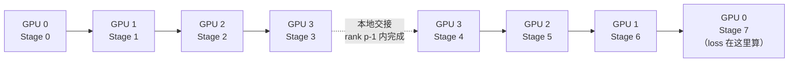
```mermaid
flowchart LR
    S0["GPU 0<br/>Stage 0"] --> S1["GPU 1<br/>Stage 1"] --> S2["GPU 2<br/>Stage 2"] --> S3["GPU 3<br/>Stage 3"]
    S3 -.->|"本地交接<br/>rank p-1 内完成"| S4["GPU 3<br/>Stage 4"]
    S4 --> S5["GPU 2<br/>Stage 5"] --> S6["GPU 1<br/>Stage 6"] --> S7["GPU 0<br/>Stage 7<br/>（loss 在这里算）"]
```

同一个 microbatch 的前向要经过全部八个 stage。由此可以直接读出三条性质：两个本地 chunk 是**同一份模型的不同层**；不再需要原始 DualPipe 那种镜像副本的梯度合并；数据入口与最终 loss 都落在 GPU 0 上。第三条的性质在 Zero Bubble 论文里说得更清楚：**前向与反向起止于同一台设备**，因此 GPU 0 不必等反向从最后一台设备绕回来。

第四步中 V 形底部的那条边是**本地**的，官方实现把这件事写在了两个地方：前向侧在 `is_last_rank and phase == 0` 时把输出 `detach().requires_grad_()` 之后追加进本地的 phase 1 输入队列，反向侧在 `is_last_rank and phase == 1` 时把输入梯度直接追加进本地的 output-grad 队列。这样一来，V 底部的相邻两个 stage 之间既不需要 P2P，也不需要额外的 buffer 协商。

官方调度图如下，它是 4 个 PP rank（8 个逻辑 stage）、10 个 micro-batch：

<div style="text-align: center; width: 100%; margin: 0 auto;">
    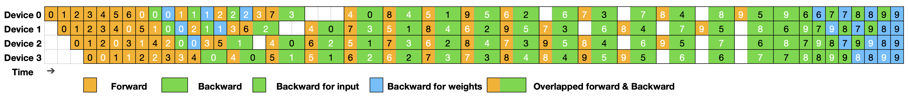
</div>

> **图片来源**：DeepSeek 官方仓库 `deepseek-ai/DualPipe`，commit `030ce4325f4ebeb437da4ebc6d00a70469dd58ae`，`images/dualpipev.png`。README 的说明是「Example DualPipeV scheduling for 4 PP ranks (8 PP stages) and 10 micro-batches」。**口径提醒**：这张图是 4 台设备 × 单方向 10 个 microbatch，第五章的 `dualpipe.png` 是 8 台设备 × 双向合计 20 个（每方向 10 个），两张图的设备数与 microbatch 口径都不同，不能横向比格子数量。

这里有一处二手素材的坑值得记一笔：AIInfra 教材页在「ZB-V schedule」这个标题下放的图（源文件 `10pipeline06.png`），**内容其实是 ZB-H2**：把它与 Zero Bubble Figure 3 下栏逐格做颜色分类，四行的 F/B/W/Optimizer 序列逐字相同（含 7/5/3/1 的 warm-up 与逐行错位的 optimizer 列），而画面上每格只有一个数字、也没有 V 形。教材页的标题与图片内容不符，所以本文不引这张图；要看真正的 ZB-V，用上面的 Figure 8，要看 ZB-H2，用 Figure 3 下栏。

### 6.3 「参数减半」必须附带比较条件

这是理解 DualPipeV 时最容易出错的一处口径问题，它和第七章的比较表直接相关，所以在这里先把话说透。

官方 README 的比较表在 `Parameter Per Device` 一列给 DualPipe 和 DualPipeV **都写了 `2x`**，这看起来和「DualPipeV 删除了参数副本」矛盾。矛盾的根源是**这一列的单位**：它按「一个 stage 大小的 chunk 记作 `1x`」来数，而两张行里每台设备都放了两个 chunk，所以都是 `2x`。**表里那两行并不在同一个设备预算下**：DualPipe 用 `PP` 台设备，DualPipeV 用 `PP/2` 台。

于是「DualPipeV 删除参数副本」这句话只有在**固定物理设备数**时才能说清楚：

| 比较基准 | 完整模型切法 | 每设备持有的 chunk | 每设备参数份额 |
| --- | --- | ---: | ---: |
| 官方表格（固定逻辑 stage 数 = $s$） | 每行都切成 $s$ 段 | 2 | DualPipe `2x`，DualPipeV `2x` |
| 固定设备数 $p$ | DualPipe 切 $p$ 段，DualPipeV 切 $2p$ 段 | 2 | DualPipe `2x`，DualPipeV `1x` |

在固定设备数的口径下，DualPipe 每台设备要放两份 $\frac{1}{p}$ 的模型（合计 $\frac{2}{p}$），DualPipeV 每台设备放两份 $\frac{1}{2p}$ 的模型（合计 $\frac{1}{p}$），所以后者的参数份额确实是前者的一半。**两条陈述都对，但基准不同，不能混着念；** 第七章的每一张表都会在表头写明当前用的是哪一个基准。至于这份参数份额之外的优化器状态与梯度分片怎么算，属于另一个方向的问题，可以对照 [FSDP2 系统教程](../fsdp2/readme.md) 里的分片口径一起看。

代价也必须在同一张表里出现：切到 $2p$ 个 stage 意味着每个 microbatch 要多走一倍的流水线边界，**PP 边界通信量约为原来的两倍**。这一点出自 Sea AI Lab 那篇博客的对照表与结论：cut-in-half 之后 PP 通信量是其他方法的两倍，但「相较于 EP 通信，PP 通信的开销较小」，因此参数显存的减半足以弥补通信的增加。**官方 README 只给出比较表与致谢，没有对 PP 通信量做任何定量或定性的表述**，这一点不要记到 README 头上。

### 6.4 用八个阶段直接读懂官方实现

DualPipeV 的 `step()` 与 DualPipe 共用同一套八步骨架，只是把「半区」换成了「rank」，并把与 V 形有关的部分做了对应调整。用 $r$ 表示 `rank`、$\mathcal{O}(F,B)$ 表示一个前反向配对块，八步的结构是：

| 阶段 | 本地工作 | 重复次数 |
| --- | --- | ---: |
| 1 | $F_0$ | $2(p-r-1)$ |
| 2 | $F_0, F_1$ | $r+1$ |
| 3 | $I_1, W_1, F_1$（使用 zero bubble） | $p-r-1$ |
| 4 | $\mathcal{O}(F_0,B_1),\ \mathcal{O}(F_1,B_0)$（主步） | $m-2p+r+1$ |
| 5 | $B_1,\ \mathcal{O}(F_1,B_0)$ | $p-r-1$ |
| 6 | 交替执行 $B_1, B_0$，后半部分改为只做 $I$ | $r+1$ 对 |
| 7 | 旧 $W$ 配新 $I_0$ | $p-r-1$ |
| 8 | 清空剩余的 $W$ | $r+1$ |

**用 $p=4, m=10, r=1$ 手算一遍。** 前三段执行后，这个 rank 上已经完成了 $F_0$ 共 $2(p-r-1)+(r+1)=4+2=6$ 个、$F_1$ 共 $(r+1)+(p-r-1)=2+2=4$ 个、$B_1$ 共 $p-r-1=2$ 个、$B_0$ 共 0 个。因此主步的第一组工作必然是

$$
(F_{0,6},\; B_{1,2},\; F_{1,4},\; B_{0,0}).
$$

这也正是 `codes/02_schedule_sim.py --p 4 --m 10` 对 rank 1 打印的结果，而它对应的稳态公式是

$$
\boxed{
\left(
F_{0,\,x},\;
B_{1,\,x-p},\;
F_{1,\,x-p+1+r},\;
B_{0,\,x-2p+1+r}
\right)
}
$$

把 $x=6, p=4, r=1$ 代进去：$B_1$ 的编号 $6-4=2$、$F_1$ 的编号 $6-4+1+1=4$、$B_0$ 的编号 $6-8+1+1=0$，与手算一致。**注意这个公式的形式和第五章 DualPipe 的那个几乎一样，但 $p/2$ 全部换成了 $p$、末尾的跨度由 $p$ 变成了 $2p$**，这正反映了两者逻辑 stage 数相差一倍。

### 6.5 cooldown 阶段的 $W$ 队列

第 6 段里有一部分完整反向被改成只做 $I$，那些被延后的 $W$ 就进入了 `WeightGradStore` 的队列。第 7 段做的事是


```mermaid
flowchart LR
    W1["执行一个旧 W"] --> I2["执行一个新的 I"] --> W2["产生一个新的 W 入队"]
```

**队列长度可以暂时不变，但队列里的任务已经向前推进了一位。** 最后第 8 段把队列彻底清空，本次迭代的参数梯度才算完整。官方代码在这里留了一句断言 `assert WeightGradStore.funcs_queue.empty()`，它同时也是这套会计的校验：每一台设备在整个 `step()` 里入队与出队的组数必须相等。

一个细节需要说准：第 6 段里「后半部分改为只做 $I$」指的是**按实际执行顺序排列的单个反向任务**，不是「所有 chunk 0 拆分、所有 chunk 1 不拆分」。官方实现用 rank 的奇偶性来控制这个切换点，这样做的结果是第 6 段恰好产生 $r+1$ 组待完成的 $W$，刚好等于第 8 段能清空的组数。这个等式在 `codes/02_schedule_sim.py` 里被显式断言过：脚本对每台设备统计入队与出队次数，二者不等就会直接报错。

还有一个容易被忽略的差异：**DualPipeV 不需要照搬 DualPipe 的双向偶数约束。** 原始 DualPipe 的 `step()` 在入口处断言设备数为偶数、microbatch 数为偶数且 $m \ge 2p$；DualPipeV 的断言只剩 `num_chunks >= num_ranks * 2`，没有偶数要求。PyTorch 那边的对应约束是 `n_microbatches >= num_stages`（也就是 $m \ge 2p$），同样没有偶数要求。这一点本身只是一条实现约束的差异（本文的两个脚本出于对齐 DualPipe 的扫掠口径，仍然只跑了偶数 $m$），它并不意味着 DualPipeV 在奇数 $m$ 下有额外收益。

---

## 七、统一口径重算气泡与显存

### 7.1 官方表格在比什么

先把官方 README 的比较表原样抄下来，因为它的表头本身就写明了基准：「Pipeline Bubbles and Memory Usage Comparison **(based on the same number of PP stages)**」，并且注明 $PP$ 是**偶数**的 pipeline stage 数，$F$ 是一个 forward chunk 的耗时，$B$ 是**完整反向** chunk 的耗时，$W$ 是 backward-for-weights chunk 的耗时，$F\&B$ 是两个相互重叠的前向与反向 chunk 的耗时。

| Method | Bubble | Parameter Per Device | Activation Per Device | #Devices |
| --- | --- | --- | --- | --- |
| 1F1B | $(PP-1)(F+B)$ | `1x` | $PP$ | $PP$ |
| ZB1P | $(PP-1)(F+B-2W)$ | `1x` | $PP$ | $PP$ |
| DualPipe | $(PP/2-1)(F\&B+B-3W)$ | `2x` | $PP+1$ | $PP$ |
| DualPipeV | $(PP/2-1)(F\&B+B-3W)$ | `2x` | $PP+1$ | $PP/2$ |

这张表里有两处口径必须先讲清楚，否则后面的重算会读成互相矛盾的数字。

**第一处：ZB1P 那一行与 Zero Bubble 论文的 ZB-H1 是同一个式子。** 把 $B = B_{\mathrm{full}} = I + W$ 代入 $(PP-1)(F+B-2W)$，得到 $(p-1)(F+I-W)$，与论文 Table 2 的 ZB-H1 气泡 $(p-1)(T_F+T_B-T_W)$ 完全一致（论文的 $T_B$ 就是本文的 $I$）。这也顺带确认了本文的记号映射是对的。

**第二处：DualPipe 与 DualPipeV 那一行的参数列和设备列不在同一个预算下。** 6.3 节已经解释过：`2x` 是以「一个 stage 大小的 chunk = `1x`」为单位的每设备份额，两行都写 `2x` 是因为两行每台设备都放两个 chunk；而设备列一个是 $PP$、一个是 $PP/2$。**「参数 2x」与「DualPipeV 删除参数副本」这对看似矛盾的说法，只有在固定设备数时才有确定的含义。**

### 7.2 $F\&B$ 到底该取哪一端

DualPipe 与 DualPipeV 的气泡表达式里都有 $F\&B$ 这一项，而 README 只说了它是「两个相互重叠的 chunk 的耗时」，没有给出它与 $F$、$B$ 的关系。它的取值范围是

$$
\max(F,\; B) \;\le\; F\&B \;\le\; F + B .
$$

**这两端有确定的物理含义，而官方材料明确站在右端。**

右端 $F\&B = F + B_{\mathrm{full}}$ 的意思是：一个前向 chunk 与一个反向 chunk 的计算是**顺序做完**的，被「重叠」掉的是它们的通信。DeepSeek-V3 报告 Figure 4 画的正是这件事：那张图只有一条 Computation 行，格内依次是 `MLP(B) → MLP(W) → MLP(F) → ATTN(B) → ATTN(W) → ATTN(F)`，全部串行；与之对照的 Communication 行里才是 `DISPATCH`、`COMBINE` 与 `PP`。报告对该图的说法也是把通信藏起来，而不是让两块计算并排跑。

左端 $F\&B = \max(F, B_{\mathrm{full}})$ 对应「两块计算真正并排执行」，这需要一个自身不做通信、且能与反向共享算力的前向块。**这个读法在本仓库能查到的官方材料里找不到依据**，因此本文不把它当主口径。

这个选择不是措辞问题，它直接决定气泡的数值。在等时假设 $F = I = W = t$ 下，$B = B_{\mathrm{full}} = 2t$，于是 $F\&B + B - 3W = F\&B - t$，代进 README 的表达式：

$$
T_{\mathrm{bubble,DP}} = \left(\frac{p}{2}-1\right)(F\&B - t)
=
\begin{cases}
(p-2)\,t, & F\&B = F+B = 3t \quad\text{（与官方图一致）},\\[2mm]
\left(\dfrac{p-2}{2}\right)t, & F\&B = \max(F,B) = 2t \quad\text{（无来源，仅供对照）}.
\end{cases}
$$

DualPipeV 同理，它的 chunk 是标准 stage 的一半（记半 chunk 的 $F = I = W = \tau = t/2$、$B = 2\tau = t$，逻辑 stage 数 $s = 2p$）：

$$
T_{\mathrm{bubble,DPV}} = (p-1)(F\&B' - \tau)
=
\begin{cases}
(p-1)\,t, & F\&B' = F+B = 3\tau = 1.5t \quad\text{（与官方图一致）},\\[2mm]
\dfrac{p-1}{2}\,t, & F\&B' = \max = 2\tau = t \quad\text{（无来源）}.
\end{cases}
$$

**换句话说，右端口径下 DualPipe 相对 1F1B 的气泡优势来自两处：把 $p-1$ 降到 $p-1$ 之外的 $\frac{p}{2}-1$ 这个系数，以及 $F\&B - t$ 里省下的那部分。** 而左端口径会让气泡整体再减半，但它同时要求两块计算并行，这在官方材料里没有对应物。

### 7.3 用可执行调度独立检查

上面这组闭式由 `codes/02_schedule_sim.py` 独立测量过，而且它测出的数与**官方调度图的绘制口径**完全对得上。这个脚本不做任何张量计算，它做三件事：

1. 逐行镜像官方 `step()` 的循环结构与任务次序（`dualpipe.py` 第 294-440 行、`dualpipev.py` 第 288-411 行，commit `030ce4325f4ebeb437da4ebc6d00a70469dd58ae`），生成每台设备上的 $(F,I,W)$ 任务序列，其中 `enable_zb=True` 的反向只做 $I$，它的 $W$ 进入 `WeightGradStore` 队列、在之后 `_weight_chunk()` 的位置按 FIFO 执行；
2. **按官方提交语义建模发送的释放时刻**：`_send_forward` / `_send_backward` 只是把 `P2POp` 追加进 `self.comm_ops`，真正发出发生在下一次 `_commit_and_wait_comm()`，因此脚本给每个提交点插一个时长为 0 的 `REL` 任务，跨 rank 的数据依赖一律挂在 `REL` 上。唯一例外是 DualPipeV 的 V 底部本地交接，官方在计算结束时直接 `append` 进本地队列，那条边挂的是计算任务本身；
3. 加入同设备程序顺序约束、跨 stage 的「上游第 $k$ 个 $F$ → 下游第 $k$ 个 $F$」与「上游第 $k$ 个 $I$ → 下游第 $k$ 个 $I$」依赖（**只依赖 $I$，不依赖 $W$**，这正是 Zero Bubble 剪掉的那条边），再用拓扑排序求关键路径。

**第 2 条是这套实验里最容易被忽略、也最容易算错的一步。** 如果让下游直接依赖 $F$ 任务的结束时刻，配对块里的前向输出会被乐观地提前释放，整体气泡会少一半（$p=4, m=10$ 会从 2 变成 1），得到的数字与官方图对不上。脚本的注释里写明了这一点。

$p=8, m=20$ 的模拟输出是：

| 方法 | busy | 关键路径 | 气泡 | 气泡率 |
| --- | ---: | ---: | ---: | ---: |
| DualPipe | 60 | 66 | 6 | 9.09% |

**这和 `dualpipe.png` 逐格数出来的结果一致**：那张图共 8 行，每行 66 个单位，其中前向 20 个单位（两个方向各 10 个）、其余 40 个单位是反向的三类，**空闲 6 个单位**；而 6 正是 $(p-2)t$ 在 $p=8, t=1$ 下的值。`dualpipev.png` 同样是每行 66 个单位、空闲 6 个单位，对应 $(p-1)t$ 在 $p=4$、半 chunk 单位下的 $6 = 2(p-1)$。

`--sweep` 覆盖 $p \in \{2,4,6,8\}$、$m \in \{8,10,16,20,32\}$（跳过 $m<2p$ 的组合后实为 32 组），两个方法都稳定满足：

| 量 | DualPipe | DualPipeV | 说明 |
| --- | --- | --- | --- |
| 每设备有效工作 | $3mt$ | $3mt$ | 与 $p$ 无关；同设备数、同模型下三种调度的工作量相同 |
| 气泡 | $(p-2)t$ | $(p-1)t$ | 与 $m$ 无关 |
| 气泡率 | $(p-2)/(3m+p-2)$ | $(p-1)/(3m+p-1)$ | |

这里可以和官方表达式做一次交叉验证：把 $F\&B = F+B_{\mathrm{full}} = 3t$ 代进 $(PP/2-1)(F\&B+B-3W)$，得到 $(p/2-1)\cdot 2t$，与上表的 $(p-2)t$ 相同。**三种调度的气泡率分母首项因此都是 $3m$**（1F1B 是 $(p-1)/(m+p-1)$，ZB1P 是 $(p-1)/(3m+p-1)$），差别只在分子。

### 7.4 改成「同设备数、同模型、同 microbatch 数」重算

官方表格按 stage 数比较，这个基准本身没有问题，但它回答不了另一个很自然的问题：**如果我手上就是 $p$ 台设备，同一份模型、同样多的 microbatch，这几个方案各自表现如何？** 下面这张表按这个基准重算，并且显式写出每一项的口径。

前提假设（读者可以自己复算）：等时假设 $F = I = W = t$，$t$ 表示标准 $p$-stage 划分下一个 chunk 的一次前向耗时；配对块按 $F\&B = F + B_{\mathrm{full}}$ 计；同设备数 $p$；同一份完整模型；同一次迭代的总 microbatch 数 $m$；激活单位 $A$ 表示一个标准 stage、一个 microbatch 的激活占用。

| 方法 | 逻辑 stage 数 | 每设备有效工作 | 气泡 | 气泡率 | 每设备参数份额 | 峰值激活单位 | PP 边界通信 |
| --- | ---: | ---: | ---: | ---: | ---: | ---: | ---: |
| 1F1B | $p$ | $3mt$ | $3(p-1)t$ | $(p-1)/(m+p-1)$ | `1x` | $pA$ | `1x` |
| ZB1P（ZB-H1） | $p$ | $3mt$ | $(p-1)t$ | $(p-1)/(3m+p-1)$ | `1x` | $pA$ | `1x` |
| DualPipe | $p$ | $3mt$ | $(p-2)t$ | $(p-2)/(3m+p-2)$ | `2x` | $(p+1)A$ | `1x` |
| DualPipeV | $2p$ | $3mt$ | $(p-1)t$ | $(p-1)/(3m+p-1)$ | `1x` | $(p+\tfrac12)A$ | 约 `2x` |

这张表里有四列需要逐项解释，因为它们各自都有一处容易写错的地方。

**第一，「每设备有效工作」为什么四种方法相同。** 1F1B 每台设备处理 $m$ 个 microbatch、每个的 $F+I+W$ 是 $3t$，所以是 $3mt$。DualPipe 每条方向只处理 $m/2$ 个，但每台设备上有两个方向的 chunk，所以是 $2 \times \frac{m}{2} \times 3t = 3mt$；**不能只看到 $m/2$ 就把设备的总有效工作时间写成 $3mt/2$**。DualPipeV 每台设备有两个 chunk、每个处理 $m$ 个 microbatch，而每个 chunk 只有标准 stage 的一半（$F = I = W = t/2$），所以是 $2 \times m \times \frac{3t}{2} = 3mt$。三者相同不是巧合，而是「同一模型、同一份数据、同一批计算量」的必然结果。

**第二，ZB1P 的峰值激活为什么仍是 $pA$。** Zero Bubble 论文 Table 2 给出的 ZB-H1 峰值激活就是 $pM_B$，与 1F1B 相同；论文 §2.3 的按 worker 公式 $(p-i+1)M_B + (i-1)M_W$ 在 $i=1$ 取到峰值 $pM_B$，正是因为 $M_W < M_B$。官方 README 也把 ZB1P 的 `Activation Per Device` 写成 $PP$。

**第三，DualPipeV 的 $(p+\frac12)A$ 是怎么来的。** 官方表格给 DualPipe 和 DualPipeV 都写 $PP+1$，单位是「一个 stage、一个 microbatch 的激活」。在固定设备数的口径下，DualPipeV 的逻辑 stage 是标准 stage 的一半，所以单个 stage 的激活单位也减半：$(2p+1) \times \frac{A}{2} = (p+\tfrac12)A$。**这个换算只有在写明「按固定设备数、stage 减半」时才成立**，直接照抄官方表格的 $PP+1$ 会得到双倍的量。

**第四，PP 边界通信为什么约 `2x`。** 逻辑 stage 数从 $p$ 翻到 $2p$，每个 microbatch 要多穿过一倍的流水线边界，因此边界传输的次数翻倍；而单次传输的数据量不变（边界上传的始终是同一个隐藏状态，与每个 stage 分到多少层无关），于是总通信量约为两倍。这一条来自 Sea AI Lab 博客的对照表，官方 README 没有对应表述；博客的判断是相对于 EP 的 All-to-All，PP 通信的总量仍然较小。

**这张表不是硬件性能测试。** 它是对论文公式与官方表格在同一口径下归一化后的算术结果；激活单位 $A$ 不包含通信 buffer、临时张量与优化器状态；气泡列采用的是与官方调度图一致的 $F\&B = F + B_{\mathrm{full}}$。真实的端到端收益还取决于通信是否真的被藏住，只能靠 profiler 测。

### 7.5 三种调度的气泡率放在一起看

把上表的算术结果画成量级关系会更清楚。取 $p=8$、$m=20$（此时 $3m+p-2 = 66$、$3m+p-1 = 67$）：

| 方法 | 气泡（$t$ 单位） | 气泡率 |
| --- | ---: | ---: |
| 1F1B | 21 | $7/27 \approx 25.9\%$ |
| ZB1P | 7 | $7/67 \approx 10.4\%$ |
| DualPipe | 6 | $6/66 \approx 9.1\%$ |
| DualPipeV | 7 | $7/67 \approx 10.4\%$ |

Megatron-LM 论文 Figure 6 给的是气泡率随数据并行度变化的**解析曲线**，可以用来校准这条量级判断的位置：

<div style="text-align: center; width: 100%; margin: 0 auto;">
    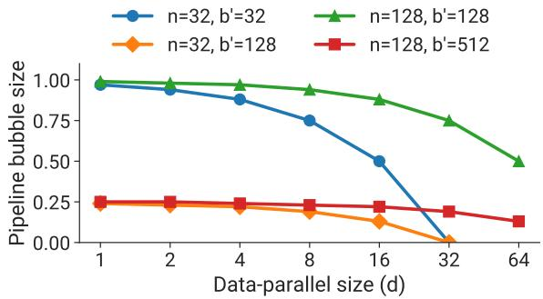
</div>

> **图片来源**：Efficient Large-Scale Language Model Training on GPU Clusters Using Megatron-LM（arXiv 2104.04473v5，SC21）Figure 6。本地副本：`references/papers/megatron-lm-gpu-clusters/megatron-lm-gpu-clusters.md` 第 155 行引用图。**这是解析曲线不是实测数据**：论文给的式子是 bubble $\propto (p-1)/m = (n-d)/b'$（$n$ 为总 GPU 数、$b' = B/b$），图中蓝线在 $d=1/16/32$ 处取 $31/32 = 0.97$、$16/32 = 0.50$、$0$ 正是这条式子；纵轴是 $(p-1)/m$ 而不是本文的 $\beta$。**不要把这两条曲线当成实测吞吐或与本文的气泡率直接相除。**

Controllable Memory 论文 Figure 6 从另一侧给了一组「吞吐与激活显存」的实测对照，它的价值在于提醒读者：**调度变体的收益必须同时看吞吐与显存两条线**，只报吞吐不足以说明问题：

<div style="text-align: center; width: 100%; margin: 0 auto;">
    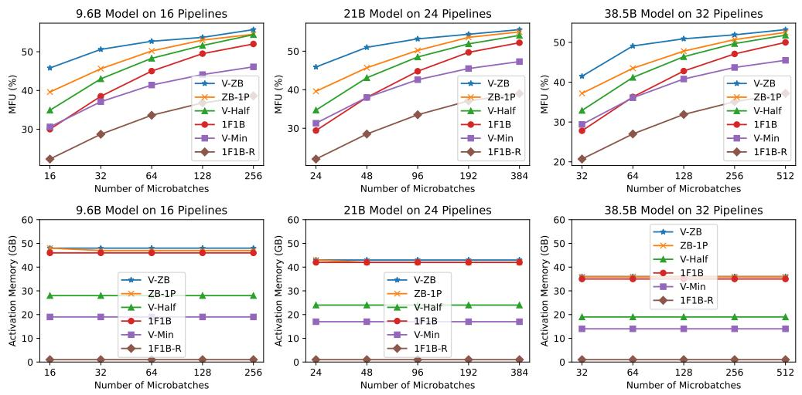
</div>

> **图片来源**：Pipeline Parallelism with Controllable Memory（arXiv 2405.15362v1）Figure 6。本地副本：`references/papers/controllable-memory/controllable-memory.md` 第 143 行引用图。论文对该图的结论是 V-Half 的激活约为 1F1B 的一半、V-Min 约为三分之一。

这份资料本身还留了一个很有价值的反例：该论文 Figure 8 的各个面板用了**互不相同的 microbatch size** 做对比（例如 9.6B 那组里 V-ZB、ZB-1P 与 1F1B 都是 mbs 4，而 V-Half 是 8、V-Min 是 12），结果是 38.5B 那一组里 V-Min 的激活显存（mbs 3，约 41 GB）反而高于 1F1B（mbs 1，约 35 GB）。**省下来的显存被更大的 microbatch 吃掉了**，这正是「比较口径必须显式」这条要求在真实论文里的具体形态。

## 八、源码事实：官方仓库实现了哪一部分

### 8.1 六个组件的分工

官方仓库的主体是四个功能模块文件加两个示例（另有只做导出的 `dualpipe/__init__.py`，17 行），下表的六行里前四行是模块、后两行是示例；这四类组件分别回答「何时执行」「执行什么」「数据如何到达」三个不同的问题：

| 文件 | 行数 | 重点对象 | 它解决的问题 |
| --- | ---: | --- | --- |
| `dualpipe/dualpipe.py` | 440 | `DualPipe.step()` | 双向调度的状态推进 |
| `dualpipe/dualpipev.py` | 411 | `DualPipeV.step()` | V 形调度、折返点与尾部排空 |
| `dualpipe/utils.py` | 80 | `WeightGradStore`、`run_backward` | 延迟执行参数梯度任务、绕过常规 `loss.backward()` |
| `dualpipe/comm.py` | 38 | P2P 构造函数 | 接收 buffer 的分配与发送、接收操作的组织 |
| `examples/example_dualpipe.py` | 202 | `LinearFunc`、`PipelineStage` | 展示算子如何配合反向拆分与调度 |
| `examples/example_dualpipev.py` | 183 | 同上 | 同上，V 形版本 |

**没有哪一个函数包办全部，四类组件拼起来才构成一次完整的 `step()`。** 本文后续对代码的引用统一使用 commit `030ce4325f4ebeb437da4ebc6d00a70469dd58ae`，它是本地 `/workspace/algorithm/DualPipe` 的 HEAD，也是上游 `main` 当时的 HEAD。草稿里出现的 `3da1bbea53606543d7f5f232338fc58096db30e3`（2025-03-06）是一个更早的提交，两者之间的差异只有 `dualpipe/__init__.py` 里 `__all__` 从类对象改成字符串这 10 行，调度算法本身没有变化。

### 8.2 phase 与 half_rank：前后半区的对称

`step()` 开头有一段注释说明了 phase 的语义：「For the first half of the ranks: phase 0 means forward direction, phase 1 means reverse direction. For the second half of the ranks: phase 0 means reverse direction, phase 1 means forward direction.」实现上，这是一次异或：

```python
phase ^= self.is_in_second_half
```

异或之后，`phase` 就变成了**方向**：0 表示从 rank 0 流向 rank $p-1$，1 表示从 rank $p-1$ 流回 rank 0。因此 `_recv_forward` 里「谁不需要接收」的判断是 `(rank 0 且方向 0) 或 (rank p-1 且方向 1)`，`_send_forward` 里「谁是最后一个 stage」的判断是 `(rank 0 且方向 1) 或 (rank p-1 且方向 0)`。

另一处容易读错的是 `half_rank`：

```python
half_rank = min(rank, num_ranks - 1 - rank)
```

**它不等于 `rank`。** 对于 $p=8$，rank 0 与 rank 7 的 `half_rank` 都是 0，rank 1 与 rank 6 都是 1，依此类推。第五章与第六章里的所有公式用的都是 `half_rank`（DualPipe）或 `rank`（DualPipeV），这两个变量名不能互换。

### 8.3 六个独立计数器的作用

调度器维护的状态是

```text
input_chunks[phase][microbatch][tensor]         output_chunks[phase][microbatch][tensor]
input_grad_chunks[phase][microbatch][tensor]    output_grad_chunks[phase][microbatch][tensor]
```

外加六个独立的计数器：`current_f_chunk_id`、`current_b_chunk_id`、`current_send_f_chunk_id`、`current_send_b_chunk_id`、`current_recv_f_chunk_id`、`current_recv_b_chunk_id`，每一个都是长度为 2 的列表（对应两个方向）。

**为什么不能只用一个 microbatch 计数器？** 因为同一台设备上，某个方向可能已经做到第 8 个前向，但只完成了第 4 个反向；发送进度和接收进度还可能与计算进度不同（接收是提前发起的，发送是延后提交的）。**调度的本质就是允许这些进度彼此错开，同时保证依赖关系与数据标识不乱。** 把计数器合并成一个，就等于要求所有进度同步推进，那样就退回到 1F1B 了。

### 8.4 `WeightGradStore` 存的不是张量，是闭包

延迟参数梯度的实现是 `utils.py` 第 8 到 33 行的 26 行，其中 `put` / `flush` / `pop` 三个方法只有 15 行，但有两个容易被忽略的细节。

```python
class WeightGradStore:

    enabled: bool = False
    cache: List[Callable] = []
    funcs_queue = queue.Queue()

    @classmethod
    def put(cls, func: Callable) -> None:
        cls.cache.append(func)

    @classmethod
    def flush(cls) -> None:
        cls.funcs_queue.put(cls.cache)
        cls.cache = []

    @classmethod
    def pop(cls) -> None:
        assert not cls.funcs_queue.empty(), "Pop empty queue."
        funcs = cls.funcs_queue.get()
        for func in funcs:
            func()

    @classmethod
    def clear(cls) -> None:
        cls.cache = []
        cls.funcs_queue = queue.Queue()
```

**第一个细节：队列里放的是函数而不是张量。** `put` 收到的是一个闭包（示例里是 `grad_weight_fn`），它捕获了 `grad_output` 与 `input`。这意味着调度图上的一个 $W$ 可能对应某个 microbatch 在该 chunk 内的一整组参数梯度计算，而不只是一次矩阵乘；也意味着这些闭包持有的张量引用会一直活到 $W$ 真正执行完毕，**延迟 $W$ 的显存代价在实现层面就是这些闭包的生命周期**。

**第二个细节：`_weight_chunk()` 会先做一次通信提交，再执行 $W$。**

```python
def _weight_chunk(self) -> None:
    if self.forward_only:
        return

    self._commit_and_wait_comm()

    # Assume FIFO
    WeightGradStore.pop()
```

`_commit_and_wait_comm()` 把挂起的 `P2POp` 列表交给 `dist.batch_isend_irecv` 批量提交，然后逐个 `req.wait()`。这说明在**固定 revision 的这套骨架里，延迟的 $W$ 与 P2P 是先后关系，而不是并行关系**；`WeightGradStore.pop()` 排在这些通信完成之后，而这一点直接决定了本章末尾那个关于「骨架实现了什么」的结论。

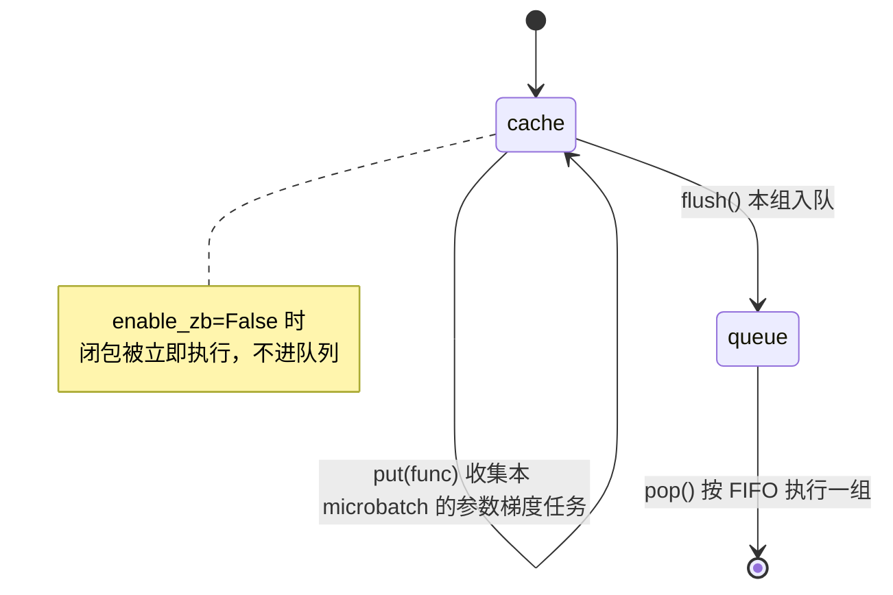
```mermaid
stateDiagram-v2
    [*] --> cache
    cache --> cache : put(func) 收集本 microbatch 的参数梯度任务
    cache --> queue : flush() 本组入队
    queue --> [*] : pop() 按 FIFO 执行一组
    note right of cache
        enable_zb=False 时
        闭包被立即执行，不进队列
    end note
```

### 8.5 八步结构

`step()` 的八个步骤在源码里都有注释，逐段对照下来是：

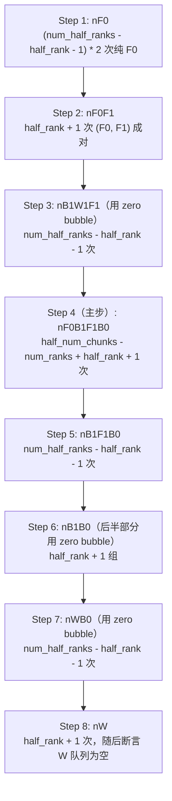
```mermaid
flowchart TD
    S1["Step 1: nF0<br/>(num_half_ranks - half_rank - 1) * 2 次纯 F0"] --> S2["Step 2: nF0F1<br/>half_rank + 1 次 (F0, F1) 成对"]
    S2 --> S3["Step 3: nB1W1F1（用 zero bubble）<br/>num_half_ranks - half_rank - 1 次"]
    S3 --> S4["Step 4（主步）: nF0B1F1B0<br/>half_num_chunks - num_ranks + half_rank + 1 次"]
    S4 --> S5["Step 5: nB1F1B0<br/>num_half_ranks - half_rank - 1 次"]
    S5 --> S6["Step 6: nB1B0（后半部分用 zero bubble）<br/>half_rank + 1 组"]
    S6 --> S7["Step 7: nWB0（用 zero bubble）<br/>num_half_ranks - half_rank - 1 次"]
    S7 --> S8["Step 8: nW<br/>half_rank + 1 次，随后断言 W 队列为空"]
```

第 3 步的内部顺序值得单独看一眼，因为它把「接收 → 执行延迟的 $W$ → 本地前向」三步写在了一起（第 2 步也有提前发起接收的动作，但那一步是纯前向、没有 $W$ 参与）：

```python
for i in range(step_3):
    self._backward_chunk(1, enable_zb=True)
    self._recv_forward(1)
    self._weight_chunk()
    self._forward_chunk(1, recv=False)
```

先做一次只算 $I$ 的反向（$W$ 进延迟队列），接着发起下一段前向输入的接收，然后执行上一步延迟下来的 $W$，最后做本地的前向计算。**从代码的排列意图看，$W$ 被放在接收与计算之间；但如前一小节所述，`_weight_chunk()` 内部的 `_commit_and_wait_comm()` 会先等待挂起的通信完成，所以在固定 revision 的实际行为里这一步并没有真正把 $W$ 盖在通信上。** 这一点在讨论「跑通官方示例意味着什么」时必须讲清楚。

第 4 步的第一轮对中间 rank 做了一次特判，源码里留了注释：

```python
if i == 0:
    if self.is_middle_rank:
        # NOTE: We don't overlap these two chunks to further reduce bubble size.
        self._forward_chunk(0, recv=False, send=False)
        self._send_forward(1)
        self._backward_chunk(1, send=False)
        self._send_forward(0)
        self._send_backward(1)
    else:
        self._forward_backward_chunk(0, 1, recv0=False)
```

`is_middle_rank` 指的是 $p/2-1$ 与 $p/2$ 这两台设备，它们的 `half_rank` 都取到最大值 $p/2-1$，也就是 warmup 最短、进入稳态最早的位置。**官方在这里主动放弃了一次方块级重叠**，注释给出的理由是进一步减小气泡；代码把三个发送操作都挂到本次计算之后，因此也顺带把它们合并进了同一次提交。注释本身没有展开论证，「合并发送比多叠一个方块更划算」是本文对这段代码的机制解读，不是官方注释的原话。

### 8.6 P2P 的形状是调度契约的一部分

`comm.py` 只用 38 行把「张量形状」变成了一份全局契约。

```python
TENSOR_SHAPES: List[Tuple[int]] = None
TENSOR_DTYPE: torch.dtype = None

# （set_p2p_tensor_shapes / set_p2p_tensor_dtype 两个 setter 在此省略）

def build_from_tensor_shapes():
    return [torch.empty(s, dtype=TENSOR_DTYPE, device="cuda", requires_grad=True) for s in TENSOR_SHAPES]
```

接收方先按预先声明的形状建好 buffer（`requires_grad=True`，因为反向要往这个 buffer 里写梯度），再把 `dist.irecv` 或 `dist.isend` 逐个追加到 `comm_ops` 列表里，最后由 `_commit_and_wait_comm()` 一次性提交。官方示例声明的形状是 `(3, 256, 512)`、dtype 为 `float32`（microbatch size 3、序列长度 256、hidden size 512）。

**形状事先声明这件事本身就是一个限制：示例不是一套能自动协商任意动态形状的完整 runtime。** 换一个教学规模感受一下数量级：取 $b=2$、$S=2048$、$H=4096$ 并使用 bf16，一份隐藏状态是

$$
2 \times 2048 \times 4096 \times 2\ \text{bytes} = 32\ \mathrm{MiB}.
$$

这只是一个流水线边界张量，不是整个 stage 保存的全部激活；MoE 内部还会把 token 展平成 `[4096, 4096]` 之类的形状，再按专家路由形成变长的 token 分组。**PP 边界上的层间隐藏状态与 EP 内部的专家 token 分发，不能用同一个固定 buffer 模型替代。**

### 8.7 最重要的源码事实：骨架不含细粒度重叠

把上面几节拼起来，可以给出一个边界明确的判断。

先看示例里的重叠钩子。它被注册为 `PipelineStage` 的**类方法**，调度器通过 `type(module0).overlapped_forward_backward(...)` 调用它，把两个 chunk 的输入、labels、loss 与 output grad 一起传进去；钩子的 docstring 只有一句：「You should implement custom forward-backward overlap strategy. The code below is just an example.」而示例体本身是顺序执行的：先 `module0(*inputs0)` 算完前向，再 `loss1.backward()` 或 `run_backward(outputs1, output_grads1)` 做反向。

再看骨架本身的通信模式。`_forward_chunk`、`_backward_chunk`、`_forward_backward_chunk` 三个函数的形状完全一样：先 `append_irecv` / `append_isend` 把操作追加进列表，然后 `_commit_and_wait_comm()` 提交并等待，之后才做计算，最后把新的发送操作追加进列表留到下一次提交。

```python
def _forward_backward_chunk(self, phase0: int, phase1: int, recv0: bool = True) -> None:
    if recv0:
        self._recv_forward(phase0)
    self._recv_backward(phase1)
    self._commit_and_wait_comm()

    self._forward_backward_compute_chunk(phase0, phase1)

    self._send_forward(phase0)
    self._send_backward(phase1)
```

由此可以得出两条可以逐条复核的结论。

**第一，骨架内部的通信并发只发生在同一个 `batch_isend_irecv` 之内**，例如一个配对块里「前向输入的接收」与「反向梯度的接收」会被一起提交，因此它们彼此并发；而每个计算 chunk 之前都有一次 `req.wait()`，所以没有哪个计算被摆在通信进行中执行。

这里要补一个限定：`req.wait()` 是 **stream 级**同步（本地 `Work.wait` 的 docstring 写的是 `calling wait() is the same as calling synchronize(): Letting the current stream block on the completion of the NCCL work`），CPU 并不会被阻塞。所以结论只针对**在当前 stream 上排队的计算**：它们不会与这一批 P2P 重叠；使用方若在 `overlapped_forward_backward` 里用别的 stream 发起 All-to-All，不在这条结论的范围内。

**第二，计算盖住通信必须由使用方在 `overlapped_forward_backward` 里实现。** 骨架负责的是把两个互不依赖的 chunk 在同一个调用点配对，并提供 phase 翻转、进度错位、P2P buffer 管理与 $W$ 队列这些基础设施；DeepSeek 内部那套细粒度 MoE 重叠并没有随这份开源代码一起放出来。

所以那句判断可以写得很具体：

> **官方仓库给出的是「调度骨架 + 重叠钩子契约」。跑通 `examples/example_dualpipe.py` 只证明调度与示例算子能协同工作、梯度数值正确，不能证明任何模型已经隐藏了 All-to-All。**

这也解释了 README 里那句提醒为什么会出现在「Quick Start」正下方：「For real-world applications, you will need to implement a custom `overlapped_forward_backward` method tailored to your specific module.」

## 九、框架侧分层：PyTorch、Megatron 与推理侧的边界

第八章的结论对使用者不太友好：官方仓库只给了骨架与契约，细粒度重叠要自己写。**但这也意味着「DualPipe 类调度」在框架里必然以两种不同的形态出现**：一种是把它写成一份可执行的调度中间表示，另一种是把它拆成节点、按 stream 与 event 编排执行。前者是 PyTorch 走的路，后者是 Megatron 走的路。

### 9.1 PyTorch：调度先被写成动作，再谈执行

本地安装版 PyTorch 2.10.0 的 `torch/distributed/pipelining/schedules.py`（3438 行）里已经有三个与本文直接相关的调度类：`ScheduleInterleaved1F1B`（第 2493 行）、`ScheduleZBVZeroBubble`（第 2808 行）与 `ScheduleDualPipeV`（第 2994 行）。**引用这些行号时必须同时写明「本地安装版 2.10.0 + 文件路径」**，因为上游 `v2.9.0` 是另一个版本、行号与类集合都不同。

先看它的基本单位。调度不是一段命令式代码，而是一串动作：

```python
class _ComputationType(Enum):
    ...
    BACKWARD_INPUT = 2
    BACKWARD_WEIGHT = 3
    ...
    OVERLAP_F_B = 11
```

每一个动作是 `_Action(stage_index, computation_type, microbatch_index, sub_actions=None)`。**这套设计的关键在于 `OVERLAP_F_B` 带了一个 `sub_actions` 字段**：`ScheduleDualPipeV` 在构造调度时，为每个配对块生成

```python
sub_actions = (
    _Action(forward_stage, FORWARD, forward_mb),
    _Action(backward_stage, FULL_BACKWARD, backward_mb),
)
actions.append(_Action(-1, OVERLAP_F_B, None, sub_actions))
```

也就是说，「一个前向与一个反向配对」在中间表示层面是一个**带子动作的动作**，而不是两个独立动作。这正是 DualPipe 配对语义在框架里的形式化：调度层知道这两件事应该一起做，但**还没有说明底层 kernel 怎么重叠**。顺带一提，这里的子动作之一是 `FULL_BACKWARD` 而不是 `BACKWARD_INPUT` 加 `BACKWARD_WEIGHT`，**说明 PyTorch 这一层的配对块默认还是完整反向**，与 Zero Bubble 那套 I/W 分离不是同一件事。

那么默认怎么执行呢？运行时在遇到 `OVERLAP_F_B` 时走的是这一支：

```python
elif action.computation_type == OVERLAP_F_B:
    assert action.sub_actions is not None, "sub_actions must be set"
    for sub_a in action.sub_actions:
        _perform_action(sub_a)
```

**默认路径是把两个子动作逐个执行。** 所以在这个版本里，`OVERLAP_F_B` 表达的是「这两件事属于同一组」，而不是「这两件事并行跑」。要实现真正的重叠，需要注册自定义执行函数：

```python
    def register_custom_function(
        self,
        computation_type: _ComputationType,
        custom_function: _CustomFunctionProtocol,
    ) -> None:
```

这个接口在**本地 2.10.0 的第 1887 行就已经存在**，它接受的计算类型里明确包含 `OVERLAP_F_B`。需要注意它的语义：注册之后，`_comp_type_to_function_map` 的检查排在 `OVERLAP_F_B` 分支之前，因此自定义函数会**整体接管**这个动作，两个子动作的交错方式完全由它决定。

V 形映射也是内建的。`ScheduleDualPipeV` 在初始化时调用 `generate_stage_to_rank_mapping(pp_group_size, num_stages, style="v")`（实现在 `torch/distributed/pipelining/_utils.py` 第 91 行，`style == "v"` 的分支在第 104-119 行）：它从 rank 0 开始逐个 stage 递增 rank，走到边界时停住不换 rank（源码注释写的是 `dont change rank if we are on the border (to keep v shape)`），随后再递减回来，得到的就是 6.2 节那个 $\text{stage}_0 = r,\ \text{stage}_1 = 2p-1-r$。

约束也写在初始化里：`n_local_stages != 2` 直接报错，`n_microbatches < self._num_stages` 也报错，后者对应官方源码里的 $m \ge 2p$。**这两条与官方 DualPipeV 的断言一致，但都不要求 microbatch 数为偶数**，与 6.5 节的结论相同。

I/W 分离在 PyTorch 侧还需要 autograd 层的配合：`torch/distributed/pipelining/_backward.py` 并不是把同一个 `.backward()` 调两次，它需要保存用于后续参数梯度的图信息与中间梯度，再单独执行权重梯度计算。V 底部的本地连接也有单独处理，目的是让相邻的本地 stage 之间不必走 P2P。

### 9.2 Megatron：把 MoE 层拆成节点，用 stream 与 event 编排

PyTorch 那边停在「动作表示」，Megatron 这边则一路做到了执行计划。本章引用的版本统一为 tag `core_v0.19.0`，即 `5be9626709af2722333bf54797c954c09edeada3`。

先说清楚一件事：**Megatron 这条路径不等于「Megatron 默认变成了原始 DualPipe」。** 它实现的是**细粒度前反向计算通信重叠**，可以与自身的 interleaved 1F1B 等外层调度结合，但它并没有采用原始 DualPipe 的双副本拓扑（每设备放两份参数）。外层的层分配与 microbatch 顺序、内层的 MoE 重叠执行器，是可以组合但必须分开辨认的两个设计维度。Megatron-LM 论文 Figure 4 给的正是外层调度的对照：default 1F1B 与 interleaved 1F1B 在同样设备数下的时间轴差异。

<div style="text-align: center; width: 100%; margin: 0 auto;">
    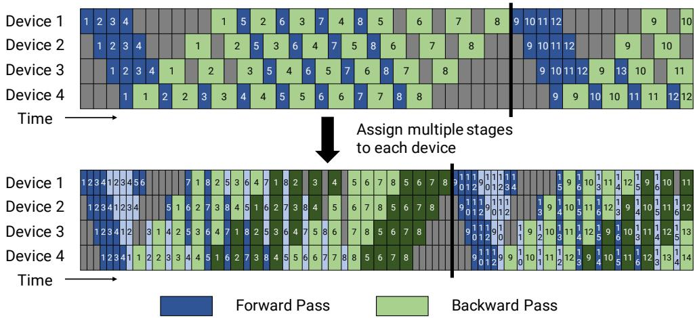
</div>

> **图片来源**：Efficient Large-Scale Language Model Training on GPU Clusters Using Megatron-LM（arXiv 2104.04473v5）Figure 4。本地副本：`references/papers/megatron-lm-gpu-clusters/megatron-lm-gpu-clusters.md` 第 62 行引用图。**这张图的素材很容易认错：`648f402f…` 那张是 Figure 2（Transformer layer + Tensor MP + Pipeline MP 的两级切分），Figure 4 是 `2a3ac338…`。**

interleaved 1F1B 的基本手法是把模型拆成多个 chunk、循环分配给各 stage，从而在同样设备数下把气泡压到原来的约 $1/v$（$v$ 是每台设备持有的 chunk 数），代价是边界通信变多（Megatron-LM 论文说通信量增加 $v$ 倍）。论文同时指出 interleaved 调度可以做到 `with comparable memory footprint`，所以**「峰值激活变高」这句本文不再声称**，因为峰值激活是否上升取决于重计算与层划分的具体配置，需要单独测量。上面那张 Figure 4 的下栏已经把 VPP 的排布画清楚了，本文不再另引教材页里的同内容示意图。需要区分的是它与 DualPipe「每设备两个 chunk」的差别：**VPP 的两个 chunk 是同一份模型的不同层段，而 DualPipe 的两个 chunk 属于两份副本。**

内层这条链路的入口在 `megatron/core/pipeline_parallel/schedules.py`，它把交错流水线的执行交给 `combined_1f1b.py`。这个文件里的关键函数是 `combined_1f1b_schedule_for_interleaved_pipelining`（第 138 行）与 `combined_forward_backward_step`（第 281 行），而它的 docstring 明确写出了调用条件：「This method is called only if `overlap_moe_expert_parallel_comm` is true.」**这条路径不是默认行为，而是由开关打开的一条专用执行器。**

再往下是执行计划本身。`megatron/core/models/common/model_chunk_schedule_plan.py` 第 30 行的 `TransformerLayerSchedulePlan` 把一个 Transformer 层组织成若干节点，源码 docstring 直接给出了节点集合与执行顺序：

| 顺序 | 节点 | 节点类型 | 内容 | 挂在哪条 stream |
| ---: | --- | --- | --- | --- |
| 1 | `pre_dispatch_computation` | `TransformerLayerNode` | attention → layernorm → router → dispatch 预处理 | 计算 stream |
| 2 | `moe_dispatch` | `TransformerLayerNode` | dispatch All2All | 通信 stream |
| 3 | `mlp` | `TransformerLayerNode` | mlp module | 计算 stream |
| 4 | `moe_combine` | `TransformerLayerNode` | combine All2All | 通信 stream |
| 5 | `mtp_post_process` | `PostProcessNode` | MTP 后处理（非 MTP 层为空） | 计算 stream |

**这正是第一章那个「一个 stage 内部在等什么」的问题在代码里的形状**：一次 MoE 层的前向被切成四个计算／通信节点，其中 `moe_dispatch` 与 `moe_combine` 是纯通信节点。`_build_callable_nodes`（第 112 行）在建立节点时按功能分配 stream：`pre_dispatch_computation` 挂在计算 stream 上，`moe_dispatch` 与 `moe_combine` 挂在通信 stream 上。节点还带上用于建立跨 stream 依赖的 CUDA event，以及负责输入输出状态、梯度与张量释放的挂钩。

第 133 行还藏着一个与第四章呼应的开关：

```python
extra_args["delay_wgrad_compute"] = self.layer.config.delay_wgrad_compute
```

**Megatron 里也有一份「延迟 wgrad」的配置，思路与 Zero Bubble 的延迟 $W$ 同类**：它同样把 dgrad 与 wgrad 拆开、把权重梯度挪到别处去算。不过作用粒度不同：Megatron 的 `--delay-wgrad-compute` 是在**层内**把 `mlp_bwd_dw` 挪到与 dispatch 重叠的位置（`model_chunk_schedule_plan.py` 第 244-246 行），而 Zero Bubble 的延迟 $W$ 是**调度级**的、可以把 $W$ 推到若干个 microbatch 之后。说「同源」会把这两件事混为一谈。

这条链路完整走下来是：

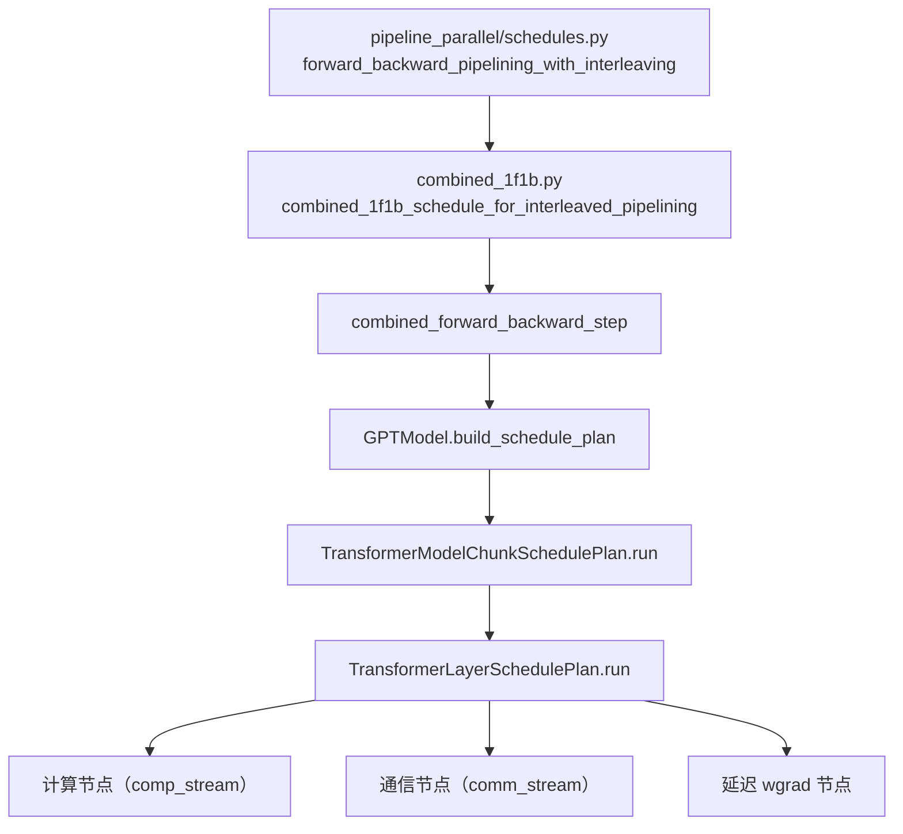
```mermaid
flowchart TD
    A["pipeline_parallel/schedules.py<br/>forward_backward_pipelining_with_interleaving"] --> B["combined_1f1b.py<br/>combined_1f1b_schedule_for_interleaved_pipelining"]
    B --> C["combined_forward_backward_step"]
    C --> D["GPTModel.build_schedule_plan"]
    D --> E["TransformerModelChunkSchedulePlan.run"]
    E --> F["TransformerLayerSchedulePlan.run"]
    F --> G1["计算节点（comp_stream）"]
    F --> G2["通信节点（comm_stream）"]
    F --> G3["延迟 wgrad 节点"]
```

**前向函数在这里不只返回输出，还构造了一份执行计划。** 旧 microbatch 的反向计划与新 microbatch 的前向计划被一起送进执行器，由执行器在节点粒度上交错推进。这才是第一章那个驱动问题的工程答案：**「另一个 microbatch 提供的独立计算窗口」在代码里就是另一份计划里的节点。**

### 9.3 开关后面有哪些真实限制

Megatron 文档里与本章相关的开关是两个：`--overlap-moe-expert-parallel-comm` 与 `--delay-wgrad-compute`。但开关本身不是完整配置：在 `core_v0.19.0` 里，配置检查还涉及 EP 大小、PP 与 VPP 的组合、PyTorch 版本、token dispatcher、重计算以及其他 overlap 特性之间的兼容关系；`combined_1f1b.py` 里也留了明确的限制，例如 `checkpoint_activations_microbatch` 与 `overlap_moe_expert_parallel_comm` 不兼容。

**这些是具体版本的工程约束，不是 DualPipe 在数学上必须满足的条件。** 把它们与第七章那些气泡公式混在一起讲，会让人误以为「不满足某个开关组合就实现不了重叠」。

### 9.4 SGLang 与 verl 应该放在哪一层

SGLang 的 Expert Parallelism 文档（本地路径 `docs/docs/advanced_features/expert_parallelism.mdx`，注意是 `docs/docs/` 而不是 `docs/`）里有两种重叠机制：Two-Batch Overlap（TBO）把请求拆成 micro-batch，在计算图中设置 yield 点，让 attention 计算与 dispatch/combine 交错；Single-Batch Overlap（SBO）则通过 dispatcher hook，在 `dispatch` 与 `combine` 前后插入逻辑，把共享专家的计算与通信重叠起来。

<div style="text-align: center; width: 100%; margin: 0 auto;">
    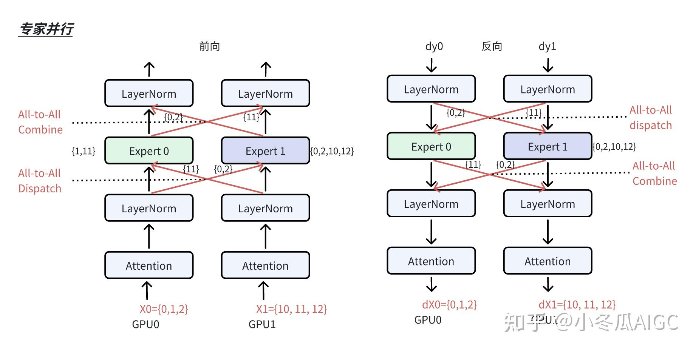
</div>

> **图片来源**：知乎 小冬瓜AIGC《【手撕DualPipe】让我们一步步把 MoE EP 通信「消除」》。本地副本：`references/articles/xiaodonggua-shousi-dualpipe/xiaodonggua-shousi-dualpipe.md` 第 24 行引用图。**层级说明**：社区作者自绘，用具体 token 集合把 All-to-All 的两个方向具体化；这张图讲的是通信形状，训练与推理两种场景都适用。

**TBO 与 SBO 和本文讲的训练调度有共同的重叠思想，但不是同一件事。** 关键差别在于推理侧没有参数梯度 $W$，也没有「优化器更新必须等所有 $W$ 完成」这个边界，因此 Zero Bubble 拆反向、延迟 $W$、绕过优化器同步这一整套设计在推理场景里根本没有对应物；反过来，推理侧的 yield 点与请求级 micro-batch 拆分也不需要训练侧的 autograd 配合。**把 TBO 说成「推理版的 DualPipe」会把两者的约束条件混淆。**

verl 则属于另一层：它把训练与 rollout 生成交给不同后端（例如 Megatron 或 FSDP 负责训练，SGLang 或 vLLM 负责生成）。判断 DualPipe 类技术在这里是否有用，必须先确认目标时间花在哪个 worker 上：如果一次迭代的大部分时间在 rollout，那么优化训练侧的 PP/EP 重叠不会改善主要瓶颈。把 rollout 后端的吞吐提升当成训练调度收益，是这一层最常见的误读。

---

## 十、常见误区、失败模式与选型

### 10.1 六类最容易犯的错

把前面九章的结论收束成一组判断，它们分别对应数学依赖、张量生命周期、执行器能力、计算量归一化与训练同步边界，不能只靠看调度示意图得出结论：

| 常见说法 | 更准确的判断 |
| --- | --- |
| 「$W$ 依赖 $I$，所以必须先算完 dX 才能算 dTheta」 | 对单个线性算子并不成立，$I$ 与 $W$ 都只需要 $G$ 与保存的 $X$；「优先 $I$」是调度策略，不是普遍的数学依赖 |
| 「输入梯度发出去了，激活就可以全部释放」 | 延迟的 $W$ 仍然需要 $X$ 与 $G$ 存活；`WeightGradStore` 里的闭包就是这份显存责任的载体 |
| 「用了 `ScheduleDualPipeV` 就已经实现了通信隐藏」 | 默认路径把 `OVERLAP_F_B` 的两个子动作逐个执行，是否真的重叠取决于执行器 |
| 「两个方向各处理半个 batch，所以每设备计算量减半」 | 每台设备持有两个方向的 chunk，有效工作仍是 $3mt$；只看 $m/2$ 会把工作量算少一半 |
| 「最后一个 $B$ 完成，就可以同步梯度并更新参数」 | 拆分之后还要确认所有延迟的 $W$ 都已执行；官方代码用 `assert WeightGradStore.funcs_queue.empty()` 守住这条线 |
| 「PP 通信翻倍，所以总通信翻倍」 | PP、EP、TP、DP 通信要分别统计；DualPipeV 让 PP 边界通信约为两倍，但它相对 EP 的 All-to-All 通常仍是很小的一项 |

还有一类是纯正确性错误，最容易出现在自己实现调度的时候：**loss 缩放口径不一致**。对于等大小的 microbatch，平均 loss 需要与 microbatch 数一致地归一化；对于变长序列与 token mask，则应按真实有效 token 数加权。PyTorch 的流水线接口区分是否自动缩放梯度，**不能一边在 loss 里除以 $m$，一边又让框架重复缩放**。第五章提到的官方示例里，`criterion` 是逐 microbatch 的 `F.mse_loss` 且不做缩放，参考实现同样逐 microbatch 累加，两者因此对得上；这是一个值得模仿的验证习惯：**任何调度改动之后，先与单卡参考实现比梯度，再谈性能。**

### 10.2 不要从「哪种调度最新」开始选型

更有效的顺序是先定位暴露在关键路径上的时间，再决定改哪一层：

| 当前主要瓶颈 | 优先考察的方向 | 不宜直接假设 |
| --- | --- | --- |
| Dense 模型的 warmup / cooldown 占比高 | microbatch 数、stage 是否均衡、interleaving、Zero Bubble 类调度 | 双向副本一定值得 |
| MoE 的 EP All-to-All 大量暴露 | 前反向细粒度配对、通信后端、路由负载是否均衡 | 只改外层 F/B 顺序就够了 |
| 参数显存紧张 | 无副本的 V 形布局，以及框架是否已经支持 | 原始 DualPipe 的 `2x` 参数开销可以忽略 |
| 激活显存紧张 | $W$ 队列的存活时间、重计算、microbatch 大小 | H2 类方案增加在途任务没有代价 |
| RL 迭代大部分时间花在 rollout | 推理侧 batching 与 EP 重叠、权重同步 | 训练流水线优化能改善主要瓶颈 |

这张表是依据前文的依赖关系与资源模型给出的工程判断，不是跨模型的通用排名。

### 10.3 真正值得测量的是什么

建议把一次优化拆成三次对照：


```mermaid
flowchart LR
    A["基线外层调度<br/>+ 基线执行器"] --> B["只改变外层调度"] --> C["再启用细粒度计算通信重叠"]
```

这样可以把收益拆开：如果第一步就有明显收益，说明主要瓶颈在流水线气泡；如果收益集中在第三步，说明问题在 stage 内部的通信等待。

在同一模型、同一数据规模、同一精度与并行配置下，至少检查三件事：**端到端 step time 与有效 tokens/s**（而不是局部 block 的耗时）；**最大 rank 的显存与执行时间**（而不是均值）；以及 **profiler 里实际暴露的 PP / EP 通信等待**。

如果某项优化降低了局部通信时间，却增加了显存占用、kernel 竞争或尾部同步开销，端到端训练仍可能变慢。**这不是调度理论失效，而是此前用的成本模型没有包含全部资源约束。** 第七章那张对照表里 $F\&B$ 的两端，正是这件事在公式层面的投影：模型假设与真实执行器之间的差距，最终只能靠测量来闭合。

---

## 总结

把全文的逻辑链串起来：

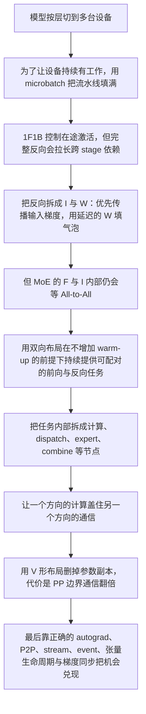
```mermaid
flowchart TD
    A["模型按层切到多台设备"] --> B["为了让设备持续有工作，用 microbatch 把流水线填满"]
    B --> C["1F1B 控制在途激活，但完整反向会拉长跨 stage 依赖"]
    C --> D["把反向拆成 I 与 W：优先传播输入梯度，用延迟的 W 填气泡"]
    D --> E["但 MoE 的 F 与 I 内部仍会等 All-to-All"]
    E --> F["用双向布局在不增加 warm-up 的前提下持续提供可配对的前向与反向任务"]
    F --> G["把任务内部拆成计算、dispatch、expert、combine 等节点"]
    G --> H["让一个方向的计算盖住另一个方向的通信"]
    H --> I["用 V 形布局删掉参数副本，代价是 PP 边界通信翻倍"]
    I --> J["最后靠正确的 autograd、P2P、stream、event、张量生命周期与梯度同步把机会兑现"]
```

**DualPipe 最值得带走的东西不是某个 F/B 下标公式，而是一套识别方法：哪些工作必须现在完成，哪些可以推迟，以及在等待通信的时候还有哪些独立工作能够立刻推进。** 这套方法在 MoE 训练里奏效，是因为它同时找到了两样东西：一个可以被推迟的计算单元（$W$），和一批天然独立的并行任务（要反向的另一个方向）。

调度图描述的是机会，执行器决定机会能否变成吞吐量。这两句话之间隔着的东西，就是第九章那些节点、stream 与 event。

---

## 参考

### 论文与技术报告

- DeepSeek-V3 Technical Report，arXiv [`2412.19437v2`](https://arxiv.org/abs/2412.19437)，§3.2、Figure 4/5、Table 2。
- Zero Bubble Pipeline Parallelism，arXiv [`2401.10241v1`](https://arxiv.org/abs/2401.10241)，§2、§4、§6、Table 1/2。
- Pipeline Parallelism with Controllable Memory，arXiv [`2405.15362v1`](https://arxiv.org/abs/2405.15362)，§3、§4.2–4.3、附录 G，Figure 2/4/6/8/18。**该论文没有 §6**（正文到 §5 Conclusion 为止），引用时不要与 Zero Bubble 的 §6 混起来。
- Chimera: Efficiently Training Large-Scale Neural Networks with Bidirectional Pipelines，arXiv [`2107.06925`](https://arxiv.org/abs/2107.06925)，Figure 2/3。
- Efficient Large-Scale Language Model Training on GPU Clusters Using Megatron-LM，arXiv [`2104.04473v5`](https://arxiv.org/abs/2104.04473)，Figure 4/6。
- GPipe: Easy Scaling with Micro-Batch Pipeline Parallelism，arXiv [`1811.06965`](https://arxiv.org/abs/1811.06965)，Figure 2。
- Memory-Efficient Pipeline-Parallel DNN Training（PipeDream-2BW），arXiv [`2006.16668`](https://arxiv.org/abs/2006.16668)，Figure 2。
- TeraPipe: Token-Level Pipeline Parallelism，arXiv [`2102.07988v2`](https://arxiv.org/abs/2102.07988)，Figure 1。
- DeepSeekMoE: Towards Ultimate Expert Specialization in Mixture-of-Experts Language Models，arXiv [`2401.06066v1`](https://arxiv.org/abs/2401.06066)，Figure 2。

### 源码

- DeepSeek 官方 `DualPipe`，commit [`030ce4325f4ebeb437da4ebc6d00a70469dd58ae`](https://github.com/deepseek-ai/DualPipe/tree/030ce4325f4ebeb437da4ebc6d00a70469dd58ae)：[`dualpipe/dualpipe.py`](https://github.com/deepseek-ai/DualPipe/blob/030ce4325f4ebeb437da4ebc6d00a70469dd58ae/dualpipe/dualpipe.py)、[`dualpipe/dualpipev.py`](https://github.com/deepseek-ai/DualPipe/blob/030ce4325f4ebeb437da4ebc6d00a70469dd58ae/dualpipe/dualpipev.py)、[`dualpipe/utils.py`](https://github.com/deepseek-ai/DualPipe/blob/030ce4325f4ebeb437da4ebc6d00a70469dd58ae/dualpipe/utils.py)、[`dualpipe/comm.py`](https://github.com/deepseek-ai/DualPipe/blob/030ce4325f4ebeb437da4ebc6d00a70469dd58ae/dualpipe/comm.py)、[`examples/example_dualpipe.py`](https://github.com/deepseek-ai/DualPipe/blob/030ce4325f4ebeb437da4ebc6d00a70469dd58ae/examples/example_dualpipe.py)、[`examples/example_dualpipev.py`](https://github.com/deepseek-ai/DualPipe/blob/030ce4325f4ebeb437da4ebc6d00a70469dd58ae/examples/example_dualpipev.py)。
- DeepSeek 官方 [`profile-data`](https://github.com/deepseek-ai/profile-data)：DualPipe 交错执行的 profile 数据。**该仓库本地没有副本、也没有 pin 到具体 commit**，以下描述按 2026-09 检索时的 README 自述，读者复核时请注意它可能已经变化：其 README 说明模拟了完全均衡的专家路由、训练 trace 为简化省略了 PP 通信，因此适合验证局部交错机制，不能直接证明任意路由分布下端到端通信都能被完全隐藏。该仓库本地无副本，本文只引用其 README 自述的边界。
- NVIDIA Megatron-LM，tag [`core_v0.19.0`](https://github.com/NVIDIA/Megatron-LM/tree/5be9626709af2722333bf54797c954c09edeada3)（`5be9626709af2722333bf54797c954c09edeada3`）：[`megatron/core/pipeline_parallel/combined_1f1b.py`](https://github.com/NVIDIA/Megatron-LM/blob/5be9626709af2722333bf54797c954c09edeada3/megatron/core/pipeline_parallel/combined_1f1b.py)、[`megatron/core/models/common/model_chunk_schedule_plan.py`](https://github.com/NVIDIA/Megatron-LM/blob/5be9626709af2722333bf54797c954c09edeada3/megatron/core/models/common/model_chunk_schedule_plan.py)。
- 本地安装版 PyTorch **2.10.0**，路径 `/usr/local/lib/python3.12/dist-packages/torch/distributed/pipelining/`：`schedules.py`（`ScheduleInterleaved1F1B` 第 2493 行、`ScheduleZBVZeroBubble` 第 2808 行、`ScheduleDualPipeV` 第 2994 行、`register_custom_function` 第 1887 行、`OVERLAP_F_B` 默认执行分支第 2257-2260 行）、`_utils.py`（`generate_stage_to_rank_mapping` 第 91 行，`style == "v"` 分支第 104-119 行）、`_backward.py`、`stage.py`。**本文不引用上游 `v2.9.0` 或 `main` 的行号**，两者与本地版本的类集合和行号都不同。
- `sail-sg/zero-bubble-pipeline-parallelism`，commit [`c5d5074132dd47aec5a92b8753a56d808a109eda`](https://github.com/sail-sg/zero-bubble-pipeline-parallelism/tree/c5d5074132dd47aec5a92b8753a56d808a109eda)（ZB-H1 的 Megatron 变种实现，含 warmup 与 steady 段的拆分条件）；tag [`zero-bubble-v0.1.0`](https://github.com/sail-sg/zero-bubble-pipeline-parallelism/tree/zero-bubble-v0.1.0) 下的 `megatron/core/pipeline_parallel/handcrafted_zb_v.py`（ZB-V 的手工实现）。这两个 revision 本地没有 clone，本文只引用公开 URL，不引用行号。
- SGLang Expert Parallelism 文档：仓库内路径 `docs/docs/advanced_features/expert_parallelism.mdx`（TBO 见 `### Two-Batch Overlap (TBO)`，SBO 见 `### Single-Batch Overlap (SBO)`）。本地 clone 的快照为 HEAD `7399c2b5587e1559f3e5a26566ed322e81e1433a`。

### 社区文章与教材

- Sea AI Lab《双流并行(DualPipe) 没有双流会更好》，Penghui Qi、Xinyi Wan、Guangxing Huang、Min Lin，2025-02-27：<https://hackmd.io/@ufotalent/S1N_ay0ckx>（英文版 <https://hackmd.io/@ufotalent/r1lVXsa9Jg>）。
- 知乎 叶千树《理解DualPipe源码和pipeline实现逻辑》，2025-04-08：<https://zhuanlan.zhihu.com/p/1892343442778091583>。
- 知乎 小冬瓜AIGC《【手撕DualPipe】让我们一步步把 MoE EP 通信「消除」》：<https://zhuanlan.zhihu.com/p/1910995677451912435>。
- HuggingFace 社区博客 NormalUhr《DualPipe Explained: A Comprehensive Guide》，2025-02-28：<https://huggingface.co/blog/NormalUhr/deepseek-dualpipe>。
- Infrasys-AI AIInfra 教材页《PP 并行：1F1B/1F1B Interleaved》：<https://infrasys-ai.github.io/aiinfra-docs/04Train02ParallelAdv/08PPInterleaved.html>。

### 本文配套实验

- [`codes/01_split_backward_minimal.py`](./codes/01_split_backward_minimal.py)：反向拆分的最小可运行示例，验证「先返回输入梯度、后补参数梯度」的数值等价性。
- [`codes/02_schedule_sim.py`](./codes/02_schedule_sim.py)：DualPipe / DualPipeV 的 CPU 调度模拟器，逐行镜像官方 `step()` 的结构，输出任务计数、关键路径、气泡与气泡率。
- [`codes/README.md`](./codes/README.md)：两个实验的环境、运行命令、实测输出与结论边界。
- [`notes/`](./notes/)：`IMAGE-SURVEY-*.md` 是参考资料 433 张抽取图的逐张核对记录，`MATH-VERIFY.md` 是逐式复核记录，`IMAGE-VERIFY.md` 是正文采用图的独立复核记录。

---

## 附录 A：调度谱系与另一个正交维度

本文的主线是「反向前后拆分」这条线：GPipe → 1F1B → Zero Bubble（H1/H2）→ DualPipe → DualPipeV。把它放进更大的谱系里看会更清楚，Controllable Memory 论文附录里的那张画廊把多种调度按同样格式排在一起，每一组的上排是 building block 的重复方式、下排是挤压与重排之后的最终调度：

<div style="text-align: center; width: 100%; margin: 0 auto;">
    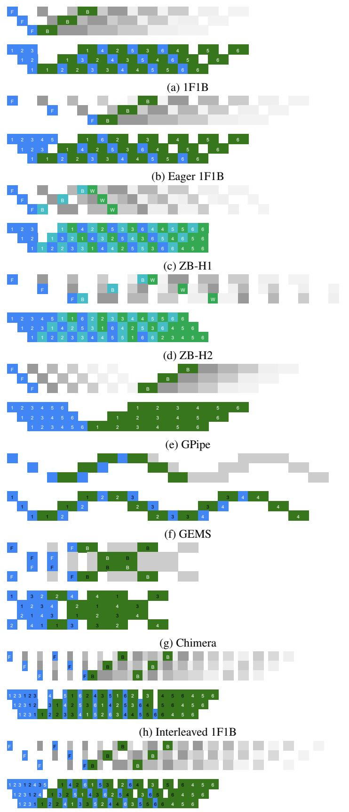
</div>

> **图片来源**：Pipeline Parallelism with Controllable Memory（arXiv 2405.15362v1）Figure 18，附录 G。本地副本：`references/papers/controllable-memory/controllable-memory.md` 第 416 行引用图。这是一整幅画廊图（742×1723），不是单一子图。

谱系里还有一条与「拆分反向」正交的线索：**把流水线的划分粒度改细**。TeraPipe 在单条序列内部做 token 级流水线，把 stage 的划分单位从「层」降到「token 段」：

<div style="text-align: center; width: 100%; margin: 0 auto;">
    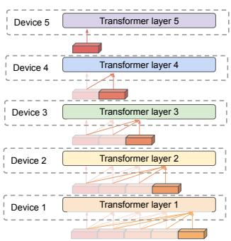
</div>

> **图片来源**：TeraPipe: Token-Level Pipeline Parallelism for Training Large-Scale Language Models（arXiv 2102.07988v2，ICML 2021）Figure 1(d)。本地副本：`references/papers/terapipe/terapipe.md` 第 28 行引用图。**粒度变细并不总是更快**：TeraPipe 论文 Figure 3 是在**单张 V100** 上测单层 GPT3-1B 的前向时间与吞吐，论文的结论是输入序列短于 256 个 token 时 GPU 利用不足，切得太细反而让吞吐下降；另一侧的代价是切片变长会让序列内的 stage 数变少、流水线气泡变大。**注意这是一组单卡测量、没有跨设备通信**，所以它说明的是「粒度不能无脑调细」，而不是「通信开销随粒度上升」。

第三条线索是「同时驻留多少个参数版本」，它说明延迟 $W$ 的显存代价并不是一个新问题。PipeDream-2BW 用 double-buffered weights 把在途的权重版本限制在两个：

<div style="text-align: center; width: 100%; margin: 0 auto;">
    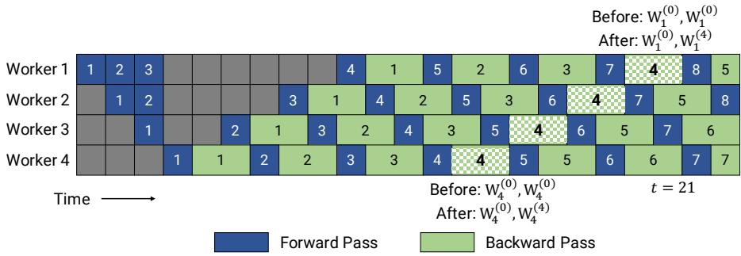
</div>

> **图片来源**：Memory-Efficient Pipeline-Parallel DNN Training（arXiv 2006.16668）Figure 2。本地副本：`references/papers/pipedream-2bw/pipedream-2bw.md` 第 64 行引用图。**这张图的图号容易认错**：`e1dfea35…` 那张是 Figure 3（GPipe 与 PipeDream-Flush 的对照），Figure 2 是 `ec0c258b…`。

把三条线索放在一起，会得到一个对判断很有用的结论：**「拆分反向」「改变划分粒度」「限制在途权重版本」是三个彼此正交的设计维度，而 DualPipe 的新意主要不在第一个维度上。** 拆分反向继承自 Zero Bubble，也不需要双向布局：第四章的 ZB-H1/H2 在单向布局下就拆了，第六章的 DualPipeV 去掉双向之后仍在第 3、6、7 步使用同样的拆分。DeepSeek-V3 报告对 DualPipe 的定位也是重叠「a pair of individual forward and backward chunks」里的计算与通信，而把拆反向写成「like in ZeroBubble」。**双向布局真正换来的是：不必额外增加 warm-up 就让每个 rank 上都有另一个方向的任务可以配对，并且把配对依赖的深度从 $p$ 缩到 $p/2$**（这正是 README 里 `PP/2-1` 这个系数的来源）。

---

## 附录 B：逐式与逐图复核索引

本文的每一个公式与每一张图都有对应的核对记录，便于第三方复核。

**数学**：逐式记录见 [`notes/MATH-VERIFY.md`](./notes/MATH-VERIFY.md)，每行给出「公式 → 来源（论文公式号 / README 表格 / 源码行号）→ 复算结果 → 结论」。其中三组关键式可以在本地复跑：

```bash
python torch/dualpipe/codes/01_split_backward_minimal.py
python torch/dualpipe/codes/02_schedule_sim.py --p 8 --m 20
python torch/dualpipe/codes/02_schedule_sim.py --sweep
```

**图片**：参考资料里属于「写作素材」的 433 张图片（论文 353、教材页 20、社区文章 60）的逐张核对记录在 [`notes/IMAGE-SURVEY-*.md`](./notes/)，每份表格覆盖该目录的全部文件，逐行给出「文件名 / md 引用行 / 图号 / 类别（论文插图、公式截图、表格截图、装饰）/ 读图后的事实描述 / 采用结论与理由 / 建议章节」。**未采用的图同样逐张写明了理由**，其中纯公式截图与表格截图全部判为「不采用」，需要表格内容时转写为 Markdown 表格。本目录 `pics/` 下的 32 张图与这些记录逐一对齐，来源与 sha256 见 [`pics/README.md`](./pics/README.md)。

**已更正的图号错配**（这些是核对过程中发现的、在草稿与常见转载里都存在的错误）：Megatron-LM Figure 4 是 `2a3ac338…` 而不是 `648f402f…`（后者是 Figure 2）；PipeDream-2BW Figure 2 是 `ec0c258b…` 而不是 `e1dfea35…`（后者是 Figure 3）；Zero Bubble Figure 3 是 `e2c1ba8e…` 而不是 `7828028c…`（后者是 Figure 2），Figure 8 是 `53647889…` 而不是 `3955441b…`（后者是 Figure 7）；DeepSeek-V3 Figure 5 的图块里不含 Table 2。

---

## 本文的验证范围

**已验证**：

- 反向拆分的数值等价性：`codes/01_split_backward_minimal.py` 在 PyTorch 2.10.0+cu129、float64 下实测最大绝对误差 `1.110e-16`，并确认 `backward()` 返回后参数梯度仍为 `None`。
- 八阶段调度的任务计数与会计一致性：`codes/02_schedule_sim.py` 断言每台设备的 $F$、$I$ 计数，以及全设备 $I$ 与 $W$ 的总数相等，并在 $p \in \{2,4,6,8\}$、$m \in \{8,10,16,20,32\}$ 上验证了每设备有效工作 $= 3mt$、气泡 $(p-2)t$ 与 $(p-1)t$、气泡率 $(p-2)/(3m+p-2)$ 与 $(p-1)/(3m+p-1)$ 这几组闭式；其中 $p=8,m=20$ 的 DualPipe 与 $p=4,m=10$ 的 DualPipeV 都给出「每行 66 个单位、空闲 6 个单位」，与官方调度图逐格数出来的结果一致。
- 官方源码事实：`dualpipe.py` 440 行、`dualpipev.py` 411 行、入口断言、八步结构的循环次数、`WeightGradStore` 的会计、`_commit_and_wait_comm()` 的位置与语义，均在 commit `030ce432…` 下逐行核对。
- 框架侧行号：本地 PyTorch 2.10.0 的类行号与 Megatron-LM `core_v0.19.0` 的函数行号均已核对。

**未验证，本文不做任何声称**：

- 任何 GPU 吞吐、显存占用、通信带宽或端到端 step time。**本文没有任何 GPU 实测**，也没有运行过官方示例或任何框架的 DualPipe 调度。
- 「重叠能带来多少收益」。第七章的对照表是算术结果；`codes/02_schedule_sim.py` 只算依赖与时间，**不建模通信耗时、也不建模计算与通信的并发**，因此它给出的气泡对应「配对块里的计算按顺序做完、通信被忽略」这一时间模型（与官方调度图的绘制口径一致），但它不是实测值，也不能说明真实 GPU 上到底重叠掉了多少。
- 等时假设 $F = I = W = t$，以及「stage 均衡、忽略 $T_{\mathrm{comm}}$」。Zero Bubble 论文的解析口径给出 $T_W < T_F < T_B$ 且 $T_B + T_W = 2T_F$，而论文 Table 9 的 profiled 数据与之并不完全自洽，两种口径本文都标注了来源而没有合并。
- 张量级的端到端数值正确性（按 V 形调度真实前反向一遍、与单卡参考比较输出与梯度）。草稿曾引用一个 CPU 执行器声称完成过这件事并给出误差数字，但该文件既不在仓库内也不在可获取路径上，**本次没有重建，因此相关结论与数字已从本文删除**。
- `references/community/easy-dualpipe/` 那份教学复现代码：本文没有运行它，也没有用它作为事实来源。

<!-- /learn-write 自动检查报告
双轨检查：PASS。概念框架（第一至四章：两类等待 → I/W 拆分与记号 → 1F1B 基线 → Zero Bubble）先于调度模型（第五、六章）与代码分析（第八章官方源码、第九章 PyTorch/Megatron）建立；代码片段全部取自固定 revision 的真实生产代码（DeepSeek DualPipe commit 030ce432…、Megatron-LM tag core_v0.19.0、本地 PyTorch 2.10.0），无自编教学代码冒充源码；概念与代码之间用「第八章的结论对使用者不太友好」这类具体过渡连接；章节顺序严格遵循概念 → 模型/场景 → 代码。

叙事检查：PASS。开篇不用模板句式，以「已经用了 1F1B 为什么还有等待」这一真实困惑切入，并显式回顾了同仓库的 torch/deepep、torch/torch-distributed、torch/nccl 三篇前序文章；开篇即声明「本文没有任何 GPU 实测」，把可回溯的数字与不可回溯的说法分开；路线图为 4 条编号列表；致谢自然（感谢开源团队与 Sea AI Lab 作者）；commit hash 全部在代码引用处自然出现，没有「本文基于 commit xxx 进行分析」这类声明；段落过渡均具体引用前节结论（例如第五、六章之间用「第五章最后留下了一个具体代价」衔接，第七章用「第七章那张对照表里 F&B 的两端」回收）；交叉引用见下。

深度检查：understand-reproduce（依赖的基础设施 / 框架内部机制）→ 实际深度为原理级加关键 API 级。调度与数学部分做了完整推导与逐式复核；源码部分走到「读懂结构并指出边界」而没有逐行复述整个 step()；SGLang 与 verl 只作分层对照，未深入改库级。PASS。

递进推导检查：PASS。驱动问题（「这段独立计算从哪里来」）在第一章末尾、读者同时握有气泡公式与 MoE 通信结构之后出现，并在第五、九章两次回收；每节开头都说明从上一节的哪个结论推导而来；概念章节有子步骤展开（2.2 的形状例子、3.4 的口径换算、7.2 的两端代入）与总结判断；约束映射融入行文而没有独立成表；设计方案展示了 GPipe → 1F1B → Zero Bubble → DualPipe → DualPipeV 的演进路径，并给出同设备数口径下的替代方案对比表；「为什么不用 X」按「X 解决什么 → 本场景为什么不需要 → 结论」展开（第九章对 TBO/SBO 的处理）；模型介绍先全貌（DeepSeekMoE 的专家切分）再进入通信特征；无 ASCII 字符画（已把 Megatron 的节点树改为 Markdown 表格）。

第三轮复核（`notes/REVIEW-deep-r3b.md` 的 10 条 P0 / 8 条 P1 / 26 条 P2 已全部处理，处理记录见 `REVISION.md` 第 3 轮）：
- 主口径已改为 $F\&B = F + B_{\mathrm{full}}$；依据是官方 `dualpipe.png` / `dualpipev.png` 逐列取色（每行 66 个单位、空闲 6 个单位）与 V3 报告 Figure 4，详见 §7.2 与 §7.3。
- `codes/02_schedule_sim.py` 的发送释放语义已按官方提交点修正，修好后 $p=8,m=20$ 与 $p=4,m=10$ 都复现出官方图的 66 / 6。
- 全文 $\LaTeX$ 行内公式由 `\(…\)` 改为 `$…$`（本地已发布的同类文章均用后者）；`pics/` 从 32 张调整为 30 张，与正文引用一一对应。
- 已知仍未验证的事项见文末「本文的验证范围」。

交叉引用建议（已写入正文）：
- ../deepep/deep-dive.md：EP All-to-All 的通信代价与 SM 占用，本文的姊妹篇。**该篇与本文同期写作，尚未进入 README.md / README-cn.md 的索引**（`grep -i deepep` 在两个 README 里都无结果，knowledge-graph.json 也没有该条目），因此按 `.learn/config.md`「内部引用应引用 published 状态的文章」，正文只把它当同期姊妹篇链接，**不作为知识来源**；开篇那句「已经讲到拓扑、显存布局与 SM 占用这一层」是对同批交付内容的指认，不是把它当作已发布事实引用。若两篇同批或 DeepEP 先发布，删去正文里的括号说明即可。
- ../torch-distributed/readme.md、../nccl/readme.md、../fsdp2/readme.md：均为已发布（README.md 第 153、151、148 行与 README-cn.md 对应行；knowledge-graph.json 中前两篇为 published，fsdp2 无条目但两个 README 都已列出且无 [Pending Review]）。
- 未引用 rlhf/sys-design/readme-4.md，理由如下：**README.md 第 150 行有一条 一条 `[Pending Review]` 条目（标题为 Expert Parallelism，指向 `rlhf/sys-design/readme-4.md`），但同一份 README.md 第 51 行把 `readme-4-en.md` 列为已发布并注明中文版就是 `./rlhf/sys-design/readme-4.md`，README-cn.md 第 64 行同样把 `readme-4.md` 列为已发布，knowledge-graph.json 里该文也是 published。也就是说矛盾出在 README.md 自己第 51 行与第 150 行之间，第 150 行更像一条遗留占位。**按其主题（DeepSeek MoE 与 EP 的组合），本文改由 DeepSeekMoE 论文本身承担这部分内容；清理第 150 行会改变 README 的发布状态，按 AGENTS.md 属 Ask First，本文只报告、未改动。
-->


