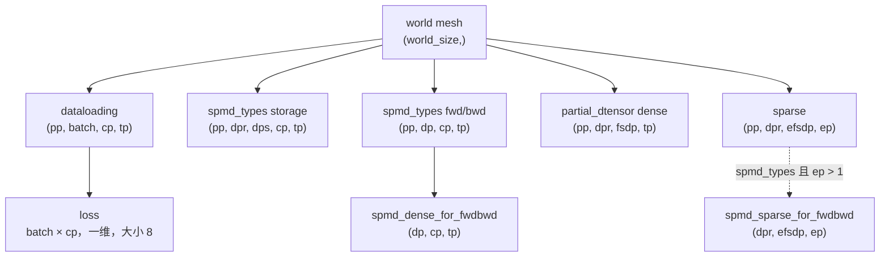
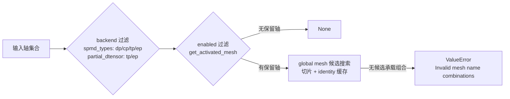

# TorchTitan ParallelDims 源码走读：同一批 rank 的多种 mesh 身份

前段时间在 RL 训练框架里反复对比 verl 与 torchtitan 对数据并行维度的组织方式，verl 把 DP 拆成 replicate 与 shard 两种放置，而 torchtitan 更进一步，在同一个 `world_size` 上同时维护 dataloading、loss、dense、sparse 四类 `DeviceMesh` 视图，每次看到 `build_mesh()` 里那排 `unflatten` 我都要停下来数一遍形状，索性花点时间把 [torchtitan/distributed/parallel_dims.py](https://github.com/pytorch/torchtitan/blob/d6555c4c35a10bebcce652b58374cdeb2ecbe527/torchtitan/distributed/parallel_dims.py) 从头到尾读了一遍。torchtitan 对我来说是个新框架，这也是我第一次系统读它的分布式编排代码，文中所有源码行为都来自固定 commit `d6555c4c35a10bebcce652b58374cdeb2ecbe527`，本地只做 CPU 与纯 Python 复现，不碰真实 GPU，也不测任何吞吐或显存。

这篇文章要回答的驱动问题是：

> 给定一组固定的 rank，`ParallelDims` 为什么需要同时构造 `dataloading`、`loss`、`dense` 和 `sparse` 等不同的 `DeviceMesh` 视图？它如何用整数约束保证这些视图都覆盖同一组设备，又如何根据 `spmd_backend` 和已启用的轴把正确的 mesh 交给下游代码？

路线图如下：

1. 先建立坐标直觉：轴是 rank 网格上的一个切片方向，逻辑 `dp` 如何展开成 `dp_replicate` 与 `dp_shard` 两个具体轴；
2. 再从六个基础并行度推导 `batch`、`loss`、`fsdp`、`efsdp` 四个派生量，并手算检查它们没有凭空增加设备；
3. 然后沿着构造链走一遍 `build_mesh()`，看一个一维 world mesh 如何 unflatten 出多个视图，以及 `spmd_types` 与 `partial_dtensor` 两个 backend 的差异；
4. 最后看 mesh 获取与解析 API 的四种语义，把 sparse mesh 放回 MoE 路由的边界内，并用 lab 脚本复现关键结论。

照例，感谢学习群里一起啃 torchtitan 源码、帮我反复核对 mesh 形状和 fake backend 行为的朋友们。

## 同一批 rank，为什么需要多个 mesh 视角

先看最朴素的基线：**只有一个一维 world mesh，所有下游代码都直接从这个 mesh 上取 process group**。一维 mesh 只能表达"全体 rank 的一个顺序"，当训练配置里有 PP、TP、CP 等多个并行度时，数据采样器想知道"谁读哪一份数据"，loss 归约想知道"哪些 rank 的 loss 要加在一起"，FSDP 想知道"哪些 rank 沿哪个轴一起分片权重"，MoE 想知道"哪些 rank 一起服务一组专家"，这些问题的答案都是"同一批 rank 的不同分组方式"，而一维 mesh 表达不了这种多维组织。

于是自然走到中间态：**用 unflatten 把一维 world mesh 拆成多维，让每个轴对应一个并行度**。拆出多维之后又会发现，同一段设备排列可以同时按多种方式解释，比如 FSDP 关心 `(dp_replicate, dp_shard, cp, tp)` 的存储视图，而数据加载只关心 `(batch, cp, tp)` 的数据视图，它们各自的轴划分不同，却覆盖完全相同的设备集合，这有点像同一块内存被不同 shape 的 tensor view 复用（这个比方不完全严谨：tensor view 复用内存，mesh 视图复用的是设备与 process group，但"同一份底层资源、多种解释"的结构是一样的）。再往后，不同 backend 对 dense 轴的解释出现分歧，MoE 还需要一个不同于 dense 的 sparse 视图，最终形态就是本文的主角：**一个 world mesh 加上多组视图，再加一组按 backend 与启用状态解析 mesh 的函数**。

驱动问题里的三个动词正好对应这个文件的三个职责段：**"用整数约束保证覆盖同一组设备"对应 `_validate()` 与 `_validate_meshes()`，"构造多个视图"对应 `build_mesh()`，"按 backend 和启用轴取对 mesh"对应 `get_optional_mesh()`/`resolve_mesh()` 一组解析函数**。全文用一个固定配置贯穿：`world_size=32, dp_replicate=2, dp_shard=2, cp=2, tp=2, pp=2, ep=4`，所有形状都能手算验证。

具体而言，一次从配置到取 mesh 的处理过程如下：

1. `from_config()` 把 `ParallelismConfig` 里的六个并行度与 `spmd_backend` 映射成 `ParallelDims` 的字段；
2. 构造时 `__post_init__()` 触发 `_validate()`，拒绝非法度数组合，并判定每个轴是否存在；
3. 首次取 mesh 时 `build_mesh()` 从一维 world mesh unflatten 出 dataloading/loss/dense/sparse 视图，再用 `_validate_meshes()` 逐轴核对形状；
4. 下游代码通过 `get_optional_mesh()`/`resolve_mesh()` 按 backend 与启用状态取走对应视图，sparse 视图交给 MoE 的 token dispatcher 消费。

## 从 rank 坐标到并行轴

### 概念

上一章用固定配置预告了全文要手算的所有形状，而把度数乘积读成坐标切片正是这些形状可算的前提：**`DeviceMesh` 的轴（axis）是 rank 集合的一个坐标切片方向**。把 `world_size` 个 rank 按行主序排成一个多维网格，每个轴对应一个并行策略的度数，固定某个轴上的坐标、放开其余坐标，得到的 rank 子集就是一个通信组的成员集合。

torchtitan 在 `MeshAxisName` 的 [docstring](https://github.com/pytorch/torchtitan/blob/d6555c4c35a10bebcce652b58374cdeb2ecbe527/torchtitan/distributed/parallel_dims.py#L30-L40) 里立了一条命名约定：**用 `axis` 表示 `DeviceMesh` 的轴，用 `dim` 表示 tensor 的维度**，因为 PyTorch 上游 API 里的 `mesh_dim_names`/`mesh_dim` 与 tensor 的 `dim` 经常撞名，torchtitan 内部统一用 `axis` 指 mesh 轴来避免歧义。这个约定看起来只是命名洁癖，但它决定了后面所有代码的措辞：凡是从 `_single_axis_meshes` 里取的东西都是轴，凡是 placement 里 `Shard(dim)` 引用的才是 tensor 维度。

**逻辑 `dp` 需要展开成两个具体轴**：数据并行在存储语义上并不单一，`dp_replicate` 是"每张卡持有完整副本"的复制维度（DDP/HSDP 的复制侧），`dp_shard` 是"参数按 rank 分片"的分片维度（FSDP 的存储侧），两者在 dense storage mesh 里必须分开命名，因为 `fully_shard()` 需要知道沿哪个轴分片、沿哪个轴复制。但它们不是新增的物理维度：**展开不增加设备，`dp_replicate × dp_shard` 就是逻辑 `dp` 的度数**，它们是同一个逻辑概念在存储视图上的两个投影，这就是"逻辑轴展开"与"新增物理轴"的本质区别。

### 模型/场景

用一个 `(2, 4)` 的行主序网格建立坐标直觉（与 [02_mesh_coordinates.py](02_mesh_coordinates.py) 的默认参数一致），8 个 rank 排成两行四列：

| rank | 坐标 (axis0, axis1) |
| --- | --- |
| 0 | (0, 0) |
| 1 | (0, 1) |
| 2 | (0, 2) |
| 3 | (0, 3) |
| 4 | (1, 0) |
| 5 | (1, 1) |
| 6 | (1, 2) |
| 7 | (1, 3) |

行主序下 rank 沿最后一个轴变化最快，所以 rank 6 的坐标是 `(1, 2)`。固定 axis0=1，得到 axis0 的组 `[4, 5, 6, 7]`；固定 axis1=2，得到 axis1 的组 `[2, 6]`。这个例子只用于建立"轴即坐标切片"的直觉，**不把坐标顺序解释成硬件拓扑**，哪个轴对应 NVLink 或哪级网络需要独立的硬件资料或下游实现来证明，源码本身没有这个证据。

### 代码分析

轴名枚举定义在 [MeshAxisName（L29-L50）](https://github.com/pytorch/torchtitan/blob/d6555c4c35a10bebcce652b58374cdeb2ecbe527/torchtitan/distributed/parallel_dims.py#L29-L50)，九个轴名分别是 `DP/DP_REPLICATE/DP_SHARD/FSDP/TP/CP/PP/EP/EFSDP`，其中 `DP` 是逻辑轴，其余是具体轴。逻辑轴的展开函数紧接着定义在 [unfold_dp_axis / unfold_dp_axes（L53-L65）](https://github.com/pytorch/torchtitan/blob/d6555c4c35a10bebcce652b58374cdeb2ecbe527/torchtitan/distributed/parallel_dims.py#L53-L65)：

```python
def unfold_dp_axis(axis: MeshAxisName | str) -> tuple[MeshAxisName, ...]:
    """Expand logical ``dp`` into concrete dense storage mesh axes."""
    axis_name = MeshAxisName(axis)
    if axis_name == MeshAxisName.DP:
        return (MeshAxisName.DP_REPLICATE, MeshAxisName.DP_SHARD)
    return (axis_name,)


def unfold_dp_axes(axes: Iterable[MeshAxisName | str]) -> list[str]:
    """Expand logical ``dp`` into concrete dense storage mesh axes."""
    return [
        concrete_axis.value for axis in axes for concrete_axis in unfold_dp_axis(axis)
    ]
```

逐步看这两段：

1. `unfold_dp_axis` 是"逻辑轴名 → 存储轴名"的单一入口，只有 `dp` 会被展开成 `(dp_replicate, dp_shard)`，其余轴原样返回；
2. `unfold_dp_axes` 把一组轴名拍平成字符串列表，比如 `["dp", "tp"]` 变成 `["dp_replicate", "dp_shard", "tp"]`。

这个展开函数在下游的 spmd_types 路径里是实际生效的：状态分发时 `get_activated_mesh(unfold_dp_axes(spmd_axes(layout)))`（见 [spmd_types.py L85](https://github.com/pytorch/torchtitan/blob/d6555c4c35a10bebcce652b58374cdeb2ecbe527/torchtitan/distributed/spmd_types.py#L85)），即逻辑 `dp` 先在存储侧展开成两个具体轴再取 mesh。注意这个文件里没有 `etp` 轴，任何把 `etp` 写成当前字段的说法都来自旧版本假设，本文后续会专门澄清。

## 六个基础度数，四个派生量

### 概念

`ParallelDims` 的六个基础字段各有职责：**`dp_replicate` 是复制维度**，每张卡持有完整副本，反向传播结束时做一次梯度 all-reduce；**`dp_shard` 是 FSDP 分片维度**，权重按 rank 分片，前向 all-gather、反向 reduce-scatter；**`cp` 是上下文并行**，沿 sequence 维度切分；**`tp` 是张量并行**，沿 hidden 维度切分；**`pp` 是流水线并行**，沿层维度切分；**`ep` 是专家并行**，把不同专家分布到不同 rank 上。

从这六个度数可以推导出四个派生量，**派生量是数据组织视角的缩写，不是新增的物理维度**，它们回答的都是"哪些轴一起构成某个通信域"：

- `batch = dp_replicate × dp_shard`，数据加载视角，同一个 batch 组内的 rank 读不同的样本，数据采样器靠它计算全局 batch 与每个 rank 的数据切片；
- `loss = dp_replicate × dp_shard × cp`，loss 归约域，因为三个轴都切分数据，loss 需要跨它们做 all-reduce；
- `fsdp = dp_shard × cp`，FSDP 分片域，源码 docstring 明确说"启用 `cp` 时总是假设同时启用 FSDP"，因为切分 sequence 之后权重仍然需要 all-gather 与梯度 reduce-scatter，哪怕全局 batch 只有 1；
- `efsdp = dp_shard × cp × tp // ep`，专家区域的 FSDP 域，`tp` 的度数被折进这个域，再按 `ep` 均分。

FSDP 在真实训练后端里的完整机制（参数分片、梯度同步、与 Megatron 的对齐），我在 [Support FSDP2 as A Training Backend for slime](../../rlhf/slime/fsdp/readme.md) 和 [RL 系统深思：FSDP 训练后端](../../rlhf/sys-design/readme-2.md) 里展开过，这里只取它的 mesh 轴语义。

### 模型/场景

固定配置 `world_size=32, dpr=2, dps=2, cp=2, tp=2, pp=2, ep=4` 手算（先给公式再给数字，[06_parallel_dims_lite.py](06_parallel_dims_lite.py) 与 `tests/test_validation.py` 的用例 A 会原样复现这组结果）：

```text
batch = dpr * dps = 2 * 2 = 4
loss  = batch * cp = 4 * 2 = 8
fsdp  = dps * cp = 2 * 2 = 4
efsdp = fsdp * tp // ep = 4 * 2 // 4 = 2
```

随后做三项守恒检查：dense 乘积 `dpr × dps × cp × tp × pp = 2×2×2×2×2 = 32` 必须等于 `world_size`；EP 稀疏区域 `dps × cp × tp = 8` 必须能被 `ep = 4` 整除；sparse mesh 乘积 `pp × dpr × efsdp × ep = 2×2×2×4 = 32` 也要回到 `world_size`。**这些是 rank 组织关系上的守恒，不是显存或吞吐结论**，一台机器能装下多少参数、通信要花多久，与这里的整数乘积无关。

### 代码分析

六个字段定义在 [dataclass 字段区（L68-L82）](https://github.com/pytorch/torchtitan/blob/d6555c4c35a10bebcce652b58374cdeb2ecbe527/torchtitan/distributed/parallel_dims.py#L68-L82)，除了六个度数还带 `world_size`、默认值为 `"spmd_types"` 的 `spmd_backend`，以及两个 mesh 缓存字典和 `_world_mesh`：

```python
@dataclass
class ParallelDims:
    dp_replicate: int
    dp_shard: int
    cp: int
    tp: int
    pp: int
    ep: int
    world_size: int
    spmd_backend: Literal["partial_dtensor", "spmd_types"] = "spmd_types"
    # Cache by axis name(s); DeviceMesh equality is by identity, so reuse the
    # same object instead of re-slicing a submesh on every lookup.
    _single_axis_meshes: dict[str, DeviceMesh] = field(default_factory=dict)
    _multi_axis_meshes: dict[tuple[str, ...], DeviceMesh] = field(default_factory=dict)
    _world_mesh: DeviceMesh | None = None
```

缓存字段旁边那行注释已经预告了后面要展开的一个设计决策：**`DeviceMesh` 的相等性按对象 identity 判定，所以多轴查询必须复用缓存对象，而不是每次重新切片**，这一点到"取对 mesh"一章再细说。配置入口是 [from_config（L84-L97）](https://github.com/pytorch/torchtitan/blob/d6555c4c35a10bebcce652b58374cdeb2ecbe527/torchtitan/distributed/parallel_dims.py#L84-L97)，它把 `ParallelismConfig` 里的六个 degree 与 `spmd_backend` 逐一映射到字段，构造函数本身不含任何业务逻辑。

派生量出现在 [build_mesh() 的前三行（L216-L218）](https://github.com/pytorch/torchtitan/blob/d6555c4c35a10bebcce652b58374cdeb2ecbe527/torchtitan/distributed/parallel_dims.py#L210-L228)：

```python
batch = self.dp_replicate * self.dp_shard
fsdp = self.dp_shard * self.cp
efsdp = fsdp * self.tp // self.ep
```

这里 `efsdp` 敢用整数除法，是因为构造器已经保证 `dp_shard × cp × tp` 能被 `ep` 整除，这正是下一章要看的 `_validate()` 的职责。

## 构造器如何拒绝非法配置

### 概念

上一章 `efsdp` 敢用整除除法的依据，正是本章要展开的构造器检查；在进入 `_validate()` 之前先分清两类约束：**构造期 invariant 是 `ParallelDims` 自己保证的**，只覆盖"这组度数能否展开成覆盖 `world_size` 的 mesh"；**调用方约束是模型层面的**，比如序列长度、hidden size、注意力头数能否被并行度整除，构造器完全不知道这些超参数，也不负责检查。这两类约束的分界线就是本文反复强调的证据边界之一：`ParallelDims` 能构造，不等于整个模型配置可运行。

还有一个容易忽略的概念：**singleton 轴（degree=1）不必然有真实的 collective group**。`build_mesh()` 对不存在的轴用 fake backend 创建 mesh，fake backend 不建真实 process group、不能跑集合通信，只占一个坐标位置。但有三个例外轴即使在 size=1 时也保留真实 backend：`fsdp` 恒真（`fully_shard()` 需要在 degree=1 时也能安装 `MixedPrecisionPolicy`），`spmd_types` 下的 `dp_shard` 恒真（FSDP 需要沿它区分 DP 子 mesh），`ep > 1` 时的 `efsdp` 恒真（MoE 层需要 FSDP 包装做混合精度训练）。

### 模型/场景

六个验收用例把"`ParallelDims` 能构造"与"整个配置可运行"分开（`tests/test_validation.py` 覆盖 A-E，`tests/test_mesh_shapes.py` 覆盖 F 的 singleton 部分）：

| 用例 | 场景 | 预期行为 | 责任边界 |
| --- | --- | --- | --- |
| A | 固定 32-rank 配置 | 通过 dense 与 EP 检查 | `ParallelDims` |
| B | dense 乘积不等于 world size | 构造失败（AssertionError） | `_validate()` |
| C | `dps*cp*tp` 不能被 `ep` 整除 | `ValueError` | `_validate()` |
| D | `dp_shard=-1` | 按 `world_size // (dpr*cp*tp*pp)` 推导 | `_validate()` |
| E | `seq_len` 不能被 `tp*(2*cp)` 整除 | 审计/调用方拒绝，不是构造器检查 | `seq_len_divisor` 的使用方 |
| F | 某个轴为 1 | 可能使用 fake backend，不提供真实 collective group | `_mesh_exist()` / `build_mesh()` |

用例 E 是分界线最微妙的一格：**`ParallelDims` 的构造期没有任何 `seq_len` 参数**，所以"非法序列长度"绝不能写成"构造器抛出错误"，真正执行检查的是 trainer，第九章会给出它的源码位置。

### 代码分析

构造调用链是 `from_config()` → `ParallelDims(...)` → `__post_init__()` → `_validate()`，全链在 [L84-L128](https://github.com/pytorch/torchtitan/blob/d6555c4c35a10bebcce652b58374cdeb2ecbe527/torchtitan/distributed/parallel_dims.py#L84-L128)。`_validate()` 的四个步骤按顺序执行：

```python
def _validate(self):
    dp_replicate, dp_shard, cp, tp, pp, ep = (
        self.dp_replicate, self.dp_shard, self.cp, self.tp, self.pp, self.ep,
    )
    for d in (dp_replicate, cp, tp, pp, ep):
        assert d >= 1, "Parallelism degree should be >= 1, except for dp_shard"
    assert dp_shard == -1 or dp_shard >= 1, "dp_shard must -1 or >=1."
    if dp_shard < 0:
        self.dp_shard = dp_shard = self.world_size // (dp_replicate * cp * tp * pp)
    assert dp_shard >= 1

    assert dp_replicate * dp_shard * cp * tp * pp == self.world_size, (
        f"Invalid parallel dims: dp_replicate({dp_replicate}) * dp_shard({dp_shard}) * "
        f"cp({cp}) * tp({tp}) * pp({pp}) != WORLD_SIZE({self.world_size})"
    )

    sparse_region = dp_shard * cp * tp
    if sparse_region % ep != 0:
        raise ValueError(
            f"expert_parallel_degree ({ep}) must divide "
            f"dp_shard * cp * tp ({sparse_region})"
        )
```

1. 五个常规度数必须大于等于 1，`dp_shard` 单独放行 `-1` 作为"自动推导"的哨兵值；
2. `dp_shard < 0` 时用剩余度数反推 `world_size // (dpr*cp*tp*pp)`，推导结果还要再断言一次大于等于 1，也就是说如果剩余度数乘积已经超过 `world_size`，推导会得到 0 或负数并在这里失败；
3. dense 乘积守恒用 `assert`，失败是 `AssertionError`（用例 B）；
4. EP 整除用 `raise ValueError`（用例 C），`sparse_region = dps*cp*tp` 正是 sparse mesh 里除 `pp`、`dp_replicate`、`ep` 之外的剩余部分。

再往下是 [\_mesh_exist（L130-L145）](https://github.com/pytorch/torchtitan/blob/d6555c4c35a10bebcce652b58374cdeb2ecbe527/torchtitan/distributed/parallel_dims.py#L130-L145)，它回答"这个轴在这个度数下算不算存在"，四个分支对应概念小节里的四个规则：

```python
def _mesh_exist(self, name: str, degree: int) -> bool:
    if name == "fsdp":
        # Always keep fsdp mesh with real backend so fully_shard()
        # can apply MixedPrecisionPolicy even at degree 1.
        return True
    if name == "dp_shard" and self.spmd_backend == "spmd_types":
        # Under spmd_types, ``dp_shard`` is the DP storage axis (no
        # flattened ``fsdp``); keep alive at size 1 so ``fully_shard``
        # can install MixedPrecisionPolicy and FSDP can discriminate the DP
        # submesh on TP/DDP/PP-only.
        return True
    if name == "efsdp":
        # We always keep the efsdp if EP is larger than 1 because we need
        # FSDP wrapping to help the MoE layers do mixed precision training.
        return True if self.ep > 1 else False
    return degree > 1
```

这段代码同时是"singleton 轴"与"fake backend"两个概念的交汇点：`_mesh_exist` 返回 False 的轴在 unflatten 时被标记为 fake backend（下一章看 `unflatten_mesh`），而 `_mesh_exist` 返回 True 的轴即使 size=1 也保留真实 backend。注意它只回答"存不存在"，不回答"启没启用"，"启用"的判定是 `degree > 1` 与 `_mesh_exist` 的组合，这个区分到"取对 mesh"一章会再次出现。

## build_mesh：一个 world mesh 的多种视图

### 概念

有了合法的度数组合，下一步是把一维 world mesh 展开成多个视图。**unflatten 是把一维 world mesh 按度数拆成多维，flatten 是把多维子 mesh 压成一维**，两个操作都发生在同一个 `DeviceMesh` 上，不新建任何设备。**多个视图是同一批 rank 的不同组织视角**，所以每个覆盖全世界的视图，其各轴度数的乘积都必须等于 `world_size`，这就是 `_validate_meshes()` 存在的理由：**用整数守恒证明"视图没有凭空增加设备"**。

四个视图各有用途：**`dataloading` 视图给数据采样器**，它需要知道全局 batch 是多少、每个 rank 读哪一段数据，所以把 `dp_replicate` 与 `dp_shard` 合并成 `batch` 轴；**`loss` 视图给 loss all-reduce**，它是 `dataloading` 的 `(batch, cp)` 子 mesh 再 flatten 成一维的结果；**`dense` 视图给 FSDP/TP**，是参数存储与计算的完整视角；**`sparse` 视图给 MoE 专家区域**。这四类视图对应驱动问题里的第一问：不是 torchtitan 闲得慌要维护四份 mesh，而是四类下游代码对"设备如何分组"的诉求不同，**一维 world mesh 的演进路径是：直接用一维 → unflatten 出多维视图并用乘积校验 → 按 backend 分化 dense 解释并补 sparse 视图与解析函数**（这是帮助理解的教学顺序，不是源码提交历史）。

### 模型/场景

固定 32-rank 配置下，各视图的形状如下表（[07_mesh_inspector.py](07_mesh_inspector.py) 与 `tests/test_mesh_shapes.py` 逐项断言这些形状）：

| 视图 | 形状/来源 | 作用 |
| --- | --- | --- |
| `dataloading` | `(pp, batch, cp, tp) = (2, 4, 2, 2)` | 数据分片与全局 batch 视角 |
| `loss` | `dataloading["batch", "cp"]` flatten，结果大小 8 | loss 归约视角 |
| `spmd_types` storage | `(pp, dpr, dps, cp, tp) = (2, 2, 2, 2, 2)` | 给 `fully_shard()` 的完整 dense 存储视角 |
| `spmd_types` fwd/bwd | `(pp, dp, cp, tp) = (2, 4, 2, 2)`，SPMD mesh 再取 `(dp, cp, tp)` | 前向/反向 typechecking |
| `partial_dtensor` dense | `(pp, dpr, fsdp, tp) = (2, 2, 4, 2)` | 将 `dps` 与 `cp` 折叠为 `fsdp` |
| `sparse` | `(pp, dpr, efsdp, ep) = (2, 2, 2, 4)` | expert region 的 mesh 视角 |

最容易看错的一行是 `loss`：它的乘积是 `batch × cp = 8`，不是 32，因为它只是 `dataloading` 的一个二维子 mesh 再压平，**它不覆盖全世界，只覆盖"和自己共享 batch 与 cp 坐标"的那批 rank**（这个子 mesh 的其余坐标 `pp`、`tp` 与当前 rank 相同）。全 world 视图的乘积才是 32。视图之间的关系用一张 mermaid 表达（只画 world mesh 到各视图的投影，不画任何未经源码证实的网络拓扑）：



### 代码分析

`build_mesh()` 的完整实现是 [L147-L304](https://github.com/pytorch/torchtitan/blob/d6555c4c35a10bebcce652b58374cdeb2ecbe527/torchtitan/distributed/parallel_dims.py#L147-L304)，docstring 很长但值得读，它逐轴说明了每个 mesh 维度的用途，并且明确说"除了 `loss` 由 flatten 产生，其余维度都由 world mesh unflatten 产生"。代码骨架按顺序是：内部 helper `unflatten_mesh` → 派生量 → `init_device_mesh` 建一维 world mesh → dataloading/loss → backend 分支 → sparse → 两个字典 → `_validate_meshes()`。

先看内部 helper 与 dataloading/loss 的构造（[L188-L228](https://github.com/pytorch/torchtitan/blob/d6555c4c35a10bebcce652b58374cdeb2ecbe527/torchtitan/distributed/parallel_dims.py#L188-L228)）：

```python
def unflatten_mesh(world_mesh, dim_names, dim_degrees):
    """Unflatten the world mesh to create the required mesh dimensions.

    Uses fake backend for dimensions with degree 1 or for 'batch' dimension
    to avoid unnecessary process group creation.
    """
    backend_override = {}
    for name, degree in zip(dim_names, dim_degrees, strict=True):
        if not self._mesh_exist(name, degree):
            backend_override[name] = "fake"

    return world_mesh._unflatten(
        0, dim_degrees, dim_names,
        backend_override=backend_override,
    )
```

```python
self._world_mesh = init_device_mesh(
    device_type, (self.world_size,), mesh_dim_names=("world",)
)
dataloading_mesh = unflatten_mesh(
    self._world_mesh,
    ("pp", "batch", "cp", "tp"),
    (self.pp, batch, self.cp, self.tp),
)
loss_mesh = dataloading_mesh["batch", "cp"]._flatten("loss_mesh")
```

1. `unflatten_mesh` 遍历"轴名、度数"对，把 `_mesh_exist` 判为不存在的轴塞进 `backend_override["fake"]`，其余轴走真实 backend 建 process group；
2. `init_device_mesh` 先把设备建成一维 world mesh，`mesh_dim_names=("world",)`，它是一切视图的根；
3. `dataloading_mesh` 把一维 world 拆成 `(pp, batch, cp, tp)` 四维，`batch` 轴在这里合并了 `dp_replicate` 与 `dp_shard`；
4. `loss_mesh` 先取 `dataloading_mesh` 的 `(batch, cp)` 二维子 mesh，再 flatten 成一维，这就是上表里 loss 大小只有 8 的来历。

<details>
<summary>一个注释与代码不一致的细节：unflatten_mesh 的 docstring 声称 batch 轴也走 fake backend</summary>

`unflatten_mesh` 的 docstring 写着 "Uses fake backend for dimensions with degree 1 or for 'batch' dimension"，但代码里 fake 的唯一判据是 `not self._mesh_exist(name, degree)`，而 `_mesh_exist` 并没有给 `batch` 设特例，它落到最后的 `degree > 1` 分支。也就是说按当前实现，`batch` 只在度数恰好为 1（即 `dpr=dps=1`）时才会被 fake，度数大于 1 时会建真实 process group。这是我的阅读结论，基于 L188-L208 的代码与 L29-L145 的 `_mesh_exist` 定义，注释与行为不一致，读者应以行为为准。

</details>

接着是 `_global_meshes` 与 `_single_axis_meshes` 两个字典的填充（[L268-L295](https://github.com/pytorch/torchtitan/blob/d6555c4c35a10bebcce652b58374cdeb2ecbe527/torchtitan/distributed/parallel_dims.py#L268-L295)）：

```python
self._global_meshes = {
    "dataloading": dataloading_mesh,
    "loss": loss_mesh,
    "dense": full_dense_mesh_for_fsdp,
    "sparse": full_sparse_mesh,
}
if spmd_dense_mesh_for_fwdbwd is not None:
    self._global_meshes["spmd_dense_for_fwdbwd"] = spmd_dense_mesh_for_fwdbwd
if self.spmd_backend == "spmd_types" and self.ep > 1:
    self._global_meshes["spmd_sparse_for_fwdbwd"] = full_sparse_mesh[
        "dp_replicate", "efsdp", "ep"
    ]
self._single_axis_meshes = {
    "pp": dataloading_mesh["pp"],
    "batch": dataloading_mesh["batch"],
    "loss": loss_mesh,
    "dp_replicate": full_dense_mesh_for_fsdp["dp_replicate"],
    "cp": dataloading_mesh["cp"],
    "tp": dataloading_mesh["tp"],
    "ep": full_sparse_mesh["ep"],
    "efsdp": full_sparse_mesh["efsdp"],
}
if self.spmd_backend == "spmd_types":
    assert spmd_dense_mesh_for_fwdbwd is not None
    self._single_axis_meshes["dp"] = spmd_dense_mesh_for_fwdbwd["dp"]
    self._single_axis_meshes["dp_shard"] = full_dense_mesh_for_fsdp["dp_shard"]
else:
    self._single_axis_meshes["fsdp"] = full_dense_mesh_for_fsdp["fsdp"]
```

1. `_global_meshes` 是"多轴查询"的候选池，`_single_axis_meshes` 是"单轴查询"的直接索引，两者都是"轴名 → 已构造好的 `DeviceMesh` 对象"；
2. 公共的单轴有 8 个：`pp/batch/loss/dp_replicate/cp/tp/ep/efsdp`，其中 `pp/batch/cp/tp` 取自 `dataloading_mesh`，`ep/efsdp` 取自 `full_sparse_mesh`，`dp_replicate` 取自 dense 视图；
3. backend 特有的单轴在分支里补：`spmd_types` 加 `dp` 与 `dp_shard`（都带真实语义），`partial_dtensor` 加 `fsdp`，这正是"`fsdp` 不是所有 backend 的固定轴名"的第一个源码证据。

视图构造完之后的校验是 [\_validate_meshes（L306-L329）](https://github.com/pytorch/torchtitan/blob/d6555c4c35a10bebcce652b58374cdeb2ecbe527/torchtitan/distributed/parallel_dims.py#L306-L329)，它维护一张 `expected_sizes` 表并逐轴断言实际 size 相等：

```python
expected_sizes = {
    "pp": self.pp,
    "batch": self.dp_replicate * self.dp_shard,
    "loss": self.dp_replicate * self.dp_shard * self.cp,
    "dp_replicate": self.dp_replicate,
    "cp": self.cp,
    "tp": self.tp,
    "ep": self.ep,
    "efsdp": self.dp_shard * self.cp * self.tp // self.ep,
}
if self.spmd_backend == "spmd_types":
    expected_sizes["dp"] = self.dp_replicate * self.dp_shard
    expected_sizes["dp_shard"] = self.dp_shard
else:
    expected_sizes["fsdp"] = self.dp_shard * self.cp
```

这张表就是"整数守恒"的落地：`loss` 的期望值是 `dpr*dps*cp=8`，而所有全 world 视图的轴期望值相乘都是 32。**`_validate()` 保证度数层面守恒，`_validate_meshes()` 保证构造出的 mesh 层面守恒**，两道防线分别对应驱动问题里的"整数约束"与"视图覆盖"。

## 两个 spmd_backend 的 dense 解释

### 概念

同一个度数组合为什么在两个 backend 下会得到不同的 dense 视图？根源在于两个 backend 对"dense 计算域"的抽象粒度不同。**`spmd_types` 是新的 SPMD 类型系统后端**：存储层交给 `fully_shard()` 的 mesh 必须保留 `dp_replicate` 与 `dp_shard` 两个独立轴（分片轴、复制轴语义不同），而前向/反向的 typechecking 只需要逻辑轴 `(dp, cp, tp)`，因为 SPMD 类型系统眼里数据并行只有一个逻辑 `dp`；**`partial_dtensor` 是经典 DTensor 后端**：dense 视图直接把 `dp_shard` 与 `cp` 折叠成 `fsdp` 一个轴，因为 DTensor 的存储与计算共用同一套 mesh 语义。

由此得到一个重要结论：**`fsdp` 不是所有 backend 都存在的固定轴名**。`partial_dtensor` 暴露 `fsdp`，`spmd_types` 暴露 `dp` 与 `dp_shard`，下游代码按 backend 取不同的轴名，任何把 `fsdp` 当成"必然存在"的写法都只对 `partial_dtensor` 成立。

### 模型/场景

同一个固定 32-rank 配置、只切换 `spmd_backend`，两个 backend 的 dense 构造与可访问单轴对比如下：

| backend | dense 构造 | 单轴字典中的数据轴 | 必须说明的差异 |
| --- | --- | --- | --- |
| `spmd_types` | `(pp, dpr, dps, cp, tp)` 及 `(pp, dp, cp, tp)` | `dp`、`dp_shard` | SPMD 类型系统看到逻辑 `dp`；完整 storage 视图仍保留 `dps` |
| `partial_dtensor` | `(pp, dpr, fsdp, tp)` | `fsdp` | `dps` 与 `cp` 在 dense 视图中先折叠 |

再对照 `get_optional_mesh()` 的 [docstring（L340-L342）](https://github.com/pytorch/torchtitan/blob/d6555c4c35a10bebcce652b58374cdeb2ecbe527/torchtitan/distributed/parallel_dims.py#L331-L371)：它列出的合法选项里有 `'fsdp'`，但**在 `spmd_types` 分支下 `_single_axis_meshes` 实际加入的是 `dp` 和 `dp_shard`，请求 `fsdp` 会得到 "Invalid mesh dim" 的 `ValueError`**。docstring 的列表是历史遗留的通用描述，运行时字典才是当前 backend 的真相，文章按运行时行为解释，不把 docstring 的列表当成所有 backend 的保证。

### 代码分析

两个 backend 的分支在 [build_mesh 的 L230-L260](https://github.com/pytorch/torchtitan/blob/d6555c4c35a10bebcce652b58374cdeb2ecbe527/torchtitan/distributed/parallel_dims.py#L230-L260)：

```python
if self.spmd_backend == "spmd_types":
    # Two mesh views over the same devices:
    # full_dense_mesh_for_fsdp (dp_replicate, dp_shard, cp, tp) -- passed to
    #   fully_shard() so FSDP can shard parameters along dp_shard.
    # spmd_dense_mesh_for_fwdbwd (dp, cp, tp) -- the mesh the SPMD type
    #   system uses for forward/backward typechecking.
    full_dense_mesh_for_fsdp = unflatten_mesh(
        self._world_mesh,
        ("pp", "dp_replicate", "dp_shard", "cp", "tp"),
        (self.pp, self.dp_replicate, self.dp_shard, self.cp, self.tp),
    )
    full_dense_mesh_for_fwdbwd = unflatten_mesh(
        self._world_mesh,
        ("pp", "dp", "cp", "tp"),
        (self.pp, batch, self.cp, self.tp),
    )
    spmd_dense_mesh_for_fwdbwd = full_dense_mesh_for_fwdbwd["dp", "cp", "tp"]
else:
    # partial_dtensor folds ``dp_shard`` and ``cp`` into ``fsdp``.
    full_dense_mesh_for_fsdp = unflatten_mesh(
        self._world_mesh,
        ("pp", "dp_replicate", "fsdp", "tp"),
        (self.pp, self.dp_replicate, fsdp, self.tp),
    )
```

1. `spmd_types` 分支建了两个 dense 视图：五轴的 storage 视图给 `fully_shard()`（SPMD 类型系统看不到这些轴），四轴的 fwd/bwd 视图给 typechecking，其中 `dp` 轴的度数就是 `batch = dpr*dps`，注释明确说"`dp` folds `dp_replicate * dp_shard` into one logical axis"；
2. `spmd_dense_mesh_for_fwdbwd` 再切掉 `pp` 轴，得到 `(dp, cp, tp)` 三维 mesh，因为前向/反向类型检查按层进行，不需要 `pp` 坐标；
3. `partial_dtensor` 分支只有一个 dense 视图 `(pp, dpr, fsdp, tp)`，`fsdp` 轴度数就是 `dps*cp`，注释明确说"folds `dp_shard` and `cp` into `fsdp`"。

配套的 backend 条件在 `_validate_meshes()`（[L318-L323](https://github.com/pytorch/torchtitan/blob/d6555c4c35a10bebcce652b58374cdeb2ecbe527/torchtitan/distributed/parallel_dims.py#L306-L329)），以及三个取 mesh 的入口 [spmd_dense_mesh / spmd_sparse_mesh / get_dense_tp_mesh（L425-L441）](https://github.com/pytorch/torchtitan/blob/d6555c4c35a10bebcce652b58374cdeb2ecbe527/torchtitan/distributed/parallel_dims.py#L425-L441)：

```python
def spmd_dense_mesh(self) -> DeviceMesh:
    """Dense SPMD mesh used for forward/backward typechecking."""
    if not self._single_axis_meshes:
        self.build_mesh()
    return self._global_meshes["spmd_dense_for_fwdbwd"]

def spmd_sparse_mesh(self) -> DeviceMesh | None:
    """Sparse SPMD mesh used inside expert dispatch."""
    if not self._single_axis_meshes:
        self.build_mesh()
    return self._global_meshes.get("spmd_sparse_for_fwdbwd")

def get_dense_tp_mesh(self) -> DeviceMesh:
    """Return the TP-axis mesh used by dense forward/backward computation."""
    if self.spmd_backend == "spmd_types":
        return self.spmd_dense_mesh()["tp"]
    return self.get_mesh("tp")
```

1. 两个 SPMD mesh 入口都先做懒构建（`_single_axis_meshes` 为空就调 `build_mesh()`），这是 `build_mesh()` 是幂等的体现，`_global_meshes` 只在该函数里被赋值一次；
2. `spmd_dense_mesh()` 在 `partial_dtensor` 下会 `KeyError`，因为 `spmd_dense_for_fwdbwd` 只在 `spmd_types` 分支写入，所以它只能配合 `spmd_types` 使用；
3. `spmd_sparse_mesh()` 用 `.get()` 返回 `None`，对应"`ep <= 1` 或非 `spmd_types` 时没有 sparse SPMD 视图"；
4. `get_dense_tp_mesh()` 是跨 backend 的 TP 轴入口：`spmd_types` 从 fwd/bwd 视图取 `tp`，`partial_dtensor` 走 `get_mesh("tp")`，下游优化器就是拿它取 TP 通信组的（[optimizer.py L477](https://github.com/pytorch/torchtitan/blob/d6555c4c35a10bebcce652b58374cdeb2ecbe527/torchtitan/distributed/optimizer/optimizer.py#L477) 里 `parallel_dims.get_dense_tp_mesh().get_group()`）。

至此"构造"侧的代码已经走完，但 `_single_axis_meshes` 与 `_global_meshes` 只是"有 mesh"，下游真正要的是"取对 mesh"，下一章看解析侧的四种语义。

## 从"有 mesh"到"取对 mesh"

### 概念

解析侧的四个 API 对应四种调用意图，失败语义各不相同：**`get_optional_mesh(dims)` 是可选的**，请求的轴里只要有一个未启用就返回 `None`；**`get_mesh(dims)` 是强制的**，`None` 直接抛 `ValueError`；**`get_activated_mesh(axes)` 是过滤式的**，它先筛掉未启用的轴，剩下的轴组成子 mesh 返回，一个都不剩才返回 `None`；**`resolve_mesh(axes)` 是 backend 感知的**，先按 backend 的 in-band 轴集合过滤，再交给 `get_activated_mesh`；`resolve_shared_mesh(placements)` 则服务于"同一边界内多个 SPMD placement 必须落在同一个 mesh 上"的约束。

这里还有两个贯穿始终的机制：**fake backend 的轴可以"存在"但不"启用"**，`get_all_one_dimensional_meshes()` 只返回 `ndim == 1`、`size() > 1` 且 `_mesh_exist` 为真的轴，因为 fake backend 的 process group 不能跑 collective；**多轴查询必须复用缓存对象**，`DeviceMesh` 相等性按对象 identity，每次重新切片会破坏"同一组设备同一对象"的不变量，这正是 dataclass 字段区那行注释预告的设计。

### 模型/场景

设计三个对比场景，验证四种语义的分工：

1. 请求一个未启用的轴（比如 `cp=1` 时请求 `"cp"`）：`get_optional_mesh("cp")` 返回 `None`，`get_mesh("cp")` 抛 `ValueError`；
2. 请求 `["dp", "cp", "tp", "ep"]`：`resolve_mesh` 先做 backend 过滤，`spmd_types` 的 in-band 集合是 `("dp", "cp", "tp", "ep")` 全部保留，`partial_dtensor` 只保留 `("tp", "ep")`，如果过滤后一个启用的轴都不剩就返回 `None`；
3. 请求多个轴：`get_optional_mesh` 从能覆盖这组轴的 global mesh 切子 mesh，并把结果按轴名元组缓存进 `_multi_axis_meshes`，下次同组合直接命中缓存。

对照地，成功例子也顺手可算：`spmd_types` 下请求 `["dp", "tp"]`，`spmd_dense_for_fwdbwd` 的轴名集合 `{dp, cp, tp}` 是请求的超集，于是从它上面切出 `(4, 2)` 的 `(dp, tp)` 子 mesh 并按 `("dp", "tp")` 缓存；请求 `["efsdp", "ep"]` 同理，由 `full_sparse_mesh` 去掉 `pp`、`dp_replicate` 后的 `(2, 4)` 切片承载。

一个需要如实说明的边界：**过滤只是第一层，组合的物理可承载性由 `_global_meshes` 决定**。固定 32-rank 配置下没有任何一个 global mesh 同时包含 `dp/cp/tp/ep` 四个轴（`spmd_dense_for_fwdbwd` 有 `dp/cp/tp` 无 `ep`，`spmd_sparse_for_fwdbwd` 有 `dpr/efsdp/ep` 无 `dp/cp/tp`），所以这个四轴组合会命中 "Invalid mesh name combinations" 的 `ValueError` 分支，真实边界要么不用四轴组合、要么在 dense 与 sparse 区域分别解析（这是我对下游 sharding 配置的推断，确认它需要逐个读模型的 sharding 声明）。同理，请求 `["cp", "ep"]` 也会因为没有任何 global mesh 同时覆盖这两个轴而抛错。

### 代码分析

`get_optional_mesh()` 的完整逻辑在 [L331-L397](https://github.com/pytorch/torchtitan/blob/d6555c4c35a10bebcce652b58374cdeb2ecbe527/torchtitan/distributed/parallel_dims.py#L331-L397)，多轴路径是核心：

```python
if not self._single_axis_meshes:
    self.build_mesh()

if isinstance(dims, str):
    dims = [dims]

for mesh_name in dims:
    if mesh_name not in self._single_axis_meshes:
        raise ValueError(
            f"Invalid mesh dim: '{mesh_name}'. "
            f"Valid dimensions are: {list(self._single_axis_meshes.keys())}"
        )

if not include_singleton_axes and any(
    not self._mesh_exist(dim, self._single_axis_meshes[dim].size())
    for dim in dims
):
    return None

if len(dims) == 1:
    return self._single_axis_meshes[dims[0]]

# Cache to ensure mesh equality by object identity.
key = tuple(dims)
if key in self._multi_axis_meshes:
    return self._multi_axis_meshes[key]

candidates = [
    (name, global_mesh)
    for name, global_mesh in self._global_meshes.items()
    if global_mesh.mesh_dim_names is not None
    and set(dims).issubset(set(global_mesh.mesh_dim_names))
]
if not candidates:
    raise ValueError(f"Invalid mesh name combinations {dims}.")
submesh = candidates[0][1][key]
self._multi_axis_meshes[key] = submesh
return submesh
```

1. 懒构建：mesh 还没建就先调 `build_mesh()`，这也是 `world_mesh` property（[L555-L559](https://github.com/pytorch/torchtitan/blob/d6555c4c35a10bebcce652b58374cdeb2ecbe527/torchtitan/distributed/parallel_dims.py#L555-L559)）的触发路径；
2. 轴名合法性以 `_single_axis_meshes` 的键为准，所以 `spmd_types` 下请求 `"fsdp"` 在这里就抛 "Invalid mesh dim"，印证了上一章 docstring 与运行时字典的差异；
3. singleton 过滤调 `_mesh_exist`，`include_singleton_axes=True` 是给 spmd_types 的参数/缓冲区注册用的（下游 [module.py L301-L303](https://github.com/pytorch/torchtitan/blob/d6555c4c35a10bebcce652b58374cdeb2ecbe527/torchtitan/protocols/module.py#L301-L303) 就带着这个 flag 调 `assert_type`）；
4. 单轴直接返回缓存对象，多轴先查 `_multi_axis_meshes`，miss 时在所有 global mesh 里找"轴名集合是请求超集"的第一个候选，切片后按 `tuple(dims)` 缓存。

`get_mesh()`（[L399-L423](https://github.com/pytorch/torchtitan/blob/d6555c4c35a10bebcce652b58374cdeb2ecbe527/torchtitan/distributed/parallel_dims.py#L399-L423)）只是 `get_optional_mesh` 加一层 `None → ValueError`，错误信息还会区分"单轴未启用"与"多轴未全部启用"两种措辞。`get_activated_mesh()`（[L443-L459](https://github.com/pytorch/torchtitan/blob/d6555c4c35a10bebcce652b58374cdeb2ecbe527/torchtitan/distributed/parallel_dims.py#L443-L459)）把"过滤"做在调用 `get_optional_mesh` 之前：

```python
axes = [
    axis
    for axis in axes
    if axis in self._single_axis_meshes
    and self.get_optional_mesh(axis) is not None
]
return self.get_optional_mesh(axes) if axes else None
```

`resolve_mesh()`（[L461-L482](https://github.com/pytorch/torchtitan/blob/d6555c4c35a10bebcce652b58374cdeb2ecbe527/torchtitan/distributed/parallel_dims.py#L461-L482)）的 in-band 过滤与 `resolve_shared_mesh()`（[L484-L512](https://github.com/pytorch/torchtitan/blob/d6555c4c35a10bebcce652b58374cdeb2ecbe527/torchtitan/distributed/parallel_dims.py#L484-L512)）的轴集合一致性断言如下：

```python
in_band = (
    ("dp", "cp", "tp", "ep")
    if self.spmd_backend == "spmd_types"
    else ("tp", "ep")
)
axes_list = [
    axis.value if isinstance(axis, MeshAxisName) else axis for axis in axes
]
return self.get_activated_mesh([axis for axis in axes_list if axis in in_band])
```

```python
axes = spmd_axes(non_none[0])
for p in non_none[1:]:
    p_axes = spmd_axes(p)
    assert p_axes == axes, (
        f"Inconsistent mesh axes within a boundary: "
        f"{sorted(k.value for k in axes)} vs "
        f"{sorted(k.value for k in p_axes)}"
    )
return self.resolve_mesh(axes)
```

1. `resolve_mesh` 的 in-band 集合正是"backend 保留的轴"：`spmd_types` 保留 `dp/cp/tp/ep` 四个逻辑轴，`partial_dtensor` 只保留 `tp/ep`，其余轴被视为 out-of-band 直接丢弃，docstring 说得很直白：我们总是把所有轴都列出来，backend 决定留哪些；
2. `resolve_shared_mesh` 检查的是**轴集合一致而不是 placement 值一致**，因为"同一 mesh 上不同 placement"（redistribute）恰恰是合法的，`None` 条目被跳过（非 tensor 参数或可选的 in/dst/grad placement）；
3. `resolve_mesh` 的主要调用方是 `partial_dtensor` 路径的状态分发（[module.py L400/L443](https://github.com/pytorch/torchtitan/blob/d6555c4c35a10bebcce652b58374cdeb2ecbe527/torchtitan/protocols/module.py#L396-L404)），`spmd_types` 路径则直接走 `get_activated_mesh(unfold_dp_axes(...))`，两条路径共用同一套解析机制的不同入口。

整个解析过程可以用一条流水线概括：



## sparse mesh 与 MoE 路由的边界

### 概念

上一章的解析流水线按轴组合分发 mesh，MoE 层正是靠这一机制把计算切成两个区域：**dense region**（attention 与 shared expert 等，沿用 dense 视图）与 **expert region**（routed experts，用 sparse 视图）。expert region 需要的不是 hidden 维度的 TP 视角，而是"专家分布"视角：`efsdp` 表示专家参数的 FSDP 分片域，`ep` 表示专家分布到哪些 rank，`tp` 的度数不再单独成轴，而是被折进 `efsdp` 的计算里（`efsdp = dps*cp*tp//ep`），所以 sparse mesh 只有四轴 `(pp, dpr, efsdp, ep)`。

这里必须把三层证据分开：**路由记录**是 router 输出的 top-k 专家选择，**mesh 选择**是 `ParallelDims` 提供 `ep` 轴 mesh 给下游，**真实通信**是 token dispatcher 执行的 all-to-all 与专家计算。**`parallel_dims.py` 只做中间这一层**，它构造并返回 sparse mesh，不执行任何 token 路由或 all-to-all，把"提供 mesh"写成"完成路由"是这篇文章最需要防越界的地方。

### 模型/场景

固定配置下 dense 与 sparse 两类视图的对照如下（dense 以 `partial_dtensor` 形式为例，`spmd_types` 的五轴形式见 ch5 形状表）：

| 视角 | dense region | expert region |
| --- | --- | --- |
| 使用的视图 | dense，`(pp, dpr, fsdp, tp)` | sparse，`(pp, dpr, efsdp, ep)` |
| 固定配置形状 | `(2, 2, 4, 2)` | `(2, 2, 2, 4)` |
| 轴的含义 | 权重分片/复制与 TP 切分 | 专家参数分片域（`efsdp`）与专家分布（`ep`） |
| `tp` 的角色 | 独立轴 | 度数折进 `efsdp`（`efsdp = dps*cp*tp//ep`） |
| 下游消费者 | `fully_shard()`、TP 通信 | `wire_meshes(ep_mesh=...)`、token dispatcher |
| 覆盖守恒 | 乘积 32 | 乘积 32 |

用 16 个 token、8 个 expert、`ep=4` 的纯 Python 模型（[08_moe_router_sim.py](08_moe_router_sim.py) 的默认参数）说明"分桶 → 计算 → 还原"三段式：expert 按连续分块映射到 EP rank（8 个 expert 均分到 4 个 rank，每 rank 2 个），token 按 router 给出的 expert 归属进入对应 rank 的桶，每个桶内按 expert 顺序计算，最后按 token 原始位置还原输出。这个模型只验证路由记录与负载统计（`tests/test_router.py` 断言分桶与还原的正确性），**它不声称复现 TorchTitan 的真实通信性能**，真实 all-to-all 的带宽与延迟行为需要 GPU 环境与下游 dispatcher 源码。

### 代码分析

sparse 视图的构造在 [build_mesh 的 L262-L266](https://github.com/pytorch/torchtitan/blob/d6555c4c35a10bebcce652b58374cdeb2ecbe527/torchtitan/distributed/parallel_dims.py#L262-L266)：

```python
full_sparse_mesh = unflatten_mesh(
    self._world_mesh,
    ("pp", "dp_replicate", "efsdp", "ep"),
    (self.pp, self.dp_replicate, efsdp, self.ep),
)
```

配合 fwd/bwd 视图（[L276-L279](https://github.com/pytorch/torchtitan/blob/d6555c4c35a10bebcce652b58374cdeb2ecbe527/torchtitan/distributed/parallel_dims.py#L268-L279)）与 `spmd_sparse_mesh()`（[L431-L435](https://github.com/pytorch/torchtitan/blob/d6555c4c35a10bebcce652b58374cdeb2ecbe527/torchtitan/distributed/parallel_dims.py#L431-L435)），固定配置下 `(pp, dpr, efsdp, ep) = (2, 2, 2, 4)`，乘积回到 32，`spmd_sparse_for_fwdbwd` 则是去掉 `pp` 的 `(dpr, efsdp, ep)` 三维子 mesh，只在 `spmd_types` 且 `ep > 1` 时写入。`resolve_mesh` 的 in-band 选择（`spmd_types` 保留 `dp/cp/tp/ep`，`partial_dtensor` 只保留 `tp/ep`）决定了 expert region 边界最终拿到的是 `ep`（以及 `partial_dtensor` 下与它相邻的 `tp`）相关 mesh。

下游的真实分工可以落到具体文件：MoE 层的 `GroupedExperts.parallelize()` 把 `ep` mesh 接进 token dispatcher（[models/common/moe.py L172-L182](https://github.com/pytorch/torchtitan/blob/d6555c4c35a10bebcce652b58374cdeb2ecbe527/torchtitan/models/common/moe.py#L172-L182)）：

```python
def parallelize(self, parallel_dims) -> None:
    """Parallelize the grouped experts, then wire the EP mesh on the
    dispatcher so dispatch/combine see the right mesh at runtime."""
    super().parallelize(parallel_dims)
    self.token_dispatcher.wire_meshes(
        ep_mesh=parallel_dims.get_optional_mesh("ep"),
    )
```

而专家计算发生在 `with maybe_set_sparse_mesh():` 的上下文里，`maybe_set_sparse_mesh()`（[spmd_types.py L185-L196](https://github.com/pytorch/torchtitan/blob/d6555c4c35a10bebcce652b58374cdeb2ecbe527/torchtitan/distributed/spmd_types.py#L185-L196)）在 `spmd_types` 下把当前 SPMD mesh 切换成注册好的 sparse 视图，`dispatch`/`combine` 的 all-to-all 则在 `token_dispatcher` 实现。所以这一章的边界结论是：**`ParallelDims` 提供 expert region 的 mesh 与轴，dispatch 实现消费它**；本 commit 的 `parallel_dims.py` 里没有 `etp` 轴，也没有任何 all-to-all 调用。

## 序列长度约束与配置审计

### 概念

第四章用例 E 把序列长度检查划给了调用方并预告了本章的源码位置，现在兑现：**`seq_len_divisor` 是序列长度约束的"因子提供者"**：**TP（sequence parallel）要求 `seq_len` 能被 TP 度数整除，CP 在默认开启 load balancing 时要求 `seq_len` 能被 `2 × cp` 整除**，所以因子是 `tp × (cp * 2)`。源码注释分别引用了 torchtitan 的 PR 讨论与 PyTorch 的 [\_attention.py L1246](https://github.com/pytorch/pytorch/blob/4f62dcc/torch/distributed/tensor/experimental/_attention.py#L1246)（注意这是源码注释里自带的短 commit 引用）。**关键边界是：这个 property 只返回约束因子，`ParallelDims` 构造器不接收 `seq_len` 参数，也不会主动抛序列长度错误**，执行检查的是调用方。

属性区的另一个用途是配置审计：`dp_enabled`/`fsdp_enabled`/`tp_enabled`/`pp_enabled`/`ep_enabled` 这些布尔属性把"某个轴是否启用（degree > 1）"变成可查询的状态，`non_data_parallel_size = cp × tp × pp` 则表示同一份数据由多少个非数据并行 rank 共同处理，即模型并行区域的规模。

### 模型/场景

`tp=2, cp=2` 时 `seq_len_divisor = 2 * (2*2) = 8`，所以 `seq_len=16` 可整除、`seq_len=10` 不可整除。但"10 会怎样"取决于调用方：trainer 在启动时检查并抛错，配置审计器把它标成 `ERROR`，`ParallelDims` 本身对此一无所知。真正执行检查的 [trainer.py L292-L305](https://github.com/pytorch/torchtitan/blob/d6555c4c35a10bebcce652b58374cdeb2ecbe527/torchtitan/trainer.py#L292-L305)（同一 commit）值得贴出来，因为它的公式与 property 略有差异：

```python
seq_len_divisor = (
    parallel_dims.tp if config.parallelism.enable_sequence_parallel else 1
) * (2 * parallel_dims.cp if parallel_dims.cp > 1 else 1)
if num_tokens_per_pp_microbatch % seq_len_divisor != 0:
    raise ValueError(
        "The number of tokens per pipeline microbatch "
        f"({num_tokens_per_pp_microbatch}) must be "
        f"divisible by {seq_len_divisor} for the configured "
        "sequence/context parallelism."
    )
```

（这段代码是节选，`enable_sequence_parallel` 分支的写法以当前 commit 的 trainer.py 为准。）trainer 没有直接调用 `parallel_dims.seq_len_divisor`，而是用 `parallel_dims.tp`、`parallel_dims.cp` 自己拼公式，还带上了 `enable_sequence_parallel` 与 `cp > 1` 的条件，而 property 本身是无条件返回 `tp * (cp * 2)`，这是"源码给出约束因子"与"调用方执行约束检查"分层的一个活例子。

### 代码分析

属性区在 [L555-L599](https://github.com/pytorch/torchtitan/blob/d6555c4c35a10bebcce652b58374cdeb2ecbe527/torchtitan/distributed/parallel_dims.py#L555-L599)，`seq_len_divisor` 在 [L601-L609](https://github.com/pytorch/torchtitan/blob/d6555c4c35a10bebcce652b58374cdeb2ecbe527/torchtitan/distributed/parallel_dims.py#L601-L609)：

```python
@property
def seq_len_divisor(self):
    # Sequence Parallel requires that seq_len be divisible by TP degree.
    # https://github.com/pytorch/torchtitan/pull/640#discussion_r1849481001

    # Context Parallel requires that seq_len be divisible by 2 * CP degree,
    # when load balancing is enabled (by default).
    # https://github.com/pytorch/pytorch/blob/4f62dcc/torch/distributed/tensor/experimental/_attention.py#L1246
    return self.tp * (self.cp * 2)
```

配置审计的落点是 [10_parallel_config_advisor.py](10_parallel_config_advisor.py)：它按 `ERROR`（硬性失败，退出码 1）/ `WARN` / `CHECK` / `INFO` 分级输出，`ERROR` 覆盖 dense 乘积与 EP 整除等 `ParallelDims` 自己的 invariant，`WARN/CHECK` 覆盖 `seq_len_divisor`、显存估算、单节点内网卡数等调用方层面的约束，`tests/test_validation.py` 把 A-E 五个用例同时映射到 `ParallelDimsLite` 与审计器，保证"构造器行为"与"审计器行为"两条实现路径一致。**注意审计通过只说明配置约束满足，不等于训练有效**，这是配置层与训练效果层的边界。

## 复现、证据边界与常见误解

### 如何复现

实验入口以 [notes/README.md](notes/README.md) 为唯一事实基线，从 `torch/parallel_dims_lab` 目录执行，按证据目的分四组：

| 实验组 | 命令 | 允许得出的结论 |
| --- | --- | --- |
| rank/mesh | `python [02_mesh_coordinates.py](02_mesh_coordinates.py)`、`python [07_mesh_inspector.py](07_mesh_inspector.py)`、`python -m pytest [tests/test_mesh_shapes.py](tests/test_mesh_shapes.py) -q` | 坐标、axis group、mesh 形状与公式实现正确 |
| parallelism simulation | `python [03_dp_fsdp_sim.py](03_dp_fsdp_sim.py)`、`python [04_tp_mlp_sim.py](04_tp_mlp_sim.py)`、`python [05_cp_pp_planner.py](05_cp_pp_planner.py)`、`python [06_parallel_dims_lite.py](06_parallel_dims_lite.py)` | 数学模型与 CPU 模拟路径一致 |
| sparse/gradient | `python [08_moe_router_sim.py](08_moe_router_sim.py)`、`python [09_gradient_accounting.py](09_gradient_accounting.py)`、`python -m pytest [tests/test_router.py](tests/test_router.py) -q` | 记录级别的路由/统计逻辑正确 |
| config audit | `python [10_parallel_config_advisor.py](10_parallel_config_advisor.py) --world-size 32 --gpus-per-node 8 --dp-replicate 2 --dp-shard 2 --cp 2 --tp 2 --pp 2 --ep 4 --seq-len 8192 --num-layers 32 --num-heads 32 --num-experts 8 --spmd-backend spmd_types --rank 0`、`python -m pytest [tests/test_validation.py](tests/test_validation.py) -q` | 审计器与当前约束的对应关系正确 |

整套验证也可以一键执行：`python -m pytest tests/ -q`。唯一真实 collective 演示是 CPU/Gloo 的 `torchrun --standalone --nproc-per-node=4 [01_collectives.py](01_collectives.py)`，它只证明该演示的通信逻辑在 CPU 上成立；其余脚本全部是纯 Python/CPU 模拟，**任何脚本的输出都不能写成真实 GPU 通信、吞吐、显存或训练质量 benchmark**。

### 证据层级

正文中的陈述按四级措辞，读者可以用它判断每句话的份量：

| 层级 | 含义 | 本文示例 |
| --- | --- | --- |
| 源码事实 | 可直接指向函数、字段、分支或断言，带固定 commit | `efsdp = dps*cp*tp//ep`（L218）、`seq_len_divisor = tp*(cp*2)`（L609） |
| 注释支持的设计意图 | docstring 或注释表达的意图，不扩写成性能结论 | "启用 cp 时总是假设同时启用 FSDP"（L161-L164） |
| 数学模型/实验观察 | 为学习建立的模型或本地纯 Python/CPU 实验 | 32-rank 派生量公式、16-token 路由模拟 |
| 推断 | 明确标注，说明还需哪处下游源码或硬件资料确认 | 四轴组合在真实边界中的用法、axis 与硬件拓扑的对应 |

### 常见误解

1. **`etp` 不是当前字段或轴**。`MeshAxisName` 只有九个轴名，sparse mesh 只有四轴 `(pp, dpr, efsdp, ep)`，任何"专家内 TP 轴"的说法都来自旧版本假设或外部资料，不能写进当前 API 的行为描述；
2. **`fsdp_gradient_divide_factor` 不是当前属性**。属性区 L555-L609 没有它，围绕"EP 梯度归一化除数"的推导在本 commit 里没有对应实现，若想讨论梯度归一化需要另找事实来源，不能当作本文件行为；
3. **All-to-All 不在本文件**。`parallel_dims.py` 构造并返回 sparse mesh，`dispatch`/`combine` 的 all-to-all 在 `token_dispatcher` 与 MoE 层实现，"提供 mesh"与"完成路由"是两层；
4. **axis 顺序不等于硬件拓扑**。轴名顺序是行主序坐标约定，源码没有证明某个轴一定对应 NVLink 或某种网络层级，硬件映射需要独立的拓扑资料（可以结合 [NCCL 与 NVIDIA TOPO](../nccl/readme.md) 的背景，但那是另一条证据链）；
5. **序列长度检查不在构造器**。`ParallelDims` 不接收 `seq_len`，检查在 trainer 与配置审计器；
6. **mesh 形状验证不等于参数分片已发生**。`_validate_meshes()` 只核对轴的 size，`fully_shard()` 是否真的沿 `dp_shard` 分片、TP 是否真的切了权重，是下游并行实现的事。

最后回到文章边界：**`ParallelDims` 是并行维度和 mesh 的编排层**。它负责配置入口、合法性校验、视图构造与解析，把正确的 `DeviceMesh` 交给下游；FSDP 参数分片、TP 集合通信、CP 注意力通信、PP 调度和 MoE token 路由分别由 `torchtitan/distributed/` 下的 `fsdp.py`、`tensor_parallel.py`、`context_parallel/`、`pipeline_parallel.py` 以及模型的 MoE 层实现。它不是完整的通信实现，也不是 GPU 吞吐、显存或训练效果的 benchmark，读到这里，驱动问题里的三个问号都有了可回溯的答案：多视图来自四类下游代码的分组诉求，整数约束由 `_validate()`/`_validate_meshes()` 两级守恒保证，取对 mesh 由 backend 过滤、enabled 过滤与 identity 缓存三层机制完成。

### 串联关系

把全文件串成一条调用链，各层职责如下：

1. 配置层（`torchtitan/config/configs.py`）：`ParallelismConfig` 持有六个并行度与 `spmd_backend`，`ParallelDims.from_config()` 只做字段映射；
2. 校验层（`parallel_dims.py`）：`__post_init__()` → `_validate()` → `_mesh_exist()`，保证度数合法并判定每个轴是否存在；
3. 构造层（`parallel_dims.py`）：`build_mesh()` → `_validate_meshes()`，从一维 world mesh unflatten 出全部视图并核对形状；
4. 解析层（`parallel_dims.py`）：`get_optional_mesh()` / `get_mesh()` / `get_activated_mesh()` / `resolve_mesh()` / `resolve_shared_mesh()`，按 backend 与启用状态取 mesh；
5. 消费层（`torchtitan/distributed/` 与模型代码）：`fully_shard()`、`tensor_parallel.py`、`pipeline_parallel.py`、MoE 的 token dispatcher 消费返回的 mesh，执行真实的参数分片与集合通信。

## 参考

- [PyTorch Distributed](../torch-distributed/readme.md)：rank、process group、collective 的共同语境，建议先读；
- [RL 系统深思：FSDP 训练后端](../../rlhf/sys-design/readme-2.md)：DP/FSDP 参数分片、梯度同步与数据并行的角色边界；
- [深入浅出 DeepSeek MoE，EP 与 FSDP 经典二次开发](../../rlhf/sys-design/readme-4.md)：EP、专家区域与 token 路由的背景，本文不把其中的设计直接当作本文件实现；
- [NCCL 与 NVIDIA TOPO](../nccl/readme.md)：区分 mesh 逻辑轴与真实硬件拓扑；
- [再探 CUDA Graph：核心机制、多图复用以及 Dual AR 模型的统一覆盖优化](../cuda-graph/readme-2.md)：同为 torch 系列 understand-reproduce 文章，CUDA Graph 静态执行与并行维度的相邻话题；
- [DeviceMesh 官方教程](https://pytorch.org/tutorials/recipes/distributed_device_mesh.html) 与 [DTensor 文档](https://docs.pytorch.org/docs/stable/distributed.tensor.html)：`DeviceMesh` 与 placements 的 API 语义；
- 源码本体：[parallel_dims.py @ d6555c4c](https://github.com/pytorch/torchtitan/blob/d6555c4c35a10bebcce652b58374cdeb2ecbe527/torchtitan/distributed/parallel_dims.py)，以及同 commit 的 [trainer.py](https://github.com/pytorch/torchtitan/blob/d6555c4c35a10bebcce652b58374cdeb2ecbe527/torchtitan/trainer.py)、[spmd_types.py](https://github.com/pytorch/torchtitan/blob/d6555c4c35a10bebcce652b58374cdeb2ecbe527/torchtitan/distributed/spmd_types.py)、[protocols/module.py](https://github.com/pytorch/torchtitan/blob/d6555c4c35a10bebcce652b58374cdeb2ecbe527/torchtitan/protocols/module.py)、[models/common/moe.py](https://github.com/pytorch/torchtitan/blob/d6555c4c35a10bebcce652b58374cdeb2ecbe527/torchtitan/models/common/moe.py)。

<!-- /learn-write 自动检查报告
双轨检查：PASS。概念框架先行（第 1-2 章建立"视图/轴"概念），模型/场景每章用固定 32-rank 或 (2,4) 网格手算，代码全部来自 torchtitan 固定 commit d6555c4c 的 parallel_dims.py 及其下游文件；章节顺序严格遵循"概念 → 模型/场景 → 代码"。
叙事检查：PASS。开篇用对比 verl 与 torchtitan 的真实动机引入，无模板句式；路线图 4 条；致谢自然不点名；commit hash 在代码引用中自然出现；设问句出现在驱动问题与"为什么需要多视图"两处并给出回答；个人判断收进括号（如 loss=8 数几遍）。
深度检查：understand-reproduce → 实际深度 understand-reproduce，PASS。概念讲解 + API 使用示例 + 关键原理分析，止步于"能正确使用并读懂输出"；未深入 DeviceMesh 内部实现、未做性能分析。
递进推导检查：PASS。每章开头具体引用前一章结论（ch2 承接固定配置预告、ch4 呼应 _validate 预告、ch8 承接解析流水线、ch9 兑现用例 E 预告；其余如"派生量敢用整除除法是因为构造器已保证""缓存注释预告了 identity 缓存设计"）；无 checklist 式概念罗列；约束映射融入行文（fake backend 在 _mesh_exist 与 unflatten_mesh 两处自然呼应）；设计演进（一维 → unflatten 多视图 → backend 分支）明确标注为教学顺序而非 git 历史；"为什么不用 X"模式用于 fake backend 与 identity 缓存（X 解决什么问题 → 场景为什么不需要 → 结论）；无 ASCII 艺术，图表用 mermaid 与 markdown 表格。
交叉引用建议：正文已链接 torch-distributed、rlhf readme-2、rlhf readme-4、nccl 四篇已发布文章；lab 侧引用 02/06/07/08/10 脚本与三个 pytest 文件。若后续发布，建议在 README 的 torch 部分与其他 mesh 相关文章建立双向索引。
本轮 learn-write 修复：P0/P1 轮（mermaid 边标签加引号、ch7 补多轴成功例子、ch2/ch4/ch8/ch9 补前节结论式过渡句）；P2 轮（ch1 补"具体而言"处理流程、ch10 补"串联关系"小节、ch2 docstring 链接精确到 L30-L40、ch3 补 slime/fsdp 交叉引用、ch8 补 dense/sparse 对照表、ch9 恢复加粗范围、ch10 复现表与 01 脚本补链接、参考列表补 cuda-graph/readme-2）。P2 中 README 冗余条目清理涉及 README 更新，按用户约束未处理。
-->

