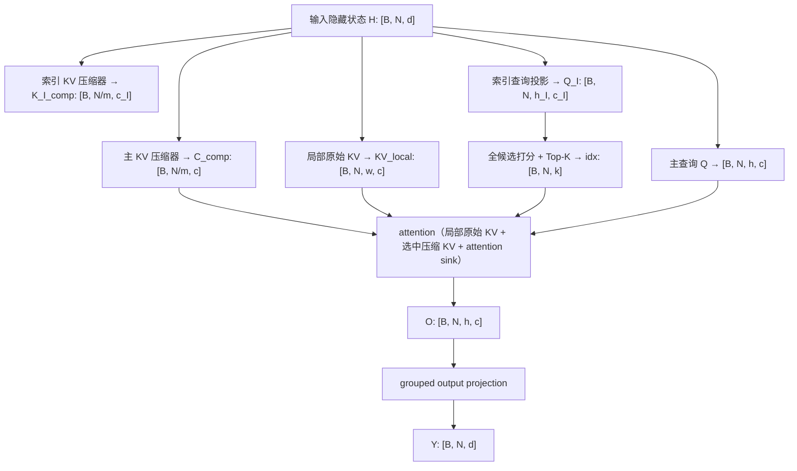

# 从「压缩记忆」到「稀疏读取」：DeepSeek-V4 CSA（Compressed Sparse Attention）深度解析

> **范围说明**：本文中的 CSA 专指 DeepSeek-V4 提出的 **Compressed Sparse Attention**。它不是泛指「任意带压缩的稀疏注意力」，也不是把 DeepSeek-V3 的 MLA 简单换一个名字。DeepSeek-V4 将 CSA 与 HCA（Heavily Compressed Attention）交错部署，用于原生支持百万 token 上下文。文中公式、张量语义与实现细节以技术报告、官方推理源码（锁定 commit）与上游框架合入状态为准，模拟与教学复现均明确标注。

在 dots3-note 那篇笔记里，我对一次 295K token 的 re-prefill 做过 attention 部分的解析 FLOP 账：33 层 SWA 把复杂度压到 `O(L·W)`，13 层 full MLA 的主 attention 被 DSA 压到 `O(L·topk)`，但真正刺眼的是 DSA indexer 那一项，将近八成的 attention 浮点量落在它身上，因为它要先拿低维 head 把当前 query 和全部历史 token 算一遍相关性分数，才谈得上挑 top-k，这一步仍然是彻头彻尾的 `O(L²)`，只是系数小了一些。

当时我就在想，如果这个平方项换个方向去消灭呢？不去优化 indexer 的系数，而是先把历史 token 压缩掉，让 indexer 的候选集合本身就变小。2026 年 4 月 DeepSeek-V4 系列发布（LMSYS 的 Day-0 博客在 4 月 25 日，技术报告随后公开于 arXiv 2606.19348v1），技术报告给出的答案正是这条路径：**CSA 先把每 m 个 token 压成一个共享 KV 记忆，再在压缩记忆上跑 DSA**。我第一次读报告时其实被 CSA 和 HCA 这两个名字绕晕了很久，也反复被一个问题卡住：KV 都压缩了，为什么还要再做 top-k？这篇文章就是想把这套「先压缩、再稀疏读取」的设计从头推导一遍，顺便把官方参考实现、SGLang/Megatron 的落地状态和那些容易写错的细节一次讲清楚。

先亮一组数据，让读者对「这套设计到底省了什么」有一个具体感知（均为 DeepSeek-V4 技术报告的官方估算口径，1M-token context 场景）：

| 对比项 | DeepSeek-V4-Pro vs V3.2 | DeepSeek-V4-Flash vs V3.2 |
| --- | --- | --- |
| 单 token 推理 FLOPs（等价 FP8） | 27% | 10% |
| KV cache 大小 | 10% | 7% |
| 相对 BF16 GQA8（head dim 128）基线的 KV cache | 约 2%（1M context，V4 系列整体口径） | 约 2%（1M context，V4 系列整体口径） |

需要强调的是，这是**整套模型与低精度系统协同后的官方估算**（含 FP4 expert、FP8 KV、indexer FP4 等），不能归因于 CSA 单一模块。([arXiv][1])

这篇文章的路线图：

1. 先建立概念框架：为什么 MQA/FlashAttention 都没有解决「历史位置数量」这个成本维度，序列压缩与稀疏读取各自解决什么问题；
2. 再走 DeepSeek-V4 这个具体模型：CSA 的压缩器、Lightning Indexer、核心注意力、HCA 交错部署，以及一个可以手算的张量例子；
3. 然后进入工程代码：官方参考实现（锁定 commit）的 Compressor/Indexer/Attention/sparse-attn kernel 走读，prefill 与 decode 的两套控制流；
4. 最后是系统全景与判断：SGLang、Megatron-LM、Transformers、verl 的落地状态，权衡、误区与选型建议。

照例，感谢各位大哥的讨论和支持：zhuoran，changyi，ji li，chengxi。

---

## 检索路径与口径

本次检索不是围绕一个关键词做资料汇总，而是分成五条相互校验的链路：

| 轮次 | 目标 | 核心来源 |
| --- | --- | --- |
| 第一轮 | 确认 CSA 的正式定义、模型配置和效率口径 | DeepSeek-V4 技术报告（arXiv `2606.19348v1`） |
| 第二轮 | 追踪「为什么要先压缩再稀疏选择」 | DeepSeek-V3.2 DSA、NSA |
| 第三轮 | 将论文公式映射到可执行代码 | DeepSeek-V4 官方 `model.py`、`kernel.py`、`config.json`（锁定 commit `5607980f3a4b8ea0371b9f11e1848ac41f14979e`） |
| 第四轮 | 追踪真实训练与推理实现 | SGLang、Megatron-LM、Transformers、verl |
| 第五轮 | 检查实现差异、历史错误和未完成事项 | GitHub PR、issue、roadmap |

检索日期为 **2026 年 8 月 29 日**，与本地参考资料索引（[references/README.md](references/README.md)）的锁定记录一致。文中涉及「已合并」「草案」「开发中」的表述均以该日期为截点；SGLang #23882（merge commit `35870d55`）、#24890（merge commit `e2290b15`）、Megatron #6400（merge commit `a2003d48`）均已合入主线，Megatron #6404 仍为 draft，Megatron #6757 是 MoE roadmap，与本文无直接关系，未作为本文核心引用（本地参考资料索引仍保留其为 triage background 条目，见 [references/README.md](references/README.md)）。

---

## TL;DR

CSA 可以压缩成一句话：

> **先把每 m 个历史 token 压成一个共享的 KV 记忆，再让一个轻量索引器从这些压缩记忆中选出 top-k，最后让所有 query heads 只对「局部原始 token + 被选中的压缩记忆」做注意力。**

但这句话隐去了六个决定成败的设计：

1. **压缩发生在序列轴，而不是隐藏维度轴。**
   对长度 N 的历史，CSA 将候选记忆数从 N 减为约 N/m。这与 MLA、MQA 主要压缩每个位置的 KV 宽度不同。

2. **它不是固定平均池化。**
   每个压缩通道都有独立的、内容相关的 softmax 权重，并使用相邻块重叠，试图缓和块边界造成的信息断裂。

3. **索引器继承自 DSA。**
   一个多头低维索引器扫描压缩候选，产生每个 query 的 top-k 压缩位置。核心注意力变成 O(Nk)，但索引器仍需扫描所有压缩候选，因此 prefill 并没有严格变成线性复杂度。([arXiv][1])

4. **核心注意力使用共享 K=V 的 MQA。**
   一个压缩向量同时充当 key 和 value，并被所有 query heads 复用；局部原始窗口、压缩记忆和 attention sink 位于同一个 softmax 分母中。([arXiv][1])

5. **HCA 不是无关的附属模块。**
   CSA 用较轻压缩 m=4 后做 top-k；HCA 用重压缩 m'=128，但对所有压缩条目做稠密注意力。DeepSeek-V4 交替使用二者。([arXiv][1])

6. **真正困难的部分在系统而不只在公式。**
   如果显式物化索引分数 `[B,N,H_I,N/m]`、逐 query gather 的 KV、多个异构 cache pool，那么「算法稀疏」仍可能在显存、Top-K、缓存和通信上变慢。SGLang 因此专门实现了 ShadowRadix 异构 prefix cache、Flash Compressor、Lightning TopK 和 context parallelism。([LMSYS Org][2])

---

## 一、学习动机：为什么「FlashAttention + MQA」还不够

第一次看到 CSA 时，很容易产生三个疑问：

> MQA 已经只保存一份 KV，为什么还要压缩？
> FlashAttention 已经不物化 N×N 注意力矩阵，为什么百万上下文仍然贵？
> 都已经压缩了，为什么还要再做 top-k？

答案是：这些方法处理的是**不同维度的成本**。

设输入隐藏状态为

$$
H\in\mathbb{R}^{B\times N\times d},
$$

其中：B 是 batch size，N 是序列长度，d 是模型隐藏维度，h 是 query head 数，c 是每个 head 的维度。

在共享 KV 的 MQA 中，可以有：

$$
Q\in\mathbb{R}^{B\times N\times h\times c},
\qquad
K=V\in\mathbb{R}^{B\times N\times c}.
$$

MQA 确实将 KV cache 从多头形式 O(Nhc) 降为 O(Nc)。可是每个新 query 仍然要读取 N 个历史位置：

$$
\operatorname{Attn}(q_t,K,V)
=
\operatorname{Softmax}
\left(
\frac{q_tK^\top}{\sqrt c}
\right)V.
$$

因此：

* 单 token 解码仍需扫描 O(N) 个 KV；
* 全序列 prefill 的核心注意力仍为 O(N²)；
* FlashAttention 主要避免了完整注意力矩阵落入 HBM，并没有凭空消除所有 QK 计算；
* 当 N 达到几十万乃至一百万时，**历史位置数本身**成为问题。

NSA 的系统分析也强调：训练和 prefill 往往更偏计算受限，而单 token decode 往往更偏 KV 读取带宽受限，因此二者需要不同的优化重点。([arXiv][3])

CSA 的核心变化不是继续压缩 c，而是：

$$
N \longrightarrow T=\frac{N}{m}.
$$

也就是把**序列轴上的历史位置数**压缩掉。

---

## 二、最小概念模型：CSA 到底改变了什么

忽略 RoPE、量化、并行和缓存管理，CSA 的主干可以画成下面的数据流：



其中有四个关键超参数：

| 参数 | 含义 | 增大后的直接效果 |
| --- | --- | --- |
| m | CSA 压缩率 | 候选和 cache 更少，但压缩损失更大 |
| k | 每个 query 选择的压缩条目数 | 检索召回更高，但核心注意力更贵 |
| w | 原始 token 局部窗口 | 局部细节更完整，但保留更多未压缩 KV |
| m' | HCA 压缩率 | 全局摘要更便宜，但粒度更粗 |

DeepSeek-V4-Flash 使用 m=4, k=512, w=128, m'=128；Pro 使用 m=4, k=1024, w=128, m'=128。([arXiv][1])

### 2.1 DeepSeek-V4 系列全貌

先把两个模型的身世交代清楚，后面引用配置时不至于迷失。DeepSeek-V4 系列由 DeepSeek-AI 于 2026 年 4 月发布（技术报告 arXiv 2606.19348v1），包含两个 MoE 模型：**V4-Pro**（总参数 1.6T、每 token 激活 49B、61 层、hidden 7168）与 **V4-Flash**（总参数 284B、每 token 激活 13B、43 层、hidden 4096），两者都原生支持 1M context；除混合注意力（CSA/HCA）外还引入 mHC 残差连接与 Muon 优化器，checkpoint 发布在 [Hugging Face 集合](https://huggingface.co/collections/deepseek-ai/deepseek-v4)。([arXiv][1])

| 注意力相关配置 | V4-Pro | V4-Flash |
| --- | --- | --- |
| query heads / head dim | 128 / 512 | 64 / 512 |
| index heads / index dim | 64 / 128 | 64 / 128 |
| o_groups / o_lora_rank | 16 / 1024 | 8 / 1024 |
| 前两层注意力 | HCA | 纯 SWA |
| 之后 | CSA/HCA 交错 | CSA/HCA 交错 |

m / k / w / m' 见前表，层调度细节见第六章。([arXiv][1])

---

## 三、第一步：把历史 token 压成可学习的 KV 记忆

### 3.1 为什么普通平均池化不够

最简单的序列压缩是：

$$
C_i
=
\frac{1}{m}
\sum_{j=mi}^{m(i+1)-1} H_jW^{KV}.
$$

它的问题非常直接：

* 每个 token 权重相同；
* 每个特征通道使用相同权重；
* 块边界完全固定；
* 一个关键信息 token 可能被大量普通 token 稀释；
* 跨块语义无法自然连续。

CSA 使用的是**按通道、按内容学习的 softmax pooling**。

首先生成两套候选 KV 和两套门控分数：

$$
C^a=HW^{aKV},
\qquad
C^b=HW^{bKV},
$$

$$
Z^a=HW^{aZ},
\qquad
Z^b=HW^{bZ},
$$

其中 C^a, C^b, Z^a, Z^b ∈ R^{N×c}。然后，第 i 个压缩条目会读取：当前块的一条分支，以及前一个块的另一条分支。

论文写作：

$$
\left[
S^a_{mi:m(i+1)-1};
S^b_{m(i-1):mi-1}
\right]
=
\operatorname{Softmax}_{\text{position}}
\left(
\left[
Z^a_{mi:m(i+1)-1}+B^a;
Z^b_{m(i-1):mi-1}+B^b
\right]
\right),
$$

$$
C_i^{\mathrm{Comp}}
=
\sum_{j=mi}^{m(i+1)-1}
S_j^a\odot C_j^a
+
\sum_{j=m(i-1)}^{mi-1}
S_j^b\odot C_j^b.
$$

Softmax 在总计 2m 个候选位置上进行，但**每个通道独立归一化**。因此 S_j^a, S_j^b ∈ R^c，不是每个 token 一个标量。([arXiv][1])

这意味着：

> 压缩向量的第 17 个通道可以主要来自 token A，而第 418 个通道可以主要来自 token B。

它更接近「每个通道选择自己需要的信息来源」，而不是把 m 个 token 做一个统一加权平均。

### 3.2 重叠压缩到底重叠在哪里

令 m=4。忽略开头 padding，压缩条目与原始块的对应关系是：C_comp[0] 只读当前块 [0,1,2,3]（前块分支 padding 为 -inf/0）；C_comp[1] 的当前分支来自 [4,5,6,7]、前块分支来自 [0,1,2,3]；C_comp[2] 的当前分支来自 [8,9,10,11]、前块分支来自 [4,5,6,7]。

每个压缩条目读取 2m 个候选向量，但相邻条目复用同一原始块的不同投影分支，因此输出条目数仍然只有

$$
T=\frac{N}{m},
$$

而不是 N/(2m)。([arXiv][1]) 换句话说，重叠不改变输出数量，改变的是每个条目能看到的信息范围：块边界不再是把「第 3 个和第 4 个 token」硬生生切开的墙。

在「平均池化 → 最终方案」之间其实还有一个自然中间档：内容相关的 softmax pooling、但没有 overlap。它已经解决了权重平均的问题，却仍受块边界限制：一个恰好横跨边界的关键 token 会被硬生生切进两个块，两边都只保留它一半的信息。overlap 正是针对这一档的缺陷：每个压缩条目除了当前块的 normal 分支，还读前一个块的 overlap 分支，让边界 token 同时参与两个摘要，代价是相邻条目共享输入范围、压缩时需要保留未闭合的块状态。

但它引入了两个系统代价：

1. 增量解码时必须保留尚未闭合的块状态；
2. context parallelism 切分序列后，相邻压缩块可能跨 rank 边界。

DeepSeek 官方实现因此维护 `kv_state` 和 `score_state`；SGLang/Miles 的训练实现则需要处理 C4 overlap 跨 CP rank 的通信。([Hugging Face][4])

### 3.3 因果性：什么时候一个压缩条目才可见

这是最容易写错的地方。

使用从 0 开始的 token 索引 t，长度为 m 的压缩块只有在其最后一个 token 到达后才能生成。因此，query t 可使用的完整压缩块数量为：

$$
r_t
=
\left\lfloor\frac{t+1}{m}\right\rfloor.
$$

合法压缩位置满足：

$$
s<r_t.
$$

例如 m=4：

| query t | 已看到 token | 可用压缩条目 |
| ---: | --- | --- |
| 0 | 0 | 无 |
| 2 | 0–2 | 无 |
| 3 | 0–3 | C_0^Comp |
| 6 | 0–6 | C_0^Comp |
| 7 | 0–7 | C_0^Comp, C_1^Comp |

官方参考代码的因果 mask 正是以 `arange(1, seqlen + 1) // ratio` 构造完成块数量。([Hugging Face][4])

> **常见错误**：直接使用 s ≤ ⌊t/m⌋，或者让 query 提前读取一个尚包含未来 token 的未闭合压缩块。本地转换稿中该条件写作 `s < Floor(t/m)`，未说明索引起点，容易让人误以为是 ⌊t/m⌋；以锁定实现为准，0-based 索引下完整块的计数是 ⌊(t+1)/m⌋，即 token 3（第 0 块的最后一个 token）已经能看到 C_0^Comp。

---

## 四、第二步：Lightning Indexer 从压缩记忆里找 Top-K

> **本文的驱动问题**：序列压缩（第三章）与稀疏读取（第四章）是两种独立技巧，DeepSeek-V4 为什么必须组合使用，组合之后模型与系统各自付出什么、换回什么？从这一章开始两条线交汇：压缩后的候选仍然太多，必须再稀疏一次；而这一次选择会在系统层面引出新的成本，这正是后半篇文章的主题。

仅仅将 N 压成 N/m 仍然不够。

对于 1,048,576 token：

$$
T=\frac{1,048,576}{4}=262,144.
$$

（T=N/m 的记法假设 N 能被 m 整除；流式实现实际只产生 ⌊N/m⌋ 个完成块，尾部不足 m 个 token 会留在 tail state 中等待凑齐，官方代码的 Top-K 也会把 k 收缩为 `min(index_topk, end_pos // ratio)`。）

如果每个 query 仍然对 262,144 个压缩条目做主注意力，解码依旧很重。因此 CSA 在压缩后继续应用 DeepSeek Sparse Attention 的索引机制。论文明确将它描述为「先压缩，再应用 DSA」。([arXiv][1])

### 4.1 索引查询与索引键

CSA 单独生成低维的压缩索引键：

$$
K^{IComp}\in\mathbb{R}^{T\times c_I}.
$$

query 先经过低秩投影：

$$
c_t^Q=h_tW^{DQ},
$$

再展开为 h_I 个索引头：

$$
q_t^I=c_t^QW^{IUQ}
\in\mathbb{R}^{h_I\times c_I}.
$$

随后生成每个索引头的 query 相关权重：

$$
w_t^I=h_tW^w
\in\mathbb{R}^{h_I}.
$$

对于压缩候选 s，分数为：

$$
I_{t,s}
=
\sum_{r=1}^{h_I}
w_{t,r}^I
\operatorname{ReLU}
\left(
q_{t,r}^I\cdot K_s^{IComp}
\right).
$$

最后：

$$
\mathcal S_t
=
\operatorname{TopK}
\left(I_{t,:},k\right).
$$

这些公式与 DSA 的原始 indexer 形式一致，只是候选从「原始 token 对应的 latent KV」变成了「压缩后的 block KV」。([arXiv][1])

### 4.2 张量形状

设 B=2、N=16、m=4、T=N/m=4、h_I=4、c_I=8、k=2，则：

```text
Q_index       [2, 16, 4, 8]
K_index_comp  [2,  4,    8]

per-head score:
einsum("bshd,btd->bsht")
               ↓
              [2, 16, 4, 4]

weighted sum over index heads
               ↓
index score    [2, 16, 4]

top-k
               ↓
top indices    [2, 16, 2]
```

官方参考实现中的核心代码结构就是：

```python
index_score = torch.einsum("bshd,btd->bsht", q, compressed_index_k)
index_score = (
    index_score.relu_() * query_dependent_weights.unsqueeze(-1)
).sum(dim=2)
topk_idxs = index_score.topk(k, dim=-1).indices
```

随后在 tensor parallel 模式下，对不同 index heads 的部分和执行 `all_reduce`，再做全局 Top-K。([Hugging Face][4])

值得展开的是 `query_dependent_weights` 这一步。它不是标准 attention 里那个固定的 1/√c 缩放，而是由当前 token 的隐藏状态 h_t 经一层线性投影（`weights_proj`）产生的 h_I 个标量，再乘上 `softmax_scale * n_heads ** -0.5` 的全局缩放。每个头对最终分数的贡献权重随 query 内容变化，训练时由模型自行学习，让「更会挑相关块的头」拿到更高的聚合权重。（注意 `weights_proj` 是线性投影、无激活，聚合权重可正可负，与 softmax 概率不同。）这和 QK^T softmax 的表征差异是本质性的：QK^T 的每个头独立归一化、头间无权重竞争，而 indexer 是「多头打分 + 可学习加权求和」，最后才做一次全局 top-k，头间信息在选块之前就已经融合。

### 4.3 一个重要结论：CSA 并没有完全消灭二次复杂度

核心注意力只访问 k+w 个条目：

$$
O\bigl(N(k+w)hc\bigr).
$$

但 indexer 仍需为每个 query 扫描 T=N/m 个候选：

$$
O\left(
N\frac{N}{m}h_Ic_I
\right).
$$

因此 prefill 中，索引器从渐近意义上仍是：

$$
O\left(\frac{N^2}{m}\right).
$$

只是：

* c_I 比主注意力维度小；
* 索引头数量有限；
* 使用低精度（FP4）；
* 候选数先缩短了 m 倍；
* 后续主注意力只对 Top-K 工作。

DSA 论文也明确指出：其主注意力降为 O(Lk)，但 lightning indexer 本身仍为 O(L²)。CSA 通过先压缩将这一扫描的常数降低到约 1/m，却没有从数学上消除它。([arXiv][5])

这解释了为什么 DeepSeek-V4 的高性能实现仍然需要专门优化 indexer 与 Top-K，而不是实现一个普通 `torch.topk` 就结束。我在 [dots3-note 的笔记](../../sglang/dots3-note/readme.md)里对一次 295K token 的 re-prefill 做过 attention 部分的解析 FLOP 账：33 层 SWA 只占 2.1%，13 层 DSA indexer 占 79.2%，13 层 DSA 主 attention 占 18.7%（46 层全 dense 的假想基线为 58.4 PFLOP，dots3 实际为 5.85 PFLOP）。CSA 把 indexer 的候选扫描范围从 N 缩到 N/4，扫描项的浮点量降到约四分之一，但 indexer 依然是稀疏注意力里最贵的单项。需要注明：那是 dots3 的账（index_topk=2048、64 头 128 维），与 V4 的 indexer 配置不完全相同，引用它只是为了说明「indexer 主导稀疏注意力成本」这一结构事实。这个结论也与 10.4 节的 256 GiB 账目互为因果：正因为 indexer 的打分空间大到无法整体物化，生产实现必须把打分与 Top-K 流式化或融合化，而不是在 §4 算完复杂度就结束。

---

## 五、第三步：核心注意力读取什么

第四章回答了「压缩后为什么还要 top-k」：每个 query 的核心注意力读取预算就是 k+w 个条目。这一章把这两类条目分别展开。

对于 query t，CSA 的可读记忆由两部分构成：

$$
\mathcal M_t
=
\mathcal L_t
\cup
\mathcal C_t,
$$

其中：L_t 是最近 w 个**未压缩原始 KV**，C_t 是索引器选中的 k 个**压缩 KV**。

DeepSeek-V4 的 CSA 和 HCA 都额外保留长度 128 的原始 sliding-window 分支，用来保护局部细节。([arXiv][1])

### 5.1 共享 K=V 的 MQA

主查询为：

$$
Q_t\in\mathbb{R}^{h\times c}.
$$

但每个记忆位置只有一个共享向量：

$$
M_j\in\mathbb{R}^{c}.
$$

而且同一向量既作为 key，又作为 value：

$$
o_{t,r}
=
\operatorname{CoreAttn}
\left(
q_{t,r},
K=\mathcal M_t,
V=\mathcal M_t
\right).
$$

这是一种共享 K=V 的 MQA：

* 所有 query heads 共用相同记忆；
* 不需要为每个 head 保存一份 KV；
* 相同压缩条目只读取一次或尽量复用；
* 代价是 key/value 表达不再独立，形成额外的信息瓶颈。([arXiv][1])

注意这里与 NSA 的显著区别：NSA 为压缩、选择、窗口三个分支提供**独立的 key 和 value**，并用可学习 gate 融合三个分支的输出；CSA 则把局部原始 KV 与压缩 KV 放进**同一个核心 attention 的同一个 softmax**，K 和 V 完全共享。后者更简单，但「哪个分支该被信任」的调节只能发生在压缩与索引环节，而不是发生在 attention 输出的融合环节。

### 5.2 Attention sink 不是一个普通 token

对第 r 个 query head，记忆 logits 为：

$$
\ell_{t,r,j}
=
\frac{q_{t,r}^{\top}M_j}{\sqrt c}.
$$

CSA 加入一个可学习 sink logit a_r：

$$
p_{t,r,j}
=
\frac{
\exp(\ell_{t,r,j})
}{
\exp(a_r)+
\sum_{u\in\mathcal M_t}\exp(\ell_{t,r,u})
}.
$$

输出仍然只对实际 KV 求和：

$$
o_{t,r}
=
\sum_{j\in\mathcal M_t}
p_{t,r,j}M_j.
$$

sink 只进入分母，没有对应 value。因此：

$$
\sum_{j\in\mathcal M_t}p_{t,r,j}\leq 1.
$$

当当前记忆都不值得关注时，一个 head 可以把大量概率质量「丢进 sink」，使实际输出接近零，而不是被迫在一堆低质量候选上归一化到 1。([arXiv][1])

### 5.3 为什么还要对输出做逆 RoPE

DeepSeek-V4 只在每个 query 和 KV 条目的最后 64 个维度使用 partial RoPE。问题是 CSA 中同一个向量既是 key，又是 value：

$$
K_j=V_j=M_j.
$$

一旦对 M_j 施加 RoPE，它作为 value 参与加权和时，会把位置旋转一并带入输出。于是官方实现会在核心注意力输出的 RoPE 子空间上应用逆向旋转，以消除 query 绝对位置带来的旋转，使结果重新表现为相对位置关系。([arXiv][1])

官方代码对应（见锁定 commit 的 `Attention.forward` 与 `apply_rotary_emb`）：

```python
apply_rotary_emb(q[..., -rd:], freqs_cis)
apply_rotary_emb(kv[..., -rd:], freqs_cis)

o = sparse_attn(...)

apply_rotary_emb(o[..., -rd:], freqs_cis, inverse=True)
```

`apply_rotary_emb` 的 inverse 分支通过对 `freqs_cis` 取共轭实现去旋转，等价于施加位置 -t 的旋转。([Hugging Face][4])

### 5.4 为什么需要 grouped output projection

若直接拼接所有 head：

$$
o_t\in\mathbb{R}^{hc},
$$

DeepSeek-V4-Pro 中 h=128、c=512，所以拼接宽度为：

$$
128\times512=65,536.
$$

直接从 65,536 投影回隐藏维度 7,168 会非常昂贵。

因此先将 heads 分为 g 组，每组降到低秩维度 d_g：

$$
o_t^{G_i}
\in
\mathbb{R}^{c h/g}
\longrightarrow
o_t^{G_i'}
\in
\mathbb{R}^{d_g},
$$

再拼接所有组并投影回 d：

$$
\mathbb{R}^{gd_g}
\longrightarrow
\mathbb{R}^{d}.
$$

Pro 使用 16 组、每组中间维度 1024；Flash 使用 8 组、每组 1024。([arXiv][1])

官方代码中的两级映射是：

```python
self.wo_a = ColumnParallelLinear(...)
self.wo_b = RowParallelLinear(...)
```

`wo_a` 把每组 head 的输出先降到 o_lora_rank，`wo_b` 再把所有组的低秩结果拼回隐藏维度；`wo_a` 的权重在 checkpoint 中是 FP8，代码里用分组 einsum 执行第一层低秩映射（注释明确说明为了简单起见用 BF16 计算）。([Hugging Face][4])

---

## 六、为什么还要有 HCA

### 6.1 HCA 做了什么

HCA 与 CSA 共享压缩、单 KV head、局部窗口和 grouped output projection 的总体思想，但做了两个关键改变：

1. 压缩率从 m=4 提升为 m'=128；
2. 取消 indexer，对所有压缩条目做稠密注意力。

即：

$$
T_{\mathrm{HCA}}
=
\frac{N}{m'},
$$

$$
o_t
=
\operatorname{Attn}
\left(
q_t,
C^{Comp}_{0:r'_t}
\cup \mathcal L_t
\right),
\qquad
r'_t=\left\lfloor\frac{t+1}{m'}\right\rfloor.
$$

HCA 也取消了 C4 那种相邻块重叠，采用非重叠重压缩。公式里的下标 r'_t 与第三章 3.3 是同一套因果规则：query t 只能看到已经闭合的压缩块（s < ⌊(t+1)/m'⌋），否则按字面读取 C^{Comp}_{0:T_{HCA}} 会把未来块也卷进来。([arXiv][1])

### 6.2 CSA 和 HCA 不是谁替代谁

二者解决的风险不同：

| 机制 | 全局记忆粒度 | 是否检索 | 主要优势 | 主要风险 |
| --- | ---: | ---: | --- | --- |
| CSA | 较细，m=4 | Top-k | 可按 query 选择较细粒度历史 | indexer 扫描与 Top-K 成本 |
| HCA | 很粗，m'=128 | 不检索 | 所有粗粒度全局摘要都可见 | 压缩不可逆，细节损失大 |
| SWA | 原始 token | 最近 w 个 | 精确局部依赖 | 无法单独建模远程依赖 |

以 1,048,576 token 为例：

$$
T_{\mathrm{CSA}}=262,144,
\qquad
T_{\mathrm{HCA}}=8,192.
$$

对于 Pro：

```text
CSA 每个 query 的逻辑主注意力范围：
1024 个被选压缩条目 + 128 个局部 token = 1152

HCA 每个 query 的逻辑主注意力范围：
8192 个全局重压缩条目 + 128 个局部 token = 8320
```

HCA 看似访问条目更多，但它没有索引器，而且全局候选已经被压缩 128 倍。

一个合理的架构解释是：

> CSA 提供「细粒度但选择性」的远程记忆，HCA 提供「粗粒度但全覆盖」的远程记忆；交错部署可以避免所有层都依赖同一种检索误差或同一种压缩瓶颈。

这是由架构得出的解释，而不是论文中已经通过完整消融严格证明的唯一原因。论文只明确报告了两者交错使用。([arXiv][1])

层调度的具体事实（来自官方 config.json 的 `compress_ratios` 与报告 §4.2.1）：Pro 的 61 个主层中，**前两层是 HCA（ratio 128）**，之后 CSA（ratio 4）与 HCA 交错；Flash 的 43 个主层中，**前两层是纯 sliding-window attention**，之后交错。`compress_ratios` 列表共有 62 个元素，最后一个 0 属于 MTP 层（单层 MTP head 只跑 SWA-only attention，没有 compressor 和 indexer，这也与 LMSYS Day-0 博客对 MTP 的描述一致）。([Hugging Face][6])

---

## 七、用一个完整的小例子走通张量

设：

```text
B = 2
N = 16
d = 64

query heads h = 4
head dim c = 16

compression ratio m = 4
compressed length T = 4

index heads h_I = 4
index dim c_I = 8

top-k k = 2
local window w = 4
```

完整张量流如下：

| 阶段 | 张量 | 形状 |
| --- | --- | --- |
| 输入 | H | [2,16,64] |
| 主 KV 压缩 | C^Comp | [2,4,16] |
| 索引 KV 压缩 | K^IComp | [2,4,8] |
| 主查询 | Q | [2,16,4,16] |
| 索引查询 | Q^I | [2,16,4,8] |
| 索引逐头分数 | Q^I(K^IComp)^T | [2,16,4,4] |
| 聚合索引分数 | I | [2,16,4] |
| Top-K 索引 | S | [2,16,2] |
| gather 后压缩记忆 | C_S^Comp | [2,16,2,16] |
| 局部原始记忆 | L | [2,16,4,16] |
| 逻辑注意力记忆 | [L; C_S^Comp] | [2,16,6,16] |
| 多头输出 | O | [2,16,4,16] |
| 最终输出 | Y | [2,16,64] |

这里的 [2,16,6,16] 是**教学上的逻辑视图**。

生产 kernel 不应真的为所有 query 物化这一张量，因为其大小是：

$$
B\times N\times(k+w)\times c.
$$

正确的 kernel 应该按 tile 读取索引、gather KV、在线计算 softmax 和加权和。这也是第八章教学实现与生产 kernel 之间最本质的差别。

---

## 八、最小可运行 PyTorch 实现

下面的代码实现了 CSA 的语义骨架：

* 重叠、按通道 softmax 压缩；
* 独立的 indexer 压缩空间；
* 多头 ReLU index score；
* 因果 Top-K；
* 原始 sliding window；
* 共享 K=V；
* attention sink。

它是**教学实现，不是 DeepSeek-V4 生产实现**。我已在本机（PyTorch 2.10，CPU）实际运行过，输出形状与下方预期完全一致。

<details>
<summary><strong>展开：最小可运行 TinyCSA</strong></summary>

```python
import math

import torch
from torch import nn
import torch.nn.functional as F


class OverlapCompressor(nn.Module):
    """
    Teaching implementation of CSA-style overlapping compression.

    Input:
        x: [B, S, D]

    Output:
        compressed: [B, floor(S / m), C]

    The first projected half provides the previous-block branch;
    the second half provides the current-block branch.
    """

    def __init__(
        self,
        d_model: int,
        compressed_dim: int,
        m: int = 4,
    ) -> None:
        super().__init__()

        if m < 1:
            raise ValueError("m must be >= 1")

        self.m = m
        self.compressed_dim = compressed_dim

        # Two value branches and two gate branches.
        self.value_proj = nn.Linear(
            d_model,
            2 * compressed_dim,
            bias=False,
        )
        self.gate_proj = nn.Linear(
            d_model,
            2 * compressed_dim,
            bias=False,
        )

        # One positional bias per position, branch, and channel.
        self.pos_bias = nn.Parameter(
            torch.zeros(m, 2 * compressed_dim)
        )

        self.norm = nn.RMSNorm(compressed_dim)

    def forward(self, x: torch.Tensor) -> torch.Tensor:
        if x.ndim != 3:
            raise ValueError(
                f"Expected [B,S,D], got shape {tuple(x.shape)}"
            )

        batch, seq_len, _ = x.shape
        n_blocks = seq_len // self.m

        if n_blocks == 0:
            return x.new_empty(
                batch,
                0,
                self.compressed_dim,
            )

        # Teaching version drops an incomplete tail.
        # A real decode implementation must retain it as state.
        x = x[:, : n_blocks * self.m]

        value = self.value_proj(x).view(
            batch,
            n_blocks,
            self.m,
            2,
            self.compressed_dim,
        )
        gate = self.gate_proj(x).view(
            batch,
            n_blocks,
            self.m,
            2,
            self.compressed_dim,
        )

        gate = gate + self.pos_bias.view(
            1,
            1,
            self.m,
            2,
            self.compressed_dim,
        )

        # Current block uses branch 1.
        current_value = value[..., 1, :]
        current_gate = gate[..., 1, :]

        # Previous block uses branch 0 from block i-1.
        previous_value = torch.zeros_like(value[..., 0, :])
        previous_gate = torch.full_like(
            gate[..., 0, :],
            float("-inf"),
        )

        if n_blocks > 1:
            previous_value[:, 1:] = value[:, :-1, :, 0, :]
            previous_gate[:, 1:] = gate[:, :-1, :, 0, :]

        # [B, T, 2m, C]
        source = torch.cat(
            [previous_value, current_value],
            dim=2,
        )
        logits = torch.cat(
            [previous_gate, current_gate],
            dim=2,
        )

        # Use FP32 for the reduction, as production code also treats
        # compression numerics carefully.
        weight = torch.softmax(
            logits.float(),
            dim=2,
        ).to(source.dtype)

        compressed = (source * weight).sum(dim=2)
        return self.norm(compressed)


class TinyCSA(nn.Module):
    """
    Semantically faithful but intentionally non-production CSA skeleton.

    It materializes index scores and gathered memories, so it is suitable
    only for small correctness experiments.
    """

    def __init__(
        self,
        d_model: int = 64,
        n_heads: int = 4,
        head_dim: int = 16,
        index_heads: int = 4,
        index_dim: int = 8,
        m: int = 4,
        topk: int = 2,
        window: int = 4,
    ) -> None:
        super().__init__()

        if n_heads * head_dim <= 0:
            raise ValueError("Invalid attention dimensions")
        if topk < 1 or window < 1:
            raise ValueError("topk and window must be >= 1")

        self.n_heads = n_heads
        self.head_dim = head_dim
        self.index_heads = index_heads
        self.index_dim = index_dim
        self.m = m
        self.topk = topk
        self.window = window

        self.q_proj = nn.Linear(
            d_model,
            n_heads * head_dim,
            bias=False,
        )

        # One raw local KV head, shared by all query heads.
        self.local_kv_proj = nn.Linear(
            d_model,
            head_dim,
            bias=False,
        )

        # Main compressed KV and indexer compressed KV have
        # different feature dimensions and parameters.
        self.main_compressor = OverlapCompressor(
            d_model,
            head_dim,
            m,
        )
        self.index_compressor = OverlapCompressor(
            d_model,
            index_dim,
            m,
        )

        self.index_q_proj = nn.Linear(
            d_model,
            index_heads * index_dim,
            bias=False,
        )
        self.index_weight_proj = nn.Linear(
            d_model,
            index_heads,
            bias=False,
        )

        self.attn_sink = nn.Parameter(
            torch.zeros(n_heads)
        )

        # Real DeepSeek-V4 uses grouped low-rank output projection.
        self.out_proj = nn.Linear(
            n_heads * head_dim,
            d_model,
            bias=False,
        )

    def _index(
        self,
        x: torch.Tensor,
        index_k: torch.Tensor,
    ) -> tuple[torch.Tensor, torch.Tensor]:
        batch, seq_len, _ = x.shape
        n_blocks = index_k.size(1)

        if n_blocks == 0:
            empty_idx = torch.full(
                (batch, seq_len, self.topk),
                -1,
                device=x.device,
                dtype=torch.long,
            )
            empty_score = x.new_empty(batch, seq_len, 0)
            return empty_idx, empty_score

        q_i = self.index_q_proj(x).view(
            batch,
            seq_len,
            self.index_heads,
            self.index_dim,
        )

        # Matches the reference implementation's linear, query-dependent
        # index-head weighting.
        w_i = self.index_weight_proj(x)
        w_i = w_i * (
            self.index_dim ** -0.5
            * self.index_heads ** -0.5
        )

        # [B,S,H_I,T]
        score_per_head = torch.einsum(
            "bshd,btd->bsht",
            q_i,
            index_k,
        )

        # [B,S,T]
        score = (
            F.relu(score_per_head)
            * w_i.unsqueeze(-1)
        ).sum(dim=2)

        # At zero-based query position t, only floor((t+1)/m)
        # complete compressed blocks exist.
        ready_blocks = torch.div(
            torch.arange(
                1,
                seq_len + 1,
                device=x.device,
            ),
            self.m,
            rounding_mode="floor",
        )

        block_id = torch.arange(
            n_blocks,
            device=x.device,
        )

        valid = (
            block_id.unsqueeze(0)
            < ready_blocks.unsqueeze(1)
        )

        score = score.masked_fill(
            ~valid.unsqueeze(0),
            float("-inf"),
        )

        k_eff = min(self.topk, n_blocks)
        top_score, top_idx = score.topk(
            k_eff,
            dim=-1,
        )

        # topk() returns arbitrary indices if all candidates are -inf.
        top_idx = top_idx.masked_fill(
            ~torch.isfinite(top_score),
            -1,
        )

        if k_eff < self.topk:
            top_idx = F.pad(
                top_idx,
                (0, self.topk - k_eff),
                value=-1,
            )

        return top_idx, score

    @staticmethod
    def _gather_memory(
        memory: torch.Tensor,
        idx: torch.Tensor,
    ) -> tuple[torch.Tensor, torch.Tensor]:
        """
        memory: [B,T,C]
        idx:    [B,S,K]

        returns:
            gathered: [B,S,K,C]
            valid:    [B,S,K]
        """
        batch, n_blocks, dim = memory.shape
        _, seq_len, topk = idx.shape

        if n_blocks == 0:
            gathered = memory.new_zeros(
                batch,
                seq_len,
                topk,
                dim,
            )
            valid = torch.zeros(
                batch,
                seq_len,
                topk,
                dtype=torch.bool,
                device=memory.device,
            )
            return gathered, valid

        valid = idx >= 0
        safe_idx = idx.clamp_min(0)

        # expand() creates a view, but gather output is still explicitly
        # materialized. Production kernels must avoid this layout.
        expanded = memory[:, None].expand(
            batch,
            seq_len,
            n_blocks,
            dim,
        )

        gathered = torch.gather(
            expanded,
            dim=2,
            index=safe_idx[..., None].expand(
                batch,
                seq_len,
                topk,
                dim,
            ),
        )

        gathered = gathered * valid[..., None]
        return gathered, valid

    def _local_window(
        self,
        kv: torch.Tensor,
    ) -> tuple[torch.Tensor, torch.Tensor]:
        """
        kv: [B,S,C]

        returns:
            local: [B,S,W,C]
            valid: [B,S,W]
        """
        batch, seq_len, dim = kv.shape

        offsets = torch.arange(
            self.window - 1,
            -1,
            -1,
            device=kv.device,
        )

        positions = (
            torch.arange(
                seq_len,
                device=kv.device,
            )[:, None]
            - offsets[None, :]
        )

        valid = positions >= 0
        safe_positions = positions.clamp_min(0)

        expanded = kv[:, None].expand(
            batch,
            seq_len,
            seq_len,
            dim,
        )

        local = torch.gather(
            expanded,
            dim=2,
            index=safe_positions[
                None, :, :, None
            ].expand(
                batch,
                seq_len,
                self.window,
                dim,
            ),
        )

        local = local * valid[
            None, :, :, None
        ]

        return (
            local,
            valid[None].expand(batch, -1, -1),
        )

    def forward(
        self,
        x: torch.Tensor,
    ) -> tuple[torch.Tensor, dict[str, torch.Size]]:
        if x.ndim != 3:
            raise ValueError(
                f"Expected [B,S,D], got {tuple(x.shape)}"
            )

        batch, seq_len, _ = x.shape

        q = self.q_proj(x).view(
            batch,
            seq_len,
            self.n_heads,
            self.head_dim,
        )
        q = F.rms_norm(q, (self.head_dim,))

        local_kv = self.local_kv_proj(x)
        local_kv = F.rms_norm(
            local_kv,
            (self.head_dim,),
        )

        compressed_kv = self.main_compressor(x)
        index_k = self.index_compressor(x)

        top_idx, index_score = self._index(
            x,
            index_k,
        )

        selected, selected_valid = (
            self._gather_memory(
                compressed_kv,
                top_idx,
            )
        )

        local, local_valid = self._local_window(
            local_kv
        )

        # Logical attention memory:
        # [B,S,W+K,C]
        memory = torch.cat(
            [local, selected],
            dim=2,
        )
        valid = torch.cat(
            [local_valid, selected_valid],
            dim=2,
        )

        # [B,S,H,W+K]
        logits = torch.einsum(
            "bshd,bsld->bshl",
            q,
            memory,
        )
        logits = logits / math.sqrt(self.head_dim)

        logits = logits.masked_fill(
            ~valid[:, :, None, :],
            float("-inf"),
        )

        # Treat the sink as an extra softmax column with no value.
        sink = self.attn_sink.view(
            1,
            1,
            self.n_heads,
            1,
        ).expand(
            batch,
            seq_len,
            -1,
            -1,
        )

        probability = torch.softmax(
            torch.cat([logits, sink], dim=-1),
            dim=-1,
        )[..., :-1]

        output = torch.einsum(
            "bshl,bsld->bshd",
            probability,
            memory,
        )

        output = self.out_proj(
            output.reshape(
                batch,
                seq_len,
                self.n_heads * self.head_dim,
            )
        )

        shapes = {
            "compressed_kv": compressed_kv.shape,
            "index_k": index_k.shape,
            "index_score": index_score.shape,
            "top_idx": top_idx.shape,
            "attention_memory": memory.shape,
            "output": output.shape,
        }

        return output, shapes


if __name__ == "__main__":
    torch.manual_seed(0)

    x = torch.randn(2, 16, 64)
    model = TinyCSA()

    y, shapes = model(x)

    print("output:", y.shape)
    for name, shape in shapes.items():
        print(f"{name:>18}: {tuple(shape)}")
```

预期形状输出（已实测验证）：

```text
output: torch.Size([2, 16, 64])
     compressed_kv: (2, 4, 16)
           index_k: (2, 4, 8)
       index_score: (2, 16, 4)
           top_idx: (2, 16, 2)
  attention_memory: (2, 16, 6, 16)
            output: (2, 16, 64)
```

</details>

### 8.1 这个教学实现删掉了什么

| 被删掉的内容 | 为什么真实系统必须有 |
| --- | --- |
| 低秩 query 投影 | 降低大规模 query projection 成本 |
| partial RoPE 与输出逆旋转 | 保持 checkpoint 语义与相对位置信息 |
| FP4 indexer、FP8/BF16 混合 KV | 控制 indexer 和 KV cache 成本 |
| Hadamard rotation | 配合低精度数值分布 |
| grouped output projection | 避免超宽 head 拼接投影 |
| 增量 compression state | decode 时处理未闭合块 |
| circular SWA cache | 避免保存所有局部 KV |
| prefix/paged/异构 cache | 服务多请求和共享前缀 |
| context/tensor parallel | 支持超长序列和大模型 |
| 流式或融合 Top-K | 避免排序成为 decode 瓶颈 |
| fused sparse-attention kernel | 避免物化 [B,N,k+w,c] |
| indexer 辅助损失 | 让 indexer 学会逼近主注意力 |
| HCA 层 | 形成完整的 V4 hybrid attention |

---

## 九、从 Dense Attention 到 CSA：每一代新增了什么

### 9.1 演化总表

| 方法 | 历史表示 | 候选选择 | 局部分支 | 核心变化 |
| --- | --- | --- | --- | --- |
| Dense MHA | 每位置、每 KV head | 全部位置 | 通常无独立分支 | 表达强，计算和 cache 最贵 |
| MQA/GQA | 每位置、共享或分组 KV | 全部位置 | 通常无 | 压缩 KV 的 head 轴 |
| MLA | 每位置的低维 latent KV | 全部或稀疏 latent 位置 | 依模型而定 | 压缩每位置的通道宽度 |
| NSA | 压缩块 + 原始选中块 + 局部原始 token | block selection | 独立 branch | 三分支并行、门控融合 |
| DSA | 每个原始位置的 latent KV | learned top-k | 依实现 | 先评分，再细粒度选 token |
| CSA | 每 m token 一个重叠压缩 KV | learned top-k compressed entries | 原始 SWA | **先序列压缩，再 DSA** |
| HCA | 每 m' token 一个重压缩 KV | 不选择，全部可见 | 原始 SWA | 重压缩换取全局覆盖 |

### 9.2 NSA 与 CSA：相似，但不是同一条已确认的直接继承链

NSA 将注意力拆成三个并行分支：

1. compressed attention；
2. selected attention；
3. sliding-window attention。

三个分支的输出再用可学习 gate 聚合；NSA 还为不同分支提供独立的 key 和 value，以减少局部模式对压缩、选择分支的梯度干扰。([arXiv][3])

CSA 与 NSA 的直觉相似之处是：

* 都承认局部、粗粒度全局、重要远程信息需要不同路径；
* 都将硬件可执行性视为架构约束；
* 都不是单一固定稀疏 mask。

但 CSA 并没有复刻 NSA 的三套独立注意力输出与门控融合。CSA 将局部原始 KV 和压缩 KV 放入同一个核心注意力 softmax，并使用共享 K=V。

DeepSeek-V4 技术报告明确写的是：

$$
\text{compression}\rightarrow\text{DSA},
$$

因此**文献上可确认的直接主线是 DSA → CSA**；NSA 更适合作为平行设计的概念对照，而不是未经证实地称为 CSA 的直接前身。([arXiv][1])

### 9.3 DSA 到 CSA：新增、删除和改变了什么

### DSA

DSA 对每个历史 token 的 latent KV 建立 index score：

$$
I_{t,s}
=
\sum_r
w_{t,r}
\operatorname{ReLU}(q_{t,r}^I\cdot k_s^I),
$$

再选择原始位置级别的 Top-K。([arXiv][5])

DSA 的训练口径值得一提：V3.2 报告描述了两阶段训练，dense warm-up 阶段冻结除 lightning indexer 外的所有参数，把主 attention 分数按头求和后 L1 归一化为目标分布 p，用 KL 散度作为 indexer 的训练目标；随后 1000 步（每步 16 条 128K 序列，合计约 2.1B token）完成 warm-up，再进入稀疏训练阶段（15000 步、约 943.7B token），此时 indexer 输入从计算图 detach，只由 indexer 损失优化，主模型只由语言建模损失优化。([arXiv][5]) V4 报告对 CSA indexer 的训练描述更简略，只说明「先短暂 warm up lightning indexer，再进入长期稀疏训练」，未公布与 DSA 相同的损失细节，因此上文是 DSA 的既定事实，对 CSA 只能作为同源推演。

### CSA 新增

* 主 KV compressor；
* indexer KV compressor；
* C4 overlap；
* 压缩块因果完成状态；
* 压缩 tail state；
* 异构 KV cache；
* HCA 交错层。

### CSA 改变

$$
s\in\{0,\ldots,N-1\}
$$

变为：

$$
s\in\{0,\ldots,N/m-1\}.
$$

Top-K 选中的也不再是原始 token，而是**不可逆的压缩块**。

### CSA 删除或弱化

* DSA 对原始远程 token 的直接细粒度读取；
* 每个远程位置独立保留的 latent KV。

因此 CSA 的根本风险是：

> indexer 再准确，也只能在「已经被 compressor 保留下来的信息」中搜索。压缩阶段丢失的信息，Top-K 无法恢复。

局部 SWA 和 HCA/CSA 交错只能缓解这一问题，不能从数学上消除不可逆压缩。

---

## 十、真实官方源码：论文公式如何落到代码

第九章的演化表停在纸面定义，这一章把 Compressor、Indexer、Attention 与 sparse kernel 逐一钉到锁定 commit 的官方代码上。

### 10.1 代码版本

DeepSeek-V4-Pro 官方 Hugging Face 仓库提供了可读参考实现（`inference/model.py` 为 PyTorch 语义实现，`inference/kernel.py` 为 TileLang kernel）。本文核对的三份文件统一锁定在 commit `5607980f3a4b8ea0371b9f11e1848ac41f14979e`：

| 文件 | 锁定 commit | 作用 |
| --- | --- | --- |
| `inference/model.py` | `5607980f3a4b8ea0371b9f11e1848ac41f14979e` | 模型、Compressor、Indexer、Attention |
| `inference/kernel.py` | `5607980f3a4b8ea0371b9f11e1848ac41f14979e` | TileLang 稀疏注意力与低精度 kernel |
| `inference/config.json` | `5607980f3a4b8ea0371b9f11e1848ac41f14979e` | Pro 层配置与超参数 |

该 commit 为 2026-06-22 的 main 快照，三份文件与 main 逐一 md5 一致，因此引用它不会与当前 main 产生内容偏差。本地副本见 [references/model.py](references/model.py)、[references/kernel.py](references/kernel.py)、[references/config.json](references/config.json)。下文行号均对应此锁定版本。

### 10.2 公式—源码映射

| 论文机制 | 官方代码位置（锁定 commit，带行锚点） | 关键对象 |
| --- | --- | --- |
| C^a, C^b, Z^a, Z^b | [model.py `Compressor.__init__`](https://huggingface.co/deepseek-ai/DeepSeek-V4-Pro/blob/5607980f3a4b8ea0371b9f11e1848ac41f14979e/inference/model.py#L283) | `Compressor.wkv`, `Compressor.wgate` |
| C4 overlap | [model.py `Compressor.overlap_transform`](https://huggingface.co/deepseek-ai/DeepSeek-V4-Pro/blob/5607980f3a4b8ea0371b9f11e1848ac41f14979e/inference/model.py#L307) | 前后分支错位拼接 |
| 2m softmax pooling | [model.py `Compressor.forward`](https://huggingface.co/deepseek-ai/DeepSeek-V4-Pro/blob/5607980f3a4b8ea0371b9f11e1848ac41f14979e/inference/model.py#L316) | `score.softmax(...)` 后 weighted sum |
| indexer query | [model.py `Indexer.forward`](https://huggingface.co/deepseek-ai/DeepSeek-V4-Pro/blob/5607980f3a4b8ea0371b9f11e1848ac41f14979e/inference/model.py#L402) | `wq_b(qr)` |
| index-head 权重 | [model.py `Indexer.forward`](https://huggingface.co/deepseek-ai/DeepSeek-V4-Pro/blob/5607980f3a4b8ea0371b9f11e1848ac41f14979e/inference/model.py#L418) | `weights_proj(x)` |
| index score | [model.py `Indexer.forward`](https://huggingface.co/deepseek-ai/DeepSeek-V4-Pro/blob/5607980f3a4b8ea0371b9f11e1848ac41f14979e/inference/model.py#L420) | `einsum("bshd,btd->bsht")` |
| Top-K | [model.py `Indexer.forward`](https://huggingface.co/deepseek-ai/DeepSeek-V4-Pro/blob/5607980f3a4b8ea0371b9f11e1848ac41f14979e/inference/model.py#L427) | `index_score.topk(...)` |
| local + compressed indices | [model.py `Attention.forward`](https://huggingface.co/deepseek-ai/DeepSeek-V4-Pro/blob/5607980f3a4b8ea0371b9f11e1848ac41f14979e/inference/model.py#L507) | `torch.cat([window_idxs, compress_idxs])` |
| shared K=V attention | [kernel.py `sparse_attn_kernel`](https://huggingface.co/deepseek-ai/DeepSeek-V4-Pro/blob/5607980f3a4b8ea0371b9f11e1848ac41f14979e/inference/kernel.py#L277) | 按 tile gather + 共享 kv |
| attention sink | [kernel.py `sparse_attn_kernel`](https://huggingface.co/deepseek-ai/DeepSeek-V4-Pro/blob/5607980f3a4b8ea0371b9f11e1848ac41f14979e/inference/kernel.py#L346) | 加入在线 softmax 分母 |
| grouped output | [model.py `Attention.__init__`](https://huggingface.co/deepseek-ai/DeepSeek-V4-Pro/blob/5607980f3a4b8ea0371b9f11e1848ac41f14979e/inference/model.py#L462) | `wo_a`、`wo_b` |

([Hugging Face][4])

### 10.3 `Compressor`：不是一个 `avg_pool1d`

构造函数中：

```python
coff = 1 + self.overlap
self.wkv   = Linear(dim, coff * head_dim, dtype=torch.float32)
self.wgate = Linear(dim, coff * head_dim, dtype=torch.float32)
self.ape   = nn.Parameter(...)
```

当 `compress_ratio == 4` 时 `overlap=True`，于是 `coff=2`，生成两套 value 和 gate 分支，`ape` 是形状 `[compress_ratio, coff * head_dim]` 的可学习位置偏置。`overlap_transform` 的核心语义是：

```text
输出后半部分 ← 当前 block 的 normal branch（投影输出的后半）
输出前半部分 ← 前一个 block 的 overlap branch（投影输出的前半）
```

随后在 2m 个位置上做 softmax pooling。([Hugging Face][4])

代码里还有几个容易被忽略的细节，逐个说明：

1. **压缩路径的关键归约在 FP32 完成**。`forward` 第一行就是 `x = x.float()`，注释写的是「compression need fp32」；softmax 与加权求和都在 FP32 中完成，`kv = self.norm(kv.to(dtype))` 显示归约之后才转回原 dtype 再做 RMSNorm，这与第三章「按通道 softmax」的数值稳定性诉求一致。
2. **decode 阶段的增量状态**。prefill 是批量压缩，`kv.unflatten(1, (-1, ratio))` 后直接在 2m 位置上 softmax；decode 每次只来一个 token，必须把未闭合块暂存在 `kv_state` / `score_state` 缓冲里，`should_compress = (start_pos + 1) % ratio == 0` 表示每凑满 ratio 个 token 才产出一个压缩条目。重叠模式下状态缓冲的前 ratio 行放 overlap 窗口、后 ratio 行放当前窗口，产出时把两部分按分支拼接再 softmax。
3. **压缩 KV 也要 RoPE 与量化**。产出条目后在最后 `rope_head_dim`（64）维上施加 RoPE。注意锚点位置：prefill 分支的 `freqs_cis[:cutoff:ratio]` 取 0, 4, 8, …，是**每个块的首个 token 位置**（不是块尾）；decode 分支的 `freqs_cis[start_pos + 1 - ratio]` 在块闭合时同样落在该块首 token 上；非 RoPE 维走 `act_quant(kv[..., :-rd], 64, ...)` 的 FP8 模拟（量化后再反量化回 BF16，以对齐 QAT 语义）。indexer 的 compressor 则额外做 Hadamard rotation 并走 FP4 模拟。

### 10.4 `Indexer`：参考实现为何会物化巨型分数

官方 `Indexer.forward` 的执行顺序是：

1. query 低秩上投影（`wq_b(qr)`，注意输入是 Attention 共享的低秩向量 qr，不是原始隐藏状态）；
2. partial RoPE（只旋转最后 64 维）；
3. activation rotation（Hadamard 变换）；
4. FP4 模拟（`fp4_act_quant(q, fp4_block_size, True)`，QAT 语义）；
5. 更新 indexer compressor（内部压缩 KV 写入自己的 cache）；
6. `einsum` 计算所有 query—压缩候选分数；
7. ReLU 与 query-dependent head weighting（`weights_proj(x)` 乘 `softmax_scale * n_heads ** -0.5`）；
8. tensor-parallel `all_reduce`（仅在 world_size > 1 时执行，合并被切分到各 rank 的 index heads 部分和）；
9. causal mask（仅在 prefill 分支执行，decode 时所有候选都已闭合）；
10. `topk`，k 取 `min(index_topk, end_pos // ratio)`。([Hugging Face][4])

最关键的中间量是：

$$
\texttt{index\_score\_per\_head}
\in
\mathbb{R}^{B\times N\times h_I\times T}.
$$

例如 B=1、N=65,536、h_I=64、m=4、T=16,384、dtype=FP32，若一次性完整物化，其大小为：

$$
1\times65,536\times64\times16,384\times4
=
274,877,906,944\ \text{bytes}
=
256\ \text{GiB}.
$$

这不是说 DeepSeek 的生产系统真的分配了 256 GiB（真在长 prefill 里这么物化的话，256 GiB 足够让整个运维群同时响起来 😂），而是说明：

> **官方 Python 参考语义若被朴素地扩展到长 prefill，张量布局本身就不可行。生产实现必须 tile、stream、分块或融合 index scoring 与 Top-K。**

### Top-K 之后的 mask 与 offset：候选 id 如何映射回 cache

Indexer 输出的 top-k 只是「压缩块编号」，而 Attention 的 kv_cache 是 `[window 段 | 压缩段]` 的拼接布局，所以编号必须加偏移才能变成真正的 cache 地址。官方 `get_compress_topk_idxs` 与 `Indexer.forward` 尾部处理如下（prefill 分支）：

```python
mask = torch.arange(seqlen // ratio).repeat(seqlen, 1) >= torch.arange(1, seqlen + 1).unsqueeze(1) // ratio
index_score += torch.where(mask, float("-inf"), 0)
topk_idxs = index_score.topk(min(self.index_topk, end_pos // ratio), dim=-1)[1]
mask = topk_idxs >= torch.arange(1, seqlen + 1).unsqueeze(1) // ratio
topk_idxs = torch.where(mask, -1, topk_idxs + offset)
```

三步语义分别是：把尚未闭合的压缩块分数置 -inf；做 top-k（候选数不足时 k 自动收缩）；把合法 id 加上 offset（prefill 时 offset 等于当前段原始 KV 的长度，decode 时等于窗口大小 128），非法位置填 -1。`-1` 会被下游 kernel 当作「无效槽位」跳过，这比维护一个稠密 mask 矩阵更贴合 index-driven gather 的执行模型。decode 分支没有 mask，直接 `topk_idxs += offset`，因为此时所有候选都已闭合。([Hugging Face][4])

### 10.5 `Attention`：`ratio` 同时决定层类型

官方 `Attention.__init__` 中：

```text
compress_ratio == 4
    → Compressor + Indexer
    → CSA

compress_ratio == 128
    → Compressor, no Indexer
    → HCA（用 get_compress_topk_idxs 生成全量压缩块 id）

compress_ratio == 0
    → local sliding-window only（无 compressor，KV cache 只留窗口）
```

KV cache 大小按 `window_size + max_seq_len // ratio` 配置（ratio=0 时只有窗口段），compressor 通过 `self.kv_cache[:, win:]` 拿到压缩段的写指针；CSA 额外拥有 indexer 自己的压缩 cache（head_dim=128，与主 KV 的 512 不同）。([Hugging Face][4])

`Attention.forward` 中窗口 id 与压缩 id 的拼接也有讲究：窗口 id 由 `get_window_topk_idxs` 生成（circular 布局，`start_pos % win` 为当前写入位置），压缩 id 由 indexer（CSA）或 `get_compress_topk_idxs`（HCA）生成，`torch.cat([topk_idxs, compress_topk_idxs], dim=-1)` 后统一转 int32 交给 sparse kernel。prefill 时 `kv = torch.cat([kv, kv_compress], dim=1)` 把原始 KV 与压缩 KV 拼成单一输入，decode 时则直接读 kv_cache（窗口段是 circular 的）。另外，query 在低秩投影与 RMSNorm 之后还有一个 `q *= rsqrt(q.square().mean(-1) + eps)` 的逐 head 归一化，对应报告 §2.3.3 的「Query and Key-Value Entry Normalization」，用来避免注意力 logits 爆炸（这也是 V4 不依赖 QK-Clip 的原因之一）。

### 10.6 `sparse_attn_kernel`：真正的稀疏执行发生在哪里

官方 TileLang kernel 接收：

```text
q          [B, S, H, D]
kv         [B, N_cache, D]
topk_idxs  [B, S, K]
attn_sink  [H]
```

它没有先构造 [B,S,K,D]，而是按 64 个索引为一块：

1. 载入该 tile 的 `topk_idxs`（越界位置填 -1）；
2. 从 KV cache gather 对应向量（id 为 -1 时取 0，避免越界访问）；
3. 计算当前 tile 的 QK；
4. 使用运行中的最大值和指数和完成 online softmax；
5. 同一 `kv_shared` 再作为 value 参与加权（共享 K=V 在 kernel 层面的体现）；
6. 最后把 attention sink 加入分母；
7. 写出结果。([Hugging Face][7])

核心状态类似 FlashAttention：

$$
m_{\mathrm{run}},
\qquad
l_{\mathrm{run}},
\qquad
o_{\mathrm{run}},
$$

每处理一个新的 KV tile，都对旧输出按新最大值重新缩放：

$$
o_{\mathrm{run}}
\leftarrow
o_{\mathrm{run}}
\exp(m_{\mathrm{old}}-m_{\mathrm{new}})
+
\sum_j \exp(\ell_j-m_{\mathrm{new}})v_j.
$$

最后：

$$
l_{\mathrm{run}}
\leftarrow
l_{\mathrm{run}}
+
\exp(a_{\mathrm{sink}}-m_{\mathrm{run}}),
$$

$$
o=o_{\mathrm{run}}/l_{\mathrm{run}}.
$$

源码还会在 head 数小于 16 时临时 padding，以满足 kernel 效率要求（`sparse_attn` 包装函数把 h padding 到 16，输出后 narrow 回去）。([Hugging Face][7])

---

## 十一、Prefill 与 Decode 的控制流完全不同

### 11.1 Prefill（CSA 层，compress_ratio == 4）

prefill 阶段一次拿到整段 H[0:N]。以 CSA 层为例，`Attention.forward` 的实际执行顺序是：

1. 低秩投影 query（wq_a → q_norm → wq_b），做逐 head RMS 归一化与 partial RoPE；
2. 投影原始局部 KV（wkv → kv_norm → RoPE → 非 RoPE 维 FP8 模拟）；
3. 生成窗口 top-k id（`get_window_topk_idxs`，历史不足窗口时用 -1 无效槽位填充）；
4. 调用 Indexer：其内部先做批量索引压缩（index compressor 产出索引 KV 并写入 index pool），再对全部压缩候选打分（einsum + ReLU + 逐头权重聚合 + 条件 all_reduce）、加因果 mask、做逐 query Top-K，输出压缩 id 并加 offset；
5. 拼接窗口 id 与压缩 id；
6. 写入 circular SWA cache；
7. 主 Compressor 批量压缩，压缩 KV 与原始 KV 拼接；
8. 调用 sparse attention kernel（按 tile gather + online softmax + sink）；
9. 对输出做逆 RoPE；
10. grouped output projection。

两点限定：其一，主压缩发生在 Indexer 之后是代码的实际顺序（Indexer 的输入 x 与 qr 来自原始投影，与主压缩无依赖）；其二，本流程只对应 CSA 层（ratio=4），HCA 层（ratio=128）没有 Indexer，第 4 步换成 `get_compress_topk_idxs` 直接生成全部已完成压缩块的 id。

prefill 的主要风险是：

* index score 的巨大二维 query—candidate 空间（10.4 的 256 GiB 账目）；
* Top-K 吞吐；
* context parallelism；
* compressor 前向和反向；
* 激活内存；
* 不规则 gather。

### 11.2 单 token Decode（CSA 层）

decode 阶段每次只有一个新 token。以 CSA 层为例，顺序为：

1. 将该层输入投影为 query 与原始局部 KV（含归一化、RoPE、FP8 模拟），生成窗口 id（历史不足 128 个 token 时用 -1 无效槽位填充）；
2. 调用 Indexer：内部先更新索引压缩的 tail state（每凑满 4 个 token 产出 1 个索引 KV），再对现有 N/4 个索引候选打分并做 Top-K，加 offset；
3. 拼接窗口 id 与压缩 id；
4. 将新 token 的原始 KV 写入 circular SWA slot（`start_pos % win`）；
5. 更新主 Compressor 的 tail state，每凑满 4 个 token 产出 1 个压缩 KV；
6. sparse attention：最近 128 个原始 KV + 被选中的压缩 KV + sink；
7. 对输出做逆 RoPE；
8. grouped output projection。

同样限定为 CSA 层：HCA 层没有 Indexer，第 2 步换成 `get_compress_topk_idxs` 生成全部已完成压缩块 id。

decode 不再有 N 个 query，但每一步仍要：

* 扫描约 N/m 个索引候选；
* 执行 Top-K；
* gather k 个压缩 KV；
* 维护多个 cache pool 和尾状态。

这就是为什么 1M 上下文下，Top-K 自身也可能成为延迟主项。

---

## 十二、SGLang：从「算法稀疏」到「服务系统稀疏」

SGLang 的 DeepSeek-V4 支持不是仅增加一个 model class。其主 PR [#23882](https://github.com/sgl-project/sglang/pull/23882)（250 个 commits）于 2026 年 5 月 8 日合入主线（merge commit `35870d55aca7c6912aa4c785f583da4acac04938`），覆盖模型、缓存、kernel、并行和服务逻辑；KV Compression V2 的 fused kernel 随后在 [#24890](https://github.com/sgl-project/sglang/pull/24890)（merge commit `e2290b155aa03189fedf2b507f84f04648d68906`）中合入。([GitHub][8]) SGLang 的调度与 KV cache 管理基础，可以回看我之前的 [SGLang Scheduler 笔记](../../sglang/scheduler/readme.md) 与 [SGLang Omni 的 decode 计算特性分析](../../sglang/sglang-omni/why-sglang-omni.md)，这里不再重复铺垫；更整体的框架走读可以看 [SGLang Code Walk Through](../../sglang/code-walk-through/readme.md)。

### 12.1 三种 KV pool 和两种状态 pool

作为平时主要跟 SGLang 的调度和 cache 打交道的人，我第一次看到这种「SWA + C4 + C128 + 两种压缩状态」的 pool 划分时，第一反应是传统的 prefix cache 假设怕是要整个推翻重来；ShadowRadix 给出的回答值得单独记一笔。在 SGLang 的表述中：

* SWA：最近 128 个原始 token；
* C4：4:1 压缩后进行 Top-K；
* C128：128:1 压缩后全局稠密读取；
* C4 state：尚未闭合的 C4 compressor 状态；
* C128 state：尚未闭合的 C128 compressor 状态。

传统 prefix cache 往往假设所有层的 token 位置和 cache 生命周期一致，DeepSeek-V4 显然不满足这一假设。SGLang 因而设计 ShadowRadix，将统一的逻辑 token 坐标映射到不同物理 pool，并允许 SWA 与压缩 cache 使用不同生命周期：radix tree 索引的是虚拟的全 token 槽位（所有层共享的统一坐标系），从每个槽位投影出指向 SWA/C4/C128 物理 pool 的 shadow 映射；tombstone 释放一个节点的 SWA 槽位（窗口滑过即失效）时，其 C4/C128 shadow 仍然存活可共享。([LMSYS Org][2])

这不是「缓存实现细节」，而是 CSA 能否在真实多请求服务中工作的必要条件。（对 KV cache 显存记账口径感兴趣的读者，可以对照我之前的 [When SGLang OOMs](../../sglang/kvcache-code-walk-through/mem-fraction-static.md) 用过的那套分解方法。）SGLang 还在此基础上实现了 HiSparse：C4 层的压缩 KV 大部分时刻处于 inactive 状态（indexer top-k 每步只触碰一小部分压缩位置），于是把 C4 KV pool 的冷数据放到 CPU 侧 pinned 内存，GPU 只保留活跃工作集；在 DeepSeek-V4-Flash、2×B200、200K 输入 / 20K 输出、`swa_full_tokens_ratio=0.001` 的配置下，长上下文服务吞吐最高提升约 3 倍；C128 是稠密读取、SWA 本身只有 128 个 token，两者都不适合 offload。([LMSYS Org][2])

### 12.2 Flash Compressor

朴素压缩链通常包括：

```text
projection
→ positional bias
→ reshape/overlap
→ softmax
→ weighted reduction
→ normalization
→ RoPE
→ quantization
→ cache write
```

朴素实现要打五次 HBM 往返，且 softmax 作用在非连续维度上，压缩本身常常比它喂给下游的压缩注意力还贵。SGLang 团队把整条链融合成一次片上 pass（HBM 往返从 5 次降到 2 次），C4 用 warp-local softmax、C128 用 CTA 级 reduction，在 H200 上相对朴素 PyTorch 路径获得超过 10 倍加速、可达峰值内存带宽的约 80%。([LMSYS Org][2]) 这一数字属于特定实现和硬件结果，不应视为 CSA 算法的一般保证。

相关 C4、C128 和 online C128 fused kernels 在 PR #24890 中进入主线，其首个 commit 为 `e1d2c3aaf7`（「Port KV Compression V2 from deepseek_v4_dev to main」），对应代码包括 `python/sglang/jit_kernel/csrc/deepseek_v4/c4_v2.cuh`、`c128_online_v2.cuh`、`c_plan.cuh`、`fused_norm_rope_v2.cuh` 与 `python/sglang/jit_kernel/deepseek_v4.py`，融合了 normalization、RoPE 和 quantization。([GitHub][9])

### 12.3 Lightning Top-K

1M token 经 C4 后仍有约 256K 个候选（4:1 压缩）。

SGLang 团队报告：

* 朴素 Top-K 在 batch size 1 下可超过 100 微秒，超过上游 indexer GEMM 和下游 sparse attention kernel 各自的开销；
* 自定义 radix-select 路径可降至约 15 微秒；
* 方法不是全局完整排序，而是 cluster-of-8 的 radix histogram 归约：每个 CTA 建本地 10-bit radix 直方图，cluster 归约出阈值，恰好放出 K 个候选，每个 CTA 只散射高于阈值的条目。([LMSYS Org][2])

这揭示了一个普遍原则（在 Python 里 topk 是一行调用，在 1M decode 里它是一整个 kernel 设计题，这个反差我每次写系统文章都要感叹一次）：

> Top-K 在 Python 看起来只是一个函数调用，在长上下文 decode 中却可能是一个独立的 kernel 设计问题。

一个实现细节值得记录：SGLang backend 快照中 `C4_TOPK = 512` 只是配置缺省值，`index_topk` 实际从模型 config 读取（`model_runner.model_config.hf_text_config, "index_topk", C4_TOPK`），因此 Pro 的 1024 与 Flash 的 512 都能正确生效。

### 12.4 Context parallelism

对于长 prefill，仅靠 tensor parallelism 很快会遇到上限，因为 SWA、compressor、indexer、Top-K 都不完全按 query heads 自然切分。SGLang 采用 sequence round-robin 的 context parallelism：每个 rank 持有 1/cp_size 的序列，所有 per-token 元数据（SWA 页索引与长度、C4/C128 位置、page table、indexer top-k 长度）在本地重映射，而压缩结果的写入位置仍使用全局坐标，以维持 cache 连续性。([LMSYS Org][2])

训练侧的 C4 overlap 还会跨 CP rank 边界。Miles 的实现选择 all-gather 压缩相关张量后统一执行 overlap，再切回本地；C128 因为非重叠，可以跳过这一步。([LMSYS Org][2]) 这与 DeepSeek-V4 技术报告 §3.4.3 的两阶段 CP 设计互为印证：第一阶段每个 rank 把自己的最后 m 个未压缩 KV 发给下一个 rank，让相邻 rank 把边界 token 与本地 token 一起压缩，产出固定长度 s/m+1 的条目（含 padding）；第二阶段做一次 all-gather 收集所有局部压缩条目，用 fused select-and-pad 重组成全长 cp_size·s/m 的完整压缩 cache，padding 全部放在尾部。对 HCA 和 CSA indexer 而言，每个 query 的可见压缩范围可以按规则预计算；对 CSA 的稀疏 attention，top-k 选择器显式给出每个 query 可见的压缩条目 id。([arXiv][1])

一个机制层面的对比值得单独说明（这是本文的分析推断，DeepSeek 官方资料没有直接给出该对比）：Ring Attention 需要沿序列做多轮 P2P 传递与 reduce-scatter 来交换 KV 块；CSA 的 CP 在 all-gather 之后每卡持有完整 cKV，attention 阶段退化为本地 gather 加计算，不再有逐块交换的跨卡通信。收益来源于 cKV 的 small footprint 与 top-k 索引的显式指定，代价是 per-rank 的 cKV 存储冗余。

### 12.5 访存特性：per-query gather 与计算-通信重叠

算法章节讲完，还有一个纯工程视角的问题值得单独展开：**稀疏 attention 的性能风险集中在访存路径**。per-query gather 的访存行为是部署前必须审计的主要风险点，但它是否真的成为瓶颈，取决于 kernel 实现、batch 大小、索引重合度、cache locality 与硬件，官方未公开实测数据。

在 Flash Attention 的 block-wise kernel 设定下，KV 以连续大块读入 SRAM，块内全部 query 共享复用，一次大块读取被摊销到多次计算，通信开销天然被稀释。CSA 的逻辑访问模式则完全不同：每个 query 按自己的 top-k id 从 KV cache 里 gather 不连续的条目，per-query gather 每次只取 k×1×d 的数据，且相邻 query 各自持有独立的 id 列表，列表之间可能重合（物理层面的复用效率未被官方公开）。结合 FlashAttention 的常规访存模型可以推断，这种模式会产生大量小粒度、随机模式的 HBM 读取，总线利用率偏低、通信延迟在总时间中占比高；若不重叠，每个 gather 之后的注意力计算都会因等待 HBM 而空转。需要说明：**这是基于访存模式的分析推断，DeepSeek 官方资料与 SGLang 博客均未披露 CSA gather 的实测访存行为**。

两种访问模式的对比如下：

| 维度 | Flash Attention（连续块） | CSA per-query gather |
| --- | --- | --- |
| 每次读取 | B_c×h×d 连续大块 | k×1×d 小粒度 |
| query 间共享 | 块内全部 query 复用 | 各 query 有独立 id 列表；可能重合，复用效率未公开 |
| 总线利用率 | 高 | 预期偏低（推断） |
| 延迟掩盖难度 | 低（读取次数少） | 高（推断） |
| 浪费 | 稀疏设定下可能含不需要的 KV | 逻辑视图无冗余读取（物理访存效率未公开） |

> 上表是机制层面的分析对照，不是实测数据：「零浪费」仅指逻辑视图上按需读取、无冗余条目；物理访存效率与总线行为未被官方资料披露。

针对这种访存模式，社区教学复现（dhcode95 的「手撕 DeepSeek-V4」系列，[deepseek-v4-mini](references/community/deepseek-v4-mini/)）给出了一个「预取下一块、同时计算当前块」的流水示例：把 t+1 时刻的 KV 子块 gather 提前到 t 时刻的计算之前发起，用固定大小的块（如 64 个 id 一组）保证每次预取量恒定。需要指出，其 `overlap_gather.py` 是**同步顺序模拟**：代码注释写的是 async prefetch，但实现只是把下一次 gather 的 torch 调用提前到计算语句之前，没有使用 CUDA stream/event，也没有测量真实 overlap，因此它只能说明流水化的数据依赖结构，不能作为生产 kernel 异步执行或性能的证据。DeepSeek-V4 技术报告同样未公布 CSA gather 的 kernel 级重叠细节（报告 §3.1 的通信-计算重叠针对的是 MoE expert parallelism，不是 attention gather）；SGLang 在 Day-0 博客中另行披露了一项注意力准备阶段的 hierarchical multi-stream overlap：把 indexer 的 Q projection、weights projection 与 compressor GEMM 等准备操作在两级 CUDA stream 上扇出并行，用 `q_lora_ready` / `q_scale_ready` 这类细粒度事件做依赖交接，只在 batch 很小时生效（大 prefill 设备已饱和，重叠无收益）。需要说明，Day-0 披露的这项 overlap 针对的是注意力准备阶段，不能据此推出它替代或排除了 per-query gather 预取路径。([LMSYS Org][2])

---

## 十三、Megatron-LM：训练支持与当前成熟度

截至 2026 年 8 月 29 日，Megatron-LM 的状态需要分成「架构可用」和「完整生产训练成熟」两层理解。

官方追踪页 [DeepSeek-V4 training tracker #4468](https://github.com/NVIDIA/Megatron-LM/issues/4468) 最后更新于 2026 年 8 月 14 日，表示以下基础能力已在 `dev` 提供：

* DeepSeek-V4 Flash/Pro 配置；
* CSA/HCA 层调度；
* packed THD；
* context parallelism；
* mHC、MTP；
* Muon 相关支持。

但长上下文优化、内存优化、低精度 indexer、FP4 QAT、CUDA Graph 和进一步 fusion 仍处于进行中（🚧），64K→1M 的训练 curriculum 验证尚未完成（未勾选）。追踪页也特别提醒：某个支持 PR 合并，不等于整个端到端能力已完成。([GitHub][10])（CUDA Graph 的通用机制背景可参考我之前的 [CUDA Graph 学习笔记](../../torch/cuda-graph/readme-2.md)，但那是通用机制讲解，不构成 DeepSeek-V4 实现行为的证据。）

### 13.1 可读参考实现

PR [#6400](https://github.com/NVIDIA/Megatron-LM/pull/6400)「Add unfused SBHD compressed sparse attention」于 **2026 年 8 月 27 日**合入（merge commit `a2003d48f5c2256046160b904bd79c9e4df83dcd`），主要文件为 `megatron/core/transformer/experimental_attention_variant/csa.py`（984 行），包含：

* compressor；
* indexer；
* causal mask；
* SWA；
* sink；
* sparse/dense core attention；
* indexer loss 接口（复用 DSA 的 teacher helper）。([GitHub][11])

### 13.2 融合后端与 indexer teacher 语义

PR [#6404](https://github.com/NVIDIA/Megatron-LM/pull/6404)「Add fused SBHD compressed sparse attention」在 2026 年 8 月 29 日仍为 draft（head `67ae1325148516cb996ea1471aba4f2fcba2e729`），目标是添加 cuDNN 选择的 fused SBHD CSA backend（`csa_utils/fused_sparse_attention.py` 布局），该路径要求 SM90+。([GitHub][12])

#6404 与 #6400 都强调 indexer teacher 必须使用「compressed KV + local window + attention sink」三者共同构成的**完整 softmax 分母**：unfused 的 indexer loss 如果只对 compressed KV 重新 softmax，得到的 teacher 分布与真实主注意力分布不等价，这是语义不一致而非浮点误差。Megatron 侧由 PR [#5960](https://github.com/NVIDIA/Megatron-LM/pull/5960)「Use the full CSA denominator for unfused indexer loss」修正（#4468 tracker 中标记 ✅；#5960 本身没有本地快照，该事实由 tracker 的 ✅ 行与 #6400 的 PR 描述共同佐证）([GitHub][15])；#6400 的描述明确说明其 DSA teacher helper 扩展接受了 detached 的非压缩 log-sum-exp 输入，以支持该完整分母语义。([GitHub][11])

因此当前最稳妥的判断是：

> Megatron-LM 已经具备可追踪的 DeepSeek-V4 架构与 CSA 参考训练路径，但百万上下文收敛验证、低精度和融合性能仍然是活跃开发区，而不是「随便拉 main 就可以无风险复现完整 V4 训练」。

长上下文优化、CUDA Graph 覆盖与 FP4 QAT 等事项仍列在 tracker 的进行中清单里。([GitHub][10])

---

## 十四、Transformers：语义可运行不等于物理稀疏

Hugging Face Transformers 已加入 DeepSeek-V4 模型，并区分：

```text
sliding_attention
compressed_sparse_attention
heavily_compressed_attention
```

文档也提供 `use_kernels=True` 入口，用于在存在相应 Hub kernel 时替换部分普通层。([Hugging Face][13])

但其文档展示的通用 CSA eager 布局会将每个 query 的 k 个 gather 结果展平为：

$$
[B,1,Nk,c],
$$

并将注意力 mask 向右扩展 Nk 列。query t 只有对应的那 k 列可见，其余列为 -inf。([Hugging Face][13])

这在**语义上**是稀疏的，但若交给普通 dense attention 路径：

* key 序列逻辑长度变成 N+Nk；
* 大部分列虽然被 mask，仍可能参与稠密张量布局；
* 不能据此认为已经获得生产级 O(Nk) kernel。

因此应牢牢记住：

> **稀疏 mask ≠ 稀疏计算。**
> 判断一个实现是否真的稀疏，必须查看它是否使用 index-driven gather kernel、block-sparse kernel 或 fused backend，而不是只看 mask 里有多少个 -inf。

Transformers 的定位是「可运行、可验证语义」的通用路径，真正的高性能执行在 SGLang 与 Megatron 侧。

---

## 十五、verl：它不是 CSA 算子库

verl 的 DeepSeek-V4 集成文档（更新于 2026 年 7 月 12 日）描述的是：

```text
Megatron actor
+
vLLM rollout
```

其主要模型特定工作位于两个边界：

1. 从 Megatron 向 rollout engine 同步量化权重；
2. 在 rollout、log-prob 重算和 actor 更新之间 replay MoE expert routes。([Verl][14])

对应代码主要处理：

* FP8/FP4 权重布局转换（dense 权重是 E4M3 FP8 + UE8M0 scale，routed experts 是 packed FP4；vLLM 加载后转成 MXFP4/MegaMoE 布局，Megatron 导出的原始 checkpoint 布局不能直接拷贝，需要先恢复 `weight_loader` 元数据再逐 bucket 加载、最后重建目标布局）；
* vLLM post-processing 后的参数重建；
* hash router 与普通 learned router 的 route replay（前 3 个 routed 层是 hash routing，vLLM 不感知这些层，route 张量必须按层序对齐）；
* MTP 和 layer metadata 一致性。([Verl][14])

例如，当 verl 禁用 MTP 时，Megatron Bridge 中的 MTP 也必须同步禁用，并裁剪 CSA layer metadata，使层数保持一致。([Verl][14])

因此在生态定位上：

```text
Megatron / SGLang / vLLM:
    实现或调用 CSA 数学与 kernel

verl:
    编排训练、rollout、权重同步、route replay 和 RL 数据流
```

需要修改 compressor、indexer 或 sparse-attention kernel 时，主要代码入口不在 verl。（关于 verl 的 rollout 编排本身，更整体的讲解见 [verl code walk-through](../../rlhf/verl/multi-turn/code-walk-through/readme.md)。）

---

## 十六、算法、系统与工程权衡

### 16.1 超参数 m：压缩率

增大 m：

$$
N/m\downarrow
$$

带来：

* 更小 KV cache；
* 更少 indexer 候选；
* 更低 decode 扫描成本；
* 更大的不可逆信息损失；
* 一个压缩条目需要表达更多事件；
* 块闭合等待时间更长。

这不是一个可以独立网格搜索的普通超参数。改变 m 会同时改变：

* checkpoint 参数形状或语义；
* positional bias；
* compressor state；
* cache 地址；
* causal mask；
* CP 边界；
* kernel tile；
* 索引器训练难度。

### 16.2 超参数 k：检索预算

增大 k：

* 提高覆盖更多相关压缩块的概率；
* 降低 indexer 漏检造成的能力损失；
* 线性增加主注意力读取与计算；
* 增加 gather 不规则性和 cache traffic。

一个常见误区是只看 indexer 的 Top-K recall。即使真正重要的原始 token 所在块被选中，信息也可能已经在 compressor 中被稀释。因此端到端误差至少包括：

$$
\text{压缩损失}
+
\text{检索漏选}
+
\text{低精度排序扰动}
+
\text{稀疏适应误差}.
$$

### 16.3 局部窗口 w

局部窗口的作用不是简单增加容量，而是给 compressor 提供一条「免压缩通道」。

增大 w：

* 改善精确复制、局部语法、最近工具输出等依赖；
* 降低 block 闭合前的信息盲区；
* 增加固定 KV state；
* 增加每个 query 的核心注意力长度。

对于百万上下文，w=128 的 cache 成本相对小，但其表达作用可能很大，这也是 CSA 与 HCA 都保留 SWA 的原因。([arXiv][1])

### 16.4 索引维度 h_I, c_I

两个维度的影响路径不同，值得分开看：

* **h_I（索引头数）**：主要增加候选扫描的 FLOPs 与 [B,N,h_I,T] 中间分数张量，也让权重投影 `weights_proj` 的输出更宽；
* **c_I（索引头维度）**：主要增加索引 KV cache（形状 [B,T,c_I]）与每对 query-candidate 的内积成本；
* 两者都会扩大 indexer 参数规模；tensor-parallel 下的部分和通信量取决于实现（heads 如何切分），不能一概归因于某个维度。

DeepSeek-V4 Flash 和 Pro 都使用 64 个 index heads、每头 128 维，说明 indexer 虽然被称为「lightning」，也不是一个可以忽略的小 MLP。([arXiv][1])

### 16.5 低精度

DeepSeek-V4 对 KV 使用混合表示：

* RoPE 维度：BF16；
* 非 RoPE 维度：FP8；
* indexer QK：FP4 QAT（post-training 阶段对 indexer 的 QK 路径做量化感知训练，QK 激活的缓存、加载与乘法全程 FP4；index score 同时从 FP32 量化到 BF16）。

技术报告称混合 KV 表示相比纯 BF16 接近减半 cache；indexer FP4 用于长上下文加速，且 QAT 后的 top-k selector 获得约 2 倍加速、同时保持 99.7% 的 KV 条目召回率。([arXiv][1]) 低精度表示与 MXFP 的工程背景，可以对照 [浅析 SGLang 框架的量化设计](../../sglang/quantization/quantization_architecture.md)。

但 Top-K 对数值误差比普通加权和更敏感：

* 两个候选分数若很接近；
* 少量量化误差就可能交换排序；
* 排名变化会造成离散的 KV 集合变化；
* 后续主注意力看到的是完全不同的记忆子集。

因此低精度验证不能只比较 index score 的平均误差，还要检查：

$$
\operatorname{Recall@K},
\qquad
\operatorname{Jaccard}(\mathcal S_{\text{low}},\mathcal S_{\text{ref}}),
$$

以及最终 attention output 和语言模型 loss。

---

## 十七、常见误区与失败模式

### 17.1 把 CSA 理解成「平均池化 + Top-K」

错误原因：

* 压缩按通道加权；
* 有两条投影分支；
* 有相邻块 overlap；
* 有 learnable positional bias；
* 主 KV 与 index KV 使用不同 compressor；
* 压缩后还要 RMSNorm、RoPE、量化和状态管理。

### 17.2 因果 mask 偏移一位

必须测试：

$$
\text{valid}(t,s)
\iff
s<
\left\lfloor\frac{t+1}{m}\right\rfloor.
$$

尤其检查：

```text
t = m-2
t = m-1
t = m
t = 2m-1
```

这些是最容易暴露未来信息泄漏和延迟一块错误的位置。

### 17.3 将 overlap 的两个分支方向写反

官方 checkpoint 对两个 projection half 的含义有确定约定：

* 一半用于前块 overlap；
* 另一半用于当前块。

即使张量形状完全正确，交换二者仍会破坏 checkpoint 语义。官方 `overlap_transform` 是最可靠的行为依据。([Hugging Face][4])

### 17.4 丢弃未闭合 tail

假设当前长度为：

$$
N=4q+r,\qquad 0<r<4.
$$

最后 r 个 token 尚不能生成新 C4 条目，但不能被删除。它们需要：

* 继续保留原始 hidden/projection state；
* 供 local SWA 使用；
* 等到凑齐 4 个 token 后参与压缩；
* 在 prefix cache 命中、请求迁移和 speculative rollback 中保持一致。

DeepSeek 技术报告将其作为独立 sequence state 管理，SGLang 以 C4/C128 state pool 实现。([arXiv][1])

### 17.5 Indexer teacher 少算 local window 或 sink

Indexer 的训练目标应来自**真实主注意力分布**。

而真实 CSA softmax 分母包含：

$$
Z_h=
\exp(a_h)
+
\sum_{j\in C}\exp(c_{h,j})
+
\sum_{r\in W}\exp(w_{h,r}).
$$

如果 teacher 只对 compressed KV 重新做一次 softmax：

$$
Z_h'
=
\sum_{j\in C}\exp(c_{h,j}),
$$

得到的分布并不等价。

Megatron-LM 曾被报告存在这一语义问题：unfused indexer-loss teacher 只使用 compressed KV，遗漏原始 sliding window 和 sink；该问题由 PR #5960 修正（tracker 中标记 ✅），#6400 的 unfused 路径与 #6404 的 fused draft 也都以「完整分母」为前置条件。([GitHub][15])

### 17.6 Mask 很稀疏，却调用 dense SDPA

下面的代码并不保证高效：

```python
scores = q @ k.transpose(-1, -2)
scores = scores.masked_fill(~sparse_mask, -torch.inf)
```

因为 QK 已经算完了。

同理，将所有 query 的 gather KV 展平后，用一个大 dense mask 限制可见列，也只是实现了**语义稀疏**。([Hugging Face][13])

### 17.7 物化完整 index score

危险张量：

$$
[B,N,h_I,N/m].
$$

即使后面立刻 Top-K，峰值内存已经产生。

更合理的生产设计是：

```text
for candidate tile:
    compute partial scores
    update streaming top-k state
discard tile scores
```

而不是：

```text
all_scores = Q @ K_all
topk(all_scores)
```

### 17.8 物化逐 query gather KV

危险张量：

$$
[B,N,k,c]
$$

或：

$$
[B,N,k+w,c].
$$

正确 kernel 应使用 indices 驱动的 tile gather，并在片上完成：

```text
gather → QK → online softmax → PV
```

官方 TileLang `sparse_attn_kernel` 正是这种执行模式。([Hugging Face][7])

### 17.9 忽略 cache 生命周期差异

SWA、C4、C128 和 compressor state：

* 大小不同；
* 更新频率不同；
* 淘汰策略不同；
* prefix 共享范围不同；
* speculative rollback 行为不同。

把它们强塞进一个「每层每 token 一个统一 page」的抽象，会造成浪费或语义错误。DeepSeek 技术报告明确指出 hybrid attention 破坏了传统 PagedAttention 的若干基本假设，并为此设计了 state cache（SWA + 未闭合 tail）+ 经典 KV cache（以 lcm(m, m') 个原始 token 为一个 block，产出 k1 个 CSA 条目与 k2 个 HCA 条目）的双层布局；SGLang 的 ShadowRadix 与 HiSparse 是对同一问题的服务端回答。([arXiv][1])

### 17.10 忽略 context-parallel 边界

C4 overlap 会读取相邻压缩块的信息。若 CP rank 只看本地 token：

* rank 开头缺少前一 rank 的 overlap branch；
* rank 结尾的完成块状态可能不一致；
* indexer 的全局候选集合不完整。

必须使用 halo exchange、all-gather 或等价的边界通信。([LMSYS Org][2])

### 17.11 把「框架支持」写成「模型优势」

例如：

* SGLang 支持 prefix cache；
* Megatron 支持 CP；
* verl 支持 RL；
* Transformers 支持 `from_pretrained`。

这些是生态兼容性和系统能力，不是 CSA 算法本身提高建模质量的证据。

---

## 十八、实际选型建议

### 场景一：理解论文、核对 checkpoint 语义

优先顺序：

```text
DeepSeek-V4 paper
→ official inference/model.py
→ official inference/kernel.py
→ 本文 TinyCSA
```

官方 `model.py` 最适合回答：

* 两条 compression 分支如何错位；
* mask 的 off-by-one 是什么；
* ratio 4/128/0 如何调度；
* RoPE、量化和 output projection 在哪里。

不要从 SGLang 的 fused kernel 开始学，否则很容易先淹没在 page table、state pool 和后端 dispatch 中。

### 场景二：做小规模正确性实验

可以使用：

* 自己的 PyTorch 语义实现；
* 官方参考实现；
* Transformers 通用模型路径。

但应限制序列长度，并显式记录：

```text
index_score peak memory
gathered KV peak memory
actual attention backend
是否启用 optimized kernels
```

不能因为模型能 forward，就认为它适合 128K 或 1M。

### 场景三：生产推理

DeepSeek-V4 原始 checkpoint 的高性能部署更适合采用已经实现：

* C4/C128 cache；
* compressor state；
* indexer；
* fused sparse attention；
* optimized Top-K；
* prefix cache；
* TP/DP/CP；

的专用推理框架，例如 SGLang 的 DeepSeek-V4 路径。([LMSYS Org][2])

必须 pin：

* SGLang commit 或 release；
* GPU 架构；
* TileLang/FlashMLA/cuDNN 等 kernel 依赖；
* TP/CP/DP 配置；
* 是否启用 speculative decoding；
* cache pool 配置。

「最新版」不是一个可复现实验配置。

### 场景四：预训练或完整 SFT

Megatron-LM 是当前最值得追踪的主流训练生态之一，但截至本文日期，建议：

1. pin `dev` 或目标 PR 的 exact commit；
2. 先做小模型 dense/reference parity；
3. 再验证 4K、16K、64K；
4. 验证 prefill/decode 或 train/inference 一致性；
5. 最后进入 128K–1M；
6. 不要把「模型能启动」误当作「长上下文收敛已验证」。

官方 tracker 的未勾选项包括 64K→1M 训练 curriculum 验证，以及 MCore 完整集成与端到端验证。([GitHub][10])

### 场景五：RL / Agentic RL

较合理的分层是：

```text
verl
    负责 RL orchestration、rollout、同步、replay

Megatron
    负责 actor/reference 的训练图和 CSA backward

SGLang 或 vLLM
    负责 rollout inference 和 KV/cache/kernel
```

若出现 attention 数值不一致，应先检查：

* actor 和 rollout 的 CSA backend；
* RoPE 约定；
* FP4/FP8；
* MTP layer schedule；
* CSA metadata；
* cache 更新；

而不是先修改 GRPO 或 PPO loss。

### 场景六：为自己的模型从零设计 CSA

除非同时具备以下条件，否则不建议把 CSA 当成一个普通 drop-in attention layer：

* 能训练或蒸馏 indexer；
* 能承担 dense warm-up；
* 有足够长上下文训练数据；
* 能实现 fused compressor；
* 能实现流式 Top-K；
* 能实现 index-driven sparse attention；
* 能管理异构 cache；
* 能验证低精度下 Top-K 稳定性；
* 能做 CP 边界通信；
* 能验证长上下文收敛。

DeepSeek-V4-Flash 先以 dense attention 训练约 1T token，在序列长度扩展至 64K 时引入稀疏，并先短暂 warm up indexer，再进行长期 sparse training；Pro 的 dense 阶段更长（报告未给出具体数值）。([arXiv][1])

对于资源较小的新模型，更现实的起点通常是：

```text
SWA
→ 非重叠可学习压缩
→ HCA 式全压缩记忆
→ block-sparse selection
→ 最后再考虑完整 CSA indexer
```

也就是先验证「序列压缩本身是否保留任务所需信息」，再承担离散检索与系统复杂度。

---

## 十九、建议的正确性与性能测试

至少应覆盖以下层次。

### 19.1 Compressor 单测

验证：

* 与公式实现数值一致；
* 第 0 块 previous branch 正确 padding；
* current/previous 分支未交换；
* FP32 softmax/reduction；
* prefill 与逐 token decode 最终压缩条目一致；
* incomplete tail 状态正确。

### 19.2 Indexer 单测

验证：

* causal candidate count（⌊(t+1)/m⌋ 边界）；
* TP=1 与 TP>1 的 index score 一致；
* BF16/FP8/FP4 Top-K overlap；
* tie 和全 -inf 情况；
* streaming Top-K 与完整 `torch.topk` 一致。

### 19.3 Core attention 单测

构建很小的 dense oracle：

```text
selected compressed KV
+
local raw KV
+
sink
```

显式计算 softmax，与 sparse kernel 比较：

$$
\|O_{\text{sparse}}-O_{\text{oracle}}\|.
$$

必须确认 local、compressed 和 sink 使用同一个分母。

### 19.4 系统一致性

比较：

```text
full prefill
vs
chunked prefill
vs
token-by-token decode
vs
prefix-cache hit
vs
speculative accept
vs
speculative rollback
```

这些路径输出应在约定容差内一致。

### 19.5 性能审计

profiling 时寻找是否出现：

```text
[B,N,H_I,N/m]
[B,N,K,C]
[B,N,N+NK]
```

如果在长上下文 profile 中看到这些完整张量，说明实现很可能仍处在参考语义阶段，而非真正生产稀疏执行。

---

## 二十、一条逻辑链串起全文

> Dense Attention 的问题不只是 KV 太宽，而是历史位置太多
> → MQA/MLA 压缩每个位置的表示，但没有减少位置数量
> → DSA 用轻量 indexer 从历史位置中选 Top-K，但 indexer 仍要扫描长序列
> → CSA 先用内容相关的重叠 pooling 将序列压缩 m 倍，再运行 DSA
> → 核心注意力只读取局部原始 KV 和被选中的压缩 KV
> → 共享 K=V 与 grouped output 进一步压缩 KV cache 与输出投影成本（partial RoPE 与 attention sink 是位置与数值设计，不直接降本）
> → HCA 以更激进的压缩换取无需检索的粗粒度全局覆盖
> → 但 indexer、Top-K、tail state、异构 cache、CP 边界和低精度排名成为新的瓶颈
> → 所以 CSA 不是一个注意力公式，而是一套**模型架构、训练策略、缓存布局、并行通信和 GPU kernel 的协同设计**。

这也是理解 CSA 最重要的判断：

> **它真正压缩的不是「注意力矩阵」，而是模型可以长期保存和检索的记忆单元；它真正稀疏的也不是 mask，而是 GPU 实际读取和计算的 KV 条目。**

---

## 参考资料

| 资料 | 类型 | 本文用途 | 检索日期 |
| --- | --- | --- | --- |
| DeepSeek-V4: Towards Highly Efficient Million-Token Context Intelligence ([arXiv][1]) | 原始技术报告 | CSA/HCA 公式、配置、训练与系统设计 | 2026-08-29 |
| DeepSeek-V4-Pro `inference/model.py`，锁定 commit `5607980f` ([Hugging Face][4]) | 官方参考源码 | Compressor、Indexer、Attention 数据流 | 2026-08-29 |
| DeepSeek-V4-Pro `inference/kernel.py`，锁定 commit `5607980f` ([Hugging Face][7]) | 官方 kernel 源码 | 稀疏 gather、online softmax、sink | 2026-08-29 |
| DeepSeek-V4-Pro `inference/config.json`，锁定 commit `5607980f` ([Hugging Face][6]) | 官方配置 | Pro 层调度、维度与量化配置 | 2026-08-29 |
| DeepSeek-V3.2 技术报告 ([arXiv][5]) | 原始技术报告 | DSA indexer、训练目标与复杂度 | 2026-08-29 |
| Native Sparse Attention ([arXiv][3]) | 原始论文 | 压缩、选择和局部三路径的平行比较 | 2026-08-29 |
| SGLang/Miles DeepSeek-V4 Day-0 博客 ([LMSYS Org][2]) | 官方系统博客 | ShadowRadix、HiSparse、Flash Compressor、TopK、CP | 2026-08-29 |
| SGLang PR #23882，merge `35870d55` ([GitHub][8]) | 官方 PR | DeepSeek-V4 生产推理集成主线 | 2026-08-29 |
| SGLang PR #24890，merge `e2290b15` ([GitHub][9]) | 官方 PR | C4/C128/online compression kernels | 2026-08-29 |
| Megatron-LM DeepSeek-V4 tracker #4468 ([GitHub][10]) | 官方 roadmap | 训练能力与当前成熟度 | 2026-08-29 |
| Megatron-LM PR #6400，merge `a2003d48` ([GitHub][11]) | 官方 PR | unfused CSA 训练参考实现、teacher 语义 | 2026-08-29 |
| Megatron-LM PR #6404，draft head `67ae1325148516cb996ea1471aba4f2fcba2e729` ([GitHub][12]) | 官方 draft PR | cuDNN fused CSA 与 teacher LSE | 2026-08-29 |
| Megatron-LM PR #5960 ([GitHub][15]) | 官方 PR | CSA indexer loss 完整分母修正 | 2026-08-29 |
| Hugging Face Transformers DeepSeek-V4 文档 ([Hugging Face][13]) | 官方框架文档 | 通用模型布局与 mask 实现 | 2026-08-29 |
| verl DeepSeek-V4 integration guide ([Verl][14]) | 官方框架文档（本地快照，文档内标注 Last updated 07/12/2026） | Megatron actor、rollout、权重与 route replay | 2026-08-29 |

[1]: https://arxiv.org/html/2606.19348v1 "DeepSeek-V4: Towards Highly Efficient Million-Token Context Intelligence"
[2]: https://www.lmsys.org/blog/2026-04-25-deepseek-v4/ "DeepSeek-V4 on Day 0: From Fast Inference to Verified RL with SGLang and Miles"
[3]: https://arxiv.org/html/2502.11089v2 "Native Sparse Attention: Hardware-Aligned and Natively Trainable Sparse Attention"
[4]: https://huggingface.co/deepseek-ai/DeepSeek-V4-Pro/blob/5607980f3a4b8ea0371b9f11e1848ac41f14979e/inference/model.py#L279 "DeepSeek-V4-Pro inference/model.py @ 5607980f（Compressor 起点 L279）"
[5]: https://arxiv.org/html/2512.02556v1 "DeepSeek-V3.2: Pushing the Frontier of Open Large Language Models"
[6]: https://huggingface.co/deepseek-ai/DeepSeek-V4-Pro/blob/5607980f3a4b8ea0371b9f11e1848ac41f14979e/inference/config.json#L1 "DeepSeek-V4-Pro inference/config.json @ 5607980f"
[7]: https://huggingface.co/deepseek-ai/DeepSeek-V4-Pro/blob/5607980f3a4b8ea0371b9f11e1848ac41f14979e/inference/kernel.py#L277 "DeepSeek-V4-Pro inference/kernel.py @ 5607980f（sparse_attn_kernel 起点 L277）"
[8]: https://github.com/sgl-project/sglang/pull/23882 "SGLang PR #23882: Deepseek V4"
[9]: https://github.com/sgl-project/sglang/pull/24890 "SGLang PR #24890: KV Compression V2"
[10]: https://github.com/NVIDIA/Megatron-LM/issues/4468 "Megatron-LM issue #4468: DeepSeek-V4 training support tracker"
[11]: https://github.com/NVIDIA/Megatron-LM/pull/6400 "Megatron-LM PR #6400: Add unfused SBHD compressed sparse attention"
[12]: https://github.com/NVIDIA/Megatron-LM/pull/6404 "Megatron-LM PR #6404: Add fused SBHD compressed sparse attention"
[13]: https://huggingface.co/docs/transformers/en/model_doc/deepseek_v4 "Hugging Face Transformers: DeepSeek-V4 model documentation"
[14]: https://verl.readthedocs.io/en/latest/advance/deepseek_v4_integration.html "verl: Adding DeepSeek V4 support"
[15]: https://github.com/NVIDIA/Megatron-LM/pull/5960 "Megatron-LM PR #5960"


<!-- /learn-write 自动检查报告
双轨检查：PASS。概念框架（第一至四章）先于模型（第五至七章）先于工程代码（第八至十五章）；代码均来自官方参考实现（锁定 commit 5607980f）与上游框架 PR/Issue（key-files/diff），TinyCSA 为教学实现且明确标注非生产并实际运行验证。

叙事检查：PASS（见下）。开篇为个人动机 + 数据先行表格 + 4 条路线图 + 致谢，无模板化句式；系列衔接通过 dots3-note 前作引用建立；章节过渡均具体引用前一节结论（如第四章开头引用第三章压缩结果）；含交叉引用（dots3-note、SGLang scheduler、sglang-omni、量化、mem-fraction-static）。

深度检查：理解复现为主（模型架构 + 官方参考实现）→ 实际内容达到该层级；SGLang 集成部分达修改扩展级（作者自研系统，key-files 源码级）；算法推导部分为建立直觉级。无过深或过浅的失衡。

递进推导检查：PASS。每一节开篇显式交代从前一节什么推导而来；概念章节按「定义 → 数值例子 → 代码」三层展开（3.1 平均池化 → softmax pooling → overlap 演进）；重要设计决策附替代方案对比表（6.2 CSA/HCA/SWA、12.5 两种访存模式）；工程挑战合并于第十二章各子节；「为什么不用 X」遵循分析模式（12.5 中 Flash 连续块 vs per-query gather）；模型介绍先全貌后计算特征（第五章后接第七章张量账目）；全文无 ASCII 字符画（原草稿第二、十一章的字符画已改为 mermaid/编号列表）。

格式检查：章节标题用「#」仅一次，正文章节为「##/###」；中文优先、术语保留英文；直角引号「」；无「——」破折号；图片零引用（未使用知乎外链图，LMSYS 图片未在正文引用）。

已知待办处理：3 处 HF main 链接已改为锁定 commit 5607980f；SGLang #23882/#24890 与 Megatron #6400 状态升级为已合入主线并附 merge commit；#6757 未作核心引用（本地索引保留 triage background），roadmap 引用改用 #4468；检索日期统一为 2026-08-29；cross_attention（[Pending Review]）未被引用；教师 LSE 引用从错误的 #5776 修正为 #5960；draft-2 的 per-query gather/overlap/CP/mask-offset 素材已融合并明确标注教学复现与官方实现的边界。

交叉引用建议：正文已引用 dots3-note（第四章）、sglang scheduler 系列文章（第十二章背景）、mem-fraction-static（显存记账口径）、sglang code-walk-through 与 verl code-walk-through（第十二/十五章）。未引用 [Pending Review] 文章。

独立复审记录：
- 第 1 轮（第三方 AI，PROMPT-review.md）：7 项 P0、12 项 P1 修复（HCA 公式因果可见范围、压缩 KV 的 RoPE 块首锚点、§11.1/§11.2 的 prefill/decode 实际调用顺序并限定 CSA 层、§12.4 Ring 对比改为显式分析推断、社区 overlap_gather.py 改为同步顺序模拟、dots3 295K re-prefill 解析 FLOP 口径、T=N/m 整除假设、OCR 归因、#5960 引用与证据链、tracker 未勾选项、h_I/c_I 拆分、行锚点、驱动问题块、过渡句等）；P2 部分采纳。
- 第 2 轮（第三方 AI，PROMPT-review-v2.md）：确认 6/7 P0 与 12 项 P1 修复正确；P0-6 残留（§12.5 访存绝对断言与「地址不可共享」）已进一步软化；新发现 2 项 P1 已修复（Day-0 多流重叠改为「另行披露」并注明不能推出排除关系、#6757 改为「未作核心引用、本地索引保留 triage background」）；P2 采纳（TinyCSA 预期输出与实跑逐字符对齐、CUDA Graph 背景交叉引用）。
-->
